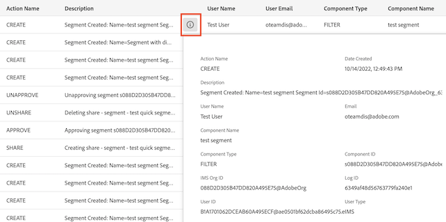
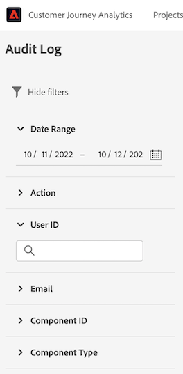

# 監査ログ

Customer Journey Analytics（CJA）では、システムで実行されるアクティビティの透明性と可視性を高めるために、様々なサービスや機能に関するユーザーアクティビティを「監査ログ」の形式で監査できます。これらのログは、問題のトラブルシューティングに役立つ監査証跡を形成し、HIPAA（Health Insurance Portability and Accountability Act）などの企業のデータ管理ポリシーや規制要件への準拠を効果的に行うのに役立ちます。

基本的に、監査ログでは、**誰が** **どの**&#x200B;アクションを、**いつ**&#x200B;実行したかがわかります。ログに記録される各アクションには、アクションのタイプ、日時、アクションを実行したユーザーの電子メール ID、アクションのタイプに関連する追加の属性を示すメタデータが含まれます。

このトピックでは、UI での表示方法や管理方法など、CJA の監査ログについて説明します。

## 監査ログへのアクセス

組織に対してこの機能が有効になっている場合、アクティビティの発生に応じて監査ログが自動的に収集されます。ログ収集を手動で有効にする必要はありません。

監査ログを表示および書き出すには、Adobe コンソールで&#x200B;**[!UICONTROL 監査ログのアクセス]**&#x200B;アクセス制御権限を付与されている必要があります。CJA 機能の個々の権限を管理する方法については、[アクセス制御ドキュメント](/help/getting-started/cja-access-control.md)を参照してください。

## UI での監査ログの表示

CJA で、**[!UICONTROL ツール]**／**[!UICONTROL 監査ログ]**&#x200B;に移動します。

デフォルトでは、今日と昨日の監査ログが表示されます。

右上の列セレクターに移動して、表示する列を選択できます。

## 個別のログエントリに関する情報の表示

説明の横にある情報（i）ボタンをダブルクリックします。

次の項目が表示されます。

| 項目 | 説明 |
| --- | --- |
| アクション名 | 次に、実行可能なアクションのリストを示します。 <ul><li>API_Request</li><li>承認</li><li>作成</li><li>編集</li><li>書き出し</li><li>Login_failed</li><li>Login_successful</li><li>ログアウト</li><li>Org_change</li><li>更新</li><li>共有</li><li>転送</li><li>承認取消</li><li>共有しない</li></ul> |
| 説明 | アクション、コンポーネントタイプ（ID を含む）およびその他の値の概要。 |
| ユーザー名 | アクションを実行するユーザー。 |
| コンポーネントの種類 | 使用可能なコンポーネントタイプは次のとおりです。 <ul><li>注釈</li><li>オーディエンス</li><li>計算指標</li><li>接続</li><li>Data_Group</li><li>Data_View （このコンポーネントタイプには、ディメンションと指標が含まれます）</li><li>Feature_Access</li><li>フィルター</li><li>IMS_Org</li><li>モバイル</li><li>プロジェクト</li><li>レポート</li><li>Scheduled_Project</li><li>ユーザー</li><li>User_Group</li></ul> |
| IMS 組織 ID | 初めてAdobe Experience Cloud にログインしたときにインスタンスに割り当てられる一意の ID です。「xxx@AdobeOrg」の形式である必要があります。 |
| ユーザー ID | このアクションを実行したユーザーを識別する一意の ID。 |
| 作成日 | このアクションが実行されたとき。 |
| 電子メール | アクションを実行するユーザーの電子メール。 |
| コンポーネント ID | アクションを実行するコンポーネントを識別する一意の ID。 |
| ログ ID | このログエントリを識別する一意の ID。 |
| ユーザータイプ | 使用できるタイプ：IMS、OKTA |

### 監査ログのフィルタリング

ファネルアイコン（）を選択して、結果を絞り込むのに役立つフィルターコントロールのリストを表示します。選択した各種フィルターに関係なく、最新 1,000 件のレコードのみが表示されます。

UI の監査イベントには、次のフィルターを使用できます。

| フィルター | 説明 |
| --- | --- |
| [!UICONTROL 日付範囲] | 別の日付を選択するか、複数の日付のカーソルをドラッグして日付範囲を選択して、異なる日付範囲をフィルターします。デフォルトでは、今日と昨日の日付が選択されています。 |
| [!UICONTROL アクション] | 次のアクションの 1 つ以上に対してフィルターを設定します。 <ul><li>API_Request</li><li>承認</li><li>作成</li><li>編集</li><li>書き出し</li><li>Login_failed</li><li>Login_successful</li><li>ログアウト</li><li>Org_change</li><li>更新</li><li>共有</li><li>転送</li><li>承認取消</li><li>共有しない</li></ul> |
| [!UICONTROL ユーザー ID] | 特定のユーザーをユーザー ID でフィルタリングします。ユーザー ID は、ユーザー名の横にある情報（i）ボタンを選択すると見つかります。 |
| [!UICONTROL 電子メール] | 特定のユーザーのメールアドレスに基づいてフィルタリングします。電子メールは、ユーザー名の横にある情報（i）ボタンを選択すると見つかります。 |
| [!UICONTROL コンポーネント ID] | 特定のコンポーネント ID に対してフィルタリングします。コンポーネント ID は、目的のコンポーネントの横にある情報（i）ボタンを選択すると見つかります。 |
| [!UICONTROL コンポーネントの種類] | 1 つ以上のコンポーネントタイプでフィルター処理します。 <ul><li>注釈</li><li>オーディエンス</li><li>計算指標</li><li>接続</li><li>Data_Group</li><li>Data_View</li><li>Feature_Access</li><li>フィルター</li><li>IMS_Org</li><li>モバイル</li><li>プロジェクト</li><li>レポート</li><li>Scheduled_Project</li><li>ユーザー</li><li>User_Group</li></ul> |

{style=&quot;table-layout:auto&quot;}

## 監査ログで記録されるイベントタイプ

次の表に、監査ログでコンポーネントの種類が記録されるアクションの概要を示します。

| コンポーネントの種類 | アクション |
| --- | --- |
| [!UICONTROL 注釈] | <ul><li>作成</li><li>削除</li><li>編集</li></ul> |
| [!UICONTROL オーディエンス] | <ul><li>API_Request</li><li>作成</li><li>削除</li><li>編集</li><li>書き出し</li><li>更新</li></ul> |
| [!UICONTROL 計算指標] | <ul><li>API_Request</li><li>作成</li><li>削除</li><li>編集</li></ul> |
| [!UICONTROL 接続] | <ul><li>API_Request</li><li>作成</li><li>削除</li><li>編集</li></ul> |
| [!UICONTROL データビュー] | <ul><li>API_Request</li><li>作成</li><li>削除</li><li>編集</li></ul> |
| [!UICONTROL 日付範囲] | <ul><li>API_Request</li><li>作成</li><li>削除</li><li>編集</li></ul> |
| [!UICONTROL フィルター] | <ul><li>API_Request</li><li>作成</li><li>削除</li><li>編集</li></ul> |
| [!UICONTROL IMS 組織] | <ul><li>API_Request</li><li>作成</li><li>削除</li><li>編集</li></ul> |
| [!UICONTROL プロジェクト] | <ul><li>API_Request</li><li>作成</li><li>削除</li><li>編集</li></ul> |
| [!UICONTROL レポート] | <ul><li>API_Request</li></ul> |
| [!UICONTROL スケジュール済みプロジェクト] | <ul><li>API_Request</li><li>作成</li><li>削除</li><li>編集</li></ul> |
| [!UICONTROL ユーザー] | <ul><li>API_Request</li><li>作成</li><li>削除</li><li>編集</li></ul> |
| [!UICONTROL ユーザーグループ] | <ul><li>API_Request</li><li>作成</li><li>削除</li><li>編集</li></ul> |

{style=&quot;table-layout:auto&quot;}

## 監査ログのダウンロード

監査ログは CSV 形式または JSON 形式でダウンロードできます。適用されたフィルターまたは選択した列は、ダウンロードされたファイルに反映されます。

1. 画面右上にある「**[!UICONTROL ダウンロード]**」をクリックします。
1. 形式を指定します。
1. もう一度「**[!UICONTROL ダウンロード]**」をクリックします。

## API での監査ログの管理

UI で実行できるすべてのアクションは、API 呼び出しを使用して実行することもできます。詳しくは、[CJA API 参照ドキュメント](https://developer.adobe.com/cja-apis/docs/api/#tag/Audit-Logs)を参照してください。
