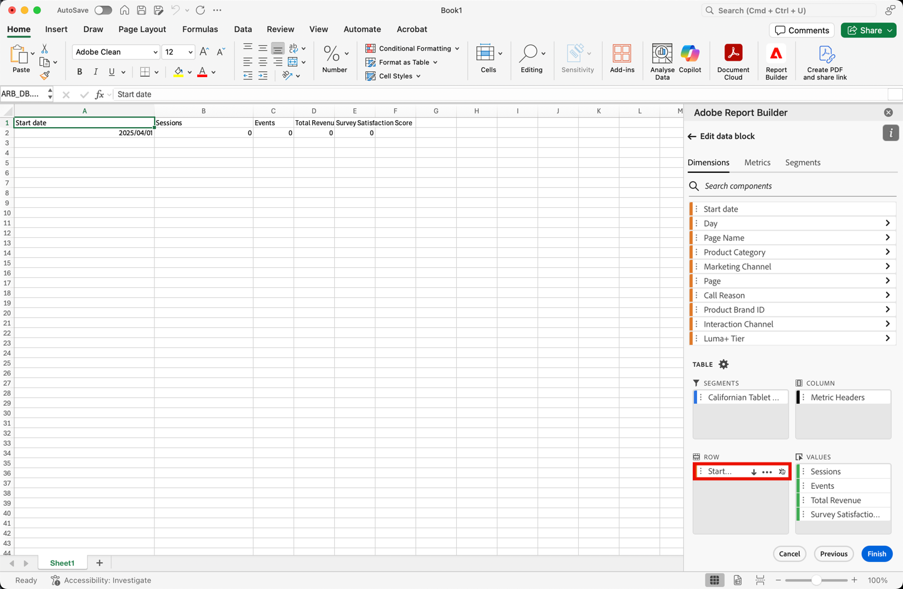

# データブロックの作成

*データブロック*&#x200B;は、単一のデータリクエストによって作成されたデータのテーブルです。Report Builder のワークブックには、複数のデータブロックを含めることができます。データブロックを作成する場合は、まずデータブロックを設定し、次にデータブロックを作成します。

## データブロックの設定

データブロックの場所、データビューおよび日付範囲の初期データブロックパラメーターを設定します。

1.  **[!UICONTROL Create]** を選択します。

   {zoomable="yes"}

1. 「**[!UICONTROL データブロックの場所]**」を設定します。

   「データブロックの場所」オプションは、Report Builderがデータを追加するワークシートの場所を定義します。

   データブロックの場所を指定するには、ワークシート内の 1 つのセルを選択するか、セルのアドレス（`a3`、`\\\$a3`、`a\\\$3`、`sheet1!a2` など）を入力します。 データを取得する際、指定したセルがデータブロックの左上隅になります。

    を使用して、シートで現在選択されているセルからデータブロックの場所を選択します。

1. 「**[!UICONTROL データビュー]**」を選択します。

   「データビュー」オプションを使用すると、ドロップダウンメニューからデータビューを選択したり、セルの場所からデータビューを参照したりできます。

    を選択して、セルからデータビューを作成します。

1. 「**[!UICONTROL 日付範囲]**」を設定します。

   「**[!UICONTROL 日付範囲]**」オプションでは、日付範囲を選択できます。 日付範囲は、固定でも相対日付でも設定できます。

   **[!UICONTROL カレンダー]** を選択してデータ範囲を選択するか、 を使用して日付範囲を手動で入力します。 必要に応じて、「**[!UICONTROL _プリセットを検索_]**」ドロップダウンメニューからプリセットを選択できます。

   「**[!UICONTROL セルから]**」を選択して、現在のシートのセルに基づいて開始データと終了データを定義します。

   日付範囲オプションについて詳しくは、[ 日付範囲の選択 ](select-date-range.md) を参照してください。

1. 「**[!UICONTROL 次へ]**」を選択します。

   

   データブロックを設定したら、ディメンション、指標およびセグメントを選択して、データブロックを作成できます。 **[!UICONTROL ディメンション]**、**[!UICONTROL 指標]** および **[!UICONTROL セグメント]** タブは、**[!UICONTROL テーブル]** ペインの上に表示されます。

## データブロックの作成

データブロックを作成するには、レポートコンポーネントを選択してから、レイアウトをカスタマイズします。

1. **[!UICONTROL ディメンション]**、**[!UICONTROL 指標]** および **[!UICONTROL セグメント]** コンポーネントを追加します。

   コンポーネントリストをスクロールするか、「 **[!UICONTROL _コンポーネントを検索_]**」フィールドを使用してコンポーネントを配置します。 コンポーネントを [!UICONTROL  テーブル ] ペインにドラッグ&amp;ドロップするか、リストでコンポーネント名をダブルクリックして、コンポーネントを [!UICONTROL  テーブル ] ペインに追加します。

   コンポーネントをダブル選択して、テーブルのデフォルトセクションに追加します。

   - 既に列にディメンションがある場合、Dimension コンポーネントは「 **[!UICONTROL Row]**」セクションまたは「 **[!UICONTROL Column]**」セクションに追加されます。
   - 日付コンポーネントが **[!UICONTROL Column]** セクションに追加されます。
   - セグメントコンポーネントが「**[!UICONTROL セグメント]** セクションに追加されます。
   - 指標コンポーネントが「 **[!UICONTROL 値]** セクションに追加されます。

1. 「テーブル」ペインの項目を配置して、データブロックのレイアウトをカスタマイズします。

   「テーブル」ペインの各リスト内でコンポーネントをドラッグ&amp;ドロップしてコンポーネントを並べ替えるか、 を選択して Move up、Move down などを選択してリスト内のコンポーネントを移動します。

   テーブルにコンポーネントを追加すると、データブロックのプレビューがワークシートのデータブロックの場所に表示されます。テーブル内のアイテムを追加、移動、または削除すると、データブロックプレビューのレイアウトが自動的に更新されます。

   

1. 必要に応じて、**[!UICONTROL 開始日]** をディメンションとして設定し、データブロックの開始日を識別します。 開始データをディメンションとして追加すると、定期的にスケジュールされた、周期的な日付範囲を持つレポートがある場合に役立ちます。 または、従来とは異なる日付範囲があり、開始日を明確にする必要がある場合です。

   

1. 必要に応じて、行ヘッダーと列ヘッダーの表示と非表示を切り替えます。 それには、次の手順を実行します。

   1. **[!UICONTROL Table]** settings アイコンを選択します。

      

   1. 「行と列のヘッダーを表示 **[!UICONTROL するオプションをオンまたはオフ]** します。 ヘッダーはデフォルトで表示されます。

1. オプションで、ディメンションラベルと指標ヘッダーの表示/非表示を切り替えることもできます。 それには、次の手順を実行します。

   1. 次元ラベルまたは列ヘッダーの「」を選択して、コンテキスト・メニューを表示します。

      

   1.  **[!UICONTROL Hide]** または  **[!UICONTROL Show]** を選択して、ディメンション ラベルまたは列ヘッダーを切り替えます。 デフォルトでは、すべてのラベルが表示されます。

1. 「**[!UICONTROL 完了]**」を選択して、データブロックの設定を完了します。

1. 分析データの取得中は、処理メッセージ **[!UICONTROL #BUSY]** が表示されます。

   

1. Report Builder は、データを取得し、完了したデータブロックをワークシートに表示します。

   

>[!MORELIKETHIS]
>
>[ データビューを選択 ](select-data-view.md)
>>[日付範囲を選択 ](select-date-range.md)
>>[ディメンションのフィルター ](filter-dimensions.md)
>>[セグメントの操作 ](work-with-filters.md)
>
