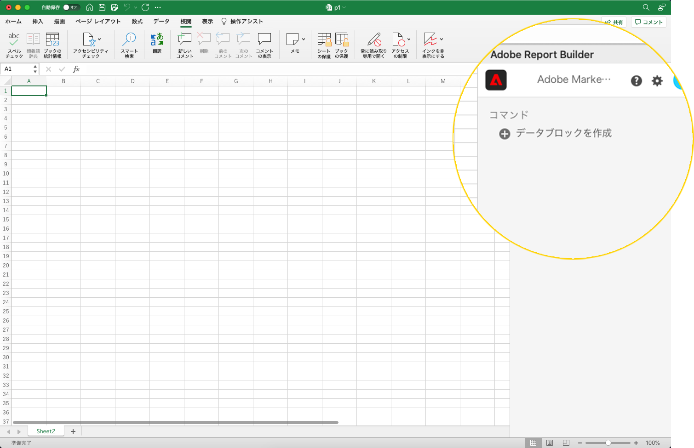
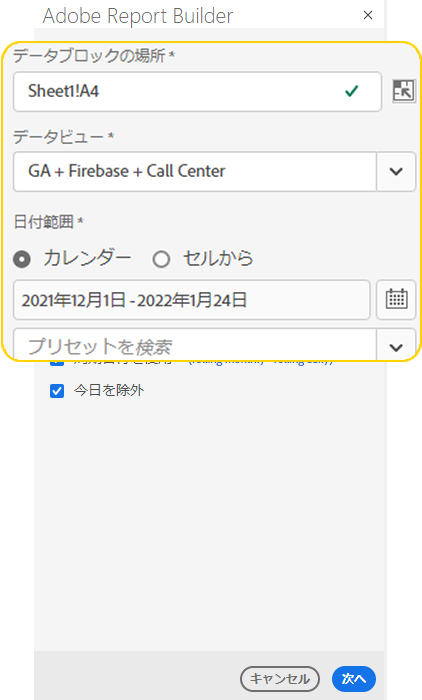
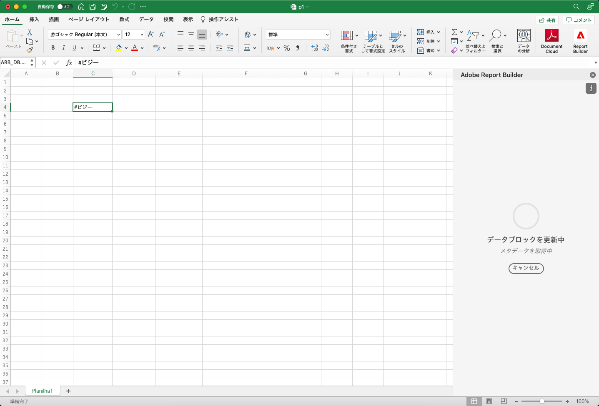
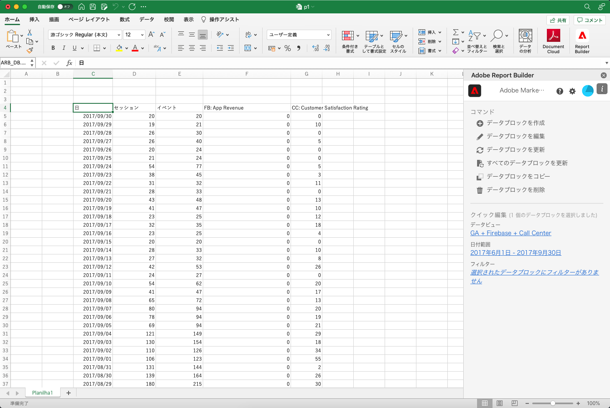

# データブロックの作成

*データブロック* は、単一のデータリクエストで作成されるデータのテーブルです。 Report Builderブックには、複数のデータブロックを含めることができます。 データブロックを作成する場合は、まずデータブロックを設定し、次にデータブロックを作成します。

## データブロックの設定

データブロックの場所、データビュー、および日付範囲の初期データブロックパラメーターを設定します。

1. 「**データブロックを作成**」をクリックします。

   

1. **データブロックの場所** を設定します。

   「データブロックの場所」オプションは、Report Builder がワークシートにデータを追加するワークシートの場所を定義します。

   データ・ブロックの位置を指定するには、ワークシート内の 1 つのセルを選択するか、a3、\\$a3、a\\\$3、sheet1!a2 などのセル・アドレスを入力します。 指定したセルは、データが取得される際に、データブロックの左上隅になります。

1. **データビュー** を選択します。

   「データビュー」オプションを使用すると、ドロップダウンメニューからデータビューを選択したり、セルの場所からデータビューを参照したりできます。

1. **日付範囲** を設定します。

   「日付範囲」オプションでは、日付範囲を選択できます。 日付範囲は、固定または周期的に設定できます。 データ範囲オプションの詳細については、&lt;&lt; 日付範囲へのリンクの節 > を参照してください。

1. 「**次へ**」をクリックします。

   

   データブロックを設定した後、ディメンション、指標およびフィルターを選択して、データブロックを作成できます。 「Dimension」、「指標」および「フィルター」タブは、表ビルダーウィンドウの上に表示されます。
<!--
    
  -->

## データブロックの作成

データブロックを作成するには、レポートのコンポーネントを選択し、レイアウトをカスタマイズします。

1. Dimension、指標およびフィルターを追加します。

   コンポーネントリストをスクロールするか、**検索** フィールドを使用してコンポーネントを検索します。 コンポーネントをテーブルウィンドウにドラッグ&amp;ドロップするか、リスト内のコンポーネント名をダブルクリックして、コンポーネントを自動的にテーブルウィンドウに追加します。

   コンポーネントをダブルクリックして、テーブルのデフォルトのセクションに追加します。

   - Dimensionコンポーネントは、既に列にディメンションがある場合、「行」セクションまたは「列」セクションに追加されます。
   - 日付コンポーネントが「列」セクションに追加されます。
   - フィルターコンポーネントが「フィルター」セクションに追加されます。

1. [ 表 ] ペインの項目を配置して、データブロックのレイアウトをカスタマイズします。

   「テーブル」(Table) ウィンドウでコンポーネントをドラッグ&amp;ドロップしてコンポーネントを並べ替えるか、コンポーネント名を右クリックしてオプションメニューから選択します。

   テーブルにコンポーネントを追加すると、データブロックのプレビューがワークシートのデータブロックの場所に表示されます。 データブロックのプレビューのレイアウトは、テーブル内の項目の追加、移動、削除に合わせて自動的に更新されます。

   

1. 「**完了**」をクリックします。

   分析データの取得中に処理メッセージが表示されます。

   

   Report Builderは、データを取得し、完了したデータブロックをワークシートに表示します。

   
