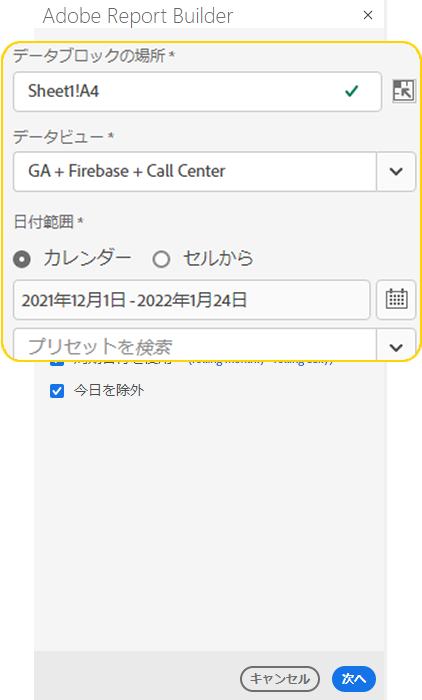
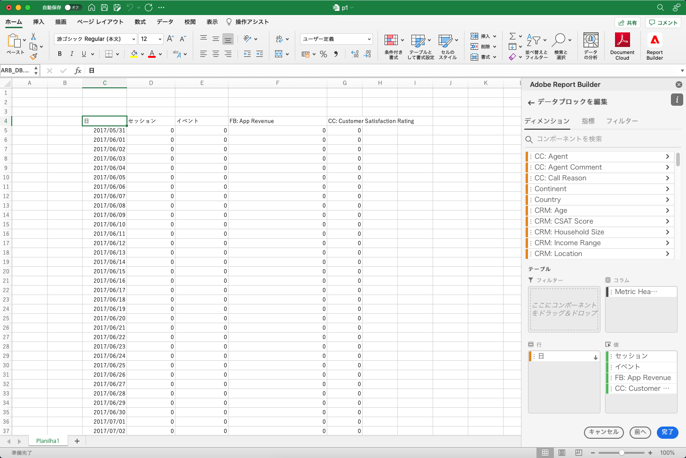
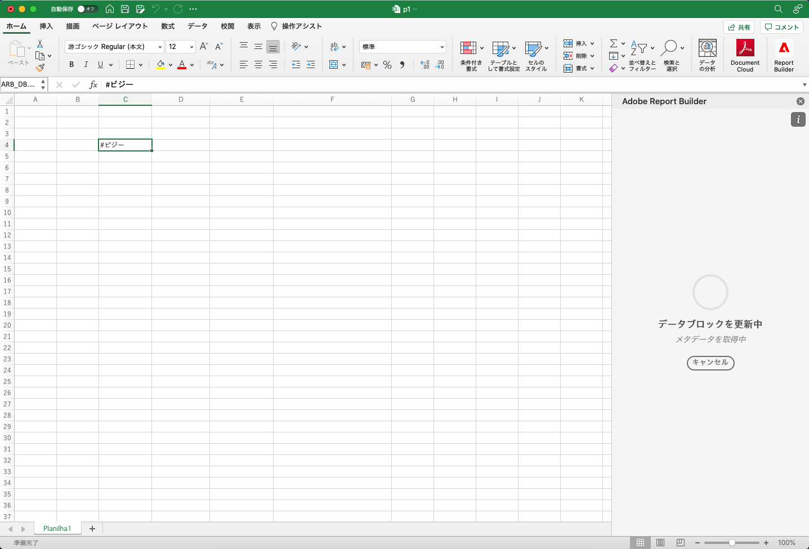
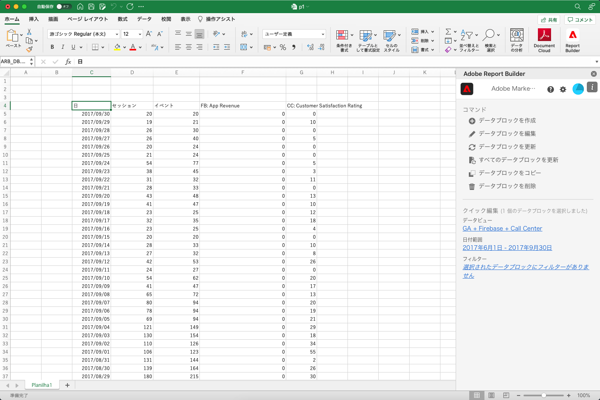

# データブロックの作成

*データブロック*&#x200B;は、単一のデータリクエストによって作成されたデータのテーブルです。 Report Builder のワークブックには、複数のデータブロックを含めることができます。 データブロックを作成する場合は、まずデータブロックを設定し、次にデータブロックを作成します。

## データブロックの設定

データブロックの場所、データビュー、日付範囲の初期データブロックパラメーターを設定します。

1.  **[!UICONTROL Create]**&#x200B;を選択します。

   データブロックを作成オプションを示す{zoomable="yes"}

1. 「**[!UICONTROL データブロックの場所]**」を設定します。

   「データブロックの場所」オプションは、Report Builderがワークシートにデータを追加するワークシートの場所を定義します。

   データブロックの場所を指定するには、ワークシートで1つのセルを選択するか、`a3`、`\\\$a3`、`a\\\$3`、`sheet1!a2`などのセルアドレスを入力します。 指定したセルは、データの取得時にデータブロックの左上隅になります。

   を使用して、シート内で現在選択されているセルからデータブロックの場所を選択します。

1. 「**[!UICONTROL データビュー]**」を選択します。

   「データビュー」オプションを使用すると、ドロップダウンメニューからデータビューを選択したり、セルの場所からデータビューを参照したりできます。

   を選択して、セルからデータビューを作成します。

1. 「**[!UICONTROL 日付範囲]**」を設定します。

   **[!UICONTROL 日付範囲]** オプションを使用すると、日付範囲を選択できます。 日付範囲は、固定でも相対日付でも設定できます。

   **[!UICONTROL カレンダー]**&#x200B;を選択して、を使用してデータ範囲を選択するか、日付範囲を手動で入力します。 オプションで、**[!UICONTROL _プリセットの検索_]** ドロップダウンメニューからプリセットを選択できます。

   「**[!UICONTROL セルから]**」を選択して、現在のシートのセルに基づいて開始データと終了データを定義します。

   日付範囲オプションについて詳しくは、[日付範囲を選択](select-date-range.md)を参照してください。

1. 「**[!UICONTROL 次へ]**」を選択します。

   日付範囲オプションとアクティブな「次へ」ボタンを示す

   データブロックを設定したら、ディメンション、指標、セグメントを選択して、データブロックを構築できます。 **[!UICONTROL ディメンション]**、**[!UICONTROL 指標]**、**[!UICONTROL セグメント]**&#x200B;のタブが&#x200B;**[!UICONTROL テーブル]** ペインの上に表示されます。

## データブロックの作成

データブロックを作成するには、レポートコンポーネントを選択してから、レイアウトをカスタマイズします。

1. **[!UICONTROL ディメンション]**、**[!UICONTROL 指標]**、**[!UICONTROL セグメント]**&#x200B;の各コンポーネントを追加します。

   コンポーネントリストをスクロールするか、 **[!UICONTROL _検索コンポーネント_]** フィールドを使用してコンポーネントを検索します。 コンポーネントを[!UICONTROL  テーブル ] ペインにドラッグ&amp;ドロップするか、リスト内のコンポーネント名をダブル選択して、[!UICONTROL  テーブル ] ペインにコンポーネントを追加します。

   コンポーネントをダブル選択して、テーブルのデフォルトセクションにコンポーネントを追加します。

   - Dimension コンポーネントは、 **[!UICONTROL Row]** セクションまたは **[!UICONTROL Column]** セクションに追加されます（列に既にディメンションがある場合）。
   - 日付コンポーネントが **[!UICONTROL Column]** セクションに追加されます。
   - セグメントコンポーネントが「 **[!UICONTROL セグメント]**」セクションに追加されます。
   - 指標コンポーネントが **[!UICONTROL 値]** セクションに追加されます。

1. 「テーブル」ペインの項目を配置して、データブロックのレイアウトをカスタマイズします。

   テーブルパネルの各リスト内にコンポーネントをドラッグ&amp;ドロップして、コンポーネントを並べ替えるか、を選択し、上に移動、下に移動などを選択して、リスト内のコンポーネントを移動します。

   テーブルにコンポーネントを追加すると、データブロックのプレビューがワークシートのデータブロックの場所に表示されます。 テーブル内のアイテムを追加、移動、または削除すると、データブロックプレビューのレイアウトが自動的に更新されます。

   追加されたコンポーネントと更新されたワークシートを示す

1. 必要に応じて、**[!UICONTROL 開始日]**&#x200B;をデータブロックの開始日を識別するディメンションとして設定します。 開始データをディメンションとして追加すると、定期的にスケジュールされたレポートにローリング日付範囲がある場合に役立ちます。 または、従来とは異なる日付範囲があり、開始日を明確にする必要がある場合。

   ディメンションのリストに開始日が表示されている

1. 必要に応じて、行ヘッダーと列ヘッダーを表示または非表示にします。 それには、次の手順を実行します。

   1. **[!UICONTROL テーブル]** 設定アイコンを選択します。

      テーブル設定オプションを示す

   1. 「**[!UICONTROL 行と列のヘッダーを表示]**」オプションをオンまたはオフにします。 ヘッダーはデフォルトで表示されます。

1. 必要に応じて、ディメンションのラベルと指標ヘッダーを表示または非表示にすることもできます。 それには、次の手順を実行します。

   1. ディメンション ラベルまたは列ヘッダーのを選択して、コンテキスト メニューを表示します。

      

   1. ディメンションのラベルまたは列ヘッダーを切り替えるには、 **[!UICONTROL Hide]**&#x200B;または **[!UICONTROL Show]**&#x200B;を選択します。 すべてのラベルはデフォルトで表示されます。

1. 「**[!UICONTROL 完了]**」を選択して、データブロックの設定を完了します。

1. 分析データの取得中に、処理メッセージ **[!UICONTROL #BUSY]**&#x200B;が表示されます。

   

1. Report Builder は、データを取得し、完了したデータブロックをワークシートに表示します。

   

>[!MORELIKETHIS]
>
>[ データビューを選択](select-data-view.md)
>[日付範囲の選択](select-date-range.md)
>[ディメンションのフィルタリング](filter-dimensions.md)
>[セグメントの操作](work-with-filters.md)
>
