# ディメンションフィルター

デフォルトでは、テーブルの各ディメンション項目は、そのディメンションの上位 10 項目を返します。

各ディメンションに対して返されるディメンション項目を変更するには

1. データブロックを選択し、「コマンド」パネルの「データブロックを編集」をクリックします。

1. 「次へ」をクリックして、「ディメンション」タブを表示します。

1. テーブルのコンポーネント名の横にある「**...**」アイコンをクリックします。

   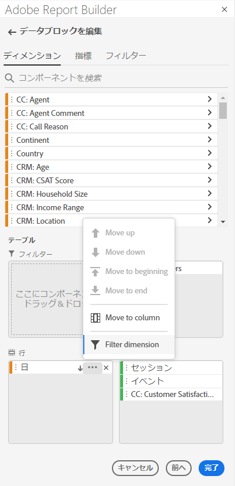

1. ポップアップメニューで「**フィルターディメンション**」を選択し、「**フィルターディメンション**」ペインを表示します。

1. 「**一番人気**」または「**特定**」を選択します。

   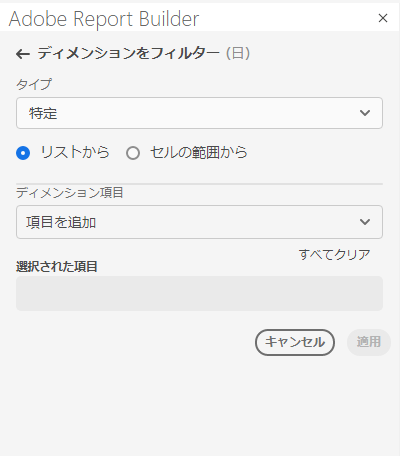

1. 選択したフィルタータイプに基づいて適切なオプションを選択します。

1. 「**適用**」をクリックして、フィルターを追加します。

   Report Builder は、追加したフィルターを確認する通知を表示します。

適用したフィルターを表示するには、ディメンションの上にカーソルを合わせます。フィルターが適用されたディメンションには、ディメンション名の右側にフィルターアイコンが表示されます。

## フィルタータイプ

ディメンション項目をフィルタリングするには、「一番人気」と「特定」の 2 つの方法があります。

## 一番人気

「一番人気」オプションを使用すると、指標値に基づいてディメンション項目を動的にフィルタリングできます。一番人気フィルターでは、指標値に基づいて、最もランクの高いディメンション項目を返します。デフォルトでは、最初の 10 個のディメンション項目が、データブロックに追加された最初の指標によって並べ替えられ、一覧表示されます。

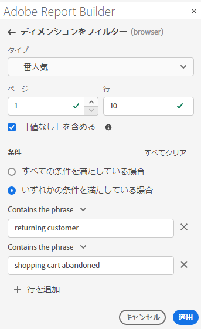

### ページと行のオプション

「**ページ**」および「**行**」フィールドを使用して、データをシーケンシャルグループまたはページに分割します。これにより、最上位の値以外のランク付けされた行の値をレポートに取り込むことができます。この機能は、50,000 行の制限を超えるデータを取り込む場合に特に便利です。

#### ページと行のデフォルト

- ページ = 1
- 行 = 10

「ページ」と「行」のデフォルト設定では、各ページに 10 行のデータがあることを示しています。ページ 1 は上位 10 項目を返し、ページ 2 は次の 10 項目を返します。

下のテーブルに、ページと行の値の例と、結果の出力を示します。

| ページ | 行 | 出力 |
|------|--------|----------------------|
| 1 | 10 | 上位 10 項目 |
| 2 | 10 | 項目 11 ～ 20 |
| 1 | 100 | 上位 100 項目 |
| 2 | 100 | 101 ～ 200 番目の項目 |
| 2 | 50,000 | 50,001 ~ 100,000 番目の項目 |

#### 最小値と最大値

- 開始ページ：最小 = 1、最大：5,000 万
- 行数：最小 = 1、最大：50,000

### 「値なし」を含める

Customer Journey Analytics では、一部のディメンションは「値なし」のエントリを収集します。このフィルターを使用すると、これらの値をレポートから除外できます。例えば、製品の SKU キーに基づく製品名の分類などの分類を作成できます。特定の製品 SKU が特定の製品名分類で設定されていない場合、その製品名の値は「値なし」に設定されます。

デフォルトでは「**値なし**」を含めるが選択されています。値なしのエントリを除外するには、このオプションの選択を解除します。

### 条件でフィルタリング

ディメンション項目は、すべての条件を満たしているか、またはいずれかの条件を満たしているかに基づいてフィルタリングできます。

フィルター条件を設定するには

1. ドロップダウンリストから演算子を選択します。

   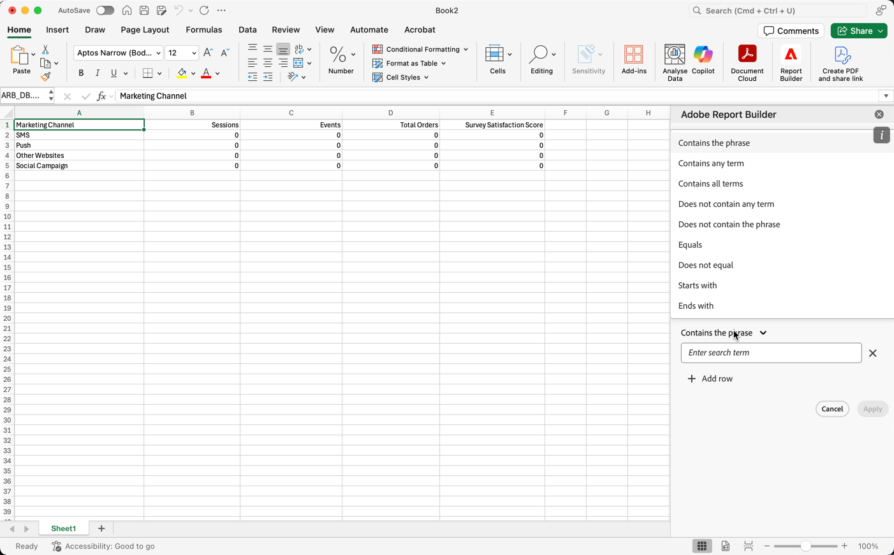

1. 検索フィールドに値を入力します。

1. 「行を追加」をクリックして選択を確定し、別の条件項目を追加します。

1. 「削除」アイコンをクリックして、条件項目を削除します。

   最大 10 個の条件項目を含めることができます。

### フィルターと並べ替え順の変更

データブロックのフィルタリングと並べ替えに使用する指標の横に矢印が表示されます。 矢印の方向は、指標を最大から最小、最小から最大のどちらの順序で並べ替えるかを示します。

並べ替え方向を変更するには、指標の横にある矢印をクリックします。 

データブロックのフィルタリングと並べ替えに使用する指標を変更するには

1. テーブルビルダーで目的の指標コンポーネントにカーソルを合わせると、追加のオプションが表示されます。

2. 目的の指標の矢印をクリックします。 

   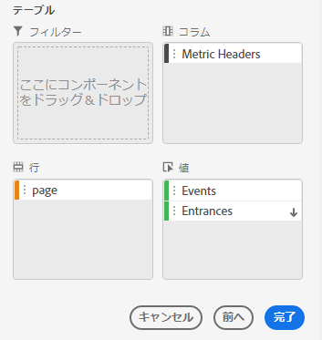

## 具体的なフィルター

「特定」オプションを使用すると、各ディメンションに固定のディメンション項目のリストを作成できます。「**特定**」のフィルタリングタイプを使用して、フィルターに含める正確なディメンション項目を指定します。リストまたはセル範囲から項目を選択できます。

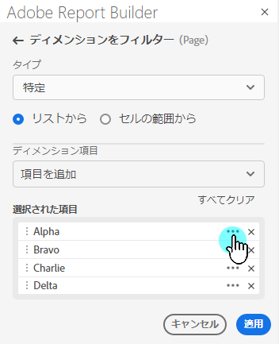

### リストから

1. 「**リストから**」オプション選択して、ディメンション項目を検索および選択します。

   「**リストから**」オプションを選択すると、リストには、イベント数が最も多いディメンション項目が最初に表示されます。

   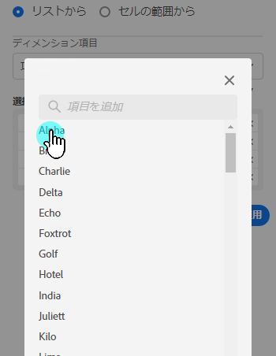

   **利用可能な項目**&#x200B;リストは、イベントの多いディメンション項目から少ないディメンション項目へと並べ替えられます。

1. 検索語句を「**項目の追加**」フィールドに入力してリストを検索します。

1. 過去 90 日間のデータに含まれていない項目を検索するには、「**過去 6 か月間の項目を表示**」をクリックして、検索範囲を広げます。

   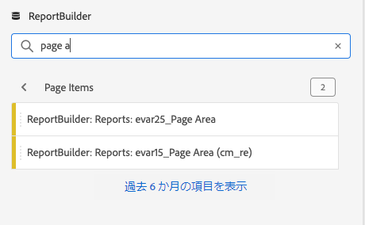

   過去 6 か月のデータの読み込み後、Report Builder は「**過去 18 か月間の項目を表示**」するリンクを更新します。

1. ディメンション項目を選択します。

   選択したディメンション項目は、**選択した項目**&#x200B;リストに自動的に追加されます。

   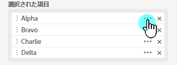

   リストから項目を削除するには、削除アイコンをクリックして、リストから項目を削除します。

   リスト内の項目を移動するには、項目をドラッグ＆ドロップするか、「...」をクリックして移動メニューを表示します。

   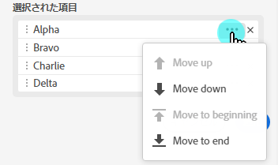

1. 「**適用**」をクリックします

   Report Builder はリストを更新し、適用した特定のフィルタリングを表示します。

### セルの範囲から

「**セルの範囲から**」オプションを選択して、一致するディメンション項目のリストを含むセルの範囲を選択します。

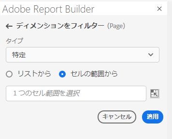

セルの範囲を選択する場合は、次の制限事項を考慮してください。

- 範囲には少なくとも 1 つのセルが必要です。
- 50,000 個を超えるセルを範囲に含めることはできません。
- 範囲は、連続した単一の行または列にする必要があります。

選択範囲には、空のセルまたは特定のディメンション項目と一致しない値を持つセルを含めることができます。

### テーブルビルダーの「ディメンション」タブから

「**ディメンション**」タブで、ディメンション名の横にある山形記号のアイコンをクリックして、ディメンション項目のリストを表示します。

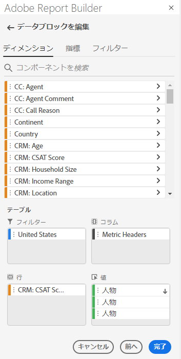

項目を&#x200B;**テーブル**&#x200B;にドラッグ＆ドロップするか、項目名をダブルクリックして **テーブル**&#x200B;ビルダーに追加できます。
