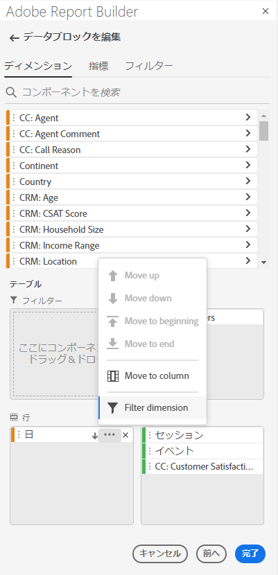
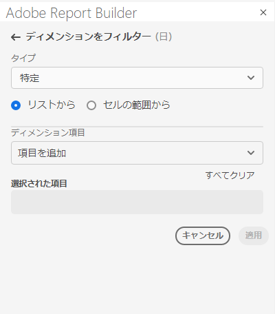
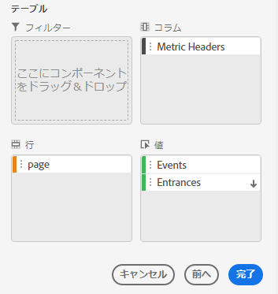
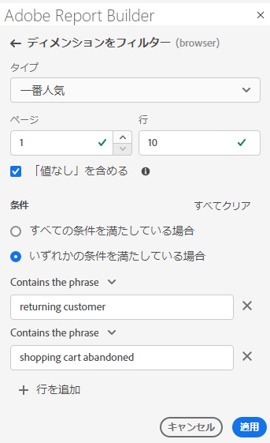
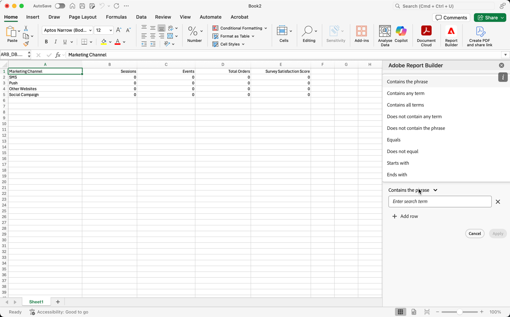
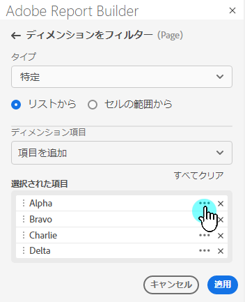
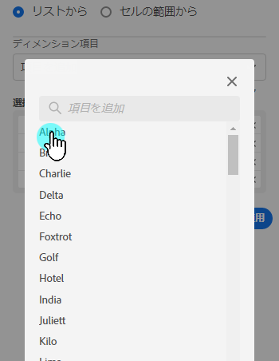
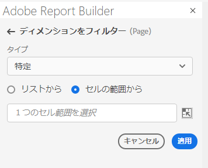

# ディメンションのフィルタリング

デフォルトでは、テーブルの各ディメンション項目は、そのディメンションの上位 10 項目を返します。

各ディメンションに対して返されるディメンション項目を変更するには：

1. データブロックのセルを選択します。

1. **[!UICONTROL コマンド]** パネルで「 **[!UICONTROL データブロックを編集]**」を選択します。

1. 「**[!UICONTROL 次へ]**」を選択して、**[!UICONTROL ディメンション]** タブを表示します。

1. テーブル内のコンポーネント名の横にあるを選択します。

   {zoomable="yes"}

1. ポップアップメニューで「**[!UICONTROL フィルターディメンション]**」を選択して、**[!UICONTROL フィルターディメンション]** ペインを表示します。

1. **[!UICONTROL タイプ]**&#x200B;として、**最も人気のある**&#x200B;または&#x200B;**特定**&#x200B;を選択します。

   {zoomable="yes"}

1. 選択した[ フィルタータイプ ](#filter-type)に基づいて、適切なオプションを選択します。

1. フィルターを追加するには、**[!UICONTROL 適用]**&#x200B;を選択します。

1. Report Builder は、追加したフィルターを確認する通知を表示します。

適用したフィルターを表示するには、ディメンションの上にカーソルを合わせます。 フィルターが適用されたディメンションには、ディメンション名の横に フィルターアイコンが表示されます。

## フィルターと並べ替え順序の変更

データブロックのフィルタリングと並べ替えに使用される指標の横にまたはが表示されます。 矢印の方向は、指標が昇順または降順で並べ替えられるかどうかを示します。

並べ替え順序を変更するには：

- 指標の横にあるまたはを選択して、並べ替え順序を切り替えます。

データブロックのフィルタリングと並べ替えに使用する指標を変更するには：

1. テーブルビルダーで目的の指標コンポーネントにカーソルを合わせると、追加のオプションが表示されます。

2. を選択して、好みの指標を指定します。

   {zoomable="yes"}

## フィルタータイプ

ディメンション項目をフィルタリングするには、次の2つの方法があります。[最も人気のある](#most-popular)と[特定](#specific-filtering)

### **[!UICONTROL 一番人気]**

**[!UICONTROL 最も人気のある]** オプションを使用すると、指標の値に基づいてディメンション項目を動的にフィルターできます。 最も人気の高いディメンションは、指標の値に基づいて、最もランクの高いディメンション項目を返します。 デフォルトでは、最初の 10 個のディメンション項目が、データブロックに追加された最初の指標によって並べ替えられ、一覧表示されます。

{zoomable="yes"}

#### ページと行のオプション

「**[!UICONTROL ページ]**」および「**[!UICONTROL 行]**」フィールドを使用して、データをシーケンシャルグループまたはページに分割します。 この機能を使用すると、最上位の値以外のランク付けされた行の値をレポートに取り込むことができます。 特に、50,000行の制限を超えるデータを引き出す場合に便利です。

ページのデフォルトは`1`、行のデフォルトは`10`です。 これらのデフォルトは、各ページに10行のデータがあることを意味します。 ページ 1 は上位 10 項目を返し、ページ 2 は次の 10 項目を返します。

下のテーブルに、ページと行の値の例と、結果の出力を示します。

| ページ | 行 | 出力 |
|------|--------|----------------------|
| 1 | 10 | 上位 10 項目 |
| 2 | 10 | 項目 11 ～ 20 |
| 1 | 100 | 上位 100 項目 |
| 2 | 100 | 101 ～ 200 番目の項目 |
| 2 | 50,000 | 50,001 ~ 100,000 番目の項目 |

次の表に、ページと行の最小値と最大値を示します。

|       | 最小値 | 最大値 |
|-------|---------------:|---------------:|
| 開始ページ | 1 | 5000万 |
| 行数 | 1 | 50,000 |

#### 「値なし」を含める

Customer Journey Analyticsでは、一部のディメンションで&#x200B;*値なし* エントリが収集されます。 **[!UICONTROL 値を含めない]**&#x200B;設定を使用すると、これらの値をレポートから除外できます。 例えば、製品の SKU キーに基づく製品名の分類などの分類を作成できます。 特定の製品SKUが特定の製品名分類で設定されていない場合、その製品名の値は&#x200B;*値なし*&#x200B;に設定されます。

**[!UICONTROL デフォルトで「値なし」を含める]**&#x200B;が選択されています。 値なしのエントリを除外するには、このオプションの選択を解除します。

#### 条件でフィルタリング

ディメンション項目は、すべての条件を満たしているか、またはいずれかの条件を満たしているかに基づいてフィルタリングできます。

フィルタリング条件を設定するには：

1. オペレータードロップダウンメニューからオペレーターを選択します。 デフォルトでは、**[!UICONTROL フレーズを含む]**&#x200B;が選択されています

   {zoomable="yes"}

1. 検索語を入力します。

1. 「 **[!UICONTROL 行を追加]**」を選択して選択を確定し、別の条件項目を追加します。

1. を選択して、条件項目を削除します。

最大 10 個の条件項目を含めることができます。

### **[!UICONTROL 固有]**

**[!UICONTROL Specific]** オプションを使用すると、各ディメンションのディメンション項目の固定リストを作成できます。 「**[!UICONTROL 特定]**」のフィルタリングタイプを使用して、フィルターに含める正確なディメンション項目を指定します。 リストまたはセル範囲から項目を選択できます。

{zoomable="yes"}

#### リストから

1. 「**[!UICONTROL リストから]**」オプション選択して、ディメンション項目を検索および選択します。

   「**リストから**」オプションを選択すると、**[!UICONTROL Dimension項目]** リストに、イベント数で順序付けされたディメンション項目が入力されます。

   {zoomable="yes"}

1.  **[!UICONTROL _項目を追加_]**&#x200B;に検索語句を入力して、リストを検索します。

1. 過去90日間のデータに含まれていない項目を検索するには、**[!UICONTROL 過去6か月間の項目を表示]**&#x200B;を選択して検索を拡張します。 過去6か月間のデータが読み込まれると、Report Builderはリンクを&#x200B;**[!UICONTROL 過去18か月間のアイテムを表示]**&#x200B;に更新します。

1. **[!UICONTROL 選択した項目]** リストから項目を削除するには、を選択します。

1. **[!UICONTROL 選択した項目]** リスト内の項目を移動するには、項目をドラッグ&amp;ドロップするか、を選択してコンテキストメニューを表示し、移動オプションから選択します。

1. 「**[!UICONTROL 適用]**」を選択します。

Report Builder はリストを更新し、適用した特定のフィルタリングを表示します。

#### セルの範囲から

「**セルの範囲から**」オプションを選択して、一致するディメンション項目のリストを含むセルの範囲を選択します。

{zoomable="yes"}

セルの範囲を選択する場合は、次の制限事項を考慮してください。

- 範囲には少なくとも 1 つのセルが必要です。
- 50,000 個を超えるセルを範囲に含めることはできません。
- 範囲は、連続した単一の行または列にする必要があります。

選択範囲には、空のセルまたは特定のディメンション項目と一致しない値を持つセルを含めることができます。

### ディメンションをすばやくフィルター

現在フィルターが適用されていないディメンションをフィルターするには：

1. ディメンションのを選択します。 例：**[!UICONTROL インタラクションチャネル]**。

1. フィルターに追加するディメンション項目をダブルクリックします。 または、1つ以上のディメンション項目を選択し、選択範囲を **[!UICONTROL Row]** セクションにドラッグ&amp;ドロップします。

   {zoomable="yes"}

