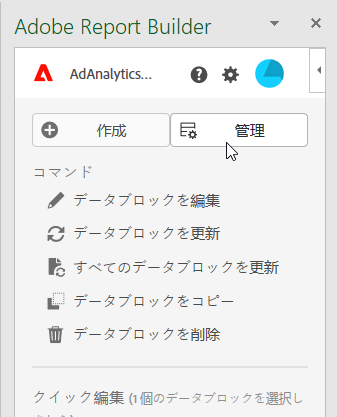
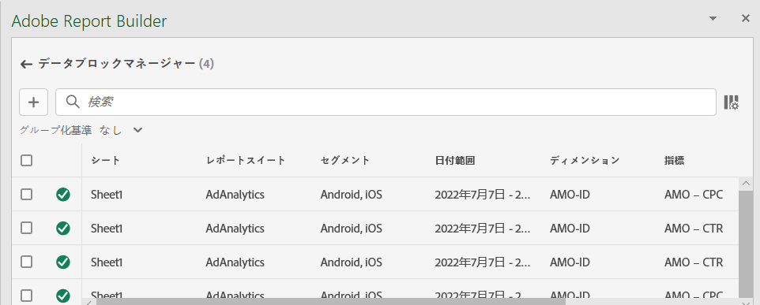
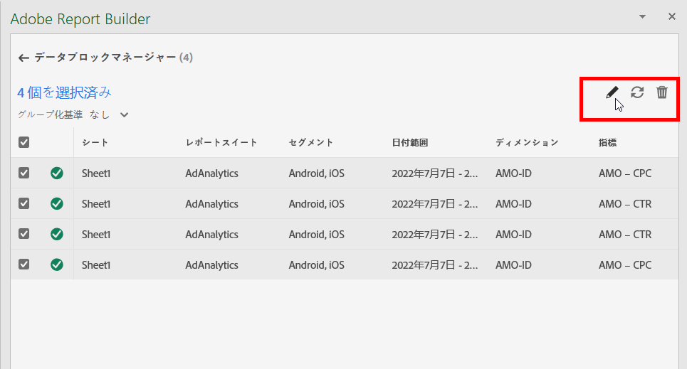
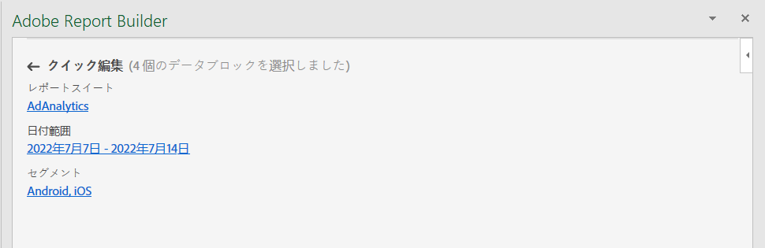
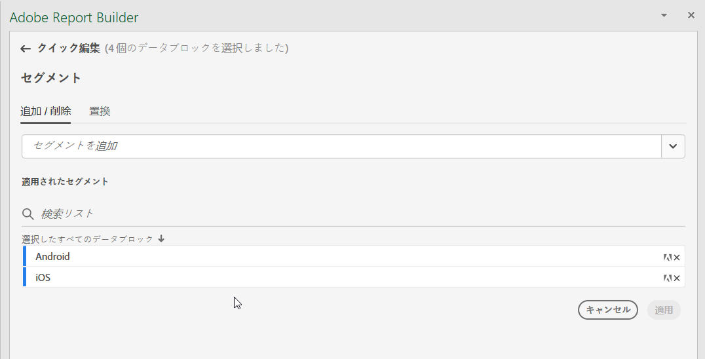
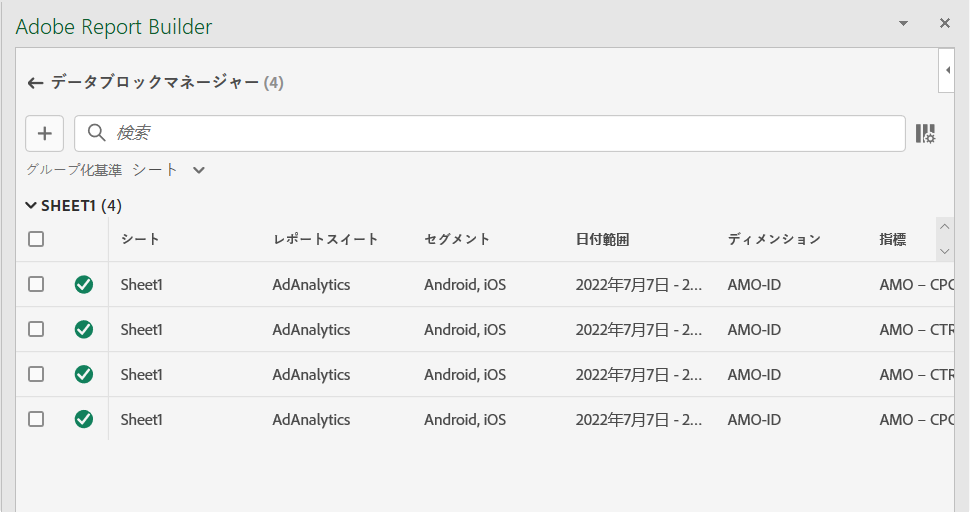

# データブロックの管理

[!UICONTROL &#x200B; データブロックマネージャー]を使用して、ブック内のすべてのデータブロックを表示および管理できます。 [!UICONTROL &#x200B; データブロックマネージャー]には、特定のデータブロックを検索できる検索、フィルター、並べ替え機能が用意されています。 1 つまたは複数のデータブロックを選択した後、選択したデータブロックを編集、削除、または更新できます。

## データブロックを表示

ブック内のすべてのデータブロックをリストするテーブルを表示するには、 **[!UICONTROL Manage]**&#x200B;を選択します。

{zoomable="yes"}

**[!UICONTROL データブロックマネージャー]**&#x200B;には、ワークブック内に存在するすべてのデータブロックを含むテーブルが表示されます。

{zoomable="yes"}

を使用して、表示する列を選択できます。

## データブロックの並べ替え

表示されている列でデータブロックテーブルをソートできます。 例えば、データビュー、セグメント、日付範囲などの変数ごとにデータブロックを並べ替えることができます。

データブロックテーブルを並べ替えるには、列見出しを選択します。 同じ列見出しを選択して、並べ替え順序を反転します。

## データブロックを検索

 **[!UICONTROL _検索_]** フィールドを使用して、データブロックテーブル内の任意の項目を検索します。 例えば、データブロックやデータビューに含まれる指標を検索できます。 また、日付範囲、変更日または最終実行日の列に表示される日付を検索することもできます。

## データブロックを編集

データブロックのデータビューと日付範囲を編集できます。 データブロックに適用されたセグメントがあります。

例えば、既存のセグメントを1つ以上のデータブロック内の新しいセグメントに置き換えることができます。

1. 更新するデータブロックを選択します。 最上位のチェックボックスを選択してすべてのデータブロックを選択するか、個々のデータブロックを選択できます。

   {zoomable="yes"}

1. を選択して、**[!UICONTROL クイック編集]** ウィンドウを表示します。

   {zoomable="yes"}

1. データビュー、日付範囲、またはセグメントを更新するリンクを選択します。 **[!UICONTROL クイック編集]** - **[!UICONTROL セグメント]**&#x200B;では、選択したデータブロックのセグメントを追加、削除、または更新できます。

   {zoomable="yes"}

## データブロックを更新

「」を選択して、データブロックテーブルを更新します。

データブロックが更新されているかどうかを確認するには、更新ステータスアイコンを表示します。

- データ ブロックが正常に更新されると、が表示されます。

- 更新に失敗したデータブロックには、が表示されます。

## データブロックを削除

1つ以上のデータブロックを削除するには：

1. 1つ以上のデータブロックを選択します。
1. 「」を選択します。
1. **[!UICONTROL データブロックを削除]** ダイアログで&#x200B;**[!UICONTROL 削除]**&#x200B;を選択するか、**[!UICONTROL キャンセル]**&#x200B;を選択して削除をキャンセルします。

## データブロックをグループ化

データブロックは、**[!UICONTROL 別にグループ化]** ドロップダウンメニューを使用してグループ化するか、列タイトルを選択できます。

列ごとにデータブロックを並べ替えるには、列タイトルを選択します。 データブロックをグループ別にグループ化するには、**[!UICONTROL グループ化の条件]**&#x200B;ドロップダウンメニューからグループ名を選択します。 例えば、以下のスクリーンショットは、データビュー別にグループ化されたデータブロックを示しています。

グループ化を使用すると、セグメントなどの共通エレメントを変更するデータブロックをすばやく選択できます。

{zoomable="yes"}

