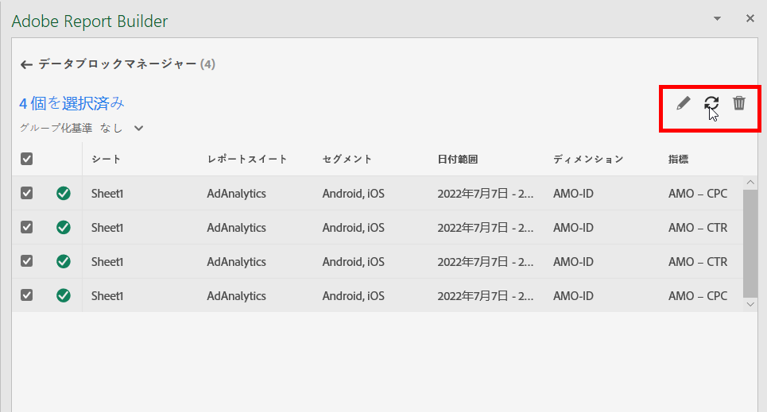

# Report Builder 内のデータブロックの管理

データブロックマネージャを使用すると、ブック内のすべてのデータブロックを表示および管理できます。データブロックマネージャには、特定のデータブロックをすばやく見つけ出すための検索、フィルター、並べ替え機能が用意されています。1 つまたは複数のデータブロックを選択した後、選択したデータブロックを編集、削除、または更新できます。

## データブロックを表示

「**管理**」をクリックして、ブック内のすべてのデータブロックの一覧を表示します。

データブロックマネージャには、ブックに存在するすべてのデータブロックが一覧表示されます。 

## データブロックリストの並べ替え

表示された列でデータブロックリストを並べ替えることができます。例えば、データビュー、フィルター、日付範囲およびその他の変数でデータブロックリストを並べ替えることができます。

データブロックリストを並べ替えるには、列見出しをクリックします。

## データ検索ブロックリスト

「検索」フィールドを使用して、データブロックテーブル内の項目を検索します。例えば、データブロックやデータビューに含まれる指標を検索できます。 また、日付範囲、変更日または最終実行日の列に表示される日付を検索することもできます。

## データブロックの編集

1 つ以上のデータブロックに適用したデータビュー、日付範囲、フィルターを編集できます。

例えば、1 つ以上のデータブロック内で、既存のフィルターを新しいフィルターに置き換えることができます。

1. 更新するデータブロックを選択します。最上位のチェックボックスを選択してすべてのデータブロックを選択するか、個々のデータブロックを選択できます。

   

1. 編集アイコンをクリックして、クイック編集ウィンドウを表示します。

   

1. データビュー、日付範囲、フィルターを更新するには、フィルターリンクを選択します。

   

## データブロックの更新

更新アイコンをクリックして、リスト内のデータブロックを更新します。

データブロックが更新されたかどうかを確認するには、更新ステータスアイコンを確認します。緑の円のチェックマーク  は、データブロックの更新が成功したことを示します。更新に失敗したデータブロックには、警告アイコン   が表示されます。これにより、データブロックにエラーがあるかどうかを簡単に識別できます。

## データブロックの削除

選択したデータブロックを削除するには、ごみ箱アイコンをクリックします。

## データブロックのグループ化

**グループ化の条件**&#x200B;ドロップダウンメニューを使用するか、列タイトルをクリックして、データブロックをグループ化できます。データブロックを列で並べ替えるには、列タイトルをクリックします。データブロックをグループ別にグループ化するには、**グループ化の条件**&#x200B;ドロップダウンメニューからグループ名を選択します。例えば、以下のスクリーンショットは、シート別にグループ化されたデータブロックを示しています。シート 1 とシート 2 でグループ化されたデータブロックが表示されます。例えば、フィルター置き換えのユースケースで役立ちます。各データブロックに複数のフィルターを適用する場合は、置き換えるすべてのデータブロックを含むグループを作成すると便利です。その後で、すべてを一度に簡単に選択および編集できます。

## Data Block Manager ビューの変更

Data Block Manager ウィンドウに表示される列を修正できます。

列リストをクリックします。  アイコンをクリックして、データブロックマネージャに表示する列を選択します。列名を選択して列を表示します。列名の選択を解除し、列を表示から削除します。

