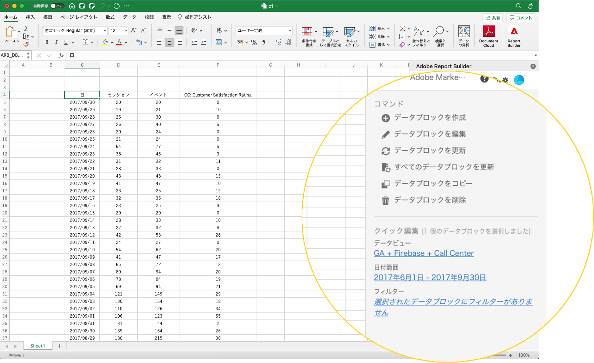

# Report Builderハブ

Report Builderハブを使用して、データブロックの作成、更新、削除をおこないます。

Report Builderハブには、コマンドパネルとクイック編集パネルが含まれています。



## コマンドパネル

選択したセルまたは前の操作と互換性のあるコマンドにアクセスするには、[ コマンド ] パネルを使用します。


### コマンド

| 表示されるコマンド | 次の場合に使用できます。 | 目的 |
|------|------------------|--------|
| データブロックの作成 | ワークブック内で 1 つ以上のセルが選択されています。 | データブロックの作成に使用 |
| データブロックの編集 | 選択したセル範囲は、1 つのデータブロックの一部です。 | データブロックの編集に使用 |
| データブロックの更新 | 選択範囲に少なくとも 1 つのデータブロックが含まれています。 このコマンドは、選択範囲内のデータブロックのみを更新します。 | 1 つ以上のデータ・ブロックの更新に使用 |
| すべてのデータブロックの更新 | ブックには、1 つ以上のデータブロックが含まれています。 | ブック内のすべてのデータブロックを更新するために使用します |
| データブロックのコピー | 選択したセルまたはセル範囲は、1 つ以上のデータブロックの一部です。 | データ・ブロックのコピーに使用 |
| データブロックの削除 | 選択したセル範囲は、1 つのデータブロックの一部です。 | データブロックの削除に使用 |

## クイック編集パネル

スプレッドシートで 1 つ以上のデータブロックを選択すると、Report Builderに「クイック編集」パネルが表示されます。 [ クイック編集 ] パネルを使用して、1 つのデータブロック内のパラメータを変更したり、複数のデータブロック内のパラメータを同時に変更したりできます。


[ クイック編集 ] セクションを使用して行った変更は、選択したすべてのデータブロックに適用されます。

### データビュー

データブロックは、選択したデータビューからデータを取り込みます。 ワークシートで複数のデータブロックを選択し、同じデータビューからデータを取り込まない場合、**データビュー** リンクに「*複数*」と表示されます。

データ・ビューを変更すると、選択したデータ・ブロックのすべてが新しいデータ・ビューを採用します。 データブロック内のコンポーネントは、例えば ```evars``` と一致する ID に基づいて、新しいデータビューと一致します。 コンポーネントがデータブロック内に見つからない場合は、警告メッセージが表示され、コンポーネントがデータブロックから削除されます。

データビューを変更するには、ドロップダウンメニューから新しいデータビューを選択します。


### 日付範囲

**日付範** 囲は、選択したデータブロックの日付範囲を表示します。複数の日付範囲を持つ複数のデータブロックが選択されている場合、**日付範囲** リンクには「*複数*」と表示されます。

### フィルター

**Filters** リンクには、選択したデータブロックで使用されるフィルタの概要リストが表示されます。 複数のフィルターを適用して複数のデータブロックを選択した場合、**Filters** リンクに *Multiple* が表示されます。
