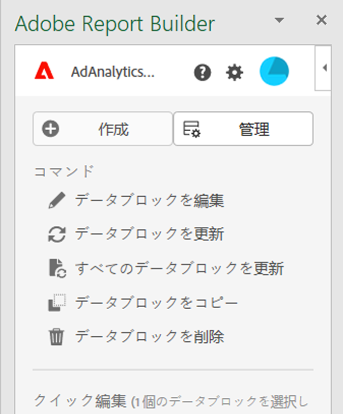
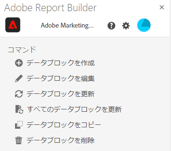
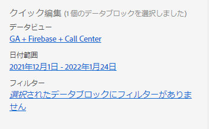
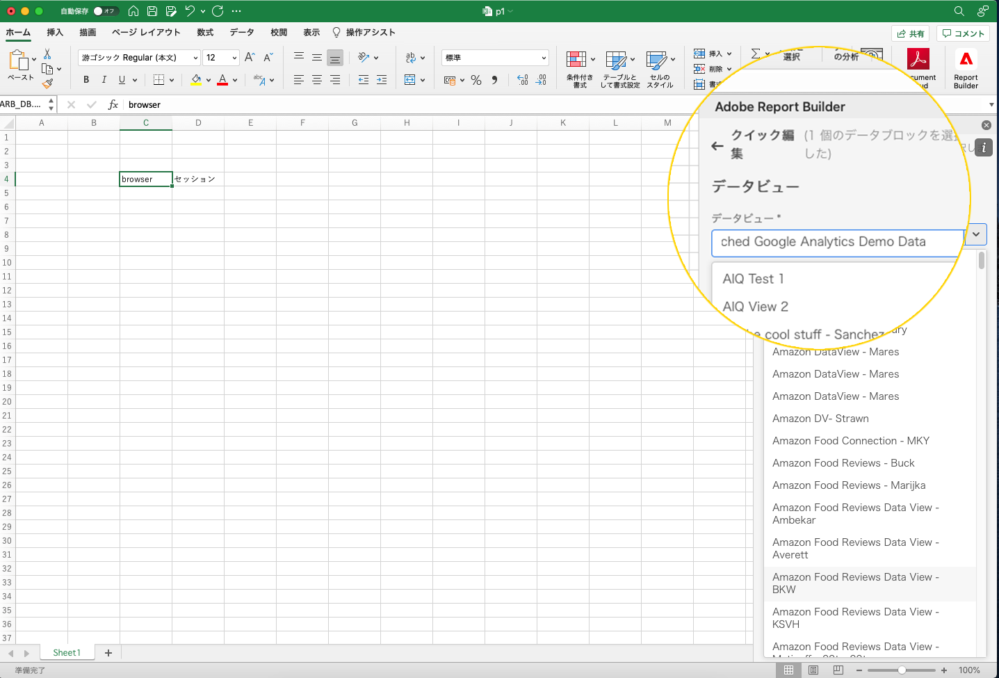

# Report Builder ハブ

Use the Report Builder hub to create, update, delete, and manage data blocks.

The Report Builder hub contains the Create and Manage buttons, the COMMANDS list, and the QUICK EDIT panels.




## Create and Manage buttons

新しいデータブロックを作成したり、既存のデータブロックを管理するには、「作成」または「管理」ボタンを使用します。

## コマンドパネル

コマンドパネルを使用して、選択したセルまたは以前のアクションと互換性のあるコマンドにアクセスします。



### コマンド

| 表示されるコマンド | 使用条件... | 目的 |
|------|------------------|--------|
| データブロックの作成 | ワークブック内で 1 つ以上のセルが選択されている。 | データブロックの作成に使用 |
| データブロックの編集 | 選択したセル範囲が、1 つのデータブロックのみの一部である。 | データブロックの編集に使用 |
| データブロックの更新 | 選択範囲に少なくとも 1 つのデータブロックが含まれている。 コマンドは、選択範囲内のデータブロックのみを更新します。 | 1 つ以上のデータブロックの更新に使用 |
| すべてのデータブロックの更新 | ワークブックには、1 つ以上のデータブロックが含まれています。 | ワークブック内のすべてのデータブロックを更新するために使用 |
| データブロックのコピー | 選択したセルまたはセル範囲は、1 つ以上のデータブロックの一部です。 | データブロックのコピーに使用 |
| データブロックの削除 | 選択したセル範囲が、1 つのデータブロックのみの一部である。 | データブロックの削除に使用 |

## クイック編集パネル

スプレッドシートで 1 つ以上のデータブロックを選択すると、Report Builder に「クイック編集」パネルが表示されます。「クイック編集」パネルを使用して、1 つのデータブロック内のパラメーターを変更したり、複数のデータブロック内のパラメーターを同時に変更したりできます。



「クイック編集」セクションを使用して行った変更は、選択したすべてのデータブロックに適用されます。

### データビュー

データブロックは、選択したデータビューからデータを取り込みます。ワークシートで複数のデータブロックが選択されていて、それらが同じデータビューからデータを取り込まない場合、「**データビュー**」リンクに「*複数*」と表示されます。

データビューを変更すると、選択範囲内のすべてのデータブロックに新しいデータビューが採用されます。データブロック内のコンポーネントは、ID に基づいて新しいデータビューと照合されます（例えば、```evars``` の照合) 。コンポーネントがデータブロック内に見つからない場合は、警告メッセージが表示され、コンポーネントがデータブロックから削除されます。

データビューを変更するには、ドロップダウンメニューから新しいデータビューを選択します。



### 日付範囲

**日付範囲**&#x200B;は、選択したデータブロックの日付範囲を表示します。複数の日付範囲を持つ複数のデータブロックが選択されている場合、「**日付範囲**」リンクに「*複数*」と表示されます。

### フィルター

「**フィルター**」リンクには、選択したデータブロックで使用されているフィルタの概要リストを表示されます。複数のフィルターが適用された状態で複数のデータブロックが選択されている場合、「**フィルター**」リンクには、「*複数*」と表示されます。
