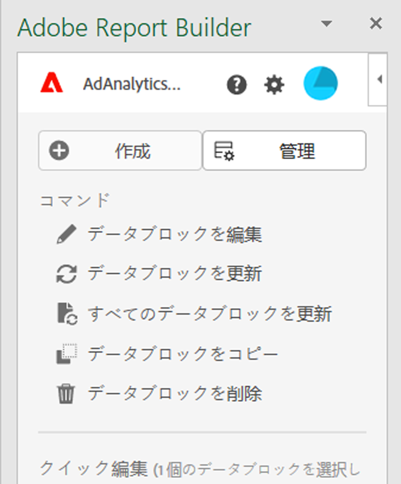

# Report Builder ハブ

Report Builder ハブは、Excel リボン バーから **[!UICONTROL Report Builder]**&#x200B;を選択すると、Excel ブック内に表示される右側のペインです。

Report Builder ハブを使用して、データブロックの作成、更新、管理を行います。

Report Builder ハブには、 **[!UICONTROL Create]**、 **[!UICONTROL Manage]**&#x200B;および **[!UICONTROL スケジュール]** ボタン、**[!UICONTROL コマンド]** パネル、および&#x200B;**[!UICONTROL クイック編集]** パネルが含まれています。

{zoomable="yes"}

選択

*  **[!UICONTROL Create]** ～ [新しいデータブロックを作成](create-a-data-block.md)。
*  **[!UICONTROL Manage]** ～ [既存のデータブロックを管理](manage-reportbuilder.md)。
*  **[!UICONTROL スケジュール]** ～ [電子メールでワークブックを送信するスケジュールを管理](schedule-reportbuilder.md)。

## コマンドパネル

**[!UICONTROL コマンド]** パネルを使用して、選択したセルまたは以前のアクションと互換性のあるコマンドにアクセスします。

| コマンド | 使用条件... | 目的 |
|------|------------------|--------|
|  **[!UICONTROL データブロックを編集]** | 選択したセル範囲が、1 つのデータブロックのみの一部である。 | を使用してデータブロックを編集します。 |
|  **[!UICONTROL データブロックを更新]** | 選択範囲に少なくとも 1 つのデータブロックが含まれている。 このコマンドは、選択範囲のデータブロックのみを更新します。 | を使用して、1つ以上のデータブロックを更新します。 |
|  **[!UICONTROL すべてのデータブロックを更新]** | ワークブックには、1 つ以上のデータブロックが含まれています。 | を使用して、ブック内のすべてのデータブロックを更新します |
|  **[!UICONTROL ワークブックを送信]** | ワークブックには、1 つ以上のデータブロックが含まれています。 | を使用すると、ワークブックを電子メール ](schedule-reportbuilder.md)でファイルとして送信できます。[ |
|  **[!UICONTROL データブロックをコピー]** | 選択したセルまたはセル範囲は、1 つ以上のデータブロックの一部です。 | を使用して、データブロックをコピーします。 |
|  **[!UICONTROL データブロックをカット]** | 選択したセルまたはセル範囲は、1 つ以上のデータブロックの一部です。 | データブロックをカットする場合に使用します。 |
|  **[!UICONTROL データブロックを削除]** | 選択したセル範囲が、1 つのデータブロックのみの一部である。 | データブロックの削除に使用 |

## クイック編集パネル

スプレッドシートで1つ以上のデータブロックを選択すると、Report Builderに&#x200B;**[!UICONTROL クイック編集]** パネルが表示されます。 **[!UICONTROL クイック編集]** パネルを使用すると、1つ以上のデータブロック内のパラメーターを同時に変更できます。

**[!UICONTROL クイック編集]** セクションを使用する際に行った変更は、選択したすべてのデータブロックに適用されます。

### データビュー

データブロックは、選択したデータビューからデータを取得します。 ワークシートで複数のデータブロックが選択されていて、同じデータビューからデータを取得しない場合、**データビュー** リンクに&#x200B;**[!UICONTROL _Multiple_]**&#x200B;と表示されます。

データビューを変更すると、選択範囲内のすべてのデータブロックに新しいデータビューが採用されます。 データブロック内のコンポーネントは、IDに基づいて新しいデータビューと照合されます。 データブロック内にコンポーネントが見つからない場合、そのコンポーネントは削除され、**[!UICONTROL 無効な値]**&#x200B;に置き換えられるか、特定のコンポーネントにが表示されます。

データビューを変更するには、**[!UICONTROL データビュー]** ドロップダウンメニューから新しいデータビューを選択します。

### 日付範囲

**日付範囲**&#x200B;は、選択したデータブロックの日付範囲を表示します。 複数の日付範囲を持つ複数のデータブロックが選択されている場合、**[!UICONTROL 日付範囲]** リンクには&#x200B;**[!UICONTROL _複数_]**&#x200B;が表示されます。

### セグメント

**セグメント** リンクには、選択したデータブロックで使用されているセグメントの概要リストが表示されます。 複数のセグメントを適用して複数のデータブロックを選択した場合、**セグメント** リンクには&#x200B;**[!UICONTROL _複数_]**&#x200B;が表示されます。

>[!MORELIKETHIS]
>
>[ データビューの選択](select-data-view.md)
>[日付範囲の選択](select-date-range.md)
>[フィルターの操作](work-with-filters.md)
>
