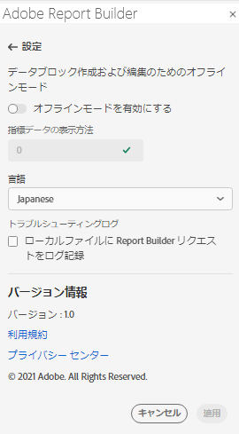
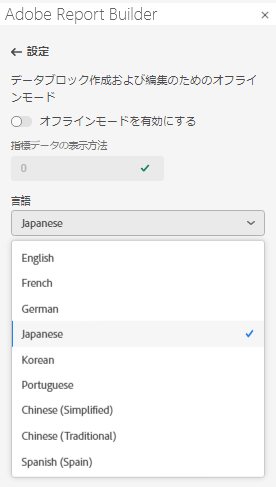

# Report Builder設定

**設定** ウィンドウを使用して、UI で表示される言語や、オフラインモードで動作するかどうかなど、アプリケーションレベルの設定を行います。 設定は直ちに適用され、変更されるまで、今後のすべてのセッションに対して設定されます。

Report Builder設定を変更するには

1. **設定** アイコンをクリックします。

1. 「オフラインモードを有効にする」、「言語」の選択、または「トラブルシューティングログ設定」に変更を加えます。

1. 「**適用**」をクリックします。

   

## オフラインモード

オフラインモードでデータブロックを作成および編集する場合、データは取得されません。 代わりに、シミュレーションデータを使用して、リクエストの実行を待たずに、データブロックをすばやく作成および編集できます。 オンラインに戻ると、*Refresh data block* コマンドまたは *Refresh all data blocks* コマンドは、実際のデータで作成したデータブロックを更新します。

オフラインモードを有効にするには

1. **設定** アイコンをクリックします。

1. 「**オフラインモードを有効にする**」を選択します。

1. 「**指標データを** として表示」フィールドに正の整数を入力します。

1. 「**適用**」をクリックします。

## 言語

言語 UI の言語を選択できます。 サポートされているAdobe Analyticsの言語はすべて利用できます。

言語 UI で使用するReport Builderを選択するには

1. 「設定」をクリックします。

1. 「**言語**」ドロップダウンメニューから言語を選択します。

   

1. **適用をクリックします。**

## トラブルシューティング

Troubleshooting 設定を使用して、すべてのクライアント/サーバーデータをローカルファイルに記録します。 サポートチケットの解決に役立つように、このオプションを使用します。

「トラブルシューティング」オプションを有効にするには、「**Report builder リクエストをローカルファイルに記録**」を選択します。
