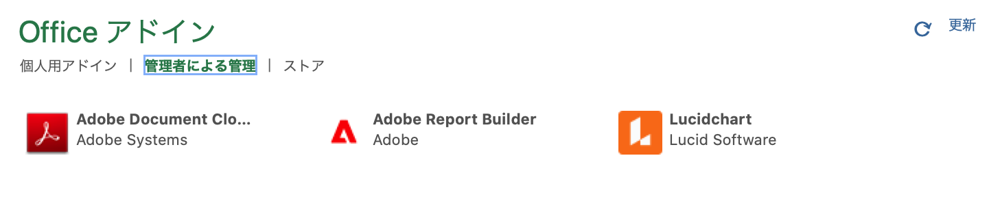
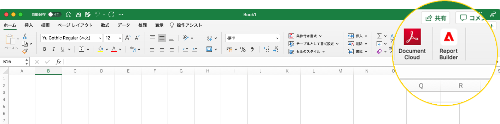
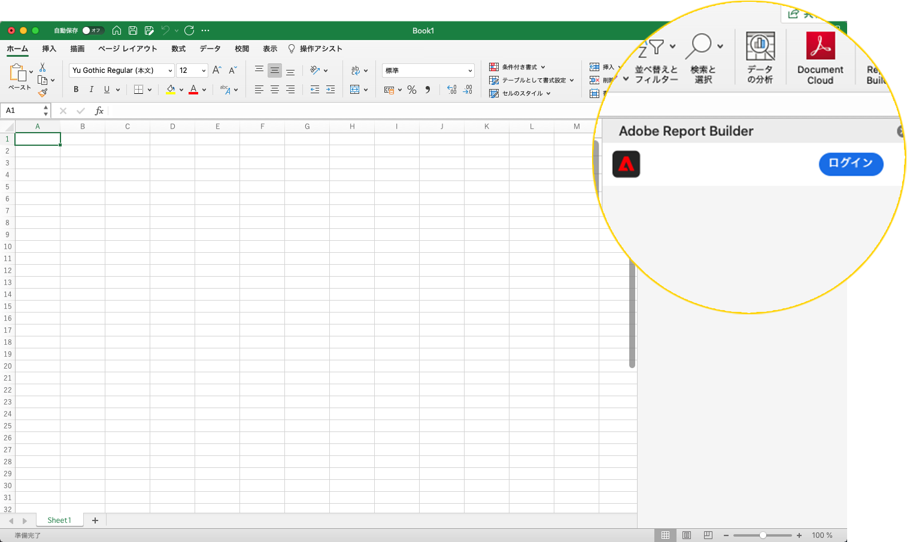
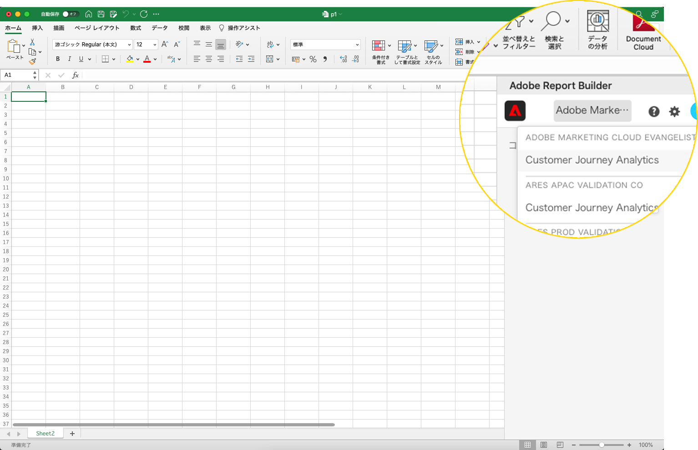
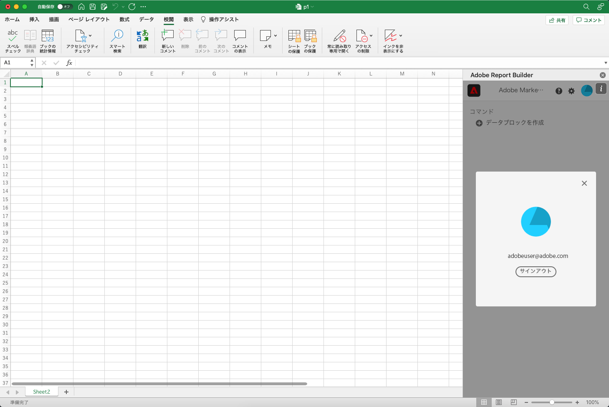

# Report Builderの設定

Excel のアドインメニューを使用して、Report Builderにすばやくアクセスできます。

## 要件

Customer Journey AnalyticsのReport Builderは、次のオペレーティングシステムおよび Web ブラウザーでサポートされています。

### macOS

- macOSバージョン 10.x 以降
- すべての Excel バージョン

### Windows

- Windows 10、バージョン 1904 以降
- Excel バージョン 2106 以降

   このアドインを使用するには、Windows デスクトップ Excel ユーザーがMicrosoft Edge Webview2 をインストールする必要があります。 コントローラをインストールするには：

   1. <http://aka.ms/webview2installer> にアクセスします。
   1. エバーグリーンスタンドアロンインストーラを選択してダウンロードします。
   1. インストールの指示に従います。

### Web Office

- すべてのブラウザーとバージョンをサポート

## Report BuilderExcel アドイン

Customer Journey AnalyticsにReport Builderを使用するには、Excel アドインをReport Builderする必要があります。 Excel アドインのReport Builderをインストールすると、開いている Excel ブック内からReport Builderにアクセスできます。

### Report Builderアドインのダウンロードとインストール

Report Builderアドインをダウンロードしてインストールするには

1. Excel を起動し、新しいワークブックを開きます。

1. 挿入/アドインの取得を選択します。

1. Office アドインダイアログで、「ストア」タブを選択します。

1. 「Report Builder」を検索し、「追加」をクリックします。

1. [ ライセンス条件とプライバシーポリシー ] ダイアログボックスで、[ 続行 ] をクリックします。

**「ストア」タブが表示されない場合**

1. Excel で、ファイル/アカウント/設定を管理を選択します。

1. 「オプションの接続されたエクスペリエンスを有効にする」の横のボックスをオンにします。

1. Excel を再起動します。

**組織がMicrosoftストアへのアクセスをブロックしている場合**

IT またはセキュリティチームに連絡して、Report Builderアドインの承認をリクエストします。 承認が与えられたら、Office アドインダイアログで、「管理者管理」タブを選択します。

Report Builderアドインをインストールすると、Report Builderアイコンが Excel の [ ホーム ] タブのリボンに表示されます。

## Report Builderへのログイン

オペレーティングプラットフォームまたはReport Builder for Excel用のブラウザアドインをインストールした後、次の手順に従ってReport Builderにログインします。

1. Excel ブックを開きます。

1. Report Builderアイコンをクリックして、Report Builderを起動します。

1. Adobe Report Builderのツールバーで、「**ログイン**」をクリックします。

   

1. Adobe Experience ID アカウント情報を入力します。 アカウント情報は、アカウントの資格情報と一致するCustomer Journey Analyticsの資格情報です。

   

ログインすると、ログインアイコンと組織がパネルの上部に表示されます

## 組織の切り替え

最初にログインすると、プロファイルに割り当てられたデフォルトの組織にログインします。

1. ログイン時に表示される組織の名前をクリックします。

1. 使用可能な組織のリストから組織を選択します。 アクセス権を持つ組織のみが表示されます。

   

## ログアウト

ユーザープロファイルからReport Builderからサインアウトできます。

1. 開いているワークブックに対する変更を保存します。

1. アバターアイコンをクリックして、ユーザープロファイルを表示します。

   

1. 「**ログアウト**」をクリックします。
