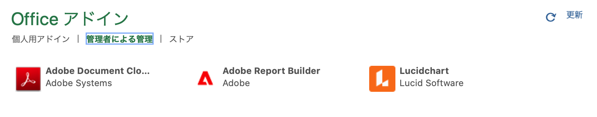
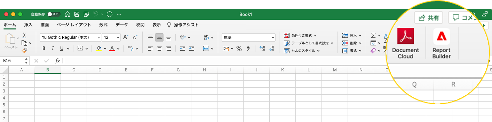
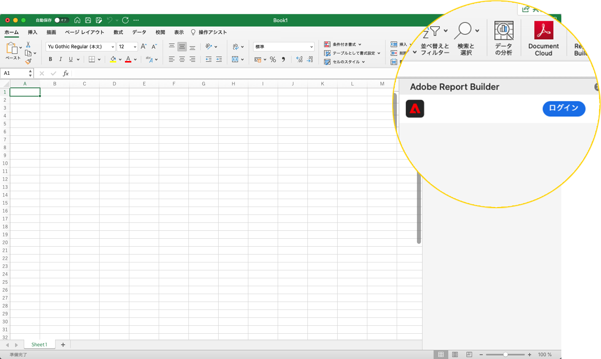
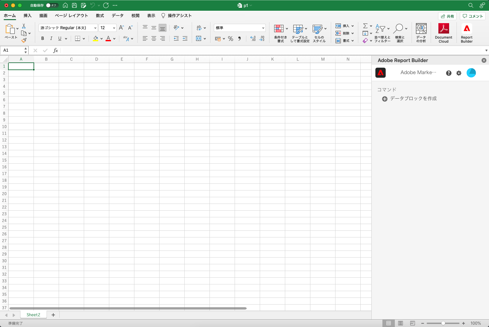
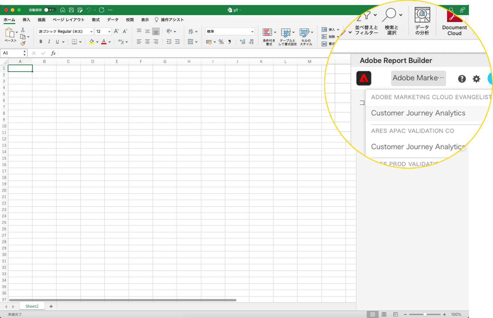
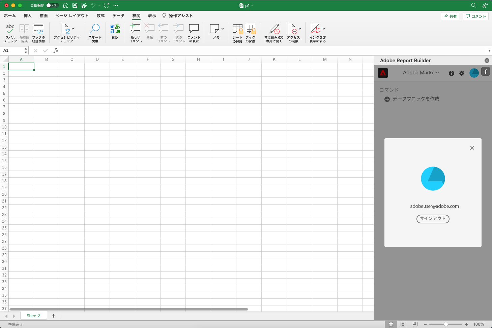

# Report Builder の設定

この記事では、Microsoft ExcelでCustomer Journey Analytics用Report Builderを使用する要件について説明します。 アドインのインストール方法や設定方法を説明します。

## 要件

Report Builder Customer Journey Analytics版は、次のオペレーティングシステムおよびWeb ブラウザーでサポートされています。

### macOS

- macOS バージョン 10.x 以降
- すべての Excel バージョン

### Windows

- Windows 10、バージョン 1904 以降
- Excel バージョン 2106 以降

  すべての Windows デスクトップ Excel ユーザーは、アドインを使用するために Microsoft Edge Webview2 をインストールする必要があります。 インストールするには：

   1. <https://developer.microsoft.com/en-us/microsoft-edge/webview2/> にアクセスします。
   1. お使いのプラットフォームに適したバージョンの&#x200B;**[!UICONTROL Evergreen Standalone Installer]**&#x200B;を選択してダウンロードします。
   1. インストーラーを実行し、インストールプロンプトに従います。

### Web Office

- すべてのブラウザーとバージョンをサポートしています。

## Report Builder Excel アドイン

Report Builder Excel アドインをインストールして、Report Builder for Customer Journey Analyticsを使用します。 Report Builder Excel アドインをインストールすると、開いているExcel ブック内からReport Builderにアクセスできます。

### Report Builder アドインのダウンロードとインストール

Report Builder アドインをダウンロードしてインストールするには

1. Excel を起動し、新しいワークブックを開きます。

1. メインメニューから&#x200B;**[!UICONTROL 挿入]**/**[!UICONTROL アドイン]**/**[!UICONTROL アドインを取得]**&#x200B;を選択します。

1. Office アドインダイアログで、「**[!UICONTROL ストア]**」タブを選択します。

1. `Report Builder`を検索し、**[!UICONTROL 追加]**&#x200B;を選択します。

1. ライセンス条件とプライバシーポリシーのダイアログボックスで、**[!UICONTROL 続行]**&#x200B;を選択します。

「**[!UICONTROL ストア]**」タブが表示されない場合：

1. Excelで、メインメニューから&#x200B;**[!UICONTROL ファイル]** > **[!UICONTROL アカウント]** > **[!UICONTROL 設定を管理]**&#x200B;を選択します。

1. 「**[!UICONTROL オプションの接続されたエクスペリエンスを有効にする]**」の横にあるチェックボックスをオンにします。

1. Excel を再起動します。

お客様の組織がMicrosoft ストアへのアクセスをブロックする場合：

- Report Builder アドインの承認を依頼するには、IT部門またはセキュリティ部門にお問い合わせください。 承認が付与されたら、Office **[!UICONTROL アドイン]** ダイアログで「**[!UICONTROL 管理者管理]**」タブを選択します。

  {zoomable="yes"}

Report Builder アドインをインストールすると、**[!UICONTROL ホーム]** タブの下のExcel リボンに **[!UICONTROL Report Builder]** アイコンが表示されます。

{zoomable="yes"}

## Report Builder へのログイン

オペレーティングシステムまたはブラウザーにReport Builder for Excel アドインをインストールしたら、次の手順に従ってReport Builderにログインします。

1. Excel ワークブックを開きます。

1.  **[!UICONTROL Report Builder]**&#x200B;を選択して、Report Builderを起動します。

1. Adobe Report Builder ツールバーから、「**[!UICONTROL ログイン]**」を選択します。

   {zoomable="yes"}

1. Adobeのアカウント情報を入力します。 アカウント情報は、Customer Journey Analytics の資格情報と一致する必要があります。

   {zoomable="yes"}

ログインすると、パネルの上部にログインアイコンと組織が表示されます

## 組織の切り替え

最初にログインすると、プロファイルに割り当てられたデフォルトの組織、またはログインフローの一部として選択した組織にログインします。

1. ログイン時に表示される組織の名前を選択します。

1. 使用可能な組織のリストから組織を選択します。 自身がアクセス権を持っている組織のみが表示されます。

   {zoomable="yes"}

## ログアウト

Report Builderからログアウトするには：

1. 開いているワークブックに加えた変更を保存します。

1. アバターアイコンを選択して、ユーザープロファイルを表示します。

   {zoomable="yes"}

1. **[!UICONTROL ログアウト]**&#x200B;を選択します。
