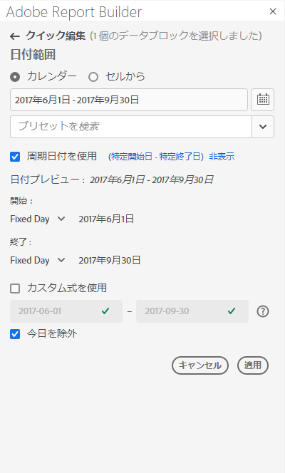
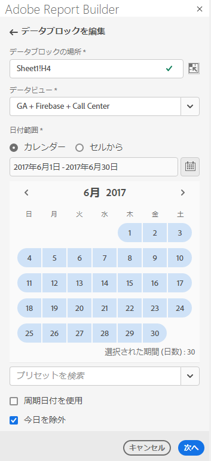
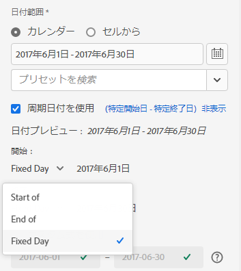
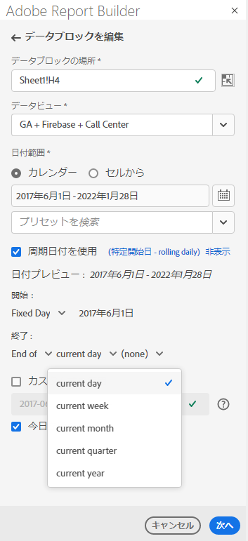
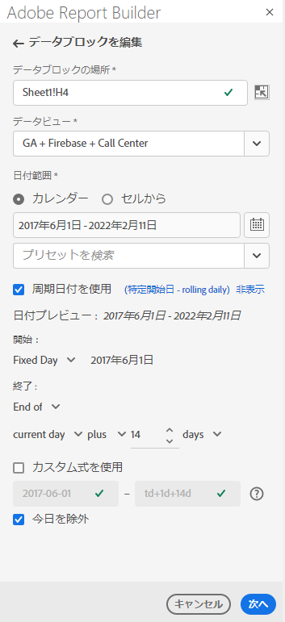
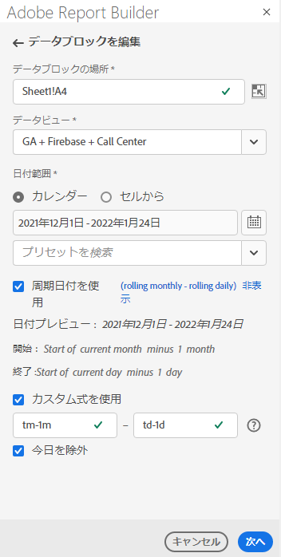
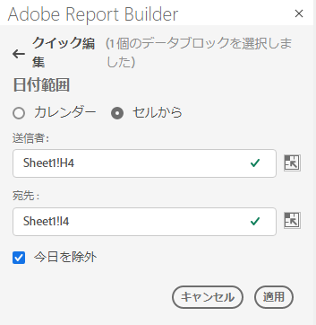

# 日付範囲の選択

既存のデータ・ブロックの日付範囲を変更するには、「データ・ブロックの編集」を選択するか、クイック編集パネルを使用します。

データ・ブロックの日付範囲を変更するには、次のオプションを使用します。

**カレンダー**

カレンダーでは、次のオプションを使用して、静的または相対日付を作成できます。

- 日付範囲フィールド
- カレンダー
- プリセットドロップダウンメニュー
- 周期的な日付モード
- 式のカスタマイズ


**セルから**

「セルから選択」オプションを使用すると、ワークシートのセルに入力した日付を参照できます。

選択した日付範囲の今日を除外するオプションがあります。



## カレンダーの使用

**カレンダー** を使用すると、日付範囲フィールドにデータブロックリクエストの現在の日付範囲が表示されます。 日付は、「日付範囲」フィールドに直接入力するか、データ範囲選択オプションを使用します。

### 日付範囲フィールド

日付を日付範囲フィールドに直接入力するには

1. カレンダーアイコンの横にある日付範囲フィールドをクリックします。

1. 日付範囲の開始日と終了日を入力します。

### カレンダー

カレンダーを使用して日付を選択するには

1. カレンダーアイコンをクリックして、月別のカレンダーを表示します。

1. 開始日をクリックします。

1. 終了日をクリックします。

日付範囲を逆に設定するには、終了日を最初にクリックし、開始日をクリックします。



### プリセットドロップダウンメニュー

プリセットドロップダウンメニューには、保存したデータビューまたは自分と共有したデータビューの、プリセット日付範囲と日付範囲コンポーネントの標準セットが含まれます。

### 相対日付

「相対日付」オプションでは、相対日付を使用して日付範囲を選択できます。

1. 「**相対日付を使用**」を選択します。

1. 開始日と終了日を周期的に表す式を選択します。

   

   **** の開始日 — 日、週、月、四半期、年の開始日を選択できます。

   **** の終わり — 日、週、月、四半期、年の終わりを選択できます。

   **固定日** ：他の日付が周期的な間、開始日と終了日を固定できます。

1. 日、週、月、四半期、年を周期期間として選択します。

   

1. 相対日付から日数、週数、月数、四半期数または年数を加算または減算します。

   

1. 「次へ」をクリックして、データ範囲を定義します。

   日付のプレビューを使用して、結果の日付範囲が目的の範囲であることを確認します。

### カスタム式

カスタム式オプションを使用すると、カスタム式を作成するか、数式を入力して日付範囲を変更できます。

1. 「**相対日付を使用**」を選択します。

1. 「**カスタム式** を使用」を選択します。

   「**カスタム式** を使用」オプションを選択すると、標準の周期的日付範囲コントロールは無効になります。

   

1. カスタム式を入力します。

   カスタム式のサンプルリストについては、**日付式** を参照してください。

1. 日付のプレビューを使用して、結果の日付範囲が目的の範囲であることを確認します。

#### カスタム式の作成

1. **日付参照** を入力します。

1. **日付演算子** を追加して、日付を過去または未来に移動します。

```tm-11m-1d``` など複数の演算子を含むカスタム日付式を入力できます。

#### 日付参照

次の表に、日付参照の例を示します。

| 日付の参照 | タイプ | 説明 |
|----------------|--------------|----------------------------|
| 1/1/10 | 静的な日付 | ISO 日付形式で入力 |
| td | 相対日付 | 現在の日の開始 |
| tw | 相対日付 | 今週の開始 |
| tm | 相対日付 | 今月の開始 |
| tq | 相対日付 | 現在の四半期の開始 |
| ty | 相対日付 | 現在の年の開始 |

#### 日付演算子

次の表に、日付演算子の例を示します。

| 日付演算子 | 単位 | 説明 |
|----------------|---------|--------------------|
| +6d | 日 | 日付参照に 6 日を追加 |
| +1w | 週 | 日付の参照に 1 週間を追加 |
| -2m | 月 | 日付参照に 2 か月を引く |
| -4q | 四半期 | 日付参照に 4 四半期を減算 |
| -1y | 年 | 日付参照に 1 年を減算 |

#### 日付式

次の表に、日付式の例を示します。

| 日付式 | 意味 |
|-----------------|--------------------------------------|
| td-1w | 先週の最初の日 |
| tm-1d | 前月の最終日 |
| td-52w | 52 週間前の同じ日 |
| tm-11m-1d | 昨年同月末 |
| &quot;2020-09-06&quot; | 2020 年 9 月 10 日 |

## セルからの日付範囲

日付範囲は、ワークシートのセルで指定できます。 **「セルからの日付範囲**」オプションを使用して、選択したセルからデータブロックの開始日と終了日を選択します。 「**セルから**」オプションを選択すると、「**開始日**」と「**終了日**」フィールドが表示され、セルの場所を入力できます。



## 今日を除外

「**今日を除外**」オプションを選択して、選択した日付範囲から今日を除外します。 今日を含めることを選択すると、今日の不完全なデータを取り込む可能性があります。

「**今日を除外**」オプションを選択すると、カレンダー、相対日付、カスタム式を含むすべての日付範囲モードから現在の日付が除外されます。

## 有効な日付範囲

次のリストは、有効な日付範囲の形式を示しています。

- 開始日と終了日は、次の形式で指定する必要があります。YYYY-MM-DD

- 開始日は、終了日より前か同じである必要があります。 どちらの日付も将来の日付に設定できます。

- 相対日付を使用する場合は、開始日を今日または過去の日付にする必要があります。 **今日を除外** をオンにした場合は、過去の値にする必要があります。

- 将来の静的日付範囲セットを作成できます。 例えば、来週のマーケティングキャンペーンの開始に将来の日付を設定する必要がある場合があります。 このオプションを選択すると、キャンペーンの監視ワークブックが事前に作成されます。

## 日付範囲の変更

既存のデータ・ブロックの日付範囲を編集するには、「コマンド」パネルで「データ・ブロックを編集」を選択するか、クイック編集パネルで日付範囲リンクを選択します。

**データ・ブロックの編集** :1 つのデータ・ブロックに対して、日付範囲を含む複数のデータ・ブロック・パラメータを編集できます。

**クイック編集：日付範囲**  - 1 つ以上のデータブロックの日付範囲を編集できます。

クイック編集パネルから日付範囲を編集するには

1. ワークシート内の 1 つ以上のデータブロック内のセルを選択します。

1. クイック編集パネルで **日付範囲** リンクをクリックします。

1. 任意の日付選択オプションを使用して日付範囲を選択します。

1. 「**適用**」をクリックします。


Report Builderは、選択範囲内のすべてのデータブロックに新しい日付範囲を適用します。
