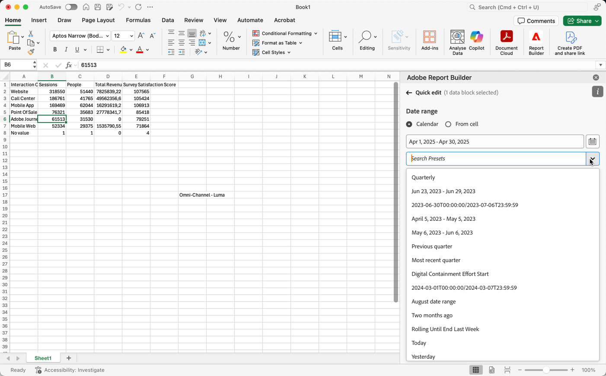

# 日付範囲の選択

既存のデータブロックの日付範囲を変更するには：

- **[!UICONTROL データブロックの編集]**&#x200B;を選択するか、
- **[!UICONTROL クイック編集]**&#x200B;で&#x200B;**[!UICONTROL 日付範囲]** リンクを選択します。

データブロックの日付範囲を変更するには、次のオプションを使用します。

## カレンダー

「**[!UICONTROL カレンダー]**」オプションを使用すると、次のオプションを使用して静的または回転日付を作成できます。

### 日付範囲

日付範囲フィールドには、データブロックリクエストの現在の日付範囲が表示されます。 日付を直接入力するか、を使用して日付範囲を指定できます。

{zoomable="yes"}

### プリセット

プリセット ドロップダウンメニューを使用して、プリセットを選択します。 テキストを入力してプリセットを検索することもできます。

{zoomable="yes"}

プリセットドロップダウンメニューには、標準のプリセット日付範囲と、保存したデータビューまたは共有したデータビューの日付範囲コンポーネントが含まれています。

### 相対日付

回転日を定義するには、次の手順に従います。

{zoomable="yes"}

1. **[!UICONTROL 日付のローリングを使用]**&#x200B;を選択して、日付のローリング定義のロジックを定義します。 括弧内のテキストを選択して（例：**[!UICONTROL 固定開始 – ローリング日]**）、パネルを拡張し、**[!UICONTROL 開始]**&#x200B;および&#x200B;**[!UICONTROL 終了]**&#x200B;の詳細を指定できます。

1. 「**[!UICONTROL 開始日]**」、「**[!UICONTROL 終了日]**」または「**[!UICONTROL 固定日]**」を選択します。

   - 「**[!UICONTROL 開始日]**」または「**[!UICONTROL 終了日]**」を選択すると、完全な式を作成できます。 例：**[!UICONTROL End of]** **[!UICONTROL current year]** **[!UICONTROL plus]** `1` **[!UICONTROL day]**。 式の個々の部分に適した値を選択します。

      - 現在の値を選択します。 例：**[!UICONTROL 現在の年]**。
      - オプションの追加計算の値を選択します。 例：**[!UICONTROL plus]**。
      - 追加の計算を指定した場合は、値を指定します。 例：`1`。
      - 追加の計算を指定した場合は、計算に使用する期間を選択します。 例：**[!UICONTROL day]**。

   - **[!UICONTROL 固定日]**&#x200B;を選択した場合は、固定日を指定するか、ピッカーを使用して日を選択します。

1. **[!UICONTROL 非表示]**&#x200B;を選択して、ローリング日の計算の詳細を非表示にします。

### カスタム式

「カスタム式」オプションを使用すると、カスタム式を作成するか、数式を入力して日付範囲を変更できます。

{zoomable="yes"}

1. 「**[!UICONTROL 相対日付を使用]**」を選択します。

1. 「**[!UICONTROL カスタム式の使用]**」を選択します。

   **[!UICONTROL カスタム式を使用]**&#x200B;を選択すると、標準のローリング日付範囲コントロールが無効になります。

1. [&#x200B; カスタム式](#create-a-custom-expression)を入力します。

1. 結果の日付範囲を確認するには、**[!UICONTROL 日付プレビュー]**&#x200B;を使用します。

#### カスタム式の作成

1. [日付参照](#date-references)を入力します。

1. 日付を過去または未来に移動するには、オプションの[日付演算子](#date-operators)を追加します。

`tm-11m-1d`など、複数の演算子を含むカスタム式を入力できます。

#### 日付参照

次のテーブルに、日付参照の例を示します。

| 日付参照 | タイプ | 説明 |
|----------------|--------------|----------------------------|
| `1/1/10` | 静的な日付 | ISO 日付形式で入力 |
| `td` | 相対日付 | 本日の開始時 |
| `tw` | 相対日付 | 今週の開始日 |
| `tm` | 相対日付 | 今月の開始日 |
| `tq` | 相対日付 | 今四半期の開始日 |
| `ty` | 相対日付 | 今年の開始日 |

#### 日付演算子

次のテーブルに、日付演算子の例を示します。

| 日付演算子 | 単位 | 説明 |
|----------------|---------|--------------------|
| `+6d` | 日 | 日付参照に 6 日間を追加 |
| `+1w` | 週 | 日付参照に 1 週間を追加 |
| `-2m` | 月 | 日付参照から 2 か月を減算 |
| `-4q` | 四半期 | 日付参照から 4 四半期を減算 |
| -`1y` | 年 | 日付参照から 1 年を減算 |

#### 日付式

次のテーブルに、日付式の例を示します。

| 日付式 | 意味 |
|-----------------|--------------------------------------|
| `td` | Today |
| `td-1w` | 先週の最初の日 |
| `tm-1d` | 先月の最終日 |
| `td-52w` | 52 週間前の同じ曜日 |
| `tm-11m-1d` | 昨年同月の最終日 |
| `"2020-09-06"` | 特定日、2020年9月9日 |

## セルからの日付範囲

日付範囲は、ワークシートのセルで指定できます。 「**[!UICONTROL セルからの日付範囲]**」オプションを使用して、選択したセルからデータブロックの開始日と終了日を選択します。 「**[!UICONTROL セルから]**」オプションを選択すると、パネルに&#x200B;**[!UICONTROL セルから]**&#x200B;と&#x200B;**[!UICONTROL から]**&#x200B;のフィールドが表示され、セルの場所を入力するか、を使用して現在の選択したセルを選択できます。

{zoomable="yes"}に選択

## 今日を除外

選択した日付範囲から今日を除外するには、**[!UICONTROL 今日を除外]**&#x200B;を選択します。 現在の日付は、日付範囲を定義するために使用されるすべてのモード（カレンダー、日付の繰り返し、またはカスタム式）から除外されます。

## 有効な日付範囲

次のリストは、有効な日付範囲の形式を示しています。

- 開始日と終了日は、「YYYY-MM-DD」の形式で指定する必要があります。

- 開始日は、終了日以前にする必要があります。 どちらの日付も将来の日付に設定できます。

- 相対な日付を使用する場合は、開始日を今日または過去の日付にする必要があります。 **[!UICONTROL 今日を除外]**&#x200B;を選択した場合、開始日は過去である必要があります。

- 将来の静的な日付範囲セットを作成できます。 例えば、来週予定されているマーケティングキャンペーンのローンチに、将来の日付を設定する必要が出ることがあります。 このオプションを選択すると、事前にキャンペーンを監視するワークブックが作成されます。

## 日付範囲の変更

既存のデータブロックの日付範囲を編集できます。

1. データブロック内のセルを選択します。

- **[!UICONTROL コマンド]** パネルで「**[!UICONTROL データブロックを編集]**」を選択するか、
- **[!UICONTROL クイック編集]** パネルで&#x200B;**[!UICONTROL 日付範囲]** リンクを選択します。

1. 使用可能な日付選択オプションのいずれかを使用して、日付範囲を変更します。

1. 「**[!UICONTROL 適用]**」を選択します。

Report Builder は、選択範囲内のすべてのデータブロックに新しい日付範囲を適用します。
