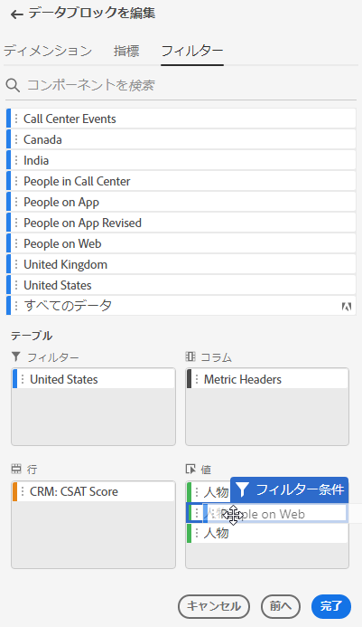
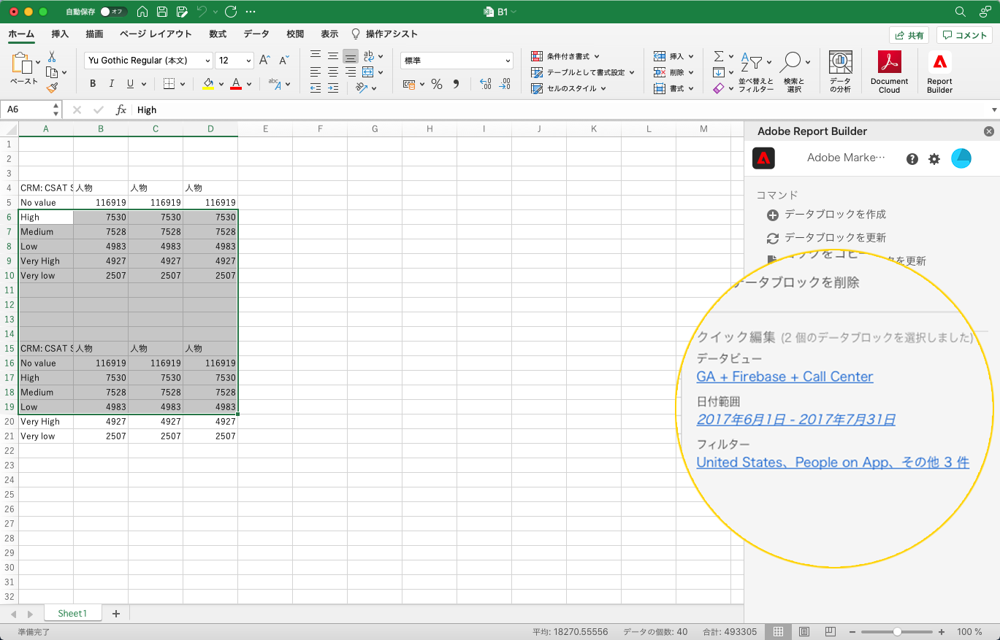
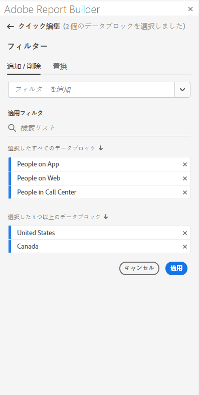
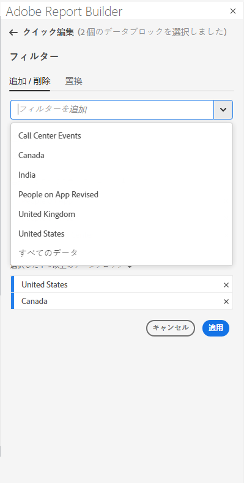
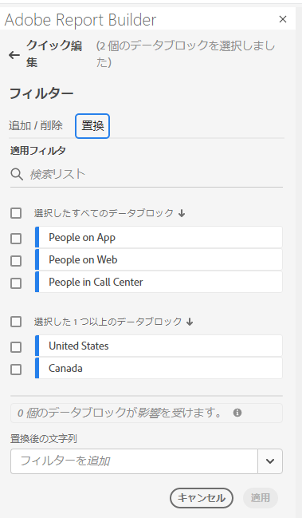
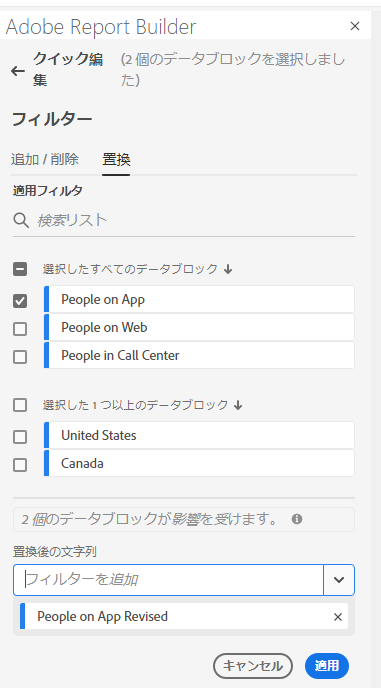

# Report Builderでのフィルターの操作

新しいデータブロックを作成する場合や、[ コマンド ] パネルから [**データブロックを編集**] オプションを選択する場合に、フィルタを適用できます。

## データブロックへのフィルターの適用

データ・ブロック全体にフィルタを適用するには、フィルタをダブルクリックするか、コンポーネント・リストからテーブルの「フィルタ」セクションにフィルタをドラッグ・アンド・ドロップします。

## 個々の指標へのフィルターの適用

個々の指標にフィルターを適用するには、フィルターをテーブルの指標にドラッグ&amp;ドロップします。 **...テーブルウィンドウで指標の右側にある** アイコンをクリックし、「**指標をフィルター**」を選択します。 適用したフィルターを表示するには、テーブルウィンドウで指標の上にマウスポインターを置くか、指標を選択します。 フィルターが適用された指標にはフィルターアイコンが表示されます。

<!--  -->

## クイック編集フィルター

クイック編集パネルを使用して、既存のデータブロックのフィルターの追加、削除、置換を行うことができます。

スプレッドシートでセルの範囲を選択すると、クイック編集パネルの「**フィルター**」リンクに、選択範囲内のデータブロックで使用されているフィルターの概要リストが表示されます。

クイック編集パネルを使用してフィルターを編集するには

1. 1 つまたは複数のデータ・ブロックからセル範囲を選択します。

   

1. 「フィルター」リンクをクリックして、クイック編集 — フィルターパネルを起動します。

   

### フィルターの追加または削除

「追加/削除」オプションを使用して、フィルターを追加または削除できます。

1. クイック編集フィルターパネルで「**追加/削除**」タブを選択します。

   選択したデータブロックに適用されたすべてのフィルタが、クイック編集フィルタパネルに表示されます。 選択範囲内のすべてのデータブロックに適用されたフィルタが、「**選択したすべてのデータブロックに適用**」見出しの下に表示されます。 一部のデータブロックに適用されたフィルター（一部ではありません）は、「 **選択した 1 つ以上のデータブロックに適用** 」見出しの下に表示されます。

   選択したデータブロックに複数のフィルタが存在する場合、「**フィルタを追加**」検索フィールドを使用して、特定のフィルタを検索できます。

   

1. フィルターを追加するには、「**フィルターを追加**」ドロップダウンメニューからフィルターを選択します。

   検索可能なフィルターのリストには、選択した 1 つ以上のデータブロックに存在するデータビューにアクセス可能なすべてのフィルターと、組織内でグローバルに使用可能なすべてのフィルターが含まれます。

   フィルターを追加すると、選択範囲内のすべてのデータブロックにフィルターが適用されます。

1. フィルターを削除するには、「**適用されたフィルター**」リストで、フィルターの右側にある削除アイコン **x** をクリックします。

1. **適用** をクリックして変更を保存し、ハブパネルに戻ります。

   Report Builderに、適用したフィルターの変更を確認するメッセージが表示されます。

### フィルターの置換

既存のフィルターを別のフィルターで置き換えて、データのフィルタリング方法を変更できます。

1. クイック編集フィルターパネルで「**置換**」タブを選択します。

   

1. **検索リスト** 検索フィールドを使用して、特定のフィルターを検索します。

1. 置き換えるフィルターを 1 つ以上選択します。

1. 「次で置換」フィールドで 1 つ以上のフィルターを検索します。

   フィルターを選択すると、「**** で置換…」リストに追加されます。

   

1. 「**適用**」をクリックします。

   Report Builderは、置換を反映するようにフィルターのリストを更新します。
