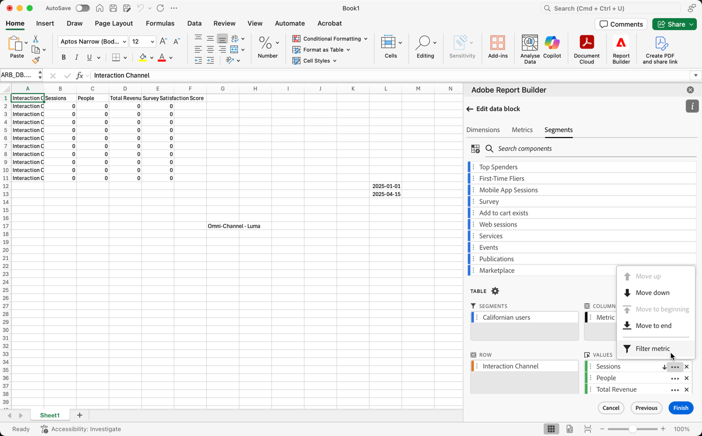
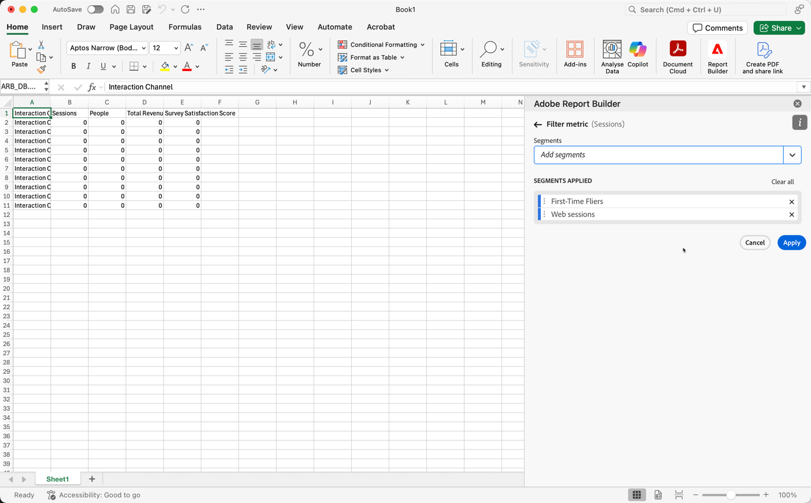
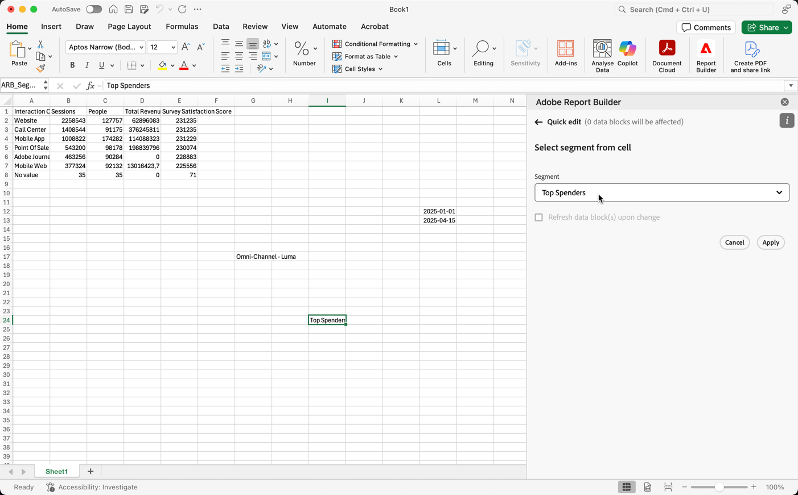

# セグメントの操作

セグメントは、新しいデータブロックを作成する場合や、**[!UICONTROL コマンド]** パネルから&#x200B;**[!UICONTROL データブロックを編集]**&#x200B;を選択した場合に適用できます。

## データブロックへのセグメントの適用

データブロック全体にセグメントを適用するには、セグメントをダブル選択するか、コンポーネントリストからセグメントをテーブルの「セグメント」セクションにドラッグ&amp;ドロップします。

## 個々の指標へのフィルターの適用

セグメントを使用して個々の指標にフィルターを適用するには：

* **[!UICONTROL セグメント]**&#x200B;から1つ以上のセグメントをテーブル内の指標にドラッグ&amp;ドロップします。

* または：

   1. **[!UICONTROL テーブル]** ペインの特定の指標に対してを選択し、**[!UICONTROL フィルター指標]**&#x200B;を選択します。

      指標を表示する「{zoomable="yes"}

   1. 「**[!UICONTROL セグメント]**」ドロップダウンメニューから1つ以上のセグメントを選択します。 セグメントは、**[!UICONTROL 適用されたセグメント]** リストに追加されます。

      
   1. 「」を選択して、**[!UICONTROL 適用されたセグメント]** リストからセグメントを削除します。 または、**[!UICONTROL すべてクリア]**&#x200B;を選択して、**[!UICONTROL 適用されたセグメント]** リストからすべてのセグメントを削除します。
   1. 「**[!UICONTROL 適用]**」を選択します。

適用したフィルターを表示するには、テーブルウィンドウで指標の上にマウスポインターを置くか、指標を選択します。 セグメントが適用された指標には、セグメントアイコンが表示されます。

## セグメントをクイック編集

**[!UICONTROL クイック編集]** パネルを使用して、既存のデータブロックのセグメントを追加、削除、置換できます。

スプレッドシートでセルの範囲を選択すると、**[!UICONTROL クイック編集]** パネルの&#x200B;**[!UICONTROL セグメント]** リンクに、その選択範囲のデータブロックで使用されるセグメントの概要リストが表示されます。

**[!UICONTROL クイック編集]** パネルを使用してセグメントを編集するには：

1. 1 つまたは複数のデータブロックからセルの範囲を選択します。

1. **[!UICONTROL セグメント]** リンクを選択して、**[!UICONTROL クイック編集]** **[!UICONTROL セグメント]** パネルを起動します。

### セグメントの追加または削除

追加/削除オプションを使用して、セグメントを追加または削除できます。

1. **[!UICONTROL クイック編集]** **[!UICONTROL セグメント]** パネルの「**[!UICONTROL 追加/削除]**」タブを選択します。

   1. 「**[!UICONTROL セグメント]**」ドロップダウンメニューから1つ以上のセグメントを選択します。 セグメントは、**[!UICONTROL 適用されたセグメント]** リストに追加されます。
   1. 「」を選択して、**[!UICONTROL 適用されたセグメント]** リストからセグメントを削除します。
   1. 「**[!UICONTROL 適用]**」を選択します。

適用されたセグメントの変更を確認するメッセージがReport Builderに表示されます。

### セグメントの置換

既存のセグメントを別のセグメントに置き換えて、データのセグメント化方法を変更できます。

1. **[!UICONTROL クイック編集]** **[!UICONTROL セグメント]** パネルで「**[!UICONTROL 置換]**」タブを選択します。

1. **検索リスト**&#x200B;検索フィールドを使用して、特定のセグメントを検索します。

1. 置換する1つ以上のセグメントを選択します。

1. 「**[!UICONTROL 置換付き置換」ドロップダウンメニューから1つ以上のセグメントを検索して、]**&#x200B;で置換リストにセグメントを追加します。

1. 「**[!UICONTROL 適用]**」を選択します。

Report Builderは、置き換えを反映するためにセグメントのリストを更新します。

## セルからのデータブロックセグメントの定義

データブロックは、セルからセグメントを参照できます。 複数のデータブロックがセグメントに対して同じセルを参照できるため、一度に複数のデータブロックに対してセグメントを簡単に切り替えることができます。

セルからセグメントを適用するには：

1. [新しいデータブロックを作成](create-a-data-block.md#create-a-data-block)するか、既存のデータブロックを編集します。
1. セグメントを定義するには、「**[!UICONTROL セグメント]**」タブを選択します。
1. を選択します。

   {zoomable="yes"}

1. データブロックがセグメントを参照するセルを選択します。

1. ダブルクリックして、セルにセグメントを追加します。 または、1つ以上のセグメントを「**[!UICONTROL セグメントが含まれる]**」セクションにドラッグ&amp;ドロップします。

1. 参照セルを作成するには、**[!UICONTROL 適用]**&#x200B;を選択します。

1. 「**セグメント**」タブから、新しく作成した参照セルセグメントをデータブロックに追加します。

   Sheet1!J1 （All Data） セグメントがテーブルに追加されたことを示す{zoomable="yes"}

1. 「**[!UICONTROL 完了]**」を選択します。

参照セルを他のデータブロックにセグメントとして適用するには、「**[!UICONTROL テーブル]**」タブの「**[!UICONTROL セグメント]**」リストのセグメントの1つとしてセル参照を使用します。

### 参照セルを使用したデータブロックセグメントの変更

1. スプレッドシートで参照セルを選択します。

1. 「**[!UICONTROL クイック編集]**」メニューの「**[!UICONTROL セルからのセグメント]**」の下にあるリンクを選択します。

   Sheet1!J1 （All Data） {zoomable="yes"}を示すセル リンクからの セグメント

1. ドロップダウンメニューからセグメントを選択します。

1. 「**[!UICONTROL 適用]**」を選択します。
