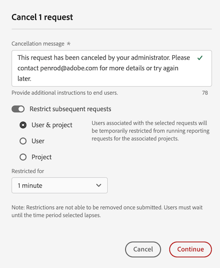
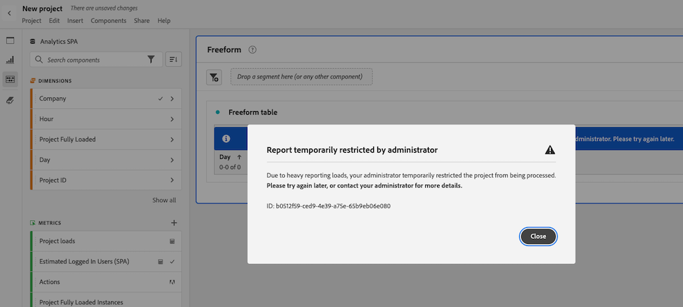

# レポートアクティビティマネージャーでのレポートリクエストのキャンセル

[!UICONTROL  レポートアクティビティマネージャー ] を使用すると、管理者はレポートリクエストをすばやく診断およびキャンセルして、ピーク時のレポート処理能力の問題を修正できます。

レポートリクエストをキャンセルする際は、次の点を考慮してください。

* 特定のリクエストをキャンセル、特定のユーザーからのすべてのリクエストをキャンセル、または特定のプロジェクトに関連するすべてのリクエストをキャンセルできます。

* リクエストをキャンセルする場合は、特定の期間に対する後続のリクエストを制限することもできます。

  後続のリクエストを制限すると、アクションは EMBARGO という名前で [ 監査ログ ](/help/privacy/audit-log.md) に記録されます。

* リクエストの [!UICONTROL **ユーザー**] 列が [!UICONTROL **認識されない**] と表示されている場合は、リクエストをキャンセルできません。 この場合は、管理者権限を持たないログイン会社にユーザーが所属していることを意味します。

主なメリットや権限要件など、レポートアクティビティマネージャーについて詳しくは、[ レポートアクティビティマネージャーの概要 ](/help/reporting-activity-manager/reporting-activity-overview.md) を参照してください。

## 特定のリクエストのキャンセル

レポート処理能力を大量に消費している個々のリクエストをキャンセルできます。 リクエストをキャンセルする際に、指定の期間にリクエストをさらに制限することができます。

1. Customer Journey Analyticsで、**[!UICONTROL ツール]**/**[!UICONTROL レポートアクティビティマネージャー]** に移動します。

1. レポートリクエストをキャンセルする接続を選択します。<!--double-check this step-->

   このページで利用できるデータについて詳しくは、[ レポートアクティビティマネージャーでのレポートアクティビティの表示 ](/help/reporting-activity-manager/reporting-activity.md) を参照してください。

1. 「[!UICONTROL **リクエスト**]」タブを選択し、1 つ以上のリクエストを選択します。

   <!-- add screenshot -->

1. 「[!UICONTROL **リクエストをキャンセル**]」を選択します。

   [!UICONTROL **_x_ レポートリクエストをキャンセル**] ダイアログボックスが表示されます。

1. キャンセルメッセージ フィールドには、リクエストがキャンセルされたときにユーザーに表示されるメッセージが表示されます。 デフォルトのメッセージが表示されます。 デフォルトメッセージを更新して、追加の詳細を指定できます。

1. （オプション）特定の期間について将来のリクエストを制限するには、次の手順に従います。

   1. [!UICONTROL **後続のリクエストを制限**] するオプションを有効にします。

      

   1. 次のオプションから選択します。

      | オプション | 関数 |
      |---------|----------|
      | [!UICONTROL **ユーザーとプロジェクト**] | 選択したリクエストに関連付けられたユーザーは、関連するプロジェクトに対するレポートリクエストの実行が一時的に制限されます。 |
      | [!UICONTROL **ユーザー**] | 選択したリクエストに関連付けられたユーザーは、レポートリクエストを行うことが一時的に制限されます。 |
      | [!UICONTROL **プロジェクト**] | 選択したリクエストに関連付けられたプロジェクトは、すべてのレポートリクエストから一時的に制限されます。 |
      | [!UICONTROL **制限付き**] | リクエストが制限される期間を選択します。 1 分（デフォルト）、5 分、10 分、15 分または 30 分から選択できます。<!-- double-check this -->
制限を設定後に早い段階で削除することはできません。
 |

      {style="table-layout:auto"}

1. 「[!UICONTROL **キャンセルを続行**]」を選択します。

   リクエストがキャンセルされたことをユーザーに知らせる通知がAnalysis Workspaceに表示されます。 Analysis Workspaceでの表示方法について詳しくは、「[ キャンセルされたレポートへのユーザーのアクセス時のエクスペリエンス ](#experience-when-users-access-a-cancelled-report)」を参照してください。

## ユーザー別のリクエストのキャンセル

1 人以上のユーザーに関連付けられているすべてのリクエストをキャンセルできます。 ユーザーに関連するリクエストをキャンセルする場合は、指定の期間、そのユーザーからのリクエストをさらに制限できます。

1. Customer Journey Analyticsで、**[!UICONTROL ツール]**/**[!UICONTROL レポートアクティビティマネージャー]** に移動します。

1. レポートリクエストをキャンセルする接続を選択します。<!--double-check this step-->

   このページで利用できるデータについて詳しくは、[ レポートアクティビティマネージャーでのレポートアクティビティの表示 ](/help/reporting-activity-manager/reporting-activity.md) を参照してください。

1. [!UICONTROL **ユーザー**] タブを選択し、1 人以上のユーザーを選択します。

   <!-- add screenshot -->

1. 「[!UICONTROL **リクエストをキャンセル**]」を選択します。

   [!UICONTROL **x _ユーザーからの x_ レポートリクエストをキャンセル**] ダイアログボックスが表示されます。

1. キャンセルメッセージ フィールドには、リクエストがキャンセルされたときにユーザーに表示されるメッセージが表示されます。 デフォルトのメッセージが表示されます。 デフォルトメッセージを更新して、追加の詳細を指定できます。

1. （オプション）特定の期間について将来のリクエストを制限するには、次の手順に従います。

   1. オプションを有効にして [!UICONTROL **後続のリクエストを制限**]

      

   1. 次のオプションから選択します。

      | オプション | 関数 |
      |---------|----------|
      | [!UICONTROL **ユーザーとプロジェクト**] | 選択したユーザーは、関連するプロジェクトに対するすべてのレポートリクエストが一時的に制限されます。 
これは最も制限が少ないオプションです。
 |
      | [!UICONTROL **ユーザー**] | 選択したユーザーは、レポートリクエストが一時的に制限されます。 |
      | [!UICONTROL **プロジェクト**] | 選択したユーザーに関連付けられたプロジェクトは、任意のユーザーによるすべてのレポートリクエストが制限されます。 |
      | [!UICONTROL **制限付き**] | リクエストが制限される期間を選択します。 1 分（デフォルト）、5 分、10 分、15 分または 30 分から選択できます。<!--double-check this--> 
制限を設定後に早い段階で削除することはできません。
 |

      {style="table-layout:auto"}

1. 「[!UICONTROL **キャンセルを続行**]」を選択します。

   リクエストがキャンセルされたことをユーザーに知らせる通知がAnalysis Workspaceに表示されます。 Analysis Workspaceでの表示方法について詳しくは、「[ キャンセルされたレポートへのユーザーのアクセス時のエクスペリエンス ](#experience-when-users-access-a-cancelled-report)」を参照してください。

## プロジェクト別のリクエストのキャンセル

1 つ以上のプロジェクトに関連付けられているすべてのリクエストをキャンセルできます。 プロジェクトに関連するリクエストをキャンセルする場合は、特定の期間、そのプロジェクトに関連するリクエストをさらに制限できます。

1. Customer Journey Analyticsで、**[!UICONTROL ツール]**/**[!UICONTROL レポートアクティビティマネージャー]** に移動します。

1. レポートリクエストをキャンセルする接続を選択します。<!--double-check this step-->

   このページで利用できるデータについて詳しくは、[ レポートアクティビティマネージャーでのレポートアクティビティの表示 ](/help/reporting-activity-manager/reporting-activity.md) を参照してください。

1. 「[!UICONTROL **プロジェクト**]」タブを選択し、1 つ以上のプロジェクトを選択します。

   <!-- add screenshot -->

1. 「[!UICONTROL **リクエストをキャンセル**]」を選択します。

   [!UICONTROL **x __ レポートリクエストを x プロジェクトからキャンセル**] ダイアログボックスが表示されます。

1. キャンセルメッセージ フィールドには、リクエストがキャンセルされたときにユーザーに表示されるメッセージが表示されます。 デフォルトのメッセージが表示されます。 デフォルトメッセージを更新して、追加の詳細を指定できます。

1. （オプション）特定の期間について将来のリクエストを制限するには、次の手順に従います。

   1. [!UICONTROL **後続のリクエストを制限**] するオプションを有効にします。

      

   1. 次のオプションから選択します。

      | オプション | 関数 |
      |---------|----------|
      | [!UICONTROL **ユーザーとプロジェクト**] | 選択したプロジェクトは、関連するユーザーによるすべてのレポートリクエストが一時的に制限されます。
これは最も制限が少ないオプションです。
 |
      | [!UICONTROL **ユーザー**] | 選択したプロジェクトに関連付けられたユーザーは、レポートリクエストが制限されます。 |
      | [!UICONTROL **プロジェクト**] | 選択したプロジェクトは、任意のユーザーが行ったレポートリクエストに対して一時的に制限されます。 |
      | [!UICONTROL **制限付き**] | リクエストが制限される期間を選択します。 1 分（デフォルト）、5 分、10 分、15 分または 30 分から選択できます。<!--double-check this--> 
制限を設定後に早い段階で削除することはできません。
 |

      {style="table-layout:auto"}

1. 「[!UICONTROL **キャンセルを続行**]」を選択します。

   リクエストがキャンセルされたことをユーザーに知らせる通知がAnalysis Workspaceに表示されます。 Analysis Workspaceでの表示方法について詳しくは、「[ キャンセルされたレポートへのユーザーのアクセス時のエクスペリエンス ](#experience-when-users-access-a-cancelled-report)」を参照してください。

## アプリケーション別のリクエストのキャンセル

1 つ以上のアプリケーションに関連付けられているすべてのリクエストをキャンセルできます。 アプリケーションに関連するリクエストをキャンセルする場合は、特定の期間、そのアプリケーションに関連するリクエストをさらに制限できます。

アプリケーションには次のものがあります。

* Analysis Workspace UI
* Workspace のスケジュール済みプロジェクト
* Report Builder
* ビルダー UI：セグメント、計算指標、注釈、オーディエンスなど。
* 2.0 API からの API 呼び出し
* インテリジェントアラート
* 完全なテーブルの書き出し
* 任意のユーザーと共有リンク
* ガイド付き分析
* Analytics レポートエンジンにクエリを実行するその他のアプリケーション

アプリケーション別に要求を取り消す手順は、次のとおりです。

1. Customer Journey Analyticsで、**[!UICONTROL ツール]**/**[!UICONTROL レポートアクティビティマネージャー]** に移動します。

1. レポートリクエストをキャンセルする接続を選択します。<!--double-check this step-->

   このページで利用できるデータについて詳しくは、[ レポートアクティビティマネージャーでのレポートアクティビティの表示 ](/help/reporting-activity-manager/reporting-activity.md) を参照してください。

1. 「[!UICONTROL **アプリケーション**]」タブを選択し、1 つ以上のアプリケーションを選択します。

   <!-- add screenshot -->

1. 「[!UICONTROL **リクエストをキャンセル**]」を選択します。

   [!UICONTROL **x __ レポートリクエストを x プロジェクトからキャンセル**] ダイアログボックスが表示されます。

1. キャンセルメッセージ フィールドには、リクエストがキャンセルされたときにユーザーに表示されるメッセージが表示されます。 デフォルトのメッセージが表示されます。 デフォルトメッセージを更新して、追加の詳細を指定できます。

1. （オプション）特定の期間について将来のリクエストを制限するには、次の手順に従います。

   1. オプションを有効にして [!UICONTROL **後続のリクエストを制限**]

      

   1. 次のオプションから選択します。

      | オプション | 関数 |
      |---------|----------|
      | [!UICONTROL **ユーザーとプロジェクト**] | 選択したアプリケーションは、関連するユーザーおよびプロジェクトが行ったレポートリクエストに対して一時的に制限されます。
これは最も制限が少ないオプションです。
 |
      | [!UICONTROL **ユーザー**] | 選択したアプリケーションに関連付けられているユーザーは、レポートリクエストを行うことができなくなります。 |
      | [!UICONTROL **プロジェクト**] | 選択したアプリケーションに関連付けられているプロジェクトは、どのユーザーが行ったレポート要求からも制限されます。 |
      | [!UICONTROL **制限付き**] | リクエストが制限される期間を選択します。 1 分（デフォルト）、5 分、10 分、15 分または 30 分から選択できます。<!--double-check this--> 
制限を設定後に早い段階で削除することはできません。
 |

      {style="table-layout:auto"}

1. 「[!UICONTROL **キャンセルを続行**]」を選択します。

   リクエストがキャンセルされたことをユーザーに知らせる通知がアプリケーション（Analysis Workspaceなど）に表示されます。 Analysis Workspaceでの表示方法について詳しくは、「[ キャンセルされたレポートへのユーザーのアクセス時のエクスペリエンス ](#experience-when-users-access-a-cancelled-report)」を参照してください。

## ユーザーがキャンセル済みレポートにアクセスする際のエクスペリエンス

Analysis Workspaceでは、キャンセルの影響を受けるレポートまたはビジュアライゼーションにアクセスしようとすると、次のメッセージが表示されます。

### プロジェクトに関するメッセージ

ユーザーがキャンセルの影響を受けるプロジェクトにアクセスしようとすると、レポートが一時的に制限されることを知らせるメッセージが表示されます。

### ビジュアライゼーションに関するメッセージ

ユーザーがキャンセルの影響を受けるビジュアライゼーションにアクセスしようとすると、レポートのデータ処理が一時的に制限されていることを知らせるメッセージが表示されます。

