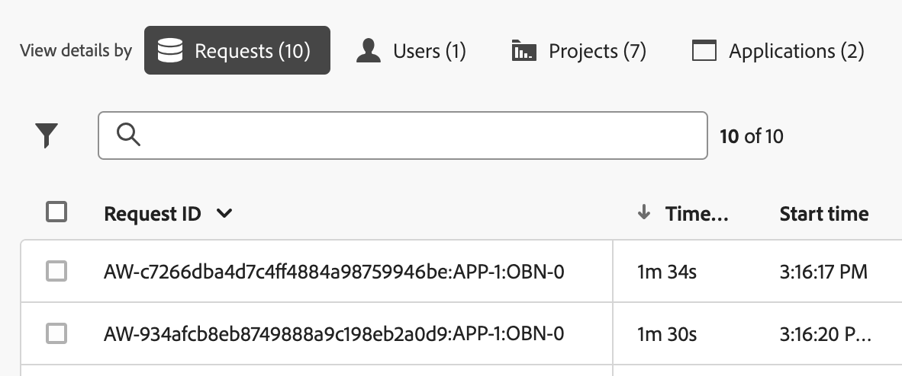

# レポートアクティビティマネージャーでのレポートアクティビティの表示

{{release-limited-testing}}

The [!UICONTROL レポートアクティビティマネージャー] 管理者は、ピーク時のレポート作成時に、レポート容量の問題を迅速に診断して修正できます。

主要なメリットや権限要件など、Reporting Activity Manager の詳細は、 [Activity Manager のレポートの概要](/help/reporting-activity-manager/reporting-activity-overview.md).

## すべての接続のレポートアクティビティを表示 {#view-all-report-suites}

1. Customer Journey Analyticsで、に移動します。 **[!UICONTROL ツール]** > **[!UICONTROL レポートアクティビティマネージャー]**.

   有効なベース接続のリストが表示されます。

   

1. （オプション）接続のリストを検索またはフィルタリングできます。

   * 検索フィールドを使用して、特定の接続を検索します。 入力した接続名または ID と、接続のリストの更新を入力し始めます。

   * を選択します。 [!UICONTROL **フィルター**] アイコン  をクリックして、フィルターオプションのリストを展開します。 次の条件でフィルターできます。 [!UICONTROL **お気に入力**] または [!UICONTROL **ステータス**].

     接続をお気に入りに登録するには、接続名の左側にある星形のアイコンを選択します。

     <!-- (does this option still exist?) 1. (Optional) Select **[!UICONTROL Refresh]** at the top-right to refresh the data. -->

1. 各接続の使用状況情報を表示します。 列ヘッダーを選択して、その列でテーブルを並べ替えることができます。

   以下の列を表示できます。

   | UI 要素 | 説明 |
   | --- | --- |
   | **[!UICONTROL 接続]** | 監視するレポートアクティビティの接続。 |
   | **[!UICONTROL データビュー]** | 接続にフィードするすべてのデータビューを表示します。 データビューは、適用されたフィルタリングとセグメント化のレベルが増えるので、レポートリクエストの複雑さが増します。 データビューからのすべてのリクエストが、接続に結合されます。
例えば、5 つのデータビューからの 10 件のリクエストがある場合、接続時のリクエスト数は 50 件です。 このようにして、たちまち処理能力に達してしまいます。 |
   | **[!UICONTROL 処理能力の使用率]** | 使用されている接続のレポート容量の割合（リアルタイム）。 
**注意** 100%の処理能力がある場合は、レポート要求のキャンセルをすぐに開始する必要があるとは限りません。 平均待機時間が妥当な場合は、100%の使用能力が正常になる可能性があります。 一方、キューに登録されたリクエストの数も増えている場合は、100%の使用率が問題を起こす可能性があります。
 |
   | **[!UICONTROL キューに入れられたリクエスト]** | 処理を待機しているリクエストの数。 <!-- ??? --> |
   | **[!UICONTROL キューの待機時間]** | リクエストの処理が開始されるまでの平均待機時間です。 <!-- ???? --> |
   | **[!UICONTROL ステータス]** | 可能なステータスは次のとおりです。 <ul><li>[!UICONTROL **アクティブ**] （青）：レポートは接続で実行され、アクティビティを監視しています。</li><li>[!UICONTROL **非アクティブ**] （グレー）：接続で実行されたレポートはありません。 このステータスは、接続が最初に作成されたときにのみ表示されます。</li></ul> |

   {style="table-layout:auto"}

## 単一の接続のレポートアクティビティを表示

1. 「Customer Journey Analytics」で、「 [!UICONTROL **ツール**] > [!UICONTROL **レポートアクティビティマネージャー**].

1. 詳細を表示する接続のリンクされたタイトルを選択します。

   選択した接続のレポートアクティビティデータが表示されます。

   <!-- Need to update this screenshot:  -->

1. 使用可能なグラフとテーブルを使用して、接続のレポートアクティビティを理解します。

   * [グラフの表示](#view-graphs)

   * [テーブルを表示](#view-table)

### グラフの表示

次のグラフは、接続で発生するアクティビティをより深く理解するのに役立ちます。

グラフが表示されない場合は、 [!UICONTROL **グラフを表示**] 」ボタンをクリックします。

#### 使用率グラフ {#utilization}

[ 使用率 ] グラフには、過去 2 時間に選択した接続での使用率のレポートが表示されます。

グラフの上にマウスポインターを置くと、その分の使用率の割合が最も高かった時点のポイントが表示されます。

* **X 軸**：過去 2 時間のレポートの使用量。
* **Y 軸**：レポートの使用能力の割合（分単位）。

  

#### ユニークユーザーのグラフ

「ユニークユーザー」グラフには、選択した接続に関する過去 2 時間のレポートアクティビティが表示されます。

グラフの上にマウスポインターを置くと、その分の最大ユーザー数が最も多かった時点のポイントが表示されます。

* **X 軸**：過去 2 時間のレポートアクティビティ。
* **Y 軸**：レポートリクエストをおこなったユーザーの数（分単位）。

  

#### リクエストグラフ

「要求」グラフには、選択した接続に対する過去 2 時間の処理済み要求と完了済み要求の数が表示されます。

グラフの上にマウスポインターを置くと、その分のリクエストの最大数が最も多かった時点のポイントが表示されます。

* **X 軸**：過去 2 時間の時間枠での、処理済みおよび完了済みのリクエストの数。
* **Y 軸**：処理されたリクエスト（紫色）と完了したリクエスト（緑色）の数（分単位）。

  

#### キューグラフ

キューのグラフには、過去 2 時間に選択した接続に対するレポート要求の平均キュー待機時間（秒）が表示されます。

グラフの上にマウスポインターを置くと、その分の平均待機時間の最大値が最も大きい時間のポイントが表示されます。

* **X 軸**：過去 2 時間の時間枠での、レポートリクエストの平均キュー待機時間。
* **Y 軸**：平均待機時間（秒）。

  

### テーブルを表示 {#view-table}

データテーブルの上部にある次のタブのいずれかを選択して、データを表示することを選択できます。 [!UICONTROL **リクエスト**], [!UICONTROL **ユーザー**], [!UICONTROL **プロジェクト**]&#x200B;または [!UICONTROL **アプリ**].

>[!TIP]
>
>次の項目を選択できます。 [!UICONTROL **グラフを非表示にする**] をクリックして、テーブルのみを表示します。

#### リクエスト別のデータの表示

次の項目を選択した場合： [!UICONTROL **リクエスト**] 「 」タブでは、次の列がテーブルで使用可能です。

| 列 | 説明 |
| --- | --- |
| [!UICONTROL **リクエスト ID**] | トラブルシューティングに使用できます。 |
| [!UICONTROL **時間の実行**] | リクエストが実行されている期間。 |
| [!UICONTROL **開始時間**] | （管理者のローカル時間に基づいて）リクエストの処理が開始されたとき。 |
| [!UICONTROL **待ち時間**] | リクエストが処理されるまで待機している時間。 十分な容量がある場合、通常、この値は「0」になります。 |
| [!UICONTROL **アプリケーション**] | [!UICONTROL レポートアクティビティマネージャー]でサポートされているアプリケーションは次のとおりです。 <ul><li>Analysis Workspace UI</li><li>Workspace のスケジュール済みプロジェクト</li><li>Report Builder</li><li>ビルダー UI：セグメント、計算指標、注釈、オーディエンスなど。</li><li>API 1.4 または 2.0 からの API 呼び出し</li><li>インテリジェントアラート</li></ul> |
| [!UICONTROL **ユーザー**] | リクエストを開始したユーザー。 
**注意：** この列の値が [!UICONTROL **認識不可能**]&#x200B;というのは、ユーザーがログイン会社に属し、管理者権限を持っていないことを意味します。
 |
| [!UICONTROL **プロジェクト**] | 保存済みの Workspace プロジェクト名、API レポート ID など（メタデータはアプリケーションによって異なる場合があります）。 |
| [!UICONTROL **ステータス**] | 次のステータスインジケーターがあります。 <ul><li>**実行中**：リクエストは現在処理中です。</li><li>**保留中**：リクエストは処理待ちの状態です。</li></ul> |
| [!UICONTROL **複雑さ**] | すべてのリクエストの処理に同じ時間が必要とは限りません。 リクエストの複雑さは、リクエストの処理に必要な時間に関する一般的なアイデアを提供するのに役立ちます。 
指定できる値には以下のものがあります。
 <ul><li>[!UICONTROL **低**]</li><li>[!UICONTROL **メディア**]</li><li>[!UICONTROL **高**]</li></ul>この値は、次の列の値の影響を受けます。<ul><li>[!UICONTROL **月の境界**]</li><li>[!UICONTROL **列**]</li><li>[!UICONTROL **セグメント**]</li></ul> |
| [!UICONTROL **月の境界**] | リクエストに含まれる月数。 月の境界が多いほど、リクエストが複雑になります。 |
| [!UICONTROL **列**] | リクエスト内の指標と分類の数。 列が増えると、リクエストが複雑になります。 |
| [!UICONTROL **セグメント**] | リクエストに適用されたセグメントの数。 セグメントが増えると、リクエストが複雑になります。 |

{style="table-layout:auto"}

#### ユーザー別のデータの表示

次の項目を選択した場合： [!UICONTROL **ユーザー**] 「 」タブでは、次の列がテーブルで使用可能です。

| 列 | 説明 |
| --- | --- |
| [!UICONTROL **ユーザー**] | リクエストを開始したユーザー。 この列の値が [!UICONTROL **認識不可能**]&#x200B;というのは、ユーザーがログイン会社に属し、管理者権限を持っていないことを意味します。 |
| [!UICONTROL **リクエスト数**] | ユーザーが開始したリクエストの数。 |
| [!UICONTROL **プロジェクト数**] | ユーザーに関連付けられたプロジェクトの数。 <!-- ??? --> |
| [!UICONTROL **アプリケーション**] | [!UICONTROL レポートアクティビティマネージャー]でサポートされているアプリケーションは次のとおりです。 <ul><li>Analysis Workspace UI</li><li>Workspace のスケジュール済みプロジェクト</li><li>Report Builder</li><li>ビルダー UI：セグメント、計算指標、注釈、オーディエンスなど。</li><li>API 1.4 または 2.0 からの API 呼び出し</li><li>インテリジェントアラート</li></ul> |
| [!UICONTROL **平均複雑さ**] | ユーザーが開始したリクエストの平均複雑度。 
すべてのリクエストの処理に同じ時間が必要とは限りません。 リクエストの複雑さは、リクエストの処理に必要な時間に関する一般的なアイデアを提供するのに役立ちます。

この列の値は、次の列の値によって決定されるスコアに基づきます。
<ul><li>[!UICONTROL **平均月の境界**]</li><li>[!UICONTROL **平均列数**]</li><li>[!UICONTROL **平均セグメント数**]</li></ul> |
| [!UICONTROL **平均月の境界**] | リクエストに含まれる平均月数。 月の境界が多いほど、リクエストが複雑になります。 |
| [!UICONTROL **平均列数**] | 含まれるリクエストの指標および分類の平均数。 列が増えると、リクエストが複雑になります。 |
| [!UICONTROL **平均セグメント数**] | 含まれるリクエストに適用されたセグメントの平均数。 セグメントが増えると、リクエストが複雑になります。 |

{style="table-layout:auto"}

#### プロジェクト別のデータの表示

次の項目を選択した場合： [!UICONTROL **プロジェクト**] 「 」タブでは、次の列がテーブルで使用可能です。

| 列 | 説明 |
| --- | --- |
| [!UICONTROL **プロジェクト**] | クエリが開始されたプロジェクト。 |
| [!UICONTROL **リクエスト数**] | プロジェクトに関連付けられた要求の数。 |
| [!UICONTROL **ユーザー数**] | プロジェクトに関連付けられたユーザーの数。 <!-- ??? --> |
| [!UICONTROL **アプリケーション**] | [!UICONTROL レポートアクティビティマネージャー]でサポートされているアプリケーションは次のとおりです。 <ul><li>Analysis Workspace UI</li><li>Workspace のスケジュール済みプロジェクト</li><li>Report Builder</li><li>ビルダー UI：セグメント、計算指標、注釈、オーディエンスなど。</li><li>API 1.4 または 2.0 からの API 呼び出し</li><li>インテリジェントアラート</li></ul> |
| [!UICONTROL **平均複雑さ**] | プロジェクトに含まれるリクエストの平均的な複雑さ。 
すべてのリクエストの処理に同じ時間が必要とは限りません。 リクエストの複雑さは、リクエストの処理に必要な時間に関する一般的なアイデアを提供するのに役立ちます。

この列の値は、次の列の値によって決定されるスコアに基づきます。
<ul><li>[!UICONTROL **平均月の境界**]</li><li>[!UICONTROL **平均列数**]</li><li>[!UICONTROL **平均セグメント数**]</li></ul> |
| [!UICONTROL **平均月の境界**] | リクエストに含まれる平均月数。 月の境界が多いほど、リクエストが複雑になります。 |
| [!UICONTROL **平均列数**] | 含まれるリクエストの指標および分類の平均数。 列が増えると、リクエストが複雑になります。 |
| [!UICONTROL **平均セグメント数**] | 含まれるリクエストに適用されたセグメントの平均数。 セグメントが増えると、リクエストが複雑になります。 |

{style="table-layout:auto"}

#### アプリケーション別のデータの表示

次の項目を選択した場合： [!UICONTROL **アプリ**] 「 」タブでは、次の列がテーブルで使用可能です。

| 列 | 説明 |
| --- | --- |
| [!UICONTROL **アプリケーション**] | クエリが開始されたアプリケーション。 |
| [!UICONTROL **リクエスト数**] | アプリケーションに関連付けられたリクエストの数。 |
| [!UICONTROL **ユーザー数**] | アプリケーションに関連付けられているユーザーの数。 <!--???--> |
| [!UICONTROL **プロジェクト数**] | アプリケーションに関連付けられているプロジェクトの数。 <!--???--> |
| [!UICONTROL **平均複雑さ**] | アプリケーションに関連付けられているリクエストの平均複雑度。 
すべてのリクエストの処理に同じ時間が必要とは限りません。 リクエストの複雑さは、リクエストの処理に必要な時間に関する一般的なアイデアを提供するのに役立ちます。

この列の値は、次の列の値によって決定されるスコアに基づきます。
この列の値は、次の列の値によって決定されるスコアに基づきます。<ul><li>[!UICONTROL **平均月の境界**]</li><li>[!UICONTROL **平均列数**]</li><li>[!UICONTROL **平均セグメント数**]</li></ul> |
| [!UICONTROL **平均月の境界**] | リクエストに含まれる平均月数。 月の境界が多いほど、リクエストが複雑になります。 |
| [!UICONTROL **平均列数**] | 含まれるリクエストの指標および分類の平均数。 列が増えると、リクエストが複雑になります。 |
| [!UICONTROL **平均セグメント数**] | 含まれるリクエストに適用されたセグメントの平均数。 セグメントが増えると、リクエストが複雑になります。 |

{style="table-layout:auto"}

<!--

### Filter

You can filter the table by Application (see list in the table below), by User, and by Project.

### Summary Numbers {#summary}

The Summary Numbers show the following information:

| Summary Number | Description |
| --- | --- |
| [!UICONTROL **Users**] | The number of users that are currently sending reporting requests to this connection. |
| [!UICONTROL **Projects**] | Workspace projects, Report Builder workbooks, etc.  | 
| [!UICONTROL **Queries**] | The number of queries currently running. |
| [!UICONTROL **Average Wait Time**] | The average wait time for all running queries.  |
| [!UICONTROL **Usage Capacity**] | The current usage capacity for this connection. |

{style="table-layout:auto"}

-->
