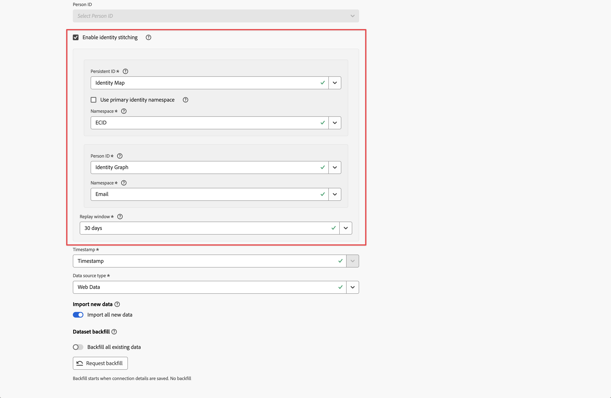

# ステッチを有効にする

接続の一部として設定した 1 つ以上のイベントデータセットに対して、ステッチを有効にすることができます。 ライセンスを取得しているCustomer Journey Analytics パッケージによって、ステッチで有効にできるイベントデータセットの数が決まります。

[&#x200B; 接続の作成 &#x200B;](/help/connections/create-connection.md#dataset-settings) または [&#x200B; 接続の編集 &#x200B;](/help/connections/create-connection.md) を行う際に、イベントデータセットの [&#x200B; データセット設定 &#x200B;](/help/connections/manage-connections.md#edit-a-connection) の一部としてステッチを有効にできます。

## 前提条件

指定するステッチ方法の前提条件（[&#x200B; フィールドベースのステッチ &#x200B;](fbs.md#prerequisites) または [&#x200B; グラフベースのステッチ &#x200B;](gbs.md#prerequisites)）を確認し、満たす必要があります。


## プリフライトチェック

前提条件を満たしている場合は、ID ステッチを有効にする前に、イベントデータセット内のデータに対してプリフライトチェックを実行してください。

* 永続 ID または人物 ID に XDM スキーマフィールドを使用する場合は、イベントデータセットのスキーマで ID が適切にマークされていることを確認してください。 [ID 名前空間の概要を参照 &#x200B;](https://experienceleague.adobe.com/ja/docs/experience-platform/identity/features/namespaces)。
* 永続 ID とユーザー ID の両方で ID カバレッジを確認します。

   * **永続 ID**

     永続 ID フィールドが null でない場合は 7 日間のデータをクエリし、データセット内のすべてのイベントについて 7 日間のデータのクエリで割ります。 この割合は 95% を超える必要があります。

     検証に使用できるクエリの例：

     ```sql
     SELECT
       COUNT(*) AS total_events,
       COUNT({PERSISTENT_ID_FIELD}) AS events_with_persistentid,
       ROUND(COUNT({PERSISTENT_ID_FIELD}) / COUNT(*), 2) AS percent_with_persistentid_not_null
     FROM 
       {DATASET_TABLE_NAME}
     WHERE
       TO_TIMESTAMP(timestamp, '{FORMAT_STRING}') >= TIMESTAMP '{START_DATE}'
       AND TO_TIMESTAMP(timestamp, 'FORMAT_STRING') < TIMESTAMP '{END_DATE}';
     ```

     ここで：

      * `{PERSISTENT_ID_FIELD}` は、永続 ID のフィールドです。 例：`identityMap.ecid[0]`。
      * `{DATASET_TABLE_NAME}` は、イベントデータセットのテーブル名です。
      * `{FORMAT_STRING}` は、タイムスタンプフィールドの書式指定文字列です。 例：`MM/DD/YY HH12:MI AM`。
      * `{START_DATE} ` 開始日。 例：`2024-01-01 00:00:00`。
      * `{END_DATE}` は、標準形式の終了日です。 例：`2024-01-08 00:00:00`。


   * **ユーザー ID**
      * グラフベースのステッチの場合は、選択した永続 ID 名前空間とユーザー ID 名前空間の ID 値をリンクするフラグメントが ID グラフに含まれていることを確認します。 [Experience Platform ID グラフビューアに移動してテストを実行し &#x200B;](https://experienceleague.adobe.com/ja/docs/experience-platform/identity/features/identity-graph-viewer){target="_blank"} いくつかのサンプルの永続 ID 値でグラフをクエリできます。 これらの永続 ID 値がグラフのユーザー ID 値にリンクされているかどうかを確認してください。
      * フィールドベースのステッチの場合、ユーザー ID フィールドが null でない 7 日間のデータをクエリし、データセット内のすべてのイベントについて 7 日間のデータのクエリで割ります。 この割合は、理想的には 5% を超える必要があります。

        検証に使用できるクエリの例：

        ```sql
        SELECT
          COUNT(*) AS total_events,
          COUNT({PERSON_ID_FIELD}) AS events_with_personid,
          ROUND(COUNT({PERSON_ID_FIELD}) / COUNT(*), 2) AS percent_with_personid_not_null
        FROM 
          {DATASET_TABLE_NAME}
        WHERE
          TO_TIMESTAMP(timestamp, '{FORMAT_STRING}') >= TIMESTAMP '{START_DATE}'
          AND TO_TIMESTAMP(timestamp, 'FORMAT_STRING') < TIMESTAMP '{END_DATE}';
        ```

        ここで：

         * `{PERSON_ID_FIELD}` は、人物 ID のフィールドです。 例：`identityMap.crmId[0]`。
         * `{DATASET_TABLE_NAME}` は、イベントデータセットのテーブル名です。
         * `{FORMAT_STRING}` は、タイムスタンプフィールドの書式指定文字列です。 例：`MM/DD/YY HH12:MI AM`。
         * `{START_DATE}` は開始日です。 例：`2024-01-01 00:00:00`。
         * `{END_DATE}` は、標準形式の終了日です。 例：`2024-01-08 00:00:00`。


## ID ステッチを有効にする {#enable-identity-stitching}

ユーザーベースの接続でイベントデータセットを [&#x200B; 追加 &#x200B;](/help/connections/create-connection.md#add-datasets) または [&#x200B; 編集 &#x200B;](/help/connections/create-connection.md#edit-a-dataset) する場合、ID ステッチを有効にできます。 アカウントベースの接続では、ID のステッチは使用できません。

>[!CONTEXTUALHELP]
>id="connection_changeto_identitygraph"
>title="ID グラフへの変更"
>abstract="ステッチに ID グラフを使用する前に、ID グラフの設定が完了していることを確認します。"
>additional-url="https://experienceleague.adobe.com/jp/docs/analytics-platform/using/stitching/gbs" text="グラフベースのステッチ"

>[!CONTEXTUALHELP]
>id="connection_stitching_personid"
>title="ユーザー ID"
>abstract="使用可能な ID からユーザー ID （ユーザーの一意の ID）を選択します。グラフベースのステッチを使用する場合は、「**[!UICONTROL ID グラフ]**」を選択します。"

>[!CONTEXTUALHELP]
>id="connection_stitchingmetrics"
>title="指標のステッチ"
>abstract="ステッチ指標は、過去 7 日間に取り込まれた任意のデータから、サンプルセットのデータを使用して計算されています。<br> 通常、このサンプルデータセットは **[!UICONTROL プレビュー]** テーブルで使用されるサンプルデータとは異なります。"

>[!CONTEXTUALHELP]
>id="connection_stitchingmetrics_gbs_personidcoverage"
>title="人物 ID の適用範囲"
>abstract="ステッチプロセス（ライブおよび再生）中に識別に使用される、選択したユーザー ID のカバレッジ。<br/> 最適なステッチ結果を得るには、各永続 ID の ID グラフに（永続 ID、人物 ID）関係を表示する必要があります。"

>[!CONTEXTUALHELP]
>id="connection_stitchingmetrics_fbs_personidcoverage"
>title="人物 ID の適用範囲"
>abstract="ステッチプロセス（ライブおよび再生）中に識別に使用される、選択したユーザー ID のカバレッジ。<br/> 最適なステッチ結果を得るには、永続 ID （デバイス情報）ごとに少なくとも 1 つのイベントでユーザー ID （ユーザー情報）を送信する必要があります。"

>[!CONTEXTUALHELP]
>id="connection_stitchingmetrics_persistentidcoverage"
>title="永続的な ID 適用範囲"
>abstract="この値は、人物 ID 値を検出できない場合に、ステッチプロセス（ライブおよび再生）中の識別に使用されます。 <br/> 永続 ID も人物 ID も持たないイベントは、データからドロップされます。 最適なステッチ結果を得るには、すべてのイベントに永続 ID が存在する必要があります。"


>[!CONTEXTUALHELP]
>id="connection_stitchingmetrics_badids"
>title="不正 ID"
>abstract="不正な ID は、レポートデータに大きく影響する ID 値です。"
>additional-url="https://experienceleague.adobe.com/en/docs/experience-cloud-kcs/kbarticles/ka-16444" text="不正 ID"


### データセット設定

ステッチを有効にするには、**[!UICONTROL データセットを追加]** または **[!UICONTROL データセットを編集]** ダイアログのイベントデータセット **[!UICONTROL データセット設定]** セクションで、次の手順を実行します。



1. 「**[!UICONTROL ID ステッチを有効にする]**」を選択します。

   接続内の保存済みイベントデータセットに対してステッチを有効または無効にすると、**[!UICONTROL ユーザー ID を変更]** ダイアログに、ユーザー ID を変更した場合の影響が表示されます。 「**[!UICONTROL 続行]**」を選択して続行します。

   **[!UICONTROL ID ステッチを有効にする]** ダイアログには、ID のステッチの結果の概要が表示されます。 「**[!UICONTROL 続行]**」を選択して続行します。

1. **[!UICONTROL 永続 ID]** ドロップダウンメニューから永続 ID を選択します。

   永続 ID に **[!UICONTROL ID マップ]** を選択する場合は、名前空間を選択する必要があります。 次の 2 つのオプションがあります。

   * **[!UICONTROL プライマリ ID 名前空間を使用]** を選択して、プライマリ ID 名前空間を使用します。
   * **[!UICONTROL 名前空間]** ドロップダウンメニューから名前空間を選択します。

1. **[!UICONTROL ユーザー ID]** ドロップダウンメニューからユーザー ID を選択します。

   ユーザー ID に **[!UICONTROL ID マップ]** を選択した場合は、名前空間を選択する必要があります。 次の 2 つのオプションがあります。

   * **[!UICONTROL プライマリ ID 名前空間を使用]** を選択して、プライマリ ID 名前空間を使用します。
   * **[!UICONTROL 名前空間]** ドロップダウンメニューから名前空間を選択します。


   ユーザー ID に **[!UICONTROL ID グラフ]** を選択した場合（[&#x200B; グラフベースのステッチ &#x200B;](/help/stitching/gbs.md) を使用する場合）、名前空間を選択する必要があります。

   >[!NOTE]
   >
   >ID グラフを使用する権限があることを確認します。
   >

   その前に、**[!UICONTROL ID グラフに変更]** ダイアログが表示され、データセットの ID グラフの設定が完了したことを確認します。 この設定は、ステッチに ID グラフを使用する前の [&#x200B; グラフベースの前提条件 &#x200B;](/help/stitching/gbs.md#prerequisites) の一部です。 「**[!UICONTROL 続行]**」を選択して続行します。

   * **[!UICONTROL 名前空間]** ドロップダウンメニューから名前空間を選択します。

1. **[!UICONTROL 再生ウィンドウ]** ドロップダウンメニューから再生ウィンドウを選択します。 使用できるオプションは、使用資格のあるCustomer Journey Analytics パッケージによって異なります。

1. 「**[!UICONTROL 次へ]**」を選択して、ステッチの対象となるイベントデータセットのプレビューを確認します。


### データセットのプレビュー

ユーザーベースの接続でデータセットを **[!UICONTROL 追加]** または [&#x200B; 編集 &#x200B;](/help/connections/create-connection.md#add-datasets) すると、標準の [&#x200B; データセットプレビュー &#x200B;](/help/connections/create-connection.md#edit-a-dataset) インターフェイスの上に、2 つの追加の情報パネルが使用できます。

>[!NOTE]
>Customer Journey AnalyticsをAWSにデプロイしている顧客の場合、この機能はリリース保留中です。
>


#### 指標のステッチ


**[!UICONTROL ステッチ指標]** は、過去 7 日間に取り込まれた任意のデータから、サンプルセットのデータを使用して計算されています。 このサンプルデータセットは、通常、**[!UICONTROL プレビュー]** テーブルで使用されるサンプルデータとは異なります。 指標のステッチは、次の詳細を提供します。

* **[!UICONTROL ユーザー ID の適用範囲]**：ステッチプロセス（ライブおよび再生）中に識別に使用される、選択したユーザー ID の適用範囲。
   * フィールドベースの最適なステッチ結果を得るには、永続 ID （デバイス情報）ごとに少なくとも 1 つのイベントでユーザー ID （ユーザー情報）を送信する必要があります。
   * グラフベースの最適なステッチ結果を得るには、各永続 ID の ID グラフに（永続 ID、人物 ID）関係を表示する必要があります。

  人物 ID の適用範囲は、安定した開発や実稼動の設定で推奨される内容に対する割合で表示されます。 このカバレッジ値が高いほど、選択したユーザー ID を使用して取得されるステッチの結果が良くなります。

* **[!UICONTROL 永続 ID カバレッジ]**：この値は、ユーザー ID 値を検出できない場合に、ステッチプロセス（ライブおよび再生）中に識別するために使用されます。 永続 ID も人物 ID も持たないイベントは、データからドロップされます。 最適なステッチ結果を得るには、すべてのイベントに永続 ID が存在する必要があります。

  永続的な ID の適用範囲は、安定した開発または実稼動セットアップで推奨される最小限の範囲に対するパーセンテージで表示されます。


#### 不正 ID

>[!INFO]
>
>不正な ID は、Customer Journey Analytics インターフェイスでは BAVID とも呼ばれます。
> 

Customer Journey Analyticsでは、無効な ID は識別子です。

* ステッチが有効になっているデータセットの永続 ID または人物 ID フィールドから生成される特定の ID 値を持つ **および**
* は、1 か月以内に接続データの 100 万（100 万）を超えるイベントに参加しています。

ID 値が無効な ID としてマークされた場合、その ID 値を含む今後のイベントは接続データから破棄され、レポートには表示されません。

不正な ID の使用例：

* ユーザー ID フィールドにカスタム値またはプレースホルダー値がある（例：`undefined`）。 このような値は、[&#x200B; ステッチとレポートのデータ品質 &#x200B;](/help/stitching/faq.md#undefined-person-id-values) にも影響を与える可能性があります。
* フィールドベースのステッチ設定で、複数のユーザーが 1 つのデバイスを共有し、ユーザー間のトランジションの合計が 50,000 を超える場合。 このシナリオでは、ステッチプロセスは停止して、そのデバイスの人物 ID 情報の使用を開始し、代わりに永続的な ID 情報のみを使用します。 その結果、そのデバイスからのすべてのデータセットイベントは、永続 ID を持つ接続データに送信され、不正な ID 状況が発生する可能性が高くなります。


>[!NOTE]
>**[!UICONTROL 無効な ID]** を含む **[!UICONTROL ステッチ指標]** は、限られたデータセットに基づいて計算されます。 ステッチに使用する予定のデータセットに不正な ID が存在することを特定するには、[&#x200B; 不正な ID のテクニカルノート &#x200B;](/help/technotes/badids.md) を参照してください。
>


### 保存

接続を保存すると、有効なデータセットのステッチ用のステッチプロセスは、これらのデータセットのデータの取り込みが開始するとすぐに開始されます。

>[!CAUTION]
>
>接続インターフェイスでステッチを有効にしているデータセットの場合、バックフィルステータスは、完了したバックフィルの数に対し、直ちに誤って  **[!UICONTROL _x _バックフィル完了]**&#x200B;として報告されます。 ステッチされたデータセットからのデータがバックフィルされているかどうかを確認するには、他の方法を使用します。
>


## 制限事項

[&#x200B; フィールドベースのステッチの制限 &#x200B;](/help/stitching/fbs.md#limitations) および [&#x200B; グラフベースのステッチの制限 &#x200B;](/help/stitching/gbs.md#limitations) に加えて、接続インターフェイスでステッチを有効にすると次の制限が適用されます。

* イベントデータセットは、1 つの接続の一部として 1 回だけステッチできます。 同じイベントデータセットを複数回定義し、インスタンスごとに別のステッチ設定を使用することはできません。 同じデータセットに異なるステッチ設定を適用する場合は、設定ごとに個別の接続を使用します。


## 移行

接続インターフェイスで有効になっているステッチは、リクエストベースのステッチでは問題なく共存できます。

例えば、以前または現在のステッチリクエストの結果、データレイクで web ベースのステッチされたデータセットがあるとします。 接続インターフェイスを使用してコールセンターデータセットからステッチされたデータを追加し、そのデータを web ベースのデータと組み合わせることができます。

最終的に、Adobeは、接続エクスペリエンスの新しいステッチに、リクエストベースのステッチされたデータセットを移行します。
