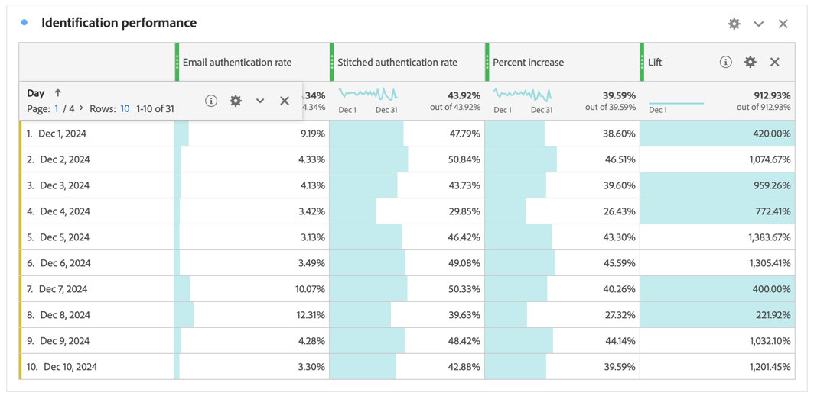

# ステッチの検証

[ID ステッチ &#x200B;](/help/stitching/overview.md) （または単にステッチ）の目標は、クロスチャネル分析のためのイベントデータセットの適合性を高めることです。 この昇格は、データセット内のすべてのデータ行に、使用可能な ID の望ましい最上位が含まれている場合に達成されます。 この標高を使用すると、次のことができます。

* 匿名のユーザーを除外せずに、ユーザー中心のレポートを作成します。
* 複数のデバイスを 1 人のユーザーに接続します。
* チャネルをまたいで人物を接続します。

この記事では、新しく作成されたステッチされた 1 つ以上のデータセットで標高を測定し、ステッチによってこれらのメリットが得られるかどうかを確認するための分析方法について概要を説明します。

分析方法には、通常、管理者がアクセスできる [&#x200B; データビューコンポーネント設定 &#x200B;](/help/data-views/component-settings/overview.md) が含まれます。 また、これらのメソッドでは、Analysis Workspace プロジェクトで作業するアナリストが計算指標とビジュアライゼーションを作成する必要があります。

これらの分析方法は、フィールドベースのステッチとグラフベースのステッチの両方に使用できますが、特にグラフベースのステッチシナリオでは、一部の要素がデータセットに存在しない場合があります。 これらの要素が欠落すると、Analysis Workspaceで上昇率を直接計算するのが難しくなる可能性があります。

>[!NOTE]
>
>1 つ以上のデータセットの（検証）ステッチは、最終的には分析とインサイトの向上に貢献します。 ただし、この記事では、Experience Platform内のすべてのデータセットが同じ ID 名前空間に関連付けられているCustomer Journey Analytics設定の全体的な値については説明しません。 また、これらすべてのデータセットがうまく結合され、カスタマージャーニー全体にわたる分析を実行できます。

>[!BEGINSHADEBOX]

デモビデオについては、 [&#x200B; ステッチの有効化と検証 &#x200B;](https://video.tv.adobe.com/v/3478121?captions=jpn&quality=12&learn=on){target="_blank"} を参照してください。

>[!ENDSHADEBOX]

>[!IMPORTANT]
>
>この記事では、[Adobeを通じてリクエスト &#x200B;](/help/stitching/use-stitching.md) され、重複するステッチされたデータセットに追加されたステッチ ID 列を使用して実装される、データのステッチを検証する方法について説明します。 この記事は、間もなく更新される予定で、（接続 UI を使用して [&#x200B; 有効となるステッチの検証方法の詳細が記載されて &#x200B;](/help/stitching/use-stitching-ui.md) ます。

## データ表示の前提条件

ステッチ検証測定計画では、ステッチされたデータセットの必要なすべてのディメンションと指標が、データビューで定義されていることを確認する必要があります。 `stitchedID.id` フィールドと `stitchedId.namespace.code` フィールドの両方がディメンションとして追加されていることを確認する必要があります。 ステッチされたデータセットは元のデータセットの正確なコピーですが、ステッチプロセスによって、これら 2 つの新しい列がデータセットに追加されます。

* `stitchedID.namespace.code` を使用して **[!UICONTROL ステッチされた名前空間]** ディメンションを定義します。 このディメンションには、行が昇格された ID の名前空間（例：`Email`、`Phone`）が含まれています。 または、ステッチプロセスのフォールバック先の名前空間（`ECID` など）。
  

* `stitchedID.id` を使用して **[!UICONTROL ステッチ ID 値]** ディメンションを定義します。 このディメンションには、ID の生の値が含まれます。 例：ハッシュ化されたメール、ハッシュ化された電話、ECID。 この値は **[!UICONTROL ステッチされた名前空間]** で使用されます。
  

さらに、ディメンション内の値の存在に基づく 2 つのステッチ指標を追加する必要があります。

1. ステッチされたデータセットの人物 ID を含むフィールドを使用して、人物 ID が設定されているかどうかを定義する指標を設定します。 人物 ID はベースラインの確立に役立つので、グラフベースのステッチを使用している場合でも、この人物 ID を追加します。 ユーザー ID がデータセットに含まれていない場合、ベースラインは 0% です。

   次の例では、`personalEmail.address` は ID として機能し、**[!UICONTROL _Email set]** 指標の作成に使用されます。
   

1. フィールド `stitchedID.namespae.code` 使用して、**[!UICONTROL メールステッチされた名前空間]** ディメンションを作成します。 必ず [&#x200B; コンポーネント設定に値を含める除外 &#x200B;](/help/data-views/component-settings/include-exclude-values.md) を指定して、データ行を昇格しようとしている名前空間の値のみを考慮するようにします。
   1. 「**[!UICONTROL 値を含める/除外する]**」を選択します。
   1. **[!UICONTROL すべての条件を満たす場合]** を **[!UICONTROL 一致]** として選択します。
   1. **[!UICONTROL 条件]** として `email` 次に等しい **&#x200B;**&#x200B;を指定し、メール名前空間に昇格されたイベントを選択します。

   

## ステッチされたディメンション

これらのディメンションの両方がデータビューに追加された状態で、Analysis Workspaceの [&#x200B; フリーフォームテーブル &#x200B;](/help/analysis-workspace/visualizations/freeform-table/freeform-table.md) を使用して、各ディメンションに含まれるデータを確認します。

**[!UICONTROL &#x200B; ステッチされた名前空間ディメンション**] テーブルには、通常、データセットごとに 2 行が表示されます。 ステッチプロセスでフォールバックメソッド（ECID）を使用する必要があったタイミングを表す 1 行。 もう 1 つの行には、目的の ID 名前空間に関連付けられたイベント（メール）が表示されます。

**[!UICONTROL &#x200B; ステッチされた ID ディメンション**] テーブルには、イベントから取得された生の値が表示されます。 この表では、永続 ID と目的の人物 ID の間で値が切り替わっていることがわかります。

## デバイス中心またはユーザー中心のレポート

接続を作成する場合は、ユーザー ID に使用するフィールドまたは ID を定義する必要があります。 例えば、Web データセットでは、ユーザー ID としてデバイス ID を選択すると、デバイス中心のレポートが作成されるので、このデータを他のオフラインチャネルと結合できなくなります。 クロスチャネルフィールドや ID （メールなど）を選択すると、未認証のイベントで失われます。 この影響を理解するには、認証されていないトラフィックの量と、認証されているトラフィックの量を把握する必要があります。

1. 計算指標 **[!UICONTROL 合計未認証イベント数]** を作成します。 ルールビルダーで、次のようにルールを定義します。
   

1. 前に定義した **[!UICONTROL _Email のセット]** 指標に基づいて、計算指標 **[!UICONTROL メール認証率]** を作成します。 ルールビルダーで、次のようにルールを定義します。
   

1. **[!UICONTROL 合計に対する未認証イベント]** の計算指標を **[!UICONTROL メール認証率]** の計算指標と共に使用して、[&#x200B; ドーナツ &#x200B;](/help/analysis-workspace/visualizations/donut.md) ビジュアライゼーションを作成します。 このビジュアライゼーションには、データセット内の未認証と認証済みのイベントの数が表示されます。

   

## ステッチの識別率

ステッチの前後で ID パフォーマンスを測定する必要があります。 それには、次の 3 つの計算指標を追加で作成します。

1. **[!UICONTROL ステッチ認証率]** の計算指標。イベントの合計数に対して、ステッチされた名前空間が目的の ID に設定されるイベント数を計算します。 データビューを設定する際に、イベントの名前空間がメールに設定されている場合にのみカウントするフィルターを含んだ **[!UICONTROL メールステッチされた名前空間]** 指標を作成しました。 計算指標は、この **[!UICONTROL メールステッチされた名前空間]** 指標を使用して、目的の ID を持つデータの割合を示します。
   

1. 現在の識別率とステッチされた率の間の生の変化率を計算する **[!UICONTROL 増加率]** 計算指標です。
   

1. 現在の識別率とステッチされた識別率の間の上昇率を計算する **[!UICONTROL 上昇率]** 計算指標。
   

## まとめ

Analysis Workspaceのフリーフォームテーブルのすべてのデータを組み合わせると、ステッチにより次のような影響と値が得られることがわかります。

* 現在の認証率：イベント総数に対する、適切なユーザー ID を持っているイベント数のベースライン。
* ステッチ認証率：イベントの合計数のうち、正しい人物 ID を持つ新しいイベント数。
* 増加率（%）：ステッチされた認証率からベースラインの現在の認証率を引いた値の生の増加率。
* 上昇率：ベースラインの現在の認証率に対する変化率。

この記事の重要なポイントは、このタイプのステッチの検証と分析で次の操作がサポートされることです。

* 現在の認証率とステッチされた認証率を比較することで、認証の有効性に関する包括的なカスタムビューを提供します。
* 上昇率と上昇率指標を通じて改善点を明確に測定できます。
* ステッチを実装することがユーザー認証に与える真の影響を特定するのに役立ちます。
* 標準化された方法を作成して、チーム間で認証パフォーマンスを伝えます。
* 認証戦略と最適化に関するデータ駆動型の決定を可能にします。

これらの指標を組み合わせることで、Customer Journey Analytics ステッチが認証成功率や全体的な人物特定パフォーマンスにどのように影響するかを関係者が把握できるようになります。

