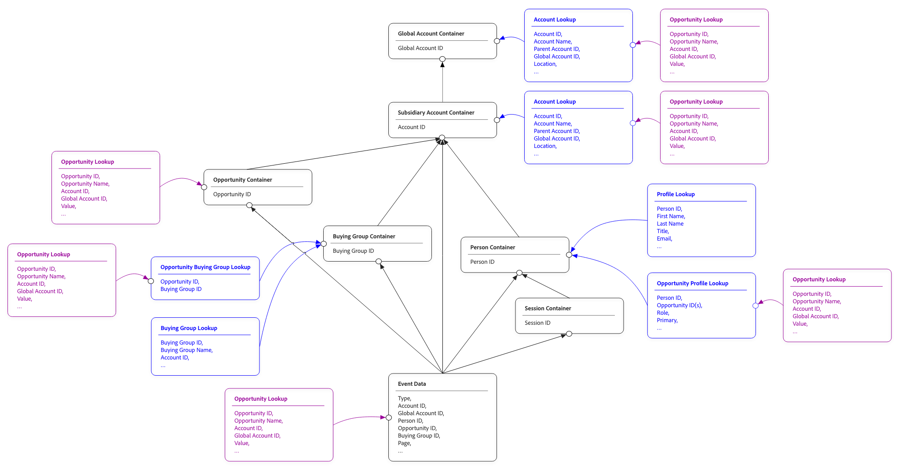

# 共有ルックアップ

Customer Journey Analyticsでは、ルックアップデータセットによって、イベントデータが追加のコンテキストで強化されます。 たとえば、商品名、カテゴリー、価格を購入イベントに追加する商品カタログデータセットがあります。 キャンペーンの詳細をマーケティングイベントに追加します。

ルックアップを使用すると、イベント自体に保存されていない属性を使用して、イベントデータをレポートできます。
従来、ルックアップデータセットは、単一の固定パスを通じてイベントに結合されていました。イベントデータセットのキーフィールドは、ルックアップデータセットの1つのキーフィールドと一致します。このルックアップは、2つのデータセットを関連付ける方法が1つしかない場合に機能しますが、このシンプルなリンクは、一般的な実世界のシナリオで分類されます。

* イベントソースに応じて、製品SKUまたは製品IDでイベントに結合された製品カタログ。
* チャネル（web イベントの電子メール、店舗内イベントのロイヤルティ ID）に応じて、異なるID名前空間のイベントに結合されたユーザー属性ルックアップ。
* プロファイルデータセットは、直接（個人ごとに）イベントに結合されるか、間接的（アカウントごとに、B2B レポート用に）イベントに結合されます

共有ルックアップは、ルックアップデータセットとルックアップデータがエンリッチするイベントとの間に複数の結合パスを定義できるようにすることで、限定的な固定パス結合を解決します。 各パスは、ルックアップ行をイベント行に一致させる1つの方法を記述します。 ルックアップ上に構築されたディメンションや指標は、使用するパスを選択できます。 同じルックアップデータセットを使用して、単一の設定から複数のレポートシナリオを実行できるようになりました。

共有ルックアップは、[合計母集団レポート ](./tpr.md)の基盤にもなり、共有ルックアップを使用してプロファイルデータセットをイベントに接続します。

## 概念

次の節では、主要な共有ルックアップの概念について説明します。

### パスを結合

結合パスは、ルックアップデータセットとイベント間の行を一致させる単一のパスです。 各結合パスには次の要素があります。

* **パス名**。 ディメンションと指標を構築する際にUI内のパスを識別するために使用される、人間が読み取り可能なラベルを選択します。
* イベント側の&#x200B;**キーフィールド**。 このフィールドは、イベントとルックアップデータを照合するために使用されます。
* 検索側で&#x200B;**一致するキーフィールド**&#x200B;です。  このフィールドは、キーが一致するフィールドです。
* オプションの&#x200B;**名前空間**。 キーフィールドがID マップの場合、名前空間は必須です。

1つのルックアップデータセットには、1つ以上の結合パスを含めることができます。 そのルックアップのフィールドに構築されたディメンションと指標は、使用するパスを指定できます。 パスが指定されていない場合は、データセットのデフォルトパスが使用されます。

### コンテナによる一致

プロファイルデータセット（合計母集団レポートで使用）の場合、共有ルックアップは、コンテナのタイプに基づいて結合を自動的に設定するコンテナ設定による一致をサポートします。

* **人物コンテナで一致**&#x200B;します。 ルックアップは、イベントデータセットのID マップをキーとして使用して、個人IDを介してイベントに結合されます。
* **アカウントコンテナで一致** [!BADGE B2B edition]{type=Informative url="https://experienceleague.adobe.com/ja/docs/analytics-platform/using/cja-overview/cja-b2b/cja-b2b-edition" newtab=true tooltip="Customer Journey Analytics B2B Edition"}。 ルックアップはアカウント IDを介して結合されます。
* **グローバルアカウントコンテナで一致** （[!BADGE B2B edition]{type=Informative url="https://experienceleague.adobe.com/ja/docs/analytics-platform/using/cja-overview/cja-b2b/cja-b2b-edition" newtab=true tooltip="Customer Journey Analytics B2B Edition"} グローバルアカウントが有効になっている）。 ルックアップは、グローバルアカウント IDを介して結合されます。

Match by containerは、キーフィールドを手動で設定することなく、一般的なケースを処理します。 コンテナによる一致の主な利点は、重複排除が自動的に処理されることです。 コンテナには、一意のID （個人、アカウント、グローバルアカウントなど）が保存されます。

合計母集団レポート以外にも、コンテナ別の一致を使用して、他のルックアップデータセットへの結合パスを定義することもできます。

### フィールドによる一致

または、プロファイルデータセットをフィールドごとに一致させることもできます。 この一致により、特定のIDに基づいて、イベントデータ内の各イベントが直接検索されます。 フィールドで一致を使用すると、結果に重複したデータが含まれる可能性があり、特に指標で使用する場合、結果が混乱する可能性があります。 詳しい説明については、[例](#example)を参照してください。

### IDはキーフィールドとしてマップ

結合のいずれかの側のキーフィールドがID マップ（複数の名前空間IDを含むフィールド）の場合、追加の設定が必要です。

* **プライマリキー**&#x200B;または&#x200B;**名前空間**。 ID マップのプライマリキーを使用するか、特定の名前空間を選択して一致させることができます。 名前空間の選択は一般的な選択肢です。プライマリキーはすべてのプロファイルデータソースに入力されるわけではありません。
* **セカンダリ名前空間**。 プライマリ名前空間が特定の行に入力されていない場合（ステッチされたデータセットで一般的です）、フォールバック名前空間を指定できます。 結合は、入力されたときにプライマリ名前空間を使用し、それ以外の場合はセカンダリにフォールバックします。
* **パス間の一貫性**。 同じID マップを接続上の複数の共有ルックアップでキーフィールドとして使用する場合、名前空間の選択は、それらのルックアップ全体で一貫している必要があります。

### 参照パスの参照

ルックアップデータセット自体を別のルックアップデータセットに結合できます。 このルックアップでは、次の2つのレベルのルックアップチェーンが作成されます。イベント → ルックアップ A → ルックアップ B.

ルックアップチェーンの各レベルには、独自の結合パスを設定できます。 第2 レベルのルックアップのフィールドに基づいて構築されたディメンションまたは指標は、各ステップで設定されたパスを使用してチェーンをトラバースします。 2つ以上のレベルのルックアップチェーンはサポートされていません。

## 使用するタイミング

次のいずれかに該当する場合は、共有ルックアップを使用します。

* 同じルックアップデータセットを複数の方法でイベントに結合する必要があります。
* 異なるイベントが異なるID名前空間を使用するB2C （企業対消費者） ID データを使用します。
* イベントを人物とアカウントの両方に関連付ける必要があるB2B （ビジネスからビジネス）接続を設定します。
* プロファイル データセットを接続に追加して、合計母集団レポートを作成します。

ルックアップデータセットに単一の明白な結合キーがあり、ルックアップデータセット内のデータをイベントに関連付ける方法が1つしかない場合は、単一のパスを設定できます。 共有ルックアップはこの単純なケースもサポートしています。

## 例

次の包括的な例では、一般的な共有ルックアップについて説明します。

イベントデータセットの横に、次のプロファイル、商談プロファイル、アカウント、商談ルックアップデータセットがCustomer Journey Analytics接続の一部として設定されているとします。

各データセットのサンプルデータ：

>[!BEGINTABS]

>[!TAB イベント]

| タイムスタンプ | ユーザー ID | アカウント ID | グローバルアカウント ID | 商談 ID | ページ |
|---|---|---|---|---|---|
| 2025-01-29 07:01:57 | P-ABC | A-123 | A-123 | O-432 | ホーム |
| 2025-02-28 05:32:13 | P-ABC | A-123 | A-123 | O-432 | ウィジェット |
| 2025-03-13 08:21:47 | P-ABC | A-123 | A-123 | O-432 | ドゥーヒッキー |
| 2025-03-17 17:21:45 | P-EFG | A-123 | A-123 | O-543 | ガジェット |
| 2025-04-01 05:32:13 | P-LMN | A-456 | A-789 | O-876 | ホーム |
| 2025-04-01 05:32:13 | P-LMN | A-456 | A-789 | O-876 | ガジェット |

>[!TAB プロファイル]

| ユーザー ID | 名前 | アカウント ID | グローバルアカウント ID |
|---|---|---|---|
| P-ABC | John | A-123 | A-123 |
| P-EFG | Kate | A-123 | A-123 |
| P-HIJ | デイブ | A-789 | A-789 |
| P-LMN | ヴィジャイ | A-456 | A-789 |

>[!TAB アカウント]

| アカウント ID | 名前 | グローバルアカウント ID | 国 | ライフタイム値 |
|---|---|---|---|---:|
| A-123 | Acme | A-123 | 米国 | 1億2200万ドル |
| A-456 | BigCo | A-789 | JP | 23百万ドル） |
| A-789 | ジャイアント | A-789 | UK | 48百万ドル） |

>[!TAB 商談プロファイル ]

| ユーザー ID | 商談 ID | グローバルアカウント ID |
|---|---|---|
| P-ABC | O-432 | A-123 |
| P-ABC | O-543 | A-123 |
| P-EFG | O-543 | A-123 |
| P-LMN | O-876 | A-789 |

>[!TAB 商談]

| 商談 ID | 名前 | アカウント ID | グローバルアカウント ID | ステータス | 値 |
|---|---|---|---|---|---:|
| O-432 | Acme Express | A-123 | A-123 | オープン | 2百万ドル） |
| O-543 | Acme CC | A-123 | A-123 | クローズ | 100万ドル |
| O-765 | Acme DX | A-123 | A-123 | オープン | 8百万ドル） |
| O-876 | BigCo CC | A-456 | A-789 | オープン | 7百万ドル） |
| O-987 | BigCo DX | A-456 | A-789 | オープン | 16百万ドル） |
| O-888 | Giant DX | A-789 | A-789 | オープン | 13百万ドル） |

>[!ENDTABS]

この接続が作成されると、Customer Journey Analyticsのコア機能の一部として[containers](/help/getting-started/cja-b2b-concepts-features.md#containers)が自動的に作成されます。

次の図は、この接続のエンティティ関係を示しています。

共有ルックアップ接続を示す{zoomable="yes"}

これらのコンテナをパスの一部として使用して、各アカウントの商談値をレポートできます。 選択したコンテナに基づいて、異なる結果を得ることができます。

| アカウント名 | 商談値  （商談コンテナ） | 商談の値  （サブディジタリアカウントコンテナ） | 商談値  （人物コンテナ） |
|---|---:|---:|---:|
| Acme | 3百万ドル） | 1100万ドル | 4百万ドル） |
| BigCo | 7百万ドル） | 23百万ドル） | 7百万ドル） |

### 商談コンテナで一致

商談とアカウントを照合するには、商談コンテナをイベントから商談参照データへのパスとして使用します。これにより、Acmeでは300万ドル、BigCoでは700万ドルの収益を上げることができます。

商談コンテナパスによる一致を示す{zoomable="yes"}

>[!BEGINTABS]

>[!TAB  イベントデータ ]

| タイムスタンプ | ユーザー ID | アカウント ID | グローバルアカウント ID | 商談ID  | ページ |
|---|---|---|---|---|---|
| 2025-01-29 07:01:57 | P-ABC | A-123 | A-123 | **O-432** | ホーム |
| 2025-02-28 05:32:13 | P-ABC | A-123 | A-123 | **O-432** | ウィジェット |
| 2025-03-13 08:21:47 | P-ABC | A-123 | A-123 | **O-432** | ドゥーヒッキー |
| 2025-03-17 17:21:45 | P-EFG | A-123 | A-123 | **O-543** | ガジェット |
| 2025-04-01 05:32:13 | P-LMN | A-456 | A-789 | **O-876** | ホーム |
| 2025-04-01 05:32:13 | P-LMN | A-456 | A-789 | **O-876** | ガジェット |

>[!TAB 商談]

| 商談ID  | 名前 | アカウント ID | グローバルアカウント ID | ステータス | 値 |
|---|---|---|---|---|---:|
| **O-432** | Acme Express | A-123 | A-123 | オープン | **$2M** |
| **O-543** | Acme CC | A-123 | A-123 | クローズ | **$1M** |
| O-765 | Acme DX | A-123 | A-123 | オープン | 8百万ドル） |
| **O-876** | BigCo CC | A-456 | A-789 | オープン | **$7M** |
| O-987 | BigCo DX | A-456 | A-789 | オープン | 16百万ドル） |
| O-888 | Giant DX | A-789 | A-789 | オープン | 13百万ドル） |

>[!ENDTABS]

### 子会社のアカウントコンテナで一致

アカウントと商談を一致させるには、子会社のアカウントコンテナをイベントから商談検索データへのパスとして使用します。これにより、Acmeで1100万ドル、BigCoで2300万ドルの結果が得られます。

子会社アカウントコンテナパスによる一致を示す{zoomable="yes"}

>[!BEGINTABS]

>[!TAB イベント]

| タイムスタンプ | ユーザー ID | アカウント ID  | グローバルアカウント ID | 商談 ID | ページ |
|---|---|---|---|---|---|
| 2025-01-29 07:01:57 | P-ABC | **A-123** | A-123 | O-432 | ホーム |
| 2025-02-28 05:32:13 | P-ABC | **A-123** | A-123 | O-432 | ウィジェット |
| 2025-03-13 08:21:47 | P-ABC | **A-123** | A-123 | O-432 | ドゥーヒッキー |
| 2025-03-17 17:21:45 | P-EFG | **A-123** | A-123 | O-543 | ガジェット |
| 2025-04-01 05:32:13 | P-LMN | **A-456** | A-789 | O-876 | ホーム |
| 2025-04-01 05:32:13 | P-LMN | **A-456** | A-789 | O-876 | ガジェット |

>[!TAB 商談]

| 商談 ID | 名前 | アカウント ID  | グローバルアカウント ID | ステータス | 値 |
|---|---|---|---|---|---:|
| O-432 | Acme Express | **A-123** | A-123 | オープン | **$2M** |
| O-543 | Acme CC | **A-123** | A-123 | クローズ | **$1M** |
| O-765 | Acme DX | **A-123** | A-123 | オープン | **$8M** |
| O-876 | BigCo CC | **A-456** | A-789 | オープン | **$7M** |
| O-987 | BigCo DX | **A-456** | A-789 | オープン | **$16M** |
| O-888 | Giant DX | A-789 | A-789 | オープン | 13百万ドル） |

>[!ENDTABS]

### 人物コンテナで一致

{zoomable="yes"}

アカウントと商談を照合するには、商談プロファイルとルックアップデータへのパスとして個人コンテナを使用します。その結果、Acmeでは400万ドル、BigCoでは700万ドルの価値があります。

>[!BEGINTABS]

>[!TAB イベント]

| タイムスタンプ | ユーザーID  | アカウント ID | グローバルアカウント ID | 商談 ID | ページ |
|---|---|---|---|---|---|
| 2025-01-29 07:01:57 | **P-ABC** | A-123 | A-123 | O-432 | ホーム |
| 2025-02-28 05:32:13 | **P-ABC** | A-123 | A-123 | O-432 | ウィジェット |
| 2025-03-13 08:21:47 | **P-ABC** | A-123 | A-123 | O-432 | ドゥーヒッキー |
| 2025-03-17 17:21:45 | **P-EFG** | A-123 | A-123 | O-543 | ガジェット |
| 2025-04-01 05:32:13 | **P-LMN** | A-456 | A-789 | O-876 | ホーム |
| 2025-04-01 05:32:13 | **P-LMN** | A-456 | A-789 | O-876 | ガジェット |

>[!TAB 人物/商談]

| ユーザーID  | 商談ID  | グローバルアカウント ID |
|---|---|---|
| **P-ABC** | **O-432** | A-123 |
| **P-ABC** | **O-543** | A-123 |
| **P-EFG** | **O-543** | A-123 |
| **P-LMN** | **O-876** | A-789 |

>[!TAB 商談検索]

| 商談ID  | 名前 | アカウント ID | グローバルアカウント ID | ステータス | 値 |
|---|---|---|---|---|---:|
| **O-432** | Acme Express | A-123 | A-123 | オープン | **$2M** |
| **O-543** （2倍） | Acme CC | A-123 | A-123 | クローズ | $1M x 2 = **$2M** |
| O-765 | Acme DX | A-123 | A-123 | オープン | 8百万ドル） |
| **O-876** | BigCo CC | A-456 | A-789 | オープン | **$7M** |
| O-987 | BigCo DX | A-456 | A-789 | オープン | 16百万ドル） |
| O-888 | Giant DX | A-789 | A-789 | オープン | 13百万ドル） |

>[!ENDTABS]

### コンテナ別のその他の一致

この例では、より多くの結合パスを使用できます。 グローバルアカウントコンテナや購買グループコンテナを通じて行うことができます。 各結合パスは、コンテナによる一致を介して参照します。

### フィールドによる一致

コンテナで一致させる代わりに、フィールドで一致するように選択することもできます。 商談IDと直接一致させることができます。

フィールド別に一致を示す

>[!BEGINTABS]

>[!TAB イベント]

| タイムスタンプ | ユーザー ID | アカウント ID | グローバルアカウント ID | 商談ID  | ページ |
|---|---|---|---|---|---|
| 2025-01-29 07:01:57 | P-ABC | **A-123** | A-123 | **O-432** | ホーム |
| 2025-02-28 05:32:13 | P-ABC | **A-123** | A-123 | **O-432** | ウィジェット |
| 2025-03-13 08:21:47 | P-ABC | **A-123** | A-123 | **O-432** | ドゥーヒッキー |
| 2025-03-17 17:21:45 | P-EFG | **A-123** | A-123 | **O-543** | ガジェット |
| 2025-04-01 05:32:13 | P-LMN | **A-456** | A-789 | **O-876** | ホーム |
| 2025-04-01 05:32:13 | P-LMN | **A-456** | A-789 | **O-876** | ガジェット |

>[!TAB 商談]

| 商談ID  | 名前 | アカウント ID | グローバルアカウント ID | ステータス | 値 |
|---|---|---|---|---|---:|
| **O-432** （3x） | Acme Express | A-123 | A-123 | オープン | $2M x 3 = **$6M** |
| **O-543** | Acme CC | A-123 | A-123 | クローズ | **$1M** |
| O-765 | Acme DX | A-123 | A-123 | オープン | 8百万ドル） |
| **O-876** （2倍） | BigCo CC | A-456 | A-789 | オープン | $7M x 2 = **$14M** |
| O-987 | BigCo DX | A-456 | A-789 | オープン | 16百万ドル） |
| O-888 | Giant DX | A-789 | A-789 | オープン | 13百万ドル） |

>[!ENDTABS]

### 合計母集団レポート

{zoomable="yes"}

[合計母集団レポート ](tpr.md)では、共有ルックアップが使用されますが、イベントはレポートされません。 この例では、アカウントまたはグローバルアカウントコンテナを使用して、アカウントの商談値の指標のみをレポートできます。これらのコンテナは、商談参照データに対して可能な唯一の結合であるためです。

>[!BEGINTABS]

>[!TAB プロファイル]

| ユーザー ID | 名前 | アカウント ID  | グローバルアカウント ID |
|---|---|---|---|
| P-ABC | John | **A-123** | A-123 |
| P-EFG | Kate | **A-123** | A-123 |
| P-HIJ | デイブ | **A-789** | A-789 |
| P-LMN | ヴィジャイ | **A-456** | A-789 |

>[!TAB 商談]

| 商談 ID | 名前 | アカウント ID  | グローバルアカウント ID | ステータス | 値 |
|---|---|---|---|---|---:|
| O-432 | Acme Express | **A-123** | A-123 | オープン | **$2M** |
| O-543 | Acme CC | **A-123** | A-123 | クローズ | **$1M** |
| O-765 | Acme DX | **A-123** | A-123 | オープン | **$8M** |
| O-876 | BigCo CC | **A-456** | A-789 | オープン | **$7M** |
| O-987 | BigCo DX | **A-456** | A-789 | オープン | **$16M** |
| O-888 | Giant DX | **A-789** | A-789 | オープン | **$13M** |

* アカウント A-123 （Acme）の商談が3件あり、合計&#x200B;**$13M**&#x200B;です。
* アカウント A-456 （BigCo）の合計&#x200B;**$23M**&#x200B;の2件の商談。
* アカウント A-789 （Giant）の商談（合計&#x200B;**$13M**） 1件。

>[!ENDTABS]
