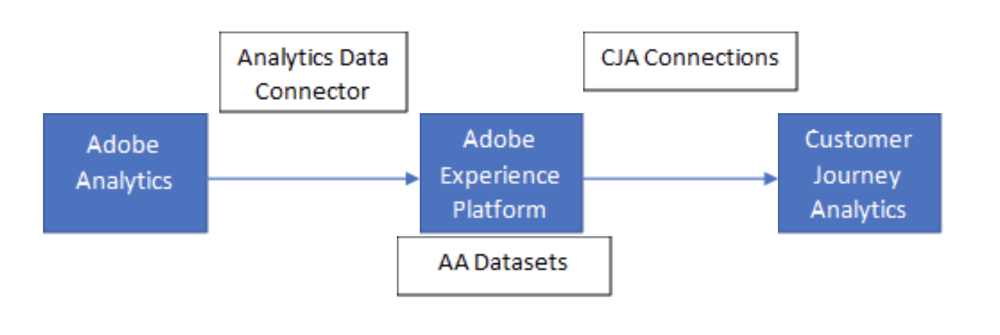

# Analytics ソースコネクタデータと Adobe Analytics の比較

組織で Customer Journey Analytics を導入すると、Adobe Analytics と Customer Journey Analytics のデータにいくつか違いが出る可能性があります。 これらの違いは正常であり、いくつかの理由で発生する可能性があります。 Customer Journey Analytics は、Adobe Analytics のデータに関する制限の一部を改善できるように設計されています。 この柔軟性により、Customer Journey Analytics でのデータの解釈方法にいくつか違いが生じる可能性があります。 この記事では、Customer Journey Analytics と Adobe Analytics でのデータの処理方法に関する潜在的な違いを理解します。

このページでは、[Analytics ソースコネクタ](https://experienceleague.adobe.com/docs/experience-platform/sources/ui-tutorials/create/adobe-applications/analytics.html?lang=ja)を使用して Adobe Analytics データを Adobe Experience Platform に取り込んでから、Customer Journey Analytics で[接続](/help/connections/overview.md)および[データビュー](/help/data-views/data-views.md)を作成したことを前提としています。



レポートプラットフォーム間でデータが異なる可能性がある次の理由を考慮してください。

* **異なるデータセットまたはレポートスイート**：Adobe Analytics のレポートスイートと、ソースコネクタからデータが派生するレポートスイートが同じであることを確認します。
* **カレンダー設定**：Adobe Analytics のレポートスイートには、設定可能なタイムゾーンやその他のカレンダー設定が含まれています。 同様に、Customer Journey Analytics のデータビューには、制御可能な別の設定があります。 パリティが必要な場合は、製品間でこれらの設定が一致していることを確認してください。
* **追加のデータセット**：Customer Journey Analytics では、1 つの接続内に複数のデータセットを含めることができます。 これらの違いには、追加のイベントデータセット、プロファイルデータセット、ルックアップデータセットなどが含まれます。 この機能は、インサイトをクロスチャネルデータに変えることができるという、Adobe Analytics と Customer Journey Analytics の主な差別化要因です。
* **ステッチされたデータセット**：Adobe には、2 つのデータセット間で人物 ID を分析する機能が用意されており、その結果、ステッチされた ID を含む新しいデータセットが作成されます。 これらの[ステッチされたデータセット](/help/stitching/overview.md)には、Adobe Analytics レポートスイートで提供される以外の追加データが含まれます。
* **データソース**：Customer Journey Analytics には、概要データソースやトランザクション ID データソースなど、Adobe Analytics レポートスイートにアップロードされた[データソース](https://experienceleague.adobe.com/ja/docs/analytics/import/data-sources/overview)は含まれていません。
* **ディメンションと指標の設定**：データビュー内では、すべてのディメンションと指標には、組織で変更できる独自の設定が含まれています。 これらの変更はレポートの実行時に適用されるので、遡及的に適用されます。 Adobe Analytics のディメンションと指標の設定によってデータの収集方法が変わり、その時点以降、変更が適用されます。 いずれかの製品でコンポーネント設定を変更すると、レポートに違いが生じる可能性があります。 特定のディメンションに焦点を当てる場合は、アトリビューションと永続性の設定が Adobe Analytics と Customer Journey Analytics の間で一致していることを確認してください。

  >[!TIP]
  >
  >Adobe では、Adobe Analytics のディメンションで「[!UICONTROL 最新（最後）]」の配分を使用することを強くお勧めします。 この配分設定により、Customer Journey Analytics でのアトリビューションの柔軟性が大幅に向上します。

* **訪問定義**：個々のディメンションと指標の設定に加えて、データビュー自体には、訪問者データの解釈方法を根本的に変更する設定が含まれています。 例えば、データビュー全体（Adobe Analytics の[仮想レポートスイート](https://experienceleague.adobe.com/ja/docs/analytics/components/virtual-report-suites/vrs-about)と同様）にセグメントを適用できます。 また、訪問期間の定義を変更したり、目的のイベントで自動的に新しい訪問を開始したりすることもできます。 これらの設定は、Customer Journey Analytics と Adobe Analytics のレポートの違いに大きな影響を与える可能性があります。

## 製品間のレコード数の確認

上記の設定がすべて似ている場合に、製品間のレコード数を少なくとも検証するには、次の手順を使用します。

1. Adobe Experience Platform [クエリサービス](https://experienceleague.adobe.com/ja/docs/experience-platform/query/home)で、次のタイムスタンプ別の合計レコード数クエリを実行します。

   ```sql
   SELECT
     Substring(from_utc_timestamp(timestamp,'{timeZone}'), 1, 10) AS Day,
     Count(_id) AS Records
   FROM  {dataset}
   WHERE   timestamp >= from_utc_timestamp('{fromDate}','UTC')
     AND timestamp < from_utc_timestamp('{toDate}','UTC')
     AND timestamp IS NOT NULL
     AND enduserids._experience.aaid.id IS NOT NULL
   GROUP BY Day
   ORDER BY Day;
   ```

1. Adobe Analytics [データフィード](https://experienceleague.adobe.com/ja/docs/analytics/export/analytics-data-feed/data-feed-overview)で、目的の日付範囲のフィードファイルを生成します。 次の行を識別して除外し、各ファイル内の行数をカウントします。

   * `exclude_hit` は `0`（両方の製品で Analysis Workspace から除外されたデータ）ではありません
   * `hit_source` は、`0`、`3`、`5`、`7`、`8`、`9`、または、`10`（データソースおよびその他のヒットしないデータ）です
   * `page_event` は `53` か `63`（ストリーミングメディアのキープアライブヒット）です

   上記の条件のいずれかに一致する行は、Analytics ソースコネクタの取り込みワークフローから除外されるので、データフィード行をカウントする際にも除外する必要があります。

1. クエリサービスの合計レコード数は、同期間のデータフィードの行数と一致する必要があります。
