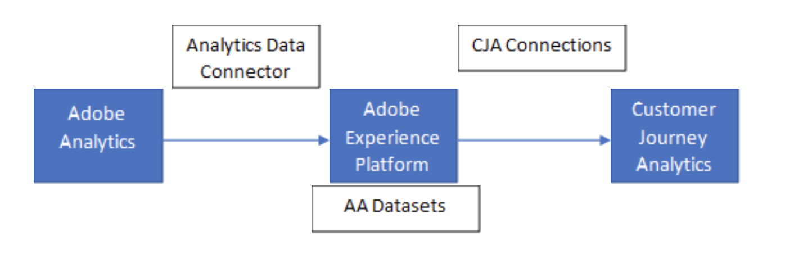

# Adobe Analyticsデータと CJA データの比較

Analytics Source Connector を使用して AEP にAdobe Analyticsデータを取り込み、このデータセットを使用して CJA 接続を作成したとします。



次に、データビューを作成し、その後、CJA に関するこのデータをレポートする際に、Adobe Analyticsのレポート結果との相違に気がつきました。

次に、元のAdobe Analyticsデータを、現在Customer Journey Analytics中のAdobe Analyticsデータと比較するための手順を示します。

## 前提条件 

* AEP の Analytics データセットに、調査中の日付範囲のデータが含まれていることを確認します。

* Analytics で選択したレポートスイートが、Adobe Experience Platformに取り込まれたレポートスイートと一致していることを確認します。

## 手順 1:Adobe Analyticsで回数指標を実行する

この [発生件数](https://experienceleague.adobe.com/docs/analytics/components/metrics/occurrences.html?lang=ja) 指標は、特定のディメンションが設定または持続されたヒット数を示します。

1. Analytics で > [!UICONTROL Workspace]」で、ディメンションとしてレポートする日付範囲を [!UICONTROL フリーフォーム] 表。

1. この [!UICONTROL 発生件数] 指標が自動的にその日付範囲に適用されます。

1. 比較で使用できるように、このプロジェクトを保存します。

## 手順 2:結果をと比較する [!UICONTROL タイムスタンプ別の合計レコード数] CJA で

次に、 [!UICONTROL 発生件数] Analytics の「タイムスタンプ別合計レコード数」にCustomer Journey Analytics。

Analytics ソースコネクタによって削除されたレコードがない場合、タイムスタンプ別の合計レコード数は、回数と一致する必要があります。以下の節を参照してください。

>[!NOTE]
>
>これは、( [クロスチャネル分析](/help/connections/cca/overview.md)) をクリックします。 比較をおこなうには、CJA で使用されるユーザー ID のアカウンティングが重要であることに注意してください。 特にクロスチャネル分析が有効になっている場合は、AA でのレプリケーションが容易でない場合があります。

1. Adobe Experience Platform [クエリサービス](https://experienceleague.adobe.com/docs/experience-platform/query/best-practices/adobe-analytics.html)、次を実行します。 [!UICONTROL タイムスタンプ別の合計レコード数] クエリ：

```
SELECT Substring(from_utc_timestamp(timestamp,'{timeZone}'), 1, 10) as Day, \ 
        Count(_id) AS Records 
        FROM  {dataset} \ 
        WHERE timestamp>=from_utc_timestamp('{fromDate}','UTC') \ 
        AND timestamp<from_utc_timestamp('{toDate}','UTC') \ 
        AND timestamp IS NOT NULL \ 
        AND enduserids._experience.aaid.id IS NOT NULL  \ 
        GROUP BY Day \ 
        ORDER BY Day; 
```

1. In [Analytics データフィード](https://experienceleague.adobe.com/docs/analytics/export/analytics-data-feed/data-feed-contents/datafeeds-reference.html?lang=ja)、生データから、一部の行が Analytics ソースコネクタによって削除された可能性があるかどうかを識別します。

   この [Analytics ソースコネクタ](https://experienceleague.adobe.com/docs/experience-platform/sources/ui-tutorials/create/adobe-applications/analytics.html?lang=ja) は、XDM スキーマへの変換中に行をドロップする可能性があります。 行全体が変換に適さない理由は複数考えられます。 次の Analytics フィールドのいずれかにこれらの値がある場合、行全体が削除されます。

   | Analytics フィールド | 削除される原因となる値 |
   | --- | --- |
   | Opt_out | `y, Y` |
   | In_data_only | 0 ではない |
   | Exclude_hit | 0 ではない |
   | Bot_id | 0 ではない |
   | Hit_source | 0,3,5,7,8,9,10 |
   | Page_event | 53,63 |

1. コネクタが行をドロップした場合は、 [!UICONTROL 発生件数] 指標。 結果の数は、Adobe Experience Platformデータセット内のイベント数と一致する必要があります。

## AEP からの取り込み中にレコードが削除またはスキップされる理由

CJA [接続](/help/connections/create-connection.md) を使用すると、データセット全体で共通の個人 ID に基づいて複数のデータセットを取り込み、結合できます。 バックエンドで、重複排除を適用します。タイムスタンプに基づくイベントデータセットで完全な外部結合または和集合を実行し、ユーザー ID に基づくプロファイルとルックアップデータセットで内部結合を実行します。

AEP からデータを取り込む際にレコードがスキップされる可能性がある理由を以下に示します。

* **タイムスタンプが見つかりません**  — イベントデータセットにタイムスタンプがない場合、それらのレコードは取り込み中に完全に無視またはスキップされます。

* **ユーザー ID がありません**  — （イベントデータセットから、またはプロファイル/ルックアップデータセットから）ユーザー ID が見つからないと、これらのレコードは無視またはスキップされます。 これは、レコードを結合するための共通の ID や一致するキーがないためです。

* **無効または大きなユーザー ID**  — 無効な ID を持つと、結合するデータセット間で有効な共通 ID が見つかりません。 場合によっては、「未定義」や「00000000」など、ユーザー ID 列に無効なユーザー ID が含まれることがあります。 1 ヶ月に 100 万回以上イベントに出現する人物 ID（数字と文字の組み合わせを含む）は、特定のユーザーまたは人物に関連付けることはできません。 無効と分類されます。 これらのレコードはシステムに取り込むことができず、エラーが発生しやすい取り込みとレポート作成がおこなわれます。
