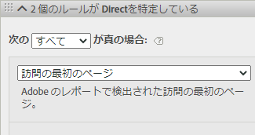
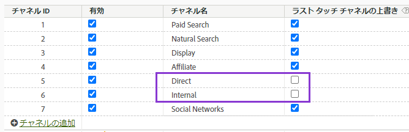
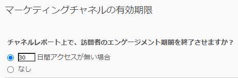

# マーケティングチャネルディメンションの使用

組織で[Analytics ソースコネクタ &#x200B;](https://experienceleague.adobe.com/ja/docs/experience-platform/sources/connectors/adobe-applications/analytics)を使用してレポートスイートデータをCustomer Journey Analyticsに取り込む場合、Customer Journey Analyticsで接続を設定して、マーケティングチャネルディメンションに関するレポートを作成できます。

>[!IMPORTANT]
>
>マーケティングチャネルディメンションについてレポートするネイティブ製品機能については、[派生フィールド – マーケティングチャネルテンプレート &#x200B;](/help/data-views/derived-fields/derived-fields.md#marketing-channels)を参照してください。
>

## 前提条件

* [Analytics ソースコネクタ &#x200B;](https://experienceleague.adobe.com/ja/docs/experience-platform/sources/connectors/adobe-applications/analytics)を使用して、レポートスイートデータを既にAdobe Experience Platformに読み込む必要があります。 他のデータソースはサポートされません。これは、マーケティングチャネルが Analytics レポートスイートの処理ルールに依存しているためです。
* マーケティングチャネルの処理ルールは、事前に設定しておく必要があります。 Adobe Analytics コンポーネントガイドの「[&#x200B; マーケティングチャネルの処理ルール &#x200B;](https://experienceleague.adobe.com/en/docs/analytics/admin/admin-tools/manage-report-suites/edit-report-suite/marketing-channels/c-rules)」を参照してください。

## マーケティングチャネルのスキーマ要素

目的のレポートスイートでAnalytics ソースコネクタを確立すると、XDM スキーマが作成されます。 このスキーマには、すべての Analytics ディメンションと指標が生データとして含まれています。 この生データには、アトリビューションや永続性は含まれていません。 代わりに、各イベントはマーケティングチャネルの処理ルールを確認し、最初に一致したルールを記録します。 Customer Journey Analyticsでデータビューを作成する際に、アトリビューションと永続性を指定します。

1. [Analytics ソースコネクタに基づくデータセットを含む接続](/help/connections/create-connection.md)を作成します。
2. 次のディメンションを含む[データビューを作成](/help/data-views/create-dataview.md)します。
   * **`channel.typeAtSource`**：[マーケティングチャネル](https://experienceleague.adobe.com/en/docs/analytics/components/dimensions/marketing-channel)に相当します。
   * **`channel._id`**：[マーケティングチャネルの詳細](https://experienceleague.adobe.com/en/docs/analytics/components/dimensions/marketing-detail)に相当します。
3. 各ディメンションに、目的のアトリビューションモデルと永続性を指定します。 ファーストタッチディメンションとラストタッチディメンションの両方が必要な場合は、各マーケティングチャネルのディメンションをコンポーネント領域に複数回ドラッグします。 各ディメンションに、目的のアトリビューションモデルと永続性を指定します。 ワークスペースで使いやすくするために、各ディメンションに表示名を付けることもお勧めします。
4. データビューを作成します。

これで、マーケティングチャネルのディメンションを Analysis Workspace で使用できるようになります。

>[!NOTE]
>
> Analytics ソースコネクタでは、`channel.typeAtSource` （マーケティングチャネル）と`channel._id` （マーケティングチャネルの詳細）の両方が入力されている必要があります。 それ以外の場合は、どちらもXDM ExperienceEventに引き継がれません。 ソースレポートスイートに空白のマーケティングチャネルの詳細があり、結果が空白の`channel._id`になり、Analytics ソースコネクタも`channel.typeAtSource`が空白になります。 これらの空白は、Adobe AnalyticsとCustomer Journey Analyticsの間のレポートの違いを生じる可能性があります。

## 処理とアーキテクチャの違い

>[!IMPORTANT]
>
>基本的に、レポートスイートデータと Platform データにはいくつかの違いがあります。 Adobeでは、Experience Platformでの適切なデータ収集を促進するために、レポートスイートのマーケティングチャネル処理ルールを調整することを強くお勧めします。

>[!NOTE]
>
>アトリビューションとCustomer Journey Analyticsに関するマーケティングチャネルの効果を最大化するために、一部の[改訂されたベストプラクティス &#x200B;](https://experienceleague.adobe.com/ja/docs/analytics/components/marketing-channels/mchannel-best-practices)を利用できます。

マーケティングチャネルの設定の動作は、Platform データとレポートスイートデータで異なります。 Customer Journey Analyticsのマーケティングチャネルを設定する際には、次の違いを考慮してください。

* **は訪問の最初のページです**：このルール条件は、いくつかの既定のマーケティング チャネル定義で一般的です。 この条件を含む処理ルールは、Platform では無視されます（同じルール内の他の条件は引き続き適用されます）。 セッションは、データ収集時ではなくデータクエリ時に決定されます。このため、Platform でこの特定のルール条件の使用を回避できます。 アドビでは、「訪問の最初のページ」条件を含むマーケティングチャネル処理ルールを再評価して、目標を達成する別のアプローチを選択することをお勧めします。

  

* **ラストタッチチャネルの上書き**：マーケティングチャネルマネージャでこのオプションを設定すると、通常は、特定のチャネルがラストタッチチャネルのクレジットを受け取るのを回避できます。 Platform ではこの設定が無視されるため、「ダイレクト」や「内部」などの幅広いチャネルが、潜在的に好ましくない方法で指標の影響を受けます。 「ラストタッチチャネルの上書き」をオフにしているチャネルを削除することをお勧めします。
   * Marketing Channel Managerで「Direct」マーケティングチャネルを削除し、そのチャネルに対してCustomer Journey Analyticsの「No value」ディメンション項目を使用できます。 また、データビューを設定する際に、このディメンション項目の名前を「ダイレクト」に変更したり、ディメンション項目を完全に除外したりすることもできます。
   * 別の方法として、Customer Journey Analyticsで除外するチャネルを除いて、各値をそれ自体に分類するマーケティングチャネル分類を作成することもできます。 その後、データビューを作成する際に、`channel.typeAtSource` の代わりに、この分類ディメンションを使用できます。

  

* **マーケティングチャネルの有効期限**：このエンゲージメント期間設定は、ユーザーがレポートスイートデータで新しいファーストタッチチャネルを取得できるようになるまでの非アクティブ期間を決定します。 Platformは独自のアトリビューション設定を使用するので、この設定はCustomer Journey Analyticsでは完全に無視されます。

  

## Customer Journey AnalyticsとAdobe Analyticsの比較

Adobe Experience PlatformのアーキテクチャはAdobe Analytics レポートスイートとは異なるため、結果が一致する保証はありません。 ただし、次のヒントを参考にすると、データの比較が容易になります。

* 上記のアーキテクチャの違いが比較に影響しないことを確認します。 これらの違いには、ラストタッチチャネルを上書きしないチャネルの削除や、訪問（セッション）の最初のヒットであるルール条件の削除などがあります。
* 接続でAdobe Analyticsと同じレポートスイートが使用されていることを再確認します。 Customer Journey Analytics接続に、独自のマーケティングチャネル処理ルールを持つ複数のレポートスイートが含まれている場合、Adobe Analyticsと比較する簡単な方法はありません。 データを比較するには、各レポートスイートに対して個別に接続を作成する必要があります。
* 同じ日付範囲を比較すること、およびデータビューのタイムゾーン設定がレポートスイートのタイムゾーンと同じであることを確認してください。
* レポートスイートデータを表示する際には、カスタムアトリビューションモデルを使用します。 例えば、デフォルト以外のアトリビューションモデルを使用する指標を含む[マーケティングチャネル](https://experienceleague.adobe.com/en/docs/analytics/components/dimensions/marketing-channel)ディメンションを使用します。 デフォルトのディメンションである[ファーストタッチチャネル](https://experienceleague.adobe.com/en/docs/analytics/components/dimensions/first-touch-channel)または[ラストタッチチャネル](https://experienceleague.adobe.com/en/docs/analytics/components/dimensions/last-touch-channel)に対する比較は行わないことをお勧めします。これは、これらがレポートスイートで収集されるアトリビューションに依存しているためです。 Customer Journey Analyticsは、レポートスイートのアトリビューションデータに依存せず、Customer Journey Analytics レポートの実行時に計算されます。
* レポートスイートデータと Platform データのアーキテクチャの違いにより、一部の指標は適切に比較されません。 例としては、訪問/セッション、人物/人物、およびオカレンス/イベントがあります。
