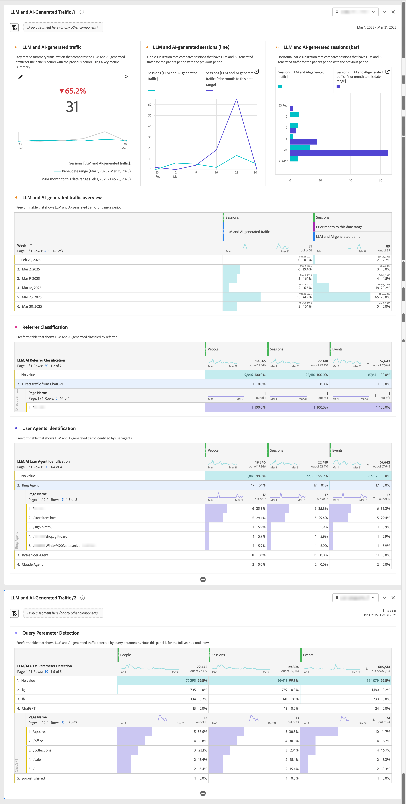

# LLM および AI 生成トラフィックのレポート

このユースケース記事では、Customer Journey Analytics派生フィールド機能を基盤として、LLM （Large Language Model）と AI によって生成されたトラフィックについてレポートする方法について説明します。

## 検出方法

LLM および AI 生成トラフィックを検出するには、次を区別します。

* **LLM クローラー**：拡張生成（RAG）のトレーニングおよび取得のためのデータを収集します。
* **AI エージェント**：人間に代わってタスクを実行するインターフェイスとして機能します。 AI エージェントは、web 分析のトラッキングメソッドをバイパスする API を介したやり取りを好みます。 それでも、AI で生成されたトラフィックのかなりの部分を web サイトを通じて分析できます。

LLM および AI 生成トラフィックを識別および監視する 3 つの一般的なコア検出方法は、次のとおりです。

* **ユーザーエージェントの識別**: サーバーにリクエストが行われると、HTTP ユーザーエージェント ヘッダーが抽出され、既知の AI クローラーおよびエージェントパターンに対して分析されます。 このサーバーサイドメソッドは、HTTP ヘッダーへのアクセスを必要とし、データ収集レイヤーで実装する場合に最も効果的です。
* **リファラーの分類**:HTTP リファラーヘッダーには、現在のリクエストにリンクされる前の web ページの URL が含まれます。 このヘッダーは、ユーザーが ChatGPT や Perplexity などの web インターフェイスからサイトにクリックスルーしたときに表示されます。
* **クエリパラメーターの検出**:AI サービスは、URL パラメーター（特に UTM パラメーター）をリンクに追加できます。 これらのパラメーターは URL 内に保持され、標準の分析実装を通じて検出できるので、これらの URL パラメーターは、クライアントサイドのトラッキングシナリオでも有益な指標となります。

次の表に、さまざまな LLM および AI インタラクション シナリオに対して検出方法をどのように使用できるかを示します。

| シナリオ | ユーザーエージェントの識別 | リファラーの分類 | クエリパラメーターの検出 |
|---|---|---|---|
| **模型に係る訓練等** | サーバーサイドログが実装されている場合は、エージェント（`GPTBot`、`ClaudeBot` など）を識別できます。 | 分類はできません。 AI クローラーは、トレーニング中にリファラーを生成しません。 | 検出は不可能です。 AI クローラーは、トレーニング中にパラメーターを追加しません。 |
| **エージェントの参照** | サーバーサイドログでヘッダーがキャプチャされる際に、エージェント（`ChatGPT-User`、`claude-web`）を識別できます。 | リファラーを保持する AI インターフェイスからエージェントが移動すると、分類が可能になります。 | AI サービスがトラッキングパラメーターを追加すると、検出が可能な場合があります。 |
| **クエリに回答するための検索拡張生成（RAG）** | エージェント（`OAI-SearchBot`、`PerplexityBot`）は、サーバーサイドログで識別できます。 | RAG 操作はリファラーのメカニズムをバイパスすることが多いので、通常、分類はできません。 | AI プロバイダーが特別に実装しない限り、検出は不可能です。 |
| **ユーザーがクリックスルー** | エージェントを識別できません。 AI エージェントは、通常のユーザーエージェントとして表示されます。 | ユーザーが AI インターフェイス（[chatgpt.com](https://chatgpt.com)、[claude.ai](https://claude.ai) など）からリンクをクリックすると、分類が可能になります。 | AI サービスがアウトバウンドリンクに UTM パラメーターを追加すると、検出が可能になります。 |
| **交通視認条件** | Customer Journey Analyticsとのサーバーサイドログ統合またはエージェントを識別するためのサーバーサイドタグ付けが必要です。 | 分類は、AI プラットフォームのリファラーポリシーと適切な HTTP ヘッダー送信に依存します。 | 検出には、リダイレクトによるパラメーターの保持と、適切な URL パラメーターの収集が必要です。 |

### 課題

LLM および AI エージェントは、デジタルプロパティを操作する際に、複雑で進化する動作を示します。 これらのテクノロジーは、プラットフォームとバージョン間で一貫性なく動作します。 この不整合は、データプロフェッショナル固有の課題を生み出します。 行動パターンは大きく異なり、使用する AI プラットフォーム、バージョン、インタラクションモードによって異なります。 この運用上の多様性により、標準の分析フレームワーク内で LLM と AI によって生成されたトラフィックを追跡および分類する取り組みが複雑になります。 これらのやり取りは複雑であり、その急速な進化も伴うため、データの整合性を維持するために微妙な検出とクラス分けの方法が必要となります。

* **部分的なデータ収集**：一部の新しい AI エージェントは、限定的なJavaScriptを実行するので、クライアントサイド実装の分析データが不完全になります。 その結果、一部のインタラクションは追跡されますが、その他のインタラクションは見逃されます。
* **セッションデータの不一致**:AI エージェントによるJavaScriptの実行は、セッションやページタイプによって異なる場合があります。 この実行差により、クライアントサイド実装用にCustomer Journey Analyticsで断片化されたユーザージャーニーが作成されます。
* **検出の課題**：部分的なトラッキングでは、特定のタッチポイントが Analytics に表示されない可能性があるので、検出の信頼性が低くなります。

## 検出のシグネチャ

2025 年 8 月の時点で、検出手法ごとに以下の具体的な信号が特定できるようになりました。

### ユーザーエージェントの識別

<table>
<thead>
<tr>
<th>クローラ</th>
<th>ユーザーエージェント文字列</th>
<th>目的/動作</th>
</tr>
</thead>
<tbody>
<tr>
<td><strong>GPTBot</strong></td>
<td><code>Mozilla/5.0 AppleWebKit/537.36 (KHTML, like Gecko); compatible; GPTBot/1.1; +<a href="https://openai.com/gptbot" target="_blank" rel="noopener nofollow noreferrer">https://openai.com/gptbot</a></code></td>
<td><a href="https://platform.openai.com/docs/bots/" target="_blank" rel="noopener nofollow noreferrer">ChatGPT と言語モデルのトレーニングに使用する、OpenAI の主要な web クローラー</a></td>
</tr>
<tr>
<td><strong>ChatGPT – ユーザー</strong></td>
<td><code>Mozilla/5.0 AppleWebKit/537.36 (KHTML, like Gecko); compatible; ChatGPT-User/1.0; +<a href="https://openai.com/bot" target="_blank" rel="noopener nofollow noreferrer">https://openai.com/bot</a></code></td>
<td><a href="https://platform.openai.com/docs/bots/" target="_blank" rel="noopener nofollow noreferrer">ChatGPT がユーザーの代わりに web サイトを閲覧する際に使用されます（従来）</a></td>
</tr>
<tr>
<td><strong>ChatGPT-User v2</strong></td>
<td><code>Mozilla/5.0 AppleWebKit/537.36 (KHTML, like Gecko); compatible; ChatGPT-User/2.0; +<a href="https://openai.com/bot" target="_blank" rel="noopener nofollow noreferrer">https://openai.com/bot</a></code></td>
<td><a href="https://platform.openai.com/docs/bots/" target="_blank" rel="noopener nofollow noreferrer">オンデマンド取得と応答内検索のための ChatGPT の更新バージョン</a></td>
</tr>
<tr>
<td><strong>OAI-SearchBot</strong></td>
<td><code>Mozilla/5.0 AppleWebKit/537.36 (KHTML, like Gecko); compatible; OAI-SearchBot/1.0; +<a href="https://openai.com/searchbot" target="_blank" rel="noopener nofollow noreferrer">https://openai.com/searchbot</a></code></td>
<td><a href="https://platform.openai.com/docs/bots/" target="_blank" rel="noopener nofollow noreferrer">コンテンツを検索するための ChatGPT の検索中心のクローラー</a></td>
</tr>
<tr>
<td><strong>CloudeBot</strong></td>
<td><code>Mozilla/5.0 AppleWebKit/537.36 (KHTML, like Gecko); compatible; ClaudeBot/1.0; +claudebot@anthropic.com</code></td>
<td><a href="https://support.claude.com/en/articles/8896518-does-anthropic-crawl-data-from-the-web-and-how-can-site-owners-block-the-crawler" target="_blank" rel="noopener nofollow noreferrer">クラウド AI アシスタントのトレーニングと更新に使用する、Anthropic のクローラー</a></td>
</tr>
<tr>
<td><strong>クロード・ユーザー</strong></td>
<td><code>Mozilla/5.0 AppleWebKit/537.36 (KHTML, like Gecko; compatible; Claude-User/1.0; +Claude-User@anthropic.com)</code></td>
<td><a href="https://support.claude.com/en/articles/8896518-does-anthropic-crawl-data-from-the-web-and-how-can-site-owners-block-the-crawler" target="_blank" rel="noopener nofollow noreferrer">Claude AI ユーザーをサポート個人が Claude に質問すると、Cl ...を使用して Web サイトにアクセスできます。</a></td>
</tr>
<tr>
<td><strong>Claude-SearchBot</strong></td>
<td><code>Mozilla/5.0 AppleWebKit/537.36 (KHTML, like Gecko; compatible; Claude-SearchBot/1.0; +Claude-SearchBot@anthropic.com)</code></td>
<td><a href="https://support.claude.com/en/articles/8896518-does-anthropic-crawl-data-from-the-web-and-how-can-site-owners-block-the-crawler" target="_blank" rel="noopener nofollow noreferrer">オンラインコンテンツを分析して、クラウド AI ユーザーの検索結果の品質を向上させるために Web をナビゲートします…</a></td>
</tr>
<tr>
<td><strong>PerplexityBot</strong></td>
<td><code>Mozilla/5.0 AppleWebKit/537.36 (KHTML, like Gecko; compatible; PerplexityBot/1.0; +<a href="https://www.perplexity.ai/perplexitybot" target="_blank" rel="noopener nofollow noreferrer">https://perplexity.ai/perplexitybot</a>)</code></td>
<td><a href="https://docs.perplexity.ai/guides/bots" target="_blank" rel="noopener nofollow noreferrer">リアルタイムの web データインデックス作成を実現する Perplexity.ai のクローラー</a></td>
</tr>
<tr>
<td><strong>Perplexity-User</strong></td>
<td><code>Mozilla/5.0 AppleWebKit/537.36 (KHTML, like Gecko; compatible; Perplexity-User/1.0; +<a href="https://www.perplexity.ai/useragent" target="_blank" rel="noopener nofollow noreferrer">https://www.perplexity.ai/useragent</a>)</code></td>
<td><a href="https://docs.perplexity.ai/guides/bots" target="_blank" rel="noopener nofollow noreferrer">ユーザーが Perplexity の引用をクリックした場合にページを読み込みます（robots.txt をバイパス）</a></td>
</tr>
<tr>
<td><strong>Google-Extended</strong></td>
<td><code>Mozilla/5.0 (compatible; Google-Extended/1.0; +<a href="https://support.google.com/webmasters/answer/182072" target="_blank" rel="noopener nofollow noreferrer">http://www.google.com/bot.html</a>)</code></td>
<td><a href="https://blog.google/technology/ai/an-update-on-web-publisher-controls/" target="_blank" rel="noopener nofollow noreferrer">標準の Googlebot とは別の、Gemini 用のGoogleの AI に焦点を当てたクローラー</a></td>
</tr>
<tr>
<td><strong>BingBot</strong></td>
<td><code>Mozilla/5.0 (compatible; BingBot/1.0; +<a href="http://www.bing.com/bot.html" target="_blank" rel="noopener nofollow noreferrer">http://www.bing.com/bot.html</a>)</code></td>
<td>Bing Search と Bing Chat を機能させるMicrosoftのクローラー（コパイロット）</td>
</tr>
<tr>
<td><strong>DuckAssistBot</strong></td>
<td><code>Mozilla/5.0 (compatible; DuckAssistBot/1.0; +<a href="https://duckduckgo.com/bot.html" target="_blank" rel="noopener nofollow noreferrer">http://www.duckduckgo.com/bot.html</a>)</code></td>
<td><a href="https://duckduckgo.com/duckduckgo-help-pages/results/duckassistbot" target="_blank" rel="noopener nofollow noreferrer">DuckAssist、DuckDuckGo のプライベート AI 回答機能のコンテンツを削除します</a></td>
</tr>
<tr>
<td><strong>YouBot</strong></td>
<td><code>Mozilla/5.0 (compatible; YouBot (+<a href="http://www.you.com" target="_blank" rel="noopener nofollow noreferrer">http://www.you.com</a>))</code></td>
<td>You.com の AI 検索およびブラウザーアシスタントの背後にあるクローラー</td>
</tr>
<tr>
<td><strong>meta-externalagent</strong></td>
<td><code>Mozilla/5.0 (compatible; meta-externalagent/1.1 (+<a href="https://developers.facebook.com/docs/sharing/webmasters/web-crawlers" target="_blank" rel="noopener nofollow noreferrer">https://developers.facebook.com/docs/sharing/webmasters/crawler</a>))</code></td>
<td><a href="https://developers.facebook.com/docs/sharing/webmasters/web-crawlers#identify-2" target="_blank" rel="noopener nofollow noreferrer">LLM をトレーニングまたは微調整するためのデータを集めるMetaのボット</a></td>
</tr>
<tr>
<td><strong>Amazonbot</strong></td>
<td><code>Mozilla/5.0 (Macintosh; Intel Mac OS X 10_10_1) AppleWebKit/600.2.5 (KHTML, like Gecko) Version/8.0.2 Safari/600.2.5 (Amazonbot/0.1; +<a href="https://developer.amazon.com/amazonbot" target="_blank" rel="noopener nofollow noreferrer">https://developer.amazon.com/support/amazonbot</a>)</code></td>
<td><a href="https://developer.amazon.com/amazonbot" target="_blank" rel="noopener nofollow noreferrer">検索および AI アプリケーション用のAmazonのクローラー</a></td>
</tr>
<tr>
<td><strong>Applebot</strong></td>
<td><code>Mozilla/5.0 (Macintosh; Intel Mac OS X 10_15_5) AppleWebKit/605.1.15 (KHTML, like Gecko) Version/13.1.1 Safari/605.1.15 (Applebot/0.1; +<a href="https://support.apple.com/kb/HT6619" target="_blank" rel="noopener nofollow noreferrer">http://www.apple.com/go/applebot</a>)</code></td>
<td><a href="https://support.apple.com/en-us/119829" target="_blank" rel="noopener nofollow noreferrer">Spotlight、Siri および Safari 用のAppleのクローラー</a></td>
</tr>
<tr>
<td><strong>Applebot-Extended</strong></td>
<td><code>Mozilla/5.0 (compatible; Applebot-Extended/1.0; +<a href="https://www.apple.com/bot.html" target="_blank" rel="noopener nofollow noreferrer">http://www.apple.com/bot.html</a>)</code></td>
<td><a href="https://support.apple.com/en-us/119829" target="_blank" rel="noopener nofollow noreferrer">将来の AI モデル向けのAppleの AI に焦点を当てたクローラー（オプトイン）</a></td>
</tr>
<tr>
<td><strong>Bytespider</strong></td>
<td><code>Mozilla/5.0 (compatible; Bytespider/1.0; +<a href="https://www.bytedance.com/bot.html" target="_blank" rel="noopener nofollow noreferrer">http://www.bytedance.com/bot.html</a>)</code></td>
<td>TikTokおよびその他のサービス用の ByteDance の AI データコレクター</td>
</tr>
<tr>
<td><strong>MicrosoftAI-User</strong></td>
<td><code>Mozilla/5.0 (compatible; MistralAI-User/1.0; +<a href="https://mistral.ai/bot" target="_blank" rel="noopener nofollow noreferrer">https://mistral.ai/bot</a>)</code></td>
<td><a href="https://docs.mistral.ai/robots/" target="_blank" rel="noopener nofollow noreferrer">Mistral の「Le Chat」アシスタント用リアルタイム引用フェッチャー</a></td>
</tr>
<tr>
<td><strong>cohere-ai</strong></td>
<td><code>Mozilla/5.0 (compatible; cohere-ai/1.0; +<a href="http://www.cohere.ai/bot.html" target="_blank" rel="noopener nofollow noreferrer">http://www.cohere.ai/bot.html</a>)</code></td>
<td>Cohere の言語モデルのテキスト データを収集します</td>
</tr>
</tbody>
</table>

### リファラーの分類

<table>
<thead>
<tr>
<th><strong>ソース</strong></th>
<th><strong>リファラー</strong></th>
<th><strong>トラフィックタイプ</strong></th>
</tr>
</thead>
<tbody>
<tr>
<td>ChatGPT</td>
<td>chatgpt.com</td>
<td>ChatGPT インターフェイスからの直接トラフィック</td>
</tr>
<tr>
<td>クロード</td>
<td>claude.ai</td>
<td>Anthropic の Cloud インターフェイスからのトラフィック</td>
</tr>
<tr>
<td>Google ジェミニ</td>
<td>gemini.google.com</td>
<td>Googleの AI アシスタントからのトラフィック</td>
</tr>
<tr>
<td>Microsoft コパイロット</td>
<td>copilot.microsoft.com</td>
<td>Microsoftの AI アシスタントからのトラフィック</td>
</tr>
<tr>
<td>Microsoft コパイロット</td>
<td>m365.cloud.microsoft</td>
<td>Microsoftの AI アシスタント（Microsoft 365 Cloud Services）からのトラフィック</td>
</tr>
<tr >
<td>Perplexity AI</td>
<td>perplexity.ai</td>
<td>引用を使用した AI 検索からのトラフィック</td>
</tr>
<tr>
<td>META AI</td>
<td>meta.ai</td>
<td>Metaの AI アシスタントからのトラフィック</td>
</tr>
</tbody>
</table>

### クエリパラメーターの検出

<table>
<thead>
<tr>
<th><strong>LLM サービス</strong></th>
<th>URL の例</th>
<th><strong>クエリパラメーター</strong></th>
<th><strong>値の例</strong></th>
</tr>
</thead>
<tbody>
<tr>
<td>ChatGPT</td>
<td ><a href="https://www.yoursite.com/product?utm_source=chatgpt.com" target="_blank" rel="noopener nofollow noreferrer">https://www.yoursite.com/product?utm_source=chatgpt.com</a></td>
<td>utm_source</td>
<td>chatgpt.com</td>
</tr>
<tr>
<td>当惑</td>
<td><a href="https://www.yoursite.com/article?utm_source=perplexity" target="_blank" rel="noopener nofollow noreferrer">https://www.yoursite.com/article?utm_source=perplexity</a></td>
<td>utm_source</td>
<td>当惑</td>
</tr>
</tbody>
</table>

## 実装

[&#x200B; 派生フィールド &#x200B;](#derived-fields)、[&#x200B; セグメント &#x200B;](#segments)、および [&#x200B; ワークスペースプロジェクト &#x200B;](#workspace-project) の具体的な設定と設定を通じて、一般的なCustomer Journey Analytics設定（接続、データビュー、ワークスペースプロジェクト）内で LLM および AI 生成トラフィックについてレポートできます。

### 派生フィールド

検出方法及び検出信号を構成するために、導出フィールドを基礎として使用する。 例えば、ユーザーエージェントの識別、クエリパラメーターの検出、リファラーの分類などの派生フィールドを定義します。

#### LLM/AI ユーザーエージェントの識別

[Case When](/help/data-views/derived-fields/derived-fields.md#case-when) 派生フィールド関数を使用して、LLM/AI ユーザーエージェントを識別する派生フィールドを定義します。

{zoomable="yes"}

#### LLM/AI クエリパラメーター検出

[URL 解析 &#x200B;](/help/data-views/derived-fields/derived-fields.md#url-parse) および [&#x200B; 分類 &#x200B;](/help/data-views/derived-fields/derived-fields.md#classify) 派生フィールド関数を使用して、UTM パラメーター検出を検出する派生フィールドを定義します。

{zoomable="yes"}

#### LLM/AI リファラー分類

URL の解析および派生フィールドの分類関数を使用して、リファラーを分類する派生フィールドを定義してください。

{zoomable="yes"}

### セグメント

LLM および AI 生成トラフィックに関連するイベント、セッションまたは人物を識別するのに役立つ専用のセグメントを設定します。 例えば、以前に作成した派生フィールドを使用して、LLM および AI によって生成されたトラフィックを識別するセグメントを定義します。

{zoomable="yes"}

### Workspace プロジェクト

派生フィールドとセグメントを使用して、LLM および AI で生成されたトラフィックをレポートおよび分析します。 例えば、以下の注釈付きプロジェクトを参照してください。

{zoomable="yes"}

>[!MORELIKETHIS]
>
>このユースケースの記事は、ブログ記事 [Adobe Customer Journey Analyticsでの LLM と AI 生成トラフィックのトラッキングと分析 &#x200B;](https://experienceleaguecommunities.adobe.com/t5/adobe-analytics-blogs/tracking-and-analyzing-llm-and-ai-generated-traffic-in-adobe/ba-p/771967?profile.language=ja) に基づいています。
>
>
