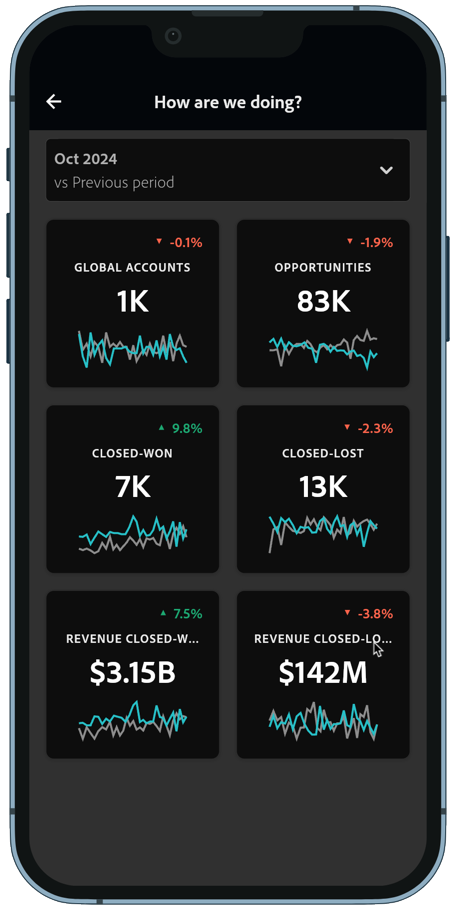

# 製品価値の構築

プロダクトマネージャーやCMO、CEOに、B2B製品の価値に関するインサイトを提供する場合。 たとえば、データ主導の解約分析や予測などを通じて。 モバイルダッシュボードを通じて、これらのインサイトを理解しやすくします。

Customer Journey Analytics B2B editionが、製品価値のインサイトの提供をサポートします。 例については、次の節を参照してください。

## 顧客離れを減らす

製品の利用率が低い、ブランドエンゲージメントが低い、その他の解約の可能性が高いことを示す重要な要因があるアカウントを特定します。 このような早期発見により、アカウント活性化戦略を策定することができます。

[ アクティブな成長](/help/guided-analysis/types/active-growth.md) ガイド付き分析は、次の方法を決定するのに役立ちます。

* 特定の期間におけるアカウント、機会、ユーザーの成長と獲得に関するインサイトを導き出します。
* 最近のエンゲージメントがない休眠アカウントを特定します。 更新やアップセルの戦略を決定できます。
* カスタマーサクセスや営業部門と提携し、休眠顧客とリエンゲージメントする。 使用率の低さを調査し、製品の機能強化を計画して、顧客離れに対処し、導入の遅れや停滞を解消できます。

### 例

新規、リピート、リピート、休眠アカウントをまたいで、アクティブな純増加率を確認できます。

1. [ アクティブな成長](/help/guided-analysis/types/active-growth.md) ガイド付き分析を作成して設定します。
1. **[!UICONTROL アカウント]**&#x200B;を&#x200B;**[!UICONTROL として選択し、]**&#x200B;としてカウントします。
1. **[!UICONTROL チャート設定]**&#x200B;を選択します。 例： **[!UICONTROL Stacked bar]**。
1. 優先する **[!UICONTROL 間隔]**&#x200B;および&#x200B;**[!UICONTROL 日付範囲]**&#x200B;を選択します。

## インサイトの民主化

CMOやCEO向けの重要なインサイトを民主化することで、例えば、モバイルデバイスからのアカウントデータや製品の使用状況を一目で確認することができます。

[ モバイルスコアカード ](/help/mobile-app/home.md)は、これらのインサイトを提供するのに役立ちます。

### 例

アカウント、機会、成約および失注の機会、それらの機会に関連する収益に関する詳細を組み合わせたモバイルスコアカードを作成します。

1. [ モバイルスコアカードを作成](/help/mobile-app/create-scorecard.md)。
1. レポートする期間を定義します。 例：**[!UICONTROL 2024年10月vs前期]**。
1. 関連する指標をアプリキャンバスにドラッグ&amp;ドロップします。 例：**[!UICONTROL グローバルアカウント]**、**[!UICONTROL 商談]**、**[!UICONTROL 契約成立]**、**[!UICONTROL 契約成立]**、**[!UICONTROL 契約成立]**、および&#x200B;**[!UICONTROL 契約成立]**。

   

1. ダッシュボードをプレビューするには、**[!UICONTROL プレビュー]**&#x200B;を使用します。 ダッシュボードは、[Google Play](https://apps.apple.com/us/app/adobe-analytics-dashboards/id1509062264)または[App Store](https://play.google.com/store/apps/details?id=com.adobe.analyticsdashboards)からAdobe Analytics ダッシュボードアプリで利用できるようになりました。

   
