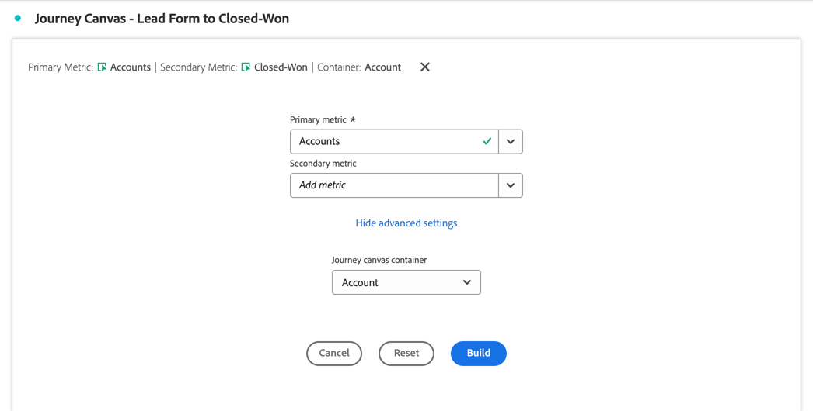
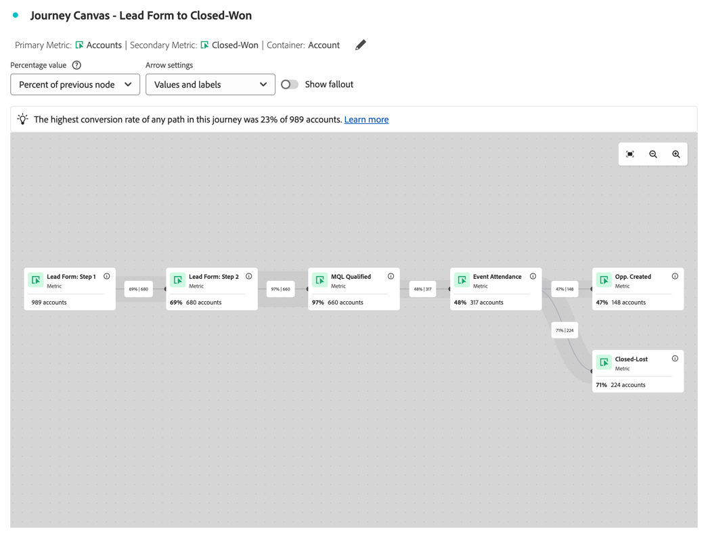
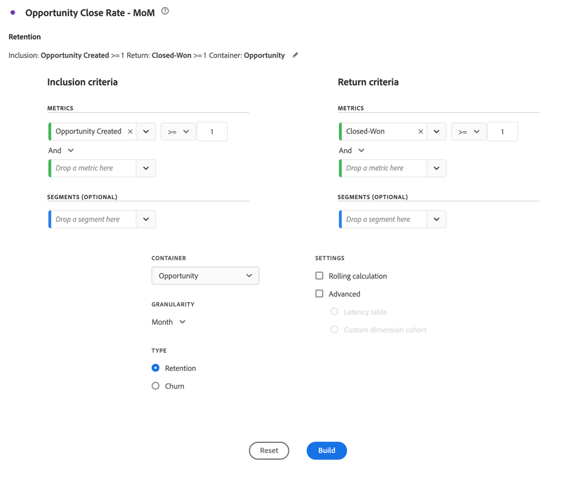
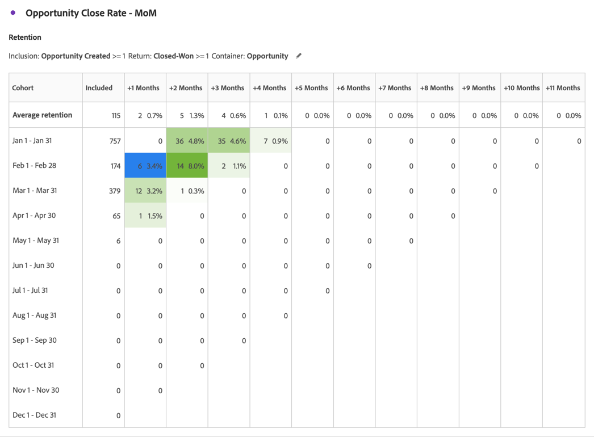
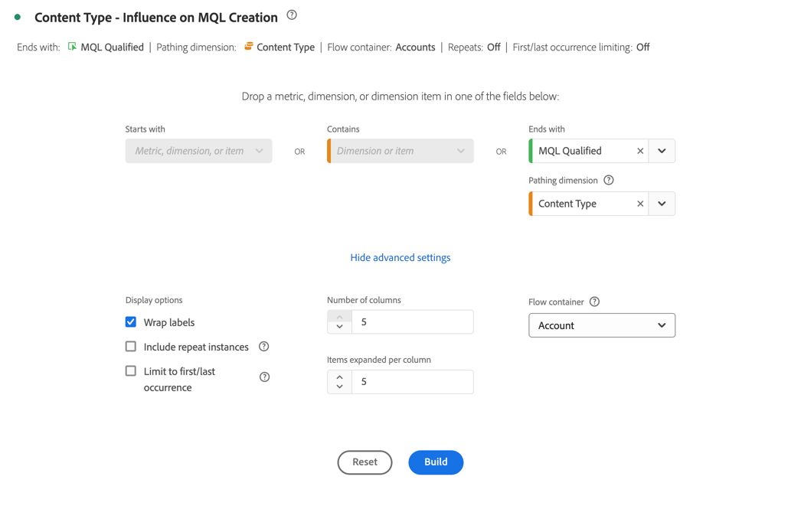
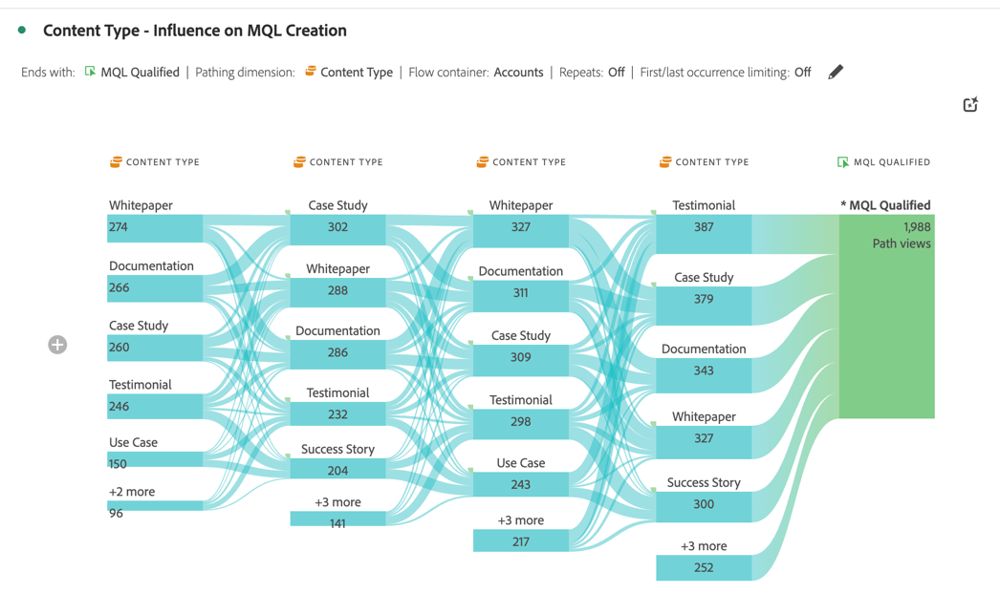

# アカウントマーケティングの最適化

効果的なアカウントベースドマーケティングを実現するには、アカウントレベルで購買ジャーニーを詳細に把握する必要があります。 これにより、最も効果的なマーケティング施策を特定し、成約につなげることができます。

この理解では、次の項目について分析および検討します。

* マーケティング効果：

   * キャンペーン、チャネル、コンテンツをまたいで一貫性を確保。
   * 基準となるリード数を，

* セールスパイプラインの進行：
* アップセルとクロスセルの機会：
* 顧客アカウントの健全性：

Customer Journey Analytics B2B editionは、アカウントマーケティングの最適化をサポートします。 例については、次の節を参照してください。

## アカウントベースドマーケティングのエンゲージメント

商談成立を促進する上で、オンラインとオフラインの両方のエクスペリエンスの中から、最も効果的なものを特定します。

[ジャーニーキャンバス &#x200B;](/help/analysis-workspace/visualizations/journey-canvas/journey-canvas.md)のビジュアライゼーションを使用して、アカウント、商談、購買グループ、キャンペーン、チャネルをまたいであらゆるインタラクションをマッピングし、アカウントマーケティングで効果のあるものや改善できる点を把握できます。

ジャーニーキャンバスのビジュアライゼーションを使用すると、次のことが可能になります。

* 全文をご覧ください。 例えば、オンラインとオフラインのすべての既知のインタラクションを含む、*特定*&#x200B;の価値の高いアカウントまたは購買グループの詳細なパスを表示できます。
* 重要なマイルストーンに至ったり、それに続く重要なアクション（マーケティングクオリファイドリードトリガー、オポチュニティの構築など）をコンテクストに沿って表示できます。
* 特定のアカウントに関するビジュアライゼーションのインタラクション履歴を通じて、セールススタッフをサポートします。 こうした可視化により、適切な会話が可能になります。

### 例

リードフォームから成約までのジャーニーを可視化することができます。

1. [ジャーニーキャンバスを作成して設定します](/help/analysis-workspace/visualizations/journey-canvas/configure-journey-canvas.md) ビジュアライゼーション。
1. **[!UICONTROL プライマリ]**&#x200B;を&#x200B;**[!UICONTROL アカウント指標]**&#x200B;として設定します。
1. **[!UICONTROL Account]**&#x200B;を&#x200B;**[!UICONTROL ジャーニーキャンバスコンテナ]**&#x200B;として選択してください。

   

1. 「**[!UICONTROL 作成]**」を選択します。
1. カンバス上にノードをドラッグ&amp;ドロップし、ノードを接続して、アカウントジャーニーを示します。 例：**[!UICONTROL リードフォーム：ステップ 1]** フォームから&#x200B;**[!UICONTROL 商談まで。]**&#x200B;を作成しました。

   

## コホートセグメント

主要なバイヤーグループを特定し、有料メディア、電子メール、ソーシャルなどのチャネルでこれらのバイヤーグループを活用します。

[&#x200B; コホートテーブル &#x200B;](/help/analysis-workspace/visualizations/cohort-table/cohort-analysis.md)のビジュアライゼーションを使用して、共通の出発点（市場適格性（MQL）リード日など）に基づいてB2B エンティティ（アカウント、商談、購買グループ）をグループ化します。 後続のステージやマイルストーンで、これらの各エンティティの進捗状況を経時的に追跡できます。

コホートテーブルの視覚化では、次のことが可能になります。

* アカウントやオポチュニティのコホートが、数週間から数カ月にわたって重要なマイルストーン（たとえば、MQLからSQL リードへ）に到達する速度を分析します。
* 特定のコホート（セグメント、キャンペーンソース、購買グループのタイプ別）が、他のコホートよりもセールスサイクルをより迅速に進めるかどうかを特定します。
* 戦略的イニシアチブ（マーケティングキャンペーンなど）とその後のコホートに対する短い進行タイムラインとの相関関係を評価します。

### 例

成約した商談の毎月のコホートを確認できます。

1. [&#x200B; コホートテーブルの作成と設定](/help/analysis-workspace/visualizations/cohort-table/t-cohort.md) ビジュアライゼーション。
1. **[!UICONTROL 商談作成日]**&#x200B;を&#x200B;**[!UICONTROL 包含基準]**&#x200B;指標として使用します。 演算子として&#x200B;**[!UICONTROL >=]**&#x200B;を選択し、値`1`を入力します。
1. **[!UICONTROL クローズ済み]**&#x200B;を&#x200B;**[!UICONTROL 返品条件]**&#x200B;指標として使用します。 演算子として&#x200B;**[!UICONTROL >=]**&#x200B;を選択し、値`1`を入力します。
1. コンテナとして&#x200B;**[!UICONTROL Opportunity]**&#x200B;を選択します。

   

1. 「**[!UICONTROL 作成]**」を選択します。 コホートテーブルの例については、以下を参照してください。

   

## 対面イベント

複数の対面イベントをまたいで、エンゲージメントしているアカウントや視聴アクティビティをレポートします。 対面イベントへの参加がもたらす影響を分析し、最適化することができます。

[&#x200B; フロー](/help/analysis-workspace/visualizations/c-flow/flow.md)のビジュアライゼーションを使用すると、ユーザーのパスを可視化できますが、現在ではアカウントや購買グループも可視化し、インタラクションやステージ間を時間をかけて移動します。

フロービジュアライゼーションを使用すると、次のことが可能になります。

* B2B エンティティがトラバースするタッチポイントの最も頻繁なシーケンスを特定します（例：*サイト訪問*～*ホワイトペーパーのダウンロード*～*デモのリクエスト*&#x200B;まで）。
* アカウントや購買グループが非直線的にどのように移動しているかを視覚化します（例：ループバック、ステージのスキップ、予期しないルートの取得）。
* 重要なインタラクションの前または後のフロー（例：デモリクエスト）に焦点を当て、インタラクションの要因や後のアクションを把握します。

### 例

MQL （マーケティングクオリファイドリード）の生成への影響を可視化する必要があります。

1. [&#x200B; フロー](/help/analysis-workspace/visualizations/c-flow/create-flow.md) ビジュアライゼーションを作成して設定します。
1. **[!UICONTROL の**&#x200B;[!UICONTROL &#x200B; MQL Qualified &#x200B;]&#x200B;**を]**&#x200B;で終了を選択します。
1. **[!UICONTROL パスディメンション]**&#x200B;の&#x200B;**[!UICONTROL コンテンツタイプ]**&#x200B;を選択します。
1. **[!UICONTROL 詳細設定を表示]**&#x200B;を選択します。
1. **[!UICONTROL 列数]**&#x200B;に`5`と入力します。
1. **[!UICONTROL フローコンテナ]**&#x200B;の&#x200B;**[!UICONTROL アカウント]**&#x200B;を選択します。

   

1. 「**[!UICONTROL 作成]**」を選択します。

   
