# B2B editionのユースケース向けの設定

この記事では、次の使用例をサポートするためのCustomer Journey Analytics B2B editionの一般的な設定について説明します。

* [アカウントマーケティングの最適化](optimize-account-marketing.md)
* [主要アカウントの拡大](grow-key-accounts.md)
* [製品価値の構築](build-product-value.md)

>[!NOTE]
>
>これらのユースケースで使用されるデモデータとスクリーンショットは、イラスト用であり、実際のデータを反映するものではありません。

## ソリューション設計リファレンス

Customer Journey Analytics B2B editionを設定する前に、収集する各フィールドを文書化する適切なソリューション設計参照を配置していることを確認してください。

ソリューション設計リファレンスの例を次に示します。

+++ イベントディメンション

| Dimension名 |
|---|
| アカウント ID |
| アカウント名 |
| 購買グループ ID |
| コールセンター |
| コールセンター担当者ID |
| 通話ID |
| キャンペーントラッキングコード |
| コンテンツ ID |
| コンテンツタイプ |
| データソース |
| デバイスタイプ |
| イベントの詳細 |
| イベント名 |
| ファネル |
| インタラクションチャネル |
| リード ID |
| マーケティングチャネル |
| マーケティングイベント ID |
| マーケティングイベントタイプ |
| 商談 ID |
| ページ |
| ページの詳細 |
| 参照ドメイン |
| 営業担当者ID |
| セールスステージ名 |
| セールスステージ番号 |
| サイトセクション |
| SKU |
| 補助アカウント ID |
| 調査ID |
| アンケート満足度スコア |
| 調査の種類 |
| ユーザー ID |

+++

+++ イベント指標

| Metric name | イベントタイプ |
|---|---|
| アカウント作成：完了 | カウンタ |
| アカウント作成：開始 | カウンタ |
| コールコスト | 通貨 |
| 通話の長さ | カウンタ |
| コール満足度スコア | 数値 |
| 電話調査が完了しました | カウンタ |
| 通話 | カウンタ |
| クローズドロス | カウンタ |
| 契約成立 | カウンタ |
| コンテンツビュー | カウンタ |
| 取引サイズ通貨表示のクリックスルー | カウンタ |
| 表示回数 | カウンタ |
| 電子メールのバウンス | カウンタ |
| 電子メールクリック数 | カウンタ |
| メール配信済み | カウンタ |
| 電子メール開封済み | カウンタ |
| 送信済み電子メール | カウンタ |
| イベントへの参加 | カウンタ |
| イベント登録：完了 | カウンタ |
| イベント登録：手順1 | カウンタ |
| イベント登録：手順2 | カウンタ |
| イベント登録：手順3 | カウンタ |
| グローバル満足度スコア数値インバウンドコール | カウンタ |
| リードフォーム：完了 | カウンタ |
| リードフォーム：ステップ 1 | カウンタ |
| リードフォーム：ステップ 2 | カウンタ |
| 生成されたリード | カウンタ |
| クオリフィケーション | カウンタ |
| Meetings | カウンタ |
| MQLが失効しました | カウンタ |
| MQL認定 | カウンタ |
| ニーズ評価 | カウンタ |
| 交渉力 | カウンタ |
| オブジェクションハンドリング | カウンタ |
| 機会 | カウンタ |
| 機会の創出 | カウンタ |
| 注文件数 | カウンタ |
| アウトバウンドコール | カウンタ |
| ポストセールスフォローアップ | カウンタ |
| 提案書の提出 | カウンタ |
| クローズド/ロスト済み収益 | 通貨 |
| 成約済み | 通貨 |
| セールス担当者への連絡 | カウンタ |
| セールスステージ開始 | カウンタ |
| SMS クリックスルー | カウンタ |
| SMS送信 | カウンタ |
| ソーシャルクリックスルー | カウンタ |
| 社会的印象 | カウンタ |
| 製品プレゼンテーション | カウンタ |
| SQLが無効 | カウンタ |
| SQL認定 | カウンタ |
| 単位（表示しない） | カウンタ |
| VoC調査満足度スコア | 数値 |
| VoC調査が完了しました | カウンタ |

+++

+++ 人物レコード

| データビューフィールド名 | フィールドタイプ |
|---|---|
| 年齢 | 指標 |
| 年齢層 | ディメンション |
| カテゴリー1親和性レベル | ディメンション |
| カテゴリー1親和性スコア | 指標 |
| カテゴリー2親和性レベル | ディメンション |
| カテゴリー2親和性スコア | 指標 |
| カテゴリー3親和性レベル | ディメンション |
| カテゴリー3親和性スコア | 指標 |
| カテゴリー4親和性レベル | ディメンション |
| カテゴリー4親和性スコア | 指標 |
| カテゴリー5親和性レベル | ディメンション |
| カテゴリー5親和性スコア | 指標 |
| 同意Advertising | ディメンション |
| すべての通信に同意 | ディメンション |
| 同意ダイレクトメール | ディメンション |
| 同意メール | ディメンション |
| 同意携帯電話 | ディメンション |
| 同意Personalization | ディメンション |
| 同意共有データ | ディメンション |
| 同意SMS | ディメンション |
| 電子メール | ディメンション |
| 名 | ディメンション |
| 性別 | ディメンション |
| 個別市 | ディメンション |
| 個々のCLTV レベル | ディメンション |
| 個別CLTV スコア | 指標 |
| 個別国 | ディメンション |
| 個人の電話番号 | ディメンション |
| 個人郵便番号 | ディメンション |
| 個人の購買傾向 | ディメンション |
| 個人購買傾向スコア | 指標 |
| 個人の解約レベルへの傾向 | ディメンション |
| 顧客離れ傾向スコア | 指標 |
| 個人のアップグレードレベルへの傾向 | ディメンション |
| 個人のアップグレードスコア傾向 | 指標 |
| Individual State | ディメンション |
| 個人の住所 | ディメンション |
| 役職 | ディメンション |
| 姓 | ディメンション |
| ネットプロモータースコア | 指標 |
| ネットプロモーターステータス | ディメンション |
| 役割タイプ | ディメンション |

+++

+++ アカウントレコード

| データビューフィールド名 | フィールドタイプ |
|---|---|
| 年間売上高 | 指標 |
| 会社市区町村 | ディメンション |
| 会社のCLTV レベル | ディメンション |
| 企業のCLTV スコア | 指標 |
| 会社の国 | ディメンション |
| 会社名 | ディメンション |
| 会社の電話番号 | ディメンション |
| 会社の郵便番号 | ディメンション |
| 購買レベルに対する企業傾向 | ディメンション |
| 企業購買傾向スコア | 指標 |
| 解約レベルに対する企業傾向 | ディメンション |
| 解約スコアに対する企業傾向 | 指標 |
| アップグレードレベルに対する企業傾向 | ディメンション |
| アップグレードスコアに対する企業傾向 | 指標 |
| 企業規模 | ディメンション |
| 会社の状態 | ディメンション |
| 会社の住所 | ディメンション |
| 業界 | ディメンション |
| 従業員数 | 指標 |
| パートナーオーディエンス – ハードウェア購入者 | ディメンション |
| パートナーオーディエンス – 急成長 | ディメンション |
| パートナーオーディエンス – 必要なサービス | ディメンション |
| パートナーオーディエンス – ソフトウェア購入者 | ディメンション |
| 売上高範囲 | ディメンション |
| Web サイト | ディメンション |

+++

+++ SKU レコード

| データビューフィールド名 | フィールドタイプ |
|---|---|
| ハードウェア製品カテゴリ | ディメンション |
| ハードウェア製品名 | ディメンション |
| サービスカテゴリ | ディメンション |
| サービス名 | ディメンション |
| ソフトウェア製品カテゴリ | ディメンション |
| ソフトウェア製品名 | ディメンション |

+++

## スキーマとデータセット

ソリューション設計参照をサポートするデータは、次のスキーマとデータセットを使用して構造化されます。

### イベントデータ

イベントディメンションと指標は、時系列（イベント）ベースのスキーマと、イベントデータを含む1つ以上のデータセットでサポートされます。

<!--
For example: the Account ID field is mapped to **[!UICONTROL Account ID]**. See below for a preview of the data typically available in such a dataset.

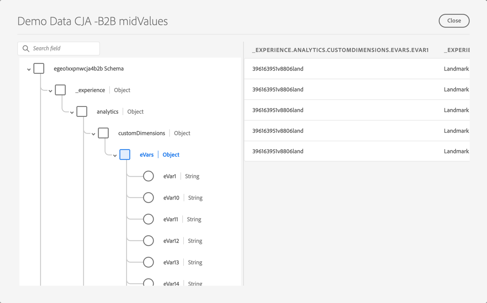
-->

### 人物データ

人物レコードは、レコード（プロファイル）ベースのスキーマと、人物データを含む1つ以上のデータセットを通じてサポートされます。 このようなデータセットで通常使用できる人物データの例（ソリューション設計参照の例に基づく）については、以下を参照してください。

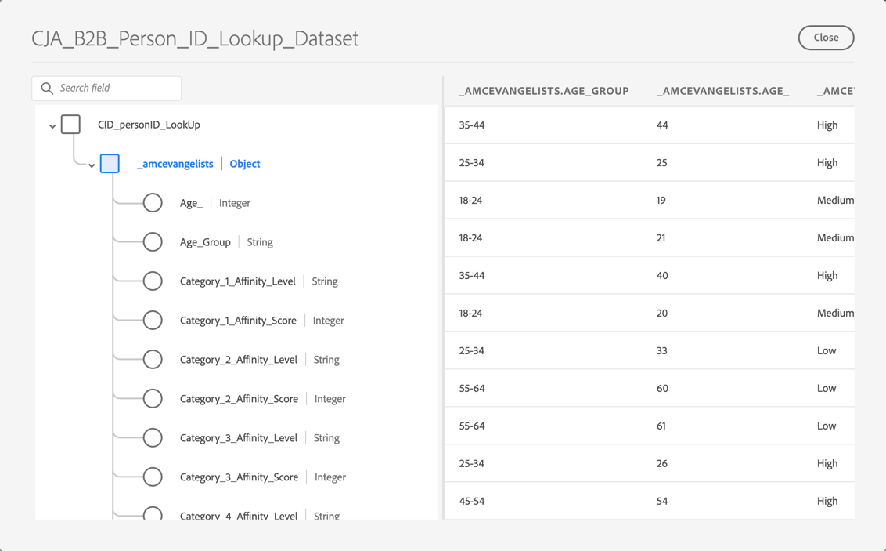

### アカウントデータ

アカウントレコードは、レコード（ルックアップ）レコードベースのスキーマと、アカウントデータを含む1つ以上のデータセットを通じてサポートされます。 このようなデータセットで通常使用できるアカウントデータの例（ソリューション設計リファレンスの例に基づく）については、以下を参照してください。

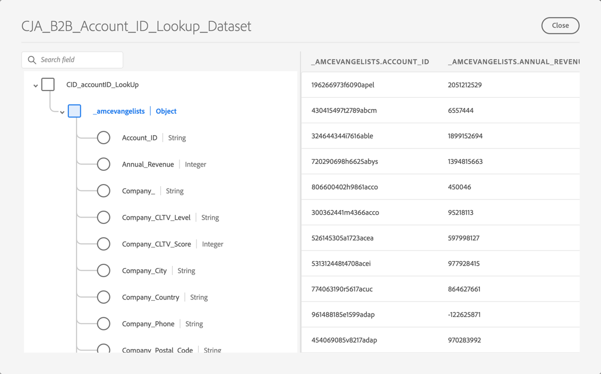

### SKU データ

SKU レコードは、レコード（ルックアップ）ベースのスキーマと、SKU データを含む1つ以上のデータセットを通じてサポートされます。 このようなデータセットで通常使用されるSKU データの例（ソリューション設計リファレンスの例に基づく）については、以下を参照してください。

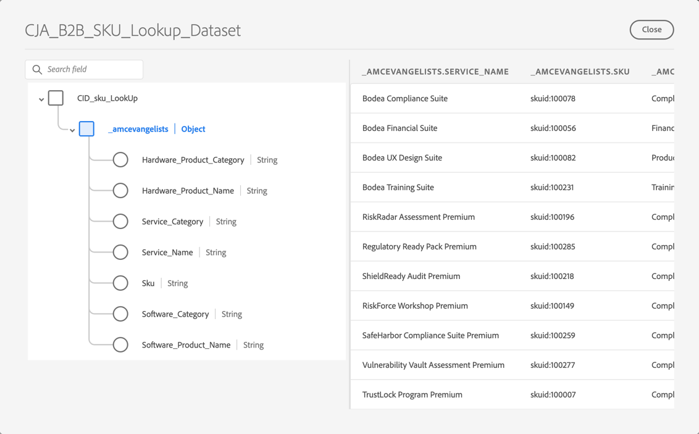

## 接続

Customer Journey Analyticsでアカウントベースの接続を定義して、イベント、アカウント、人物、SKUのデータセットからレコードを取り込み、結合します。

1. [Customer Journey Analyticsで新しい接続](/help/connections/create-connection.md)を作成します。
1. 接続のわかりやすい名前と説明を入力します。
1.  **[!UICONTROL Account]**&#x200B;を&#x200B;**[!UICONTROL プライマリID]**&#x200B;として選択します。
1. すべての&#x200B;**[!UICONTROL オプションのコンテナ]**&#x200B;を選択します。
1. 好みのサンドボックスを選択し、1日の平均イベント数を推定します。

   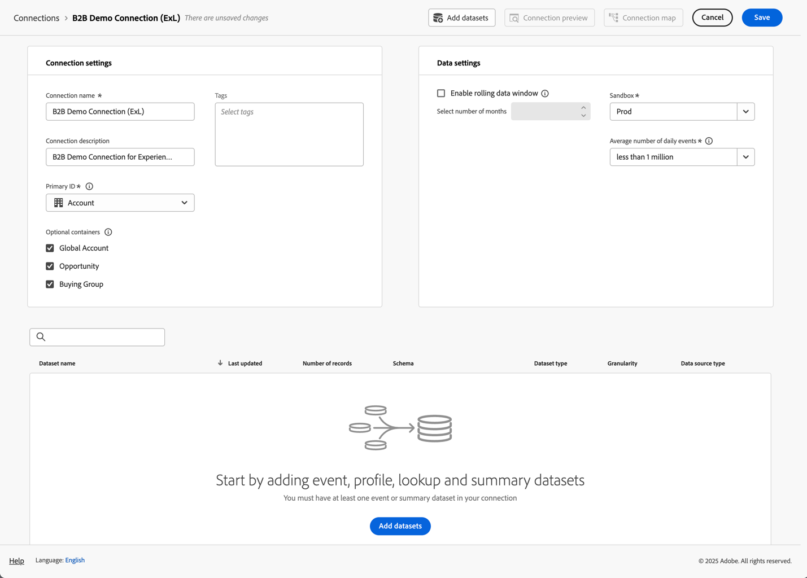

1. 「**[!UICONTROL データセットを追加]**」を選択し、イベント、アカウント、人物、SKUのデータを含むB2B データセットを追加します。

   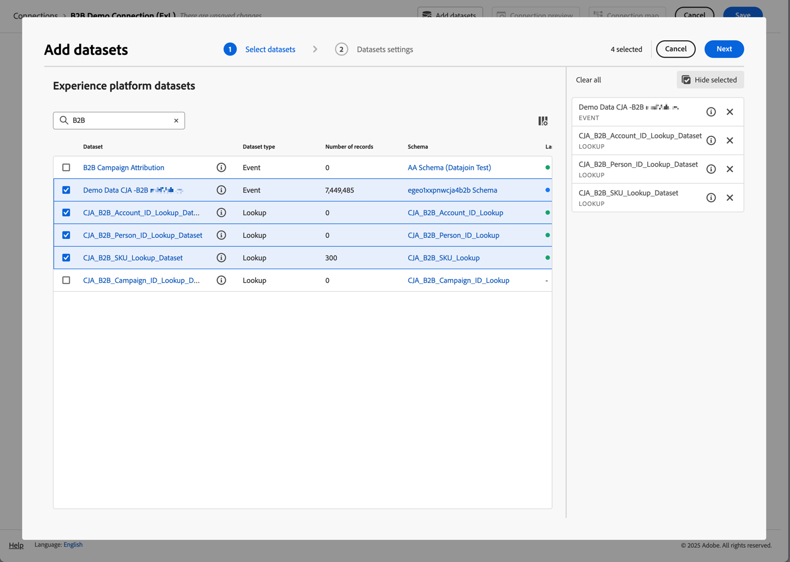

1. **[!UICONTROL 次へ]**&#x200B;を選択して、選択した各データセットの設定を構成します。
1. イベントデータセットの場合、**[!UICONTROL アカウント ID]**、**[!UICONTROL グローバルアカウント ID]**、**[!UICONTROL 商談ID]**、**[!UICONTROL 購買グループ ID]**&#x200B;および&#x200B;**[!UICONTROL 人物ID]**&#x200B;のIDに対応する適切なフィールドを選択してください。

   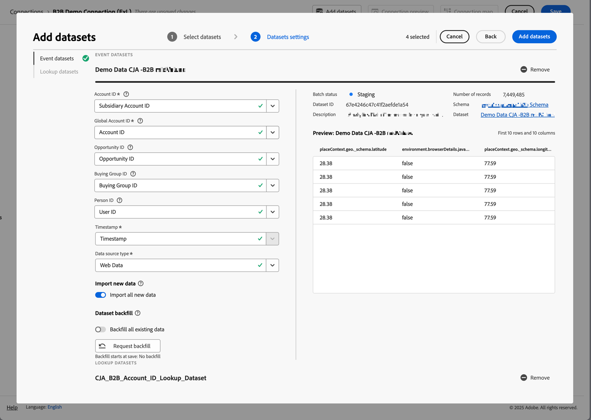

1. 下にスクロールして、アカウントレコードデータセットを設定します。 **[!UICONTROL グローバルアカウント]** コンテナでアカウントに一致する正しい識別子（**[!UICONTROL Account_ID]**）を選択していることを確認してください。 正しい識別子（**[!UICONTROL Account_ID]**）を&#x200B;**[!UICONTROL グローバルアカウントフィールド]**&#x200B;として選択します。

   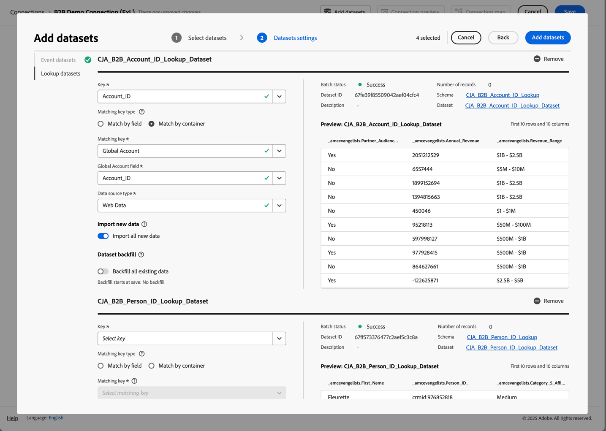

1. 下にスクロールして、人物レコードデータセットを設定します。 **[!UICONTROL 人物]** コンテナで人物に一致する正しいキー（**[!UICONTROL 人物ID]**）を選択していることを確認してください。 **[!UICONTROL グローバルアカウント]** フィールドに一致する適切なID （**[!UICONTROL Profile_Account_ID_Individual]**）を選択します。

   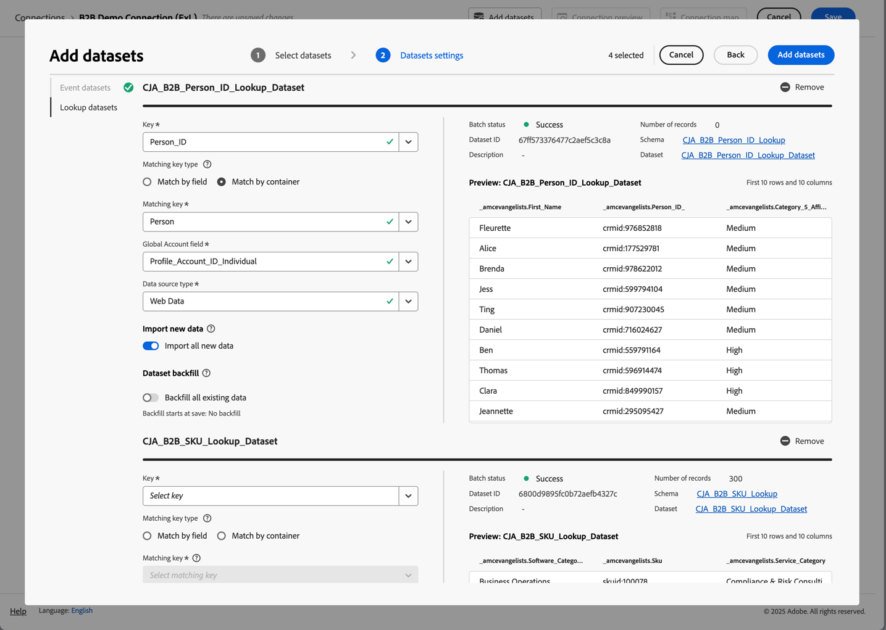

1. 下にスクロールして、SKU レコードデータセットを設定します。 正しいキー（**[!UICONTROL Sku]**）を選択していることを確認してください。 このデータに対してコンテナが設定されていないか、使用できない場合は、**[!UICONTROL フィールドで一致]**&#x200B;を選択します。 イベントデータセット（**[!UICONTROL SKU （イベントデータセット）]**）のSKU フィールドを一致するキーとして選択します。

   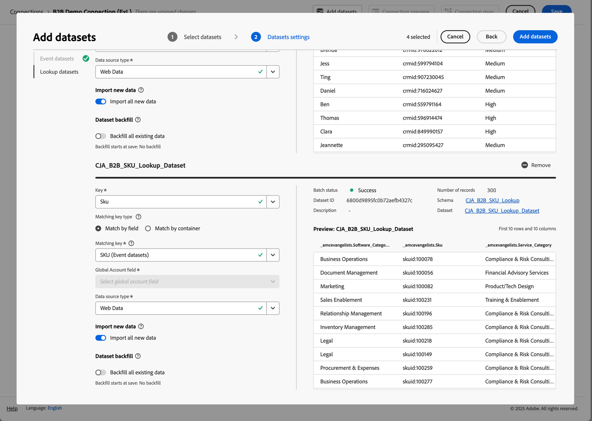

1. 「**[!UICONTROL データセットを追加]**」を選択して、データセットと設定された設定を保存します。

1. 接続を保存するには、**[!UICONTROL 保存]**&#x200B;を選択します。

## データビュー

Customer Journey Analyticsにデータを取り込んだ後、ソリューション設計参照で定義したすべてのコンポーネントを含むデータビューを作成します。

### 設定

1. [Customer Journey Analyticsで新しいデータビュー](/help/data-views/data-views.md)を作成します。
1. 以前に作成した接続を選択します（例：**[!UICONTROL B2B デモ接続（ExL）]**）。
1. データビューの名前を指定します。 例：`B2B Demo Data view (ExL)`、オプションで説明。
1. 必要に応じて、コンテナの名前を変更します。 または、デフォルトのコンテナ名に固執します。

   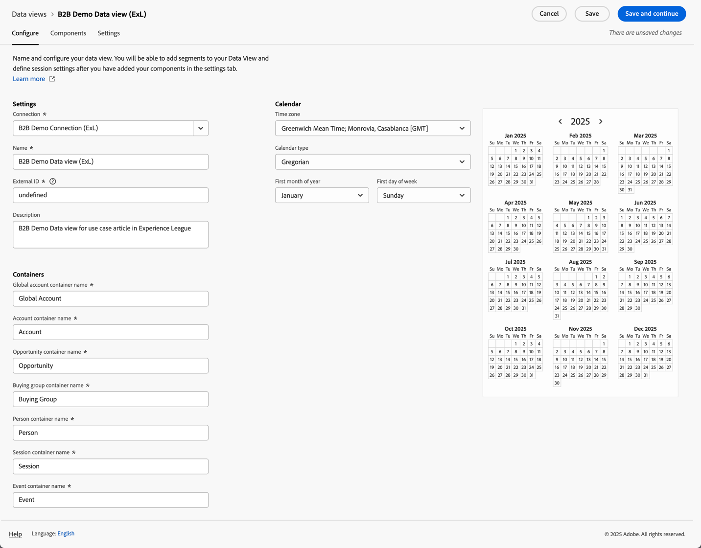
1. 「**[!UICONTROL 保存して続行]**」を選択します。

### コンポーネント

デフォルトでは、すべての[標準コンポーネント &#x200B;](/help/data-views/component-reference.md)は既にデータビューに含まれています。 これらの標準コンポーネントには、アカウント、購買グループ、グローバルアカウント、商談に関するB2B固有の指標が含まれます。

1. [&#x200B; ソリューションデザインリファレンス &#x200B;](#solution-design-reference)で定義したすべてのイベントディメンションを、データビューのディメンションコンポーネントに追加します。 例えば、**[!UICONTROL イベント名]** ディメンションを表すフィールド **[!UICONTROL イベント名]**&#x200B;があります。 使用可能な[&#x200B; コンポーネント設定](/help/data-views/component-settings/overview.md)を使用して、ディメンションコンポーネントを構成していることを確認してください。

   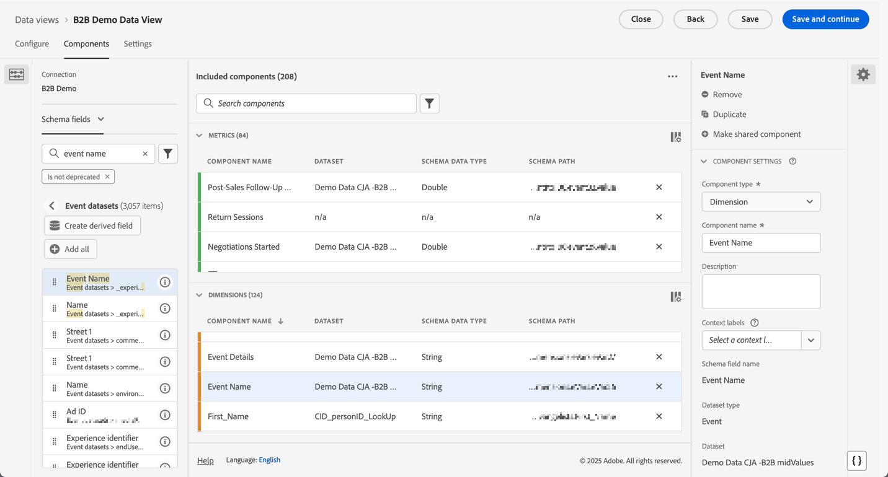

1. [&#x200B; ソリューション デザイン リファレンス &#x200B;](#solution-design-reference)で定義したすべてのイベント指標を、データ ビューの指標コンポーネントに追加します。 例えば、フィールド **[!UICONTROL SQL Qualified]**&#x200B;は、**[!UICONTROL SQL Qualified]**&#x200B;指標を表します。 使用可能な[&#x200B; コンポーネント設定](/help/data-views/component-settings/overview.md)を使用して、ディメンションコンポーネントを構成していることを確認してください。

   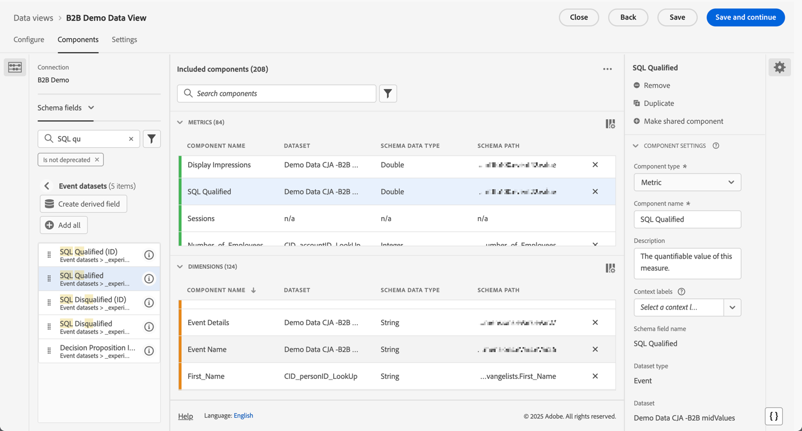

1. [&#x200B; ソリューション デザイン リファレンス &#x200B;](#solution-design-reference)で定義したすべてのアカウント ディメンションを、データ ビューのディメンション コンポーネントに追加します。 例えば、**[!UICONTROL Industry]** ディメンションを表すフィールド **[!UICONTROL Industry]**&#x200B;があります。 使用可能な[&#x200B; コンポーネント設定](/help/data-views/component-settings/overview.md)を使用して、ディメンションコンポーネントを構成していることを確認してください。

   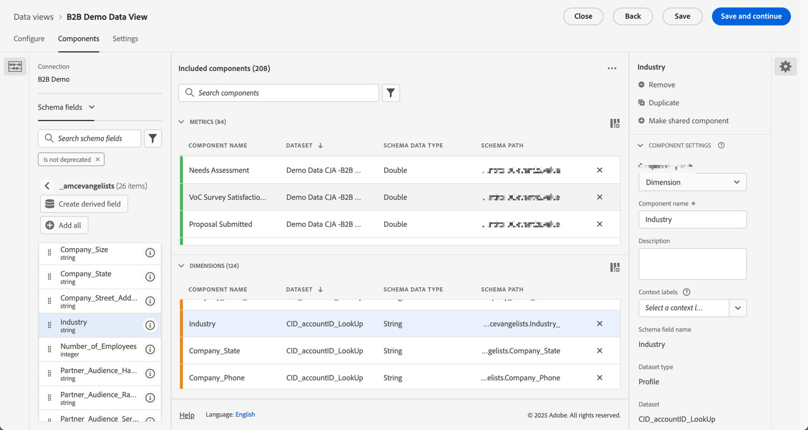

1. [&#x200B; ソリューション デザイン リファレンス &#x200B;](#solution-design-reference)で定義したすべてのアカウント指標を、データ ビューの指標コンポーネントに追加します。 例えば、フィールド **[!UICONTROL Number_of_Employees]**&#x200B;は、**[!UICONTROL Number_of_Employees]**&#x200B;指標を表します。 使用可能な[&#x200B; コンポーネント設定](/help/data-views/component-settings/overview.md)を使用して、ディメンションコンポーネントを構成していることを確認してください。

   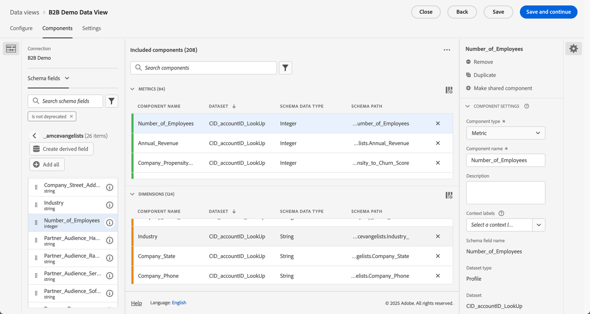

1. [&#x200B; ソリューション デザイン リファレンス &#x200B;](#solution-design-reference)で定義したすべての人物ディメンションを、データ ビューのディメンション コンポーネントに追加します。 例えば、**[!UICONTROL Category_1_Affinity_Level]**&#x200B;というフィールドは、**[!UICONTROL Category_1_Affinity_Level]**&#x200B;のディメンションを表します。 使用可能な[&#x200B; コンポーネント設定](/help/data-views/component-settings/overview.md)を使用して、ディメンションコンポーネントを構成していることを確認してください。

   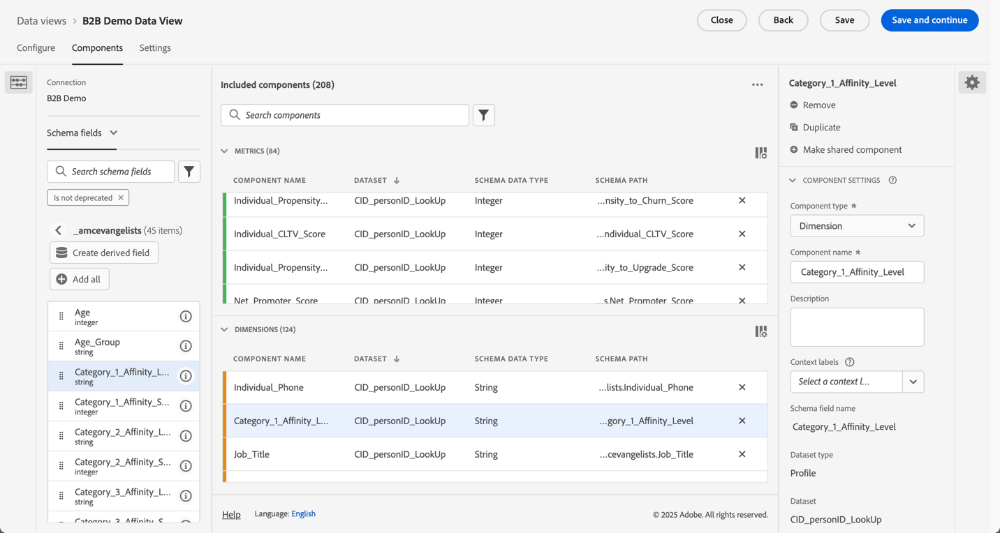

1. [&#x200B; ソリューション デザイン リファレンス &#x200B;](#solution-design-reference)で定義したすべての人物の指標を、データ ビューの指標コンポーネントに追加します。 例えば、フィールド **[!UICONTROL Category_1_Affinity_Score]**&#x200B;は、**[!UICONTROL Category_1_Affinity_Score]**&#x200B;指標を表します。 使用可能な[&#x200B; コンポーネント設定](/help/data-views/component-settings/overview.md)を使用して、ディメンションコンポーネントを構成していることを確認してください。

   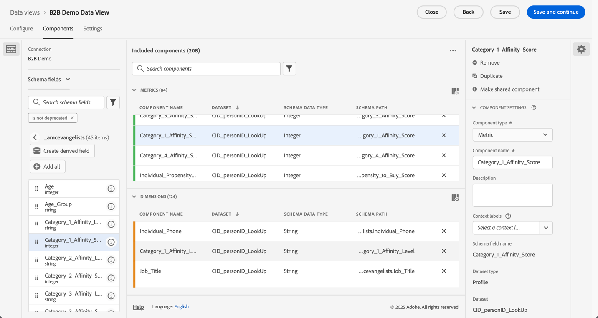

1. [&#x200B; ソリューション デザイン リファレンス &#x200B;](#solution-design-reference)で定義したすべてのSKU ディメンションを、データ ビューのディメンション コンポーネントに追加します。 例えば、**[!UICONTROL サービスカテゴリ]** ディメンションを表すフィールド **[!UICONTROL サービスカテゴリ]**&#x200B;があります。 使用可能な[&#x200B; コンポーネント設定](/help/data-views/component-settings/overview.md)を使用して、ディメンションコンポーネントを構成していることを確認してください。

   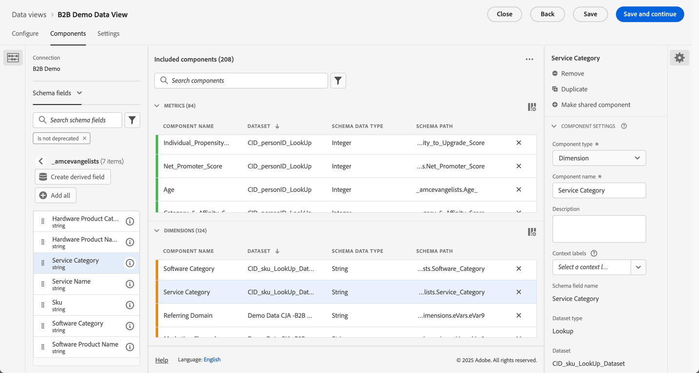

1. **[!UICONTROL 保存して続行]**&#x200B;を選択します。

### 設定

1. 必要に応じて、データビューに対して特定の[設定](/help/data-views/create-dataview.md#settings-1)を定義できます。

   * データビューにセグメントを追加します。
   * （計算）指標を使用して、セッション設定を定義します。

1. 「**[!UICONTROL 保存して続行]**」を選択します。

## セグメント

Workspace プロジェクトで使用できる、1つ以上のB2B固有のコンテナベースのセグメントを準備できます。

次に例を示します。

* イベント登録セグメントを持つアカウント。

  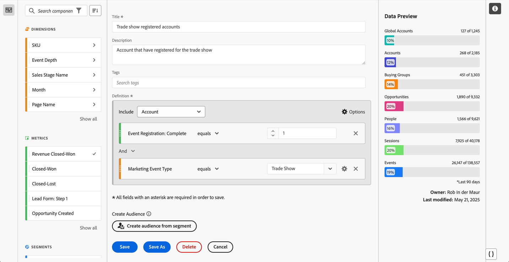

* 購買グループとステージ 5の商談セグメントを持つ米国アカウント。

  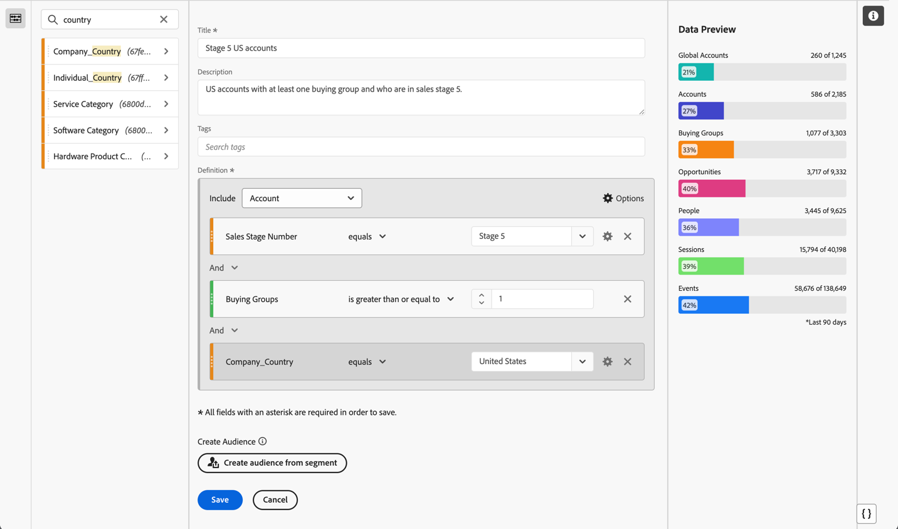

## その他

[計算指標](/help/components/calc-metrics/calc-metr-overview.md)、[日付範囲](/help/components/date-ranges/overview.md)、[&#x200B; アラート &#x200B;](/help/components/c-intelligent-alerts/intelligent-alerts.md)など、ユースケース用の他のコンポーネントをオプションで定義できます。
