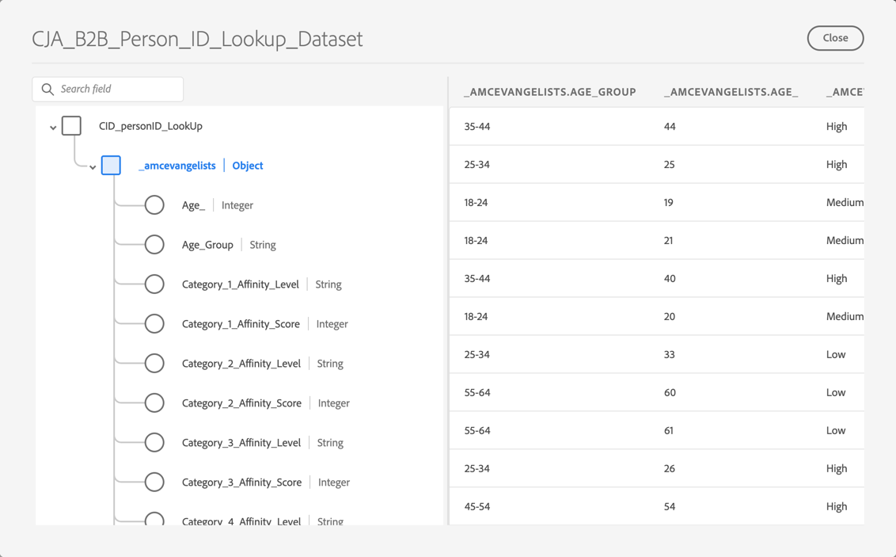

# B2B edition ユースケースの設定

この記事では、次のユースケースをサポートするCustomer Journey Analytics B2B editionの一般的な設定について説明します。

* [アカウントマーケティングの最適化](optimize-account-marketing.md)
* [主要アカウントの拡大](grow-key-accounts.md)
* [製品価値の構築](build-product-value.md)

>[!NOTE]
>
>これらのユースケースで使用されるデモデータとスクリーンショットは、説明目的のみで、実際のデータを反映していません。

## ソリューションデザインリファレンス

Customer Journey Analytics B2B editionを設定する前に、収集する各フィールドを文書化する適切なソリューションデザインリファレンスが用意されていることを確認してください。

ソリューションデザイン参照の例を次に示します。

+++ イベントディメンション

| Dimension名 |
|---|
| アカウント ID |
| アカウント名 |
| 購買グループ ID |
| コールセンター |
| コールセンター担当者 ID |
| 通話 ID |
| キャンペーントラッキングコード |
| コンテンツ ID |
| コンテンツタイプ |
| データソース |
| デバイスタイプ |
| イベントの詳細 |
| イベント名 |
| ファネル |
| インタラクションチャネル |
| リード ID |
| マーケティングチャネル |
| マーケティングイベント ID |
| マーケティングイベントタイプ |
| 商談 ID |
| ページ |
| ページの詳細 |
| 参照ドメイン |
| 営業担当者 ID |
| 販売ステージ名 |
| 販売ステージ番号 |
| サイトセクション |
| SKU |
| 補助アカウント ID |
| 調査 ID |
| 調査満足度スコア |
| 調査タイプ |
| ユーザー ID |

+++

+++ イベント指標

| Metric name | イベントタイプ |
|---|---|
| アカウントの作成：完了 | カウンター |
| アカウント作成：開始 | カウンター |
| 通話コスト | 通貨 |
| 通話の長さ | カウンター |
| 通話満足度スコア | 数値 |
| アンケートの呼び出しが完了しました | カウンター |
| 通話 | カウンター |
| Closed-Lost | カウンター |
| 受注案件 | カウンター |
| コンテンツビュー | カウンター |
| 取引サイズ通貨表示のクリックスルー | カウンター |
| インプレッション数を表示 | カウンター |
| 電子メールバウンス | カウンター |
| 電子メールのクリック | カウンター |
| E メール配信済み | カウンター |
| 電子メールの開封 | カウンター |
| 送信済み電子メール | カウンター |
| イベント出席 | カウンター |
| イベント登録：完了 | カウンター |
| イベント登録：手順 1 | カウンター |
| イベント登録：手順 2 | カウンター |
| イベント登録：手順 3 | カウンター |
| グローバル満足度スコア数値インバウンドコール | カウンター |
| リードフォーム：完了 | カウンター |
| リードフォーム：手順 1 | カウンター |
| リードフォーム：手順 2 | カウンター |
| リード生成 | カウンター |
| リードの選定 | カウンター |
| 会議 | カウンター |
| MQL 不適格 | カウンター |
| MQL 認定 | カウンター |
| ニーズの評価 | カウンター |
| 交渉 | カウンター |
| 異議申し立ての処理 | カウンター |
| 機会 | カウンター |
| オポチュニティの作成 | カウンター |
| 注文件数 | カウンター |
| 発信呼び出し | カウンター |
| 販売後のフォローアップ | カウンター |
| 提案書の提出 | カウンター |
| クローズ済 – 失注した収益 | 通貨 |
| クローズ済み/受注した収益 | 通貨 |
| 営業連絡先の電話 | カウンター |
| 販売ステージが開始しました | カウンター |
| SMS のクリックスルー | カウンター |
| 送信済み SMS | カウンター |
| ソーシャルクリックスルー | カウンター |
| ソーシャルインプレッション | カウンター |
| ソリューションプレゼンテーション | カウンター |
| SQL が無効です | カウンター |
| SQL 認定 | カウンター |
| 単位（公開しない） | カウンター |
| VoC 調査の満足度スコア | 数値 |
| VoC 調査の完了 | カウンター |

+++

+++ 人物レコード

| データビューフィールド名 | フィールドタイプ |
|---|---|
| 年齢 | 指標 |
| 年齢層 | ディメンション |
| カテゴリ 1 親和性レベル | ディメンション |
| カテゴリ 1 親和性スコア | 指標 |
| カテゴリ 2 親和性レベル | ディメンション |
| カテゴリ 2 親和性スコア | 指標 |
| カテゴリ 3 親和性レベル | ディメンション |
| カテゴリ 3 親和性スコア | 指標 |
| カテゴリ 4 親和性レベル | ディメンション |
| カテゴリ 4 親和性スコア | 指標 |
| カテゴリ 5 親和性レベル | ディメンション |
| カテゴリ 5 親和性スコア | 指標 |
| 同意Advertising | ディメンション |
| すべての通信に同意 | ディメンション |
| 同意のダイレクトメール | ディメンション |
| 同意メール | ディメンション |
| 同意携帯電話 | ディメンション |
| 同意Personalization | ディメンション |
| 同意共有データ | ディメンション |
| 同意 SMS | ディメンション |
| 電子メール | ディメンション |
| 名 | ディメンション |
| 性別 | ディメンション |
| 個々の市区町村 | ディメンション |
| 個々の CLTV レベル | ディメンション |
| 個々の CLTV スコア | 指標 |
| 個別の国 | ディメンション |
| 個別の電話 | ディメンション |
| 個人の郵便番号 | ディメンション |
| 個人の購買傾向レベル | ディメンション |
| 個人のスコア購入傾向 | 指標 |
| チャーンレベルに対する個人の傾向 | ディメンション |
| 個人のチャーンスコア傾向 | 指標 |
| アップグレードレベルに対する個々の傾向 | ディメンション |
| 個々のアップグレード傾向スコア | 指標 |
| 個々の状態 | ディメンション |
| 個人の住所 | ディメンション |
| 役職 | ディメンション |
| 姓 | ディメンション |
| Net Promoter Score | 指標 |
| 正味プロモーターの状態 | ディメンション |
| 役割タイプ | ディメンション |

+++

+++ アカウントレコード

| データビューフィールド名 | フィールドタイプ |
|---|---|
| 年間売上高 | 指標 |
| 会社都市 | ディメンション |
| 会社の CLTV レベル | ディメンション |
| 会社の CLTV スコア | 指標 |
| 会社の国 | ディメンション |
| 会社名 | ディメンション |
| 会社の電話 | ディメンション |
| 会社の郵便番号 | ディメンション |
| 会社の購買傾向レベル | ディメンション |
| 会社のスコアを購入する傾向 | 指標 |
| チャーンレベルに対する会社の傾向 | ディメンション |
| チャーンスコアに対する会社の傾向 | 指標 |
| レベルをアップグレードする会社の傾向 | ディメンション |
| 会社のアップグレード傾向スコア | 指標 |
| 会社規模 | ディメンション |
| 会社の州 | ディメンション |
| 会社の住所 | ディメンション |
| 業界 | ディメンション |
| 従業員数 | 指標 |
| パートナーオーディエンス – ハードウェアショッパー | ディメンション |
| パートナーオーディエンス – 急速な成長 | ディメンション |
| パートナーオーディエンス – 必要なサービス | ディメンション |
| パートナーオーディエンス – ソフトウェア買い物客 | ディメンション |
| 売上高範囲 | ディメンション |
| Web サイト | ディメンション |

+++

+++ SKU レコード

| データビューフィールド名 | フィールドタイプ |
|---|---|
| ハードウェア製品カテゴリ | ディメンション |
| ハードウェア製品名 | ディメンション |
| サービスカテゴリ | ディメンション |
| サービス名 | ディメンション |
| ソフトウェア製品カテゴリ | ディメンション |
| ソフトウェア製品名 | ディメンション |

+++

## スキーマとデータセット

ソリューションデザインリファレンスをサポートするデータは、次のスキーマとデータセットを使用して構造化されます。

### イベントデータ

イベントディメンションと指標は、時系列（イベント）ベースのスキーマと、イベントデータを含む 1 つ以上のデータセットを通じてサポートされます。

<!--For example: the Account ID field is mapped to **[!UICONTROL Account ID]**. See below for a preview of the data typically available in such a dataset.

-->

### 人物データ

人物レコードは、レコード（プロファイル）ベースのスキーマと、人物データを含む 1 つ以上のデータセットを通じてサポートされています。 そのようなデータセットで通常使用可能な人物データの例については、以下を参照（ソリューションデザインリファレンスの例に基づく）してください。

### アカウントデータ

アカウントレコードは、レコード（ルックアップ）レコードベースのスキーマと、アカウントデータを含む 1 つ以上のデータセットを通じてサポートされています。 そのようなデータセットで通常使用可能なアカウントデータの例については、以下を参照（ソリューションデザインリファレンスの例に基づく）してください。

### SKU データ

SKU レコードは、レコード（ルックアップ）ベースのスキーマと、SKU データを含む 1 つ以上のデータセットを通じてサポートされています。 そのようなデータセットで通常使用可能な SKU データの例については、以下を参照してください（ソリューションデザインリファレンスの例に基づく）。

## 接続

Customer Journey Analyticsでアカウントベースの接続を定義して、イベント、アカウント、人物、SKU の各データセットからレコードを取り込み、結合します。

1. Customer Journey Analyticsで [&#x200B; 新しい接続を作成 &#x200B;](/help/connections/create-connection.md) します。
1. 接続のわかりやすい名前と説明を入力します。
1.  **[!UICONTROL アカウント]** を **[!UICONTROL プライマリID]** として選択します。
1. すべての **[!UICONTROL オプションコンテナ]** を選択します。
1. 好みのサンドボックスを選択し、毎日のイベントの平均数を推定します。

   

1. **[!UICONTROL データセットを追加]** を選択し、イベント、アカウント、人物および SKU のデータを含む B2B データセットを追加します。

   

1. 「**[!UICONTROL 次へ]**」を選択して、選択した各データセットの設定を指定します。
1. イベントデータセットの場合、必ず **[!UICONTROL アカウント ID]**、**[!UICONTROL グローバルアカウント ID]**、**[!UICONTROL オポチュニティ ID]**、**[!UICONTROL 購入グループ ID]** および **[!UICONTROL 人物 ID]** の ID に対応する適切なフィールドを選択してください。

    追加

1. 下にスクロールして、アカウントレコードデータセットを設定します。 **[!UICONTROL グローバルアカウント]** コンテナのアカウントに一致するように、正しい識別子（**[!UICONTROL Account_ID]**）を選択していることを確認してください。 正しい識別子（**[!UICONTROL Account_ID]**）を **[!UICONTROL グローバルアカウントフィールド]** として選択します。

   

1. 下にスクロールして、人物レコードデータセットを設定します。 **[!UICONTROL ユーザー]** コンテナでユーザーに一致する正しいキー（**[!UICONTROL ユーザー ID]**）を選択していることを確認します。 **[!UICONTROL グローバルアカウント]** フィールドに一致する適切な ID （**[!UICONTROL Profile_Account_ID_Individual]**）を選択します。

   

1. 下にスクロールして、SKU レコードデータセットを設定します。 正しいキー（**[!UICONTROL Sku]**）を選択していることを確認します。 このデータに対して設定または使用できるコンテナがないため、「**[!UICONTROL フィールドで一致]**」を選択します。 イベントデータセット（**[!UICONTROL SKU （イベントデータセット）]**）の「SKU」フィールドを一致するキーとして選択します。

   

1. 「**[!UICONTROL データセットを追加]**」を選択して、データセットとその設定済みの設定を保存します。

1. 「**[!UICONTROL 保存]**」を選択して、接続を保存します。

## データビュー

データをCustomer Journey Analyticsに取り込んだ後に、ソリューションデザインリファレンスで定義したすべてのコンポーネントを含むデータビューを作成します。

### 設定

1. Customer Journey Analyticsで [&#x200B; 新しいデータビューを作成 &#x200B;](/help/data-views/data-views.md) します。
1. 前に作成した接続を選択します（例：**[!UICONTROL B2B デモ接続（ExL）]**）。
1. データビューの名前を指定します。 例：`B2B Demo Data view (ExL)`、オプションで説明。
1. 必要に応じて、コンテナの名前を変更します。 または、デフォルトのコンテナ名に固定します。

   
1. 「**[!UICONTROL 保存して続行]**」を選択します。

### コンポーネント

デフォルトでは、すべての [&#x200B; 標準コンポーネント &#x200B;](/help/data-views/component-reference.md) が既にデータビューに含まれています。 これらの標準コンポーネントには、アカウント、購入グループ、グローバルアカウント、オポチュニティに関する B2B 固有の指標が含まれます。

1. [&#x200B; ソリューションデザインリファレンス &#x200B;](#solution-design-reference) で定義したすべてのイベントディメンションを、データビューのディメンション コンポーネントに追加します。 例えば、**[!UICONTROL イベント名]** ディメンションを表すフィールド **[!UICONTROL イベント名]** です。 使用可能な [&#x200B; コンポーネント設定 &#x200B;](/help/data-views/component-settings/overview.md) を通じてディメンションコンポーネントを設定していることを確認します。

   

1. [&#x200B; ソリューションデザインリファレンス &#x200B;](#solution-design-reference) で定義したすべてのイベント指標を、データビューの指標コンポーネントに追加します。 例えば、**[!UICONTROL SQL 修飾]** 指標を表す **[!UICONTROL SQL 修飾]** フィールドです。 使用可能な [&#x200B; コンポーネント設定 &#x200B;](/help/data-views/component-settings/overview.md) を通じてディメンションコンポーネントを設定していることを確認します。

   

1. [&#x200B; ソリューションデザインリファレンス &#x200B;](#solution-design-reference) で定義したすべての勘定科目次元を、データビューの次元コンポーネントに追加します。 例えば、**[!UICONTROL 業界]** ディメンションを表す **[!UICONTROL 業界]** フィールドです。 使用可能な [&#x200B; コンポーネント設定 &#x200B;](/help/data-views/component-settings/overview.md) を通じてディメンションコンポーネントを設定していることを確認します。

   

1. [&#x200B; ソリューションデザインリファレンス &#x200B;](#solution-design-reference) で定義したすべてのアカウント指標を、データビューの指標コンポーネントに追加します。 例えば、**[!UICONTROL Number_of_Employees]** 指標を表す **[!UICONTROL Number_of_Employees]** フィールドなどです。 使用可能な [&#x200B; コンポーネント設定 &#x200B;](/help/data-views/component-settings/overview.md) を通じてディメンションコンポーネントを設定していることを確認します。

   

1. [&#x200B; ソリューションデザインリファレンス &#x200B;](#solution-design-reference) で定義したすべての人物ディメンションを、データビューのディメンションコンポーネントに追加します。 例えば、**[!UICONTROL Category_1_Affinity_Level]** ディメンションを表す **[!UICONTROL Category_1_Affinity_Level]** フィールドがあります。 使用可能な [&#x200B; コンポーネント設定 &#x200B;](/help/data-views/component-settings/overview.md) を通じてディメンションコンポーネントを設定していることを確認します。

   

1. [&#x200B; ソリューションデザインリファレンス &#x200B;](#solution-design-reference) で定義したすべての人物指標を、データビューの指標コンポーネントに追加します。 例えば、**[!UICONTROL Category_1_Affinity_Score]** 指標を表す **[!UICONTROL Category_1_Affinity_Score]** フィールドなどです。 使用可能な [&#x200B; コンポーネント設定 &#x200B;](/help/data-views/component-settings/overview.md) を通じてディメンションコンポーネントを設定していることを確認します。

   

1. [&#x200B; ソリューションデザインリファレンス &#x200B;](#solution-design-reference) で定義したすべての SKU ディメンションを、データビューのディメンションコンポーネントに追加します。 例えば、**[!UICONTROL サービスカテゴリ]** ディメンションを表す **[!UICONTROL サービスカテゴリ]** フィールドです。 使用可能な [&#x200B; コンポーネント設定 &#x200B;](/help/data-views/component-settings/overview.md) を通じてディメンションコンポーネントを設定していることを確認します。

   

1. **[!UICONTROL 保存して続行]** を選択します。

### 設定

1. オプションで、データビューに特定の [&#x200B; 設定 &#x200B;](/help/data-views/create-dataview.md#settings-1) を定義できます。

   * データビューへのセグメントの追加
   * （計算）指標を使用して、セッション設定を定義します。

1. 「**[!UICONTROL 保存して続行]**」を選択します。

## セグメント

Workspace プロジェクトで使用できる 1 つ以上の B2B 固有のコンテナベースのセグメントを準備できます。

例：

* イベント登録セグメントがあるアカウント。

  

* 米国のアカウントには、購入グループとステージ 5 の商談セグメントがあります。

  

## その他

オプションで、[&#x200B; 計算指標 &#x200B;](/help/components/calc-metrics/calc-metr-overview.md)、[&#x200B; 日付範囲 &#x200B;](/help/components/date-ranges/overview.md)、[&#x200B; アラート &#x200B;](/help/components/c-intelligent-alerts/intelligent-alerts.md) など、ユースケースに他のコンポーネントを定義できます。
