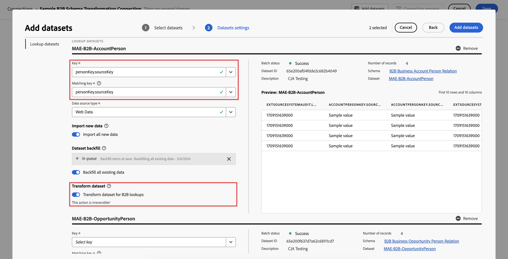
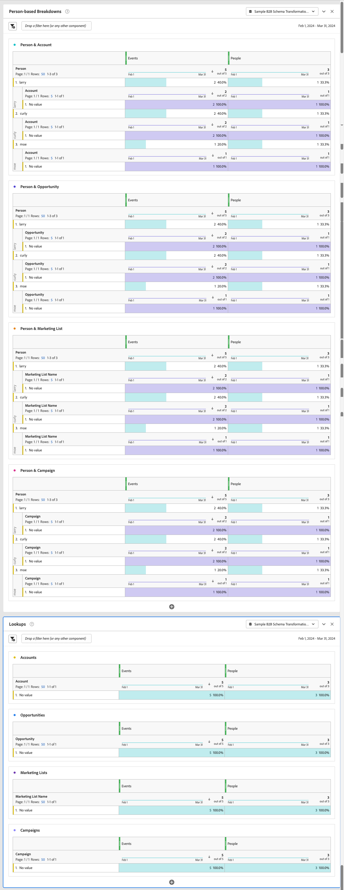

# B2B プロジェクトの例

この記事では、Customer Journey Analyticsでプロファイル（ユーザー）レベルの B2B データに基づいて設定、設定、レポートを行う方法について説明します。

## 接続

接続を定義して、関連するすべての B2B データセットをExperience Platformから含めます。 一般的な B2B ユーザーベースのレポートシナリオに必要な、すべての関連するルックアップデータセットを必ず含めて変換します。 詳しくは、[B2B ルックアップデータセットの変換 ](/help/connections/transform-datasets-b2b-lookups.md) を参照してください。

接続に追加することを検討できるデータセット：

| データセット | スキーマ | スキーマタイプ | 基本クラス | 説明 |
|---|---|---|---|---|
| B2B アクティビティデータセット | B2B アクティビティスキーマ | イベント | XDM ExperienceEvent | ExperienceEvent は、発生した事実（特定の時点や個人の ID など）の記録したものです。 ExperienceEvents は、明示的（直接観察可能な人間のアクション）または暗黙的（直接人間のアクションなしで発生）に設定でき、集計や解釈なしで記録されます。特定の時間枠内で発生する変更の観察と分析、およびトレンドを追跡する複数の時間枠間の比較を可能にするので、時間ドメイン分析には非常に重要です。 |
| B2B 人物データセット | B2B 人物スキーマ | プロファイル | XDM 個人プロファイル | XDM 個人プロファイルは、識別された個人と部分的に識別された個人の両方の属性と興味の単一の表現を形成します。 識別されていないプロファイルには、ブラウザー cookie などの匿名の行動シグナルのみが含まれる場合がありますが、識別されたプロファイルには、名前、生年月日、場所、メールアドレスなどの詳細な個人情報が含まれる場合があります。 プロファイルが増えるにつれ、個人情報、識別情報、連絡先の詳細、個人のコミュニケーション設定の堅牢なリポジトリーになります。 |
| B2B アカウント人物関係データセット | B2B アカウント人物関係スキーマ | ルックアップ | XDM Business Account Person Relation | XDM ビジネスアカウントユーザー関係は、ビジネスアカウントに関連付けられたユーザーの最低限必要なプロパティをキャプチャする、標準のエクスペリエンスデータモデル（XDM）クラスです。 |
| B2B オポチュニティ人物関係データセット | B2B オポチュニティ人物関係スキーマ | ルックアップ | XDM Business Opportunity Person Relation | XDM Business Opportunity ユーザー関係は、ビジネスオポチュニティに関連付けられたユーザーの最低限必要なプロパティをキャプチャする、標準のエクスペリエンスデータモデル（XDM）クラスです。 |
| B2B マーケティングリストメンバーデータセット | B2B マーケティングリストメンバースキーマ | ルックアップ | XDM マーケティングリストメンバー | XDM ビジネスマーケティングリストメンバーは、マーケティングリストに関連付けられたメンバー、人物または連絡先を記述する、標準のエクスペリエンスデータモデル（XDM）クラスです。 |
| B2B キャンペーンメンバーデータセット | B2B キャンペーンメンバースキーマ | ルックアップ | XDM Business Campaign Members | XDM ビジネスキャンペーンメンバーは、ビジネスキャンペーンに関連付けられた連絡先またはリードを記述する標準のエクスペリエンスデータモデル（XDM）クラスです。 |
<!--
| B2B Account Dataset | B2B Account Schema | Lookup | XDM Business Account | XDM Business Account is a standard Experience Data Model (XDM) class that captures the minimum required properties of a business account.  |
| B2B Opportunity Dataset | B2B Opportunity Schema | Lookup | XDM Business Opportunity | XDM Business Opportunity is a standard Experience Data Model (XDM) class that captures the minimum required properties of a business opportunity.  |
| B2B Campaign Dataset | B2B Campaign Schema | Lookup | XDM Business Campaign | XDM Business Campaign is a standard Experience Data Model (XDM) class that captures the minimum required properties of a business campaign.  |
| B2B Marketing List Dataset | B2B Marketing List Schema | Lookup | XDM Marketing List | XDM Business Marketing List is a standard Experience Data Model (XDM) class that captures the minimum required properties of a marketing list. Marketing lists allow you to prioritize on prospect clients who are most likely to buy your product.  |
-->

ルックアップスキーマ、プロファイルスキーマおよびイベントスキーマ間の関係は、Experience Platform内の B2B 設定で定義されます。 詳しくは、[Real-time Customer Data Platform B2B エディションのスキーマ ](https://experienceleague.adobe.com/docs/experience-platform/rtcdp/schemas/b2b.html) および [Real-time Customer Data Platform B2B エディションの 2 つのスキーマ間の多対 1 の関係の定義 ](https://experienceleague.adobe.com/docs/experience-platform/xdm/tutorials/relationship-b2b.html) を参照してください。

接続に追加する各ルックアップデータセットについて、**[!UICONTROL データセットを編集]** ダイアログで **[!UICONTROL キー]** と **[!UICONTROL 一致するキー]** を使用して、イベントデータセットへの関係を明示的に定義する必要があります。 次に例を示します。

人物スキーマを他の関連スキーマに接続するために、4 つのスキーマ（アカウント、商談、キャンペーンおよびマーケティングリスト）が明示的に使用されます。 これらのスキーマは、次のスキーマクラスに基づいています。

* XDM Business Account Person Relation
* XDM Business Opportunity Person Relation
* XDM Business Marketing List Members
* XDM Business Campaign Members

ルックアップデータセットごとに、このようなスキーマクラスに基づくスキーマの場合、**[!UICONTROL データセットを変換]** を有効にして、ユーザーベースのルックアップ用にデータが確実に変換されるようにすることもできます。 詳しくは、[B2B ルックアップ用にデータセットを変換](/help/connections/transform-datasets-b2b-lookups.md)を参照してください。

次の表に、各データセットの [!UICONTROL  ユーザー ID]、[!UICONTROL  キー ] および [!UICONTROL  一致するキー ] 値の概要例を示します。

| データセット | ユーザー ID | キー | 一致するキー（イベントデータセット内） |
|---|---|---|---|
| B2B アクティビティデータセット | `personKey.sourceKey` | | |
| B2B 人物データセット | `b2b.personKey.sourceKey` | | |
| B2B アカウント人物データセット | | `personKey.sourceKey` | `personKey.sourceKey` |
| B2B 商談データセット | | `personKey.sourceKey` | `personKey.sourceKey` |
| B2B キャンペーンメンバーデータセット | | `personKey.sourceKey` | `personKey.sourceKey` |
| B2B マーケティングリストデータセット | | `personKey.sourceKey` | `personKey.sourceKey` |

{style="table-layout:auto"}

データセットの設定を構成する方法について詳しくは、[ データセットの追加と構成 ](../../connections/create-connection.md) を参照してください。

## データビュー

Workspace プロジェクトを作成する際に、関連する B2B ディメンションと指標にアクセスできるようにするには、それに応じてデータビューを定義する必要があります。

以下のコンポーネントをディメンションとしてデータビューに追加して、B2B データに基づいてユーザーベースのレベルでレポートできるようにします。 分かりやすくするために、コンポーネント名が変更されています。

| コンポーネント名 | データセット | スキーマデータタイプ | スキーマパス |
|---|---|---|---|
| ユーザー | B2B アクティビティ | 文字列 | `personID` |
| アカウント | B2B アカウント担当者 | 文字列 | `accountKey.sourceID` |
| キャンペーン | B2B キャンペーンメンバー | 文字列 | `campaignKey.sourceKey` |
| マーケティングリスト名 | B2B マーケティングリスト | 文字列 | `marketingListID` |
| Opportunity | B2B オポチュニティ担当者 | 文字列 | `opportunityKey.sourceID` |

<!--
This section provides recommendations and suggestions on what dimensions and metrics to include when defining the [components](../../data-views/create-dataview.md#components) for B2B datasets in your data view.

For each component, the name, schema type, schema path, and (when applicable) details about the configuration are provided.

+++ B2B Activity dataset

### Metrics

| Component Name | Schema data type | Schema path | Configuration |
|---|---|---|---|
| Add To Campaign | String | `eventType` | **[!UICONTROL Set include/exclude values]** **[!UICONTROL Case sensitive]** Match: **[!UICONTROL If all criteria are met]** Criteria: **[!UICONTROL Equals]** `leadOperation.addToCampaign` |
| Add To Opportunity | String | `eventType` | **[!UICONTROL Set include/exclude values]** **[!UICONTROL Case sensitive]** Match: **[!UICONTROL If all criteria are met]** Criteria: **[!UICONTROL Equals]** `opportunityEvent.addToOpportunity` |
| Application Closed | String | `eventType` | **[!UICONTROL Set include/exclude values]** **[!UICONTROL Case sensitive]** Match: **[!UICONTROL If all criteria are met]** Criteria: **[!UICONTROL Equals]** `application.close` |
| Application Launch | String | `eventType` | **[!UICONTROL Set include/exclude values]** **[!UICONTROL Case sensitive]** Match: **[!UICONTROL If all criteria are met]** Criteria: **[!UICONTROL Equals]** `application.launch` |
| Campaign Stream | String | `eventType` | **[!UICONTROL Set include/exclude values]** **[!UICONTROL Case sensitive]** Match: **[!UICONTROL If all criteria are met]** Criteria: **[!UICONTROL Equals]** ` leadOperation.changeCampaignStream` |
| Checkout | String | `eventType` | **[!UICONTROL Set include/exclude values]** **[!UICONTROL Case sensitive]** Match: **[!UICONTROL If all criteria are met]** Criteria: **[!UICONTROL Equals]** `commerce.checkouts` |
| Convert Lead | String | `eventType` | **[!UICONTROL Set include/exclude values]** **[!UICONTROL Case sensitive]** Match: **[!UICONTROL If all criteria are met]** Criteria: **[!UICONTROL Equals]** `leadOperation.convertLead` |
| Email Clicked | String | `eventType` | **[!UICONTROL Set include/exclude values]** **[!UICONTROL Case sensitive]** Match: **[!UICONTROL If all criteria are met]** Criteria: **[!UICONTROL Equals]** `directMarketing.emailClicked` |
| Email Delivered | String | `eventType` | **[!UICONTROL Set include/exclude values]** **[!UICONTROL Case sensitive]** Match: **[!UICONTROL If all criteria are met]** Criteria: **[!UICONTROL Equals]** `directMarketing.emailDelivered` |
| Email Opened | String | `eventType` | **[!UICONTROL Set include/exclude values]** **[!UICONTROL Case sensitive]** Match: **[!UICONTROL If all criteria are met]** Criteria: **[!UICONTROL Equals]** `directMarketing.emailOpened` |
| Email Sent | String | eventType | **[!UICONTROL Set include/exclude values]** **[!UICONTROL Case sensitive]** Match: **[!UICONTROL If all criteria are met]** Criteria: **[!UICONTROL Equals]** `directMarketing.emailSent` |
| Email Unsubscribed | String | `eventType` | **[!UICONTROL Set include/exclude values]** **[!UICONTROL Case sensitive]** Match: **[!UICONTROL If all criteria are met]** Criteria: **[!UICONTROL Equals]** `directMarketing.emailUnsubscribed` |
| Form Filled Out | String | `eventType` | **[!UICONTROL Set include/exclude values]** **[!UICONTROL Case sensitive]** Match: **[!UICONTROL If all criteria are met]** Criteria: **[!UICONTROL Equals]** `web.formFilledOut` |
| Form Started | String | `web.fillOutForm.webFormName` | |
| Leads | String | eventType | **[!UICONTROL Set include/exclude values]** **[!UICONTROL Case sensitive]** Match: **[!UICONTROL If all criteria are met]** Criteria: **[!UICONTROL Equals]** `leadOperation.newLead` |
| Opportunity Updated | String | `eventType` | **[!UICONTROL Set include/exclude values]** **[!UICONTROL Case sensitive]** Match: **[!UICONTROL If all criteria are met]** Criteria: **[!UICONTROL Equals]** `opportunityEvent.opportunityUpdated` |
| Price | Double | *_organizationID*`.interactions.products.price` |  |
| Priority | Integer | `leadOperation.changeScore.priority` |  |
| Prod List Add | String | `eventType` |  **[!UICONTROL Set include/exclude values]** **[!UICONTROL Case sensitive]** Match: **[!UICONTROL If all criteria are met]** Criteria: **[!UICONTROL Equals]** `commerce.productListAdds.value` |
| Prod List Open | String | `eventType` |  **[!UICONTROL Set include/exclude values]** **[!UICONTROL Case sensitive]** Match: **[!UICONTROL If all criteria are met]** Criteria: **[!UICONTROL Equals]** `commerce.productListOpens.value` |
| Prod View | String | `eventType` |  **[!UICONTROL Set include/exclude values]** **[!UICONTROL Case sensitive]** Match: **[!UICONTROL If all criteria are met]** Criteria: **[!UICONTROL Equals]** `commerce.productViews.value` |
| Purchases | String | `eventType` |  **[!UICONTROL Set include/exclude values]** **[!UICONTROL Case sensitive]** Match: **[!UICONTROL If all criteria are met]** Criteria: **[!UICONTROL Equals]** `commerce.purchases.value` |
| Remove From Opportunity | String | `eventType` |  **[!UICONTROL Set include/exclude values]** **[!UICONTROL Case sensitive]** Match: **[!UICONTROL If all criteria are met]** Criteria: **[!UICONTROL Equals]** `opportunityEvent.removeFromOpportunity` |
| Save for Laters | String | eventType |  **[!UICONTROL Set include/exclude values]** **[!UICONTROL Case sensitive]** Match: **[!UICONTROL If all criteria are met]** Criteria: **[!UICONTROL Equals]** `commerce.productViews.value` |

{style="table-layout:auto"}

### Dimensions

| Component Name | Schema data type | Schema path | Configuration |
|---|---|---|---|
| Account Key (Source Key) | String | *_organizationID*`.Interactions.accountKey.sourceKey` | |
| Converted Status | String | `leadOperation.convertLead.convertedStatus` | |
| Event Type | String | `eventType` | |
| Form Name | String | `leadOperation.newLead.formName` | |
| Identifier | String | `_id` | |
| Is Sent Notification | Boolean | `leadOperation.convertLead.isSentNotificationEmail` | |
| Keywords | String | `search.keywords` | |
| List ID | String | `listOperations.listID` | |
| List Name | String | `leadOperation.newLead.listName` | |
| Page Name | String | `web.webPageDetails.name` | |
| Person Key (Source Key) | String | `personKey.sourceKey` | |
| Produced By | String | producedBy | |
| Product Name | String | *_organizationID*`.Interactions.products.name` | |
| Role | String | `opportunityEvent.role` | | 
| Timestamp | Date-time | `timestamp` | Date-Time format: **[!UICONTROL Day]** |
| URL | String | `web.webPageDetails.URL` | |
| Web Form Name | String | `web.fillOutForm.webFormName` | |
| Product URL | String | *_organizationID*`.Interactions.products.url` | |

{style="table-layout:auto"}

+++

+++ B2B Person dataset

### Metrics

No metric components are defined as part of this dataset.

### Dimensions

| Component Name | Schema data type | Schema path | Configuration |
|---|---|---|---|
| Last Activity Date | Date-time | `extSourceSystemAudit.lastActivityDate` | Date-Time format: **[!UICONTROL Day]** |
| Person ID | String | `personID` | |

{style="table-layout:auto"}

+++

+++ B2B Account Person dataset

### Metrics

| Component Name | Schema data type | Schema path | Configuration |
|---|---|---|---|
| Annual Revenue | Double | `accountOrganization.annualRevenue.amount` | |
| Number of employees | Integer | `accountOrganization.numberOfEmployees` | |

{style="table-layout:auto"}

### Dimensions

| Component Name | Schema data type | Schema path | Configuration |
|---|---|---|---|
| Acount | String | `accountKey.sourceID` | 

{style="table-layout:auto"}

| Account Identifier | String | `accountID` | |
| Account Type | String | `accountType` | |
| City | String | `accountBillingAddress.city` | |
| Country | String | `accountBillingAddress.country` | |
| Industry | String | `accountOrganization.industry` | |
| Region | String | `accountBillingAddress.region` | |
| Source ID | String | `accountKey.sourceID` | |
| Source Instance ID | String | `accountKey.sourceInstanceID` | |
| Source Key | String | `accountKey.sourceKey` | |
| Source Type | String | `accountKey.sourceType` | |

+++

+++  B2B Opportunity Person dataset

### Metrics

| Component Name | Schema data type | Schema path | Configuration |
|---|---|---|---|
| Expected Revenue | Double | `expectedRevenue.amount` | Behavior: **[!UICONTROL Count values]** |
| Opportunity Amount | Double | `opportunityAmount.amount` | Behavior: **[!UICONTROL Count values]** |
| Opportunity Stage - Closed Book | String | `opportunityStage` | **[!UICONTROL Set include/exclude values]** **[!UICONTROL Case sensitive]** Match: **[!UICONTROL If all criteria are met]** Criteria: **[!UICONTROL Equals]** `Closed - Booked` |
| Opportunity Stage - Prospect | String | `opportunityStage` | **[!UICONTROL Set include/exclude values]** **[!UICONTROL Case sensitive]** Match: **[!UICONTROL If all criteria are met]** Criteria: **[!UICONTROL Equals]** `Prospect` |
| Opportunity Stage - Qualification | String | `opportunityStage` | **[!UICONTROL Set include/exclude values]** **[!UICONTROL Case sensitive]** Match: **[!UICONTROL If all criteria are met]** Criteria: **[!UICONTROL Equals]** `Opportunity Qualification` |
| Opportunity Stage - Solution Definition | String | `opportunityStage` | **[!UICONTROL Set include/exclude values]** **[!UICONTROL Case sensitive]** Match: **[!UICONTROL If all criteria are met]** Criteria: **[!UICONTROL Equals]** `Solution Definition and Validation` |

{style="table-layout:auto"}

### Dimensions

| Component Name | Schema data type | Schema path | Configuration |
|---|---|---|---|
| Closed Flag | Boolean | `isClosed` | |
| Company ID | String | `opportunityID` | |
| Forecast Category | String | `forecastCategoryName` | |
| Last Activity Date | Date-time | `lastActivityDate` | Date-time format: **[!UICONTROL Day]** |
| Lead Source | String | `leadSource` | |
| Opportunity Name | String | `opportunityName` | | 
| Opportunity Status | String | `opportunityStage` | |
| Won Flag | Boolean | `isWon` | |

{style="table-layout:auto"}

+++

+++ B2B Campaign Member dataset

### Metrics

| Component Name | Schema data type | Schema path | Configuration |
|---|---|---|---|
| Bounced | Long | *_organizationID*`.campaignBounced` | Behavior: **[!UICONTROL Count values]** |
| Clicked | Long | *_organizationID*`.campaignClicked` | Behavior: **[!UICONTROL Count values]** |
| Opened | Long | *_organizationID*`.CampaignOpened` | Behavior: **[!UICONTROL Count values]** |
| Sent | Long | *_organizationID*`.campaignSent` | Behavior: **[!UICONTROL Count values]** |
| Subscribed | Long | *_organizationID*`.campaignSubscribed` | Behavior: **[!UICONTROL Count values]** |
| Webinar Registrations | Long | *_organizationID*`.Registrations` | Behavior: **[!UICONTROL Count values]** |

{style="table-layout:auto"}

### Dimensions

| Component Name | Schema data type | Schema path | Configuration |
|---|---|---|---|
| Campaign ID | String | `campaignID` | |
| Campaign Member ID | String | `campaignMemberID` | |
| Campaign Member Status | String | `memberStatus` | |
| Campaign Member Status Reason | String | `memberStatusReason` | |
| Created Date | Date-time | `extSourceSystemAudit.createdDate` | Date-time format: **[!UICONTROL Day]** |
| First Responded Date | String | `firstRespondedDate` | Date-time format: **[!UICONTROL Day]** |
| Has Reached Success | Boolean | `hasReachedSuccess` | |
| Has Responded | Boolean | `hasResponded` | |
| Last Status | String | `lastStatus` | |
| Last Updated Date | Date-time | `extSourceSystemAudit.lastUpdatedDate` | Date-time format: **[!UICONTROL Day]** |
| Membership Date | Date-time | `membershipDate` | Date-time format: **[!UICONTROL Day]** |
| Nurture Cadence | String | `nurtureCadence` | |
| Nurture Track Name | String | `nurtureTrackName` | |
| Person ID | String | `personID` | |
| Reached Success Date | Date-time | `reachedSuccessDate` | Date-time format: **[!UICONTROL Day]** |
| Webinar Registration ID | String | `webinarRegistrationID` | |
| Webinar Registration URL | String | `webinarConfirmationUrl` | |
| isExhausted | Boolean | isExhausted | |

{style="table-layout:auto"}

+++

+++ B2B Marketing List Member dataset

### Metrics

### Dimensions

+++

-->

## Workspace

コンポーネントをデータビューで適切に定義すれば、Workspace プロジェクトで特定の B2B レポートおよびビジュアライゼーションを作成できるようになります。

以下は、上記の接続とデータビューに依存するプロジェクトの例です。

<!-- See the descriptions for each visualization for more details.

+++ Example project

+++
-->
