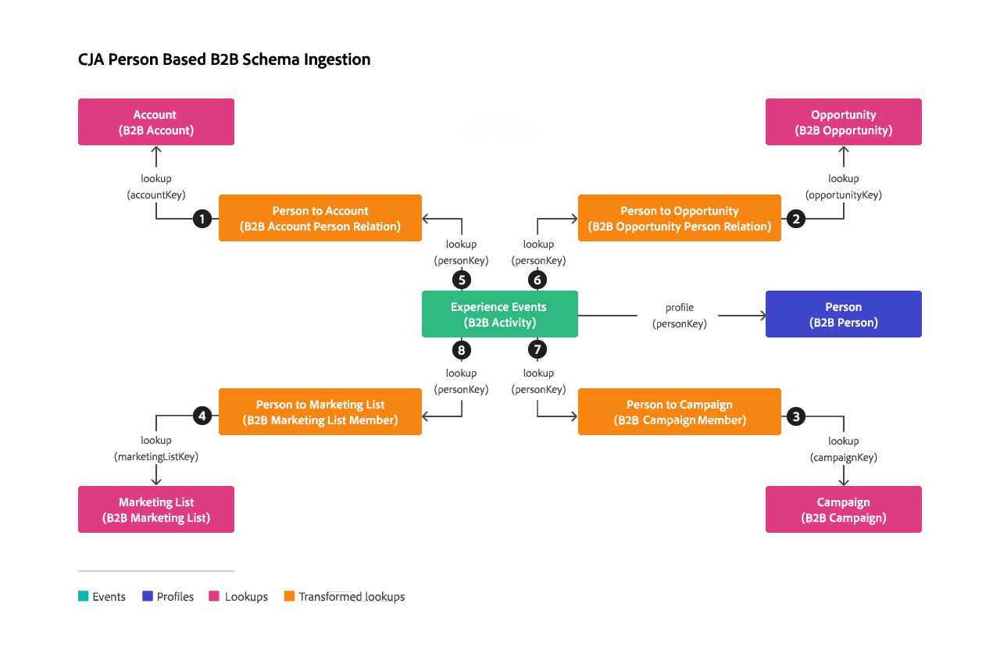
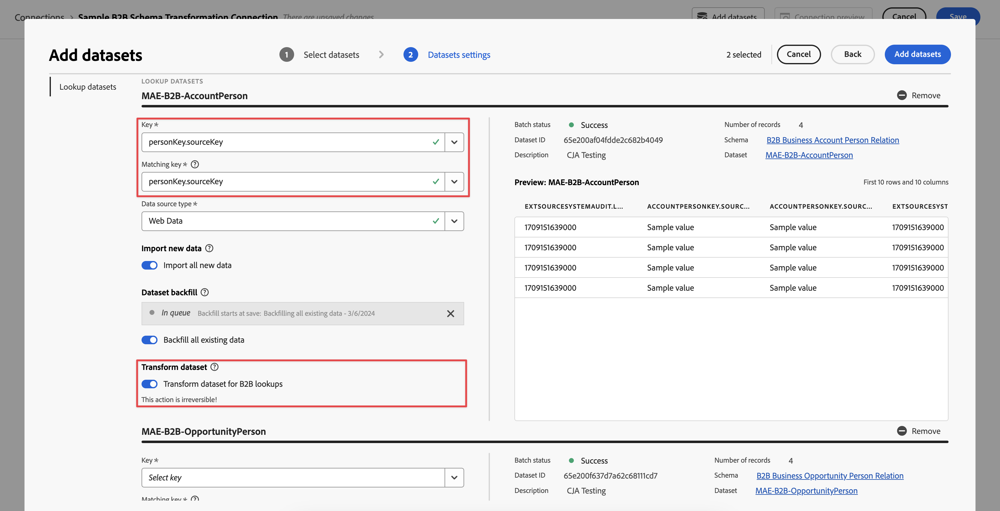

# ユーザーベースの B2B プロジェクトの例

この記事では、一般的な人物ベースのB2B設定のコンテキストで、人物データについてCustomer Journey Analyticsで適切にレポートするユースケースを示します。 このような設定は、[Real-Time CDP B2B edition](https://experienceleague.adobe.com/ja/docs/experience-platform/rtcdp/intro/rtcdpb2b-intro/b2b-overview)によって容易になります。  ユースケースでは、Customer Journey Analyticsでプロファイル（個人）レベルのB2B データを設定、設定、レポートする方法について説明します。

[!BADGE B2B edition]{type=Informative url="https://experienceleague.adobe.com/ja/docs/analytics-platform/using/cja-overview/cja-b2b/cja-b2b-edition" newtab=true tooltip="Customer Journey Analytics B2B Edition"} アカウントベースのレポートのユースケース用の別のセクションが、[Customer Journey Analytics B2B edition](/help/getting-started/cja-b2b-edition.md)のリリースで公開されています。

## 接続

Experience Platformの関連するB2B データセットをすべて含めるように、接続を定義します。 接続に追加することを検討できるデータセット：

| データセット（オプション） | スキーマ | スキーマタイプ | ベースクラス | 説明 |
|---|---|---|---|---|
| B2B アクティビティデータセット | B2B アクティビティスキーマ | イベント | XDM ExperienceEvent | ExperienceEventは、関与した個人の時点とIDを含む、何が起こったかの事実レコードです。 ExperienceEvents は、明示的（直接観察可能な人間のアクション）または暗黙的（直接人間のアクションなしで発生）に設定でき、集計や解釈なしで記録されます。 エクスペリエンスイベントは、特定の時間枠で発生する変化の観察と分析、およびトレンドを追跡するための複数の時間枠の比較を可能にするため、時間領域分析にとって非常に重要です。 |
| B2B人物データセット | B2B人物スキーマ | プロファイル | XDM 個人プロファイル | XDM個人プロファイルは、特定された個人と部分的に特定された個人の両方の属性と関心を単一の形式で表します。 識別の低いプロファイルには、ブラウザーのCookieなどの匿名の行動シグナルのみを含めることができます。一方、識別の高いプロファイルには、名前、生年月日、場所、メールアドレスなどの詳細な個人情報が含まれる場合があります。 プロファイルが増えるにつれ、個人情報、識別情報、連絡先の詳細、個人のコミュニケーション設定の堅牢なリポジトリーになります。 |
| B2B アカウントデータセット | B2B アカウントスキーマ | ルックアップ | XDM Business Account | XDM ビジネスアカウントは、ビジネスアカウントに必要な最小限のプロパティをキャプチャする標準のExperience Data Model （XDM） クラスです。 このXDM クラスは、B2BまたはB2P Editionを持つ顧客のプロファイルにのみ含めることができます。 |
| B2B商談データセット | B2B商談スキーマ | ルックアップ | XDM Business Opportunity | XDM Business Opportunityは、ビジネスオポチュニティに必要な最小限のプロパティをキャプチャする標準のExperience Data Model （XDM）クラスです。 このXDM クラスは、B2BまたはB2P Editionを持つ顧客のプロファイルにのみ含めることができます。 |
| B2B キャンペーンデータセット | B2B キャンペーンスキーマ | ルックアップ | XDM Business Campaign | XDM Business Campaignは、ビジネスキャンペーンに必要な最小限のプロパティをキャプチャする標準のExperience Data Model （XDM）クラスです。 このXDM クラスは、B2BまたはB2P Editionを持つ顧客のプロファイルにのみ含めることができます。 |
| B2B マーケティングリストデータセット | B2B マーケティングリストスキーマ | ルックアップ | XDM Business Marketing List | XDM Business Marketing Listは、マーケティングリストに必要な最小限のプロパティをキャプチャする標準のExperience Data Model （XDM）クラスです。 マーケティングリストを活用すれば、製品を購入する可能性が最も高い見込み顧客を特定し、優先順位を付けることができます。 このXDM クラスは、B2BまたはB2P Editionを持つ顧客のプロファイルにのみ含めることができます。 |
| B2B アカウント人物関係データセット | B2B アカウント人物関係スキーマ | ルックアップ | XDM Business Account Person Relation | XDM Business Account Person Relationは、ビジネスアカウントに関連付けられている人物の最小必要プロパティをキャプチャする標準のExperience Data Model （XDM）クラスです。 |
| B2B オポチュニティと人物の関係データセット | B2B オポチュニティと人物の関係スキーマ | ルックアップ | XDM Business Opportunity Person Relation | XDM Business Opportunity Person Relationは、ビジネスオポチュニティに関連付けられている人物の最小必要プロパティをキャプチャする標準のExperience Data Model （XDM）クラスです。 |
| B2B マーケティングリストメンバーデータセット | B2B マーケティングリストメンバースキーマ | ルックアップ | XDM マーケティングリストメンバー | XDM Business Marketing List Membersは、マーケティングリストに関連するメンバー、人物、または連絡先を記述する標準のExperience Data Model （XDM）クラスです。 |
| B2B キャンペーンメンバーデータセット | B2B キャンペーンメンバースキーマ | ルックアップ | XDM Business Campaign Members | XDM Business Campaign Membersは、ビジネスキャンペーンに関連付けられた連絡先またはリードを記述する標準のExperience Data Model （XDM）クラスです。 |

<!--
| B2B Account Dataset | B2B Account Schema | Lookup | XDM Business Account | XDM Business Account is a standard Experience Data Model (XDM) class that captures the minimum required properties of a business account.  |
| B2B Opportunity Dataset | B2B Opportunity Schema | Lookup | XDM Business Opportunity | XDM Business Opportunity is a standard Experience Data Model (XDM) class that captures the minimum required properties of a business opportunity.  |
| B2B Campaign Dataset | B2B Campaign Schema | Lookup | XDM Business Campaign | XDM Business Campaign is a standard Experience Data Model (XDM) class that captures the minimum required properties of a business campaign.  |
| B2B Marketing List Dataset | B2B Marketing List Schema | Lookup | XDM Marketing List | XDM Business Marketing List is a standard Experience Data Model (XDM) class that captures the minimum required properties of a marketing list. Marketing lists allow you to prioritize on prospect clients who are most likely to buy your product.  |
-->

B2B ルックアップスキーマ、プロファイルスキーマ、イベントスキーマの関係は、Experience Platform内のB2B セットアップで定義されます。 [Real-Time Customer Data Platform B2B edition](https://experienceleague.adobe.com/ja/docs/experience-platform/rtcdp/schemas/b2b)のスキーマと[Real-Time Customer Data Platform B2B edition](https://experienceleague.adobe.com/ja/docs/experience-platform/xdm/tutorials/relationship-b2b)の2つのスキーマ間の多対一のリレーションシップを定義します。

B2B データの個人ベースの検索をサポートする接続を適切に設定するには、次の図を参照して概要を説明し、次の手順に従います。

1. 上記の表のデータセットを接続に追加します。
1. 接続に追加するルックアップデータセットごとに、**[!UICONTROL データセットを編集]** ダイアログの&#x200B;**[!UICONTROL キー]**&#x200B;と&#x200B;**[!UICONTROL 一致するキー]**&#x200B;を使用して、イベントデータセットとの関係を明示的に定義する必要があります。
1. 個人ベースのB2B ルックアップ用に変換するルックアップデータセットごとに、**[!UICONTROL データセットの変換]**&#x200B;を有効にして、個人ベースのルックアップ用にデータが変換されるようにします。 詳細については、[B2B ルックアップ用データセットの変換](/help/connections/transform-datasets-b2b-lookups.md)を参照してください。

   

   以下の表は、各データセットの[!UICONTROL 人物ID]、[!UICONTROL &#x200B; キー]、[!UICONTROL 一致するキー]の値の例の概要を示しています。

   >[!IMPORTANT]
   >
   >以下の表の&#x200B;**人物ID**、**キー**&#x200B;および&#x200B;**一致するキー**&#x200B;の値は&#x200B;**例の値**&#x200B;であり、特定の環境で異なる可能性があります。
   >

   | データセット（オプション） | ユーザー ID | キー  | 一致するキー  （イベントデータセット内）   |
   |---|---|---|---|
   | B2B アクティビティデータセット | SourceKey  **personKey.sourceKey** | | |
   | B2B人物データセット | SourceKey  **b2b.personKey.sourceKey** | | |
   | B2B アカウントデータセット | | SourceKey  **accountKey.sourceKey**&#x200B;❶ | SourceKey  （B2B Person Dataset）  **b2b.accountKey.sourceKey**&#x200B;❶ |
   | B2B商談データセット | | Source キー&#x200B; **opportunityKey.sourceKey**&#x200B;❷ | SourceKey  （B2B商談関係データセット）  **opportunityKey.sourceKey**&#x200B;❷ |
   | B2B キャンペーンデータセット | | SourceKey  **campaignKey.sourceKey**&#x200B;❸ | SourceKey  （B2B キャンペーンメンバーデータセット）  **campaignKey.sourceKey**&#x200B;❸  |
   | B2B マーケティングリストデータセット | | SourceKey  **marketingListKey.sourceKey**&#x200B;❹ | SourceKey  （B2B マーケティングリスト メンバーデータセット）  **marketingListKey.sourceKey**&#x200B;❹ |
   | B2B アカウント人物関係データセット | | SourceKey  **personKey.sourceKey**&#x200B;❺ | Source キー  （イベントデータセット）  **personKey.sourceKey**&#x200B;❺ |
   | B2B オポチュニティと人物の関係データセット | | SourceKey  **personKey.sourceKey** y❻ | Source キー  （イベントデータセット）  **personKey.sourceKey**&#x200B;❻ |
   | B2B キャンペーンメンバーデータセット | | SourceKey  **personKey.sourceKey**&#x200B;❼ | Source キー  （イベントデータセット）  **personKey.sourceKey**&#x200B;❼ |
   | B2B マーケティングリストメンバーデータセット | | SourceKey  **personKey.sourceKey**&#x200B;❽ | Source キー  （イベントデータセット）  **personKey.sourceKey**&#x200B;❽ |

{style="table-layout:auto"}

データセットの設定の設定方法について詳しくは、[&#x200B; データセットの追加と設定](../../connections/create-connection.md)を参照してください。

## データビュー

Workspaceプロジェクトを構築する際に、適切なB2B ディメンションと指標にアクセスできるようにするには、それに応じてデータビューを定義する必要があります。

例えば、次のコンポーネントをデータビューに追加して、B2B データに対する個人ベースのレポートを作成できます。 コンポーネント名は、元のスキーマ名からわかりやすいように変更されることがあります。

+++指標 

>[!IMPORTANT]
>
>以下のテーブルの指標とその値（**コンポーネント名**、**データセット**、**データセットの種類**、および&#x200B;**[!UICONTROL スキーマパス &#x200B;]）**&#x200B;は&#x200B;**例**&#x200B;です。 特定の状況に合わせて、関連するB2B指標（コンポーネント名、データセット、データタイプ、スキーマパス）を定義します。
>

| コンポーネント名 | データセット | データタイプ | スキーマパス |
|---|---|---|---|
| 年間アカウント収益 | B2B アカウントデータセット | Double | accountOrganization.annualRevenue.amount |
| 従業員数 | B2B アカウントデータセット | 整数 | accountOrganization.numberOfEmployees |
| 実際のキャンペーンコスト | B2B キャンペーンデータセット | Double | actualCost.amount |
| 予算計上キャンペーンコスト | B2B キャンペーンデータセット | Double | budgetedCost.amount |
| 商談の予想売上 | B2B商談データセット | Double | expectedRevenue.amount |
| 予想されるキャンペーン売上 | B2B キャンペーンデータセット | Double | expectedRevenue.amount |
| 商談金額 | B2B商談データセット | Double | opportunityAmount.amount |

+++

+++ディメンション

>[!IMPORTANT]
>
>次の表のディメンションとその値（**コンポーネント名**、**データセット**、**データセットの種類**、および&#x200B;**[!UICONTROL スキーマパス &#x200B;]）**&#x200B;は&#x200B;**例**&#x200B;です。 特定の状況に合わせて、B2B ディメンション（コンポーネント名、データセット、データタイプ、スキーマパス）を定義します。
>

| コンポーネント名 | データセット | データタイプ | スキーマパス |
|---|---|---|---|
| アカウント名 | B2B アカウントデータセット | 文字列 | accountName |
| キャンペーン名 | B2B キャンペーンデータセット | 文字列 | campaignName |
| チャネル名 | B2B キャンペーンデータセット | 文字列 | channelName |
| 国 | B2B アカウントデータセット | 文字列 | accountBillingAddress.country |
| 予測カテゴリ名 | B2B商談データセット | 文字列 | forecastCategoryName |
| 業界 | B2B アカウントデータセット | 文字列 | accountOrganization.industry |
| 姓 | B2B人物データセット | 文字列 | person.name.lastName |
| マーケティングリスト名 | B2B マーケティングリストデータセット | 文字列 | marketingListName |
| 商談名 | B2B商談データセット | 文字列 | opportunityName |
| 商談ステージ | B2B商談データセット | 文字列 | opportunityStage |
| 機会タイプ | B2B商談タイプデータセット | 文字列 | opportunityType |
| ウェビナーセッション名 | B2B キャンペーンデータセット | 文字列 | webinarSessionName |

+++

## Workspace

データビューでコンポーネントを適切に定義し、Workspace プロジェクトで特定のB2B レポートとビジュアライゼーションを作成できるようになりました。

以下は、上記の接続とデータビューに依存するサンプルプロジェクトのスクリーンショットです。 ビジュアライゼーションの説明では、変換されたB2B ルックアップデータに依存するフリーフォームテーブルのビジュアライゼーションについて説明します。

