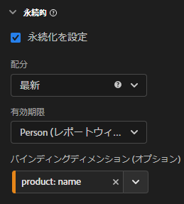
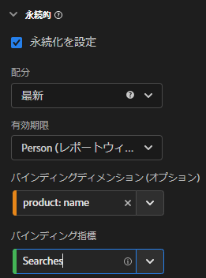

# CJA でのディメンションと指標のバインディングの使用

Customer Journey Analytics offers several ways to persist dimension values beyond the hit that they are set on. 永続性メソッドの 1 つとして、Adobeオファーをバインディングと呼びます。 以前のバージョンのAdobe Analyticsでは、この概念はマーチャンダイジングと呼ばれていました。

While you can use binding dimensions with top-level event data, this concept is best used when working with [Arrays of objects](object-arrays.md). 特定のイベント内のすべての属性にディメンションを適用することなく、ディメンションをオブジェクト配列の 1 つの部分に属性付けできます。 For example, you can attribute a search term to one product in your shopping cart object array without binding that search term to the entire event.

## 例 2:バインディング指標を使用した検索語句の製品購入への結び付け

Adobe Analyticsで最も一般的なマーチャンダイジング方法の 1 つは、検索語句を製品に結び付けて、各検索語句が適切な製品に対するクレジットを受け取るようにすることです。 次のカスタマージャーニーについて考えてみましょう。

1. A visitor arrives to your site and searches for &quot;boxing gloves&quot;.

   ```json
   {
       "PersonID": "1",
       "page_name": "Search results",
       "search": "1",
       "search_term": "boxing gloves",
       "product": [
           {
               "name": "Beginner gloves",
               "color": "Red",
               "price": "25.69"
           },
           {
               "name": "Tier 3 gloves",
               "color": "Black",
               "price": "89.99"
           },
           {
               "name": "Professional gloves",
               "color": "Blue",
               "price": "224.99"
           }
       ]
   }
   ```

1. 好きな手ぶくろを見つけて、買い物かごに追加します。

   ```json
   {
       "PersonID": "1",
       "page_name": "Shopping cart",
       "cart_add": "1",
       "product": [
           {
               "name": "Tier 3 gloves",
               "color": "Black",
               "price": "89.99"
           }
       ]
   }
   ```

1. その後、訪問者は「テニスラケット」を検索します。

   ```json
   {
       "PersonID": "1",
       "page_name": "Search results",
       "search": "1",
       "search_term": "tennis racket",
       "product": [
           {
               "name": "Shock absorb racket",
               "price": "34.99"
           },
           {
               "name": "Women's open racket",
               "price": "49.99"
           },
           {
               "name": "Extreme racket",
               "price": "134.99"
           }
       ]
   }
   ```

1. 彼らは好きなラケットを見つけて、それを買い物かごに追加します。

   ```json
   {
       "PersonID": "1",
       "page_name": "Shopping cart",
       "cart_add": "1",
       "product": [
           {
               "name": "Tier 3 gloves",
               "color": "Black",
               "price": "89.99"
           },
           {
               "name": "Shock absorb racket",
               "price": "34.99"
           }
       ]
   }
   ```

1. The visitor searches a third time for &quot;shoes&quot;.

   ```json
   {
       "PersonID": "1",
       "page_name": "Search results",
       "search": "1",
       "search_term": "shoes",
       "product": [
           {
               "name": "Men's walking shoes",
               "color": "Grey",
               "price": "54.95"
           },
           {
               "name": "Tennis shoes",
               "color": "White",
               "price": "42.59"
           },
           {
               "name": "Skate shoes",
               "color": "Black",
               "price": "79.99"
           }
       ]
   }
   ```

1. 好きな靴を見つけて買い物かごに追加します

   ```json
   {
       "PersonID": "1",
       "page_name": "Shopping cart",
       "cart_add": "1",
       "product": [
           {
               "name": "Tier 3 gloves",
               "color": "Black",
               "price": "89.99"
           },
           {
               "name": "Shock absorb racket",
               "price": "34.99"
           },
           {
               "name": "Skate shoes",
               "color": "Black",
               "price": "79.99"
           }
       ]
   }
   ```

1. The visitor goes through the checkout process and purchases these three items.

   ```json
   {
       "PersonID": "1",
       "page_name": "Thank you for your purchase",
       "purchase": "1",
       "product": [
           {
               "name": "Tier 3 gloves",
               "color": "Black",
               "price": "89.99"
           },
           {
               "name": "Shock absorb racket",
               "price": "34.99"
           },
           {
               "name": "Skate shoes",
               "color": "Black",
               "price": "79.99"
           }
       ]
   }
   ```

If you use a traditional allocation model with search term, all three products attribute revenue to only a single search term. For example, if you used first allocation with the search term dimension:

| search_term | 売上高 |
| --- | --- |
| ボクシング手袋 | $204.97 |

If you used last allocation with the search term dimension, all three products still attribute revenue to a single search term:

| search_term | 売上高 |
| --- | --- |
| shoes | $204.97 |

この例では 1 人の訪問者のみが含まれますが、異なるものを検索する多くの訪問者は、検索用語の属性を異なる製品に誤解する可能性があるので、実際に最も良い検索結果を見極めるのが困難です。

連結ディメンションの場合、Adobeは、連結先のディメンション項目をメモします。 後続のイベントで同じ連結値が表示された場合、ディメンション項目が引き継がれ、目的の指標をその項目に関連付けることができます。 この例では、search_term のバインディングディメンションを product name に設定できます。



このディメンションをデータビューマネージャで設定する場合、連結ディメンションはオブジェクト配列にあるので、連結指標も設定する必要があります。 A binding metric acts as a trigger for a binding dimension, so it only binds itself on events where the binding metric is present. この例の実装では、検索結果ページには常に検索語句ディメンションと検索指標が含まれます。 We can bind search terms to product name whenever the Searches metric is present.



Setting the search term dimension to this persistence model executes the following logic:

* search_term がイベント内にある場合は、製品名が存在するかどうかを確認します。
* If product name is not there, do nothing.
* 製品名がある場合は、検索指標が存在するかどうかを確認します。
* If the Searches metric is not there, do nothing.
* If the Searches metric is there, bind the search term to all product names. イベントの製品名と同じレベルで動作します。 この例では、product.search_term として扱われます。
* 後続のイベントで同じ製品名が表示された場合は、バインドされた検索語句もそこに存在します。

In Analysis Workspace, the resulting report would look similar to the following:

| search_term | 売上高 |
| --- | --- |
| ボクシング手袋 | $89.99 |
| tennis racket | $34.99 |
| 靴 | $79.99 |
