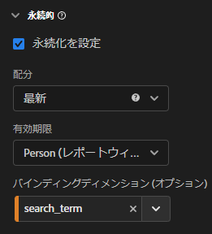

# CJA でのバインディングディメンションと指標の使用

Customer Journey Analytics には、設定されたヒットの後でディメンション値を保持する方法がいくつか用意されています。 アドビが提供する永続性メソッドの 1 つにバインディングがあります。 以前のバージョンの Adobe Analyticsでは、この概念はマーチャンダイジングと呼ばれていました。

バインディングディメンションはトップレベルのイベントデータで使用できますが、この概念は[オブジェクトの配列](object-arrays.md)を操作する際に最も適しています。特定のイベント内のすべての属性にディメンションを適用することなく、ディメンションをオブジェクト配列の 1 つの部分に属性付けできます。 例えば、検索語句をイベント全体にバインドしなくても、買い物かごオブジェクト配列内の 1 つの製品に、検索語句を関連付けることができます。

## 例 1：バインディングディメンションを使用して追加の製品属性を購入に関連付ける

オブジェクト配列内のディメンション項目を別のディメンションにバインドできます。 バインドされたディメンション項目が表示されると、CJA はバインドされたディメンションを呼び出し、イベントに含めます。次のカスタマージャーニーについて考えてみましょう。

1. 訪問者が洗濯機の製品ページを閲覧します。

   ```json
   {
       "PersonID": "1",
       "product": [
           {
               "name": "Washing Machine 2000",
               "color": "white",
               "type": "front loader",
           },
       ],
       "timestamp": 1534219229
   }
   ```

1. その後、訪問者が乾燥機の製品ページを閲覧します。

   ```json
   {
       "PersonID": "1",
       "product": [
           {
               "name": "Dryer 2000",
               "color": "neon orange",
           },
       ],
       "timestamp": 1534219502
   }
   ```

1. 最終的に購入します。 各製品のカラーは購入イベントに含まれませんでした。

   ```json
   {
       "PersonID": "1",
       "orders": 1,
       "product": [
           {
               "name": "Washing Machine 2000",
               "price": 1600,
           },
           {
               "name": "Dryer 2000",
               "price": 499
           }
       ],
       "timestamp": 1534219768
   }
   ```

バインディングディメンションのないカラーで売上高を確認したかった場合でも、ディメンション `product.color` が保持され、クレジットが乾燥機のカラーに誤って関連付けられます。

| product.color | 売上高 |
| --- | --- |
| ネオンオレンジ | 2099 |

データ表示マネージャーに移動して、製品の色を製品名にバインドできます。


この永続性モデルを設定すると、CJA は製品の色が設定されるたびに製品名をメモします。 この訪問者に対する後続のイベントで同じ製品名が認識されると、製品カラーも引き継がれます。製品カラーを製品名にバインドする場合、同じデータは次のようになります。

| product.color | 売上高 |
| --- | --- |
| 白 | 1600 |
| ネオンオレンジ | 499 |

## 例 2：バインディング指標を使用して検索語句を製品購入に結び付ける

Adobe Analytics で最も一般的なマーチャンダイジング方法の 1 つは、検索語句を製品に結び付けて、適切な製品に対するクレジットが各検索語句に割り当てられるようにすることです。 次のカスタマージャーニーについて考えてみましょう。

1. ある訪問者がサイトを訪問して「ボクシング手袋」を検索します。検索指標の値は 1 増分され、上位 3 つの検索結果が表示されます。

   ```json
   {
       "PersonID": "1",
       "page_name": "Search results",
       "search": "1",
       "search_term": "boxing gloves",
       "product": [
           {
               "name": "Beginner gloves",
           },
           {
               "name": "Tier 3 gloves",
           },
           {
               "name": "Professional gloves",
           }
       ]
   }
   ```

2. 気に入った手袋を見つけて、買い物かごに追加します。

   ```json
   {
       "PersonID": "1",
       "page_name": "Shopping cart",
       "cart_add": "1",
       "product": [
           {
               "name": "Tier 3 gloves",
           }
       ]
   }
   ```

3. 次に、訪問者は「テニスラケット」を検索します。検索指標の値は 1 増分され、上位 3 つの検索結果が表示されます。

   ```json
   {
       "PersonID": "1",
       "page_name": "Search results",
       "search": "1",
       "search_term": "tennis racket",
       "product": [
           {
               "name": "Shock absorb racket",
           },
           {
               "name": "Women's open racket",
           },
           {
               "name": "Extreme racket",
           }
       ]
   }
   ```

4. 気に入ったラケットを見つけて、それを買い物かごに追加します。

   ```json
   {
       "PersonID": "1",
       "page_name": "Shopping cart",
       "cart_add": "1",
       "product": [
           {
               "name": "Tier 3 gloves",
           },
           {
               "name": "Shock absorb racket",
           }
       ]
   }
   ```

5. 3 回目は「靴」を検索します。検索指標の値は 1 増分され、上位 3 つの検索結果が表示されます。

   ```json
   {
       "PersonID": "1",
       "page_name": "Search results",
       "search": "1",
       "search_term": "shoes",
       "product": [
           {
               "name": "Men's walking shoes",
           },
           {
               "name": "Tennis shoes",
           },
           {
               "name": "Skate shoes",
           }
       ]
   }
   ```

6. 気に入った靴を見つけて買い物かごに追加します。

   ```json
   {
       "PersonID": "1",
       "page_name": "Shopping cart",
       "cart_add": "1",
       "product": [
           {
               "name": "Tier 3 gloves",
           },
           {
               "name": "Shock absorb racket",
           },
           {
               "name": "Skate shoes",
           }
       ]
   }
   ```

7. 訪問者はチェックアウトプロセスを経て、これら 3 つのアイテムを購入します。

   ```json
   {
       "PersonID": "1",
       "page_name": "Thank you for your purchase",
       "purchase": "1",
       "product": [
           {
               "name": "Tier 3 gloves",
               "price": "89.99"
           },
           {
               "name": "Shock absorb racket",
               "price": "34.99"
           },
           {
               "name": "Skate shoes",
               "price": "79.99"
           }
       ]
   }
   ```

検索語句を伴うバインディングディメンションを含まない配分モデルを使用する場合、3 つの製品すべてが売上高を 1 つの検索語句のみに属性付けます。 例えば、検索語句ディメンションで「オリジナル」配分を使用したとします。

| search_term | 売上高 |
| --- | --- |
| ボクシング手袋 | $204.97 |

検索語句ディメンションで「最新」配分を使用した場合、3 つの製品すべてが売上高を単一の検索語句に関連付けます。

| search_term | 売上高 |
| --- | --- |
| 靴 | $204.97 |

この例には 1 人の訪問者のみが含まれますが、多くの訪問者が異なるものを検索すると、検索用語を誤って異なる製品に関連付けてしまう可能性があるので、実際に最適な検索結果を見極めるのが困難になります。

検索指標が存在する場合は常に、検索語句を製品名にバインドして、検索語句を売上高に正しく関連付けることができます。


Analysis Workspace では、結果のレポートは次のようになります。

| search_term | 売上高 |
| --- | --- |
| ボクシング手袋 | $89.99 |
| テニスラケット | $34.99 |
| 靴 | $79.99 |

CJA は、選択されたディメンションとバインディングディメンションの間の関係を自動的に検出します。 選択したディメンションが上位レベルにあるときに、連結ディメンションがオブジェクト配列にある場合は、連結指標が必要です。 バインディング指標は、バインディングディメンションのトリガーとして機能するので、バインディング指標が存在するイベントに対してのみバインドされます。 上記の例では、検索結果ページには常に、検索語句ディメンションと検索指標が含まれます。

検索語句ディメンションをこの永続性モデルに設定すると、次のロジックが実行されます。

* 検索語句のディメンションが設定されている場合は、製品名が存在するかどうかを確認します。
* 製品名がない場合は、何もしません。
* 製品名がある場合は、検索指標が存在するかどうかを確認します。
* 検索指標がない場合は、何もしません。
* 「検索」指標がある場合は、検索語句をそのイベント内のすべての製品名に連結します。 イベントの製品名と同じレベルに自身をコピーします。 この例では、product.search_term として処理します。
* 後続のイベントで同じ製品名が見つかった場合は、そのイベントに対しても連結された検索語句が繰り越されます。

## 例 3:ビデオ検索語句をユーザープロファイルにバインドする

検索語句をユーザープロファイルにバインドすると、プロファイル間の持続性が完全に切り離されます。 例えば、組織でストリーミングサービスを実行している場合、包括的なアカウントに複数のプロファイルを割り当てることができます。 訪問者には、子プロファイルと大人のプロファイルがあります。

1. アカウントが子プロファイルにログインし、子供のテレビ番組を検索します。 なお、 `"ProfileID"` が `2` 子プロファイルを表します。

   ```json
   {
       "PersonID": "7078",
       "ProfileID": "2",
       "Searches": "1",
       "search_term": "kids show"
   }
   ```

1. 「オランジー」を見つけて子どもが見られるように遊びます

   ```json
   {
       "PersonID": "7078",
       "ProfileID": "2",
       "ShowName": "Orangey",
       "VideoStarts": "1"
   }
   ```

1. その夜、親はプロフィールに切り替わり、見る大人のコンテンツを検索します。 なお、 `"ProfileID"` が `1` 大人のプロフィールを表す。 両方のプロファイルが同じアカウントに属し、同じアカウントで表されます `"PersonID"`.

   ```json
   {
       "PersonID": "7078",
       "ProfileID": "1",
       "Searches": "1",
       "search_term": "grownup movie"
   }
   ```

1. 「Analytics After Hours」を見つけ、夜にそれを見て楽しみましょう。

   ```json
   {
       "PersonID": "7078",
       "ProfileID": "1",
       "ShowName": "Analytics After Hours",
       "VideoStarts": "1"
   }
   ```

1. 次の日、彼らは子供のためのショー「オランジー」を続ける。 既に番組を認識しているので、検索する必要はありません。

   ```json
   {
       "PersonID": "7078",
       "ProfileID": "2",
       "ShowName": "Orangey",
       "VideoStarts": "1"
   }
   ```

担当者の有効期限で「最新」配分を使用する場合、 `"grownup movie"` 検索語句は、その子の番組の最後のビューに属します。

| 検索語句 | ビデオ開始 |
| --- | --- |
| 大人映画 | 2 |
| キッズショー | 1 |

しかし、もしあなたが `search_term` から `ProfileID`の場合、各プロファイルの検索は独自のプロファイルに分離され、検索した結果が正しいことを示す属性に基づいています。



Analysis Workspaceは、Orangey の 2 番目のエピソードを検索語句に正しく関連付けます。 `"kids show"` 他のプロファイルからの検索を考慮せずに

| 検索語句 | ビデオ開始 |
| --- | --- |
| キッズショー | 2 |
| 大人映画 | 1 |

## 例 4:小売設定での参照動作と検索動作を評価する

以前のイベントで設定したディメンションに値を連結できます。 バインディングディメンションを持つ変数を設定すると、CJA は持続値を考慮に入れます。 この動作が望ましくない場合は、バインディングディメンションの永続性設定を調整できます。 次の例を考えてみましょう。 `product_finding_method` がイベントに対して設定され、次のイベントの「買い物かごへの追加」指標にバインドされます。

1. 訪問者が `"camera"`. このページでは製品が設定されていません。

   ```json
   {
       "search_term": "camera",
       "product_finding_method": "search"
   }
   ```

1. 好きなカメラをクリックして買い物かごに追加します

   ```json
   {
       "Product": [
           {
               "name": "DSLR Camera"
           }
       ],
       "CartAdd": "1"
   }
   ```

1. 次に、訪問者は、検索を実行せずに、男性用ベルトカテゴリを閲覧します。 このページでは製品が設定されていません。

   ```json
   {
       "category": "Men's belts",
       "product_finding_method": "browse"
   }
   ```

1. 好きなベルトをクリックして、買い物かごに追加します。

   ```json
   {
       "Product": [
           {
               "name": "Ratchet belt"
           }
       ],
       "CartAdd": "1"
   }
   ```

1. 顧客はチェックアウトプロセスを経て、この 2 つの品目を購入します。

   ```json
   {
       "Product": [
           {
               "name": "DSLR Camera",
               "price": "399.99"
           },
           {
               "name": "Ratchet belt",
               "price": "19.99"
           }
       ],
       "Purchase": "1"
   }
   ```

持続性がバインディングディメンションを持たない最新の配分に設定されている場合、売上高の$419.98 はすべて `browse` 検索方法を使用して検索できます。

| 製品の検索方法 | 売上高 |
| --- | --- |
| 参照 | 419.98 |

永続性が、バインディングディメンションを持たない元の配分を使用して設定されている場合、売上高の$419.98 はすべて `search` 検索方法を使用して検索できます。

| 製品の検索方法 | 売上高 |
| --- | --- |
| search | 419.98 |

ただし、 `product_finding_method` 「買い物かごへの追加」指標に対して、結果のレポートは各製品を正しい検索方法の属性にします。

| 製品の検索方法 | 売上高 |
| --- | --- |
| 検索 | 399.99 |
| 参照 | 19.99 |
