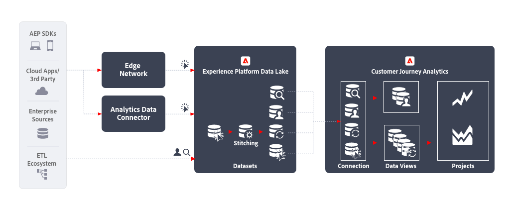

# クロスチャネル分析

クロスチャネル分析を使用すると、様々な Web、モバイル、オフラインのプロパティからのデータを統合し、様々なチャネルをまたいだ顧客の行動を 1 つの統合ビューで把握できます。 例えば、この統合ビューを使用して、デスクトップとモバイルをまたいで顧客のインタラクションを分析し、顧客の行動を把握し、インサイトを抽出してデジタル顧客体験を最適化できます。 また、チャネルをまたいだ顧客インタラクション（例：サポートのやり取りや店頭購入など、デジタルチャネルとオフラインチャネル）を分析して、カスタマージャーニーをより深く理解し、最適化することもできます。

## ワークフロー

## 実装手順

1. 取り込むデータの [スキーマを作成](https://experienceleague.adobe.com/docs/experience-platform/xdm/tutorials/create-schema-ui.html?lang=ja) します。
1. 取り込むデータの [データセットを作成](https://experienceleague.adobe.com/docs/platform-learn/tutorials/data-ingestion/create-datasets-and-ingest-data.html?lang=ja) します。
1. [Experience Platform へのデータの取得](https://experienceleague.adobe.com/docs/platform-learn/tutorials/data-ingestion/understanding-data-ingestion.html?lang=ja):
   1. イベントベースのデータ  Edge Network または Analytics Data Connector を介して web サイトまたはモバイルアプリから
   2. プロファイルデータ  （例えば、CRM システム、コールセンターアプリケーション、ロイヤルティアプリケーションから）。
   3. 参照データ  （製品名、製品情報システムのカテゴリなど）。

1. データセット全体で共通の名前空間 ID を使用します。 用途 [ステッチ](../../stitching/overview.md) イベントベースのデータセットを昇格させる  各行に共通の ID を指定する場合に使用します。 Customer Journey Analytics は、現在、ステッチに Experience Platform プロファイルまたは ID サービスを使用していません。
1. カスタムデータの準備を実行し、時系列データセット間の共通キーが Customer Journey Analytics に取り込まれるようにします。
1. ルックアップデータに、イベントデータのフィールドに結合できるプライマリ ID を指定します。ライセンスの行としてカウントします。
1. プロファイルデータには、イベントデータのプライマリ ID と同じプライマリ ID を設定します。
1. [接続の作成](../../connections/overview.md) を使用して、関連するデータセットをExperience PlatformからCustomer Journey Analyticsに取り込みます。
1. 接続で [データビューを作成](/help/data-views/create-dataview.md) し、ビューに含める特定のディメンションと指標を選択します。アトリビューションと割り当ては、データビューでも設定できます。これらの設定は、レポート時に計算されます。
1. [Analysis Workspace 内でダッシュボードとレポートを設定するプロジェクトを作成します。](/help/analysis-workspace/home.md)

## 注意点

このワークフローを確立する際は、次の点を考慮してください。

* チャネル間でデータを分析するには、すべてのレコードで同じ ID 名前空間が必要です。
* 異なるデータセットを統合する和集合プロセスには、データセット全体で共通のプライマリパーソン／エンティティキーが必要です。
* セカンダリのキーベースの和集合は、現在サポートされていません。
* ステッチ処理では、同じ永続 ID を共有するレコードから、一時的な ID（認証 ID など）情報に基づいて行の ID を再入力できます。これにより、デバイスや cookie レベルではなく、個人レベルでの分析に個別のレコードを単一のステッチ ID に解決できます。
* 同じ XDM フィールドのオブジェクトとアトリビューションは、Customer Journey Analytics 内で 1 つのディメンションに結合されます。様々なデータセットの複数のアトリビューションを同じ Customer Journey Analytics ディメンションに結合するには、データセットが同じ XDM フィールドまたはスキーマを参照する必要があります。

