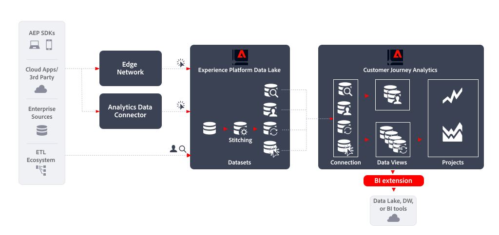

# BI 拡張機能

この記事では、[!DNL Customer Journey Analytics BI extension] を使用して次の [ データ書き出しのユースケース ](overview.md) を実装する方法について説明します。

- Data Lake、Data Warehouseまたは BI ツール

## はじめに

[!DNL Customer Journey Analytics BI extension] を使用したデータの書き出しでは、Customer Journey Analytics データビューからデータを書き出すことができます。

## 詳細情報

[!DNL Customer Journey Analytics BI extension] を使用すると、Customer Journey Analytics で定義した[データビュー](/help/data-views/data-views.md)への SQL アクセスが可能になります。データエンジニアやアナリストは、Power BI、Tableau またはその他のビジネスインテリジェンスツールやビジュアライゼーションツール（以降、BI ツールと呼びます）に精通している可能性があります。Customer Journey Analytics ユーザーが Analysis Workspace プロジェクトを作成する際に使用しているものと同じデータビューに基づいて、レポートおよびダッシュボードを作成できるようになりました。

詳しくは、[BI 拡張機能 ](../../data-views/bi-extension.md) に関する詳細なドキュメントを参照してください。
