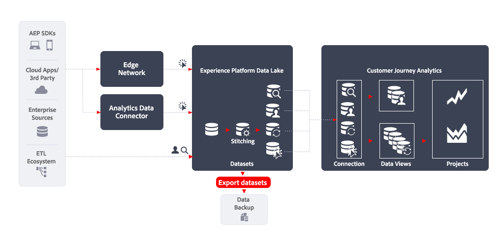

# データセットの書き出し

この記事では、[!DNL Customer Journey Analytics Export datasets]を使用して次の[&#x200B; データ書き出しの使用例](overview.md)を実装する方法について説明します。

- データバックアップ

## はじめに

[!DNL Experience Platform Export datasets]を使用してデータをエクスポートすると、Customer Journey Analytics データビューから任意のクラウドストレージの宛先にデータをエクスポートできます。

## 詳細情報

Experience Platformのデータレイクからクラウドストレージの宛先に、生のデータセットを書き出すことができます。 この書き出しは、データセット書き出し先と呼ばれるExperience Platformの宛先の用語です。 概要については、[&#x200B; データセットをクラウドストレージの宛先に書き出し](https://experienceleague.adobe.com/ja/docs/experience-platform/destinations/ui/activate/export-datasets)を参照してください。

次のクラウドストレージの宛先がサポートされています。

- [Azure Data Lake Storage Gen2](https://experienceleague.adobe.com/ja/docs/experience-platform/destinations/catalog/cloud-storage/adls-gen2)
- [Data Landing Zone](https://experienceleague.adobe.com/ja/docs/experience-platform/destinations/catalog/cloud-storage/data-landing-zone)
- [Google Cloud Storage](https://experienceleague.adobe.com/ja/docs/experience-platform/destinations/catalog/cloud-storage/google-cloud-storage)
- [Amazon S3](https://experienceleague.adobe.com/ja/docs/experience-platform/destinations/catalog/cloud-storage/amazon-s3#changelog)
- [Azure BLOB](https://experienceleague.adobe.com/ja/docs/experience-platform/destinations/catalog/cloud-storage/azure-blob#changelog)
- [SFTP](https://experienceleague.adobe.com/ja/docs/experience-platform/destinations/catalog/cloud-storage/sftp#changelog)

### EXPERIENCE PLATFORM UI

Experience Platform UIを使用して、データセットの書き出しをスケジュールできます。 この節では、関連する手順について説明します。

#### 宛先を選択

データセットの書き出し先となるクラウドストレージの宛先を決定したら、[宛先](https://experienceleague.adobe.com/ja/docs/experience-platform/destinations/ui/activate/export-datasets#select-destination)を選択します。 優先クラウドストレージの宛先をまだ設定していない場合は、[新しい宛先接続を作成する必要があります](https://experienceleague.adobe.com/ja/docs/experience-platform/destinations/ui/connect-destination)。

宛先の設定の一環として、次の項目を定義できます。

- ファイルタイプ（JSONまたはParquet）、
- 生成されるファイルを圧縮するかどうか、および
- マニフェストファイルを含めるかどうかを指定します。

#### データセットを選択

宛先を選択した場合、次の&#x200B;**[!UICONTROL データセットを選択]** ステップで、データセットのリストからデータセットを選択する必要があります。 複数のスケジュール済みクエリを作成しており、データセットを同じクラウドストレージの宛先に送信する場合は、対応するデータセットを選択できます。 詳しくは、[&#x200B; データセットの選択](https://experienceleague.adobe.com/ja/docs/experience-platform/destinations/ui/activate/export-datasets#select-datasets)を参照してください。

#### データセット書き出しのスケジュール設定

最後に、**[!UICONTROL スケジューリング]**&#x200B;手順の一環として、データセットの書き出しをスケジュールします。 この手順では、スケジュールと、データセットの書き出しを増分にするかどうかを定義できます。 詳しくは、[&#x200B; データセットの書き出しをスケジュール &#x200B;](https://experienceleague.adobe.com/ja/docs/experience-platform/destinations/ui/activate/export-datasets#scheduling)を参照してください。

#### 最終手順

[選択内容を確認](https://experienceleague.adobe.com/ja/docs/experience-platform/destinations/ui/activate/export-datasets#review)し、正しい場合は、データセットをクラウドストレージの宛先に書き出します。

最初に、[&#x200B; データの書き出しを正常に実行するには、](https://experienceleague.adobe.com/ja/docs/experience-platform/destinations/ui/activate/export-datasets#verify)検証する必要があります。 データセットを書き出す場合、Experience Platformは、宛先で定義されたストレージの場所に1つまたは複数の`.json`または`.parquet`個のファイルを作成します。 設定した書き出しスケジュールに従って、新しいファイルがストレージの場所に格納されることを期待します。 Experience Platformは、選択した保存先の一部として指定した保存場所にフォルダー構造を作成し、書き出されたファイルを保存します。 書き出し時間ごとに、パターン `folder-name-you-provided/datasetID/exportTime=YYYYMMDDHHMM`に従って新しいフォルダーが作成されます。 デフォルトのファイル名はランダムに生成され、書き出されたファイルの名前は必ず一意になります。

### Flow Service API

または、APIを使用して、データセットの書き出しを書き出し、スケジュールすることもできます。 関連する手順については、[Flow Service APIを使用したデータセットの書き出し](https://experienceleague.adobe.com/ja/docs/experience-platform/destinations/api/export-datasets)を参照してください。

#### 基本を学ぶ

データセットを書き出すには、[必要な権限](https://experienceleague.adobe.com/ja/docs/experience-platform/destinations/api/export-datasets#permissions)があることを確認してください。 また、データセットを送信する宛先がデータセットの書き出しをサポートしていることを確認します。 次に、[API呼び出しで使用する必須ヘッダーとオプション ヘッダー](https://experienceleague.adobe.com/ja/docs/experience-platform/destinations/api/export-datasets#gather-values-headers)の値を収集する必要があります。 また、データセットを書き出す宛先[&#128279;](https://experienceleague.adobe.com/ja/docs/experience-platform/destinations/api/export-datasets#gather-connection-spec-flow-spec)の接続仕様とフロー仕様IDを特定する必要があります。

#### 適格なデータセットの取得

[書き出しの対象となるデータセット &#x200B;](https://experienceleague.adobe.com/ja/docs/experience-platform/destinations/api/export-datasets#retrieve-list-of-available-datasets)のリストを取得し、[`GET /connectionSpecs/{id}/configs`](https://developer.adobe.com/experience-platform-apis/references/destinations/#tag/Configurations/operation/getDatasets) APIを使用して、データセットがそのリストに含まれているかどうかを確認できます。

#### ソース接続の作成

次に、クラウドストレージの宛先に書き出すデータセットの一意のIDを使用して、[&#x200B; ソース接続](https://experienceleague.adobe.com/ja/docs/experience-platform/destinations/api/export-datasets#create-source-connection)を作成する必要があります。 [`POST /sourceConnections`](https://developer.adobe.com/experience-platform-apis/references/destinations/#tag/Source-connections/operation/postSourceConnection) APIを使用しています。

#### 宛先への認証（ベース接続の作成）

[`POST /targetConection`](https://developer.adobe.com/experience-platform-apis/references/destinations/#tag/Target-connections/operation/postTargetConnection) APIを使用して資格情報を認証し、クラウドストレージの宛先に安全に保存するには、[&#x200B; ベース接続](https://experienceleague.adobe.com/ja/docs/experience-platform/destinations/api/export-datasets#create-base-connection)を作成する必要があります。

#### 書き出しパラメーターを指定

次に、[`POST /targetConection`](https://developer.adobe.com/experience-platform-apis/references/destinations/#tag/Target-connections/operation/postTargetConnection) APIをもう一度使用して、データセットの書き出しパラメーター[&#128279;](https://experienceleague.adobe.com/ja/docs/experience-platform/destinations/api/export-datasets#create-target-connection)を格納する追加のターゲット接続を作成する必要があります。 これらのエクスポートパラメーターには、場所、ファイル形式、圧縮などが含まれます。

#### データフローの設定

最後に、[&#128279;](https://experienceleague.adobe.com/ja/docs/experience-platform/destinations/api/export-datasets#create-dataflow)&#x200B; データセットが[`POST /flows`](https://developer.adobe.com/experience-platform-apis/references/destinations/#tag/Dataflows/operation/postFlow) APIを使用してクラウドストレージの宛先に書き出されるように、データフローを設定します。 この手順では、`scheduleParams` パラメーターを使用して、書き出しのスケジュールを定義できます。

#### データフローの検証

データフロー[&#128279;](https://experienceleague.adobe.com/ja/docs/experience-platform/destinations/api/export-datasets#get-dataflow-runs)の正常な実行を確認するには、[`GET /runs`](https://developer.adobe.com/experience-platform-apis/references/destinations/#tag/Dataflow-runs/operation/getFlowRuns) APIを使用し、データフローIDをクエリパラメーターとして指定します。 このデータフローIDは、データフローの設定時に返される識別子です。

[&#x200B; データの書き出しが成功したことを](https://experienceleague.adobe.com/ja/docs/experience-platform/destinations/ui/activate/export-datasets#verify)確認します。 データセットを書き出す場合、Experience Platformは、宛先で定義されたストレージの場所に1つまたは複数の`.json`または`.parquet`個のファイルを作成します。 設定した書き出しスケジュールに従って、新しいファイルがストレージの場所に格納されることを期待します。 Experience Platformは、選択した保存先の一部として指定した保存場所にフォルダー構造を作成し、書き出されたファイルを保存します。 書き出し時間ごとに、パターン `folder-name-you-provided/datasetID/exportTime=YYYYMMDDHHMM`に従って新しいフォルダーが作成されます。 デフォルトのファイル名はランダムに生成され、書き出されたファイルの名前は必ず一意になります。
