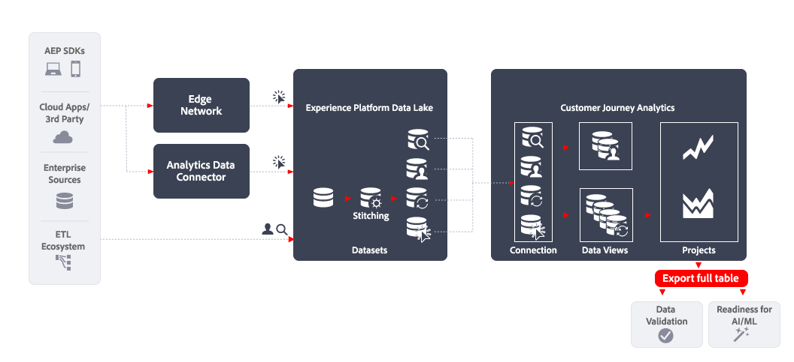

# フルテーブルの書き出し

この記事では、[!DNL Customer Journey Analytics BI extension]を使用して次の[&#x200B; データ書き出しの使用例](overview.md)を実装する方法について説明します。

- データの検証
- AI/マシンラーニングへの対応

## はじめに

[!DNL Customer Journey Analytics Full Table Export]を使用してデータを書き出すと、Customer Journey Analytics Analysis Workspaceのフリーフォームテーブルからデータを書き出すことができます。

## 詳細情報

テーブルの書き出し機能を使用すると、Analysis Workspaceで作成したフリーフォームテーブルの完全なコンテンツを、指定したクラウドの宛先に直接書き出すことができます。

詳しくは、[Customer Journey Analytics レポートのクラウドへの書き出し](/help/analysis-workspace/export/export-cloud.md)に関する詳細なドキュメントを参照してください。
