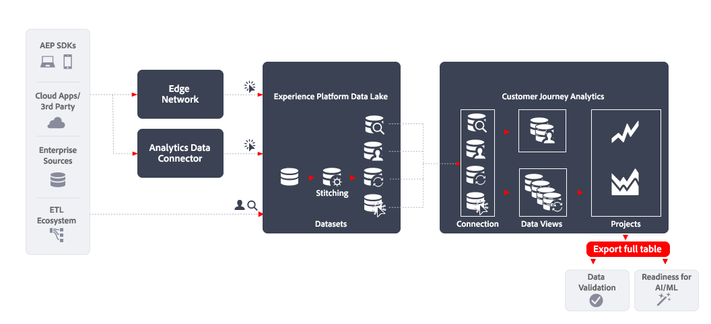

# フルテーブルの書き出し

この記事では、[!DNL Export full table]機能を使用して、次の[&#x200B; データ書き出しの使用例](overview.md)を実装する方法について説明します。

* データの検証
* AI/マシンラーニングへの対応

## はじめに

[!DNL Customer Journey Analytics Full Table Export]を使用してデータを書き出すと、Customer Journey Analytics Analysis Workspaceのフリーフォームテーブルからデータを書き出すことができます。

## 詳細情報

Analysis Workspaceで作成したフリーフォームテーブルの完全なコンテンツを、指定されたクラウドの宛先に直接書き出すには、テーブルの書き出し機能を使用します。

テーブルの書き出しは、レポートごとに最大10個のディメンションと10個の指標をサポートし、計算指標とセグメント化が含まれます。 ライセンス層に応じて、書き出しごとに300万行、3000万行、1億5000万行、または3億行を書き出すことができ、他の書き出し方法の50,000行の制限を超えます。 サポートされている宛先には、Adobe Experience Platform Data Landing Zone、Google Cloud Platform、Microsoft Azure、Amazon S3、Snowflakeなどがあります。 詳しくは、[&#x200B; テーブルの書き出しの利点](/help/analysis-workspace/export/export-cloud.md#advantages)を参照してください。

詳しくは、[Customer Journey Analytics レポートのクラウドへの書き出し](/help/analysis-workspace/export/export-cloud.md)に関する詳細なドキュメントを参照してください。
