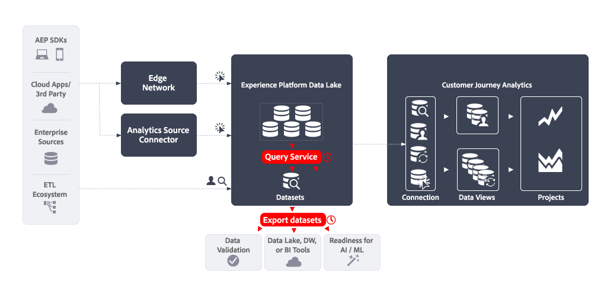

# Query Service （Data Distiller）とデータセットの書き出し

この記事では、Experience Platform Query Service （Data Distiller）とデータセットの書き出しを組み合わせて、次の[&#x200B; データ書き出しの使用例](overview.md)を実装する方法について説明します。

- データの検証
- データレイク、BI ツールのData Warehouse
- Aiとマシンラーニングの活用。


Adobe Analyticsでは、[&#x200B; データフィード &#x200B;](https://experienceleague.adobe.com/ja/docs/analytics/export/analytics-data-feed/data-feed-overview)機能を使用して、これらのユースケースを実装できます。 データフィードは、Adobe Analytics から生データを取得するための強力な方法です。 この記事では、上記のユースケースを実装できるように、Experience Platformから同様のタイプの生データを取得する方法について説明します。 該当する場合、データとプロセスの違いを明確にするために、この記事に記載されている機能をAdobe Analytics データフィードと比較します。

## はじめに

クエリサービス（Data Distiller）を使用したデータの書き出しとデータセットの書き出しは、次の要素で構成されます。

- **クエリサービス**&#x200B;を使用して、データフィードのデータを出力データセット として生成する&#x200B;**スケジュール済みクエリ**&#x200B;を定義します。
- **データセット書き出し**&#x200B;を使用して、出力データセットをクラウドストレージの宛先に書き出す&#x200B;**スケジュール済みデータセット書き出し**&#x200B;を定義します。




## 前提条件

このユースケースで説明されている機能を使用する前に、次のすべての要件を満たしていることを確認してください。

- Experience Platformのデータレイクにデータを収集する実用的な実装。
- Data Distiller アドオンにアクセスして、バッチクエリを実行する権限を持っていることを確認します。 詳しくは、[&#x200B; クエリサービスのパッケージ &#x200B;](https://experienceleague.adobe.com/en/docs/experience-platform/query/packaging)を参照してください。
- データセットの書き出し機能へのアクセス。Real-Time CDP PrimeまたはUltimate パッケージ、Adobe Journey OptimizerまたはCustomer Journey Analyticsを購入した場合に使用できます。 詳しくは、[&#x200B; データセットをクラウドストレージの宛先に書き出し](https://experienceleague.adobe.com/ja/docs/experience-platform/destinations/ui/activate/export-datasets)を参照してください。
- 1つ以上の設定済み宛先（例：Amazon S3、Google Cloud Storage）から、データフィードの生データを書き出すことができます。


## クエリサービス

Experience Platform クエリサービスを使用すると、Experience Platform データレイク内の任意のデータセットを、データベーステーブルであるかのようにクエリして結合できます。 その後、結果を新しいデータセットとしてキャプチャして、レポートでさらに使用したり、書き出したりできます。

クエリサービス [&#x200B; ユーザーインターフェイス &#x200B;](https://experienceleague.adobe.com/en/docs/experience-platform/query/ui/overview)、PostgresQL プロトコル [&#128279;](https://experienceleague.adobe.com/ja/docs/experience-platform/query/clients/overview)を介して接続された クライアント、または[RESTful API](https://experienceleague.adobe.com/en/docs/experience-platform/query/api/getting-started)を使用して、データフィードのデータを収集するクエリを作成およびスケジュールできます。

### クエリを作成

SELECT文やその他の制限付きコマンドに対する標準ANSI SQLのすべての機能を使用して、データフィードのデータを生成するクエリを作成および実行できます。 詳細については、[SQL構文](https://experienceleague.adobe.com/en/docs/experience-platform/query/sql/syntax)を参照してください。 このSQL構文に加えて、Adobeでは次の機能をサポートしています。

- [&#x200B; セッション化](https://experienceleague.adobe.com/en/docs/analytics/components/virtual-report-suites/vrs-mobile-visit-processing)と[&#x200B; アトリビューション &#x200B;](https://experienceleague.adobe.com/en/docs/analytics/analyze/analysis-workspace/attribution/overview)の関数など、Experience Platform データレイクに保存されているイベントデータに対する一般的なビジネス関連タスクの実行に役立つ、事前構築済みの[Adobe定義関数（ADF） &#x200B;](https://experienceleague.adobe.com/en/docs/experience-platform/query/sql/adobe-defined-functions),
- いくつかの組み込み[Spark SQL関数](https://experienceleague.adobe.com/en/docs/experience-platform/query/sql/spark-sql-functions),
- [&#x200B; メタデータ PostgreSQL コマンド &#x200B;](https://experienceleague.adobe.com/en/docs/experience-platform/query/sql/metadata),
- [準備済みステートメント &#x200B;](https://experienceleague.adobe.com/en/docs/experience-platform/query/sql/prepared-statements)。

#### データフィード列

クエリで使用できるXDM フィールドは、データセットのベースとなるスキーマ定義によって異なります。 データセットの基礎となるスキーマを確実に理解できます。 詳しくは、[&#x200B; データセット UI ガイド &#x200B;](https://experienceleague.adobe.com/en/docs/experience-platform/catalog/datasets/user-guide)を参照してください。

データフィード列とXDM フィールド間のマッピングを定義する方法については、[Analytics フィールドマッピング &#x200B;](https://experienceleague.adobe.com/ja/docs/experience-platform/sources/connectors/adobe-applications/mapping/analytics)を参照してください。 スキーマ、クラス、フィールドグループ、データタイプなど、XDM リソースを管理する方法について詳しくは、[&#x200B; スキーマ UIの概要](https://experienceleague.adobe.com/en/docs/experience-platform/xdm/ui/overview#defining-xdm-fields)も参照してください。

例えば、*ページ名*&#x200B;をデータフィードの一部として使用する場合は、次のようになります。

- Adobe Analytics データフィードのUIで、データフィード定義に追加する列として&#x200B;**[!UICONTROL pagename]**&#x200B;を選択します。
- クエリサービスでは、`sample_event_dataset_for_website_global_v1_1` データセットの`web.webPageDetails.name`をクエリに含めます（Web サイト用の&#x200B;**サンプルイベントスキーマ（グローバル v1.1）** エクスペリエンスイベントスキーマに基づく）。 詳しくは、[Web詳細スキーマフィールドグループ &#x200B;](https://experienceleague.adobe.com/en/docs/experience-platform/xdm/field-groups/event/web-details)を参照してください。


#### ID

Experience Platformでは、様々なIDを使用できます。 クエリを作成するときは、IDが正しくクエリされていることを確認します。


多くの場合、別のフィールドグループにIDが存在します。 実装では、ECID （`ecid`）は、`core` オブジェクトを持つフィールドグループの一部として定義できます。このオブジェクト自体は`identification` オブジェクトの一部です（例：`_sampleorg.identification.core.ecid`）。 ECIDは、スキーマ内で異なる構成される場合があります。

または、`identityMap`を使用してIDを照会することもできます。 `identityMap`はタイプ `Map`で、[&#x200B; ネストされたデータ構造](#nested-data-structure)を使用します。

Experience PlatformでID フィールドを定義する方法について詳しくは、[UIでのID フィールドの定義](https://experienceleague.adobe.com/ja/docs/experience-platform/xdm/ui/fields/identity)を参照してください。

Analytics ソースコネクタを使用する場合に、Adobe Analytics IDがExperience Platform IDにどのようにマッピングされるかについては、Analytics データの[プライマリ IDを参照してください。 &#x200B;](https://experienceleague.adobe.com/en/docs/experience-platform/sources/connectors/adobe-applications/analytics#primary-identifiers-in-analytics-data)このマッピングは、Analytics ソースコネクタを使用していない場合でも、IDを設定するためのガイダンスとして機能する可能性があります。


#### ヒットレベルのデータと識別

実装に基づいて、従来Adobe Analyticsで収集されていたヒットレベルのデータが、タイムスタンプ付きのイベントデータとしてExperience Platformに保存されるようになりました。 次の表は、[Analytics フィールドマッピング &#x200B;](https://experienceleague.adobe.com/en/docs/experience-platform/sources/connectors/adobe-applications/mapping/analytics#generated-mapping-fields)から抽出され、ヒットレベル固有のAdobe Analytics データフィード列をクエリ内の対応するXDM フィールドにマッピングする方法の例を示しています。 次の表に、XDM フィールドを使用したヒット、訪問、訪問者の識別方法の例を示します。

| データフィード列 | XDM フィールド | タイプ | 説明 |
|---|---|---|---|
| `hitid_high` + `hitid_low` | `_id` | string | ヒットを識別する一意の ID。 |
| `hitid_low` | `_id` | string | ヒットを一意に識別するために、`hitid_high`と共に使用されます。 |
| `hitid_high` | `_id` | string | ヒットを一意に識別するために、`hitid_high`と共に使用されます。 |
| `hit_time_gmt` | `receivedTimestamp` | string | UNIX®時間に基づくヒットのタイムスタンプ。 |
| `cust_hit_time_gmt` | `timestamp` | string | このタイムスタンプは、タイムスタンプが有効なデータセットでのみ使用されます。 このタイムスタンプは、UNIX®時間に基づいて、ヒットとともに送信されます。 |
| `visid_high` + `visid_low` | `identityMap` | オブジェクト | 訪問の一意の ID。 |
| `visid_high` + `visid_low` | `endUserIDs._experience.aaid.id` | string | 訪問の一意の ID。 |
| `visid_high` | `endUserIDs._experience.aaid.primary` | ブール型 | `visid_low`と共に使用して、一意の訪問を識別します。 |
| `visid_high` | `endUserIDs._experience.aaid.namespace.code` | string | `visid_low`と共に使用して、一意の訪問を識別します。 |
| `visid_low` | `identityMap` | オブジェクト | `visid_high`と共に使用して、一意の訪問を識別します。 |
| `cust_visid` | `identityMap` | オブジェクト | 顧客訪問者 ID。 |
| `cust_visid` | `endUserIDs._experience.aacustomid.id` | オブジェクト | 顧客訪問者 ID。 |
| `cust_visid` | `endUserIDs._experience.aacustomid.primary` | ブール型 | 顧客訪問者ID名前空間コード。 |
| `cust_visid` | `endUserIDs._experience.aacustomid.namespace.code` | string | `visid_low`と共に使用して、顧客訪問者IDを一意に識別します。 |
| `geo\_*` | `placeContext.geo.* ` | 文字列、数値 | 国、地域、都市などの位置情報データ |
| `event_list` | `commerce.purchases`, `commerce.productViews`, `commerce.productListOpens`, `commerce.checkouts`, `commerce.productListAdds`, `commerce.productListRemovals`, `commerce.productListViews`, `_experience.analytics.event101to200.*`, ..., `_experience.analytics.event901_1000.*` | string | ヒット時にトリガーされる標準コマースイベントとカスタムイベント。 |
| `page_event` | `web.webInteraction.type` | string | イメージリクエストで送信されるヒットのタイプ（標準的なヒット、ダウンロードリンク、離脱リンク、クリックされたカスタムリンク）。 |
| `page_event` | `web.webInteraction.linkClicks.value` | number | イメージリクエストで送信されるヒットのタイプ（標準的なヒット、ダウンロードリンク、離脱リンク、クリックされたカスタムリンク）。 |
| `page_event_var_1` | `web.webInteraction.URL` | string | リンクトラッキングイメージリクエストでのみ使用される変数。 この変数には、クリックされたダウンロードリンク、離脱リンク、またはカスタムリンクの URL が含まれます。 |
| `page_event_var_2` | `web.webInteraction.name` | string | リンクトラッキングイメージリクエストでのみ使用される変数。 このリストは、リンクのカスタム名をリスト表示します（指定されている場合）。 |
| `paid_search` | `search.isPaid` | ブール型 | ヒットが有料検索の検出に一致した場合に設定されるフラグ。 |
| `ref_type` | `web.webReferrertype` | string | ヒットのリファラルのタイプを表す数値 ID。 |

#### 列を投稿

Adobe Analytics データフィードでは、処理後のデータを含む列である`post_`接頭辞を持つ列という概念を使用します。 詳しくは、[データフィードに関する FAQ](https://experienceleague.adobe.com/en/docs/analytics/export/analytics-data-feed/df-faq#post) を参照してください。

Experience Platform Edge Network（Web SDK、モバイルSDK、サーバーAPI）を通じてデータセットで収集されたデータには、`post_` フィールドという概念はありません。 その結果、接頭辞`post_`と接頭辞&#x200B;*非*-`post_`のデータフィード列が同じXDM フィールドにマッピングされます。 例えば、`page_url`と`post_page_url`の両方のデータフィード列が同じ`web.webPageDetails.URL` XDM フィールドにマッピングされます。

データ処理の違いについて詳しくは、[Adobe AnalyticsとCustomer Journey Analytics](https://experienceleague.adobe.com/en/docs/analytics-platform/using/compare-aa-cja/cja-aa-comparison/data-processing-comparisons)のデータ処理の比較を参照してください。

ただし、Experience Platform データレイクで収集されたデータの`post_`接頭辞カラム型は、データフィードのユースケースで正常に使用するには、高度な変換が必要です。 クエリでこれらの高度な変換を実行するには、セッション化、属性、重複排除に[Adobe定義の関数](https://experienceleague.adobe.com/en/docs/experience-platform/query/sql/adobe-defined-functions)を使用する必要があります。 これらの関数の使用方法については、[例](#examples)を参照してください。

#### 参照

他のデータセットのデータを検索するには、標準のSQL機能（`WHERE`句、`INNER JOIN`、`OUTER JOIN`など）を使用します。

#### 計算

フィールド（列）に対して計算を実行するには、標準のSQL関数（例：`COUNT(*)`）、またはSpark SQLの[数学演算子および統計演算子および関数](https://experienceleague.adobe.com/en/docs/experience-platform/query/sql/spark-sql-functions#math)部分を使用します。 また、[&#x200B; ウィンドウ関数](https://experienceleague.adobe.com/en/docs/experience-platform/query/sql/adobe-defined-functions#window-functions)は、集計を更新し、順序付きサブセットの各行について1つの項目を返すためのサポートを提供します。 これらの関数の使用方法については、[例](#examples)を参照してください。

#### ネストされたデータ構造

データセットのベースとなるスキーマには、多くの場合、ネストされたデータ構造などの複雑なデータ型が含まれます。 前述の`identityMap`は、ネストされたデータ構造の例です。 `identityMap` データの例については、以下を参照してください。

```json
{
   "identityMap":{
      "FPID":[
         {
            "id":"55613368189701342632255821452918751312",
            "authenticatedState":"ambiguous"
         }
      ],
      "CRM":[
         {
            "id":"2394509340-30453470347",
            "authenticatedState":"authenticated"
         }
      ]
   }
}
```

Spark SQLの[`explode()`またはその他の配列関数](https://experienceleague.adobe.com/en/docs/experience-platform/query/sql/spark-sql-functions#arrays)を使用して、ネストされたデータ構造内のデータにアクセスできます。例：

```sql
select explode(identityMap) from demosys_cja_ee_v1_website_global_v1_1 limit 15;
```

または、ドット表記法を使用して個々の要素を参照することもできます。 次に例を示します。

```sql
select identityMap.ecid from demosys_cja_ee_v1_website_global_v1_1 limit 15;
```

詳しくは、[クエリサービスでのネストされたデータ構造の操作](https://experienceleague.adobe.com/en/docs/experience-platform/query/key-concepts/nested-data-structures)を参照してください。


#### 例

クエリの場合：

- Experience Platformデータレイクのデータセットから，
- Adobe Defined FunctionsやSpark SQLなどの機能を利用し
- Adobe Analyticsのデータフィードと同様の結果を，

関連項目：

- [閲覧を放棄](https://experienceleague.adobe.com/en/docs/experience-platform/query/use-cases/abandoned-browse)
- [属性分析](https://experienceleague.adobe.com/en/docs/experience-platform/query/use-cases/attribution-analysis)
- [ボットフィルタリング](https://experienceleague.adobe.com/en/docs/experience-platform/query/use-cases/bot-filtering)
- クエリ サービス ガイド [&#128279;](https://experienceleague.adobe.com/en/docs/experience-platform/query/use-cases/overview)でサポートされているその他の ユースケースを示します。

以下に、セッション間でアトリビューションを適切に適用する例を示します

- 過去90日間を振り返り，
- セッション化やアトリビューションなどのウィンドウ関数を適用し
- `ingest_time`に基づいて出力を制限します。

  +++ 詳細

  これを行うには、次のことが必要です。

   - 処理状態テーブル `checkpoint_log`を使用して、現在の取り込み時間と最後の取り込み時間を追跡します。 詳しくは、[このガイド &#x200B;](https://experienceleague.adobe.com/en/docs/experience-platform/query/key-concepts/incremental-load)を参照してください。
   - システム列の削除を無効にします。`_acp_system_metadata.ingestTime`を使用できます。
   - 最も内側の`SELECT`を使用して、使用するフィールドを取得し、セッション化やアトリビューション計算のためにイベントをルックバック期間に制限します。 例えば、90日です。
   - 次のレベル `SELECT`を使用して、セッション化および/またはアトリビューションウィンドウ関数およびその他の計算を適用します。
   - 出力テーブルで`INSERT INTO`を使用して、ルックバックを最後の処理時間から到着したイベントのみに制限します。 これは、`_acp_system_metadata.ingestTime `に対して、処理ステータス テーブルに最後に保存された時間をフィルタリングすることで行います。

  **セッション化ウィンドウ関数の例**

  ```sql
  $$ BEGIN
     -- Disable dropping system columns
     set drop_system_columns=false; 
  
     -- Initialize variables
     SET @last_updated_timestamp = SELECT CURRENT_TIMESTAMP;
  
     -- Get the last processed batch ingestion time
     SET @from_batch_ingestion_time = SELECT coalesce(last_batch_ingestion_time, 'HEAD') 
        FROM checkpoint_log a 
        JOIN (
              SELECT MAX(process_timestamp) AS process_timestamp 
              FROM checkpoint_log
              WHERE process_name = 'data_feed' 
              AND process_status = 'SUCCESSFUL'
        ) b
        ON a.process_timestamp = b.process_timestamp;
  
     -- Get the last batch ingestion time
     SET @to_batch_ingestion_time = SELECT MAX(_acp_system_metadata.ingestTime) 
        FROM events_dataset;
  
     -- Sessionize the data and insert into data_feed.
     INSERT INTO data_feed
     SELECT *
     FROM (
        SELECT
              userIdentity,
              timestamp,
              SESS_TIMEOUT(timestamp, 60 * 30) OVER (
                 PARTITION BY userIdentity
                 ORDER BY timestamp
                 ROWS BETWEEN UNBOUNDED PRECEDING AND CURRENT ROW
              ) AS session_data,
              page_name,
              ingest_time
        FROM (
              SELECT
                 userIdentity,
                 timestamp,
                 web.webPageDetails.name AS page_name,
                 _acp_system_metadata.ingestTime AS ingest_time
              FROM events_dataset
              WHERE timestamp >= current_date - 90
        ) AS a
        ORDER BY userIdentity, timestamp ASC
     ) AS b
     WHERE b.ingest_time >= @from_batch_ingestion_time;
  
     -- Update the checkpoint_log table
     INSERT INTO checkpoint_log
     SELECT
        'data_feed' process_name,
        'SUCCESSFUL' process_status,
        cast(@to_batch_ingestion_time AS string) last_batch_ingestion_time,
        cast(@last_updated_timestamp AS TIMESTAMP) process_timestamp
  END
  $$;
  ```

  **アトリビューションウィンドウ関数の例**

  ```sql
  $$ BEGIN
   SET drop_system_columns=false;
  
  -- Initialize variables
   SET @last_updated_timestamp = SELECT CURRENT_TIMESTAMP;
  
  -- Get the last processed batch ingestion time 1718755872325
   SET @from_batch_ingestion_time =
       SELECT coalesce(last_snapshot_id, 'HEAD')
       FROM checkpoint_log a
       JOIN (
           SELECT MAX(process_timestamp) AS process_timestamp
           FROM checkpoint_log
           WHERE process_name = 'data_feed'
           AND process_status = 'SUCCESSFUL'
       ) b
       ON a.process_timestamp = b.process_timestamp;
  
   -- Get the last batch ingestion time 1718758687865
   SET @to_batch_ingestion_time =
       SELECT MAX(_acp_system_metadata.ingestTime)
       FROM demo_data_trey_mcintyre_midvalues;
  
   -- Sessionize the data and insert into new_sessionized_data
   INSERT INTO new_sessionized_data
   SELECT *
   FROM (
       SELECT
           _id,
           timestamp,
           struct(User_Identity,
           cast(SESS_TIMEOUT(timestamp, 60 * 30) OVER (
               PARTITION BY User_Identity
               ORDER BY timestamp
               ROWS BETWEEN UNBOUNDED PRECEDING AND CURRENT ROW
           ) as string) AS SessionData,
           to_timestamp(from_unixtime(ingest_time/1000, 'yyyy-MM-dd HH:mm:ss')) AS IngestTime,      
           PageName,
           first_url,
           first_channel_type
             ) as _demosystem5
       FROM (
           SELECT
               _id,
               ENDUSERIDS._EXPERIENCE.MCID.ID as User_Identity,
               timestamp,
               web.webPageDetails.name AS PageName,
              attribution_first_touch(timestamp, '', web.webReferrer.url) OVER (PARTITION BY ENDUSERIDS._EXPERIENCE.MCID.ID ORDER BY timestamp ASC ROWS BETWEEN UNBOUNDED PRECEDING AND UNBOUNDED FOLLOWING).value AS first_url,
              attribution_first_touch(timestamp, '',channel.typeAtSource) OVER (PARTITION BY ENDUSERIDS._EXPERIENCE.MCID.ID ORDER BY timestamp ASC ROWS BETWEEN UNBOUNDED PRECEDING AND UNBOUNDED FOLLOWING).value AS first_channel_type,
               _acp_system_metadata.ingestTime AS ingest_time
           FROM demo_data_trey_mcintyre_midvalues
           WHERE timestamp >= current_date - 90
       )
       ORDER BY User_Identity, timestamp ASC    
   )
   WHERE _demosystem5.IngestTime >= to_timestamp(from_unixtime(@from_batch_ingestion_time/1000, 'yyyy-MM-dd HH:mm:ss'));
  
  -- Update the checkpoint_log table
  INSERT INTO checkpoint_log
  SELECT
     'data_feed' as process_name,
     'SUCCESSFUL' as process_status,
     cast(@to_batch_ingestion_time AS string) as last_snapshot_id,
     cast(@last_updated_timestamp AS timestamp) as process_timestamp;
  
  END
  $$;
  ```

  +++


### スケジュールクエリ

クエリをスケジュールして、クエリが実行され、結果が好みの間隔で生成されるようにします。

#### クエリエディターの使用

クエリエディターを使用して、クエリをスケジュールできます。 クエリのスケジュールを設定する際には、出力データセットを定義します。 詳しくは、[&#x200B; クエリスケジュール &#x200B;](https://experienceleague.adobe.com/en/docs/experience-platform/query/ui/query-schedules)を参照してください。


#### Query Service APIの使用

または、RESTful APIを使用して、クエリを定義し、クエリのスケジュールを設定することもできます。 詳しくは、[Query Service API ガイド &#x200B;](https://experienceleague.adobe.com/en/docs/experience-platform/query/api/getting-started)を参照してください。
クエリの作成時（[&#x200B; クエリの作成](https://developer.adobe.com/experience-platform-apis/references/query-service/#tag/Queries/operation/createQuery)）またはクエリのスケジュール作成時（[&#x200B; スケジュールされたクエリの作成](https://developer.adobe.com/experience-platform-apis/references/query-service/#tag/Schedules/operation/createSchedule)）に、オプションの`ctasParameters` プロパティの一部として出力データセットを定義してください。


## データセットの書き出し

クエリを作成してスケジュールし、結果を検証したら、生のデータセットをクラウドストレージの宛先に書き出すことができます。 この書き出しは、データセット書き出し先と呼ばれるExperience Platformの宛先の用語です。 概要については、[&#x200B; データセットをクラウドストレージの宛先に書き出し](https://experienceleague.adobe.com/ja/docs/experience-platform/destinations/ui/activate/export-datasets)を参照してください。

次のクラウドストレージの宛先がサポートされています。

- [Azure Data Lake Storage Gen2](https://experienceleague.adobe.com/en/docs/experience-platform/destinations/catalog/cloud-storage/adls-gen2)
- [Data Landing Zone](https://experienceleague.adobe.com/en/docs/experience-platform/destinations/catalog/cloud-storage/data-landing-zone)
- [Google Cloud Storage](https://experienceleague.adobe.com/en/docs/experience-platform/destinations/catalog/cloud-storage/google-cloud-storage)
- [Amazon S3](https://experienceleague.adobe.com/en/docs/experience-platform/destinations/catalog/cloud-storage/amazon-s3)
- [Azure BLOB](https://experienceleague.adobe.com/en/docs/experience-platform/destinations/catalog/cloud-storage/azure-blob)
- [SFTP](https://experienceleague.adobe.com/en/docs/experience-platform/destinations/catalog/cloud-storage/sftp)


### EXPERIENCE PLATFORM UI

Experience Platform UIを使用して、出力データセットの書き出しと書き出しをスケジュールできます。 この節では、関連する手順について説明します。

#### 宛先を選択

出力データセットを書き出すクラウドストレージの宛先を決定したら、[宛先](https://experienceleague.adobe.com/en/docs/experience-platform/destinations/ui/activate/export-datasets#select-destination)を選択します。 優先クラウドストレージの宛先をまだ設定していない場合は、[新しい宛先接続を作成する必要があります](https://experienceleague.adobe.com/en/docs/experience-platform/destinations/ui/connect-destination)。

宛先の設定の一部として、次のことができます

- ファイルタイプ（JSONまたはParquet）を定義します。
- 生成されるファイルを圧縮するかどうか、および
- マニフェストファイルを含めるかどうかを指定します。


#### データセットを選択

宛先を選択した場合、次の&#x200B;**[!UICONTROL データセットを選択]** ステップで、データセットのリストから出力データセットを選択する必要があります。 複数のスケジュール済みクエリを作成しており、出力データセットを同じクラウドストレージの宛先に送信する場合は、対応する出力データセットを選択できます。 詳しくは、[&#x200B; データセットの選択](https://experienceleague.adobe.com/en/docs/experience-platform/destinations/ui/activate/export-datasets#select-datasets)を参照してください。

#### データセット書き出しのスケジュール設定

最後に、**[!UICONTROL スケジューリング]**&#x200B;手順の一環として、データセットの書き出しをスケジュールします。 この手順では、スケジュールと、出力データセットの書き出しを増分にするかどうかを定義できます。 詳しくは、[&#x200B; データセットの書き出しをスケジュール &#x200B;](https://experienceleague.adobe.com/en/docs/experience-platform/destinations/ui/activate/export-datasets#scheduling)を参照してください。


#### 最終手順

[選択内容を確認](https://experienceleague.adobe.com/en/docs/experience-platform/destinations/ui/activate/export-datasets#review)し、正しい場合は、出力データセットをクラウドストレージの宛先に書き出します。

データの書き出しを成功させるには、[検証](https://experienceleague.adobe.com/en/docs/experience-platform/destinations/ui/activate/export-datasets#verify)する必要があります。 データセットを書き出す場合、Experience Platformは、宛先で定義されたストレージの場所に1つまたは複数の`.json`または`.parquet`個のファイルを作成します。 設定した書き出しスケジュールに従って、新しいファイルがストレージの場所に格納されることを期待します。 Experience Platformは、選択した保存先の一部として指定した保存場所にフォルダー構造を作成し、書き出されたファイルを保存します。 書き出し時間ごとに、パターン `folder-name-you-provided/datasetID/exportTime=YYYYMMDDHHMM`に従って新しいフォルダーが作成されます。 デフォルトのファイル名はランダムに生成され、書き出されたファイルの名前は必ず一意になります。

### Flow Service API

または、APIを使用して、出力データセットの書き出しを書き出し、スケジュールすることもできます。 関連する手順については、[Flow Service APIを使用したデータセットの書き出し](https://experienceleague.adobe.com/en/docs/experience-platform/destinations/api/export-datasets)を参照してください。

#### 基本を学ぶ

データセットを書き出すには、[必要な権限](https://experienceleague.adobe.com/en/docs/experience-platform/destinations/api/export-datasets#permissions)があることを確認してください。 また、出力データセットを送信する宛先がデータセットの書き出しをサポートしていることを確認します。 次に、[API呼び出しで使用する必須ヘッダーとオプション ヘッダー](https://experienceleague.adobe.com/en/docs/experience-platform/destinations/api/export-datasets#gather-values-headers)の値を収集する必要があります。 また、データセットを書き出す宛先[&#128279;](https://experienceleague.adobe.com/en/docs/experience-platform/destinations/api/export-datasets#gather-connection-spec-flow-spec)の接続仕様とフロー仕様IDを特定する必要があります。

#### 適格なデータセットの取得

[書き出し用に適格なデータセット &#x200B;](https://experienceleague.adobe.com/en/docs/experience-platform/destinations/api/export-datasets#retrieve-list-of-available-datasets)のリストを取得し、[`GET /connectionSpecs/{id}/configs`](https://developer.adobe.com/experience-platform-apis/references/destinations/#tag/Configurations/operation/getDatasets) APIを使用して、出力データセットがそのリストに含まれているかどうかを確認できます。


#### ソース接続の作成

次に、クラウドストレージの宛先に書き出す一意のIDを使用して、出力データセットのソース接続[&#128279;](https://experienceleague.adobe.com/en/docs/experience-platform/destinations/api/export-datasets#create-source-connection)を作成する必要があります。 [`POST /sourceConnections`](https://developer.adobe.com/experience-platform-apis/references/destinations/#tag/Source-connections/operation/postSourceConnection) APIを使用しています。

#### 宛先への認証（ベース接続の作成）

[`POST /targetConection`](https://developer.adobe.com/experience-platform-apis/references/destinations/#tag/Target-connections/operation/postTargetConnection) APIを使用して資格情報を認証し、クラウドストレージの宛先に安全に保存するには、[&#x200B; ベース接続](https://experienceleague.adobe.com/en/docs/experience-platform/destinations/api/export-datasets#create-base-connection)を作成する必要があります。


#### 書き出しパラメーターを指定

次に、[`POST /targetConection`](https://developer.adobe.com/experience-platform-apis/references/destinations/#tag/Target-connections/operation/postTargetConnection) APIをもう1回使用して、出力データセットの書き出しパラメーター[&#128279;](https://experienceleague.adobe.com/en/docs/experience-platform/destinations/api/export-datasets#create-target-connection)を格納する追加のターゲット接続を作成する必要があります。 これらのエクスポートパラメーターには、場所、ファイル形式、圧縮などが含まれます。

#### データフローの設定

最後に、出力データセットが[`POST /flows`](https://developer.adobe.com/experience-platform-apis/references/destinations/#tag/Dataflows/operation/postFlow) APIを使用してクラウドストレージの宛先に書き出されるように、[&#x200B; データフロー](https://experienceleague.adobe.com/en/docs/experience-platform/destinations/api/export-datasets#create-dataflow)を設定します。 この手順では、`scheduleParams` パラメーターを使用して、書き出しのスケジュールを定義できます。

#### データフローの検証

データフロー[&#128279;](https://experienceleague.adobe.com/en/docs/experience-platform/destinations/api/export-datasets#get-dataflow-runs)の正常な実行を確認するには、[`GET /runs`](https://developer.adobe.com/experience-platform-apis/references/destinations/#tag/Dataflow-runs/operation/getFlowRuns) APIを使用し、データフローIDをクエリパラメーターとして指定します。 このデータフローIDは、データフローの設定時に返される識別子です。

[&#x200B; データの書き出しが成功したことを](https://experienceleague.adobe.com/en/docs/experience-platform/destinations/ui/activate/export-datasets#verify)確認します。 データセットを書き出す場合、Experience Platformは、宛先で定義されたストレージの場所に1つまたは複数の`.json`または`.parquet`個のファイルを作成します。 設定した書き出しスケジュールに従って、新しいファイルがストレージの場所に格納されることを期待します。 Experience Platformは、選択した保存先の一部として指定した保存場所にフォルダー構造を作成し、書き出されたファイルを保存します。 書き出し時間ごとに、パターン `folder-name-you-provided/datasetID/exportTime=YYYYMMDDHHMM`に従って新しいフォルダーが作成されます。 デフォルトのファイル名はランダムに生成され、書き出されたファイルの名前は必ず一意になります。

## まとめ

つまり、Adobe Analytics データフィード機能をエミュレートすると、クエリサービスを使用してスケジュールされたクエリを設定し、スケジュールされたデータセットの書き出しでこれらのクエリの結果を使用する必要があります。

>[!IMPORTANT]
>
>このユースケースには、2つのスケジューラーが関与しています。 エミュレーションされたデータフィード機能が適切に動作することを保証するには、クエリサービスとデータの書き出しで設定されたスケジュールが干渉しないようにします。
