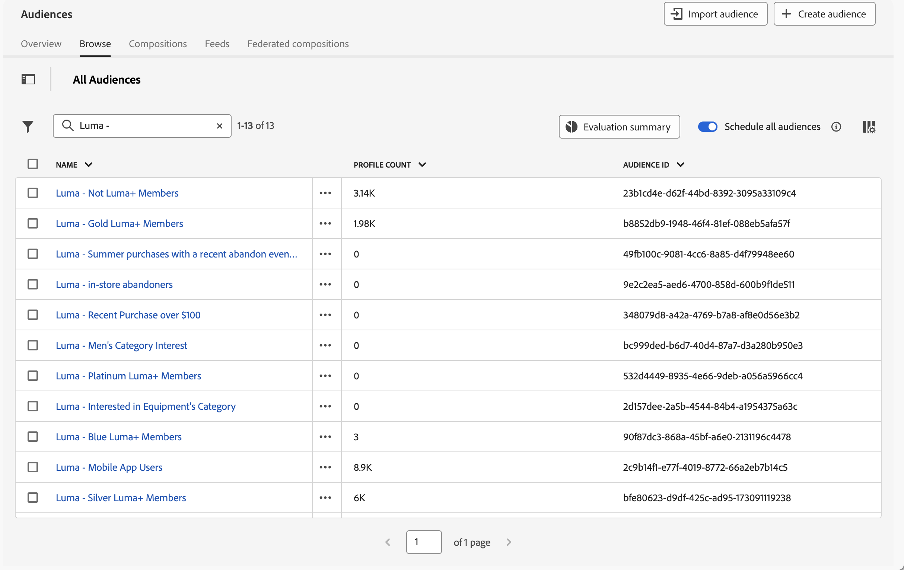
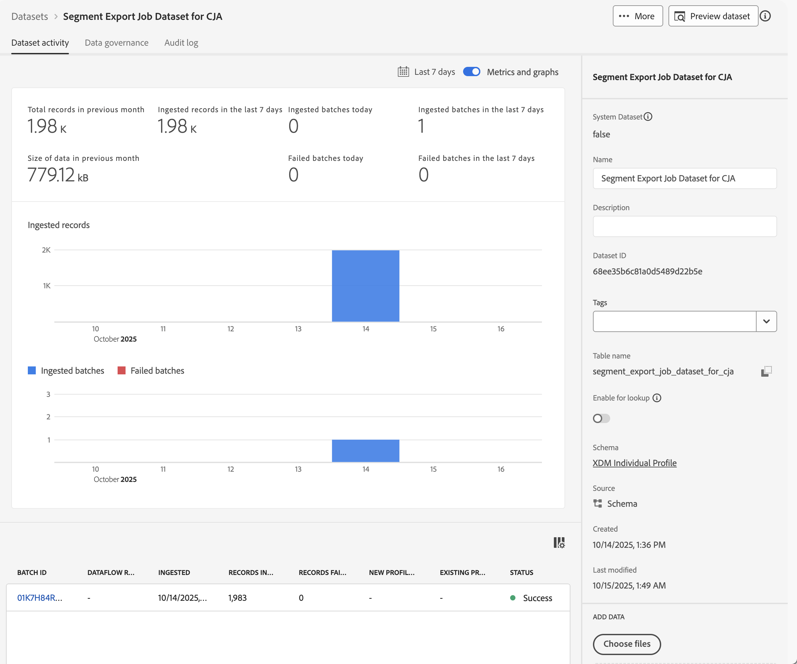
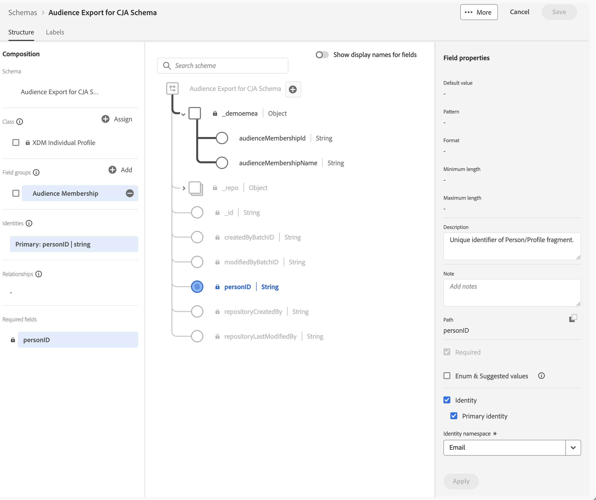
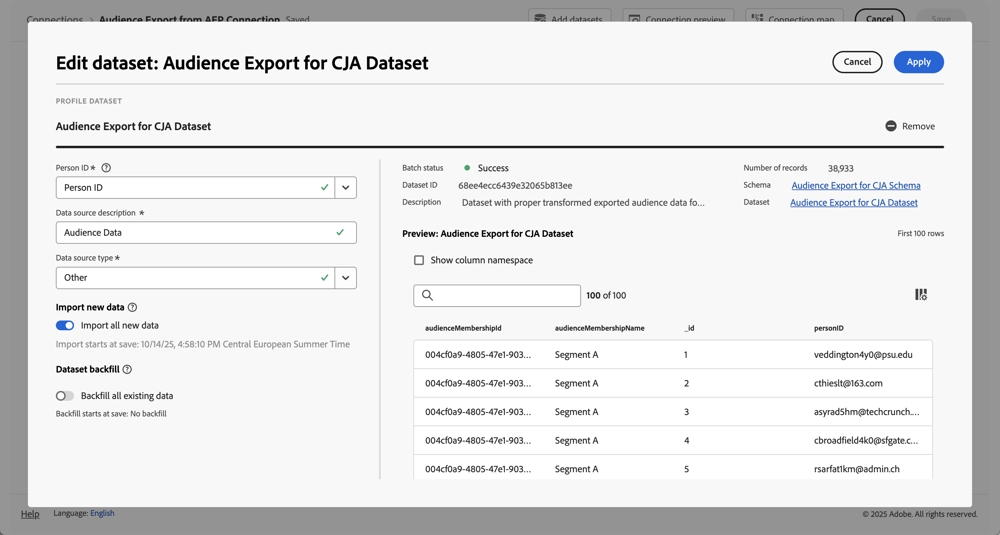
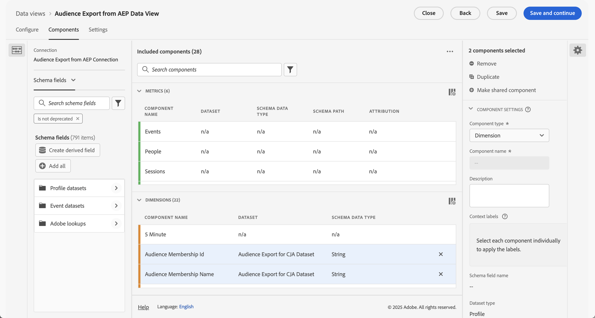
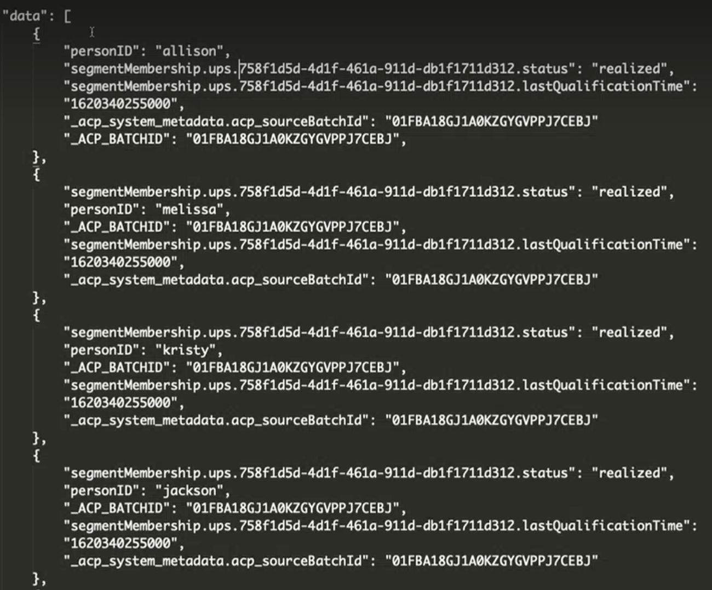
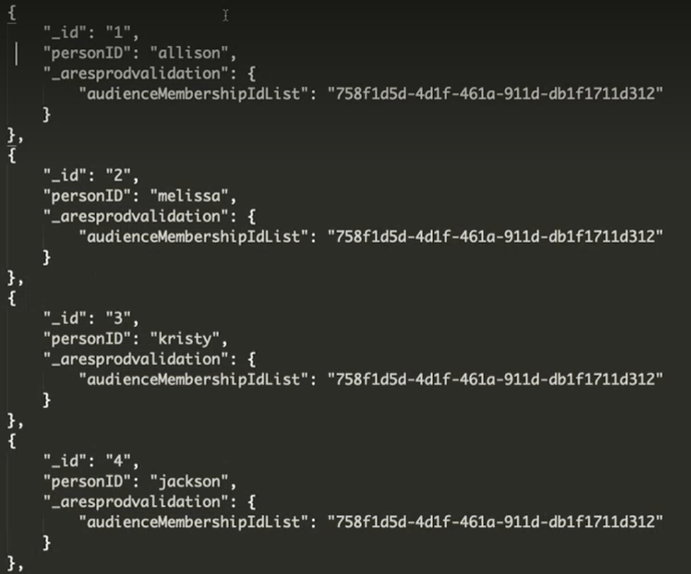
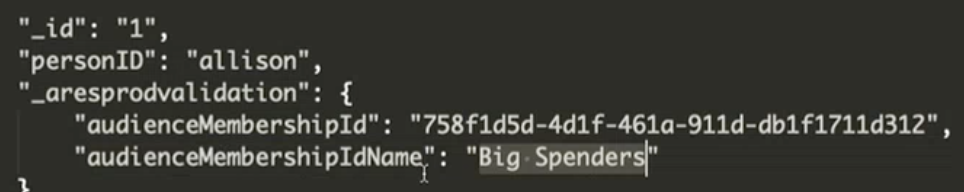

# Experience Platform オーディエンスの取り込みと使用

このユースケースでは、Experience Platform オーディエンスをCustomer Journey Analyticsに取り込むための暫定的なソリューションについて説明します。 これらのオーディエンスは、Experience Platform セグメントビルダー、Adobe Audience Managerなどのツールで作成され、リアルタイム顧客プロファイルに保存されます。 オーディエンスは、一連のプロファイル IDと、該当する属性、イベントなどで構成されます。 そのオーディエンスデータをCustomer Journey Analyticsに取り込んで詳しく分析する必要があります。

## 前提条件

* [Experience Platform](https://experienceleague.adobe.com/ja/docs/experience-platform/access-control/home)、特にリアルタイム顧客プロファイルへのアクセス。
* Experience Platform [&#x200B; スキーマ &#x200B;](https://experienceleague.adobe.com/ja/docs/experience-platform/xdm/home)および[&#x200B; データセット &#x200B;](https://experienceleague.adobe.com/ja/docs/experience-platform/catalog/datasets/overview)を作成および管理するためのアクセス権。
* [Experience Platform Query Service](https://experienceleague.adobe.com/ja/docs/experience-platform/query/home)へのアクセス （およびSQLの書き込み機能）。
* データの変換を実行できるツールへのアクセス。
* Customer Journey Analytics にアクセスします。 Customer Journey Analytics接続とデータビューを作成および変更するには、[Customer Journey Analytics製品管理者](/help/technotes/access-control.md)である必要があります。
* [Experience Platform API （Catalog Service APIおよびSegmentation Service API）の認証とアクセス &#x200B;](https://experienceleague.adobe.com/ja/docs/experience-platform/landing/platform-apis/api-authentication)。 組織とサンドボックスの開発者コンソールでプロジェクトを作成し、API呼び出しを正常に送信するために必要な情報を持っていることを確認する必要があります。

## 手順

暫定的なソリューションには、次の手順が含まれます。

1. [&#x200B; オーディエンスの選択（Experience Platform UI） &#x200B;](#select-audiences)。
1. [&#x200B; プロファイル対応データセット（Experience Platform API）を作成](#create-a-profile-enabled-dataset)。
1. [&#x200B; オーディエンスのエクスポート （Experience Platform API） &#x200B;](#export-audiences)。
1. [出力を変換する（Experience Platform UIなど） &#x200B;](#transform-the-output)。
1. [&#x200B; スキーマとデータセットの作成（Experience Platform UI） &#x200B;](#create-a-schema-and-dataset)。
1. [接続の追加または編集（Customer Journey Analytics UI） &#x200B;](#add-or-edit-a-connection)。
1. [&#x200B; データビューの設定（Customer Journey Analytics UI） &#x200B;](#configure-a-data-view)。
1. [&#x200B; レポートと分析（Customer Journey Analytics UI） &#x200B;](#report-and-analyze)。


### オーディエンスを選択

まず、Customer Journey Analyticsに取り込むオーディエンスを特定します。

+++ オーディエンスの特定

Experience Platform UI の場合：

1. **[!UICONTROL Customer]** >  **[!UICONTROL Audiences]**&#x200B;を選択します。
1. **[!UICONTROL 参照]**&#x200B;を選択し、Customer Journey Analyticsで取り込んで使用するオーディエンスを検索します。 後で使用するために、各オーディエンスの&#x200B;**[!UICONTROL オーディエンス ID]**&#x200B;を書き留めます。

   

+++

### プロファイル対応データセットの作成

コアベースの&#x200B;**[!UICONTROL XDM個人プロファイル]** スキーマに基づいてデータセットを作成する必要があります。 Experience Platform UIでデータセットを作成する際に、そのコアベースのXDM個人プロファイルをスキーマとして選択することはできません。 代わりに、[Catalog Service APIを使用して、`_xdm.context.profile__union` スキーマに基づいてデータセット &#x200B;](https://experienceleague.adobe.com/en/docs/experience-platform/catalog/datasets/create#create-a-dataset)を作成します。

+++ データセット作成リクエスト

#### リクエスト

```shell
curl -X POST \
  'https://platform.adobe.io/data/foundation/catalog/dataSets?requestDataSource=true' \
  -H 'Authorization: Bearer {ACCESS_TOKEN}' \
  -H 'Content-Type: application/json' \
  -H 'x-api-key: {API_KEY}' \
  -H 'x-gw-ims-org-id: {ORG_ID}' \
  -H 'x-sandbox-name: {SANDBOX_NAME}' \
  -d '{
   "name": "{DATASET_NAME}",
   "schemaRef": {
      "id": "_xdm.context.profile__union",
      "contentType": "application/vnd.adobe.xed+json;version=1"
   },
   "fileDescription": {
      "persistet": true,
      "containerFormat": "parquet",
      "format": "parquet"
   }
}'
```

ここで：

* `DATASET_NAME`はデータセットのわかりやすい名前です。 例：`Segment Export Job Dataset for CJA`。

#### 応答

```json
["@/dataSets/{DATASET_ID}"]
```

ここで：

* `DATASET_ID`は、作成されたデータセットのデータセット IDです。

+++

### オーディエンスの書き出し

選択したオーディエンスを、作成したデータセットに書き出します。 [&#x200B; セグメント化サービス APIを使用して、オーディエンスをデータセットに送信する書き出しジョブ &#x200B;](https://experienceleague.adobe.com/en/docs/experience-platform/segmentation/api/export-jobs#create)を作成します。

+++ ジョブリクエストをエクスポート

```shell
curl -X POST https://platform.adobe.io/data/core/ups/export/jobs \
 -H 'Authorization: Bearer {ACCESS_TOKEN}' \
 -H 'Content-Type: application/json' \
 -H 'x-gw-ims-org-id: {ORG_ID}' \
 -H 'x-api-key: {API_KEY}' \
 -H 'x-sandbox-name: {SANDBOX_NAME}' \
 -d '{
    "fields": "{COMMA_SEPARATED_LIST_OF_FULLY_QUALIFIED_FIELD_NAMES}",
    "filter": {
        "segments": [
            {
                "segmentId": "{AUDIENCE_ID_1}",
                "segmentNs": "ups",
                "status": [
                    "realized"
                ],
                "segmentId": "{AUDIENCE_ID_2}",
                "segmentNs": "ups",
                "status": [
                    "realized"
                ],
                "segmentId": "{AUDIENCE_ID_3}",
                "segmentNs": "ups",
                "status": [
                    "realized"
                ]             
             }
        ]
    },
    "destination":{
        "datasetId": "{DATASET_ID}",
        "segmentPerBatch": false
    },
    "schema":{
        "name": "_xdm.context.profile"
    }
}'
```

ここで、

* `COMMA_SEPARATED_LIST_OF_FULLY_QUALIFIED_FIELD_NAMES`は`_demoemea.identification.core.ecid, _demoemea.identification.core.email, _demoemea.identification.core.phoneNumber, person.gender, person.name.firstName, person.name.lastName`のようになります。 少なくとも、顧客ジャーニー分析で使用する関連フィールド（personID （電子メールなど）を含めてください。
* `AUDIENCE_ID_x`は、書き出すオーディエンスのオーディエンス IDです。
* `DATASET_ID`は、作成したデータセットです。


### 応答

```json
{
  "..."
  "id": "{EXPORT_JOB_ID}",
  "..."
}
```

ここで、

* `EXPORT_JOB_ID`は書き出しジョブの識別子です。


+++

[&#x200B; セグメント化サービス APIを使用して、書き出しジョブ &#x200B;](https://experienceleague.adobe.com/en/docs/experience-platform/segmentation/api/export-jobs#get)のステータスを確認します。

+++ 特定の書き出しジョブリクエストの取得

#### リクエスト

```shell
curl -X GET https://platform.adobe.io/data/core/ups/export/jobs/{EXPORT_JOB_ID} \
 -H 'Authorization: Bearer {ACCESS_TOKEN}' \
 -H 'x-gw-ims-org-id: {ORG_ID}' \
 -H 'x-api-key: {API_KEY}' \
 -H 'x-sandbox-name: {SANDBOX_NAME}'
```

#### 応答

```json
{
  "..."
  "id": "{EXPORT_JOB_ID}",
  "..."
  "status": "SUCCEEDED",
  "..."
}
```

+++

書き出しジョブが成功したら、データセットに正常に取り込まれたバッチが含まれているかどうかを確認します。

+++ 取り込みステータスの確認

Experience Platform UI の場合：

1. **[!UICONTROL データ管理]** >  **[!UICONTROL データセット]**&#x200B;を選択します。
1. 作成したデータセットを選択します。例：**[!UICONTROL CJA用のセグメント書き出しジョブデータセット]**

   

1. 取り込んだバッチを確認します。 データセットに失敗したバッチが含まれる場合は、**[!UICONTROL データ管理]** >  **[!UICONTROL 監視]**&#x200B;を使用して、その理由を確認します。 例えば、スキーマに存在しないフィールド名を使用しました。
1. データセットの&#x200B;**[!UICONTROL テーブル名]**&#x200B;をコピーします。 例：**[!UICONTROL segment_export_job_dataset_for_cja]**。  次の手順でその名前を使用します。

+++


### 出力を変換する

データセット内のデータがCustomer Journey Analyticsの正しいフォーマットではありません。 データを変換するには、Experience Platform クエリサービスを使用してデータを取得します。

+++ 書き出されたオーディエンスデータを取得するためのSQL

Experience Platform Query Serviceに接続するPSQL クライアントを使用します。

Experience Platform UI の場合：

1. **[!UICONTROL データ管理]** >  **[!UICONTROL クエリ]**&#x200B;を選択します。
1.  **[!UICONTROL 資格情報]**&#x200B;を選択します。

Customer Journey Analytics Query Serviceに接続するようにPSQL クライアントを設定するには、資格情報を使用します。

#### クエリ

このクエリを実行して、データセットからオーディエンスデータを取得します。

```sql
SELECT ROW_NUMBER() OVER (ORDER BY key)::text as _id, personID, key as audienceMembershipId
FROM (
   SELECT {IDENTITY_TO_USE_AS_PERSON_ID} AS personID, explode(segmentMembership.ups)
   FROM {DATASET_TABLE_NAME}
)
WHERE value.status = 'realized' AND (key = '{AUDIENCE_ID_1}' OR key = 'AUDIENCE_ID_2' OR key = 'AUDIENCE_ID_3')
```

ここで：

* `IDENTITY_TO_USE_AS_PERSON_ID`は、書き出しジョブの一部として定義したフィールドの1つです。 例：`_demoemea.identification.core.email`。
* `DATASET_TABLE_NAME`はデータセットのテーブル名です。
* `AUDIENCE_ID_x`は、書き出しジョブの一部として定義したオーディエンスです。 書き出しジョブの仕様が行レベルのフィルターであるため、これらのオーディエンスをもう一度指定する必要があります。 この行レベルのフィルターは、指定されたセグメントのプロファイルを、各プロファイルのすべてのセグメントメンバーシップとともに返します。


#### 結果

JSON形式のクエリの結果は、次のようになります。

```json
[
   {
      "_id": "1",
      "personID": "{PERSON_ID_x}",
      "audienceMembershipId": "{AUDIENCE_ID_x}"
   },
   {
      "_id": "2",
      "personID": "PERSON_ID_y",
      "audienceMembershipId": "{AUDIENCE_ID_x}"
   }

]
```

ここで：

* `PERSON_ID_x`は、ユーザーIDとして使用する識別子の識別子の値です。 例えば、電子メールを使用する場合は`john.doe@gmail.com`です。
* `AUDIENCE_ID_x`はオーディエンス IDです。

+++

このJSON データを変換して、環境のテナント名を追加し、オーディエンスにより使いやすい名前を指定する必要があります。

+++ JSONを変換

最終的なJSONは次のようになります。

```json
[
   {
      "_id": "1",
      "personID": "{PERSON_ID_x}",
      "{TENANT_NAME}": {
         "audienceMembershipId": "{AUDIENCE_ID_x}",
         "audienceMembershipName": "{AUDIENCE_FRIENDLY_NAME_x}"
      }
  },
  {
      "_id": "2",
      "personID": "{PERSON_ID_y}",
      "{TENANT_NAME}": {
         "audienceMembershipId": "{AUDIENCE_ID_y}",
         "audienceMembershipName": "{AUDIENCE_FRIENDLY_NAME_y}"
      }
    }
  }

]
```

ここで：

* `TENANT_NAME`はテナントの名前です。 例：`_demoemea`。
* `PERSON_ID_x`は、ユーザーIDとして使用する識別子の識別子の値です。 例えば、電子メールを使用する場合は`john.doe@gmail.com`です。
* `AUDIENCE_ID_x`はオーディエンス IDです。
* `AUDIENCE_FRIENDLY_NAME_x`は、オーディエンス idのわかりやすいオーディエンス名です。 例：`Luma - Blue+ Members`。

お気に入りのツールを使用して、元のJSONをこの形式に変換します。

+++


### スキーマとデータセットの作成

変換されたJSONをCustomer Journey Analyticsで書き出されたオーディエンスデータとして使用するには、専用のスキーマを作成する必要があります。

+++ スキーマを作成

スキーマを作成するには：

Experience Platform UI の場合：

1. **[!UICONTROL データ管理]** >  **[!UICONTROL スキーマ]**&#x200B;を選択します。
1.  **[!UICONTROL スキーマの作成]**&#x200B;を選択します。 ドロップダウンメニューから「**[!UICONTROL Standard]**」を選択します。
1. 「**[!UICONTROL スキーマを作成]**」ダイアログで「**[!UICONTROL 手動]**」を選択し、**[!UICONTROL 選択]**」を使用して続行します。
1. **[!UICONTROL スキーマを作成]** ウィザードの&#x200B;**[!UICONTROL クラスを選択]**&#x200B;手順で次の操作を行います。
   1. **[!UICONTROL 個人プロファイル]**&#x200B;を選択します。
   1. 「**[!UICONTROL 次へ]**」を選択します。
1. **[!UICONTROL スキーマを作成]** ウィザードの&#x200B;**[!UICONTROL 名前とレビュー]**&#x200B;手順で：
   1. **[!UICONTROL スキーマの表示名]**&#x200B;を入力します。 例：`Audience Export for CJA Schema`。
   1. （オプション） **[!UICONTROL 説明]**&#x200B;を入力します。
   1. 「**[!UICONTROL 完了]**」を選択します。
1. **[!UICONTROL audienceMembershipId]**&#x200B;と&#x200B;**[!UICONTROL audienceMembershipName]**&#x200B;という2つのフィールドを含むカスタムフィールドグループ（例えば、**[!UICONTROL Audience Membership]**&#x200B;という名前）を含むようにスキーマを設定します。
1. **[!UICONTROL personID]** フィールドが&#x200B;**[!UICONTROL ID]**、**[!UICONTROL プライマリ ID]**&#x200B;であり、**[!UICONTROL Email]**&#x200B;がI&#x200B;**[!UICONTROL ID名前空間]であることを確認し**&#x200B;す。

   

1. すべての変更を&#x200B;**[!UICONTROL 適用]**&#x200B;します。 「**[!UICONTROL 保存]**」を選択してスキーマを保存します。

+++

データセットを作成し、そのデータセットを使用して、変換されたJSON データを取り込みます。

+++ データセットの作成とデータの取り込み

Experience Platform UI の場合：

1. **[!UICONTROL データ管理]** >  **[!UICONTROL データセット]**&#x200B;を選択します。
1.  **[!UICONTROL データセットを作成]**&#x200B;を選択します。
1. 「**[!UICONTROL スキーマからデータセットを作成]**」をクリックします。
1. **[!UICONTROL スキーマからデータセットを作成]** ウィザードで、**[!UICONTROL スキーマを選択]**&#x200B;手順で次の操作を行います。
   1. 作成したスキーマを選択します。 例：**[!UICONTROL CJA スキーマのオーディエンス書き出し]**。
   1. 「**[!UICONTROL 次へ]**」を選択します。
1. **[!UICONTROL スキーマからデータセットを作成]** ウィザードで、**[!UICONTROL データセットを設定]**&#x200B;手順で次の操作を行います。
   1. データセットの&#x200B;**[!UICONTROL 名前]**&#x200B;を入力します。
   1. （オプション）データセットの&#x200B;**[!UICONTROL 説明]**&#x200B;を入力します。
   1. 「**[!UICONTROL 完了]**」を選択します。
1. データセット **[!UICONTROL データセット]** > データセット _&#x200B;**の**&#x200B;_&#x200B;名で、変換されたJSON データファイルをドラッグし、ファイルを&#x200B;**[!UICONTROL ファイルにドロップします]**。 このアクションは、書き出されたJSON データのデータセットへの取り込みを開始します。
1. 取り込んだバッチを確認します。 データセットに失敗したバッチが含まれる場合は、**[!UICONTROL データ管理]** >  **[!UICONTROL 監視]**&#x200B;を使用して、その理由を確認します。 例えば、スキーマに存在しないフィールド名をJSONで定義したとします。


+++

### 接続の追加または編集

Experience Platformからのオーディエンスデータを含む、変換されたJSON データが正常に取り込まれたら、Customer Journey Analyticsの新規または既存の接続にデータセットを追加できます。

+++ 接続にデータセットを追加

Customer Journey Analytics UIの場合：

1. **[!UICONTROL データ管理]** > **[!UICONTROL 接続]**&#x200B;を選択します。
1. 新しい接続を作成/**[!UICONTROL 接続設定]**&#x200B;および&#x200B;**[!UICONTROL データ設定]**&#x200B;を定義します。 または、既存の接続を選択し、 **[!UICONTROL 接続の編集]**&#x200B;を使用して接続を編集します。
1.  **[!UICONTROL データセットを追加]**&#x200B;を選択します。
1. 作成したデータセットと、変換されたJSON データを取り込んだデータセットを選択します。
1. データセットを設定します。 次に例を示します。

   

1. 接続を&#x200B;**[!UICONTROL 保存]**&#x200B;します。

+++

### データビューの設定

作成または編集したばかりの接続のデータビューを設定します。

+++ オーディエンスコンポーネントの定義

1. **[!UICONTROL データ管理]** > **[!UICONTROL データビュー]**&#x200B;を選択します。
1. 既存のデータビューを編集するか、新しいデータビューを作成します。
1. データビューの「**[!UICONTROL コンポーネント]**」タブで、**[!UICONTROL オーディエンスメンバーシップ Id]**&#x200B;と&#x200B;**[!UICONTROL オーディエンスメンバーシップ名]**&#x200B;がディメンションコンポーネントとして追加されていることを確認します。

   

1. 「**[!UICONTROL 保存して続行]**」を選択し、データビューを保存します。

+++

### レポートと分析

最後に、Analysis Workspaceを使用して、`audienceMembershipId`、`audienceMembershipIdName`、`personID`などのオーディエンスメンバーシップコンポーネントでデータビューを使用する1つ以上のパネルで、Experience Platform オーディエンスデータについてレポートします。


<!--

## Step 1: Select audiences in Real-time Customer Profile {#audience}

Experience Platform [Real-time Customer Profile](https://experienceleague.adobe.com/docs/experience-platform/profile/home.html) lets you see a holistic view of each individual customer by combining data from multiple channels, including online, offline, CRM, and third party. 

You likely already have audiences in RTCP that may have come from various sources. Select one or more audiences to ingest into Customer Journey Analytics. For example, WKND Fly Platinum and Gold Fly Club Members.


## Step 2: Create a Profile Union dataset for the export

In order to export the audience to a dataset that you can ingest in Customer Journey Analytics as profiles, create a dataset whose schema is a Profile [Union schema](https://experienceleague.adobe.com/docs/experience-platform/profile/union-schemas/union-schema.html#understanding-union-schemas).

Union schemas are composed of multiple schemas that share the same class and have been enabled for Profile. The union schema enables you to see an amalgamation of all of the fields contained within schemas sharing the same class. Real-time Customer Profile uses the union schema to create a holistic view of each individual customer.

## Step 3: Export an audience to the Profile Union dataset via API call {#export}

Before you can bring an audience into Customer Journey Analytics, you need to export it to an Adobe Experience Platform dataset. This can only be done using the Segmentation API, and specifically the [Export Jobs API Endpoint](https://experienceleague.adobe.com/docs/experience-platform/segmentation/api/export-jobs.html). 

You can create an export job using the audience ID of your choice, and put the results in the Profile Union Adobe Experience Platform dataset you created in Step 2. Although you can export various attributes/events for the audience, you only need to export the specific profile ID field that matches the person ID field used in the Customer Journey Analytics connection you will be leveraging (see below in Step 5).

## Step 4: Edit the export output 

The results of the export job need to be transformed into a separate Profile dataset in order to be ingested into Customer Journey Analytics.  This transformation can be done with [Adobe Experience Platform Query Service](https://experienceleague.adobe.com/docs/experience-platform/query/home.html), or another transformation tool of your choice. We only need the Profile ID (that will match the Person ID in Customer Journey Analytics) and one or more audience ID(s) to do the reporting in Customer Journey Analytics.

The standard export job, however, contains more data and so we need to edit this output to remove extraneous data, as well as move some things around.  Also, you need to create a schema/dataset first before you add the transformed data to it.

Here is an example of the export output in the Profile union dataset, **before** any editing:



Note the following:

* The audience ID is contained under `segmentmembership.ups.xxxxxxxx-xxxx-xxxx-xxxx-xxxxxxxxxxxx.status`.
* The status has to be "realized", or "entered", but not "exited".

This is the format of the Profile dataset that you can send into Customer Journey Analytics.



Here are the data elements that need to be present:

* `_aresprodvalidation` string field: Refers to your Organization ID. Yours will be different.
* `personID` string field: This is the standard XDM schema field on Profile datasets to identity the person. Use the Profile ID from the export.
* `audienceMembershipId` string field: The audience ID from the export.  NOTE: This field can be named whatever you want (from your own schema).
* Add a friendly name for the audience (`audienceMembershipIdName`), such as

   
   
* Add other audience metadata if you desire.

## Step 5: Add this Profile dataset to an existing connection in Customer Journey Analytics

You could [create a new connection](/help/connections/create-connection.md), but most customers will want to add the Profile dataset to an existing connection. The audience IDs "enrich" the existing data in Customer Journey Analytics.

## Step 6: Modify existing (or create new) Customer Journey Analytics data view

Add `audienceMembershipId`, `audienceMembershipIdName` and `personID` to the data view.

## Step 7: Report in Workspace

You can now report on `audienceMembershipId`, `audienceMembershipIdName` and `personID` in Workspace.

-->


## 追加情報

* Customer Journey Analytics内でオーディエンスデータが常に更新されるように、このプロセスを定期的に実行する必要があります。
* 1つのCustomer Journey Analyticsコネクション内に複数のオーディエンスをインポートできます。 これは、プロセスがさらに複雑になりますが、可能です。 これを機能させるには、前述のプロセスに少し修正を加える必要があります。
   1. RTCP 内のオーディエンスコレクションの目的の各オーディエンスに対して、このプロセスを実行します。
   1. Customer Journey Analyticsでは、プロファイルデータセットの配列/オブジェクト配列をサポートしています。 `audienceMembershipId`または`audienceMembershipIdName`に[&#x200B; オブジェクトの配列](https://experienceleague.adobe.com/docs/analytics-platform/using/cja-usecases/complex-data/object-arrays.html?lang=ja)を使用することが最適です。
   1. データビューで、`audienceMembershipId` フィールドの部分文字列変換を使用して、新しいディメンションを作成し、コンマ区切り値の文字列を配列に変換します。 メモ：現在、配列の値は 10 個までという制限があります。
   1. Customer Journey Analytics Workspace内のこの新しいディメンション `audienceMembershipIds`についてレポートできるようになりました。
