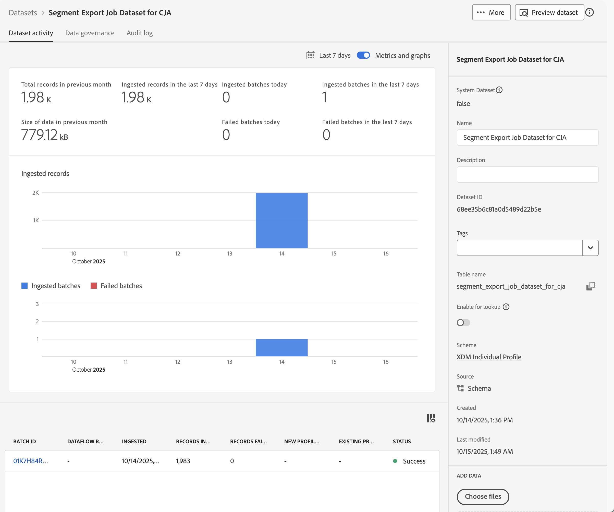
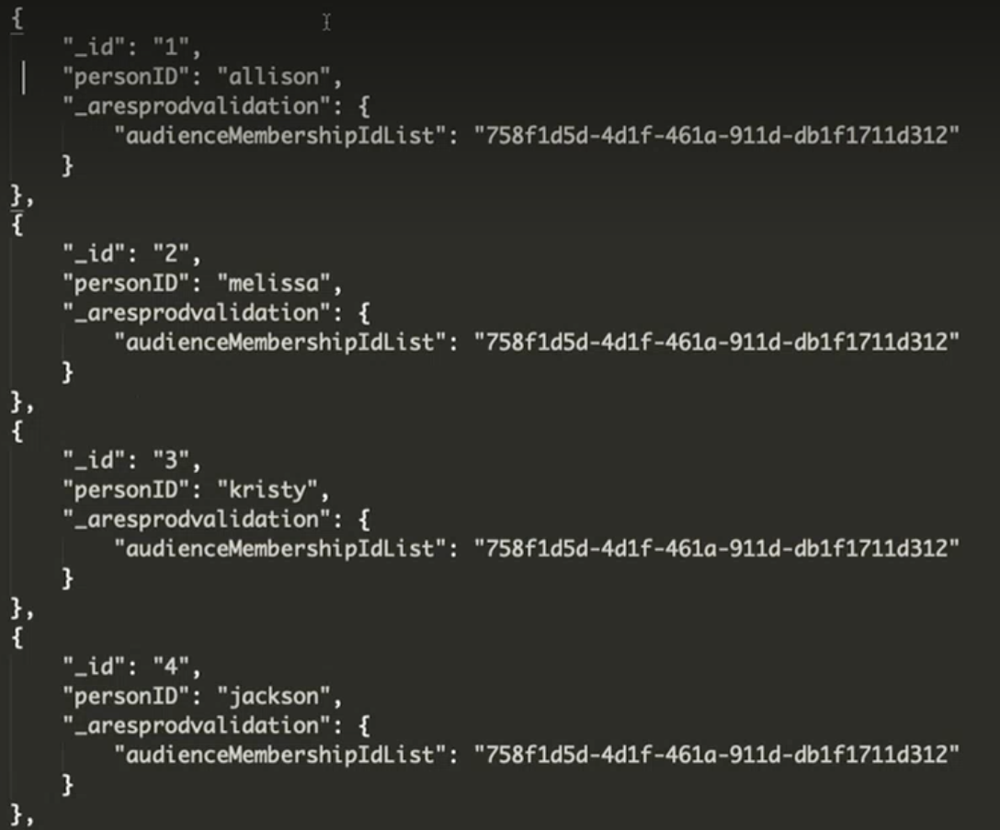

# Experience Platform オーディエンスの取り込みと使用

このユースケースでは、Experience Platform オーディエンスをCustomer Journey Analyticsに取り込む暫定的なソリューションを調査します。 これらのオーディエンスは、Experience Platform セグメントビルダー、Adobe Audience Managerまたはその他のツールで作成され、リアルタイム顧客プロファイルに保存されている可能性があります。 オーディエンスは、プロファイル ID のセットと、該当する属性やイベントなどで構成されています。 そのオーディエンスデータをCustomer Journey Analyticsに取り込んで、さらに分析する必要があります。

## 前提条件

* [Experience Platform](https://experienceleague.adobe.com/ja/docs/experience-platform/access-control/home) （特にリアルタイム顧客プロファイル）にアクセスします。
* Experience Platform[&#x200B; スキーマ &#x200B;](https://experienceleague.adobe.com/ja/docs/experience-platform/xdm/home) および [&#x200B; データセット &#x200B;](https://experienceleague.adobe.com/ja/docs/experience-platform/catalog/datasets/overview) を作成および管理するためのアクセス権。
* [Experience Platform クエリサービス &#x200B;](https://experienceleague.adobe.com/ja/docs/experience-platform/query/home) へのアクセス （および SQL の記述機能）。
* データの一部の変換を実行できるツールへのアクセス。
* Customer Journey Analytics にアクセスします。Customer Journey Analytics接続およびデータビューを作成および変更するには [0&rbrace;Customer Journey Analytics製品管理者である必要があります。](/help/technotes/access-control.md)
* [Experience Platform API （Catalog Service API および Segmentation Service API）の認証とアクセス &#x200B;](https://experienceleague.adobe.com/ja/docs/experience-platform/landing/platform-apis/api-authentication) 組織とサンドボックスの Developer Console でプロジェクトを作成し、API 呼び出しを正常に送信するために必要な情報があることを確認する必要があります。

## 手順

暫定的な解決策には、次の手順が含まれます。

1. [&#x200B; オーディエンスを選択（Experience Platform UI） &#x200B;](#select-audiences)。
1. [&#x200B; プロファイル対応データセットの作成（Experience Platform API） &#x200B;](#create-a-profile-enabled-dataset)。
1. [&#x200B; オーディエンスの書き出し（Experience Platform API） &#x200B;](#export-audiences)。
1. [&#x200B; 出力の変換（Experience Platform UI など） &#x200B;](#transform-the-output)。
1. [&#x200B; スキーマとデータセットを作成します（Experience Platform UI） &#x200B;](#create-a-schema-and-dataset)。
1. [&#x200B; 接続を追加または編集（Customer Journey Analytics UI） &#x200B;](#add-or-edit-a-connection)。
1. [&#x200B; データビューを設定（Customer Journey Analytics UI） &#x200B;](#configure-a-data-view)。
1. [&#x200B; レポートと分析（Customer Journey Analytics UI） &#x200B;](#report-and-analyze)。


### オーディエンスを選択

ソリューションは、まず、Customer Journey Analyticsで取り込むオーディエンスを特定します。

+++ オーディエンスの特定

Experience Platform UI の場合：

1. **[!UICONTROL Customer]**/**[!UICONTROL Audiences]** を選択します。
1. **[!UICONTROL 参照]** を選択して、Customer Journey Analyticsで取り込んで使用するオーディエンスを検索します。 後で使用するために、各オーディエンスの **[!UICONTROL オーディエンス ID]** に注意してください。

   

+++

### プロファイル対応データセットの作成

コアベースの **[!UICONTROL XDM 個人プロファイル]** スキーマに基づいてデータセットを作成する必要があります。 Experience Platform UI でデータセットを作成する場合、そのコアベースの XDM 個人プロファイルをスキーマとして選択することはできません。 代わりに、[Catalog Service API を使用して、](https://experienceleague.adobe.com/ja/docs/experience-platform/catalog/datasets/create#create-a-dataset) スキーマに基づいて `_xdm.context.profile__union` データセットを作成します。

+++ データセットリクエストを作成

#### リクエスト

```shell
curl -X POST \
  'https://platform.adobe.io/data/foundation/catalog/dataSets?requestDataSource=true' \
  -H 'Authorization: Bearer {ACCESS_TOKEN}' \
  -H 'Content-Type: application/json' \
  -H 'x-api-key: {API_KEY}' \
  -H 'x-gw-ims-org-id: {ORG_ID}' \
  -H 'x-sandbox-name: {SANDBOX_NAME}' \
  -d '{
   "name": "{DATASET_NAME}",
   "schemaRef": {
      "id": "_xdm.context.profile__union",
      "contentType": "application/vnd.adobe.xed+json;version=1"
   },
   "fileDescription": {
      "persistet": true,
      "containerFormat": "parquet",
      "format": "parquet"
   }
}'
```

次のとおりです。

* `DATASET_NAME` は、データセットのわかりやすい名前です。 例：`Segment Export Job Dataset for CJA`。

#### 応答

```json
["@/dataSets/{DATASET_ID}"]
```

次のとおりです。

* `DATASET_ID` は、作成されたデータセットのデータセット識別子です。

+++

### オーディエンスを書き出し

選択したオーディエンスを先ほど作成したデータセットに書き出します。 [Segmentation Service API を使用して、オーディエンスをデータセットに送信する書き出しジョブ &#x200B;](https://experienceleague.adobe.com/ja/docs/experience-platform/segmentation/api/export-jobs#create) を作成します。

+++ ジョブリクエストを書き出し

```shell
curl -X POST https://platform.adobe.io/data/core/ups/export/jobs \
 -H 'Authorization: Bearer {ACCESS_TOKEN}' \
 -H 'Content-Type: application/json' \
 -H 'x-gw-ims-org-id: {ORG_ID}' \
 -H 'x-api-key: {API_KEY}' \
 -H 'x-sandbox-name: {SANDBOX_NAME}' \
 -d '{
    "fields": "{COMMA_SEPARATED_LIST_OF_FULLY_QUALIFIED_FIELD_NAMES}",
    "filter": {
        "segments": [
            {
                "segmentId": "{AUDIENCE_ID_1}",
                "segmentNs": "ups",
                "status": [
                    "realized"
                ],
                "segmentId": "{AUDIENCE_ID_2}",
                "segmentNs": "ups",
                "status": [
                    "realized"
                ],
                "segmentId": "{AUDIENCE_ID_3}",
                "segmentNs": "ups",
                "status": [
                    "realized"
                ]             
             }
        ]
    },
    "destination":{
        "datasetId": "{DATASET_ID}",
        "segmentPerBatch": false
    },
    "schema":{
        "name": "_xdm.context.profile"
    }
}'
```

ここで、

* `COMMA_SEPARATED_LIST_OF_FULLY_QUALIFIED_FIELD_NAMES` のようなもので `_demoemea.identification.core.ecid, _demoemea.identification.core.email, _demoemea.identification.core.phoneNumber, person.gender, person.name.firstName, person.name.lastName` ょう。 カスタマージャーニー分析で使用する少なくとも関連するフィールド（ユーザー ID （メール）など）を含めてください。
* 書き出すオーディエンスのオーディエンス識別子は `AUDIENCE_ID_x` のとおりです。
* `DATASET_ID` が作成したデータセットです。


### 応答

```json
{
  "..."
  "id": "{EXPORT_JOB_ID}",
  "..."
}
```

ここで、

* `EXPORT_JOB_ID` は、エクスポートジョブの識別子です。


+++

[Segmentation Service API を使用して、書き出しジョブのステータスを確認 &#x200B;](https://experienceleague.adobe.com/ja/docs/experience-platform/segmentation/api/export-jobs#get) します。

+++ 特定のエクスポートジョブリクエストの取得

#### リクエスト

```shell
curl -X GET https://platform.adobe.io/data/core/ups/export/jobs/{EXPORT_JOB_ID} \
 -H 'Authorization: Bearer {ACCESS_TOKEN}' \
 -H 'x-gw-ims-org-id: {ORG_ID}' \
 -H 'x-api-key: {API_KEY}' \
 -H 'x-sandbox-name: {SANDBOX_NAME}'
```

#### 応答

```json
{
  "..."
  "id": "{EXPORT_JOB_ID}",
  "..."
  "status": "SUCCEEDED",
  "..."
}
```

+++

書き出しジョブが成功したら、データセットに正常に取り込まれたバッチが含まれているかどうかを確認します。

+++ 取り込みステータスの確認

Experience Platform UI の場合：

1. **[!UICONTROL データ管理]**/ **[!UICONTROL データセット]** を選択します。
1. 作成したデータセットを選択します（例：**[!UICONTROL CJAのセグメント書き出しジョブデータセット]**。

   

1. 取り込んだバッチを検証します。 データセットに失敗したバッチが含まれている場合は、**[!UICONTROL データ管理]**/**[!UICONTROL 監視]** を使用して、理由を確認します。 例えば、スキーマに存在しないフィールド名を使用したとします。
1. データセットの **[!UICONTROL テーブル名]** をコピーします。 例：**[!UICONTROL segment_export_job_dataset_for_cja]**。  その名前は、次の手順で使用します。

+++


### 出力の変換

データセットのデータがCustomer Journey Analyticsに対して正しい形式ではありません。 データを変換するには、Experience Platform クエリサービスを使用してデータを取得します。

+++ 書き出されたオーディエンスデータを取得する SQL

Experience Platform クエリサービスに接続する PSQL クライアントを使用します。

Experience Platform UI の場合：

1. **[!UICONTROL データ管理]**/**[!UICONTROL クエリ]** を選択します。
1.  **[!UICONTROL Credentials]** を選択します。

資格情報を使用して、Customer Journey Analytics クエリサービスに接続するように PSQL クライアントを設定します。

#### クエリ

```sql
SELECT ROW_NUMBER() OVER (ORDER BY key)::text as _id, personID, key as audienceMembershipId
FROM (
   SELECT {IDENTITY_TO_USE_AS_PERSON_ID} AS personID, explode(segmentMembership.ups)
   FROM {DATASET_TABLE_NAME}
)
WHERE value.status = 'realized' AND (key = '{AUDIENCE_ID_1}' OR key = 'AUDIENCE_ID_2' OR key = 'AUDIENCE_ID_3')
```

次のとおりです。

* `IDENTITY_TO_USE_AS_PERSON_ID` は、書き出しジョブの一部として定義したフィールドの 1 つです。 例：`_demoemea.identification.core.email`。
* エクスポートジョブの一部として定義したオーディエンスは `AUDIENCE_ID_x` のとおりです。 エクスポートジョブの仕様は行レベルのフィルターなので、これらのオーディエンスをもう一度指定する必要があります。 この行レベルのフィルターは、指定したセグメントのプロファイルと、各プロファイルのすべてのセグメントメンバーシップを返します。


#### 結果

JSON 形式でのクエリ結果は次のようになります。

```json
[
   {
      "_id": "1",
      "personID": "{PERSON_ID_x}",
      "audienceMembershipId": "{AUDIENCE_ID_x}"
   },
   {
      "_id": "2",
      "personID": "PERSON_ID_y",
      "audienceMembershipId": "{AUDIENCE_ID_x}"
   }

]
```

次のとおりです。

* 人物 ID として使用したい識別子の識別子の値を `PERSON_ID_x` します。 例えば、メールを使用する場合は `john.doe@gmail.com` です。
* オーディエンス識別子は `AUDIENCE_ID_x` のとおりです。

+++

この JSON データを変換して環境のテナント名を追加し、オーディエンスにわかりやすい名前を付ける必要があります。

+++ JSON の変換

最終的な JSON は次のようになります。

```json
[
   {
      "_id": "1",
      "personID": "{PERSON_ID_x}",
      "{TENANT_NAME}": {
         "audienceMembershipId": "{AUDIENCE_ID_x}",
         "audienceMembershipName": "{AUDIENCE_FRIENDLY_NAME_x}"
      }
  },
  {
      "_id": "2",
      "personID": "{PERSON_ID_y}",
      "{TENANT_NAME}": {
         "audienceMembershipId": "{AUDIENCE_ID_y}",
         "audienceMembershipName": "{AUDIENCE_FRIENDLY_NAME_y}"
      }
    }
  }

]
```

次のとおりです。

* `TENANT_NAME` はテナントの名前です。 例：`_demoemea`。
* 人物 ID`PERSON_ID_x` して使用する識別子の識別子の値です。 例えば、メールを使用する場合は `john.doe@gmail.com` です。
* オーディエンス識別子は `AUDIENCE_ID_x` のとおりです。
* オーディエンス id には、わかりやすいオーディエンス名を `AUDIENCE_FRIENDLY_NAME_x` します。 例：`Luma - Blue+ Members`。

お気に入りのツールを使用して、元の JSON をこの形式に変換します。

+++


### スキーマとデータセットの作成

変換された JSON を書き出されたオーディエンスデータとしてCustomer Journey Analyticsで使用するには、専用のスキーマを作成する必要があります。

+++ スキーマを作成

スキーマを作成するには：

Experience Platform UI の場合：

1. **[!UICONTROL データ管理]**/ **[!UICONTROL スキーマ]** を選択します。
1. **[!UICONTROL Create schema]** を選択します。 ドロップダウンメニューから **[!UICONTROL 標準]** を選択します。
1. **[!UICONTROL スキーマを作成]** ダイアログで **[!UICONTROL 手動]** を選択し、**[!UICONTROL 選択]** を使用して続行します。
1. **[!UICONTROL スキーマを作成]** ウィザードの **[!UICONTROL クラスを選択]** 手順で、次の操作を行います。
   1. **[!UICONTROL 個人プロファイル]** を選択します。
   1. 「**[!UICONTROL 次へ]**」を選択します。
1. **[!UICONTROL スキーマを作成]** ウィザードの **[!UICONTROL 名前とレビュー]** 手順で、次の操作を行います。
   1. **[!UICONTROL スキーマ表示名]** を入力します。 例：`Audience Export for CJA Schema`。
   1. （オプション）「**[!UICONTROL 説明]**」を入力します。
   1. 「**[!UICONTROL 完了]**」を選択します。
1. **[!UICONTROL audienceMembershipId]** および **[!UICONTROL audienceMembershipName]** という 2 つのフィールドを含むカスタムフィールドグループ（例えば、**[!UICONTROL Audience Membership]**）を含むようにスキーマを設定します。
1. **[!UICONTROL personID]** フィールドが **[!UICONTROL ID]**、**[!UICONTROL プライマリ ID]** であり、I&#x200B;**&#x200B;**&#x200B;[!UICONTROL dentity 名前空間]&#x200B;**&#x200B;**&#x200B;として [!UICONTROL &#x200B; メール &#x200B;] を持っていることを確認します。

   

1. **[!UICONTROL 適用]** すべての変更。 「**[!UICONTROL 保存]**」を選択してスキーマを保存します。

+++

データセットを作成し、そのデータセットを使用して、変換後の JSON データを取り込みます。

+++ データセットの作成とデータの取り込み

Experience Platform UI の場合：

1. **[!UICONTROL データ管理]**/ **[!UICONTROL データセット]** を選択します。
1. **[!UICONTROL データセットを作成]** を選択します。
1. 「**[!UICONTROL スキーマからデータセットを作成]**」をクリックします。
1. **[!UICONTROL スキーマからデータセットを作成]** ウィザードの **[!UICONTROL スキーマを選択]** 手順で、次の操作を行います。
   1. 作成したスキーマを選択します。 例：**[!UICONTROL CJA スキーマのオーディエンスの書き出し]**。
   1. 「**[!UICONTROL 次へ]**」を選択します。
1. **[!UICONTROL スキーマからデータセットを作成]** ウィザードの **[!UICONTROL データセットを設定]** 手順で、次の操作を行います。
   1. データセットの **[!UICONTROL 名前]** を入力します。
   1. （任意）データセットの **[!UICONTROL 説明]** を入力します。
   1. 「**[!UICONTROL 完了]**」を選択します。
1. **[!UICONTROL データセット]**/**[!UICONTROL _データセットの名前_]** で、変換後の JSON データファイルをドラッグし、**[!UICONTROL ファイルをドラッグ&amp;ドロップ]** にドロップします。 このアクションは、書き出された JSON データのデータセットへの取り込みを開始します。
1. 取り込んだバッチを検証します。 データセットに失敗したバッチが含まれている場合は、**[!UICONTROL データ管理]**/**[!UICONTROL 監視]** を使用して、理由を確認します。 例えば、スキーマに存在しないフィールド名を JSON 内で定義したとします。


+++

### 接続の追加または編集

Experience Platformからのオーディエンスデータを含む変換された JSON データが正常に取り込まれたら、Customer Journey Analyticsの新しい接続または既存の接続にデータセットを追加できます。

+++ 接続へのデータセットの追加

Customer Journey Analytics UI で、次の操作を行います。

1. **[!UICONTROL データ管理]**/**[!UICONTROL 接続]** を選択します。
1. 新しい接続を作成/定義 **[!UICONTROL 接続設定]** および **[!UICONTROL データ設定]**。 または、既存の接続を選択し、**[!UICONTROL 接続を編集]** を使用して接続を編集します。
1. **[!UICONTROL Add datasets]** を選択します。
1. 作成し、変換後の JSON データを取り込んだデータセットを選択します。
1. データセットを設定します。 例：

   

1. **[!UICONTROL 保存]** 接続。

+++

### データビューの設定

作成または編集したばかりの接続のデータビューを設定します。

+++ オーディエンスコンポーネントの定義

1. **[!UICONTROL データ管理]**/**[!UICONTROL データビュー]** を選択します。
1. 既存のデータビューを編集するか、新しいデータビューを作成します。
1. データビューの **[!UICONTROL コンポーネント]** タブで、**[!UICONTROL オーディエンスメンバーシップ ID]** と **[!UICONTROL オーディエンスメンバーシップ名]** がディメンションコンポーネントとして追加されていることを確認します。

   

1. 「**[!UICONTROL 保存して続行]**」を選択して、データビューを保存します。

+++

### レポートと分析

最後に、Analysis Workspaceを使用して、`audienceMembershipId`、`audienceMembershipIdName`、`personID` などのオーディエンスメンバーシップコンポーネントと共にデータビューを使用する 1 つ以上のパネルで、Experience Platform オーディエンスデータについてレポートします。


<!--

## Step 1: Select audiences in Real-time Customer Profile {#audience}

Experience Platform [Real-time Customer Profile](https://experienceleague.adobe.com/docs/experience-platform/profile/home.html?lang=ja) lets you see a holistic view of each individual customer by combining data from multiple channels, including online, offline, CRM, and third party. 

You likely already have audiences in RTCP that may have come from various sources. Select one or more audiences to ingest into Customer Journey Analytics. For example, WKND Fly Platinum and Gold Fly Club Members.


## Step 2: Create a Profile Union dataset for the export

In order to export the audience to a dataset that you can ingest in Customer Journey Analytics as profiles, create a dataset whose schema is a Profile [Union schema](https://experienceleague.adobe.com/docs/experience-platform/profile/union-schemas/union-schema.html?lang=ja#understanding-union-schemas).

Union schemas are composed of multiple schemas that share the same class and have been enabled for Profile. The union schema enables you to see an amalgamation of all of the fields contained within schemas sharing the same class. Real-time Customer Profile uses the union schema to create a holistic view of each individual customer.

## Step 3: Export an audience to the Profile Union dataset via API call {#export}

Before you can bring an audience into Customer Journey Analytics, you need to export it to an Adobe Experience Platform dataset. This can only be done using the Segmentation API, and specifically the [Export Jobs API Endpoint](https://experienceleague.adobe.com/docs/experience-platform/segmentation/api/export-jobs.html?lang=ja). 

You can create an export job using the audience ID of your choice, and put the results in the Profile Union Adobe Experience Platform dataset you created in Step 2. Although you can export various attributes/events for the audience, you only need to export the specific profile ID field that matches the person ID field used in the Customer Journey Analytics connection you will be leveraging (see below in Step 5).

## Step 4: Edit the export output 

The results of the export job need to be transformed into a separate Profile dataset in order to be ingested into Customer Journey Analytics.  This transformation can be done with [Adobe Experience Platform Query Service](https://experienceleague.adobe.com/docs/experience-platform/query/home.html?lang=ja), or another transformation tool of your choice. We only need the Profile ID (that will match the Person ID in Customer Journey Analytics) and one or more audience ID(s) to do the reporting in Customer Journey Analytics.

The standard export job, however, contains more data and so we need to edit this output to remove extraneous data, as well as move some things around.  Also, you need to create a schema/dataset first before you add the transformed data to it.

Here is an example of the export output in the Profile union dataset, **before** any editing:


Note the following:

* The audience ID is contained under `segmentmembership.ups.xxxxxxxx-xxxx-xxxx-xxxx-xxxxxxxxxxxx.status`.
* The status has to be "realized", or "entered", but not "exited".

This is the format of the Profile dataset that you can send into Customer Journey Analytics.



Here are the data elements that need to be present:

* `_aresprodvalidation` string field: Refers to your Organization ID. Yours will be different.
* `personID` string field: This is the standard XDM schema field on Profile datasets to identity the person. Use the Profile ID from the export.
* `audienceMembershipId` string field: The audience ID from the export.  NOTE: This field can be named whatever you want (from your own schema).
* Add a friendly name for the audience (`audienceMembershipIdName`), such as

   
   
* Add other audience metadata if you desire.

## Step 5: Add this Profile dataset to an existing connection in Customer Journey Analytics

You could [create a new connection](/help/connections/create-connection.md), but most customers will want to add the Profile dataset to an existing connection. The audience IDs "enrich" the existing data in Customer Journey Analytics.

## Step 6: Modify existing (or create new) Customer Journey Analytics data view

Add `audienceMembershipId`, `audienceMembershipIdName` and `personID` to the data view.

## Step 7: Report in Workspace

You can now report on `audienceMembershipId`, `audienceMembershipIdName` and `personID` in Workspace.

-->


## 追加情報

* このプロセスは、定期的に実行して、Customer Journey Analytics内でオーディエンスデータが常に更新されるようにする必要があります。
* 1 つのCustomer Journey Analytics接続内で複数のオーディエンスを読み込むことができます。 これは、プロセスがさらに複雑になりますが、可能です。これを機能させるには、前述のプロセスに少し修正を加える必要があります。
   1. RTCP 内のオーディエンスコレクションの目的の各オーディエンスに対して、このプロセスを実行します。
   1. Customer Journey Analyticsは、プロファイルデータセットの配列/オブジェクト配列をサポートします。 [&#x200B; または &#x200B;](https://experienceleague.adobe.com/docs/analytics-platform/using/cja-usecases/complex-data/object-arrays.html?lang=ja) に対して `audienceMembershipId` オブジェクトの配列 `audienceMembershipIdName` を使用するのが最適なオプションです。
   1. データビューで、`audienceMembershipId` フィールドの部分文字列変換を使用して、新しいディメンションを作成し、コンマ区切り値の文字列を配列に変換します。メモ：現在、配列の値は 10 個までという制限があります。
   1. Customer Journey Analytics Workspace内で、この新しいディメンション `audienceMembershipIds` についてレポートできるようになりました。
