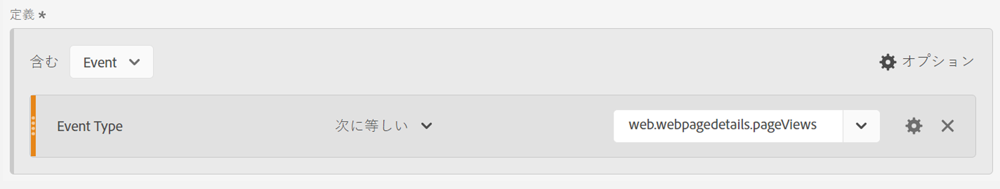
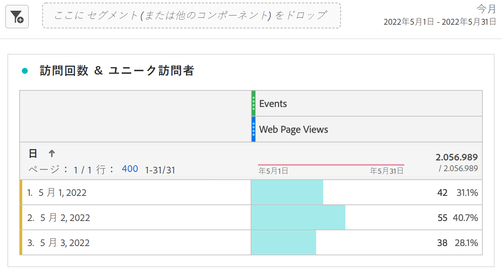
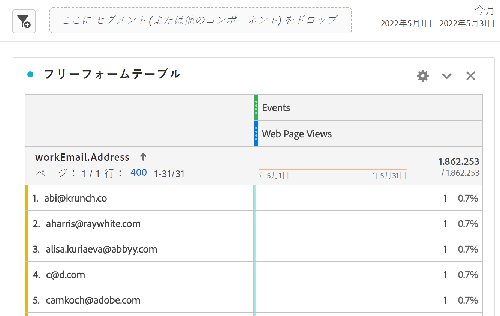

# Marketo Engage データの AEP への取り込みと CJA でのレポート

Adobe Experience Platform（AEP）で新しく使用できるようになった Marketo Engage データセットを活用して、B2B マーケターに価値ある分析およびレポートソリューションを提供できます。次に、Customer Journey Analytics（CJA）で、これらのデータセットについてレポートします。

## 手順 1： Marketo ソースデータフィールドの XDM ターゲットへのマッピング

[人物](https://experienceleague.adobe.com/docs/experience-platform/sources/connectors/adobe-applications/mapping/marketo.html?lang=ja#persons)および[アクティビティ](https://experienceleague.adobe.com/docs/experience-platform/sources/connectors/adobe-applications/mapping/marketo.html?lang=ja#activities)オブジェクトを、対応する XDM スキーマのターゲットフィールドにマッピングします。

## 手順 2：Marketo データの AEP への取り込み

[Marketo Engage コネクタ](https://experienceleague.adobe.com/docs/experience-platform/sources/connectors/adobe-applications/marketo/marketo.html?lang=ja)を使用して、Marketo から Experience Platform にデータを取り込み、プラットフォームに接続したアプリケーションを使用してこのデータを最新に維持します。

## 手順 3： CJA でのこのデータセットへの接続の設定

Experience Platform データセットに関するレポートを作成するには、まず Experience Platform と CJA のデータセット間で接続を確立する必要があります。詳しくは、[接続の作成](https://experienceleague.adobe.com/docs/analytics-platform/using/cja-connections/create-connection.html?lang=ja)を参照してください。

## 手順 4： 1 つ以上のデータビューの作成

[データビュー](/help/data-views/data-views.md)は、Customer Journey Analytics に特有のコンテナで、接続からデータを解釈する方法を決定できます。Analysis Workspace で使用可能なすべてのディメンションおよび指標（この場合、Marketo に特有の指標およびディメンション）を指定します。また、それらのディメンションや指標がどの列からデータを取得するかも指定します。データビューは、Analysis Workspace でのレポート作成の準備の際に定義します。

## 手順 5：Analysis Workspace でのレポート

1 つのユースケースとして、2020年4月～6月のリードによる web ページ訪問数を検討してみます。

1. [Analytics Workspace](/help/analysis-workspace/home.md) を開いて、新しいプロジェクトを作成します。B2B／B2P CDP のお客様は、CJA で B2C スタイルの分析を実施できます。B2B オブジェクトは、まだ使用できません。

1. 次のように、web ページビューの[フィルター](/help/components/filters/create-filters.md)を作成します。- Event Type = web.webpagedetails.pageViews :

   

1. フリーフォームテーブルで、作成したフィルター（Web ページビュー）を取り込み、月の日付範囲を取り込みます。これにより、毎月のリードによる web ページ訪問数がわかります。

   

1. または、人物キーまたは仕事用メールアドレスのディメンションを取り込みます。これにより、各リードによる web ページ訪問数がわかります。

   
