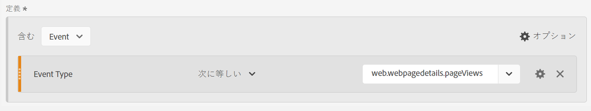
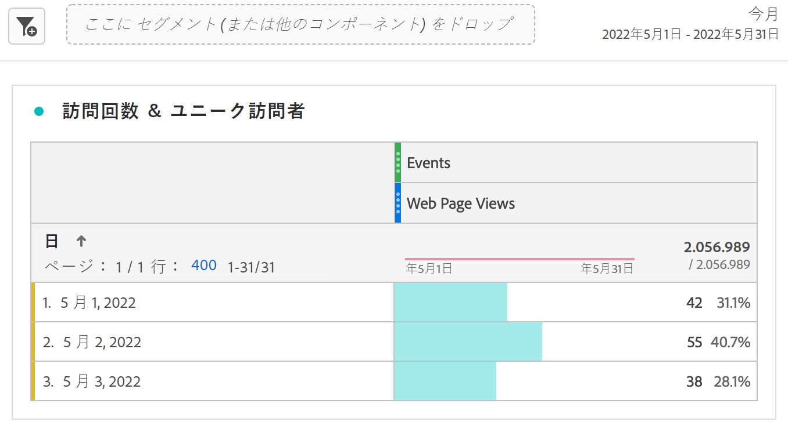
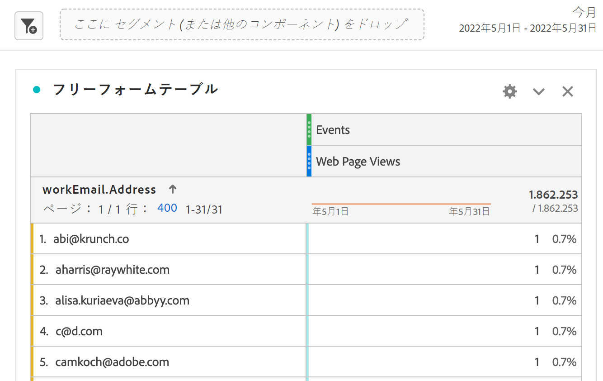

# Marketo Engage データに関するレポート

Experience Platformで利用可能なMarketo Engageデータセットを活用し、B2B マーケターに価値ある分析とレポートソリューションを提供できます。 Customer Journey Analyticsのデータセットでレポートを作成できます。

次の点に注意してください。

* Marketo Engageのレポート機能は、Marketoでのマーケティングプログラムの測定と最適化に最適で、迅速かつ処方しやすく、マーケターにも使いやすい機能です。
* Customer Data Analyticsは、Marketo データを含むがこれに限定されない、複数のチャネル、製品、事業部門にまたがるカスタマージャーニー向けに、より広範でカスタマイズ可能なジャーニーソリューションを提供します。

詳しくは、[&#x200B; レポート比較](#reporting-comparison)を参照してください。

>[!NOTE]
>
>[Customer Journey Analytics B2B edition](/help/getting-started/cja-b2b-edition.md)を検討すると、Marketo Engage データからより多くの価値を得ることができます。 Marketo Engage データセットをアカウントおよびルックアップデータセットと組み合わせることができます。 アカウントレベルと商談レベルに関するレポートを作成できます。
>

Customer Journey AnalyticsのMarketo Engage データについてレポートするには、次の手順に従います。

+++ID戦略を選択

Marketo アクティビティデータをCustomer Journey Analyticsに取り込む場合は、適切なID戦略を選択して、Marketo データをCustomer Journey Analytics データにリンクできるようにする必要があります。

Marketo データにはECIDがネイティブに含まれていませんが、ECID フィールドは、`munchkin.js` ライブラリで収集されるカスタムフィールドとして追加できます。 この追加により、Marketoと既存のCustomer Data Analytics web ジャーニーとの間で共通のIDが作成されます。

MarketoとCustomer Journey Analytics データをリンクするには、関連するデータセットに[&#x200B; グラフベースのステッチング &#x200B;](/help/stitching/gbs.md)を使用します。 実装に基づいて、使用可能なIDをいくつか使用できます。

* Experience Platform ID サービスによって提供されるECID
* 電子メール
* Munchkin ID （Marketo Engageが提供）
* リセラーID
* ダン&amp;ブラッドストリート・ダン#
* Demandbase ID
* （その他の可能性）

グラフベースのステッチングは、次のような点で役立ちます。

* Web イベントに永続的IDを保持します。
* 可能な限り、ID グラフを使用して既知のID （電子メールなど）を解決します。
* 決定論的な一致が存在しない場合、グラフベースの合成は、イベントをドロップするのではなく、永続的なIDにフォールバックします。

グラフベースの合成は、MarketoとCustomer Journey Analyticsのデータをリンクする実行可能なソリューションです。

* Web イベントデータには、すべての行に永続的なID （ECIDなど）があります。
* Marketoのデータには、Munckin ID、ECID、および電子メールを含む信頼性の高いIDが含まれています。
* グラフベースの合成は、ECIDを決定的にMunchkin ID、電子メール、またはMarketo データで使用可能なその他のIDに関連付けます。
* グラフベースの合成では、明示的に設定されたID グラフのリンクルールと名前空間を使用します。

このID戦略を検証するには、制御されたグラフベースのステッチパイロットを実行する必要があります。

1. MarketoでECIDをカスタムフィールドとして追加し、カスタムフィールドをMarketo Engage データ収集用のmunckin.js クライアントサイドのJavaScript コードに追加します。
1. 少なくともMarketo データセットとweb イベントデータセットの両方を含む一時的な顧客ジャーニー接続を設定します。
1. 狭いデータ範囲を定義して、表現可能な限られた量のデータを取り込みます。
1. Workspaceのデータビューとレポートの設定を通じて、結合を検証します。 詳しくは、以下の手順を参照してください。

+++

+++Marketo ソースデータフィールドをXDM ターゲットにマッピングする

[人物](https://experienceleague.adobe.com/ja/docs/experience-platform/sources/connectors/adobe-applications/mapping/marketo)および[アクティビティ](https://experienceleague.adobe.com/ja/docs/experience-platform/sources/connectors/adobe-applications/mapping/marketo)オブジェクトを、対応する XDM スキーマのターゲットフィールドにマッピングします。

+++

+++Adobe Experience PlatformへのMarketo データの取り込み

[Marketo Engage コネクタ &#x200B;](https://experienceleague.adobe.com/ja/docs/experience-platform/sources/connectors/adobe-applications/marketo/marketo)を使用して、MarketoからExperience Platformにデータを取り込み、Experience Platform アプリケーションを使用してこのデータを最新の状態に保ちます。

+++

+++ Customer Journey Analyticsでこのデータセットへの接続を設定する

Experience Platform データセットについてレポートを作成するには、まずExperience PlatformとCustomer Journey Analyticsのデータセット間の接続を確立する必要があります。 [接続の作成または編集](https://experienceleague.adobe.com/ja/docs/analytics-platform/using/cja-connections/create-connection)を参照してください。

+++

+++1つ以上のデータビューを作成する

[データビュー](/help/data-views/data-views.md)は、Customer Journey Analytics に特有のコンテナで、接続からデータを解釈する方法を決定できます。 Analysis Workspace で使用可能なすべてのディメンションおよび指標（この場合、Marketo に特有の指標およびディメンション）を指定します。 また、それらのディメンションや指標がどの列からデータを取得するかも指定します。 データビューは、Analysis Workspace でのレポート作成の準備の際に定義します。

+++ 

+++Analysis Workspaceのレポート

調査したいユースケースのひとつは、「2020年4月から6月にかけて、リードがweb ページにアクセスした回数」です。

1. [Analytics Workspace](/help/analysis-workspace/home.md)を開き、新しいプロジェクトを作成します。
B2B/B2P CDPを導入しているお客様は、Customer Journey AnalyticsでB2C スタイルの分析を実施できます。B2B オブジェクトはまだ使用できません。

1. Web ページビューの[&#x200B; セグメント &#x200B;](/help/components/segments/seg-create.md)を次のように作成します – イベントタイプ = web.webpagedetails.pageViews :

   イベントとイベントタイプを表示する

1. フリーフォームテーブル - Web ページビューに作成したセグメントを取り込み、月日範囲を取り込みます。 このアクションを使用すると、毎月リード数でweb ページへのアクセス数を確認できます。

   

1. または、人物キーまたは仕事用メールアドレスのディメンションを取り込みます。 このアクションは、各リードが訪問したWeb ページを表示します。

   イベントとworkEmail.AddressおよびWeb ページビューを示す

Customer Journey AnalyticsのMarketo Engage データは、Marketo Engageのレポートに表示されるものとは異なる場合があります。

+++

## レポートの比較

次に、Customer Journey AnalyticsとMarketo Engageのレポート機能の比較を示します。ここでは、分析機能、柔軟性、信頼できる唯一の情報源、ユースケースにおける重要な違いを解説します。

### Customer Journey Analytics

Customer Journey Analyticsは、Adobe Experience Platform上に構築された高度なクロスチャネル分析ツールです。 Customer Journey Analyticsは、デジタルおよびオフラインのデータソースをまたいで、強力で柔軟でカスタマイズ可能なレポートを必要とする企業向けに設計されています。

#### 主な機能

* **データソース**：複数のデータセット（web、CRM、電子メール、コールセンター、オフライン、Marketoなど）を組み合わせることができます 包括的なカスタマージャーニーレポートを作成できます。
* **セルフサービス分析**：高度にインタラクティブでカスタマイズ可能なダッシュボードとビジュアライゼーションを備えたドラッグ&amp;ドロップ操作のワークスペース。
* **高度なアトリビューション**: マーケティングプログラムだけでなく、接続されているすべてのデータで、複雑なマルチタッチとカスタムのアトリビューションモデルをサポートします。
* **オーディエンスとパスの分析**：購入者のジャーニー全体にわたる詳細なセグメンテーション、コホート、パスの分析。
* **実用的なインサイト**: データ主導のオーケストレーションを有効にします（例：インサイトをマーケティングまたはパーソナライゼーションエンジンに送り返します）。
* **エンタープライズ規模**：エンタープライズガバナンス、複数ブランド、および大量のデータ量を必要とする組織に適しています。

#### Customer Journey Analyticsの一般的なユースケース

* 複数のチャネルと顧客接点をまたいだ、高度なカスタマージャーニーマッピング。
* オンラインとオフラインのデータを複雑にセグメンテーションし、融合。
* エグゼクティブレベルおよび運用レポート用のカスタム KPI ダッシュボード。
* 包括的なアトリビューションモデリング（デジタルや電子メール以外）。

### Marketo Engage

Marketo Engageは、マーケティングオートメーションのKPI、プログラムとキャンペーンの測定、マーケティングの影響分析に焦点を当てたアプリ内レポートを提供します。 これらのレポートはすべて、Marketoのアクティビティに直接関連付けられています。

#### 主な機能

* **ネイティブマーケティング分析**：電子メール、ランディングページ、キャンペーン、リード、商談、パイプライン、収益のアトリビューションに関する標準レポート（最初、最後、マルチタッチ）。
* **高度なBI分析（アドオン）**：プログラム/アカウント/リードデータを分析するためのドラッグ&amp;ドロップ、ポイント&amp;クリックによるカスタムレポートビルダー（最近の高度なBI分析の概要を参照）。
* **事前構築済みのダッシュボード**：施策のパフォーマンス、チャネルの有効性、パイプライン/収益への貢献度。
* **プログラムとチャネルの分析**:Marketoで管理されているジャーニーに固有のアトリビューションとROI。
* **マーケティングに重点を置く**: メール統計、フォーム、スマートキャンペーン、収益への影響など、マーケティング funnelの透明性を必要とするユーザーに重点を置きます。

#### Marketo Engageの一般的なユースケース

* メール、プログラム、キャンペーンのパフォーマンスを追跡および最適化。
* リードとパイプラインをマーケティング戦術に結び付ける。
* エンゲージメントの傾向を監視し、リードをスコアリングできます。
* データエンジニアリングのリソースを使用せずに、セールス/マーケティングチームとインサイトを共有できます。
* マーケターが使いやすいすぐに使えるレポート。

Marketo EngageとCustomer Journey Analytics間のレポート機能に関する簡単な比較表については、以下を参照してください。

| 機能 | Marketo Engage | Customer Journey Analytics |
|---|---|---|
| **プライマリの焦点** | マーケティングプログラムとキャンペーン中心のレポート： | 包括的なオムニチャネルジャーニーと行動分析およびレポート： |
| **データソース** | Marketo Engage内および経由で生成されたデータ。 | Marketo、web サイト、モバイルアプリ、オフラインチャネルなど、Experience Platformに対応したあらゆるデータを結合できます。 |
| **アトリビューション** | Marketoデータを活用したシングルおよびマルチタッチアトリビューション。 | ソリューション内で利用可能なあらゆるデータにもとづく、カスタムのクロスチャネルアトリビューション。 |
| **カスタムレポートと柔軟性** | プログラムとアカウントを詳細に分析する高度なBI （アドオン）機能。 | 利用可能なあらゆるデータを使用して、カスタムワークスペース、ダッシュボード、レポートを構築する方法に柔軟性があります。 |
| **オーディエンス分析** | プログラムリスト、エンゲージメント、スマートリストにフィルターを適用してセグメント化できます。 | 豊富なペルソナやジャーニーの可視化、オーディエンスのパス、セグメントの重複分析。 |
| **対象ユーザー** | マーケター、マーケティングオペレーター、デマンドジェネレーションワーカー、レベニューオフィサー。 | アナリスト、データサイエンティスト、マーケティングストラテジスト、顧客体験の専門家。 |
| **指標の重複排除** | メールパフォーマンスレポートの場合、指標はリード ID、キャンペーン ID、メールアセット IDによって自動的に重複が排除されます。 同じメールアセットから複数のメールが作成され、同じプログラムから同じリードに送信される場合、これらのメールはひとつとしてのみカウントされます。 | 追加のフィルターと指標が適用されていない場合、メールレポートのデータは、[指標の重複排除](/help/data-views/component-settings/metric-deduplication.md)のないメールパフォーマンスの合計数としてレポートされます。 |

{style="table-layout:fixed"}
