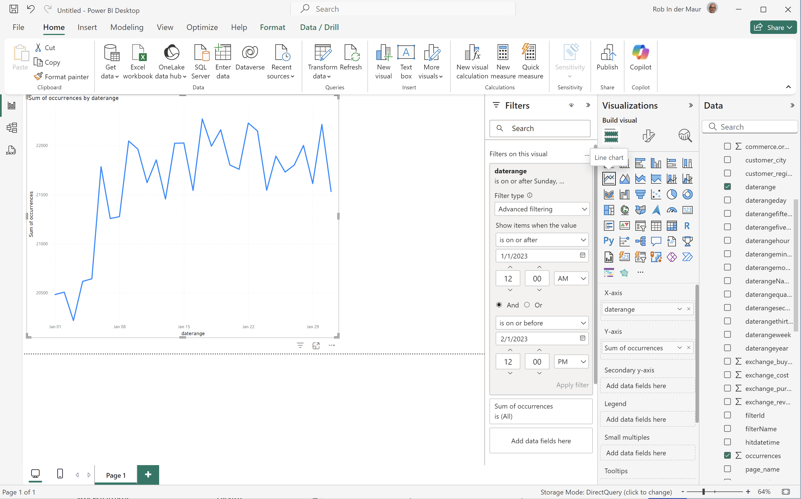
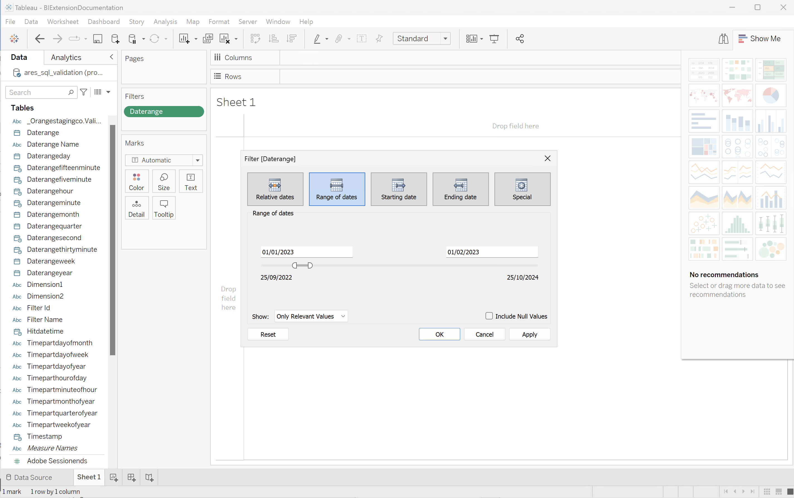

# BI 拡張機能のユースケース

この記事では、様々な BI ツールで BI 拡張機能の機能を使用する方法を説明するユースケースを多数紹介します。

次のユースケースについて説明します。

1. [ データビューの接続とリスト ](#connect-and-list-data-views)。
1. [ 毎日のトレンド ](#daily-trend)。
1. [ 時間別トレンド ](#hourly-trend)。
1. [ 月間トレンド ](#monthly-trend)。
1. [ ランク付けされた単一のディメンション ](#single-dimension-ranked)。
1. [ 複数のディメンションがランク付けされました ](#multiple-dimension-ranked)。
1. [ 個別ディメンション値をカウント ](#count-distinct-dimension-values)。
1. [ 日付範囲名を使用してフィルター ](#use-date-range-names-to-filter)。
1. [ フィルター名を使用してフィルタリングします ](#use-filter-names-to-filter)。
1. [ ディメンション値を使用してフィルター ](#use-dimension-values-to-filter)。
1. [ ソート ](#sort)。
1. [ 制限 ](#limits)。
1. [FLATTEN か NOT](#to-flatten-or-not)。
1. [Dimensionと指標の変換 ](#dimension-and-metric-transformations).
1. [ ビジュアライゼーションとインタラクション ](#visualizations-and-interactions).

ユースケースごとに、「**詳細**」セクション内の次の BI ツールの手順を参照できます。

* Power BIデスクトップ（バージョン 2.136.1478.0 64 ビット（2024 年 9 月））
* Tableau Desktop （バージョン 2022.3.5 （20223.23..0310） 64 ビット）

これらの手順では、**[!UICONTROL public.ares_sql_validation]** という名前のデータビューの例、2 つのディメンション（**[!UICONTROL 製品名]** と **[!UICONTROL 製品カテゴリ]**）の例、2 つの指標（**[!UICONTROL 購入]** と **[!UICONTROL 購入収益]**）の例について説明しています。 手順を実行する際は、必要に応じて特定の環境に合わせてこれらのサンプルオブジェクトを変更します。

## データビューの接続とリスト表示

このユースケースでは、BI ツールからCustomer Journey Analyticsへの接続を設定し、接続を正常にテストするために使用可能なデータビューを一覧表示します。

+++ 詳細

>[!BEGINTABS]

>[!TAB Power BI デスクトップ ]

1. Experience Platformクエリサービス UI から必要な資格情報とパラメーターにアクセスします。

   1. Experience Platform用サンドボックスに移動します。
   1. 左パネルから **[!UICONTROL クエリ]** を選択します。
   1. **[!UICONTROL クエリ]** インターフェイスの「**[!UICONTROL 資格情報]**」タブを選択します。
   1. **[!UICONTROL データベース]** ドロップダウンメニューから「`prod:cja`」を選択します。

      

1. Power BI デスクトップを開きます。
1. メインインターフェイスから、「**[!UICONTROL 他のソースからデータを取得]**」を選択します。
1. **[!UICONTROL データを取得]** ダイアログで、次の手順を実行します。
   
   1. **[!UICONTROL PostgreSQL データベース]** を検索して選択します。
   1. **[!UICONTROL 接続]** を選択します。
1. **[!UICONTROL PostgreSQL データベース]** ダイアログで、次の手順を実行します。
   
   1.  を使用して、Experience Platform **[!UICONTROL クエリ]****[!UICONTROL 有効期限が切れる資格情報]** から **[!UICONTROL Host**[!UICONTROL  および ]**Port]** の値をコピーして貼り付けます。**[!UICONTROL Server]** の値として `:` で区切ってください。 例：`examplecompany.platform-query.adobe.io:80`。
   1.  を使用して、**[!UICONTROL Database]** 値をExperience Platformからコピーして貼り付けます **[!UICONTROL クエリ]** **[!UICONTROL 有効期限が切れる資格情報]**。 貼り付ける値に `?FLATTEN` を追加します。 例：`prod:cja?FLATTEN`。
   1. **[!UICONTROL Data connectivity mode]** として [!UICONTROL DirectQuery] を選択します。
   1. **[!UICONTROL OK]** を選択します。
1. **[!UICONTROL PostgreSQL データベース]** - **[!UICONTROL データベース]** ダイアログで、
   
   1.  を使用して、**[!UICONTROL ユーザー名]** および **[!UICONTROL パスワード**[!UICONTROL  フィールドのExperience Platform ]**クエリ]****[!UICONTROL 有効期限が切れる資格情報]** パネルの **[!UICONTROL ユーザー名]** および **[!UICONTROL パスワード]** の値をコピーします。 [ 有効期限のない認証情報 ](https://experienceleague.adobe.com/en/docs/experience-platform/query/ui/credentials?lang=en#use-credential-to-connect) を使用している場合は、有効期限のない認証情報のパスワードを使用します。
   1. **[!UICONTROL これらの設定を適用するレベルを選択]** のドロップダウンメニューが、前に定義した **[!UICONTROL サーバー]** に設定されていることを確認します。
   1. **[!UICONTROL 接続]** を選択します。
1. **[!UICONTROL ナビゲーター]** ダイアログで、データビューが取得されます。 この取得には時間がかかる場合があります。 取得後：
   
   1. 左側のパネルのリストから **[!UICONTROL public.ares_sql_validation]** を選択します。
   1. **[!UICONTROL ロード]** を選択します。
1. しばらくすると、使用可能な指標とディメンションが **[!UICONTROL データ]** パネルに表示されます。
   

>[!TAB Tableau]

1. Experience Platformクエリサービス UI から必要な資格情報とパラメーターにアクセスします。

   1. Experience Platform用サンドボックスに移動します。
   1. 左パネルから **[!UICONTROL クエリ]** を選択します。
   1. **[!UICONTROL クエリ]** インターフェイスの「**[!UICONTROL 資格情報]**」タブを選択します。
   1. **[!UICONTROL データベース]** ドロップダウンメニューから「`prod:cja`」を選択します。

      

1. Tableau を開きます。
1. **[!UICONTROL To a Server]** の下の左パネルから「**[!UICONTROL PostgreSQL]**」を選択します。 使用できない場合は、「**[!UICONTROL その他…]**」を選択し、「**[!UICONTROL インストールされているコネクタ**[!UICONTROL 」から「]**PostgreSQL]**」を選択します。
   
1. **[!UICONTROL PostgreSQL]** ダイアログの **[!UICONTROL 一般]** タブで、次の操作を行います。
   
   1.  を使用して、**[!UICONTROL ホスト]** をExperience Platform **[!UICONTROL クエリ]** **[!UICONTROL 有効期限が切れる資格情報]** から **[!UICONTROL サーバー]** にコピー&amp;ペーストします。
   1.  を使用して、**[!UICONTROL Port]** をExperience Platform **[!UICONTROL クエリ]** **[!UICONTROL 資格情報の有効期限]** から **[!UICONTROL Port]** にコピー&amp;ペーストします。
   1.  を使用して、**[!UICONTROL データベース]** をExperience Platform **[!UICONTROL クエリ]** **[!UICONTROL 資格情報の有効期限]** から **[!UICONTROL データベース]** にコピー&amp;ペーストします。 貼り付ける値に `%3FFLATTEN` を追加します。 例：`prod:cja%3FFLATTEN`。
   1. **[!UICONTROL 認証]** ドロップダウンメニューから **[!UICONTROL ユーザー名とパスワード]** を選択します。
   1.  を使用して、**[!UICONTROL ユーザー名]** をExperience Platform **[!UICONTROL クエリ]** **[!UICONTROL 有効期限が切れる資格情報]** から **[!UICONTROL ユーザー名]** にコピー&amp;ペーストします。
   1.  を使用して、**[!UICONTROL パスワード]** をExperience Platform **[!UICONTROL クエリ]** **[!UICONTROL 資格情報の有効期限]** から **[!UICONTROL パスワード]** にコピー&amp;ペーストします。 [ 有効期限のない認証情報 ](https://experienceleague.adobe.com/en/docs/experience-platform/query/ui/credentials?lang=en#use-credential-to-connect) を使用している場合は、有効期限のない認証情報のパスワードを使用します。
   1. 「**[!UICONTROL SSL が必要]**」が選択されていることを確認します。
   1. 「**[!UICONTROL ログイン]**」を選択します。

   Tableau Desktop が接続を検証している間、**[!UICONTROL 要求の進行状況]** ダイアログが表示されます。
1. メインウィンドウのデータSourceビューの左側のペインには、次のものが表示されます。
   * **[!UICONTROL 接続]** の下の接続名。
   * **[!UICONTROL Database]** の下のデータベースの名前。
   * **[!UICONTROL Table]** の下のテーブルのリスト。
     
   1. **[!UICONTROL ares_sql_validation]** エントリをドラッグし、「テーブルをドラッグ **[!UICONTROL と表示されるメインビューにここにエントリをドロップ]** ます。
1. メインウィンドウに、**[!UICONTROL ares_sql_validation]** データビューの詳細が表示されるようになりました。
   

>[!ENDTABS]

+++

## 毎日のトレンド

このユースケースでは、2023 年 1 月 1 日から 2023 年 1 月 31 日までの毎日の発生件数のトレンドを表示するテーブルとシンプルな線のビジュアライゼーションを表示します。

+++ 詳細

>[!BEGINTABS]

>[!TAB Power BI デスクトップ ]

1. **[!UICONTROL データ]** ペインで、次の操作を行います。
   1. **[!UICONTROL daterangeday]** ディメンションを選択します。
   1. **[!UICONTROL 発生件数]** 指標を選択します。

   当月の発生件数を示すテーブルが表示されます。 視認性を高めるには、テーブルのビジュアライゼーションを拡大します。

1. **[!UICONTROL フィルター]** パネルで、次の操作を行います。

   1. **[!UICONTROL このビジュアルのフィルター]** から **[!UICONTROL daterangeday is （All）]** を選択します。
   1. **[!UICONTROL フィルタータイプ]** として「**[!UICONTROL 詳細フィルタリング]**」を選択します。
   1. フィルターを定義して **[!UICONTROL 値が]** 次の値の場合に項目を表示 **** `1/1/2023` **[!UICONTROL および]** **[!UICONTROL 次の値の前]** `1/2/2023.` を設定します。カレンダーアイコンを使用して、日付を選択して選択できます。
   1. 「**[!UICONTROL フィルターを適用]**」を選択します。

   適用した **[!UICONTROL daterangeday]** フィルターで更新されたテーブルが表示されます。

1. **[!UICONTROL ビジュアライゼーション]** パネルで、

   1. **[!UICONTROL 折れ線グラフ]** ビジュアライゼーションを選択します。

   折れ線グラフビジュアライゼーションは、テーブルと同じデータを使用しながら、テーブルを置き換えます。

   

1. 折れ線グラフのビジュアライゼーションで：

   1.  を選択します。
   1. コンテキストメニューから「**[!UICONTROL テーブルとして表示]**」を選択します。

   メインビューが更新され、折れ線グラフのビジュアライゼーションとテーブルの両方が表示されます。

   

>[!TAB Tableau]

1. 下部にある「**[!UICONTROL シート 1]**」タブを選択して、「**[!UICONTROL データソース]**」から切り替えます。 **[!UICONTROL シート 1]** ビューで、次の操作を行います。
   1. **[!UICONTROL データ]** ペインの **[!UICONTROL テーブル]** リストから **[!UICONTROL Daterange]** エントリをドラッグし、**[!UICONTROL フィルター]** シェルフにドロップします。
   1. **[!UICONTROL フィルターフィールド\[Daterange\]]** ダイアログで **[!UICONTROL 日付範囲]** を選択して **[!UICONTROL 次へ >]** を選択します。
   1. **[!UICONTROL フィルター\[Daterange]]** ダイアログで **[!UICONTROL 日付範囲]** を選択し、`01/01/2023` ～ `01/02/2023` の期間を指定します。

      

   1. **[!UICONTROL データ]** ペインの **[!UICONTROL テーブル]** リストから **[!UICONTROL Daterangeday]** をドラッグ&amp;ドロップし、**[!UICONTROL 列]** の横のフィールドにエントリをドロップします。
      * **[!UICONTROL Daterangeday]** ドロップダウンメニューから **[!UICONTROL Day]** を選択し、値が **[!UICONTROL DAY （Daterangeday）]** に更新されます。
   1. **[!UICONTROL データ]** ペインの **[!UICONTROL テーブル（*メジャー名*）]** リストから **[!UICONTROL 発生件数]** をドラッグ&amp;ドロップし、**[!UICONTROL 行]** の横のフィールドにエントリをドロップします。
      * 値は自動的に **[!UICONTROL SUM （発生件数）]** に変換されます。
   1. ツールバーのドロップダウンメニューから **[!UICONTROL 標準]** を **[!UICONTROL 表示全体]** に変更します。

      シート 1 のビューは次のようになります。

      

1. [**[!UICONTROL シート 1]**] タブの右クリック メニューから **[!UICONTROL 複製]** を選択し、2 番目のシートを作成します。
1. [**[!UICONTROL シート 1]**] タブの右クリック メニューから **[!UICONTROL 名前変更]** を選択して、シートの名前を `Graph` に変更します。
1. **[!UICONTROL シート 1 （2）]** タブの右クリック メニューから **[!UICONTROL 名前変更]** を選択して、シートの名前を `Data` に変更します。
1. **[!UICONTROL データ]** シートが選択されていることを確認します。 データビューで、
   1. 右上の **[!UICONTROL 表示]** を選択し、**[!UICONTROL テキストテーブル]** （左上のビジュアライゼーション）を選択して、データビューのコンテンツをテーブルに変更します。
   1. **[!UICONTROL DAY （Daterangeday）]** を **[!UICONTROL Columns]** から **[!UICONTROL Rows]** にドラッグします。
   1. ツールバーのドロップダウンメニューから **[!UICONTROL 標準]** を **[!UICONTROL 表示全体]** に変更します。

      **[!UICONTROL Day]** ビューは次のようになります。

      

1. **[!UICONTROL ダッシュボード]** タブを選択して、新しい **[!UICONTROL ダッシュボード 1]** ビューを作成します。 **[!UICONTROL ダッシュボード 1]** ビューで、次の操作を行います。
   1. **[!UICONTROL Sheets]** シェルフから **[!UICONTROL Graph]** シートを **[!UICONTROL Dashboard 1]** ビュー（「シートをここにドロップ *」と表示されているビュー* にドラッグ&amp;ドロップします。
   1. **[!UICONTROL データ]** シートを、**[!UICONTROL グラフ]** シートの下にある **[!UICONTROL シート]** シェルフから **[!UICONTROL ダッシュボード 1]** ビューにドラッグ&amp;ドロップします。
   1. ビューで **[!UICONTROL データ]** シートを選択し、**[!UICONTROL ビュー全体]** を **[!UICONTROL 固定幅]** に変更します。

      **[!UICONTROL ダッシュボード 1]** ビューは次のようになります。

      

>[!ENDTABS]

+++

## 毎時トレンド

ユースケースの概要

+++ 詳細

>[!BEGINTABS]

>[!TAB Power BI デスクトップ ]

手順

>[!TAB Tableau]

手順

>[!ENDTABS]

+++

## 月間トレンド

ユースケースの概要

+++ 詳細

>[!BEGINTABS]

>[!TAB Power BI デスクトップ ]

手順

>[!TAB Tableau]

手順

>[!ENDTABS]

+++

## ランク付けされた単一ディメンション

ユースケースの概要

+++ 詳細

>[!BEGINTABS]

>[!TAB Power BI デスクトップ ]

手順

>[!TAB Tableau]

手順

>[!ENDTABS]

+++

## 複数のディメンションのランク

ユースケースの概要

+++ 詳細

>[!BEGINTABS]

>[!TAB Power BI デスクトップ ]

手順

>[!TAB Tableau]

手順

>[!ENDTABS]

+++

## 個別ディメンション値のカウント

ユースケースの概要

+++ 詳細

>[!BEGINTABS]

>[!TAB Power BI デスクトップ ]

手順

>[!TAB Tableau]

手順

>[!ENDTABS]

+++

## 日付範囲名を使用してフィルター

ユースケースの概要

+++ 詳細

>[!BEGINTABS]

>[!TAB Power BI デスクトップ ]

手順

>[!TAB Tableau]

手順

>[!ENDTABS]

+++

## フィルター名を使用したフィルタリング

ユースケースの概要

+++ 詳細

>[!BEGINTABS]

>[!TAB Power BI デスクトップ ]

手順

>[!TAB Tableau]

手順

>[!ENDTABS]

+++

## ディメンション値を使用したフィルタリング

ユースケースの概要

+++ 詳細

>[!BEGINTABS]

>[!TAB Power BI デスクトップ ]

手順

>[!TAB Tableau]

手順

>[!ENDTABS]

+++

## 並べ替え

ユースケースの概要

+++ 詳細

>[!BEGINTABS]

>[!TAB Power BI デスクトップ ]

手順

>[!TAB Tableau]

手順

>[!ENDTABS]

+++

## 制限

ユースケースの概要

+++ 詳細

>[!BEGINTABS]

>[!TAB Power BI デスクトップ ]

手順

>[!TAB Tableau]

手順

>[!ENDTABS]

+++

## FLATTEN か NOT か

ユースケースの概要

+++ 詳細

>[!BEGINTABS]

>[!TAB Power BI デスクトップ ]

手順

>[!TAB Tableau]

手順

>[!ENDTABS]

+++

## Dimensionと指標の変換

ユースケースの概要

+++ 詳細

>[!BEGINTABS]

>[!TAB Power BI デスクトップ ]

手順

>[!TAB Tableau]

手順

>[!ENDTABS]

+++

## ビジュアライゼーションとインタラクション

ユースケースの概要

+++ 詳細

>[!BEGINTABS]

>[!TAB Power BI デスクトップ ]

手順

>[!TAB Tableau]

手順

>[!ENDTABS]

+++

