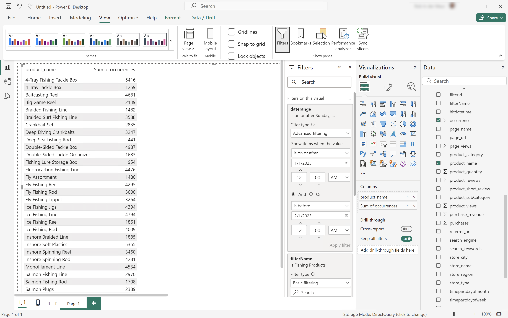

# BI 拡張機能のユースケース

この記事では、Customer Journey Analytics BI 拡張機能を使用して様々なユースケースを達成する方法について説明します。 各ユースケースでは、Customer Journey Analytics機能を説明し、その後でサポートされている各 BI ツールの詳細を説明します。

* **Power BI デスクトップ**。 使用されるバージョンは 2.137.1102.0 64 ビット（2024 年 10 月）です。
* **Tableau Desktop**。 使用されるバージョンは 2024.1.5 （20241.24.0705.0334） 64 ビットです。

次のユースケースについて説明します。

* [データビューの接続とリスト表示](#connect-and-validate)
* [毎日のトレンド](#daily-trend)
* [毎時トレンド](#hourly-trend)
* [月間トレンド](#monthly-trend)
* [ランク付けされた単一ディメンション](#single-dimension-ranked)
* [複数のディメンションのランク](#multiple-dimension-ranked)
* [個別ディメンション値のカウント](#count-distinct-dimension-values)
* [日付範囲名を使用してフィルター](#use-date-range-names-to-filter)
* [フィルター名を使用したフィルタリング](#use-filter-names-to-filter)
* [ディメンション値を使用したフィルタリング](#use-dimension-values-to-filter)
* [並べ替え](#sort)
* [制限](#limits)
* [FLATTEN か NOT か](#to-flatten-or-not)
* [Transformations](#transformations)
* [ビジュアライゼーション](#visualizations)

最初のユースケースは、Customer Journey Analytics BI 拡張機能を使用して BI ツールを接続する方法に重点を置いています。

ユースケース 2 ～ 12 では、現在サポートされている BI ツールで同様のCustomer Journey Analyticsビジュアライゼーションを実行する方法に関する手順が説明されています。

ユースケース 13 ～ 15 では、次の項目の詳細を説明します。

* BI ツールに接続する様々な方法。
* BI ツールを使用してレポートおよび分析を行う場合に発生する変換。
* ビジュアライゼーションのCustomer Journey Analyticsツールと BI ツールの類似点と相違点。


## 接続と検証

このユースケースでは、BI ツールからCustomer Journey Analyticsへの接続を設定し、使用可能なデータビューを一覧表示して、使用するデータビューを選択します。

+++ Customer Journey Analytics

この手順では、次のオブジェクトを持つ環境例を参照しています。

* データビュー：**[!UICONTROL C&amp;C - データビュー]** ??。
* Dimension: **[!UICONTROL 商品名]** ?? and **[!UICONTROL 商品カテゴリ]** ??.
* 指標：**[!UICONTROL 購入売上高]**?？および **[!UICONTROL 購入]**??。
* フィルター：**[!UICONTROL 釣り製品]** ??。


ユースケースを確認したら、これらのサンプルオブジェクトを特定の環境に適したオブジェクトに置き換えます。

+++

+++ BI ツール

>[!BEGINTABS]

>[!TAB Power BI デスクトップ ]

1. Experience Platformクエリサービス UI から必要な資格情報とパラメーターにアクセスします。

   1. Experience Platform用サンドボックスに移動します。
   1. 左パネルから **[!UICONTROL クエリ]** を選択します。
   1. **[!UICONTROL クエリ]** インターフェイスの「**[!UICONTROL 資格情報]**」タブを選択します。
   1. **[!UICONTROL データベース]** ドロップダウンメニューから「`prod:cja`」を選択します。

      

1. Power BI デスクトップを起動します。
   1. メインインターフェイスから、「**[!UICONTROL 他のソースからデータを取得]**」を選択します。
   1. **[!UICONTROL データを取得]** ダイアログで、次の手順を実行します。
      
      1. **[!UICONTROL PostgreSQL データベース]** を検索して選択します。
      1. **[!UICONTROL 接続]** を選択します。
   1. **[!UICONTROL PostgreSQL データベース]** ダイアログで、次の手順を実行します。
      
      1.  を使用して、Experience Platform **[!UICONTROL クエリ]****[!UICONTROL 有効期限が切れる資格情報]** パネルの **[!UICONTROL Host]** と **[!UICONTROL Port]** の値をコピーして貼り付けます。**[!UICONTROL Server]** の値として、`:` で区切ってください。 例：`examplecompany.platform-query.adobe.io:80`。
      1.  を使用して、Experience Platform **[!UICONTROL クエリ]****[!UICONTROL 有効期限が切れる資格情報**[!UICONTROL  パネルから ]**Database]** 値をコピー&amp;ペーストします。 貼り付ける値に `?FLATTEN` を追加します。 例：`prod:cja?FLATTEN`。
      1. **[!UICONTROL Data connectivity mode]** として **[!UICONTROL DirectQuery]** を選択します。
      1. **[!UICONTROL OK]** を選択します。
   1. **[!UICONTROL PostgreSQL データベース]** - **[!UICONTROL データベース]** ダイアログで、
      
      1.  を使用して、**[!UICONTROL ユーザー名]** および **[!UICONTROL パスワード**[!UICONTROL  フィールドのExperience Platform ]**クエリ]****[!UICONTROL 有効期限が切れる資格情報]** パネルの **[!UICONTROL ユーザー名]** および **[!UICONTROL パスワード]** の値をコピーします。 [ 有効期限のない認証情報 ](https://experienceleague.adobe.com/en/docs/experience-platform/query/ui/credentials?lang=en#use-credential-to-connect) を使用している場合は、有効期限のない認証情報のパスワードを使用します。
      1. **[!UICONTROL これらの設定を適用するレベルを選択]** のドロップダウンメニューが、前に定義した **[!UICONTROL サーバー]** に設定されていることを確認します。
      1. **[!UICONTROL 接続]** を選択します。
   1. **[!UICONTROL ナビゲーター]** ダイアログで、データビューが取得されます。 この取得には時間がかかる場合があります。 取得すると、Power BIデスクトップに次のように表示されます。
      
      1. 左パネルのリストから **[!UICONTROL public.cc_data_view]** を選択します。
      1. 次の 2 つのオプションがあります。
         1. **[!UICONTROL 読み込み]** を選択して続行し、設定を完了します。
         1. **[!UICONTROL データを変換]** を選択します。 オプションで設定の一部として変換を適用できるダイアログが表示されます。
            
            * **[!UICONTROL 閉じて適用]** を選択します。
   1. しばらくすると、**[!UICONTROL public.cc_data_view]** が **[!UICONTROL Data]** ペインに表示されます。  を選択して、ディメンションと指標を表示します。
      


>[!TAB Tableau Desktop]

1. Experience Platformクエリサービス UI から必要な資格情報とパラメーターにアクセスします。

   1. Experience Platform用サンドボックスに移動します。
   1. 左パネルから **[!UICONTROL クエリ]** を選択します。
   1. **[!UICONTROL クエリ]** インターフェイスの「**[!UICONTROL 資格情報]**」タブを選択します。
   1. **[!UICONTROL データベース]** ドロップダウンメニューから「`prod:cja`」を選択します。

      

1. Tableau の起動
   1. **[!UICONTROL To a Server]** の下の左パネルから「**[!UICONTROL PostgreSQL]**」を選択します。 使用できない場合は、「**[!UICONTROL その他…]**」を選択し、「**[!UICONTROL インストールされているコネクタ**[!UICONTROL 」から「]**PostgreSQL]**」を選択します。
      
   1. **[!UICONTROL PostgreSQL]** ダイアログの **[!UICONTROL 一般]** タブで、次の操作を行います。
      
      1.  を使用して、Experience Platform **[!UICONTROL クエリ]****[!UICONTROL 有効期限が切れる資格情報**[!UICONTROL  パネルから ]**ホスト]** をコピーして **[!UICONTROL サーバー]** に貼り付けます。
      1.  を使用して、Experience Platform **[!UICONTROL クエリ]****[!UICONTROL 有効期限が切れる資格情報**[!UICONTROL  パネルから ]**Port]** に **[!UICONTROL Port]** をコピー&amp;ペーストします。
      1.  を使用して、Experience Platform **[!UICONTROL クエリ]****[!UICONTROL 有効期限が切れる資格情報]** パネルから **[!UICONTROL データベース]** に **[!UICONTROL データベース]** をコピー&amp;ペーストします。 貼り付ける値に `%3FFLATTEN` を追加します。 例：`prod:cja%3FFLATTEN`。
      1. **[!UICONTROL 認証]** ドロップダウンメニューから **[!UICONTROL ユーザー名とパスワード]** を選択します。
      1.  を使用して、**[!UICONTROL ユーザー名]** をExperience Platform **[!UICONTROL クエリ]** **[!UICONTROL 有効期限が切れる資格情報]** パネルから **[!UICONTROL ユーザー名]** にコピー&amp;ペーストします。
      1.  を使用して、**[!UICONTROL パスワード]** をExperience Platform **[!UICONTROL クエリ]****[!UICONTROL 有効期限が切れる資格情報]** パネルから **[!UICONTROL パスワード]** にコピー&amp;ペーストします。 [ 有効期限のない認証情報 ](https://experienceleague.adobe.com/en/docs/experience-platform/query/ui/credentials?lang=en#use-credential-to-connect) を使用している場合は、有効期限のない認証情報のパスワードを使用します。
      1. 「**[!UICONTROL SSL が必要]**」が選択されていることを確認します。
      1. 「**[!UICONTROL ログイン]**」を選択します。

      Tableau Desktop が接続を検証している間、**[!UICONTROL 要求の進行状況]** ダイアログが表示されます。
   1. メインウィンドウの左側のペインには、「**[!UICONTROL データSource]**」ページが表示されます。
      * **[!UICONTROL 接続]** の下の接続名。
      * **[!UICONTROL Database]** の下のデータベースの名前。
      * **[!UICONTROL Table]** の下のテーブルのリスト。
        
      1. **[!UICONTROL cc_data_view]** エントリをドラッグし、「**[!UICONTROL テーブルをドラッグ]**」と表示されるメインビューにここにエントリをドロップします。
   1. メインウィンドウに、**[!UICONTROL cc_data_view]** データビューの詳細が表示されます。
      

>[!ENDTABS]

+++


## 毎日のトレンド

このユースケースでは、2023 年 1 月 1 日から 2023 年 1 月 31 日までの発生件数（イベント）の毎日のトレンドを表示するテーブルとシンプルな線のビジュアライゼーションを表示します。

+++ Customer Journey Analytics

ユースケースの例 **[!UICONTROL 毎日のトレンド]** パネルを次に示します。


+++

+++ BI ツール

>[!PREREQUISITES]
>
>このユースケースを試す BI ツールの [ 接続に成功した ](#connect-and-validate) 検証され、データビューのリスト作成と使用ができることを確認します。
>

>[!BEGINTABS]

>[!TAB Power BI デスクトップ ]

1. **[!UICONTROL データ]** ペインで、次の操作を行います。
   1. **[!UICONTROL daterangeday]** を選択します。
   1. 「**[!UICONTROL ∑回数]**」を選択します。

   当月の発生件数を示すテーブルが表示されます。 視認性を高めるには、ビジュアライゼーションを拡大します。

1. **[!UICONTROL フィルター]** パネルで、次の操作を行います。

   1. **[!UICONTROL このビジュアルのフィルター]** から **[!UICONTROL daterangeday is （All）]** を選択します。
   1. **[!UICONTROL フィルタータイプ]** として「**[!UICONTROL 詳細フィルタリング]**」を選択します。
   1. フィルターを定義して **[!UICONTROL 値が]** 次の値の場合に項目を表示 **** `1/1/2023` **[!UICONTROL および]** **[!UICONTROL 次の値の前]** `2/1/2023.` を設定します。カレンダーアイコンを使用して、日付を選択して選択できます。
   1. 「**[!UICONTROL フィルターを適用]**」を選択します。

   適用した **[!UICONTROL daterangeday]** フィルターで更新されたテーブルが表示されます。

1. **[!UICONTROL ビジュアライゼーション]** パネルで、**[!UICONTROL 折れ線グラフ]** ビジュアライゼーションを選択します。

   折れ線グラフビジュアライゼーションは、テーブルと同じデータを使用しながら、テーブルを置き換えます。 Power BIデスクトップは次のようになります。

   

1. 折れ線グラフのビジュアライゼーションで：

   1.  を選択します。
   1. コンテキストメニューから「**[!UICONTROL テーブルとして表示]**」を選択します。

   メインビューが更新され、折れ線グラフのビジュアライゼーションとテーブルの両方が表示されます。 Power BIデスクトップは次のようになります。

   

>[!TAB Tableau Desktop]

1. 下部にある「**[!UICONTROL シート 1]**」タブを選択して、「**[!UICONTROL データソース]**」ビューから切り替えます。 **[!UICONTROL シート 1]** ビューで、次の操作を行います。
   1. **[!UICONTROL データ]** ペインの **[!UICONTROL テーブル]** リストから **[!UICONTROL Daterange]** エントリをドラッグし、**[!UICONTROL フィルター]** シェルフにドロップします。
   1. **[!UICONTROL フィルターフィールド\[Daterange\]]** ダイアログで **[!UICONTROL 日付範囲]** を選択して **[!UICONTROL 次へ >]** を選択します。
   1. **[!UICONTROL フィルター\[Daterange]]** ダイアログで **[!UICONTROL 日付範囲]** を選択し、`01/01/2023` ～ `01/02/2023` の期間を指定します。

      

   1. **[!UICONTROL データ]** ペインの **[!UICONTROL テーブル]** リストから **[!UICONTROL Daterangeday]** をドラッグ&amp;ドロップし、**[!UICONTROL 列]** の横のフィールドにエントリをドロップします。
      * **[!UICONTROL Daterangeday]** ドロップダウンメニューから **[!UICONTROL Day]** を選択し、値が **[!UICONTROL DAY （Daterangeday）]** に更新されます。
   1. **[!UICONTROL データ]** ペインの **[!UICONTROL テーブル（*メジャー名*）]** リストから **[!UICONTROL 発生件数]** をドラッグ&amp;ドロップし、**[!UICONTROL 行]** の横のフィールドにエントリをドロップします。
      * 値は自動的に **[!UICONTROL SUM （発生件数）]** に変換されます。
   1. **[!UICONTROL 標準]** を、ツールバーの **[!UICONTROL IUICONTROL フィット]** ドロップダウンメニューから **[ビュー全体]** に変更します。

      Tableau Desktop は次のようになります。

      

1. [**[!UICONTROL シート 1]**] タブの右クリック メニューから **[!UICONTROL 複製]** を選択し、2 番目のシートを作成します。
1. [**[!UICONTROL シート 1]**] タブの右クリック メニューから **[!UICONTROL 名前変更]** を選択して、シートの名前を `Graph` に変更します。
1. **[!UICONTROL シート 1 （2）]** タブの右クリック メニューから **[!UICONTROL 名前変更]** を選択して、シートの名前を `Data` に変更します。
1. **[!UICONTROL データ]** シートが選択されていることを確認します。 **[!UICONTROL データ]** 表示で、次の操作を行います。
   1. 右上の **[!UICONTROL 表示]** を選択し、**[!UICONTROL テキストテーブル]** （左上のビジュアライゼーション）を選択して、データビューのコンテンツをテーブルに変更します。
   1. ツールバーの **[!UICONTROL 行と列を入れ替える]** を選択します。
   1. **[!UICONTROL 標準]** を、ツールバーの **[!UICONTROL IUICONTROL フィット]** ドロップダウンメニューから **[ビュー全体]** に変更します。

      Tableau Desktop は次のようになります。

      

1. 「**[!UICONTROL 新規ダッシュボード]**」タブボタン（下部）を選択して、新しい **[!UICONTROL ダッシュボード 1]** ビューを作成します。 **[!UICONTROL ダッシュボード 1]** ビューで、次の操作を行います。
   1. **[!UICONTROL Sheets]** シェルフから **[!UICONTROL Graph]** シートを **[!UICONTROL Dashboard 1]** ビュー（「シートをここにドロップ *」と表示されているビュー* にドラッグ&amp;ドロップします。
   1. **[!UICONTROL データ]** シートを、**[!UICONTROL グラフ]** シートの下にある **[!UICONTROL シート]** シェルフから **[!UICONTROL ダッシュボード 1]** ビューにドラッグ&amp;ドロップします。
   1. ビューで **[!UICONTROL データ]** シートを選択し、**[!UICONTROL ビュー全体]** を **[!UICONTROL 固定幅]** に変更します。

      Tableau Desktop は次のようになります。

      

>[!ENDTABS]

+++


## 毎時トレンド

このユースケースでは、2023 年 1 月 1 日の発生件数（イベント）の 1 時間ごとのトレンドを表示するテーブルと単純な線のビジュアライゼーションを表示します。

+++ Customer Journey Analytics

ユースケースの例 **[!UICONTROL 時間別トレンド]** パネル：


+++

+++ BI ツール

>[!PREREQUISITES]
>
>このユースケースを試す BI ツールについて、[ 接続に成功し、データビューをリストし、データビューを使用できる ](#connect-and-validate) ことを検証したことを確認します。
>

>[!BEGINTABS]

>[!TAB Power BI デスクトップ ]

 のPower BIは、日時フィールドの処理方法を **理解** ていないので、**[!UICONTROL daterangehour]** や **[!UICONTROL daterangeminute]** などのディメンションはサポートされていません。

>[!TAB Tableau Desktop]

1. 下部にある「**[!UICONTROL シート 1]**」タブを選択して、「**[!UICONTROL データソース]**」から切り替えます。 **[!UICONTROL シート 1]** ビューで、次の操作を行います。
   1. **[!UICONTROL データ]** ペインの **[!UICONTROL テーブル]** リストから **[!UICONTROL Daterange]** エントリをドラッグし、**[!UICONTROL フィルター]** シェルフにドロップします。
   1. **[!UICONTROL フィルターフィールド\[Daterange\]]** ダイアログで **[!UICONTROL 日付範囲]** を選択して **[!UICONTROL 次へ >]** を選択します。
   1. **[!UICONTROL フィルター\[Daterange]]** ダイアログで **[!UICONTROL 日付範囲]** を選択し、`01/01/2023` ～ `02/01/2023` の期間を指定します。

      

   1. **[!UICONTROL データ]** ペインの「**[!UICONTROL テーブル]**」リストから **[!UICONTROL Daterangehour]** をドラッグ&amp;ドロップし、「**[!UICONTROL 列]**」の横のフィールドにエントリをドロップします。
      * **[!UICONTROL Daterangeday]** ドロップダウンメニューから **[!UICONTROL More]** > **[!UICONTROL Hours]** を選択し、値が **[!UICONTROL HOUR （Daterangeday）]** に更新されるようにします。
   1. **[!UICONTROL データ]** ペインの **[!UICONTROL テーブル（*メジャー名*）]** リストから **[!UICONTROL 発生件数]** をドラッグ&amp;ドロップし、**[!UICONTROL 行]** の横のフィールドにエントリをドロップします。
      * 値は自動的に **[!UICONTROL SUM （発生件数）]** に変換されます。
   1. **[!UICONTROL 標準]** を、ツールバーの **[!UICONTROL IUICONTROL フィット]** ドロップダウンメニューから **[ビュー全体]** に変更します。

      Tableau Desktop は次のようになります。

      

1. [**[!UICONTROL シート 1]**] タブの右クリック メニューから **[!UICONTROL 複製]** を選択し、2 番目のシートを作成します。
1. [**[!UICONTROL シート 1]**] タブの右クリック メニューから **[!UICONTROL 名前変更]** を選択して、シートの名前を `Graph` に変更します。
1. **[!UICONTROL シート 1 （2）]** タブの右クリック メニューから **[!UICONTROL 名前変更]** を選択して、シートの名前を `Data` に変更します。
1. **[!UICONTROL データ]** シートが選択されていることを確認します。 **[!UICONTROL データ]** 表示で、次の操作を行います。
   1. 右上の **[!UICONTROL 表示]** を選択し、**[!UICONTROL テキストテーブル]** （左上のビジュアライゼーション）を選択して、データビューのコンテンツをテーブルに変更します。
   1. **[!UICONTROL HOUR （Daterangeday）]** を **[!UICONTROL Columns]** から **[!UICONTROL Rows]** にドラッグします。
   1. **[!UICONTROL 標準]** を、ツールバーの **[!UICONTROL IUICONTROL フィット]** ドロップダウンメニューから **[ビュー全体]** に変更します。

      Tableau Desktop は次のようになります。

      

1. **[!UICONTROL 新規ダッシュボード]**」タブボタン（下部）を選択して、新しい **[!UICONTROL ダッシュボード 1]** ビューを作成します。 **[!UICONTROL ダッシュボード 1]** ビューで、次の操作を行います。
   1. **[!UICONTROL Sheets]** シェルフから **[!UICONTROL Graph]** シートを **[!UICONTROL Dashboard 1]** ビュー（「シートをここにドロップ *」と表示されているビュー* にドラッグ&amp;ドロップします。
   1. **[!UICONTROL データ]** シートを、**[!UICONTROL グラフ]** シートの下にある **[!UICONTROL シート]** シェルフから **[!UICONTROL ダッシュボード 1]** ビューにドラッグ&amp;ドロップします。
   1. ビューで **[!UICONTROL データ]** シートを選択し、**[!UICONTROL ビュー全体]** を **[!UICONTROL 固定幅]** に変更します。

      **[!UICONTROL ダッシュボード 1]** ビューは次のようになります。

      


>[!ENDTABS]

+++


## 月間トレンド

このユースケースでは、2023 年の発生（イベント）の月ごとのトレンドを表示するテーブルとシンプルな線のビジュアライゼーションを表示します。

+++ Customer Journey Analytics

ユースケースの例 **[!UICONTROL 月間トレンド]** パネルを次に示します。


+++

+++ BI ツール

>[!PREREQUISITES]
>
>このユースケースを試す BI ツールについて、[ 接続に成功し、データビューをリストし、データビューを使用できる ](#connect-and-validate) ことを検証したことを確認します。
>

>[!BEGINTABS]

>[!TAB Power BI デスクトップ ]

1. **[!UICONTROL データ]** ペインで、次の操作を行います。
   1. **[!UICONTROL daterangemonth]** を選択します。
   1. 「**[!UICONTROL ∑回数]**」を選択します。

   当月の発生件数を示すテーブルが表示されます。 視認性を高めるには、ビジュアライゼーションを拡大します。

1. **[!UICONTROL フィルター]** パネルで、次の操作を行います。

   1. **[!UICONTROL このビジュアルのフィルター]** から **[!UICONTROL daterangemonth is （All）]** を選択します。
   1. **[!UICONTROL フィルタータイプ]** として「**[!UICONTROL 詳細フィルタリング]**」を選択します。
   1. フィルターを定義して **[!UICONTROL 値が]** 次の値の場合に項目を表示 **** `1/1/2023` **[!UICONTROL および]** **[!UICONTROL 次の値の前]** `1/1/2024.` を設定します。カレンダーアイコンを使用して、日付を選択して選択できます。
   1. 「**[!UICONTROL フィルターを適用]**」を選択します。

   適用した **[!UICONTROL daterangemonth]** フィルターで更新されたテーブルが表示されます。

1. **[!UICONTROL ビジュアライゼーション]** パネルで、

   1. **[!UICONTROL 折れ線グラフ]** ビジュアライゼーションを選択します。

   折れ線グラフビジュアライゼーションは、テーブルと同じデータを使用しながら、テーブルを置き換えます。 Power BIデスクトップは次のようになります。

   

1. 折れ線グラフのビジュアライゼーションで：

   1.  を選択します。
   1. コンテキストメニューから「**[!UICONTROL テーブルとして表示]**」を選択します。

   メインビューが更新され、折れ線グラフのビジュアライゼーションとテーブルの両方が表示されます。 Power BIデスクトップは次のようになります。

   

>[!TAB Tableau Desktop]

1. 下部にある「**[!UICONTROL シート 1]**」タブを選択して、「**[!UICONTROL データソース]**」から切り替えます。 **[!UICONTROL シート 1]** ビューで、次の操作を行います。
   1. **[!UICONTROL データ]** ペインの **[!UICONTROL テーブル]** リストから **[!UICONTROL Daterange]** エントリをドラッグし、**[!UICONTROL フィルター]** シェルフにドロップします。
   1. **[!UICONTROL フィルターフィールド\[Daterange\]]** ダイアログで **[!UICONTROL 日付範囲]** を選択して **[!UICONTROL 次へ >]** を選択します。
   1. **[!UICONTROL フィルター\[Daterange]]** ダイアログで **[!UICONTROL 日付範囲]** を選択し、`01/01/2023` ～ `01/01/2024` の期間を指定します。

      

   1. **[!UICONTROL データ]** ペインの **[!UICONTROL テーブル]** リストから **[!UICONTROL Daterangeday]** をドラッグ&amp;ドロップし、**[!UICONTROL 列]** の横のフィールドにエントリをドロップします。
      * **[!UICONTROL Daterangeday]** ドロップダウンメニューから **[!UICONTROL MONTH]** を選択し、値が **[!UICONTROL MONTH （Daterangeday）]** に更新されるようにします。
   1. **[!UICONTROL データ]** ペインの **[!UICONTROL テーブル（*メジャー名*）]** リストから **[!UICONTROL 発生件数]** をドラッグ&amp;ドロップし、**[!UICONTROL 行]** の横のフィールドにエントリをドロップします。
      * 値は自動的に **[!UICONTROL SUM （発生件数）]** に変換されます。
   1. **[!UICONTROL 標準]** を、ツールバーの **[!UICONTROL IUICONTROL フィット]** ドロップダウンメニューから **[ビュー全体]** に変更します。

      Tableau Desktop は次のようになります。

      

1. [**[!UICONTROL シート 1]**] タブの右クリック メニューから **[!UICONTROL 複製]** を選択し、2 番目のシートを作成します。
1. [**[!UICONTROL シート 1]**] タブの右クリック メニューから **[!UICONTROL 名前変更]** を選択して、シートの名前を `Graph` に変更します。
1. **[!UICONTROL シート 1 （2）]** タブの右クリック メニューから **[!UICONTROL 名前変更]** を選択して、シートの名前を `Data` に変更します。
1. **[!UICONTROL データ]** シートが選択されていることを確認します。 データビューで、
   1. 右上の **[!UICONTROL 表示]** を選択し、**[!UICONTROL テキストテーブル]** （左上のビジュアライゼーション）を選択して、データビューのコンテンツをテーブルに変更します。
   1. **[!UICONTROL MONTH （Daterangeday）]** を **[!UICONTROL Columns]** から **[!UICONTROL Rows]** にドラッグします。
   1. **[!UICONTROL 標準]** を、ツールバーの **[!UICONTROL IUICONTROL フィット]** ドロップダウンメニューから **[ビュー全体]** に変更します。

      Tableau Desktop は次のようになります。

      

1. **[!UICONTROL 新規ダッシュボード]**」タブボタン（下部）を選択して、新しい **[!UICONTROL ダッシュボード 1]** ビューを作成します。 **[!UICONTROL ダッシュボード 1]** ビューで、次の操作を行います。
   1. **[!UICONTROL Sheets]** シェルフから **[!UICONTROL Graph]** シートを **[!UICONTROL Dashboard 1]** ビュー（「シートをここにドロップ *」と表示されているビュー* にドラッグ&amp;ドロップします。
   1. **[!UICONTROL データ]** シートを、**[!UICONTROL グラフ]** シートの下にある **[!UICONTROL シート]** シェルフから **[!UICONTROL ダッシュボード 1]** ビューにドラッグ&amp;ドロップします。
   1. ビューで **[!UICONTROL データ]** シートを選択し、**[!UICONTROL ビュー全体]** を **[!UICONTROL 固定幅]** に変更します。

      Tableau Desktop は次のようになります。

      

>[!ENDTABS]

+++


## ランク付けされた単一ディメンション

このユースケースでは、2023 年を超える製品名の購入および購入売上高を示すテーブルとシンプルな棒ビジュアライゼーションを表示します。

+++ Customer Journey Analytics

このユースケースの例では **[!UICONTROL シングルDimensionランク]** パネルは次のようになります。


+++

+++ BI ツール

>[!PREREQUISITES]
>
>このユースケースを試す BI ツールについて、[ 接続に成功し、データビューをリストし、データビューを使用できる ](#connect-and-validate) ことを検証したことを確認します。
>

>[!BEGINTABS]

>[!TAB Power BI デスクトップ ]

1. **[!UICONTROL データ]** ペインで、次の操作を行います。
   1. **[!UICONTROL daterange]** を選択します。
   1. **[!UICONTROL product_name]** を選択します。
   1. 「**[!UICONTROL ∑ purchase_revenue]**」を選択します。
   1. 「**[!UICONTROL ∑購入]**」を選択します。

   選択した要素の列ヘッダーのみを表示する空のテーブルが表示されます。 視認性を高めるには、ビジュアライゼーションを拡大します。

1. **[!UICONTROL フィルター]** パネルで、次の操作を行います。

   1. **[!UICONTROL このビジュアルのフィルター**[!UICONTROL  から ]**daterange is （すべて）]** を選択します。
   1. **[!UICONTROL フィルタータイプ]** として **[!UICONTROL 相対日付]** を選択します。
   1. フィルターを定義して **[!UICONTROL 値が過去]** **[!UICONTROL 暦年**[!UICONTROL  に含まれる場合に項目を表示 ]**`1` します]**。
   1. 「**[!UICONTROL フィルターを適用]**」を選択します。

   適用した **[!UICONTROL daterange]** フィルターを使用して更新されたテーブルが表示されます。

1. **[!UICONTROL ビジュアライゼーション]** パネルで、

   1.  を使用して **[!UICONTROL Daterange]** を **[!UICONTROL Columns]** から削除します。
   1. **[!UICONTROL 購入の合計]** を **[!UICONTROL 列]** の **[!UICONTROL 購入の合計]** の下にドラッグ&amp;ドロップします。

1. テーブル ビジュアライゼーションで、次の操作を行います。

   1. **[!UICONTROL purchase_revenue の合計]** を選択すると、商品名を降順で並べ替えることができます。 Power BIデスクトップは次のようになります。

   

1. **[!UICONTROL フィルター]** パネルで、次の操作を行います。

   1. **[!UICONTROL product_name is （All）]** を選択します。
   1. **[!UICONTROL フィルタータイプ]** を **[!UICONTROL 上位 N]** に設定します。
   1. フィルターを定義して **[!UICONTROL 項目を表示]****[!UICONTROL 上位]**`10`**[!UICONTROL 値]** にします。
   1. **[!UICONTROL purchase_revenue]** を **[!UICONTROL By value]** **[!UICONTROL ここにデータフィールドを追加]** にドラッグ&amp;ドロップします。
   1. 「**[!UICONTROL フィルターを適用]**」を選択します。

   Analysis Workspaceのフリーフォームテーブルビジュアライゼーションと同期して、購入売上高の値で更新されたテーブルが表示されます。

1. **[!UICONTROL ビジュアライゼーション]** パネルで、

   1. **[!UICONTROL 折れ線グラフおよび積み重ね柱状グラフ]** ビジュアライゼーションを選択します。

   折れ線グラフおよび積み重ね柱状グラフビジュアライゼーションは、テーブルを置き換え、テーブルと同じデータを使用します。

1. **[!UICONTROL 購入]** を **[!UICONTROL ビジュアライゼーション]** ペインの **[!UICONTROL 線の Y 軸]** にドラッグ&amp;ドロップします。

   折れ線グラフと積み重ね柱状グラフが更新されます。 Power BIデスクトップは次のようになります。

   

1. 折れ線グラフおよび積み重ね柱状グラフのビジュアライゼーションで：

   1.  を選択します。
   1. コンテキストメニューから「**[!UICONTROL テーブルとして表示]**」を選択します。

   メインビューが更新され、折れ線グラフのビジュアライゼーションとテーブルの両方が表示されます。

   

>[!TAB Tableau Desktop]

1. 下部にある「**[!UICONTROL シート 1]**」タブを選択して、「**[!UICONTROL データソース]**」から切り替えます。 **[!UICONTROL シート 1]** ビューで、次の操作を行います。
   1. **[!UICONTROL データ]** ペインの **[!UICONTROL テーブル]** リストから **[!UICONTROL Daterange]** エントリをドラッグし、**[!UICONTROL フィルター]** シェルフにドロップします。
   1. **[!UICONTROL フィルターフィールド\[Daterange\]]** ダイアログで **[!UICONTROL 日付範囲]** を選択して **[!UICONTROL 次へ >]** を選択します。
   1. **[!UICONTROL フィルター\[Daterange]]** ダイアログで **[!UICONTROL 日付範囲]** を選択し、`01/01/2023` ～ `31/12/2024` の期間を指定します。 **[!UICONTROL 適用]** および **[!UICONTROL OK]** を選択します。

      

   1. **[!UICONTROL データ]** ペインの **[!UICONTROL テーブル]** リストから **[!UICONTROL 製品名]** をドラッグ&amp;ドロップし、**[!UICONTROL 行]** の横のフィールドにエントリをドロップします。
   1. **[!UICONTROL データ]** ペインの **[!UICONTROL テーブル（*メジャー名*）]** リストから **[!UICONTROL 購入]** をドラッグ&amp;ドロップし、**[!UICONTROL 行]** の横のフィールドにエントリをドロップします。
      * 値は自動的に **[!UICONTROL SUM （Purchases）]** に変換されます。
   1. **[!UICONTROL データ]** ペインの **[!UICONTROL テーブル（*メジャー名*）]** リストから **[!UICONTROL 購入収益]** をドラッグ&amp;ドロップし、**[!UICONTROL 列]** の横のフィールドにエントリをドロップして、**[!UICONTROL SUM （購入）]** から左にドロップします。
      * 値は **[!UICONTROL SUM （Purchase Revenue）]** に自動変換されます。
   1. 両方のグラフを降順で並べ替えるには、**[!UICONTROL 購買収益]** タイトルにポインタを合わせて、並べ替えアイコンを選択します。
   1. グラフのエントリ数を制限するには、「**[!UICONTROL 行**[!UICONTROL 」で「SUM （購入売上高） ]**を選択し、ドロップダウンメニューから]** フィルター **[!UICONTROL を選択し]** す。
   1. **[!UICONTROL フィルター\[Purchase Revenue\]]** ダイアログで **[!UICONTROL 値の範囲]** を選択し、適切な値を入力します。 例：`1,000,000`～`2,000,000` **[!UICONTROL 適用]** および **[!UICONTROL OK]** を選択します。
   1. 2 つの棒グラフを 2 つの組み合わせのグラフに変換するには、「**[!UICONTROL 行**[!UICONTROL 」で「合計 ]**購入）]** を選択し、ドロップダウンメニューから「**[!UICONTROL 二重軸]**」を選択します。 棒グラフは散布図に変換されます。
   1. 散布図を棒グラフに変更するには、次の手順に従います。
      1. **[!UICONTROL マーク]** エリアで **[!UICONTROL SUM （Purchases）]** を選択し、ドロップダウンメニューから **[!UICONTROL ライン]** を選択します。
      1. **[!UICONTROL マーク]** エリアで「**[!UICONTROL SUM （Purchase Revenue）]**」を選択し、ドロップダウンメニューから「**[!UICONTROL バー]**」を選択します。

   Tableau Desktop は次のようになります。

   

1. [**[!UICONTROL シート 1]**] タブの右クリック メニューから **[!UICONTROL 複製]** を選択し、2 番目のシートを作成します。
1. [**[!UICONTROL シート 1]**] タブの右クリック メニューから **[!UICONTROL 名前変更]** を選択して、シートの名前を `Data` に変更します。
1. **[!UICONTROL シート 1 （2）]** タブの右クリック メニューから **[!UICONTROL 名前変更]** を選択して、シートの名前を `Graph` に変更します。
1. **[!UICONTROL データ]** シートが選択されていることを確認します。
   1. 右上の **[!UICONTROL 表示]** を選択し、**[!UICONTROL テキストテーブル]** （左上のビジュアライゼーション）を選択して、2 つのグラフのコンテンツをテーブルに変更します。
   1. 購買収益を降順で並べ替えるには、テーブルの **[!UICONTROL 購買収益]** にポインタを合わせて  を選択します。
   1. **[!UICONTROL 全体表示]** ドロップダウンメニューから **[!UICONTROL 全体表示]** を選択します。

   Tableau Desktop は次のようになります。

   

1. **[!UICONTROL 新規ダッシュボード]**」タブボタン（下部）を選択して、新しい **[!UICONTROL ダッシュボード 1]** ビューを作成します。 **[!UICONTROL ダッシュボード 1]** ビューで、次の操作を行います。
   1. **[!UICONTROL Sheets]** シェルフから **[!UICONTROL Graph]** シートを **[!UICONTROL Dashboard 1]** ビュー（「シートをここにドロップ *」と表示されているビュー* にドラッグ&amp;ドロップします。
   1. **[!UICONTROL データ]** シートを、**[!UICONTROL グラフ]** シートの下にある **[!UICONTROL シート]** シェルフから **[!UICONTROL ダッシュボード 1]** ビューにドラッグ&amp;ドロップします。
   1. ビューで **[!UICONTROL データ]** シートを選択し、**[!UICONTROL ビュー全体]** を **[!UICONTROL 固定幅]** に変更します。

   **[!UICONTROL ダッシュボード 1]** ビューは次のようになります。

   

>[!ENDTABS]

+++


## 複数のディメンションのランク

このユースケースでは、2023 年を超える製品カテゴリ内の製品名について、購入収益と購入を分類したテーブルを表示する必要があります。 その上に、いくつかのビジュアライゼーションを使用して、各製品カテゴリ内での製品カテゴリ分布と製品名の貢献度の両方を示します。

+++ Customer Journey Analytics

ユースケースの例 **[!UICONTROL 複数のDimensionのランク付け]** パネルを次に示します。


+++

+++ BI ツール

>[!PREREQUISITES]
>
>このユースケースを試す BI ツールについて、[ 接続に成功し、データビューをリストし、データビューを使用できる ](#connect-and-validate) ことを検証したことを確認します。
>

>[!BEGINTABS]

>[!TAB Power BI デスクトップ ]

1. 日付範囲をすべてのビジュアライゼーションに確実に適用するには、**[!UICONTROL データ]** パネルから **[!UICONTROL このページのフィルター**[!UICONTROL  に ]**daterangeday]** をドラッグ&amp;ドロップします。
   1. **[!UICONTROL このページのフィルター]** から **[!UICONTROL daterangeday is （すべて）]** を選択します。
   1. **[!UICONTROL フィルタータイプ]** として **[!UICONTROL 相対日付]** を選択します。
   1. フィルターを定義して **[!UICONTROL 値が過去]** **[!UICONTROL 暦年**[!UICONTROL  に含まれる場合に項目を表示 ]**`1` します]**。
   1. 「**[!UICONTROL フィルターを適用]**」を選択します。

1. **[!UICONTROL データ]** ペインで、次の操作を行います。
   1. **[!UICONTROL datarangeday]** を選択します。
   1. **[!UICONTROL product_category]** を選択します。
   1. **[!UICONTROL product_name]** を選択します。
   1. 「**[!UICONTROL ∑ purchase_revenue]**」を選択します。
   1. **[!UICONTROL ∑の購入を選択]**

1. 縦棒グラフをテーブルに変更するには、テーブルが選択されていることを確認し、**[!UICONTROL ビジュアライゼーション]** ペインから **[!UICONTROL マトリックス]** を選択します。
   * **[!UICONTROL product_name]** を **[!UICONTROL 列]** からドラッグし、**[!UICONTROL 行]** の**[!UICONTROL product_categor]**y の下にあるフィールドを **[!UICONTROL ビジュアライゼーション]** ペインにドロップします。

1. テーブル内に表示される製品の数を制限するには、**[!UICONTROL フィルター]** ペインで **[!UICONTROL product_name is （All）]** を選択します。

   1. **[!UICONTROL 詳細フィルター]** を選択します。
   1. **[!UICONTROL フィルタータイプ]****[!UICONTROL 上位 N]****[!UICONTROL 項目を表示]****[!UICONTROL 上位]**`15`**[!UICONTROL 値別]** を選択します。
   1. **[!UICONTROL データ]** ペインから **[!UICONTROL 購入]** を **[!UICONTROL ここにデータフィールドを追加]** にドラッグします。
   1. 「**[!UICONTROL フィルターを適用]**」を選択します。

1. 読みやすくするには、トップメニューから **[!UICONTROL 表示]** を選択し、**[!UICONTROL ページビュー]**/**[!UICONTROL 実際のサイズ]** を選択して、テーブルビジュアライゼーションのサイズを変更します。

1. テーブルの各カテゴリを分類するには、製品カテゴリレベルで **[!UICONTROL +]** を選択します。 Power BIデスクトップは次のようになります。

   

1. 上部のメニューから **[!UICONTROL ホーム]** を選択し、「**[!UICONTROL 新しいビジュアル]** を選択します。 新しいビジュアルがレポートに追加されます。

1. **[!UICONTROL データ]** ペインで、次の操作を行います。
   1. **[!UICONTROL product_category]** を選択します。
   1. **[!UICONTROL product_name]** を選択します。
   1. **[!UICONTROL purchase_revenue]** を選択します。

1. ビジュアルを変更するには、棒グラフを選択し、「**[!UICONTROL ビジュアライゼーション]** パネルから **[!UICONTROL ツリーマップ]** を選択します。
1. **[!UICONTROL product_category]** が **[!UICONTROL Category]** の下にリストされ、**[!UICONTROL product_name]** が **[!UICONTROL ビジュアライゼーション]** ペインの **[!UICONTROL 詳細]** の下にリストされていることを確認します。

   Power BIデスクトップは次のようになります。

   

1. 上部のメニューから **[!UICONTROL ホーム]** を選択し、「**[!UICONTROL 新しいビジュアル]** を選択します。 新しいビジュアルがレポートに追加されます。

1. **[!UICONTROL データ]** ペインで、次の操作を行います。
   1. **[!UICONTROL product_category]** を選択します。
   1. **[!UICONTROL purchase_revenue]** を選択します。
   1. **[!UICONTROL 購入]** を選択します。

1. **[!UICONTROL ビジュアライゼーション]** パネルで、
   1. ビジュアライゼーションを変更するには、**[!UICONTROL 折れ線グラフと積み重ね柱状グラフ]** を選択します。
   1. **[!UICONTROL 列の y 軸]** から **[!UICONTROL 行の y 軸]** に **[!UICONTROL sum_of_purchases]** をドラッグします。

1. レポートで、個々のビジュアライゼーションを再シャッフルします。

   Power BIデスクトップは次のようになります。

   


>[!TAB Tableau Desktop]

1. 下部にある「**[!UICONTROL シート 1]**」タブを選択して、「**[!UICONTROL データソース]**」から切り替えます。 **[!UICONTROL シート 1]** ビューで、次の操作を行います。
   1. **[!UICONTROL データ]** ペインの **[!UICONTROL テーブル]** リストから **[!UICONTROL Daterange]** エントリをドラッグし、**[!UICONTROL フィルター]** シェルフにドロップします。
   1. **[!UICONTROL フィルターフィールド\[Daterange\]]** ダイアログで **[!UICONTROL 日付範囲]** を選択して **[!UICONTROL 次へ >]** を選択します。
   1. **[!UICONTROL フィルター\[Daterange]]** ダイアログで **[!UICONTROL 相対的な日付]** を選択し、**[!UICONTROL 年]** を選択してから **[!UICONTROL 前年]** を指定します。 **[!UICONTROL 適用]** および **[!UICONTROL OK]** を選択します。

      Tableau Desktop は次のようになります。

      

   1. **[!UICONTROL 製品カテゴリ]** をドラッグして、「列 **[!UICONTROL の横にドロップ]** ます。
   1. **[!UICONTROL 購入売上高]** をドラッグし、「行 **[!UICONTROL の横にドロップ]** ます。 値が「**[!UICONTROL SUM （Purchase Revenue）]**」に変わります。
   1. 「購入」をドラッグし、「**[!UICONTROL 行]**」の横にドロップします。 値が **[!UICONTROL SUM （Purchases）]** に変更されます。
   1. **[!UICONTROL SUM （Purchases）]** を選択し、ドロップダウンメニューから **[!UICONTROL Dual Axis]** を選択します。
   1. **[!UICONTROL マーク]** で **[!UICONTROL SUM （Purchases）]** を選択し、ドロップダウンメニューから **[!UICONTROL Line]** を選択します。
   1. **[!UICONTROL マーク]** の **[!UICONTROL SUM （Purchase Revenue）]** を選択し、ドロップダウンメニューから **[!UICONTROL 棒グラフ]** を選択します。
   1. **[!UICONTROL フィット]** メニューから **[!UICONTROL ビュー全体]** を選択します。
   1. グラフの **[!UICONTROL 購買収益]** タイトルを選択し、購買収益が昇順であることを確認します。

      Tableau Desktop は次のようになります。

      

1. 現在の **[!UICONTROL シート 1]** シートの名前を `Category` に変更します。
1. **[!UICONTROL 新規ワークシート]** を選択して新規シートを作成し、名前を `Data` に変更します。

   1. **[!UICONTROL データ]** ペインの **[!UICONTROL テーブル]** リストから **[!UICONTROL Daterange]** エントリをドラッグし、**[!UICONTROL フィルター]** シェルフにドロップします。
   1. **[!UICONTROL フィルターフィールド\[Daterange\]]** ダイアログで **[!UICONTROL 日付範囲]** を選択して **[!UICONTROL 次へ >]** を選択します。
   1. **[!UICONTROL フィルター\[Daterange]]** ダイアログで **[!UICONTROL 相対的な日付]** を選択し、**[!UICONTROL 年]** を選択してから **[!UICONTROL 前年]** を指定します。 **[!UICONTROL 適用]** および **[!UICONTROL OK]** を選択します。
   1. **[!UICONTROL データ]** ペインから **[!UICONTROL 列]** に **[!UICONTROL 購入売上高]** をドラッグします。 値が「**[!UICONTROL SUM （Purchase Revenue）]**」に変わります。
   1. **[!UICONTROL 購入]** を **[!UICONTROL データ]** ペインから **[!UICONTROL 列]** にドラッグし、**[!UICONTROL 購入収益]** の横にドラッグします。 値が **[!UICONTROL SUM （Purchases）]** に変更されます。
   1. **[!UICONTROL 製品カテゴリ]** を **[!UICONTROL データ]** ペインから **[!UICONTROL 行]** にドラッグします。
   1. **[!UICONTROL データ]** ペインから **[!UICONTROL 製品名]** を **[!UICONTROL 行]** にドラッグし、**[!UICONTROL 製品カテゴリ]** の横にドラッグします。
   1. 2 つの横棒をテーブルに変更するには、「**[!UICONTROL 表示]**」から「**[!UICONTROL テキスト表]**」を選択します。
   1. 製品数を制限するには、「**[!UICONTROL 測定値]**」で「**[!UICONTROL 購入]**」を選択します。 ドロップダウンメニューから「**[!UICONTROL フィルター]**」を選択します。
   1. **[!UICONTROL フィルター\[ 購入\]]** ダイアログで **[!UICONTROL 少なくとも]** を選択し、`7000` と入力します。 **[!UICONTROL 適用]** および **[!UICONTROL OK]** を選択します。
   1. **[!UICONTROL フィット]** ドロップダウンメニューから **[!UICONTROL フィット幅]** を選択します。

      Tableau Desktop は次のようになります。

      

1. **[!UICONTROL 新規ワークシート]** を選択して新しいシートを作成し、名前を **[!UICONTROL ツリーマップ]** に変更します。
   1. **[!UICONTROL データ]** ペインの **[!UICONTROL テーブル]** リストから **[!UICONTROL Daterange]** エントリをドラッグし、**[!UICONTROL フィルター]** シェルフにドロップします。
   1. **[!UICONTROL フィルターフィールド\[Daterange\]]** ダイアログで **[!UICONTROL 日付範囲]** を選択して **[!UICONTROL 次へ >]** を選択します。
   1. **[!UICONTROL フィルター\[Daterange]]** ダイアログで **[!UICONTROL 相対的な日付]** を選択し、**[!UICONTROL 年]** を選択してから **[!UICONTROL 前年]** を指定します。 **[!UICONTROL 適用]** および **[!UICONTROL OK]** を選択します。
   1. **[!UICONTROL データ]** ペインから **[!UICONTROL 行]** に **[!UICONTROL 購入売上高]** をドラッグします。 値が「**[!UICONTROL SUM （Purchase Revenue）]**」に変わります。
   1. **[!UICONTROL データ]** ペインから **[!UICONTROL 購入]** を **[!UICONTROL 行]** にドラッグし、**[!UICONTROL 購入収益]** の横にドラッグします。 値が **[!UICONTROL SUM （Purchases）]** に変更されます。
   1. **[!UICONTROL 製品カテゴリ]** を **[!UICONTROL データ]** ペインから **[!UICONTROL 列]** にドラッグします。
   1. **[!UICONTROL 製品名]** を **[!UICONTROL データ]** ペインから **[!UICONTROL 列]** にドラッグします。
   1. 2 つの縦棒グラフをツリーマップに変更するには、「**[!UICONTROL 表示]**」から「**[!UICONTROL ツリーマップ]**」を選択します。
   1. 製品数を制限するには、「**[!UICONTROL 測定値]**」で「**[!UICONTROL 購入]**」を選択します。 ドロップダウンメニューから「**[!UICONTROL フィルター]**」を選択します。
   1. **[!UICONTROL フィルター\[ 購入\]]** ダイアログで **[!UICONTROL 少なくとも]** を選択し、`7000` と入力します。 **[!UICONTROL 適用]** および **[!UICONTROL OK]** を選択します。
   1. **[!UICONTROL フィット]** ドロップダウンメニューから **[!UICONTROL フィット幅]** を選択します。

      Tableau Desktop は次のようになります。

      

1. **[!UICONTROL 新規ダッシュボード]**」タブボタン（下部）を選択して、新しい **[!UICONTROL ダッシュボード 1]** ビューを作成します。 **[!UICONTROL ダッシュボード 1]** ビューで、次の操作を行います。
   1. **[!UICONTROL カテゴリ]** シートを **[!UICONTROL シート]** シェルフから **[!UICONTROL ダッシュボード 1]** ビュー（「シートをここにドロップ *」と表示される* にドラッグ&amp;ドロップします。
   1. **[!UICONTROL ツリーマップ]** シートを **[!UICONTROL カテゴリ]** シートの下にある **[!UICONTROL シート]** シェルフから **[!UICONTROL ダッシュボード 1]** ビューにドラッグ&amp;ドロップします。
   1. **[!UICONTROL ツリーマップ]** シートの下にある **[!UICONTROL シート]** シェルフから **[!UICONTROL データ]** シートを **[!UICONTROL ダッシュボード 1]** ビューにドラッグ&amp;ドロップします。
   1. ビュー内の各シートのサイズを変更します。

   **[!UICONTROL ダッシュボード 1]** ビューは次のようになります。

   

>[!ENDTABS]

+++


## 個別ディメンション値のカウント

2023 年 1 月中にレポートされた製品名のユニーク数を取得したいと考えています。

+++ Customer Journey Analytics

商品名の個別カウントについてレポートするには、**[!UICONTROL タイトル]**`Product Name (Count Distinct)` と **[!UICONTROL 外部 ID]**`product_name_count_distinct` を使用してCustomer Journey Analyticsの計算指標を設定します。


次に、その指標をユースケースの例の **[!UICONTROL 個別Dimension値をカウント]** パネルで使用できます。


+++

+++ BI ツール

>[!PREREQUISITES]
>
>このユースケースを試す BI ツールについて、[ 接続に成功し、データビューをリストし、データビューを使用できる ](#connect-and-validate) ことを検証したことを確認します。
>

>[!BEGINTABS]

>[!TAB Power BI デスクトップ ]

1. 日付範囲をすべてのビジュアライゼーションに確実に適用するには、**[!UICONTROL データ]** パネルからこのページの **[!UICONTROL フィルター]** に **[!UICONTROL daterangeday]** をドラッグ&amp;ドロップします。
   1. **[!UICONTROL このページのフィルター]** から **[!UICONTROL daterangeday is （すべて）]** を選択します。
   1. **[!UICONTROL フィルタータイプ]** として「**[!UICONTROL 詳細フィルタリング]**」を選択します。
   1. **[!UICONTROL 値が次の値の場合に項目を表示]****[!UICONTROL が次の値以上の場合に項目を表示]**`1/1/2023`**[!UICONTROL および]****[!UICONTROL が次の値の前]**`2/1/2023` のフィルターを定義してください。
   1. 「**[!UICONTROL フィルターを適用]**」を選択します。

1. **[!UICONTROL データ]** ペインで、次の操作を行います。
   1. **[!UICONTROL datarangeday]** を選択します。
   1. Customer Journey Analyticsで定義された計算指標である **[!UICONTROL ∑ cm_product_name_count_distinct]** を選択します。

1. 縦棒グラフをテーブルに変更するには、グラフが選択されていることを確認し、**[!UICONTROL ビジュアライゼーション]** ペインから **[!UICONTROL テーブル]** を選択します。

   Power BIデスクトップは次のようになります。

   

1. テーブルビジュアライゼーションを選択します。 コンテキストメニューから **[!UICONTROL コピー]**/**[!UICONTROL ビジュアルをコピー]** を選択します。
1. **[!UICONTROL ctrl+v]** を使用してビジュアライゼーションを貼り付けます。 ビジュアライゼーションの正確なコピーが元のコピーと重なります。 レポート領域で右に移動します。
1. コピーしたビジュアライゼーションをテーブルからカードに変更するには、**[!UICONTROL ビジュアライゼーション]** から **[!UICONTROL カード]** を選択します。

   Power BIデスクトップは次のようになります。

   

>[!TAB Tableau Desktop]

1. 下部にある「**[!UICONTROL シート 1]**」タブを選択して、「**[!UICONTROL データソース]**」から切り替えます。 **[!UICONTROL シート 1]** ビューで、次の操作を行います。
   1. **[!UICONTROL データ]** ペインの **[!UICONTROL テーブル]** リストから **[!UICONTROL Daterange]** エントリをドラッグし、**[!UICONTROL フィルター]** シェルフにドロップします。
   1. **[!UICONTROL フィルターフィールド \[Daterange\]]** ダイアログで **[!UICONTROL 日付範囲]** を選択して **[!UICONTROL 次へ >]** を選択します。
   1. **[!UICONTROL フィルター\[Daterange]]** ダイアログで **[!UICONTROL 日付の範囲]** を選択し、`01/01/2023` - `31/1/2023` を選択します。 **[!UICONTROL 適用]** および **[!UICONTROL OK]** を選択します。
   1. **[!UICONTROL Cm 製品名の個別カウント]** を **[!UICONTROL 行]** にドラッグします。 値が「**[!UICONTROL SUM （Cm Product Name Count Distinct）]**」に変わります。 このフィールドは、Customer Journey Analyticsで定義した計算指標です。
   1. **[!UICONTROL Daterangeday]** をドラッグして、「**[!UICONTROL 列]** の横にドロップします。 **[!UICONTROL Daterangeday]** を選択し、ドロップダウンメニューから **[!UICONTROL Day]** を選択します。
   1. 折れ線グラフのビジュアライゼーションをテーブルに変更するには、「**[!UICONTROL 表示]**」から「**[!UICONTROL テキストテーブル]**」を選択します。
   1. ツールバーの **[!UICONTROL 行と列を入れ替える]** を選択します。
   1. **[!UICONTROL フィット]** ドロップダウンメニューから **[!UICONTROL フィット幅]** を選択します。

      Tableau Desktop は次のようになります。

      

1. [**[!UICONTROL シート 1]**] タブの右クリック メニューから **[!UICONTROL 複製]** を選択し、2 番目のシートを作成します。
1. [**[!UICONTROL シート 1]**] タブの右クリック メニューから **[!UICONTROL 名前変更]** を選択して、シートの名前を `Data` に変更します。
1. **[!UICONTROL シート 1 （2）]** タブの右クリック メニューから **[!UICONTROL 名前変更]** を選択して、シートの名前を `Card` に変更します。

1. **[!UICONTROL カード]** ビューが選択されていることを確認します。
1. 「**[!UICONTROL DAY （Daterangeday）]**」を選択し、ドロップダウンメニューから「**[!UICONTROL 月]**」を選択します。 値が「**[!UICONTROL MONTH （Daterangeday）]**」に変わります。
1. **[!UICONTROL マーク]** の **[!UICONTROL SUM （CM 製品名カウント個別）]** を選択し、ドロップダウンメニューから **[!UICONTROL 形式]** を選択します。
1. フォントサイズを変更するには、**[!UICONTROL Format SUM （CM Product Name Count Distinct）]** ペインで、「**[!UICONTROL デフォルト**[!UICONTROL 」内の「]**フォント]**」を選択し、フォントサイズとして「**[!UICONTROL 72]**」を選択します。
1. 数値を整列するには、「**[!UICONTROL 整列]**」の横にある「**[!UICONTROL 自動]** を選択し、「**[!UICONTROL 水平]** を中央揃えに設定します。
1. 整数を使用するには、「**[!UICONTROL 数値]**」の横の「**[!UICONTROL 123.456]**」を選択し、「**[!UICONTROL 数値（カスタム）]**」を選択します。 **[!UICONTROL 小数点以下の桁数]** を `0` に設定します。

   Tableau Desktop は次のようになります。

   

1. **[!UICONTROL 新規ダッシュボード]**」タブボタン（下部）を選択して、新しい **[!UICONTROL ダッシュボード 1]** ビューを作成します。 **[!UICONTROL ダッシュボード 1]** ビューで、次の操作を行います。
   1. **[!UICONTROL Sheets]** シェルフから **[!UICONTROL Card]** シートを *ここにシートをドロップ* と表示される **[!UICONTROL Dashboard 1]** ビューにドラッグ&amp;ドロップします。
   1. **[!UICONTROL データ]** シートを、**[!UICONTROL カード]** シートの下にある **[!UICONTROL シート]** シェルフから **[!UICONTROL ダッシュボード 1]** ビューにドラッグ&amp;ドロップします。

   **[!UICONTROL ダッシュボード 1]** ビューは次のようになります。

   

>[!ENDTABS]

+++


## 日付範囲名を使用してフィルター

Customer Journey Analyticsで定義した日付範囲を使用して、昨年の発生件数（イベント）をフィルタリングし、レポートする必要があります。

+++ Customer Journey Analytics

日付範囲を使用してレポートを作成するには、Customer Journey Analyticsで日付範囲を **[!UICONTROL タイトル]**`Last Year 2023` を使用して設定します。


次に、使用例の **[!UICONTROL 日付範囲名をフィルターに使用]** パネルでその日付範囲を使用できます。


フリーフォームテーブルのビジュアライゼーションで定義された日付範囲が、パネルに適用される日付範囲をどのように上書きするかに注意してください。

+++

+++ BI ツール

>[!PREREQUISITES]
>
>このユースケースを試す BI ツールについて、[ 接続に成功し、データビューをリストし、データビューを使用できる ](#connect-and-validate) ことを検証したことを確認します。
>

>[!BEGINTABS]

>[!TAB Power BI デスクトップ ]

1. **[!UICONTROL データ]** ペインで、次の操作を行います。
   1. **[!UICONTROL daterangemonth]** を選択します。
   1. **[!UICONTROL daterangeName]** を選択します。
   1. 「**[!UICONTROL ∑回数]**」を選択します。

   **[!UICONTROL このビジュアルのデータ取得エラー]** と表示されるビジュアライゼーションが表示されます。

1. **[!UICONTROL フィルター]** パネルで、次の操作を行います。

   1. **[!UICONTROL このビジュアルのフィルター]** から **[!UICONTROL daterangeName は（すべて）]** を選択します。
   1. **[!UICONTROL フィルタータイプ]** として **[!UICONTROL 基本フィルタリング]** を選択します。
   1. **[!UICONTROL 検索]** フィールドの下で、**[!UICONTROL Last Year 2023]** を選択します。これは、Customer Journey Analyticsで定義した日付範囲の名前です。
   1.  を選択して、**[!UICONTROL daterangeName]** を **[!UICONTROL Columns]** から削除します。

   適用した **[!UICONTROL daterangeName]** フィルターで更新されたテーブルが表示されます。 Power BIデスクトップは次のようになります。

   

>[!TAB Tableau Desktop]

1. 下部にある「**[!UICONTROL シート 1]**」タブを選択して、「**[!UICONTROL データソース]**」から切り替えます。 **[!UICONTROL シート 1]** ビューで、次の操作を行います。
   1. **[!UICONTROL フィルター]** シェルフの **[!UICONTROL テーブル]** リストから **[!UICONTROL Daterange Name]** エントリをドラッグします。
   1. **[!UICONTROL フィルター\[Daterange Name\]]** ダイアログで **[!UICONTROL リストから選択]** が選択されていることを確認し、リストから **[!UICONTROL Last Year 2023]** を選択します。 **[!UICONTROL 適用]** および **[!UICONTROL OK]** を選択します。
   1. **[!UICONTROL Tables]** リストから **[!UICONTROL Daterangemonth]** エントリを **[!UICONTROL Rows]** にドラッグします。 「**[!UICONTROL Daterangemonth]**」を選択し、「**[!UICONTROL 月]**」を選択します。 値が「**[!UICONTROL MONTH （Daterangemonth）]**」に変わります。
   1. **[!UICONTROL テーブル]** リストから **[!UICONTROL 列]** に **[!UICONTROL 発生件数]** エントリをドラッグします。 値が「**[!UICONTROL SUM （発生件数）]**」に変わります。
   1. **[!UICONTROL 表示]** から **[!UICONTROL テキストテーブル]** を選択します。
   1. ツールバーの **[!UICONTROL 行と列を入れ替える]** を選択します。
   1. **[!UICONTROL フィット]** ドロップダウンメニューから **[!UICONTROL フィット幅]** を選択します。

      Tableau Desktop は次のようになります。

      

>[!ENDTABS]

+++


## フィルター名を使用したフィルタリング

2023 年 1 月の商品名と発生件数（イベント）に対するフィルタリングとレポートに、Customer Journey Analyticsで定義した釣り商品カテゴリの既存のフィルターを使用します。

+++ Customer Journey Analytics

Customer Journey Analyticsに使用するフィルターをInspectします。


次に、使用例の **[!UICONTROL 日付範囲名をフィルターに使用]** パネルでそのフィルターを使用できます。


+++

+++ BI ツール

>[!PREREQUISITES]
>
>このユースケースを試す BI ツールについて、[ 接続に成功し、データビューをリストし、データビューを使用できる ](#connect-and-validate) ことを検証したことを確認します。
>

>[!BEGINTABS]

>[!TAB Power BI デスクトップ ]

1. **[!UICONTROL データ]** ペインで、次の操作を行います。
   1. **[!UICONTROL daterange]** を選択します。
   1. **[!UICONTROL filterName]** を選択します。
   1. **[!UICONTROL product_name]** を選択します。
   1. 「**[!UICONTROL ∑回数]**」を選択します。

**[!UICONTROL このビジュアルのデータ取得エラー]** と表示されるビジュアライゼーションが表示されます。

1. **[!UICONTROL フィルター]** パネルで、次の操作を行います。

   1. **[!UICONTROL このビジュアルのフィルター]** から **[!UICONTROL filterName is （All）]** を選択します。
   1. **[!UICONTROL フィルタータイプ]** として **[!UICONTROL 基本フィルタリング]** を選択します。
   1. **[!UICONTROL 検索]** フィールドの下で、**[!UICONTROL 釣り商品]** を選択します。これは、Customer Journey Analyticsで定義されている既存のフィルターの名前です。
   1. **[!UICONTROL このビジュアルのフィルター]** から **[!UICONTROL daterange is （すべて）]** を選択します。
   1. **[!UICONTROL フィルタータイプ]** として「**[!UICONTROL 詳細フィルタリング]**」を選択します。
   1. **[!UICONTROL 値が次の値の場合に項目を表示]****[!UICONTROL が次の値以上の場合に項目を表示]**`1/1/2023`**[!UICONTROL および]****[!UICONTROL が次の値の前]**`2/1/2023` のフィルターを定義してください。
   1.  を選択して、**[!UICONTROL filterName]** を **[!UICONTROL Columns]** から削除します。
   1.  を選択して **[!UICONTROL Daterange]** を **[!UICONTROL Columns]** から削除します。

   適用した **[!UICONTROL filterName]** フィルターで更新されたテーブルが表示されます。 Power BIデスクトップは次のようになります。

   


>[!TAB Tableau Desktop]

1. 下部にある「**[!UICONTROL シート 1]**」タブを選択して、「**[!UICONTROL データソース]**」から切り替えます。 **[!UICONTROL シート 1]** ビューで、次の操作を行います。
   1. **[!UICONTROL フィルター]** シェルフの **[!UICONTROL テーブル]** リストから **[!UICONTROL フィルター名]** エントリをドラッグします。
   1. **[!UICONTROL フィルター\[ フィルター名\]]** ダイアログで **[!UICONTROL リストから選択]** が選択されていることを確認し、リストから **[!UICONTROL 釣り製品]** を選択します。 **[!UICONTROL 適用]** および **[!UICONTROL OK]** を選択します。
   1. **[!UICONTROL フィルター]** シェルフの **[!UICONTROL テーブル]** リストから **[!UICONTROL Daterange]** エントリをドラッグします。
   1. **[!UICONTROL フィルターフィールド \[Daterange\]]** ダイアログで **[!UICONTROL 日付範囲]** を選択して **[!UICONTROL 次へ >]** を選択します。
   1. **[!UICONTROL フィルター\[Daterange]]** ダイアログで **[!UICONTROL 日付の範囲]** を選択し、`01/01/2023` - `01/02/2023` を選択します。 **[!UICONTROL 適用]** および **[!UICONTROL OK]** を選択します。
   1. **[!UICONTROL テーブル]** リストから **[!UICONTROL 製品名]** を **[!UICONTROL 行]** にドラッグします。
   1. **[!UICONTROL テーブル]** リストから **[!UICONTROL 列]** に **[!UICONTROL 発生件数]** エントリをドラッグします。 値が「**[!UICONTROL SUM （発生件数）]**」に変わります。
   1. **[!UICONTROL 表示]** から **[!UICONTROL テキストテーブル]** を選択します。
   1. **[!UICONTROL フィット]** ドロップダウンメニューから **[!UICONTROL フィット幅]** を選択します。

      Tableau Desktop は次のようになります。

      

>[!ENDTABS]

+++


## ディメンション値を使用したフィルタリング

Customer Journey Analyticsで新しいフィルターを作成し、ハンティング商品カテゴリの商品をフィルタリングします。 次に、新しいフィルターを使用して、2023 年 1 月のハンティングカテゴリの商品の製品名と発生件数（イベント）についてレポートします。

+++ Customer Journey Analytics

Customer Journey Analyticsに **[!UICONTROL タイトル]**`Hunting Products` を含む新しいフィルターを作成します。


次に、使用例の **[!UICONTROL Dimension値をフィルターに使用]** パネルでそのフィルターを使用できます。


+++

+++ BI ツール

>[!PREREQUISITES]
>
>このユースケースを試す BI ツールについて、[ 接続に成功し、データビューをリストし、データビューを使用できる ](#connect-and-validate) ことを検証したことを確認します。
>

>[!BEGINTABS]

>[!TAB Power BI デスクトップ ]

1. メニューから **[!UICONTROL ホーム]** を選択し、ツールバーから **[!UICONTROL 更新]** を選択します。 Customer Journey Analyticsで定義した新しいフィルターを取得するには、連携を更新する必要があります。

1. **[!UICONTROL データ]** ペインで、次の操作を行います。
   1. **[!UICONTROL daterange]** を選択します。
   1. **[!UICONTROL filterName]** を選択します。
   1. **[!UICONTROL product_name]** を選択します。
   1. 「**[!UICONTROL ∑回数]**」を選択します。

**[!UICONTROL このビジュアルのデータ取得エラー]** と表示されるビジュアライゼーションが表示されます。

1. **[!UICONTROL フィルター]** パネルで、次の操作を行います。
   1. **[!UICONTROL このビジュアルのフィルター]** から **[!UICONTROL filterName is （All）]** を選択します。
   1. **[!UICONTROL フィルタータイプ]** として **[!UICONTROL 基本フィルタリング]** を選択します。
   1. **[!UICONTROL 検索]** フィールドの下の **[!UICONTROL ハンティング商品]** を選択します。これは、Customer Journey Analyticsで定義されている既存のフィルターの名前です。
   1. **[!UICONTROL このビジュアルのフィルター]** から **[!UICONTROL daterange is （すべて）]** を選択します。
   1. **[!UICONTROL フィルタータイプ]** として「**[!UICONTROL 詳細フィルタリング]**」を選択します。
   1. **[!UICONTROL 値が次の値の場合に項目を表示]****[!UICONTROL が次の値以上の場合に項目を表示]**`1/1/2023`**[!UICONTROL および]****[!UICONTROL が次の値の前]**`2/1/2023` のフィルターを定義してください。
   1.  を選択して、**[!UICONTROL filterName]** を **[!UICONTROL Columns]** から削除します。
   1.  を選択して **[!UICONTROL Daterange]** を **[!UICONTROL Columns]** から削除します。

   適用した **[!UICONTROL filterName]** フィルターで更新されたテーブルが表示されます。 Power BIデスクトップは次のようになります。

   


>[!TAB Tableau Desktop]

1. **[!UICONTROL Data Source]** ビューの **[!UICONTROL Data]** の下で、**[!UICONTROL cc_data_view （prod:cja%3FFLATTEN）]** のコンテキストメニューから **[!UICONTROL 更新]** を選択します。 Customer Journey Analyticsで定義した新しいフィルターを取得するには、連携を更新する必要があります。
1. 下部にある「**[!UICONTROL シート 1]**」タブを選択して、「**[!UICONTROL データソース]**」から切り替えます。 **[!UICONTROL シート 1]** ビューで、次の操作を行います。
   1. **[!UICONTROL フィルター]** シェルフの **[!UICONTROL テーブル]** リストから **[!UICONTROL フィルター名]** エントリをドラッグします。
   1. **[!UICONTROL フィルター\[ フィルター名\]]** ダイアログで **[!UICONTROL リストから選択]** が選択されていることを確認し、リストから **[!UICONTROL ハンティング製品]** を選択します。 **[!UICONTROL 適用]** および **[!UICONTROL OK]** を選択します。
   1. **[!UICONTROL フィルター]** シェルフの **[!UICONTROL テーブル]** リストから **[!UICONTROL Daterange]** エントリをドラッグします。
   1. **[!UICONTROL フィルターフィールド \[Daterange\]]** ダイアログで **[!UICONTROL 日付範囲]** を選択して **[!UICONTROL 次へ >]** を選択します。
   1. **[!UICONTROL フィルター\[Daterange]]** ダイアログで **[!UICONTROL 日付の範囲]** を選択し、`01/01/2023` - `1/2/2023` を選択します。 **[!UICONTROL 適用]** および **[!UICONTROL OK]** を選択します。
   1. **[!UICONTROL テーブル]** リストから **[!UICONTROL 製品名]** を **[!UICONTROL 行]** にドラッグします。
   1. **[!UICONTROL テーブル]** リストから **[!UICONTROL 列]** に **[!UICONTROL 発生件数]** エントリをドラッグします。 値が「**[!UICONTROL SUM （発生件数）]**」に変わります。
   1. **[!UICONTROL 表示]** から **[!UICONTROL テキストテーブル]** を選択します。
   1. **[!UICONTROL フィット]** ドロップダウンメニューから **[!UICONTROL フィット幅]** を選択します。

      Tableau Desktop は次のようになります。

      

>[!ENDTABS]

+++


## 並べ替え

2023 年 1 月の製品名の購入収益と購入を、購入収益の降順に並べ替えてレポートします。

+++ Customer Journey Analytics

このユースケースでは、例えば **[!UICONTROL 並べ替え]** パネルを使用します。


+++

+++ BI ツール

>[!PREREQUISITES]
>
>このユースケースを試す BI ツールについて、[ 接続に成功し、データビューをリストし、データビューを使用できる ](#connect-and-validate) ことを検証したことを確認します。
>

>[!BEGINTABS]

>[!TAB Power BI デスクトップ ]

1. **[!UICONTROL データ]** ペインで、次の操作を行います。
   1. **[!UICONTROL daterange]** を選択します。
   1. **[!UICONTROL product_namr]** を選択します。
   1. 「**[!UICONTROL ∑ purchase_revenue]**」を選択します。
   1. 「**[!UICONTROL ∑購入]**」を選択します。

1. **[!UICONTROL フィルター]** パネルで、次の操作を行います。
   1. **[!UICONTROL このビジュアルのフィルター]** から **[!UICONTROL daterange is （すべて）]** を選択します。
   1. **[!UICONTROL フィルタータイプ]** として「**[!UICONTROL 詳細フィルタリング]**」を選択します。
   1. **[!UICONTROL 値が次の値の場合に項目を表示]****[!UICONTROL が次の値以上の場合に項目を表示]**`1/1/2023`**[!UICONTROL および]****[!UICONTROL が次の値の前]**`2/1/2023` のフィルターを定義してください。

1. ビジュアライゼーション パネルで、次の操作を行います。
   1.  を選択して、Columns から daterange を削除します。
   1. **[!UICONTROL purchase_revenue の合計]** を **[!UICONTROL 列]** 項目の下部にドラッグします。

1. レポートで、「**[!UICONTROL purchase_revenue の合計]** を選択して、購買収益の降順でテーブルをソートします。

   Power BIデスクトップは次のようになります。

   

BI 拡張機能を使用してPower BIデスクトップで実行されるクエリに、`sort` ステートメントが含まれていません。 `sort` ステートメントがないということは、並べ替えがクライアントサイドで実行されることを意味します。

```sql
select "_"."product_name",
    "_"."a0",
    "_"."a1"
from 
(
    select "rows"."product_name" as "product_name",
        sum("rows"."purchases") as "a0",
        sum("rows"."purchase_revenue") as "a1"
    from 
    (
        select "_"."daterangeName",
            "_"."daterange",
            "_"."filterId",
            "_"."filterName",
            "_"."timestamp",
            "_"."affiliate_name",
            "_"."affiliate_url",
            "_"."commerce.order.priceTotal",
            "_"."customer_city",
            "_"."customer_region",
            "_"."daterangeday",
            "_"."daterangefifteenminute",
            "_"."daterangefiveminute",
            "_"."daterangehour",
            "_"."daterangeminute",
            "_"."daterangemonth",
            "_"."daterangequarter",
            "_"."daterangesecond",
            "_"."daterangethirtyminute",
            "_"."daterangeweek",
            "_"."daterangeyear",
            "_"."hitdatetime",
            "_"."page_name",
            "_"."page_url",
            "_"."product_category",
            "_"."product_name",
            "_"."product_short_review",
            "_"."product_subCategory",
            "_"."referrer_url",
            "_"."search_engine",
            "_"."search_keywords",
            "_"."store_city",
            "_"."store_name",
            "_"."store_region",
            "_"."store_type",
            "_"."timepartdayofmonth",
            "_"."timepartdayofweek",
            "_"."timepartdayofyear",
            "_"."timeparthourofday",
            "_"."timepartminuteofhour",
            "_"."timepartmonthofyear",
            "_"."timepartquarterofyear",
            "_"."timepartweekofyear",
            "_"."cm_session_end_rate_defaultmetric",
            "_"."cm_session_person_defaultmetric",
            "_"."cm_session_start_rate_defaultmetric",
            "_"."cm_timespent_person_defaultmetric",
            "_"."cm_timespent_session_defaultmetric",
            "_"."cm_product_name_count_distinct",
            "_"."ad_views",
            "_"."adobe_sessionends",
            "_"."adobe_sessionstarts",
            "_"."adobe_timespent",
            "_"."exchange_buybacks",
            "_"."exchange_cost",
            "_"."exchange_purchases",
            "_"."exchange_revenue",
            "_"."occurrences",
            "_"."page_views",
            "_"."product_quantity",
            "_"."product_reviews",
            "_"."product_views",
            "_"."purchase_revenue",
            "_"."purchases",
            "_"."visitors",
            "_"."visits"
        from "public"."cc_data_view" "_"
        where "_"."daterange" < date '2023-02-01' and "_"."daterange" >= date '2023-01-01'
    ) "rows"
    group by "product_name"
) "_"
where not "_"."a0" is null or not "_"."a1" is null
limit 1000001
```


>[!TAB Tableau Desktop]

1. 下部にある「**[!UICONTROL シート 1]**」タブを選択して、「**[!UICONTROL データソース]**」から切り替えます。 **[!UICONTROL シート 1]** ビューで、次の操作を行います。
   1. **[!UICONTROL フィルター]** シェルフの **[!UICONTROL テーブル]** リストから **[!UICONTROL Daterange]** エントリをドラッグします。
   1. **[!UICONTROL フィルターフィールド \[Daterange\]]** ダイアログで **[!UICONTROL 日付範囲]** を選択して **[!UICONTROL 次へ >]** を選択します。
   1. **[!UICONTROL フィルター\[Daterange]]** ダイアログで **[!UICONTROL 日付の範囲]** を選択し、`01/01/2023` - `1/2/2023` を選択します。 **[!UICONTROL 適用]** および **[!UICONTROL OK]** を選択します。
   1. **[!UICONTROL テーブル]** リストから **[!UICONTROL 製品名]** をドラッグし、**[!UICONTROL 行]** の横のフィールドにエントリをドロップします。
   1. **[!UICONTROL 購入]** エントリを **[!UICONTROL テーブル]** リストから **[!UICONTROL 列]** にドラッグします。 値が **[!UICONTROL SUM （Purchases）]** に変更されます。
   1. **[!UICONTROL テーブル]** リストから **[!UICONTROL 購入売上高]** エントリをドラッグし、**[!UICONTROL 列]** の横のフィールド、**[!UICONTROL SUM （購入）]** の横のエントリをドロップします。 値が「**[!UICONTROL SUM （Purchase Revenue）]**」に変わります。
   1. **[!UICONTROL 表示]** から **[!UICONTROL テキストテーブル]** を選択します。
   1. **[!UICONTROL フィット]** ドロップダウンメニューから **[!UICONTROL フィット幅]** を選択します。
   1. **[!UICONTROL 購入収益]** 列ヘッダーを選択し、この列のテーブルを降順で並べ替えます。

      Tableau Desktop は次のようになります。

      

BI 拡張機能を使用して Tableau Desktop で実行されるクエリには、`sort` ステートメントが含まれていません。 この `sort` ステートメントがないということは、並べ替えがクライアント側で実行されることを意味します。

```sql
SELECT CAST("cc_data_view"."product_name" AS TEXT) AS "product_name",
  SUM("cc_data_view"."occurrences") AS "sum:occurrences:ok",
  SUM("cc_data_view"."purchase_revenue") AS "sum:purchase_revenue:ok",
  SUM("cc_data_view"."purchases") AS "sum:purchases:ok"
FROM "public"."cc_data_view" "cc_data_view"
WHERE (("cc_data_view"."daterange" >= (DATE '2023-01-01')) AND ("cc_data_view"."daterange" <= (DATE '2023-02-01')))
GROUP BY 1
```

>[!ENDTABS]

+++

## 制限

2023 年中に発生した上位 5 件の製品名についてレポートする必要があります。

+++ Customer Journey Analytics

このユースケースの例では **[!UICONTROL 制限]** パネルは次のようになります。


+++

+++ BI ツール

>[!PREREQUISITES]
>
>このユースケースを試す BI ツールについて、[ 接続に成功し、データビューをリストし、データビューを使用できる ](#connect-and-validate) ことを検証したことを確認します。
>

>[!BEGINTABS]

>[!TAB Power BI デスクトップ ]

1. **[!UICONTROL データ]** ペインで、次の操作を行います。
   1. **[!UICONTROL daterange]** を選択します。
   1. **[!UICONTROL product_name]** を選択します。
   1. 「**[!UICONTROL ∑回数]**」を選択します。

1. **[!UICONTROL フィルター]** パネルで、次の操作を行います。
   1. **[!UICONTROL このビジュアルのフィルター]** から **[!UICONTROL daterange is （すべて）]** を選択します。
   1. **[!UICONTROL フィルタータイプ]** として **[!UICONTROL 相対日付]** を選択します。
   1. フィルターを定義して **[!UICONTROL 値が過去]** **[!UICONTROL 暦年**[!UICONTROL  に含まれる場合に項目を表示 ]**`1` します]**。
   1. 「**[!UICONTROL フィルターを適用]**」を選択します。
   1. **[!UICONTROL このビジュアルのフィルター**[!UICONTROL  から ]**product_name は（すべて）]** を選択します。
   1. **[!UICONTROL フィルタータイプ]** として **[!UICONTROL 上位 N]** を選択します。
   1. 「**[!UICONTROL 項目を表示]****[!UICONTROL 上位]**」 `5` 「**[!UICONTROL 値別]**」を選択します。
   1. **[!UICONTROL データ]** ペインから **[!UICONTROL ∑回数]** をドラッグ&amp;ドロップし、「**[!UICONTROL データフィールドをここに追加]**」にドロップします。
   1. 「**[!UICONTROL フィルターを適用]**」を選択します。

1. ビジュアライゼーションパネルで、
   *  を選択して、Columns から daterange を削除します。

   Power BIデスクトップは次のようになります。

   

BI 拡張機能を使用してPower BIデスクトップが実行するクエリに、`limit` ステートメントが含まれていますが、想定されているものではありません。 上位 5 件の発生件数の制限は、明示的な製品名の結果を使用して、Power BIデスクトップによって適用されます。

```sql
select "_"."product_name",
    "_"."a0"
from 
(
    select "rows"."product_name" as "product_name",
        sum("rows"."occurrences") as "a0"
    from 
    (
        select "_"."daterangeName",
            "_"."daterange",
            "_"."filterId",
            "_"."filterName",
            "_"."timestamp",
            "_"."affiliate_name",
            "_"."affiliate_url",
            "_"."commerce.order.priceTotal",
            "_"."customer_city",
            "_"."customer_region",
            "_"."daterangeday",
            "_"."daterangefifteenminute",
            "_"."daterangefiveminute",
            "_"."daterangehour",
            "_"."daterangeminute",
            "_"."daterangemonth",
            "_"."daterangequarter",
            "_"."daterangesecond",
            "_"."daterangethirtyminute",
            "_"."daterangeweek",
            "_"."daterangeyear",
            "_"."hitdatetime",
            "_"."page_name",
            "_"."page_url",
            "_"."product_category",
            "_"."product_name",
            "_"."product_short_review",
            "_"."product_subCategory",
            "_"."referrer_url",
            "_"."search_engine",
            "_"."search_keywords",
            "_"."store_city",
            "_"."store_name",
            "_"."store_region",
            "_"."store_type",
            "_"."timepartdayofmonth",
            "_"."timepartdayofweek",
            "_"."timepartdayofyear",
            "_"."timeparthourofday",
            "_"."timepartminuteofhour",
            "_"."timepartmonthofyear",
            "_"."timepartquarterofyear",
            "_"."timepartweekofyear",
            "_"."cm_session_end_rate_defaultmetric",
            "_"."cm_session_person_defaultmetric",
            "_"."cm_session_start_rate_defaultmetric",
            "_"."cm_timespent_person_defaultmetric",
            "_"."cm_timespent_session_defaultmetric",
            "_"."cm_product_name_count_distinct",
            "_"."ad_views",
            "_"."adobe_sessionends",
            "_"."adobe_sessionstarts",
            "_"."adobe_timespent",
            "_"."exchange_buybacks",
            "_"."exchange_cost",
            "_"."exchange_purchases",
            "_"."exchange_revenue",
            "_"."occurrences",
            "_"."page_views",
            "_"."product_quantity",
            "_"."product_reviews",
            "_"."product_views",
            "_"."purchase_revenue",
            "_"."purchases",
            "_"."visitors",
            "_"."visits"
        from "public"."cc_data_view" "_"
        where (("_"."product_name" in ('Saltwater Monofilament Line', 'Pop-Up Beach Tent', 'Instant Pop-Up Tent', 'Envelop Sleeping Bag', 'Waterproof Tackle Bag')) and "_"."daterange" < date '2024-01-01') and "_"."daterange" >= date '2023-01-01'
    ) "rows"
    group by "product_name"
) "_"
where not "_"."a0" is null
limit 1000001
```

>[!TAB Tableau Desktop]

1. 下部にある「**[!UICONTROL シート 1]**」タブを選択して、「**[!UICONTROL データソース]**」から切り替えます。 **[!UICONTROL シート 1]** ビューで、次の操作を行います。
   1. **[!UICONTROL フィルター]** シェルフの **[!UICONTROL テーブル]** リストから **[!UICONTROL Daterange]** エントリをドラッグします。
   1. **[!UICONTROL フィルターフィールド \[Daterange\]]** ダイアログで **[!UICONTROL 日付範囲]** を選択して **[!UICONTROL 次へ >]** を選択します。
   1. **[!UICONTROL フィルター\[Daterange]]** ダイアログで **[!UICONTROL 相対的な日付]** を選択し、**[!UICONTROL 年]** を選択してから **[!UICONTROL 以前の年]** を選択します。 **[!UICONTROL 適用]** および **[!UICONTROL OK]** を選択します。
   1. **[!UICONTROL テーブル]** リストから **[!UICONTROL 製品名]** を **[!UICONTROL 行]** にドラッグします。
   1. **[!UICONTROL テーブル]** リストから **[!UICONTROL 列]** に **[!UICONTROL 発生件数]** エントリをドラッグします。 値が「**[!UICONTROL SUM （発生件数）]**」に変わります。
   1. **[!UICONTROL 表示]** から **[!UICONTROL テキストテーブル]** を選択します。
   1. **[!UICONTROL フィット]** ドロップダウンメニューから **[!UICONTROL フィット幅]** を選択します。
   1. **[!UICONTROL 行]** の **[!UICONTROL 製品名]** を選択します。 ドロップダウンメニューから **[!UICONTROL フィルター]** を選択します。
      1. **[!UICONTROL フィルター\[ 製品名\]]** ダイアログで **[!UICONTROL トップ]** タブを選択します。
      1. **[!UICONTROL フィールド別：]** **[!UICONTROL 上位]** `5` **[!UICONTROL 発生件数別]** **[!UICONTROL 合計]** を選択します。
      1. **[!UICONTROL 適用]** および **[!UICONTROL OK]** を選択します。

          テーブルが消えていることがわかります。 発生件数別に上位 5 つの製品名を選択しても、このフィルターを使用して正しく機能しない **** 場合。
      1. **[!UICONTROL フィルター]** シェルフの **[!UICONTROL 製品名]** を選択し、ドロップダウンメニューから **[!UICONTROL 削除]** を選択します。 テーブルが再び表示されます。
   1. **[!UICONTROL マーク]** シェルフで **[!UICONTROL SUM （発生件数）]** を選択します。 ドロップダウンメニューから **[!UICONTROL フィルター]** を選択します。
      1. **[!UICONTROL フィルタ \[ オカレンス\]]** ダイアログで **[!UICONTROL 最低]** を選択します。
      1. 値として `47.799` と入力します。 この値を使用すると、テーブルに上位 5 項目のみが表示されます。 **[!UICONTROL 適用]** および **[!UICONTROL OK]** を選択します。

         Tableau Desktop は次のようになります。

         

上に示すように、Tableau Desktop が実行するこのクエリは、製品名に対して上位 5 件の発生フィルターを定義すると失敗します。

```sql
SELECT CAST("cc_data_view"."product_name" AS TEXT) AS "product_name",
  SUM("cc_data_view"."occurrences") AS "sum:occurrences:ok"
FROM "public"."cc_data_view" "cc_data_view"
  INNER JOIN (
  SELECT CAST("cc_data_view"."product_name" AS TEXT) AS "product_name",
    SUM("cc_data_view"."occurrences") AS "$__alias__0"
  FROM "public"."cc_data_view" "cc_data_view"
  GROUP BY 1
  ORDER BY 2 DESC,
    1 ASC
  LIMIT 5
) "t0" ON (CAST("cc_data_view"."product_name" AS TEXT) = "t0"."product_name")
WHERE (("cc_data_view"."daterange" >= (TIMESTAMP '2023-01-01 00:00:00.000')) AND ("cc_data_view"."daterange" < (TIMESTAMP '2024-01-01 00:00:00.000')))
GROUP BY 1
```

Tableau Desktop で実行されるクエリは、発生件数に対して上位 5 件のフィルターを定義する際に、以下のように表示されます。 制限は、クエリおよび適用されたクライアントサイドには表示されません。

```sql
SELECT CAST("cc_data_view"."product_name" AS TEXT) AS "product_name",
  SUM("cc_data_view"."occurrences") AS "sum:occurrences:ok"
FROM "public"."cc_data_view" "cc_data_view"
WHERE (("cc_data_view"."daterange" >= (TIMESTAMP '2023-01-01 00:00:00.000')) AND ("cc_data_view"."daterange" < (TIMESTAMP '2024-01-01 00:00:00.000')))
GROUP BY 1
```

>[!ENDTABS]

+++


## FLATTEN か NOT か

BI 拡張機能を使用してCustomer Journey Analyticsに接続する際に、データベースに追加の `FLATTEN` パラメーターを使用する必要があるかどうかを理解する必要があります。

+++ Customer Journey Analytics

Customer Journey Analyticsでは、Experience Platformインターフェイスでの接続方法に関する情報を提供します。

1. Experience Platform用サンドボックスに移動します。
1. 左パネルから **[!UICONTROL クエリ]** を選択します。
1. **[!UICONTROL クエリ]** インターフェイスの「**[!UICONTROL 資格情報]**」タブを選択します。
1. **[!UICONTROL データベース]** ドロップダウンメニューから「`prod:cja`」を選択します。


+++

+++ BI ツール

>[!PREREQUISITES]
>
>このユースケースを試す BI ツールについて、[ 接続に成功し、データビューをリストし、データビューを使用できる ](#connect-and-validate) ことを検証したことを確認します。 適切な接続に必要な明示的な `FLATTEN` パラメーターオプションについては、BI ツールの節を参照してください。
>

>[!BEGINTABS]

>[!TAB Power BI デスクトップ ]

Power BIデスクトップでは、`FLATTEN` パラメーターに対して次のシナリオをサポートしています。

| FLATTEN パラメータ | 例 | サポート | 備考 |
|---|---|:---:|---|
| なし | `prod:cja` |  | |
| `?FLATTEN` | `prod:cja?FLATTEN` |  | |
| `%3FFLATTEN` | `prod:cja%3FFLATTEN` |  | Power BI デスクトップに次のエラーが表示されます：**[!UICONTROL 指定された資格情報では認証できませんでした。 もう一度やり直してください。]** |

>[!TAB Tableau Desktop]

Tableau Desktop は、`FLATTEN` パラメーターに対して次のシナリオをサポートしています。

| FLATTEN パラメータ | 例 | サポート | 備考 |
|---|---|:---:|---|
| なし | `prod:cja` |  | |
| `?FLATTEN` | `prod:cja?FLATTEN` |  | |
| `%3FFLATTEN` | `prod:cja%3FFLATTEN` |  | |

>[!ENDTABS]

+++


## Transformations

様々な BI ツールを使用して、ディメンション、指標、フィルター、計算指標、日付範囲などのCustomer Journey Analyticsオブジェクトの変換を理解します。

+++ Customer Journey Analytics

Customer Journey Analyticsでは、データセットのコンポーネントを [ ディメンション ](/help/data-views/data-views.md) および [ 指標 ](/help/components/apply-create-metrics.md) として公開する方法を [ データビュー ](/help/components/dimensions/overview.md) で定義します。 このディメンションと指標の定義は、BI 拡張機能を使用して BI ツールに公開されます。
[ フィルター ](/help/components/filters/filters-overview.md)、[ 計算指標 ](/help/components/calc-metrics/calc-metr-overview.md)、[ 日付範囲 ](/help/components/date-ranges/overview.md) などのコンポーネントをWorkspace プロジェクトの一部として使用します。 これらのコンポーネントは、BI 拡張機能を使用して BI ツールにも公開されます。

+++

+++ BI ツール

>[!PREREQUISITES]
>
>このユースケースを試す BI ツールについて、[ 接続に成功し、データビューをリストし、データビューを使用できる ](#connect-and-validate) ことを検証したことを確認します。
>

>[!BEGINTABS]

>[!TAB Power BI デスクトップ ]

Customer Journey Analyticsオブジェクトは「**[!UICONTROL データ]**」ペインで使用でき、Power BIデスクトップで選択したテーブルから取得されます。 例えば、**[!UICONTROL public.cc_data_view]** と指定します。 テーブルの名前は、Customer Journey Analyticsのデータビューに対して定義した外部 ID と同じです。 例えば、**[!UICONTROL タイトル]**`C&C - Data View` と **[!UICONTROL 外部 ID]**`cc_data_view` のデータビューなどです。

**Dimension**
Customer Journey AnalyticsからのDimensionは [!UICONTROL  コンポーネント ID] で識別されます。 [!UICONTROL  コンポーネント ID] は、Customer Journey Analyticsデータビューで定義されます。 例えば、Customer Journey Analyticsのディメンション **[!UICONTROL 製品名]** には、Power BIデスクトップのディメンションの名前である [!UICONTROL  コンポーネント ID]**[!UICONTROL product_name]** が含まれています。
**[!UICONTROL 日]**、**[!UICONTROL 週]**、**[!UICONTROL 月]** など、Customer Journey Analyticsの日付範囲ディメンションは、**[!UICONTROL daterangeday]**、**[!UICONTROL daterangeweek]**、**[!UICONTROL daterangemonth]** などの形式で使用できます。

**指標**
Customer Journey Analyticsの指標は、[!UICONTROL  コンポーネント ID] で識別されます。 [!UICONTROL  コンポーネント ID] は、Customer Journey Analyticsデータビューで定義されます。 例えば、Customer Journey Analyticsの **[!UICONTROL 購入売上高]** 指標には、Power BIデスクトップ内の指標の名前である [!UICONTROL  コンポーネント ID]**[!UICONTROL purchase_revenue]** があります。 **[!UICONTROL ∑]** は指標を示します。 任意のビジュアライゼーションで指標を使用すると、指標の名前が **[!UICONTROL 合計 *指標&#x200B;*]**に変更されます。

**フィルター**
Customer Journey Analyticsで定義したフィルターは、「**[!UICONTROL filterName]**」フィールドの一部として使用できます。 Power BI デスクトップで **[!UICONTROL filterName]** フィールドを使用する場合、使用するフィルターを指定できます。

**計算指標**
Customer Journey Analyticsで定義した計算指標は、計算指標に対して定義した [!UICONTROL  外部 ID] によって識別されます。 例えば、計算指標 **[!UICONTROL Product Name （Count Distinct）]** は [!UICONTROL External ID] **[!UICONTROL product_name_count_distinct]** を持ち、Power BIデスクトップでは**[!UICONTROL cm_product_name_count_distinct]**t と表示されます。

**日付範囲**
Customer Journey Analyticsで定義した日付範囲は、**[!UICONTROL daterangeName]** フィールドの一部として使用できます。 **[!UICONTROL daterangeName]** フィールドを使用する場合は、使用する日付範囲を指定できます。

**カスタム変換**
Power BIデスクトップは、[ データ分析式（DAX） ](https://learn.microsoft.com/en-us/dax/dax-overview) を使用したカスタム変換機能を提供します。 例えば、単一ディメンションのランク付けのユースケースを製品名の小文字で実行するとします。 次に手順を示します。

1. レポート表示で、棒グラフ ビジュアライゼーションを選択します。
1. データ・ペインで product_name を選択します。
1. ツールバーの「新しい列」を選択します。
1. 式エディターで、`product_name_lower = LOWER('public.cc_data_view[product_name])` のように `product_name_lower` という名前の新しい列を定義します。
   
1. データ・ペインでは、product_name 列ではなく、新しい product_name_lower 列を選択します。
1. テーブルビジュアライゼーションの  から「テーブルとしてレポート」を選択します。

   Power BIデスクトップは次のようになります。
   

カスタム変換の結果、SQL クエリが更新されます。 以下の SQL の例で、`lower` 関数の使用を参照してください。

```sql
select "_"."product_name_lower",
    "_"."a0",
    "_"."a1"
from 
(
    select "rows"."product_name_lower" as "product_name_lower",
        sum("rows"."purchases") as "a0",
        sum("rows"."purchase_revenue") as "a1"
    from 
    (
        select "_"."daterange" as "daterange",
            "_"."product_name" as "product_name",
            "_"."purchase_revenue" as "purchase_revenue",
            "_"."purchases" as "purchases",
            lower("_"."product_name") as "product_name_lower"
        from 
        (
            select "_"."daterange",
                "_"."product_name",
                "_"."purchase_revenue",
                "_"."purchases"
            from 
            (
                select "daterange",
                    "product_name",
                    "purchase_revenue",
                    "purchases"
                from "public"."cc_data_view" "$Table"
            ) "_"
            where ("_"."daterange" < date '2024-01-01' and "_"."daterange" >= date '2023-01-01') and ("_"."product_name" in ('4G Cellular Trail Camera', '4K Wildlife Trail Camera', 'Wireless Trail Camera', '8-Person Cabin Tent', '20MP No-Glow Trail Camera', 'HD Wildlife Camera', '4-Season Mountaineering Tent', 'Trail Camera', '16MP Trail Camera with Solar Panel', '10-Person Family Tent'))
        ) "_"
    ) "rows"
    group by "product_name_lower"
) "_"
where not "_"."a0" is null or not "_"."a1" is null
limit 1000001
```

>[!TAB Tableau Desktop]

Customer Journey Analytics オブジェクトは、シートで作業する際に **[!UICONTROL データ]** のサイド バーで使用できます。 およびは、Tableau の **[!UICONTROL データソース]** ページの一部として選択したテーブルから取得されます。 例えば、**[!UICONTROL cc_data_view]** と指定します。 テーブルの名前は、Customer Journey Analyticsのデータビューに対して定義した外部 ID と同じです。 例えば、**[!UICONTROL タイトル]**`C&C - Data View` と **[!UICONTROL 外部 ID]**`cc_data_view` のデータビューなどです。

**Dimension**
Customer Journey AnalyticsからのDimensionは [!UICONTROL  コンポーネント名 ] で識別されます。 [!UICONTROL  コンポーネント名 ] は、Customer Journey Analyticsデータビューで定義されます。 例えば、Customer Journey Analyticsのディメンション **[!UICONTROL Product Name]** には、Tableau のディメンションの名前である [!UICONTROL  コンポーネント名 ] **[!UICONTROL Product Name]** が含まれています。 すべてのディメンションは、**[!UICONTROL Abc]** で識別されます。
**[!UICONTROL 日]**、**[!UICONTROL 週]**、**[!UICONTROL 月]** など、Customer Journey Analyticsの日付範囲ディメンションは、**[!UICONTROL Daterangeday]**、**[!UICONTROL Daterangeweek]**、**[!UICONTROL Daterangemonth]** などの形式で使用できます。 日付範囲ディメンションを使用する場合、ドロップダウンメニューから日付または時間の適切な定義を選択して、その日付範囲ディメンションに適用する必要があります。 例えば、**[!UICONTROL Year]**、**[!UICONTROL Quarter]**、**[!UICONTROL Month]**、**[!UICONTROL Day]** などです。

**指標**
Customer Journey Analyticsの指標は、[!UICONTROL  コンポーネント名 ] で識別されます。 [!UICONTROL  コンポーネント名 ] は、Customer Journey Analyticsデータビューで定義されます。 例えば、Customer Journey Analyticsの **[!UICONTROL 購入売上高]** 指標には、Tableau の指標の名前である [!UICONTROL  コンポーネント名 ] **[!UICONTROL 購入売上高]** があります。 すべての指標は、**[!UICONTROL #]** によって識別されます。 任意のビジュアライゼーションで指標を使用すると、指標の名前が **[!UICONTROL Sum （*metric*）]** に変更されます。

**フィルター**
Customer Journey Analyticsで定義したフィルターは、「**[!UICONTROL フィルター名]** フィールドの一部として使用できます。 Tableau で「**[!UICONTROL フィルター名]**」フィールドを使用する場合、使用するフィルターを指定できます。

**計算指標**
Customer Journey Analyticsで定義した計算指標は、計算指標に対して定義した [!UICONTROL  タイトル ] によって識別されます。 例えば、計算指標 **[!UICONTROL 製品名（Count Distinct）]** は [!UICONTROL  タイトル ]**[!UICONTROL 製品名（Count Distinct）]** を持ち、Tableau では **[!UICONTROL Cm 製品名の Count Distinct]** と表示されます。

**日付範囲**
Customer Journey Analyticsで定義した日付範囲は、「**[!UICONTROL Daterange Name]**」フィールドの一部として使用できます。 **[!UICONTROL Daterange Name]** フィールドを使用する場合は、使用する日付範囲を指定できます。

**カスタム変換**
Tableau Desktop は、[ 計算フィールド ](https://help.tableau.com/current/pro/desktop/en-us/calculations_calculatedfields_create.htm) を使用したカスタム変換機能を提供します。 例えば、単一ディメンションのランク付けのユースケースを製品名の小文字で実行するとします。 次に手順を示します。

1. メインメニューから **[!UICONTROL 分析]**/**[!UICONTROL 計算フィールドを作成]** を選択します。
   1. 関数 `LOWER([Product Name])` を使用して **[!UICONTROL 小文字の製品名]** を定義します。
      
   1. **[!UICONTROL OK]** を選択します。
1. **[!UICONTROL データ]** シートを選択します。
   1. **[!UICONTROL テーブル]** から **[!UICONTROL 小文字の製品名]** をドラッグし、**[!UICONTROL 行]** の横のフィールドにエントリをドロップします。
   1. **[!UICONTROL 製品名]** を **[!UICONTROL 行]** から削除します。
1. **[!UICONTROL ダッシュボード 1]** ビューを選択します。

Tableau Desktop は次のようになります。


カスタム変換の結果、SQL クエリが更新されます。 以下の SQL の例で、`LOWER` 関数の使用を参照してください。

```sql
SELECT LOWER(CAST(CAST("cc_data_view"."product_name" AS TEXT) AS TEXT)) AS "Calculation_1562467608097775616",
  SUM("cc_data_view"."purchase_revenue") AS "sum:purchase_revenue:ok",
  SUM("cc_data_view"."purchases") AS "sum:purchases:ok"
FROM "public"."cc_data_view" "cc_data_view"
WHERE (("cc_data_view"."daterange" >= (DATE '2023-01-01')) AND ("cc_data_view"."daterange" <= (DATE '2023-12-31')))
GROUP BY 1
HAVING ((SUM("cc_data_view"."purchase_revenue") >= 999999.99999998999) AND (SUM("cc_data_view"."purchase_revenue") <= 2000000.00000002))
```

>[!ENDTABS]

+++


## ビジュアライゼーション

このユースケースでは、BI ツールで使用可能なビジュアライゼーションを使用して、Customer Journey Analyticsで使用可能なビジュアライゼーションを同様に作成する方法を説明します。

+++ Customer Journey Analytics

Customer Journey Analyticsには多数のビジュアライゼーションがあります。 使用可能なすべてのビジュアライゼーションの概要と概要については、[ ビジュアライゼーション ](/help/analysis-workspace/visualizations/freeform-analysis-visualizations.md) を参照してください。

+++

+++ BI ツール

>[!BEGINTABS]

>[!TAB Power BI デスクトップ ]

次のCustomer Journey Analyticsビジュアライゼーションは、Power BIデスクトップで使用できる同様のエクスペリエンスです。

| アイコン | Customer Journey Analyticsビジュアライゼーション | Power BIデスクトップビジュアライゼーション |
| :---: | --- | ---| 
|  | [面グラフ](/help/analysis-workspace/visualizations/area.md) | [ 面グラフ、積み重ね面グラフ、100% 面グラフ ](https://learn.microsoft.com/en-us/power-bi/visuals/power-bi-visualization-types-for-reports-and-q-and-a#area-charts-basic-layered-and-stacked) |
|  | [棒グラフ](/help/analysis-workspace/visualizations/bar.md) | [ 集合縦棒グラフ ](https://learn.microsoft.com/en-us/power-bi/visuals/power-bi-visualization-types-for-reports-and-q-and-a#bar-and-column-charts) |
|  | [ 積み重ね棒グラフ ](/help/analysis-workspace/visualizations/bar.md) | [ 積み重ね柱状グラフおよび 100% 積み重ね柱状グラフ ](https://learn.microsoft.com/en-us/power-bi/visuals/power-bi-visualization-types-for-reports-and-q-and-a#bar-and-column-charts) |
| </p> | [ブレット](/help/analysis-workspace/visualizations/bullet-graph.md) |  |
|  | [コホートテーブル](/help/analysis-workspace/visualizations/cohort-table/cohort-analysis.md) |  |
|  | [コンボ](/help/analysis-workspace/visualizations/combo-charts.md) | [ 折れ線グラフおよび積み重ね柱状グラフおよび折れ線グラフおよび集合柱状グラフ ](https://learn.microsoft.com/en-us/power-bi/visuals/power-bi-visualization-types-for-reports-and-q-and-a#combo-charts) |
|  | [ドーナツ](/help/analysis-workspace/visualizations/donut.md) | [ ドーナツグラフ ](https://learn.microsoft.com/en-us/power-bi/visuals/power-bi-visualization-types-for-reports-and-q-and-a#doughnut-charts) |
|  | [フォールアウト](/help/analysis-workspace/visualizations/fallout/fallout-flow.md) | [ ファネル ](https://learn.microsoft.com/en-us/power-bi/visuals/power-bi-visualization-types-for-reports-and-q-and-a#funnel-charts)。 |
|  | [フロー](/help/analysis-workspace/visualizations/c-flow/flow.md) | 分解ツリー？ |
| </p> | [フリーフォームテーブル](/help/analysis-workspace/visualizations/freeform-table/freeform-table.md) | [Table](https://learn.microsoft.com/en-us/power-bi/visuals/power-bi-visualization-types-for-reports-and-q-and-a#tables) および [Matrix](https://learn.microsoft.com/en-us/power-bi/visuals/power-bi-visualization-types-for-reports-and-q-and-a#matrix) |
|  | [ヒストグラム](/help/analysis-workspace/visualizations/histogram.md) |  |
|  | [横棒グラフ](/help/analysis-workspace/visualizations/horizontal-bar.md) | [ 集合棒グラフ ](https://learn.microsoft.com/en-us/power-bi/visuals/power-bi-visualization-types-for-reports-and-q-and-a#bar-and-column-charts) |
|  | [ 積み重ね横棒グラフ ](/help/analysis-workspace/visualizations/horizontal-bar.md) | [ 積み重ね棒グラフおよび 100% 積み重ね棒グラフ ](https://learn.microsoft.com/en-us/power-bi/visuals/power-bi-visualization-types-for-reports-and-q-and-a#bar-and-column-charts) |
|  | [ジャーニー キャンバス ](/help/analysis-workspace/visualizations/journey-canvas/journey-canvas.md) | [ 分解ツリー ](https://learn.microsoft.com/en-us/power-bi/visuals/power-bi-visualization-types-for-reports-and-q-and-a#decomposition-tree) |
|  | [ 主要指標の概要 ](/help/analysis-workspace/visualizations/key-metric.md) |  |
|  | [折れ線グラフ](/help/analysis-workspace/visualizations/line.md) | [ 折れ線グラフ ](https://learn.microsoft.com/en-us/power-bi/visuals/power-bi-visualization-types-for-reports-and-q-and-a#line-charts) |
|  | [散布図](/help/analysis-workspace/visualizations/scatterplot.md) | [ 散布図 ](https://learn.microsoft.com/en-us/power-bi/visuals/power-bi-visualization-types-for-reports-and-q-and-a#scatter) |
|  | [ セクションヘッダー ](/help/analysis-workspace/visualizations/section-header.md) | [ テキストボックス ](https://learn.microsoft.com/en-us/power-bi/paginated-reports/report-design/textbox/add-move-or-delete-a-text-box-report-builder-and-service) |
|  | [変更の概要](/help/analysis-workspace/visualizations/summary-number-change.md) | [ カード ](https://learn.microsoft.com/en-us/power-bi/visuals/power-bi-visualization-types-for-reports-and-q-and-a#cards) |
| </p> | [数値の概要](/help/analysis-workspace/visualizations/summary-number-change.md) | [ カード ](https://learn.microsoft.com/en-us/power-bi/visuals/power-bi-visualization-types-for-reports-and-q-and-a#cards) |
|  | [テキスト](/help/analysis-workspace/visualizations/text.md) | [ テキストボックス ](https://learn.microsoft.com/en-us/power-bi/paginated-reports/report-design/textbox/add-move-or-delete-a-text-box-report-builder-and-service) |
|  | [ツリーマップ](/help/analysis-workspace/visualizations/treemap.md)<p> | [ツリーマップ](https://learn.microsoft.com/en-us/power-bi/visuals/power-bi-visualization-types-for-reports-and-q-and-a#treemaps) |
|  | [ベン図](/help/analysis-workspace/visualizations/venn.md) | |

>[!TAB Tableau Desktop]


次のCustomer Journey Analyticsビジュアライゼーションは、Tableau で利用できる同様のエクスペリエンスにあります。

| アイコン | Customer Journey Analyticsビジュアライゼーション | Power BIデスクトップビジュアライゼーション |
| :---: | --- | ---| 
|  | [面グラフ](/help/analysis-workspace/visualizations/area.md) | [ 面グラフ ](https://help.tableau.com/current/pro/desktop/en-us/qs_area_charts.htm) |
|  | [棒グラフ](/help/analysis-workspace/visualizations/bar.md) | [ 棒グラフ ](https://help.tableau.com/current/pro/desktop/en-us/buildexamples_bar.htm) |
|  | [ 積み重ね棒グラフ ](/help/analysis-workspace/visualizations/bar.md) |  |
| </p> | [ブレット](/help/analysis-workspace/visualizations/bullet-graph.md) | [ブレットグラフ](https://help.tableau.com/current/pro/desktop/en-us/qs_bullet_graphs.htm) |
|  | [コホートテーブル](/help/analysis-workspace/visualizations/cohort-table/cohort-analysis.md) |  |
|  | [コンボ](/help/analysis-workspace/visualizations/combo-charts.md) | [ 複合グラフ ](https://help.tableau.com/current/pro/desktop/en-us/qs_combo_charts.htm) |
|  | [ドーナツ](/help/analysis-workspace/visualizations/donut.md) | |
|  | [フォールアウト](/help/analysis-workspace/visualizations/fallout/fallout-flow.md) | |
|  | [フロー](/help/analysis-workspace/visualizations/c-flow/flow.md) |  |
| </p> | [フリーフォームテーブル](/help/analysis-workspace/visualizations/freeform-table/freeform-table.md) | [ テキスト テーブル ](https://help.tableau.com/current/pro/desktop/en-us/buildexamples_text.htm) |
|  | [ヒストグラム](/help/analysis-workspace/visualizations/histogram.md) | [ヒストグラム](https://help.tableau.com/current/pro/desktop/en-us/buildexamples_histogram.htm) |
|  | [横棒グラフ](/help/analysis-workspace/visualizations/horizontal-bar.md) | [ 棒グラフ ](https://help.tableau.com/current/pro/desktop/en-us/buildexamples_bar.htm) |
|  | [ 積み重ね横棒グラフ ](/help/analysis-workspace/visualizations/horizontal-bar.md) | [ 棒グラフ ](https://help.tableau.com/current/pro/desktop/en-us/buildexamples_bar.htm) |
|  | [ジャーニー キャンバス ](/help/analysis-workspace/visualizations/journey-canvas/journey-canvas.md) | |
|  | [ 主要指標の概要 ](/help/analysis-workspace/visualizations/key-metric.md) |  |
|  | [折れ線グラフ](/help/analysis-workspace/visualizations/line.md) | [ 折れ線グラフ ](https://help.tableau.com/current/pro/desktop/en-us/buildexamples_line.htm) |
|  | [散布図](/help/analysis-workspace/visualizations/scatterplot.md) | [散布図](https://help.tableau.com/current/pro/desktop/en-us/buildexamples_scatter.htm) |
|  | [ セクションヘッダー ](/help/analysis-workspace/visualizations/section-header.md) |  |
|  | [変更の概要](/help/analysis-workspace/visualizations/summary-number-change.md) | |
| </p> | [数値の概要](/help/analysis-workspace/visualizations/summary-number-change.md) | |
|  | [テキスト](/help/analysis-workspace/visualizations/text.md) | |
|  | [ツリーマップ](/help/analysis-workspace/visualizations/treemap.md)<p> | [ツリーマップ](https://help.tableau.com/current/pro/desktop/en-us/buildexamples_treemap.htm) |
|  | [ベン図](/help/analysis-workspace/visualizations/venn.md) | |

>[!ENDTABS]

+++
