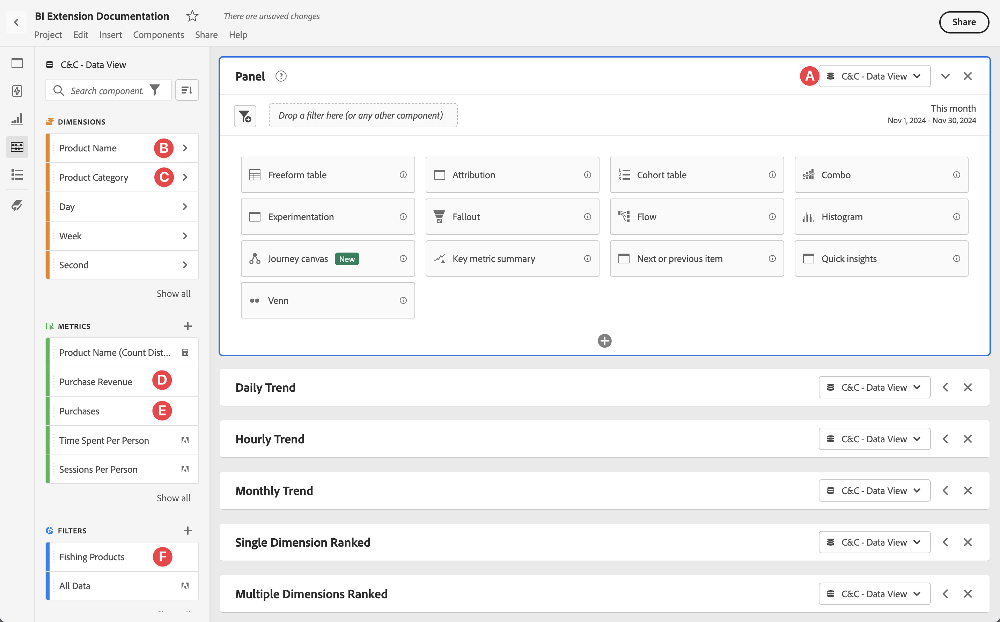
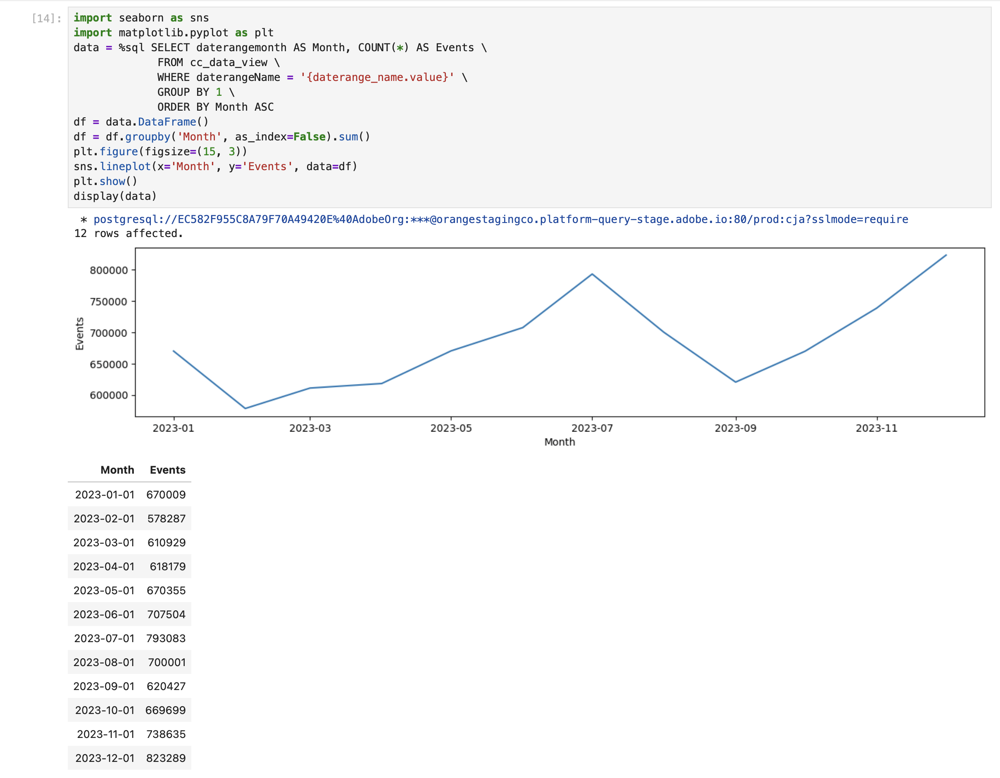
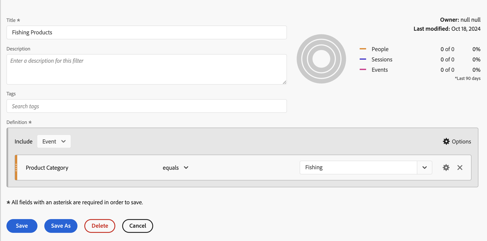
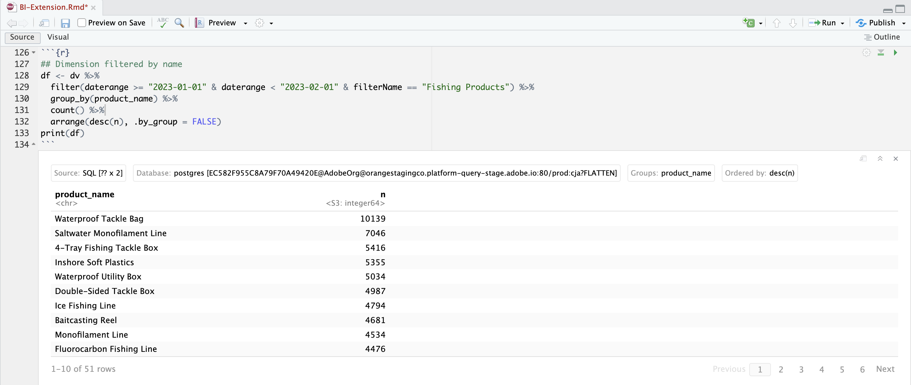

# BI 拡張機能のユースケース

この記事では、Customer Journey Analytics BI 拡張機能を使用して様々なユースケースを達成する方法について説明します。 各ユースケースでは、Customer Journey Analytics機能を説明し、その後でサポートされている各 BI ツールの詳細を説明します。

* **Power BI デスクトップ**。 使用されるバージョンは 2.137.1102.0 64 ビット（2024 年 10 月）です。
* **Tableau Desktop**。 使用されるバージョンは 2024.1.5 （20241.24.0705.0334） 64 ビットです。
* **Looker**。 オンラインバージョン 25.0.23、[looker.com](https://looker.com){target="_blank"} から入手可能
* **Jupyter Notebook**。 使用されるバージョンは 7.3.2 です。
* **RStudio**. 使用されるバージョンは 2024.12.0、ビルド 467 です。

次のユースケースについて説明します。

* **接続**
   * [データビューの接続とリスト表示](#connect-and-validate)

* **報告及び分析**
   * [毎日のトレンド](#daily-trend)
   * [毎時トレンド](#hourly-trend)
   * [月間トレンド](#monthly-trend)
   * [ランク付けされた単一ディメンション](#single-dimension-ranked)
   * [複数のディメンションのランク](#multiple-dimension-ranked)
   * [個別ディメンション値のカウント](#count-distinct-dimension-values)
   * [日付範囲名を使用してフィルター](#use-date-range-names-to-filter)
   * [セグメント名を使用したセグメント化](#use-segment-names-to-segment)
   * [ディメンション値を使用したセグメント化](#use-dimension-values-to-segment)
   * [並べ替え](#sort)
   * [制限](#limits)

* **理解**

   * [Transformations](#transformations)
   * [ビジュアライゼーション](#visualizations)
   * [注意事項](#caveats)

**connect** のユースケースでは、Customer Journey Analytics BI 拡張機能を使用して BI ツールを接続する方法に重点を置いています。

**レポートと分析** のユースケースでは、現在サポートされている BI ツールで同様のCustomer Journey Analytics ビジュアライゼーションを実行する方法を示しています。

**理解** ユースケースでは、次の項目について詳しく説明します。

* BI ツールを使用してレポートおよび分析を行う場合に発生する変換。
* ビジュアライゼーションのCustomer Journey Analytics ツールと BI ツールの類似点と相違点。
* 注意が必要な各 BI ツールの注意事項。


## 接続と検証

このユースケースでは、BI ツールからCustomer Journey Analyticsへの接続を設定し、使用可能なデータビューを一覧表示して、使用するデータビューを選択します。

+++ Customer Journey Analytics

この手順では、次のオブジェクトを持つ環境例を参照しています。

* データビュー：**[!UICONTROL C&amp;C - データビュー]** ??。
* ディメンション：**[!UICONTROL 製品名]** ?？および **[!UICONTROL 製品カテゴリ]** ??。
* 指標：**[!UICONTROL 購入売上高]**?？および **[!UICONTROL 購入]**??。
* フィルター：**[!UICONTROL 釣り製品]** ??。

{zoomable="yes"}

ユースケースを確認したら、これらのサンプルオブジェクトを特定の環境に適したオブジェクトに置き換えます。

+++

+++ BI ツール

>[!BEGINTABS]

>[!TAB Power BI デスクトップ ]

1. Experience Platform クエリサービス UI から必要な資格情報とパラメーターにアクセスします。

   1. Experience Platform サンドボックスに移動します。
   1. 左パネルから **[!UICONTROL クエリ]** を選択します。
   1. **[!UICONTROL クエリ]** インターフェイスの「**[!UICONTROL 資格情報]**」タブを選択します。
   1. **[!UICONTROL データベース]** ドロップダウンメニューから「`prod:cja`」を選択します。

      {zoomable="yes"}

1. Power BI Desktop を起動します。
   1. メインインターフェイスから、「**[!UICONTROL 他のソースからデータを取得]**」を選択します。
   1. **[!UICONTROL データを取得]** ダイアログで、次の手順を実行します。

      {zoomable="yes"}
      1. **[!UICONTROL PostgreSQL データベース]** を検索して選択します。
      1. **[!UICONTROL 接続]** を選択します。
   1. **[!UICONTROL PostgreSQL データベース]** ダイアログで、次の手順を実行します。

      {zoomable="yes"}
      1.  を使用して、Experience Platformの **[!UICONTROL クエリ]**&#x200B;**[!UICONTROL 有効期限が切れる資格情報]** パネルの **[!UICONTROL Host]** と **[!UICONTROL Port]** の値をコピーして貼り付け、**[!UICONTROL Server]** の値として `:` で区切ります。 例：`examplecompany.platform-query.adobe.io:80`。
      1.  を使用して、Experience Platformの **[!UICONTROL クエリ]**&#x200B;**[!UICONTROL 有効期限が切れる資格情報**&#x200B;[!UICONTROL &#x200B; パネルから &#x200B;]&#x200B;**Database]** 値をコピー&amp;ペーストします。 貼り付ける値に `?FLATTEN` を追加します。 例：`prod:cja?FLATTEN`。
      1. **[!UICONTROL Data connectivity mode]** として **[!UICONTROL DirectQuery]** を選択します。
      1. **[!UICONTROL OK]** を選択します。
   1. **[!UICONTROL PostgreSQL データベース]** - **[!UICONTROL データベース]** ダイアログで、

      {zoomable="yes"}
      1.  を使用して、**[!UICONTROL ユーザー名]** および **[!UICONTROL パスワード]** フィールドのExperience Platform **[!UICONTROL クエリ]**&#x200B;**[!UICONTROL 有効期限が切れる資格情報]** パネルから **[!UICONTROL ユーザー名]** および **[!UICONTROL パスワード]** の値をコピーします。 [ 有効期限のない認証情報 ](https://experienceleague.adobe.com/en/docs/experience-platform/query/ui/credentials?lang=en#use-credential-to-connect) を使用している場合は、有効期限のない認証情報のパスワードを使用します。
      1. **[!UICONTROL これらの設定を適用するレベルを選択]** のドロップダウンメニューが、前に定義した **[!UICONTROL サーバー]** に設定されていることを確認します。
      1. **[!UICONTROL 接続]** を選択します。
   1. **[!UICONTROL ナビゲーター]** ダイアログで、データビューが取得されます。 この取得には時間がかかる場合があります。 取得すると、Power BI Desktop に以下が表示されます。

      {zoomable="yes"}
      1. 左パネルのリストから **[!UICONTROL public.cc_data_view]** を選択します。
      1. 次の 2 つのオプションがあります。
         1. **[!UICONTROL 読み込み]** を選択して続行し、設定を完了します。
         1. **[!UICONTROL データを変換]** を選択します。 オプションで設定の一部として変換を適用できるダイアログが表示されます。

            {zoomable="yes"}
            * **[!UICONTROL 閉じて適用]** を選択します。
   1. しばらくすると、**[!UICONTROL public.cc_data_view]** が **[!UICONTROL Data]** ペインに表示されます。  を選択して、ディメンションと指標を表示します。

      {zoomable="yes"}


### FLATTEN か NOT か

Power BI Desktop では、`FLATTEN` パラメーターに対して次のシナリオをサポートしています。 詳しくは、[ ネストされたデータの統合 ](https://experienceleague.adobe.com/ja/docs/experience-platform/query/key-concepts/flatten-nested-data) を参照してください。

| FLATTEN パラメータ | 例 | サポート | 備考 |
|---|---|:---:|---|
| なし | `prod:cja` |  | |
| `?FLATTEN` | `prod:cja?FLATTEN` |  | **推奨されるオプションは次のとおりです。** |
| `%3FFLATTEN` | `prod:cja%3FFLATTEN` |  | Power BI デスクトップに「**[!UICONTROL 指定された資格情報では認証できませんでした。 もう一度やり直してください。]** |

### 詳細情報

* [前提条件](/help/data-views/bi-extension.md#prerequisites)
* [ 資格情報ガイド ](https://experienceleague.adobe.com/ja/docs/experience-platform/query/ui/credentials)
* [Power BIをクエリサービスに接続 ](https://experienceleague.adobe.com/ja/docs/experience-platform/query/clients/power-bi)。


>[!TAB Tableau Desktop]

1. Experience Platform クエリサービス UI から必要な資格情報とパラメーターにアクセスします。

   1. Experience Platform サンドボックスに移動します。
   1. 左パネルから **[!UICONTROL クエリ]** を選択します。
   1. **[!UICONTROL クエリ]** インターフェイスの「**[!UICONTROL 資格情報]**」タブを選択します。
   1. **[!UICONTROL データベース]** ドロップダウンメニューから「`prod:cja`」を選択します。

      {zoomable="yes"}

1. Tableau の起動
   1. **[!UICONTROL To a Server]** の下の左パネルから「**[!UICONTROL PostgreSQL]**」を選択します。 使用できない場合は、「**[!UICONTROL その他…]**」を選択し、「**[!UICONTROL インストールされているコネクタ**&#x200B;[!UICONTROL 」から「]&#x200B;**PostgreSQL]**」を選択します。

      {zoomable="yes"}
   1. **[!UICONTROL PostgreSQL]** ダイアログの **[!UICONTROL 一般]** タブで、次の操作を行います。

      {zoomable="yes"}
      1.  を使用して、**[!UICONTROL ホスト]** をExperience Platform **[!UICONTROL クエリ]** **[!UICONTROL 有効期限が切れる資格情報]** パネルから **[!UICONTROL サーバー]** にコピー&amp;ペーストします。
      1.  を使用して、Experience Platformの **[!UICONTROL クエリ]**&#x200B;**[!UICONTROL 有効期限が切れる資格情報**&#x200B;[!UICONTROL &#x200B; パネルから &#x200B;]&#x200B;**Port]** に **[!UICONTROL Port]** をコピー&amp;ペーストします。
      1.  を使用して、Experience Platformの **[!UICONTROL クエリ]**&#x200B;**[!UICONTROL 有効期限が切れる資格情報**&#x200B;[!UICONTROL &#x200B; パネルから &#x200B;]&#x200B;**データベース]** に **[!UICONTROL データベース]** をコピー&amp;ペーストします。 貼り付ける値に `%3FFLATTEN` を追加します。 例：`prod:cja%3FFLATTEN`。
      1. **[!UICONTROL 認証]** ドロップダウンメニューから **[!UICONTROL ユーザー名とパスワード]** を選択します。
      1.  を使用して、**[!UICONTROL ユーザー名]** をExperience Platform **[!UICONTROL クエリ]** **[!UICONTROL 有効期限が切れる資格情報]** パネルから **[!UICONTROL ユーザー名]** にコピー&amp;ペーストします。
      1.  を使用して、**[!UICONTROL パスワード]** をExperience Platform **[!UICONTROL クエリ]** **[!UICONTROL 有効期限が切れる資格情報]** パネルから **[!UICONTROL パスワード]** にコピー&amp;ペーストします。 [ 有効期限のない認証情報 ](https://experienceleague.adobe.com/en/docs/experience-platform/query/ui/credentials?lang=en#use-credential-to-connect) を使用している場合は、有効期限のない認証情報のパスワードを使用します。
      1. 「**[!UICONTROL SSL が必要]**」が選択されていることを確認します。
      1. 「**[!UICONTROL ログイン]**」を選択します。

      Tableau Desktop が接続を検証している間、**[!UICONTROL 要求の進行状況]** ダイアログが表示されます。
   1. メインウィンドウの左側のペインには、「**[!UICONTROL データSource]**」ページが表示されます。
      * **[!UICONTROL 接続]** の下の接続名。
      * **[!UICONTROL Database]** の下のデータベースの名前。
      * **[!UICONTROL Table]** の下のテーブルのリスト。

        {zoomable="yes"}
      1. **[!UICONTROL cc_data_view]** エントリをドラッグし、「**[!UICONTROL テーブルをドラッグ]**」と表示されるメインビューにここにエントリをドロップします。
   1. メインウィンドウに、**[!UICONTROL cc_data_view]** データビューの詳細が表示されます。

      {zoomable="yes"}

### FLATTEN か NOT か

Tableau Desktop は、`FLATTEN` パラメーターに対して次のシナリオをサポートしています。 詳しくは、[ ネストされたデータの統合 ](https://experienceleague.adobe.com/ja/docs/experience-platform/query/key-concepts/flatten-nested-data) を参照してください。

| FLATTEN パラメータ | 例 | サポート | 備考 |
|---|---|:---:|---|
| なし | `prod:cja` |  | |
| `?FLATTEN` | `prod:cja?FLATTEN` |  | |
| `%3FFLATTEN` | `prod:cja%3FFLATTEN` |  | **推奨されるオプション**。 `%3FFLATTEN` は URL エンコードされたバージョンの `?FLATTEN` であることに注意してください。 |

### 詳細情報

* [前提条件](/help/data-views/bi-extension.md#prerequisites)
* [ 資格情報ガイド ](https://experienceleague.adobe.com/ja/docs/experience-platform/query/ui/credentials)
* [Tableau Desktop をクエリサービスに接続します ](https://experienceleague.adobe.com/ja/docs/experience-platform/query/clients/tableau)。


>[!TAB Looker]

1. Experience Platform クエリサービス UI から必要な資格情報とパラメーターにアクセスします。

   1. Experience Platform サンドボックスに移動します。
   1. 左パネルから **[!UICONTROL クエリ]** を選択します。
   1. **[!UICONTROL クエリ]** インターフェイスの「**[!UICONTROL 資格情報]**」タブを選択します。
   1. **[!UICONTROL データベース]** ドロップダウンメニューから「`prod:cja`」を選択します。

      {zoomable="yes"}

1. Looker へのログイン

   1. 左側のパネルから「**[!UICONTROL 管理]**」を選択します。
   1. 「**[!UICONTROL 接続]**」を選択します。
   1. 「**[!UICONTROL 接続を追加]**」を選択します。
   1. **[!UICONTROL データベースを Looker に接続画面]** で確認します。

      {zoomable="yes"}

      1. 接続の **[!UICONTROL 名前]** を入力（例：`Example Looker Connection`）
      1. **[!UICONTROL 接続範囲]** として「すべてのプロジェクト **[!UICONTROL が選択されていることを確認]** ます。
      1. ダイアレクトとして **[!UICONTROL PostgreSQL 9.5 以上]** を選択します。
      1.  を使用して、Experience Platformの **[!UICONTROL クエリ]**&#x200B;**[!UICONTROL 有効期限が切れる資格情報**&#x200B;[!UICONTROL &#x200B; パネルの &#x200B;]&#x200B;**ホスト]** 値をコピーし、**[!UICONTROL ホスト]** の値として貼り付けます。 例：`examplecompany.platform-query.adobe.io`。
      1.  を使用して、Experience Platformの **[!UICONTROL クエリ]**&#x200B;**[!UICONTROL 有効期限が切れる資格情報**&#x200B;[!UICONTROL &#x200B; パネルの &#x200B;]&#x200B;**Port]** 値をコピーして **[!UICONTROL Port]** に貼り付けます。 例：`80`。
      1.  を使用して、Experience Platformの **[!UICONTROL クエリ]**&#x200B;**[!UICONTROL 有効期限が切れる資格情報**&#x200B;[!UICONTROL &#x200B; パネルの &#x200B;]&#x200B;**データベース]** 値をコピーして **[!UICONTROL データベース]** に貼り付けます。 貼り付ける値に `%3FFLATTEN` を追加します。 例：`prod:cja%3FFLATTEN`。
      1.  を使用して、Experience Platform **[!UICONTROL クエリ]**&#x200B;**[!UICONTROL 有効期限が切れる資格情報**&#x200B;[!UICONTROL &#x200B; パネルの &#x200B;]&#x200B;**ユーザー名]** 値をコピーして **[!UICONTROL ユーザー名]** に貼り付けます。
      1.  を使用して、Experience Platform **[!UICONTROL クエリ]**&#x200B;**[!UICONTROL 有効期限が切れる資格情報**&#x200B;[!UICONTROL &#x200B; パネルの &#x200B;]&#x200B;**パスワード]** 値をコピーして **[!UICONTROL パスワード]** に貼り付けます。
      1. **[!UICONTROL オプション設定]** で **[!UICONTROL すべて展開]** を選択します。
      1. ノードごとの **[!UICONTROL 最大接続数]** を `5` に設定します。
      1. **[!UICONTROL SSL]** が有効になっていることを確認します。
      1. 「**[!UICONTROL テスト]**」を選択して、接続をテストします。 画面の上部にバナーが表示され、「Success, can connect JDBC ...**[!UICONTROL のようなメッセージが表示されます]**。
      1. 「**[!UICONTROL 接続]**」を選択し、接続を確立して保存します。
   1. **[!UICONTROL Connections]** インターフェイスに新しい接続が表示されます。
   1. **[!UICONTROL 管理者]** から **←** を選択して、左側のパネルのメインナビゲーションに移動します。
   1. **[!UICONTROL 開発]** を選択します。
   1. **[!UICONTROL プロジェクト]** を選択します。
   1. LookML プロジェクトで **[!UICONTROL 新規モデル]** を選択します。
   1. を設定して、他のユーザーに影響を与えないようにします。 プロンプトが表示されたら、「開発モードに入る」を選択します。
   1. **[!UICONTROL モデルを作成]** エクスペリエンスで、次の操作を行います。
      1. **[!UICONTROL ➊データベース接続を選択し]** す。
         1. **[!UICONTROL データベース接続を選択]** でデータベース接続を選択します。 例：**[!UICONTROL example_looker_connection]**。
         1. **[!UICONTROL このモデルの新しい LookML プロジェクトを作成]** でプロジェクトに名前を付けます。 （`example: example_looker_project` 用）。
         1. 「**[!UICONTROL 次へ]**」を選択します。
      1. **[!UICONTROL ➋テーブルを選択します]**。
         1. **[!UICONTROL 公開]** を選択し、Customer Journey Analytics データビューが選択されていることを確認します。 例：**[!UICONTROL cc_data_view]**。
         1. 「**[!UICONTROL 次へ]**」を選択します。
      1. **[!UICONTROL で➌プライマリキーを選択し]** す。
         1. 「**[!UICONTROL 次へ]**」を選択します。
      1. **[!UICONTROL ➍作成する探索を選択します]**
         1. 必ずビューを選択してください。 例：**[!UICONTROL cc_data_view.view]**。
         1. 「**[!UICONTROL 次へ]**」を選択します。
      1. **[!UICONTROL ➎モデル名を入力し]** す。
         1. モデルに名前を付けます。 例：`example_looker_model`。
      1. 「**[!UICONTROL データを入力して調査]**」を選択します。

   Looker の **[!UICONTROL 参照]** インターフェイスにリダイレクトされ、データを参照する準備が整います。


### FLATTEN か NOT か

Looker では、`FLATTEN` パラメーターに対して次のシナリオをサポートしています。 詳しくは、[ ネストされたデータの統合 ](https://experienceleague.adobe.com/ja/docs/experience-platform/query/key-concepts/flatten-nested-data) を参照してください。

| FLATTEN パラメータ | 例 | サポート | 備考 |
|---|---|:---:|---|
| なし | `prod:cja` |  | |
| `?FLATTEN` | `prod:cja?FLATTEN` |  | |
| `%3FFLATTEN` | `prod:cja%3FFLATTEN` |  | **推奨されるオプション**。 `%3FFLATTEN` は URL エンコードされたバージョンの `?FLATTEN` であることに注意してください。 |

### 詳細情報

* [前提条件](/help/data-views/bi-extension.md#prerequisites)
* [ 資格情報ガイド ](https://experienceleague.adobe.com/ja/docs/experience-platform/query/ui/credentials)


>[!TAB Jupyter Notebook]

1. Experience Platform クエリサービス UI から必要な資格情報とパラメーターにアクセスします。

   1. Experience Platform サンドボックスに移動します。
   1. 左パネルから **[!UICONTROL クエリ]** を選択します。
   1. **[!UICONTROL クエリ]** インターフェイスの「**[!UICONTROL 資格情報]**」タブを選択します。
   1. **[!UICONTROL データベース]** ドロップダウンメニューから「`prod:cja`」を選択します。

      {zoomable="yes"}

1. Jupyter Notebook 環境を実行するための専用の Python 仮想環境をセットアップしていることを確認します。
1. 仮想環境に必要なライブラリがインストールされていることを確認します。
   * ipython-sql: `pip install ipython-sql`。
   * psycopg2-binary: `pip install psycopg-binary`。
   * sqlalchemy: pip `install sqlalchemy`。

1. 仮想環境 `jupyter notebook` から Jupyter Notebook を起動します。
1. 新しいノートブックを作成するか、[ このサンプルノートブック ](assets/BI-Extension.ipynb.zip) をダウンロードします。
1. 最初のセルに、次のように入力して実行します。

   ```
   %config SqlMagic.style = '_DEPRECATED_DEFAULT'
   ```

1. 新しいセルに、接続の設定パラメーターを入力します。  を使用して、Experience Platform **[!UICONTROL クエリ]** **[!UICONTROL 有効期限が切れる資格情報]** パネルの値をコピーして、設定パラメーターに必要な値に貼り付けます。 例：

   ```
   import ipywidgets as widgets
   from IPython.display import display
   
   config_host = widgets.Text(description='Host:', value='example.platform-query-stage.adobe.io',
                           layout=widgets.Layout(width="600px"))
   display(config_host)
   config_port = widgets.IntText(description='Port:', value=80,
                              layout=widgets.Layout(width="200px"))
   display(config_port)
   config_db = widgets.Text(description='Database:', value='prod:cja',
                         layout=widgets.Layout(width="300px"))
   display(config_db)
   config_username = widgets.Text(description='Username:', value='EC582F955C8A79F70A49420E@AdobeOrg',
                               layout=widgets.Layout(width="600px"))
   display(config_username)
   config_password = widgets.Password(description='Password:', value='***',
                                   layout=widgets.Layout(width="600px"))
   display(config_password)
   ```

1. セルを実行します。
1.  を使用して、Experience Platformの **[!UICONTROL クエリ]** **[!UICONTROL 有効期限が切れる資格情報]** パネルから Jupyter Notebook の **[!UICONTROL パスワード]** フィールドにパスワードをコピー&amp;ペーストします。

   {zoomable="yes"}

1. 新しいセルに、SQL 拡張機能を読み込むためのステートメント、必要なライブラリを入力し、Customer Journey Analyticsに接続します。

   ```python
   %load_ext sql
   from sqlalchemy import create_engine
   %sql postgresql://{config_username.value}:{config_password.value}@{config_host.value}:{config_port.value}/{config_db.value}?sslmode=require
   ```

   シェルを実行します。 出力は表示されませんが、セルは警告なしで実行する必要があります。

   {zoomable="yes"}

1. 新しい呼び出しで、ステートメントを入力して、接続に基づいて使用可能なデータビューのリストを取得します。

   ```python
   %%sql
   SELECT n.nspname as "Schema",
      c.relname as "Name",
      CASE c.relkind WHEN 'r' THEN 'table' WHEN 'v' THEN 'view' WHEN 'm' THEN 'materialized view' WHEN 'i' THEN 'index' WHEN 'S' THEN 'sequence' WHEN 's' THEN 'special' WHEN 't' THEN 'TOAST table' WHEN 'f' THEN 'foreign table' WHEN 'p' THEN 'partitioned table' WHEN 'I' THEN 'partitioned index' END as "Type",
      pg_catalog.pg_get_userbyid(c.relowner) as "Owner"
   FROM pg_catalog.pg_class c
   LEFT JOIN pg_catalog.pg_namespace n ON n.oid = c.relnamespace
   WHERE c.relkind IN ('v','')
      AND n.nspname <> 'pg_catalog'
      AND n.nspname !~ '^pg_toast'
      AND n.nspname <> 'information_schema'
      AND pg_catalog.pg_table_is_visible(c.oid)
      AND c.relname NOT LIKE '%test%'
      AND c.relname NOT LIKE '%ajo%'
   ORDER BY 1,2;
   ```

   シェルを実行します。 以下のスクリーンショットに同様に出力が表示されます。

   {zoomable="yes"}

   データビューのリストに **[!UICONTROL cc_data_view]** が表示されます。

### FLATTEN か NOT か

Jupyter Notebook では、`FLATTEN` パラメーターに対して次のシナリオをサポートしています。 詳しくは、[ ネストされたデータの統合 ](https://experienceleague.adobe.com/ja/docs/experience-platform/query/key-concepts/flatten-nested-data) を参照してください。

| FLATTEN パラメータ | 例 | サポート | 備考 |
|---|---|:---:|---|
| なし | `prod:cja` |  | |
| `?FLATTEN` | `prod:cja?FLATTEN` |  | |
| `%3FFLATTEN` | `prod:cja%3FFLATTEN` |  | **推奨されるオプション**。 `%3FFLATTEN` は URL エンコードされたバージョンの `?FLATTEN` であることに注意してください。 |

### 詳細情報

* [前提条件](/help/data-views/bi-extension.md#prerequisites)
* [ 資格情報ガイド ](https://experienceleague.adobe.com/ja/docs/experience-platform/query/ui/credentials)

>[!TAB RStudio]

1. Experience Platform クエリサービス UI から必要な資格情報とパラメーターにアクセスします。

   1. Experience Platform サンドボックスに移動します。
   1. 左パネルから **[!UICONTROL クエリ]** を選択します。
   1. **[!UICONTROL クエリ]** インターフェイスの「**[!UICONTROL 資格情報]**」タブを選択します。
   1. **[!UICONTROL データベース]** ドロップダウンメニューから「`prod:cja`」を選択します。

      {zoomable="yes"}

1. RStudio を起動します。
1. 新しい R Markdown ファイルを作成するか、[ このサンプル R Markdown ファイル ](assets/BI-Extension.Rmd.zip) をダウンロードします。
1. 最初のチャンクでは、` ` ``{r} ` ～ ` `` ` ` の間に次のステートメントを入力します。  を使用して、Experience Platform **[!UICONTROL クエリ]** **[!UICONTROL 資格情報の有効期限]** パネルから `host`、`dbname`、`user` などの様々なパラメーターに必要な値にコピー&amp;ペーストします。 例：

   ```R
   library(rstudioapi)
   library(DBI)
   library(dplyr)
   library(tidyr)
   library(RPostgres)
   library(ggplot2)
   
   host <- rstudioapi::showPrompt(title = "Host", message = "Host", default = "orangestagingco.platform-query-stage.adobe.io")
   dbname <- rstudioapi::showPrompt(title = "Database", message = "Database", default = "prod:cja?FLATTEN")
   user <- rstudioapi::showPrompt(title = "Username", message = "Username", default = "EC582F955C8A79F70A49420E@AdobeOrg")
   password <- rstudioapi::askForPassword(prompt = "Password")
   ```

1. チャンクを実行します。 「**[!UICONTROL Host]**」、「**[!UICONTROL Database]**」、「**[!UICONTROL User]**」の入力を求められます。 前の手順の一部として指定した値をそのまま使用します。
1.  を使用して、Experience Platform **[!UICONTROL クエリ]** **[!UICONTROL 資格情報の有効期限]** パネルから RStudio の **[!UICONTROL パスワード]** ダイアログプロンプトにパスワードをコピー&amp;ペーストします。

   {zoomable="yes"}

1. 新しいチャンクを作成し、` ` `` {r} ` ～ ` `` ` ` の間に次のステートメントを入力してください。

   ```R
   con <- dbConnect(
      RPostgres::Postgres(),
      host = host,
      port = 80,
      dbname = dbname,
      user = user,
      password = password,
      sslmode = 'require'
   )
   ```

1. チャンクを実行します。 接続に成功した場合は、出力は表示されません。


1. 新しいチャンクを作成し、` ` `` {r} ` ～ ` `` ` ` の間に次のステートメントを入力してください。

   ```R
   views <- dbListTables(con)
   print(views)
   ```

1. チャンクを実行します。 `character(0)` が唯一の出力として表示されます。


1. 新しいチャンクを作成し、` ` `` {r} ` ～ ` `` ` ` の間に次のステートメントを入力してください。

   ```R
   glimpse(dv)
   ```

1. チャンクを実行します。 以下のスクリーンショットに同様に出力が表示されます。

   {zoomable="yes"}

### FLATTEN か NOT か

RStudio は、`FLATTEN` パラメーターに対して次のシナリオをサポートしています。 詳しくは、[ ネストされたデータの統合 ](https://experienceleague.adobe.com/ja/docs/experience-platform/query/key-concepts/flatten-nested-data) を参照してください。

| FLATTEN パラメータ | 例 | サポート | 備考 |
|---|---|:---:|---|
| なし | `prod:cja` |  | |
| `?FLATTEN` | `prod:cja?FLATTEN` |  | **推奨されるオプション**。 |
| `%3FFLATTEN` | `prod:cja%3FFLATTEN` |  | |

### 詳細情報

* [前提条件](/help/data-views/bi-extension.md#prerequisites)
* [ 資格情報ガイド ](https://experienceleague.adobe.com/ja/docs/experience-platform/query/ui/credentials)

>[!ENDTABS]

+++


## 毎日のトレンド

このユースケースでは、2023 年 1 月 1 日から 2023 年 1 月 31 日までの発生件数（イベント）の毎日のトレンドを表示するテーブルとシンプルな線のビジュアライゼーションを表示します。

+++ Customer Journey Analytics

ユースケースの例 **[!UICONTROL 毎日のトレンド]** パネルを次に示します。

{zoomable="yes"}

+++

+++ BI ツール

>[!PREREQUISITES]
>
>このユースケースを試す BI ツールの [ 接続に成功した ](#connect-and-validate) 検証され、データビューのリスト作成と使用ができることを確認します。
>

>[!BEGINTABS]

>[!TAB Power BI デスクトップ ]

1. **[!UICONTROL データ]** ペインで、次の操作を行います。
   1. **[!UICONTROL daterangeday]** を選択します。
   1. 「**[!UICONTROL ∑回数]**」を選択します。

   当月の発生件数を示すテーブルが表示されます。 視認性を高めるには、ビジュアライゼーションを拡大します。

1. **[!UICONTROL フィルター]** パネルで、次の操作を行います。

   1. **[!UICONTROL このビジュアルのフィルター]** から **[!UICONTROL daterangeday is （All）]** を選択します。
   1. **[!UICONTROL フィルタータイプ]** として「**[!UICONTROL 詳細フィルタリング]**」を選択します。
   1. フィルターを定義して **[!UICONTROL 値が]** 次の値の場合に項目を表示 **&#x200B;**&#x200B;`1/1/2023` **[!UICONTROL および]** **[!UICONTROL 次の値の前]** `2/1/2023.` を設定します。カレンダーアイコンを使用して、日付を選択して選択できます。
   1. 「**[!UICONTROL フィルターを適用]**」を選択します。

   適用した **[!UICONTROL daterangeday]** フィルターで更新されたテーブルが表示されます。

1. **[!UICONTROL ビジュアライゼーション]** パネルで、**[!UICONTROL 折れ線グラフ]** ビジュアライゼーションを選択します。

   折れ線グラフビジュアライゼーションは、テーブルと同じデータを使用しながら、テーブルを置き換えます。 Power BI デスクトップは次のようになります。

   {zoomable="yes"}

1. 折れ線グラフのビジュアライゼーションで：

   1.  を選択します。
   1. コンテキストメニューから「**[!UICONTROL テーブルとして表示]**」を選択します。

   メインビューが更新され、折れ線グラフのビジュアライゼーションとテーブルの両方が表示されます。 Power BI デスクトップは次のようになります。

   {zoomable="yes"}

>[!TAB Tableau Desktop]

1. 下部にある「**[!UICONTROL シート 1]**」タブを選択して、「**[!UICONTROL データソース]**」ビューから切り替えます。 **[!UICONTROL シート 1]** ビューで、次の操作を行います。
   1. **[!UICONTROL データ]** ペインの **[!UICONTROL テーブル]** リストから **[!UICONTROL Daterange]** エントリをドラッグし、**[!UICONTROL フィルター]** シェルフにドロップします。
   1. **[!UICONTROL フィルターフィールド\[Daterange\]]** ダイアログで **[!UICONTROL 日付範囲]** を選択して **[!UICONTROL 次へ >]** を選択します。
   1. **[!UICONTROL フィルター\[Daterange]]** ダイアログで **[!UICONTROL 日付範囲]** を選択し、`01/01/2023` ～ `01/02/2023` の期間を指定します。

      {zoomable="yes"}

   1. **[!UICONTROL データ]** ペインの **[!UICONTROL テーブル]** リストから **[!UICONTROL Daterangeday]** をドラッグ&amp;ドロップし、**[!UICONTROL 列]** の横のフィールドにエントリをドロップします。
      * **[!UICONTROL Daterangeday]** ドロップダウンメニューから **[!UICONTROL Day]** を選択し、値が **[!UICONTROL DAY （Daterangeday）]** に更新されます。
   1. **[!UICONTROL データ]** ペインの **[!UICONTROL テーブル（*メジャー名*）]** リストから **[!UICONTROL 発生件数]** をドラッグ&amp;ドロップし、**[!UICONTROL 行]** の横のフィールドにエントリをドロップします。 値は自動的に **[!UICONTROL SUM （発生件数）]** に変換されます。
   1. ツールバーの **[!UICONTROL フィット]** ドロップダウンメニューから **[!UICONTROL 標準]** を **[!UICONTROL ビュー全体]** に変更します。

      Tableau Desktop は次のようになります。

      {zoomable="yes"}

1. [**[!UICONTROL シート 1]**] タブの右クリック メニューから **[!UICONTROL 複製]** を選択し、2 番目のシートを作成します。
1. [**[!UICONTROL シート 1]**] タブの右クリック メニューから **[!UICONTROL 名前変更]** を選択して、シートの名前を `Graph` に変更します。
1. **[!UICONTROL シート 1 （2）]** タブの右クリック メニューから **[!UICONTROL 名前変更]** を選択して、シートの名前を `Data` に変更します。
1. **[!UICONTROL データ]** シートが選択されていることを確認します。 **[!UICONTROL データ]** 表示で、次の操作を行います。
   1. 右上の **[!UICONTROL 表示]** を選択し、**[!UICONTROL テキストテーブル]** （左上のビジュアライゼーション）を選択して、データビューのコンテンツをテーブルに変更します。
   1. ツールバーの **[!UICONTROL 行と列を入れ替える]** を選択します。
   1. ツールバーの **[!UICONTROL フィット]** ドロップダウンメニューから **[!UICONTROL 標準]** を **[!UICONTROL ビュー全体]** に変更します。

      Tableau Desktop は次のようになります。

      {zoomable="yes"}

1. 「**[!UICONTROL 新規ダッシュボード]**」タブボタン（下部）を選択して、新しい **[!UICONTROL ダッシュボード 1]** ビューを作成します。 **[!UICONTROL ダッシュボード 1]** ビューで、次の操作を行います。
   1. **[!UICONTROL Sheets]** シェルフから **[!UICONTROL Graph]** シートを **[!UICONTROL Dashboard 1]** ビュー（「シートをここにドロップ *」と表示されているビュー* にドラッグ&amp;ドロップします。
   1. **[!UICONTROL データ]** シートを、**[!UICONTROL グラフ]** シートの下にある **[!UICONTROL シート]** シェルフから **[!UICONTROL ダッシュボード 1]** ビューにドラッグ&amp;ドロップします。
   1. ビューで **[!UICONTROL データ]** シートを選択し、**[!UICONTROL ビュー全体]** を **[!UICONTROL 固定幅]** に変更します。

      Tableau Desktop は次のようになります。

      {zoomable="yes"}


>[!TAB Looker]

1. Looker の **[!UICONTROL 探索]** インターフェイスで、クリーンな設定ができていることを確認します。 そうでない場合は、「**[!UICONTROL フィールドとフィルターを削除]**」を選択します。
1. **[!UICONTROL フィルター]** の下の「**[!UICONTROL + フィルター]** を選択します。
1. **[!UICONTROL フィルターを追加]** ダイアログで、次の手順を実行します。
   1. 「**[!UICONTROL ‣ Cc データビュー」を選択します]**
   1. フィールドのリストから、「**[!UICONTROL ‣Daterange Date」を選択し]** 「**[!UICONTROL Daterange Date]**」を選択します。

      {zoomable="yes"}
1. **[!UICONTROL CC データビュー日付範囲]** フィルターを **[!UICONTROL 範囲内]** **[!UICONTROL 2023/01/01]**&#x200B;**[!UICONTROL 前）まで]** **[!UICONTROL 2023/02/01]** として指定します。
1. 左側のパネルの「**[!UICONTROL Cc データビュー]**」セクションから、
   1. 「**[!UICONTROL ‣Daterange Date]**」を選択し、「**[!UICONTROL DIMENSIONS]**」のリストから「**[!UICONTROL Date]**」を選択します。
   1. 左パネル（下部）の **[!UICONTROL MEASURES]** の下にある **[!UICONTROL Count]** を選択します。
1. 「**[!UICONTROL 実行]**」を選択します。
1. 「**[!UICONTROL ‣ビジュアライゼーション]**」を選択して、折れ線グラフのビジュアライゼーションを表示します。

以下に示すようなビジュアライゼーションとテーブルが表示されます。

{zoomable="yes"}


>[!TAB Jupyter Notebook]

1. 新しいセルに次のステートメントを入力します。

   ```python
   import seaborn as sns
   import matplotlib.pyplot as plt
   data = %sql SELECT daterangeday AS Date, COUNT(*) AS Events \
             FROM cc_data_view \
             WHERE daterange BETWEEN '2023-01-01' AND '2023-02-01' \
             GROUP BY 1 \
             ORDER BY Date ASC
   df = data.DataFrame()
   df = df.groupby('Date', as_index=False).sum()
   plt.figure(figsize=(15, 3))
   sns.lineplot(x='Date', y='Events', data=df)
   plt.show()
   display(data)
   ```

1. セルを実行します。 以下のスクリーンショットのような出力が表示されます。

   {zoomable="yes"}


>[!TAB RStudio]

1. 新しいチャンクで、` ` ``{r} ` と ` `` ` ` の間に次のステートメントを入力します。

   ```R
   ## Daily Events
   df <- dv %>%
      filter(daterange >= "2023-01-01" & daterange < "2023-02-01") %>%
      group_by(daterangeday) %>%
      count() %>%
      arrange(daterangeday, .by_group = FALSE)
   ggplot(df, aes(x = daterangeday, y = n)) +
      geom_line(color = "#69b3a2") +
      ylab("Events") +
      xlab("Date")
   print(df)
   ```

1. チャンクを実行します。 以下のスクリーンショットのような出力が表示されます。

   {zoomable="yes"}

>[!ENDTABS]

+++


## 毎時トレンド

このユースケースでは、2023 年 1 月 1 日の発生件数（イベント）の 1 時間ごとのトレンドを表示するテーブルと単純な線のビジュアライゼーションを表示します。

+++ Customer Journey Analytics

ユースケースの例 **[!UICONTROL 時間別トレンド]** パネル：

{zoomable="yes"}

+++

+++ BI ツール

>[!PREREQUISITES]
>
>このユースケースを試す BI ツールについて、[ 接続に成功し、データビューをリストし、データビューを使用できる ](#connect-and-validate) ことを検証したことを確認します。
>

>[!BEGINTABS]

>[!TAB Power BI デスクトップ ]

 Power BIは日時フィールドの処理方法を **認識** ていないので、**[!UICONTROL daterangehour]** や **[!UICONTROL daterangeminute]** などのディメンションはサポートされていません。

>[!TAB Tableau Desktop]

1. 下部にある「**[!UICONTROL シート 1]**」タブを選択して、「**[!UICONTROL データソース]**」から切り替えます。 **[!UICONTROL シート 1]** ビューで、次の操作を行います。
   1. **[!UICONTROL データ]** ペインの **[!UICONTROL テーブル]** リストから **[!UICONTROL Daterange]** エントリをドラッグし、**[!UICONTROL フィルター]** シェルフにドロップします。
   1. **[!UICONTROL フィルターフィールド\[Daterange\]]** ダイアログで **[!UICONTROL 日付範囲]** を選択して **[!UICONTROL 次へ >]** を選択します。
   1. **[!UICONTROL フィルター\[Daterange]]** ダイアログで **[!UICONTROL 日付範囲]** を選択し、`01/01/2023` ～ `02/01/2023` の期間を指定します。

      {zoomable="yes"}

   1. **[!UICONTROL データ]** ペインの「**[!UICONTROL テーブル]**」リストから **[!UICONTROL Daterangehour]** をドラッグ&amp;ドロップし、「**[!UICONTROL 列]**」の横のフィールドにエントリをドロップします。
      * **[!UICONTROL Daterangeday]** ドロップダウンメニューから **[!UICONTROL More]** > **[!UICONTROL Hours]** を選択し、値が **[!UICONTROL HOUR （Daterangeday）]** に更新されるようにします。
   1. **[!UICONTROL データ]** ペインの **[!UICONTROL テーブル（*メジャー名*）]** リストから **[!UICONTROL 発生件数]** をドラッグ&amp;ドロップし、**[!UICONTROL 行]** の横のフィールドにエントリをドロップします。 値は自動的に **[!UICONTROL SUM （発生件数）]** に変換されます。
   1. ツールバーの **[!UICONTROL フィット]** ドロップダウンメニューから **[!UICONTROL 標準]** を **[!UICONTROL ビュー全体]** に変更します。

      Tableau Desktop は次のようになります。

      {zoomable="yes"}

1. [**[!UICONTROL シート 1]**] タブの右クリック メニューから **[!UICONTROL 複製]** を選択し、2 番目のシートを作成します。
1. [**[!UICONTROL シート 1]**] タブの右クリック メニューから **[!UICONTROL 名前変更]** を選択して、シートの名前を `Graph` に変更します。
1. **[!UICONTROL シート 1 （2）]** タブの右クリック メニューから **[!UICONTROL 名前変更]** を選択して、シートの名前を `Data` に変更します。
1. **[!UICONTROL データ]** シートが選択されていることを確認します。 **[!UICONTROL データ]** 表示で、次の操作を行います。
   1. 右上の **[!UICONTROL 表示]** を選択し、**[!UICONTROL テキストテーブル]** （左上のビジュアライゼーション）を選択して、データビューのコンテンツをテーブルに変更します。
   1. **[!UICONTROL HOUR （Daterangeday）]** を **[!UICONTROL Columns]** から **[!UICONTROL Rows]** にドラッグします。
   1. ツールバーの **[!UICONTROL フィット]** ドロップダウンメニューから **[!UICONTROL 標準]** を **[!UICONTROL ビュー全体]** に変更します。

      Tableau Desktop は次のようになります。

      {zoomable="yes"}

1. **[!UICONTROL 新規ダッシュボード]**」タブボタン（下部）を選択して、新しい **[!UICONTROL ダッシュボード 1]** ビューを作成します。 **[!UICONTROL ダッシュボード 1]** ビューで、次の操作を行います。
   1. **[!UICONTROL Sheets]** シェルフから **[!UICONTROL Graph]** シートを **[!UICONTROL Dashboard 1]** ビュー（「シートをここにドロップ *」と表示されているビュー* にドラッグ&amp;ドロップします。
   1. **[!UICONTROL データ]** シートを、**[!UICONTROL グラフ]** シートの下にある **[!UICONTROL シート]** シェルフから **[!UICONTROL ダッシュボード 1]** ビューにドラッグ&amp;ドロップします。
   1. ビューで **[!UICONTROL データ]** シートを選択し、**[!UICONTROL ビュー全体]** を **[!UICONTROL 固定幅]** に変更します。

      **[!UICONTROL ダッシュボード 1]** ビューは次のようになります。

      {zoomable="yes"}


>[!TAB Looker]


1. Looker の **[!UICONTROL 探索]** インターフェイスで、クリーンな設定ができていることを確認します。 そうでない場合は、「**[!UICONTROL フィールドとフィルターを削除]**」を選択します。
1. **[!UICONTROL フィルター]** の下の「**[!UICONTROL + フィルター]** を選択します。
1. **[!UICONTROL フィルターを追加]** ダイアログで、次の手順を実行します。
   1. 「**[!UICONTROL ‣ Cc データビュー」を選択します]**
   1. フィールドのリストから、「**[!UICONTROL ‣Daterange Date」を選択し]** 「**[!UICONTROL Daterange Date]**」を選択します。

      {zoomable="yes"}
1. **[!UICONTROL CC データビュー日付範囲]** フィルターを **[!UICONTROL 範囲内]** **[!UICONTROL 2023/01/01]**&#x200B;**[!UICONTROL 前）まで]** **[!UICONTROL 2023/01/02]** として指定します。
1. 左側のパネルの「**[!UICONTROL Cc データビュー]**」セクションから、
   1. 「**[!UICONTROL ‣ Daterangehour Date]**」を選択し、「**[!UICONTROL DIMENSIONS]**」のリストから「**[!UICONTROL Time]**」を選択します。
   1. 左パネル（下部）の **[!UICONTROL MEASURES]** の下にある **[!UICONTROL Count]** を選択します。
1. 「**[!UICONTROL 実行]**」を選択します。
1. 「**[!UICONTROL ‣ビジュアライゼーション]**」を選択して、折れ線グラフのビジュアライゼーションを表示します。

以下に示すようなビジュアライゼーションとテーブルが表示されます。

{zoomable="yes"}


>[!TAB Jupyter Notebook]

1. 新しいセルに次のステートメントを入力します。

   ```python
   import seaborn as sns
   import matplotlib.pyplot as plt
   data = %sql SELECT daterangehour AS Hour, COUNT(*) AS Events \
               FROM cc_data_view \
               WHERE daterange BETWEEN '2023-01-01' AND '2023-01-02' \
               GROUP BY 1 \
                ORDER BY Hour ASC
   df = data.DataFrame()
   df = df.groupby('Hour', as_index=False).sum()
   plt.figure(figsize=(15, 3))
   sns.lineplot(x='Hour', y='Events', data=df)
   plt.show()
   display(data)
   ```

1. セルを実行します。 以下のスクリーンショットのような出力が表示されます。

   {zoomable="yes"}


>[!TAB RStudio]

1. 新しいチャンクで、` ` ``{r} ` と ` `` ` ` の間に次のステートメントを入力します。

   ```R
   ## Hourly Events
   df <- dv %>%
      filter(daterange >= "2023-01-01" & daterange < "2023-01-02") %>%
      group_by(daterangehour) %>%
      count() %>%
      arrange(daterangehour, .by_group = FALSE)
   ggplot(df, aes(x = daterangehour, y = n)) +
      geom_line(color = "#69b3a2") +
      ylab("Events") +
      xlab("Hour")
   print(df)
   ```

1. チャンクを実行します。 以下のスクリーンショットのような出力が表示されます。

   {zoomable="yes"}

>[!ENDTABS]

+++


## 月間トレンド

このユースケースでは、2023 年の発生（イベント）の月ごとのトレンドを表示するテーブルとシンプルな線のビジュアライゼーションを表示します。

+++ Customer Journey Analytics

ユースケースの例 **[!UICONTROL 月間トレンド]** パネルを次に示します。

{zoomable="yes"}

+++

+++ BI ツール

>[!PREREQUISITES]
>
>このユースケースを試す BI ツールについて、[ 接続に成功し、データビューをリストし、データビューを使用できる ](#connect-and-validate) ことを検証したことを確認します。
>

>[!BEGINTABS]

>[!TAB Power BI デスクトップ ]

1. **[!UICONTROL データ]** ペインで、次の操作を行います。
   1. **[!UICONTROL daterangemonth]** を選択します。
   1. 「**[!UICONTROL ∑回数]**」を選択します。

   当月の発生件数を示すテーブルが表示されます。 視認性を高めるには、ビジュアライゼーションを拡大します。

1. **[!UICONTROL フィルター]** パネルで、次の操作を行います。

   1. **[!UICONTROL このビジュアルのフィルター]** から **[!UICONTROL daterangemonth is （All）]** を選択します。
   1. **[!UICONTROL フィルタータイプ]** として「**[!UICONTROL 詳細フィルタリング]**」を選択します。
   1. フィルターを定義して **[!UICONTROL 値が]** 次の値の場合に項目を表示 **&#x200B;**&#x200B;`1/1/2023` **[!UICONTROL および]** **[!UICONTROL 次の値の前]** `1/1/2024.` を設定します。カレンダーアイコンを使用して、日付を選択して選択できます。
   1. 「**[!UICONTROL フィルターを適用]**」を選択します。

   適用した **[!UICONTROL daterangemonth]** フィルターで更新されたテーブルが表示されます。

1. **[!UICONTROL ビジュアライゼーション]** パネルで、

   1. **[!UICONTROL 折れ線グラフ]** ビジュアライゼーションを選択します。

   折れ線グラフビジュアライゼーションは、テーブルと同じデータを使用しながら、テーブルを置き換えます。 Power BI デスクトップは次のようになります。

   {zoomable="yes"}

1. 折れ線グラフのビジュアライゼーションで：

   1.  を選択します。
   1. コンテキストメニューから「**[!UICONTROL テーブルとして表示]**」を選択します。

   メインビューが更新され、折れ線グラフのビジュアライゼーションとテーブルの両方が表示されます。 Power BI デスクトップは次のようになります。

   {zoomable="yes"}

>[!TAB Tableau Desktop]

1. 下部にある「**[!UICONTROL シート 1]**」タブを選択して、「**[!UICONTROL データソース]**」から切り替えます。 **[!UICONTROL シート 1]** ビューで、次の操作を行います。
   1. **[!UICONTROL データ]** ペインの **[!UICONTROL テーブル]** リストから **[!UICONTROL Daterange]** エントリをドラッグし、**[!UICONTROL フィルター]** シェルフにドロップします。
   1. **[!UICONTROL フィルターフィールド\[Daterange\]]** ダイアログで **[!UICONTROL 日付範囲]** を選択して **[!UICONTROL 次へ >]** を選択します。
   1. **[!UICONTROL フィルター\[Daterange]]** ダイアログで **[!UICONTROL 日付範囲]** を選択し、`01/01/2023` ～ `01/01/2024` の期間を指定します。

      {zoomable="yes"}

   1. **[!UICONTROL データ]** ペインの **[!UICONTROL テーブル]** リストから **[!UICONTROL Daterangeday]** をドラッグ&amp;ドロップし、**[!UICONTROL 列]** の横のフィールドにエントリをドロップします。
      * **[!UICONTROL Daterangeday]** ドロップダウンメニューから **[!UICONTROL MONTH]** を選択し、値が **[!UICONTROL MONTH （Daterangeday）]** に更新されます。
   1. **[!UICONTROL データ]** ペインの **[!UICONTROL テーブル（*メジャー名*）]** リストから **[!UICONTROL 発生件数]** をドラッグ&amp;ドロップし、**[!UICONTROL 行]** の横のフィールドにエントリをドロップします。 値は自動的に **[!UICONTROL SUM （発生件数）]** に変換されます。
   1. ツールバーの **[!UICONTROL フィット]** ドロップダウンメニューから **[!UICONTROL 標準]** を **[!UICONTROL ビュー全体]** に変更します。

      Tableau Desktop は次のようになります。

      {zoomable="yes"}

1. [**[!UICONTROL シート 1]**] タブの右クリック メニューから **[!UICONTROL 複製]** を選択し、2 番目のシートを作成します。
1. [**[!UICONTROL シート 1]**] タブの右クリック メニューから **[!UICONTROL 名前変更]** を選択して、シートの名前を `Graph` に変更します。
1. **[!UICONTROL シート 1 （2）]** タブの右クリック メニューから **[!UICONTROL 名前変更]** を選択して、シートの名前を `Data` に変更します。
1. **[!UICONTROL データ]** シートが選択されていることを確認します。 データビューで、
   1. 右上の **[!UICONTROL 表示]** を選択し、**[!UICONTROL テキストテーブル]** （左上のビジュアライゼーション）を選択して、データビューのコンテンツをテーブルに変更します。
   1. **[!UICONTROL MONTH （Daterangeday）]** を **[!UICONTROL Columns]** から **[!UICONTROL Rows]** にドラッグします。
   1. ツールバーの **[!UICONTROL フィット]** ドロップダウンメニューから **[!UICONTROL 標準]** を **[!UICONTROL ビュー全体]** に変更します。

      Tableau Desktop は次のようになります。

      {zoomable="yes"}

1. **[!UICONTROL 新規ダッシュボード]**」タブボタン（下部）を選択して、新しい **[!UICONTROL ダッシュボード 1]** ビューを作成します。 **[!UICONTROL ダッシュボード 1]** ビューで、次の操作を行います。
   1. **[!UICONTROL Sheets]** シェルフから **[!UICONTROL Graph]** シートを **[!UICONTROL Dashboard 1]** ビュー（「シートをここにドロップ *」と表示されているビュー* にドラッグ&amp;ドロップします。
   1. **[!UICONTROL データ]** シートを、**[!UICONTROL グラフ]** シートの下にある **[!UICONTROL シート]** シェルフから **[!UICONTROL ダッシュボード 1]** ビューにドラッグ&amp;ドロップします。
   1. ビューで **[!UICONTROL データ]** シートを選択し、**[!UICONTROL ビュー全体]** を **[!UICONTROL 固定幅]** に変更します。

      Tableau Desktop は次のようになります。

      {zoomable="yes"}


>[!TAB Looker]

1. Looker の **[!UICONTROL 探索]** インターフェイスで、クリーンな設定ができていることを確認します。 そうでない場合は、「**[!UICONTROL フィールドとフィルターを削除]**」を選択します。
1. **[!UICONTROL フィルター]** の下の「**[!UICONTROL + フィルター]** を選択します。
1. **[!UICONTROL フィルターを追加]** ダイアログで、次の手順を実行します。
   1. 「**[!UICONTROL ‣ Cc データビュー」を選択します]**
   1. フィールドのリストから、「**[!UICONTROL ‣Daterange Date」を選択し]** 「**[!UICONTROL Daterange Date]**」を選択します。

      {zoomable="yes"}
1. **[!UICONTROL CC データビュー日付範囲]** フィルターを **[!UICONTROL 範囲内]** **[!UICONTROL 2023/01/01]**&#x200B;**[!UICONTROL 前）まで]** **[!UICONTROL 2024/01/01]** として指定します。
1. 左側の **[!UICONTROL Cc データビュー]** パネルから、
   1. **[!UICONTROL DIMENSIONS]** のリストから「**[!UICONTROL ‣Daterangemonth 日付]**」を選択してから「**[!UICONTROL 月]**」を選択します。
   1. 左パネル（下部）の **[!UICONTROL MEASURES]** の下にある **[!UICONTROL Count]** を選択します。
1. 「**[!UICONTROL 実行]**」を選択します。
1. 「**[!UICONTROL ‣ビジュアライゼーション]**」を選択して、折れ線グラフのビジュアライゼーションを表示します。

以下に示すようなビジュアライゼーションとテーブルが表示されます。

{zoomable="yes"}


>[!TAB Jupyter Notebook]

1. 新しいセルに次のステートメントを入力します。

   ```python
   import seaborn as sns
   import matplotlib.pyplot as plt
   data = %sql SELECT daterangemonth AS Month, COUNT(*) AS Events \
               FROM cc_data_view \
               WHERE daterange BETWEEN '2023-01-01' AND '2024-01-01' \
               GROUP BY 1 \
               ORDER BY Month ASC
   df = data.DataFrame()
   df = df.groupby('Month', as_index=False).sum()
   plt.figure(figsize=(15, 3))
   sns.lineplot(x='Month', y='Events', data=df)
   plt.show()
   display(data)
   ```

1. セルを実行します。 以下のスクリーンショットのような出力が表示されます。

   {zoomable="yes"}


>[!TAB RStudio]

1. 新しいチャンクで、` ` ``{r} ` と ` `` ` ` の間に次のステートメントを入力します。

   ```R
   ## Hourly Events
   df <- dv %>%
      filter(daterange >= "2023-01-01" & daterange < "2023-01-02") %>%
      group_by(daterangehour) %>%
      count() %>%
      arrange(daterangehour, .by_group = FALSE)
   ggplot(df, aes(x = daterangehour, y = n)) +
      geom_line(color = "#69b3a2") +
      ylab("Events") +
      xlab("Hour")
   print(df)
   ```

1. チャンクを実行します。 以下のスクリーンショットのような出力が表示されます。

   {zoomable="yes"}

>[!ENDTABS]

+++


## ランク付けされた単一ディメンション

このユースケースでは、2023 年を超える製品名の購入および購入売上高を示すテーブルとシンプルな棒ビジュアライゼーションを表示します。

+++ Customer Journey Analytics

ユースケースの例 **[!UICONTROL 単一のDimensionのランク付け]** パネルは次のとおりです。

{zoomable="yes"}
+++

+++ BI ツール

>[!PREREQUISITES]
>
>このユースケースを試す BI ツールについて、[ 接続に成功し、データビューをリストし、データビューを使用できる ](#connect-and-validate) ことを検証したことを確認します。
>

>[!BEGINTABS]

>[!TAB Power BI デスクトップ ]

1. **[!UICONTROL データ]** ペインで、次の操作を行います。
   1. **[!UICONTROL daterange]** を選択します。
   1. **[!UICONTROL product_name]** を選択します。
   1. 「**[!UICONTROL ∑ purchase_revenue]**」を選択します。
   1. 「**[!UICONTROL ∑購入]**」を選択します。

   選択した要素の列ヘッダーのみを表示する空のテーブルが表示されます。 視認性を高めるには、ビジュアライゼーションを拡大します。

1. **[!UICONTROL フィルター]** パネルで、次の操作を行います。

   1. **[!UICONTROL このビジュアルのフィルター**&#x200B;[!UICONTROL &#x200B; から &#x200B;]&#x200B;**daterange is （すべて）]** を選択します。
   1. **[!UICONTROL フィルタータイプ]** として **[!UICONTROL 相対日付]** を選択します。
   1. フィルターを定義して **[!UICONTROL 値が過去]** **[!UICONTROL 暦年**&#x200B;[!UICONTROL &#x200B; に含まれる場合に項目を表示 &#x200B;]&#x200B;**`1` します]**。
   1. 「**[!UICONTROL フィルターを適用]**」を選択します。

   適用した **[!UICONTROL daterange]** フィルターを使用して更新されたテーブルが表示されます。

1. **[!UICONTROL ビジュアライゼーション]** パネルで、

   1.  を使用して **[!UICONTROL Daterange]** を **[!UICONTROL Columns]** から削除します。
   1. **[!UICONTROL 購入の合計]** を **[!UICONTROL 列]** の **[!UICONTROL 購入の合計]** の下にドラッグ&amp;ドロップします。

1. テーブル ビジュアライゼーションで、次の操作を行います。

   1. **[!UICONTROL purchase_revenue の合計]** を選択すると、商品名を降順で並べ替えることができます。 Power BI デスクトップは次のようになります。

   {zoomable="yes"}

1. **[!UICONTROL フィルター]** パネルで、次の操作を行います。

   1. **[!UICONTROL product_name is （All）]** を選択します。
   1. **[!UICONTROL フィルタータイプ]** を **[!UICONTROL 上位 N]** に設定します。
   1. フィルターを定義して **[!UICONTROL 項目を表示]**&#x200B;**[!UICONTROL 上位]**`10`**[!UICONTROL 値]** にします。
   1. **[!UICONTROL purchase_revenue]** を **[!UICONTROL By value]** **[!UICONTROL ここにデータフィールドを追加]** にドラッグ&amp;ドロップします。
   1. 「**[!UICONTROL フィルターを適用]**」を選択します。

   Analysis Workspaceのフリーフォームテーブルビジュアライゼーションと同期して、購入売上高の値で更新されたテーブルが表示されます。

1. **[!UICONTROL ビジュアライゼーション]** パネルで、

   1. **[!UICONTROL 折れ線グラフおよび積み重ね柱状グラフ]** ビジュアライゼーションを選択します。

   折れ線グラフおよび積み重ね柱状グラフビジュアライゼーションは、テーブルを置き換え、テーブルと同じデータを使用します。

1. **[!UICONTROL 購入]** を **[!UICONTROL ビジュアライゼーション]** ペインの **[!UICONTROL 線の Y 軸]** にドラッグ&amp;ドロップします。

   折れ線グラフと積み重ね柱状グラフが更新されます。 Power BI デスクトップは次のようになります。

   {zoomable="yes"}

1. 折れ線グラフおよび積み重ね柱状グラフのビジュアライゼーションで：

   1.  を選択します。
   1. コンテキストメニューから「**[!UICONTROL テーブルとして表示]**」を選択します。

   メインビューが更新され、折れ線グラフのビジュアライゼーションとテーブルの両方が表示されます。

   {zoomable="yes"}

>[!TAB Tableau Desktop]

1. 下部にある「**[!UICONTROL シート 1]**」タブを選択して、「**[!UICONTROL データソース]**」から切り替えます。 **[!UICONTROL シート 1]** ビューで、次の操作を行います。
   1. **[!UICONTROL データ]** ペインの **[!UICONTROL テーブル]** リストから **[!UICONTROL Daterange]** エントリをドラッグし、**[!UICONTROL フィルター]** シェルフにドロップします。
   1. **[!UICONTROL フィルターフィールド\[Daterange\]]** ダイアログで **[!UICONTROL 日付範囲]** を選択して **[!UICONTROL 次へ >]** を選択します。
   1. **[!UICONTROL フィルター\[Daterange]]** ダイアログで **[!UICONTROL 日付範囲]** を選択し、`01/01/2023` ～ `31/12/2023` の期間を指定します。 **[!UICONTROL 適用]** および **[!UICONTROL OK]** を選択します。

      {zoomable="yes"}

   1. **[!UICONTROL データ]** ペインの **[!UICONTROL テーブル]** リストから **[!UICONTROL 製品名]** をドラッグ&amp;ドロップし、**[!UICONTROL 行]** の横のフィールドにエントリをドロップします。
   1. **[!UICONTROL データ]** ペインの **[!UICONTROL テーブル（*メジャー名*）]** リストから **[!UICONTROL 購入]** をドラッグ&amp;ドロップし、**[!UICONTROL 行]** の横のフィールドにエントリをドロップします。 値は自動的に **[!UICONTROL SUM （Purchases）]** に変換されます。
   1. **[!UICONTROL データ]** ペインの **[!UICONTROL テーブル（*メジャー名*）]** リストから **[!UICONTROL 購入収益]** をドラッグ&amp;ドロップし、**[!UICONTROL 列]** の横のフィールドにエントリをドロップして、**[!UICONTROL SUM （購入）]** から左にドロップします。 値は **[!UICONTROL SUM （Purchase Revenue）]** に自動変換されます。
   1. 両方のグラフを降順で並べ替えるには、**[!UICONTROL 購買収益]** タイトルにポインタを合わせて、並べ替えアイコンを選択します。
   1. グラフのエントリ数を制限するには、**[!UICONTROL 行]** で **[!UICONTROL SUM （Purchase Revenue）]** を選択し、ドロップダウンメニューから **[!UICONTROL フィルター]** を選択します。
   1. **[!UICONTROL フィルター\[Purchase Revenue\]]** ダイアログで **[!UICONTROL 値の範囲]** を選択し、適切な値を入力します。 例：`1,000,000`～`2,000,000` **[!UICONTROL 適用]** および **[!UICONTROL OK]** を選択します。
   1. 2 つの棒グラフを 2 つの組み合わせのグラフに変換するには、「**[!UICONTROL 行**&#x200B;[!UICONTROL 」で「合計 &#x200B;]&#x200B;**購入）]** を選択し、ドロップダウンメニューから「**[!UICONTROL 二重軸]**」を選択します。 棒グラフは散布図に変換されます。
   1. 散布図を棒グラフに変更するには、次の手順に従います。
      1. **[!UICONTROL マーク]** エリアで **[!UICONTROL SUM （Purchases）]** を選択し、ドロップダウンメニューから **[!UICONTROL 線]** を選択します。
      1. **[!UICONTROL マーク]** エリアで **[!UICONTROL SUM （Purchase Revenue）]** を選択し、ドロップダウンメニューから **[!UICONTROL 棒グラフ]** を選択します。

   Tableau Desktop は次のようになります。

   {zoomable="yes"}

1. [**[!UICONTROL シート 1]**] タブの右クリック メニューから **[!UICONTROL 複製]** を選択し、2 番目のシートを作成します。
1. [**[!UICONTROL シート 1]**] タブの右クリック メニューから **[!UICONTROL 名前変更]** を選択して、シートの名前を `Data` に変更します。
1. **[!UICONTROL シート 1 （2）]** タブの右クリック メニューから **[!UICONTROL 名前変更]** を選択して、シートの名前を `Graph` に変更します。
1. **[!UICONTROL データ]** シートが選択されていることを確認します。
   1. 右上の **[!UICONTROL 表示]** を選択し、**[!UICONTROL テキストテーブル]** （左上のビジュアライゼーション）を選択して、2 つのグラフのコンテンツをテーブルに変更します。
   1. 購買収益を降順で並べ替えるには、テーブルの **[!UICONTROL 購買収益]** にポインタを合わせて  を選択します。
   1. **[!UICONTROL フィット]** ドロップダウンメニューから **[!UICONTROL ビュー全体]** を選択します。

   Tableau Desktop は次のようになります。

   {zoomable="yes"}

1. **[!UICONTROL 新規ダッシュボード]**」タブボタン（下部）を選択して、新しい **[!UICONTROL ダッシュボード 1]** ビューを作成します。 **[!UICONTROL ダッシュボード 1]** ビューで、次の操作を行います。
   1. **[!UICONTROL Sheets]** シェルフから **[!UICONTROL Graph]** シートを **[!UICONTROL Dashboard 1]** ビュー（「シートをここにドロップ *」と表示されているビュー* にドラッグ&amp;ドロップします。
   1. **[!UICONTROL データ]** シートを、**[!UICONTROL グラフ]** シートの下にある **[!UICONTROL シート]** シェルフから **[!UICONTROL ダッシュボード 1]** ビューにドラッグ&amp;ドロップします。
   1. ビューで **[!UICONTROL データ]** シートを選択し、**[!UICONTROL ビュー全体]** を **[!UICONTROL 固定幅]** に変更します。

   **[!UICONTROL ダッシュボード 1]** ビューは次のようになります。

   {zoomable="yes"}


>[!TAB Looker]

1. Looker の **[!UICONTROL 探索]** インターフェイスで、クリーンな設定ができていることを確認します。 そうでない場合は、「**[!UICONTROL フィールドとフィルターを削除]**」を選択します。
1. **[!UICONTROL フィルター]** の下の「**[!UICONTROL + フィルター]** を選択します。
1. **[!UICONTROL フィルターを追加]** ダイアログで、次の手順を実行します。
   1. 「**[!UICONTROL ‣ Cc データビュー」を選択します]**
   1. フィールドのリストから、「**[!UICONTROL ‣Daterange Date」を選択し]** 「**[!UICONTROL Daterange Date]**」を選択します。

      {zoomable="yes"}
1. **[!UICONTROL CC データビュー日付範囲]** フィルターを **[!UICONTROL 範囲内]** **[!UICONTROL 2023/01/01]**&#x200B;**[!UICONTROL 前）まで]** **[!UICONTROL 2024/01/01]** として指定します。
1. 左側のパネルの「**[!UICONTROL ‣ Cc データビュー]**」セクションで、「**[!UICONTROL 製品名]**」を選択します。
1. 左パネルの「**[!UICONTROL ‣カスタムフィールド]**」セクションから：
   1. 「**[!UICONTROL +追加]**」ドロップダウンメニューから「**[!UICONTROL カスタム測定]**」を選択します。
   1. **[!UICONTROL カスタム測定を作成]** ダイアログで、次の手順を実行します。
      1. **[!UICONTROL 測定するフィールド]** ドロップダウンメニューから **[!UICONTROL 購入売上高]** を選択します。
      1. **[!UICONTROL 測定タイプ]** ドロップダウンメニューから **[!UICONTROL 合計]** を選択します。
      1. **[!UICONTROL 名前]** のカスタムフィールド名を入力します。 例：`Purchase Revenue`。
      1. **[!UICONTROL フィールドの詳細]** タブを選択します。
      1. **[!UICONTROL 形式]** ドロップダウンメニューから「**[!UICONTROL 小数]**」を選択し、「**[!UICONTROL 小数]**」 `0` 入力されていることを確認します。

         {zoomable="yes"}
      1. 「**[!UICONTROL 保存]**」を選択します。
   1. 「**[!UICONTROL +追加**&#x200B;[!UICONTROL 」ドロップダウンメニューから &#x200B;]&#x200B;**カスタム測定]** をもう一度選択します。 **[!UICONTROL カスタムを作成]** メジャーダイアログで、
      1. **[!UICONTROL 測定するフィールド]** ドロップダウンメニューから **[!UICONTROL 購入]** を選択します。
      1. **[!UICONTROL 測定タイプ]** ドロップダウンメニューから **[!UICONTROL 合計]** を選択します。
      1. **[!UICONTROL 名前]** のカスタムフィールド名を入力します。 例：`Sum of Purchases`。
      1. **[!UICONTROL フィールドの詳細]** タブを選択します。
      1. **[!UICONTROL 形式]** ドロップダウンメニューから「**[!UICONTROL 小数]**」を選択し、「**[!UICONTROL 小数]**」 `0` 入力されていることを確認します。
      1. 「**[!UICONTROL 保存]**」を選択します。
   1. 両方のフィールドがデータビューに自動的に追加されます。
1. 別の **[!UICONTROL フィルター]** を追加する場合は「**[!UICONTROL + フィルター]** を選択し、データを制限する場合は「制限」を選択します。
1. **[!UICONTROL フィルターを追加]** ダイアログで、「**[!UICONTROL ‣カスタムフィールド]**」を選択し、「**[!UICONTROL 購入収益]**」を選択します。
1. 適切な選択を行い、提案された値を入力します。これにより、フィルターの `2000000` が **[!UICONTROL 次を含む]** `1000000` **[!UICONTROL AND]** になります。
1. 「**[!UICONTROL 実行]**」を選択します。
1. 「**[!UICONTROL ‣ビジュアライゼーション]**」を選択して、折れ線グラフのビジュアライゼーションを表示します。
1. **[!UICONTROL ビジュアライゼーション]** の「**[!UICONTROL 編集]**」を選択して、ビジュアライゼーションを更新します。 ポップアップダイアログで以下を行います。
   1. 「**[!UICONTROL シリーズ]** タブを選択します。
   1. 下にスクロールして **[!UICONTROL 購入]** を表示し、**[!UICONTROL タイプ]** を **[!UICONTROL 行]** に変更します。
   1. 「**[!UICONTROL Y]**」タブを選択します。
   1. **[!UICONTROL 左側の 1]** コンテナから **[!UICONTROL 購入]** を **[!UICONTROL *ここにシリーズをドラッグして新しい左軸を作成&#x200B;*]**&#x200B;にドラッグします。 このアクションにより、**[!UICONTROL &#x200B; 左 2 &#x200B;]**&#x200B;コンテナが作成されます。

      {zoomable="yes"}
   1. **![[!UICONTROL 編集 &#x200B;]](/help/assets/icons/CrossSize75.svg) の横にある [CrossSize75]** を選択して、ポップアップダイアログを非表示にします

以下に示すようなビジュアライゼーションとテーブルが表示されます。

{zoomable="yes"}


>[!TAB Jupyter Notebook]

1. 新しいセルに次のステートメントを入力します。

   ```python
   import seaborn as sns
   import matplotlib.pyplot as plt
   data = %sql SELECT product_name AS `Product Name`, SUM(purchase_revenue) AS `Purchase Revenue`, SUM(purchases) AS `Purchases` \
               FROM cc_data_view \
               WHERE daterange BETWEEN '2023-01-01' AND '2024-01-01' \
               GROUP BY 1 \
               LIMIT 10;
   df = data.DataFrame()
   df = df.groupby('Product Name', as_index=False).sum()
   plt.figure(figsize=(15, 3))
   sns.barplot(x='Purchase Revenue', y='Product Name', data=df)
   plt.show()
   display(data)
   ```

1. セルを実行します。 以下のスクリーンショットのような出力が表示されます。

   {zoomable="yes"}


>[!TAB RStudio]

1. 新しいチャンクで、` ` ``{r} ` と ` `` ` ` の間に次のステートメントを入力します。

   ```R
   library(tidyr)
   
   ## Single dimension ranked
   df <- dv %>%
      filter(daterange >= "2023-01-01" & daterange < "2024-01-01") %>%
      group_by(product_name) %>%
      summarise(purchase_revenue = sum(purchase_revenue), purchases = sum(purchases)) %>%
      arrange(product_name, .by_group = FALSE)
   dfV <- df %>%
      head(5)
   ggplot(dfV, aes(x = purchase_revenue, y = product_name)) +
      geom_col(position = "dodge") +
      geom_text(aes(label = purchase_revenue), vjust = -0.5)
   print(df)
   ```

1. チャンクを実行します。 以下のスクリーンショットのような出力が表示されます。

   {zoomable="yes"}

>[!ENDTABS]

+++


## 複数のディメンションのランク

このユースケースでは、2023 年を超える製品カテゴリ内の製品名について、購入収益と購入を分類したテーブルを表示する必要があります。 その上に、いくつかのビジュアライゼーションを使用して、各製品カテゴリ内での製品カテゴリ分布と製品名の貢献度の両方を示します。

+++ Customer Journey Analytics

ユースケースの例 **[!UICONTROL 複数のDimensionのランク付け]** パネルを次に示します。

{zoomable="yes"}

+++

+++ BI ツール

>[!PREREQUISITES]
>
>このユースケースを試す BI ツールについて、[ 接続に成功し、データビューをリストし、データビューを使用できる ](#connect-and-validate) ことを検証したことを確認します。
>

>[!BEGINTABS]

>[!TAB Power BI デスクトップ ]

1. 日付範囲をすべてのビジュアライゼーションに確実に適用するには、**[!UICONTROL データ]** パネルから **[!UICONTROL このページのフィルター**&#x200B;[!UICONTROL &#x200B; に &#x200B;]&#x200B;**daterangeday]** をドラッグ&amp;ドロップします。
   1. **[!UICONTROL このページのフィルター]** から **[!UICONTROL daterangeday is （すべて）]** を選択します。
   1. **[!UICONTROL フィルタータイプ]** として **[!UICONTROL 相対日付]** を選択します。
   1. フィルターを定義して **[!UICONTROL 値が過去]** **[!UICONTROL 暦年**&#x200B;[!UICONTROL &#x200B; に含まれる場合に項目を表示 &#x200B;]&#x200B;**`1` します]**。
   1. 「**[!UICONTROL フィルターを適用]**」を選択します。

1. **[!UICONTROL データ]** ペインで、次の操作を行います。
   1. **[!UICONTROL datarangeday]** を選択します。
   1. **[!UICONTROL product_category]** を選択します。
   1. **[!UICONTROL product_name]** を選択します。
   1. 「**[!UICONTROL ∑ purchase_revenue]**」を選択します。
   1. **[!UICONTROL ∑の購入を選択]**

1. 縦棒グラフをテーブルに変更するには、テーブルが選択されていることを確認し、**[!UICONTROL ビジュアライゼーション]** ペインから **[!UICONTROL マトリックス]** を選択します。
   * **[!UICONTROL product_name]** を **[!UICONTROL 列]** からドラッグし、**[!UICONTROL 行]** の&#x200B;**[!UICONTROL product_categor]**&#x200B;y の下にあるフィールドを **[!UICONTROL ビジュアライゼーション]** ペインにドロップします。

1. テーブル内に表示される製品の数を制限するには、**[!UICONTROL フィルター]** ペインで **[!UICONTROL product_name is （All）]** を選択します。

   1. **[!UICONTROL 詳細フィルター]** を選択します。
   1. **[!UICONTROL フィルタータイプ]**&#x200B;**[!UICONTROL 上位 N]**&#x200B;**[!UICONTROL 項目を表示]**&#x200B;**[!UICONTROL 上位]**`15`**[!UICONTROL 値別]** を選択します。
   1. **[!UICONTROL データ]** ペインから **[!UICONTROL 購入]** を **[!UICONTROL ここにデータフィールドを追加]** にドラッグします。
   1. 「**[!UICONTROL フィルターを適用]**」を選択します。

1. 読みやすくするには、トップメニューから **[!UICONTROL 表示]** を選択し、**[!UICONTROL ページビュー]**/**[!UICONTROL 実際のサイズ]** を選択して、テーブルビジュアライゼーションのサイズを変更します。

1. テーブルの各カテゴリを分類するには、製品カテゴリレベルで **[!UICONTROL +]** を選択します。 Power BI デスクトップは次のようになります。

   {zoomable="yes"}

1. 上部のメニューから **[!UICONTROL ホーム]** を選択し、「**[!UICONTROL 新しいビジュアル]** を選択します。 新しいビジュアルがレポートに追加されます。

1. **[!UICONTROL データ]** ペインで、次の操作を行います。
   1. **[!UICONTROL product_category]** を選択します。
   1. **[!UICONTROL product_name]** を選択します。
   1. **[!UICONTROL purchase_revenue]** を選択します。

1. ビジュアルを変更するには、棒グラフを選択し、「**[!UICONTROL ビジュアライゼーション]** パネルから **[!UICONTROL ツリーマップ]** を選択します。
1. **[!UICONTROL product_category]** が **[!UICONTROL Category]** の下にリストされ、**[!UICONTROL product_name]** が **[!UICONTROL ビジュアライゼーション]** ペインの **[!UICONTROL 詳細]** の下にリストされていることを確認します。

   Power BI デスクトップは次のようになります。

   {zoomable="yes"}

1. 上部のメニューから **[!UICONTROL ホーム]** を選択し、「**[!UICONTROL 新しいビジュアル]** を選択します。 新しいビジュアルがレポートに追加されます。

1. **[!UICONTROL データ]** ペインで、次の操作を行います。
   1. **[!UICONTROL product_category]** を選択します。
   1. **[!UICONTROL purchase_revenue]** を選択します。
   1. **[!UICONTROL 購入]** を選択します。

1. **[!UICONTROL ビジュアライゼーション]** パネルで、
   1. ビジュアライゼーションを変更するには、**[!UICONTROL 折れ線グラフと積み重ね柱状グラフ]** を選択します。
   1. **[!UICONTROL 列の y 軸]** から **[!UICONTROL 行の y 軸]** に **[!UICONTROL sum_of_purchases]** をドラッグします。

1. レポートで、個々のビジュアライゼーションを再シャッフルします。

   Power BI デスクトップは次のようになります。

   {zoomable="yes"} りました


>[!TAB Tableau Desktop]

1. 下部にある「**[!UICONTROL シート 1]**」タブを選択して、「**[!UICONTROL データソース]**」から切り替えます。 **[!UICONTROL シート 1]** ビューで、次の操作を行います。
   1. **[!UICONTROL データ]** ペインの **[!UICONTROL テーブル]** リストから **[!UICONTROL Daterange]** エントリをドラッグし、**[!UICONTROL フィルター]** シェルフにドロップします。
   1. **[!UICONTROL フィルターフィールド\[Daterange\]]** ダイアログで **[!UICONTROL 日付範囲]** を選択して **[!UICONTROL 次へ >]** を選択します。
   1. **[!UICONTROL フィルター\[Daterange]]** ダイアログで **[!UICONTROL 相対的な日付]** を選択し、**[!UICONTROL 年]** を選択してから **[!UICONTROL 前年]** を指定します。 **[!UICONTROL 適用]** および **[!UICONTROL OK]** を選択します。

      Tableau Desktop は次のようになります。

      {zoomable="yes"}

   1. **[!UICONTROL 製品カテゴリ]** をドラッグして、「列 **[!UICONTROL の横にドロップ]** ます。
   1. **[!UICONTROL 購入売上高]** をドラッグし、「行 **[!UICONTROL の横にドロップ]** ます。 値が「**[!UICONTROL SUM （Purchase Revenue）]**」に変わります。
   1. 「購入」をドラッグし、「**[!UICONTROL 行]**」の横にドロップします。 値が **[!UICONTROL SUM （Purchases）]** に変更されます。
   1. **[!UICONTROL SUM （Purchases）]** を選択し、ドロップダウンメニューから **[!UICONTROL 二重軸]** を選択します。
   1. **[!UICONTROL マーク]** で **[!UICONTROL SUM （Purchases）]** を選択し、ドロップダウンメニューから **[!UICONTROL Line]** を選択します。
   1. **[!UICONTROL マーク]** で **[!UICONTROL SUM （Purchase Revenue）]** を選択し、ドロップダウンメニューから **[!UICONTROL 棒グラフ]** を選択します。
   1. **[!UICONTROL フィット]** メニューから **[!UICONTROL ビュー全体]** を選択します。
   1. グラフの **[!UICONTROL 購買収益]** タイトルを選択し、購買収益が昇順であることを確認します。

      Tableau Desktop は次のようになります。

      {zoomable="yes"}

1. 現在の **[!UICONTROL シート 1]** シートの名前を `Category` に変更します。
1. **[!UICONTROL 新規ワークシート]** を選択して新規シートを作成し、名前を `Data` に変更します。

   1. **[!UICONTROL データ]** ペインの **[!UICONTROL テーブル]** リストから **[!UICONTROL Daterange]** エントリをドラッグし、**[!UICONTROL フィルター]** シェルフにドロップします。
   1. **[!UICONTROL フィルターフィールド\[Daterange\]]** ダイアログで **[!UICONTROL 日付範囲]** を選択して **[!UICONTROL 次へ >]** を選択します。
   1. **[!UICONTROL フィルター\[Daterange]]** ダイアログで **[!UICONTROL 相対的な日付]** を選択し、**[!UICONTROL 年]** を選択してから **[!UICONTROL 前年]** を指定します。 **[!UICONTROL 適用]** および **[!UICONTROL OK]** を選択します。
   1. **[!UICONTROL データ]** ペインから **[!UICONTROL 列]** に **[!UICONTROL 購入売上高]** をドラッグします。 値が「**[!UICONTROL SUM （Purchase Revenue）]**」に変わります。
   1. **[!UICONTROL 購入]** を **[!UICONTROL データ]** ペインから **[!UICONTROL 列]** にドラッグし、**[!UICONTROL 購入収益]** の横にドラッグします。 値が **[!UICONTROL SUM （Purchases）]** に変更されます。
   1. **[!UICONTROL 製品カテゴリ]** を **[!UICONTROL データ]** ペインから **[!UICONTROL 行]** にドラッグします。
   1. **[!UICONTROL データ]** ペインから **[!UICONTROL 製品名]** を **[!UICONTROL 行]** にドラッグし、**[!UICONTROL 製品カテゴリ]** の横にドラッグします。
   1. 2 つの横棒をテーブルに変更するには、「**[!UICONTROL 表示]**」から「**[!UICONTROL テキスト表]**」を選択します。
   1. 製品数を制限するには、「**[!UICONTROL 測定値]**」で「**[!UICONTROL 購入]**」を選択します。 ドロップダウンメニューから、「**[!UICONTROL フィルター]**」を選択します。
   1. **[!UICONTROL フィルター\[ 購入\]]** ダイアログで **[!UICONTROL 少なくとも]** を選択し、`7000` と入力します。 **[!UICONTROL 適用]** および **[!UICONTROL OK]** を選択します。
   1. **[!UICONTROL フィット]** ドロップダウンメニューから **[!UICONTROL フィット幅]** を選択します。

      Tableau Desktop は次のようになります。

      {zoomable="yes"}

1. **[!UICONTROL 新規ワークシート]** を選択して新しいシートを作成し、名前を **[!UICONTROL ツリーマップ]** に変更します。
   1. **[!UICONTROL データ]** ペインの **[!UICONTROL テーブル]** リストから **[!UICONTROL Daterange]** エントリをドラッグし、**[!UICONTROL フィルター]** シェルフにドロップします。
   1. **[!UICONTROL フィルターフィールド\[Daterange\]]** ダイアログで **[!UICONTROL 日付範囲]** を選択して **[!UICONTROL 次へ >]** を選択します。
   1. **[!UICONTROL フィルター\[Daterange]]** ダイアログで **[!UICONTROL 相対的な日付]** を選択し、**[!UICONTROL 年]** を選択してから **[!UICONTROL 前年]** を指定します。 **[!UICONTROL 適用]** および **[!UICONTROL OK]** を選択します。
   1. **[!UICONTROL データ]** ペインから **[!UICONTROL 行]** に **[!UICONTROL 購入売上高]** をドラッグします。 値が「**[!UICONTROL SUM （Purchase Revenue）]**」に変わります。
   1. **[!UICONTROL データ]** ペインから **[!UICONTROL 購入]** を **[!UICONTROL 行]** にドラッグし、**[!UICONTROL 購入収益]** の横にドラッグします。 値が **[!UICONTROL SUM （Purchases）]** に変更されます。
   1. **[!UICONTROL 製品カテゴリ]** を **[!UICONTROL データ]** ペインから **[!UICONTROL 列]** にドラッグします。
   1. **[!UICONTROL 製品名]** を **[!UICONTROL データ]** ペインから **[!UICONTROL 列]** にドラッグします。
   1. 2 つの縦棒グラフをツリーマップに変更するには、「**[!UICONTROL 表示]**」から「**[!UICONTROL ツリーマップ]**」を選択します。
   1. 製品数を制限するには、「**[!UICONTROL 測定値]**」で「**[!UICONTROL 購入]**」を選択します。 ドロップダウンメニューから、「**[!UICONTROL フィルター]**」を選択します。
   1. **[!UICONTROL フィルター\[ 購入\]]** ダイアログで **[!UICONTROL 少なくとも]** を選択し、`7000` と入力します。 **[!UICONTROL 適用]** および **[!UICONTROL OK]** を選択します。
   1. **[!UICONTROL フィット]** ドロップダウンメニューから **[!UICONTROL フィット幅]** を選択します。

      Tableau Desktop は次のようになります。

      {zoomable="yes"}

1. **[!UICONTROL 新規ダッシュボード]**」タブボタン（下部）を選択して、新しい **[!UICONTROL ダッシュボード 1]** ビューを作成します。 **[!UICONTROL ダッシュボード 1]** ビューで、次の操作を行います。
   1. **[!UICONTROL カテゴリ]** シートを **[!UICONTROL シート]** シェルフから **[!UICONTROL ダッシュボード 1]** ビュー（「シートをここにドロップ *」と表示される* にドラッグ&amp;ドロップします。
   1. **[!UICONTROL ツリーマップ]** シートを、**[!UICONTROL カテゴリ]** シートの下にある **[!UICONTROL シート]** シェルフから **[!UICONTROL ダッシュボード 1]** ビューにドラッグ&amp;ドロップします。
   1. **[!UICONTROL データ]** シートを、**[!UICONTROL ツリーマップ**&#x200B;[!UICONTROL &#x200B; シートの下にある &#x200B;]&#x200B;**シート]** シェルフから **[!UICONTROL ダッシュボード 1]** ビューにドラッグ&amp;ドロップします。
   1. ビュー内の各シートのサイズを変更します。

   **[!UICONTROL ダッシュボード 1]** ビューは次のようになります。

   {zoomable="yes"}


>[!TAB Looker]

1. Looker の **[!UICONTROL 探索]** インターフェイスで、クリーンな設定ができていることを確認します。 そうでない場合は、「**[!UICONTROL フィールドとフィルターを削除]**」を選択します。
1. **[!UICONTROL フィルター]** の下の「**[!UICONTROL + フィルター]** を選択します。
1. **[!UICONTROL フィルターを追加]** ダイアログで、次の手順を実行します。
   1. 「**[!UICONTROL ‣ Cc データビュー」を選択します]**
   1. フィールドのリストから、「**[!UICONTROL ‣Daterange Date」を選択し]** 「**[!UICONTROL Daterange Date]**」を選択します。

      {zoomable="yes"}
1. **[!UICONTROL CC データビュー日付範囲]** フィルターを **[!UICONTROL 範囲内]** **[!UICONTROL 2023/01/01]**&#x200B;**[!UICONTROL 前）まで]** **[!UICONTROL 2024/01/01]** として指定します。
1. 左側のパネルの「**[!UICONTROL ‣ Cc データビュー]**」セクションから、
   1. **[!UICONTROL 製品カテゴリ]** を選択します。
   1. **[!UICONTROL 製品名]** を選択します。
1. 左パネルの「**[!UICONTROL ‣カスタムフィールド]**」セクションから：
   1. 「**[!UICONTROL +追加]**」ドロップダウンメニューから「**[!UICONTROL カスタム測定]**」を選択します。
   1. **[!UICONTROL カスタム測定を作成]** ダイアログで、次の手順を実行します。
      1. **[!UICONTROL 測定するフィールド]** ドロップダウンメニューから **[!UICONTROL 購入売上高]** を選択します。
      1. **[!UICONTROL 測定タイプ]** ドロップダウンメニューから **[!UICONTROL 合計]** を選択します。
      1. **[!UICONTROL 名前]** のカスタムフィールド名を入力します。 例：`Sum of Purchase Revenue`。
      1. **[!UICONTROL フィールドの詳細]** タブを選択します。
      1. **[!UICONTROL 形式]** ドロップダウンメニューから「**[!UICONTROL 小数]**」を選択し、「**[!UICONTROL 小数]**」 `0` 入力されていることを確認します。

         {zoomable="yes"}
      1. 「**[!UICONTROL 保存]**」を選択します。
   1. 「**[!UICONTROL +追加**&#x200B;[!UICONTROL 」ドロップダウンメニューから &#x200B;]&#x200B;**カスタム測定]** をもう一度選択します。 **[!UICONTROL カスタムを作成]** メジャーダイアログで、
      1. **[!UICONTROL 測定するフィールド]** ドロップダウンメニューから **[!UICONTROL 購入]** を選択します。
      1. **[!UICONTROL 測定タイプ]** ドロップダウンメニューから **[!UICONTROL 合計]** を選択します。
      1. **[!UICONTROL 名前]** のカスタムフィールド名を入力します。 例：`Sum of Purchases`。
      1. **[!UICONTROL フィールドの詳細]** タブを選択します。
      1. **[!UICONTROL 形式]** ドロップダウンメニューから「**[!UICONTROL 小数]**」を選択し、「**[!UICONTROL 小数]**」 `0` 入力されていることを確認します。
      1. 「**[!UICONTROL 保存]**」を選択します。
   1. 両方のフィールドがデータビューに自動的に追加されます。
1. 「**[!UICONTROL フィルター]**」セクションで、「**[!UICONTROL + フィルター]**」を選択します。 **[!UICONTROL フィルターを追加]** ダイアログで以下を行います。 「**[!UICONTROL ‣カスタムフィールド]**」を選択し、「**[!UICONTROL 購入収益]**」を選択します。
1. **[!UICONTROL is >]** を選択し、`800000` と入力して結果を制限します。
1. 「**[!UICONTROL 実行]**」を選択します。
1. 「**[!UICONTROL ‣ビジュアライゼーション]**」を選択して、折れ線グラフのビジュアライゼーションを表示します。
1. **[!UICONTROL ビジュアライゼーション]** の「**[!UICONTROL 編集]**」を選択して、ビジュアライゼーションを更新します。 ポップアップダイアログで以下を行います。
   1. 「**[!UICONTROL プロット]**」タブを選択します。
   1. 下にスクロールして、「**[!UICONTROL グラフ設定を編集]**」を選択します。
   1. 以下のスクリーンショットに示すように **&#x200B;**&#x200B;グラフ設定（上書き）で JSON を変更し、「**[!UICONTROL プレビュー]**」を選択します。

      {zoomable="yes"}

   1. 「**[!UICONTROL 適用]**」を選択します。
   1. **![[!UICONTROL 編集 &#x200B;]](/help/assets/icons/CrossSize75.svg) の横にある [CrossSize75]** を選択して、ポップアップダイアログを非表示にします

以下に示すようなビジュアライゼーションとテーブルが表示されます。

{zoomable="yes"}


>[!TAB Jupyter Notebook]

1. 新しいセルに次のステートメントを入力します。

   ```python
   import seaborn as sns
   import matplotlib.pyplot as plt
   data = %sql SELECT product_category AS `Product Category`, product_name AS `Product Name`, SUM(purchase_revenue) AS `Purchase Revenue`, SUM(purchases) AS `Purchases` \
               FROM cc_data_view \
               WHERE daterange BETWEEN '2023-01-01' AND '2024-01-01' \
               GROUP BY 1, 2 \
               ORDER BY `Purchase Revenue` DESC \
               LIMIT 10;
   df = data.DataFrame()
   df = df.groupby(['Product Category', 'Product Name'], as_index=False).sum()
   plt.figure(figsize=(8, 8))
   sns.scatterplot(x='Product Category', y='Product Name', size='Purchase Revenue', sizes=(10, 200), hue='Purchases', palette='husl', data=df)
   plt.show()
   display(data)
   ```

1. セルを実行します。 以下のスクリーンショットのような出力が表示されます。

   {zoomable="yes"}


>[!TAB RStudio]

1. 新しいチャンクで、` ` ``{r} ` と ` `` ` ` の間に次のステートメントを入力します。

   ```R
   ## Multiple dimensions ranked
   df <- dv %>%
      filter(daterange >= "2023-01-01" & daterange < "2024-01-01") %>%
      group_by(product_category, product_name) %>%
      summarise(purchase_revenue = sum(purchase_revenue), purchases = sum(purchases), .groups = "keep") %>%
      arrange(desc(purchase_revenue), .by_group = FALSE)
   print(df)
   ```

1. チャンクを実行します。 以下のスクリーンショットのような出力が表示されます。

   {zoomable="yes"}


>[!ENDTABS]

+++


## 個別ディメンション値のカウント

このユースケースでは、2023 年 1 月中にレポートされた製品名のユニーク数を取得します。

+++ Customer Journey Analytics

商品名の個別カウントについてレポートするには、Customer Journey Analyticsで、**[!UICONTROL タイトル]**`Product Name (Count Distinct)` と **[!UICONTROL 外部 ID]**`product_name_count_distinct` を使用する計算指標を設定します。

{zoomable="yes"}

次に、その指標をユースケースの例の **[!UICONTROL 個別のDimension値をカウント]** パネルで使用できます。

{zoomable="yes"}

+++

+++ BI ツール

>[!PREREQUISITES]
>
>このユースケースを試す BI ツールについて、[ 接続に成功し、データビューをリストし、データビューを使用できる ](#connect-and-validate) ことを検証したことを確認します。
>

>[!BEGINTABS]

>[!TAB Power BI デスクトップ ]

1. 日付範囲をすべてのビジュアライゼーションに確実に適用するには、**[!UICONTROL データ]** パネルからこのページの **[!UICONTROL フィルター]** に **[!UICONTROL daterangeday]** をドラッグ&amp;ドロップします。
   1. **[!UICONTROL このページのフィルター]** から **[!UICONTROL daterangeday is （すべて）]** を選択します。
   1. **[!UICONTROL フィルタータイプ]** として「**[!UICONTROL 詳細フィルタリング]**」を選択します。
   1. **[!UICONTROL 値が次の値の場合に項目を表示]**&#x200B;**[!UICONTROL が次の値以上の場合に項目を表示]**`1/1/2023`**[!UICONTROL および]**&#x200B;**[!UICONTROL が次の値の前]**`2/1/2023` のフィルターを定義してください。
   1. 「**[!UICONTROL フィルターを適用]**」を選択します。

1. **[!UICONTROL データ]** ペインで、次の操作を行います。
   1. **[!UICONTROL datarangeday]** を選択します。
   1. Customer Journey Analyticsで定義された計算指標である **[!UICONTROL ∑ cm_product_name_count_distinct]** を選択します。

1. 縦棒グラフをテーブルに変更するには、グラフが選択されていることを確認し、**[!UICONTROL ビジュアライゼーション]** ペインから **[!UICONTROL テーブル]** を選択します。

   Power BI デスクトップは次のようになります。

   {zoomable="yes"}

1. テーブルビジュアライゼーションを選択します。 コンテキストメニューから **[!UICONTROL コピー]**/**[!UICONTROL ビジュアルをコピー]** を選択します。
1. **[!UICONTROL ctrl+v]** を使用してビジュアライゼーションを貼り付けます。 ビジュアライゼーションの正確なコピーが元のコピーと重なります。 レポート領域で右に移動します。
1. コピーしたビジュアライゼーションをテーブルからカードに変更するには、**[!UICONTROL ビジュアライゼーション]** から **[!UICONTROL カード]** を選択します。

   Power BI デスクトップは次のようになります。

   {zoomable="yes"}

または、Power BIの個別カウント機能を使用できます。

1. **[!UICONTROL product_name]** ディメンションを選択します。
1. **[!UICONTROL Count （Distinct）]** 関数を **[!UICONTROL Columns]** の **[!UICONTROL product_name]** ディメンションに適用します。

   {zoomable="yes"}


>[!TAB Tableau Desktop]

1. 下部にある「**[!UICONTROL シート 1]**」タブを選択して、「**[!UICONTROL データソース]**」から切り替えます。 **[!UICONTROL シート 1]** ビューで、次の操作を行います。
   1. **[!UICONTROL データ]** ペインの **[!UICONTROL テーブル]** リストから **[!UICONTROL Daterange]** エントリをドラッグし、**[!UICONTROL フィルター]** シェルフにドロップします。
   1. **[!UICONTROL フィルターフィールド \[Daterange\]]** ダイアログで **[!UICONTROL 日付範囲]** を選択して **[!UICONTROL 次へ >]** を選択します。
   1. **[!UICONTROL フィルター\[Daterange]]** ダイアログで **[!UICONTROL 日付の範囲]** を選択し、`01/01/2023` - `31/1/2023` を選択します。 **[!UICONTROL 適用]** および **[!UICONTROL OK]** を選択します。
   1. **[!UICONTROL Cm 製品名の個別カウント]** を **[!UICONTROL 行]** にドラッグします。 値が「**[!UICONTROL SUM （Cm Product Name Count Distinct）]**」に変わります。 このフィールドは、Customer Journey Analyticsで定義した計算指標です。
   1. **[!UICONTROL Daterangeday]** をドラッグして、「**[!UICONTROL 列]** の横にドロップします。 **[!UICONTROL Daterangeday]** を選択し、ドロップダウンメニューから **[!UICONTROL Day]** を選択します。
   1. 折れ線グラフのビジュアライゼーションをテーブルに変更するには、「**[!UICONTROL 表示]**」から「**[!UICONTROL テキストテーブル]**」を選択します。
   1. ツールバーの **[!UICONTROL 行と列を入れ替える]** を選択します。
   1. **[!UICONTROL フィット]** ドロップダウンメニューから **[!UICONTROL フィット幅]** を選択します。

      Tableau Desktop は次のようになります。

      {zoomable="yes"}

1. [**[!UICONTROL シート 1]**] タブの右クリック メニューから **[!UICONTROL 複製]** を選択し、2 番目のシートを作成します。
1. [**[!UICONTROL シート 1]**] タブの右クリック メニューから **[!UICONTROL 名前変更]** を選択して、シートの名前を `Data` に変更します。
1. **[!UICONTROL シート 1 （2）]** タブの右クリック メニューから **[!UICONTROL 名前変更]** を選択して、シートの名前を `Card` に変更します。

1. **[!UICONTROL カード]** ビューが選択されていることを確認します。
1. 「**[!UICONTROL DAY （Daterangeday）]**」を選択し、ドロップダウンメニューから「**[!UICONTROL 月]**」を選択します。 値が「**[!UICONTROL MONTH （Daterangeday）]**」に変わります。
1. **[!UICONTROL マーク]** で **[!UICONTROL SUM （Cm Product Name Count Distinct）]** を選択し、ドロップダウンメニューから **[!UICONTROL 形式]** を選択します。
1. フォントサイズを変更するには、**[!UICONTROL Format SUM （CM Product Name Count Distinct）]** ペインで、「**[!UICONTROL デフォルト**&#x200B;[!UICONTROL 」内の「]&#x200B;**フォント]**」を選択し、フォントサイズとして「**[!UICONTROL 72]**」を選択します。
1. 数値を整列するには、「**[!UICONTROL 整列]**」の横にある「**[!UICONTROL 自動]** を選択し、「**[!UICONTROL 水平]** を中央揃えに設定します。
1. 整数を使用するには、「**[!UICONTROL 数値]**」の横の「**[!UICONTROL 123.456]**」を選択し、「**[!UICONTROL 数値（カスタム）]**」を選択します。 **[!UICONTROL 小数点以下の桁数]** を `0` に設定します。

   Tableau Desktop は次のようになります。

   {zoomable="yes"}

1. **[!UICONTROL 新規ダッシュボード]**」タブボタン（下部）を選択して、新しい **[!UICONTROL ダッシュボード 1]** ビューを作成します。 **[!UICONTROL ダッシュボード 1]** ビューで、次の操作を行います。
   1. **[!UICONTROL Sheets]** シェルフから **[!UICONTROL Card]** シートを *ここにシートをドロップ* と表示される **[!UICONTROL Dashboard 1]** ビューにドラッグ&amp;ドロップします。
   1. **[!UICONTROL データ]** シートを、**[!UICONTROL カード**&#x200B;[!UICONTROL &#x200B; シートの下にある &#x200B;]&#x200B;**シート]** シェルフから **[!UICONTROL ダッシュボード 1]** ビューにドラッグ&amp;ドロップします。

   **[!UICONTROL ダッシュボード 1]** ビューは次のようになります。

   {zoomable="yes"}


または、Tableau Desktop の個別カウント機能を使用することもできます。

1. **[!UICONTROL Cm の製品名の個別カウント]** ではなく **[!UICONTROL 製品名]** を使用します。
1. **[!UICONTROL Marks]** の **[!UICONTROL 製品名]** に **[!UICONTROL Measure]** > **[!UICONTROL Count （Distinct）]** を適用します。

   {zoomable="yes"}


>[!TAB Looker]

1. Looker の **[!UICONTROL 探索]** インターフェイスで、クリーンな設定ができていることを確認します。 そうでない場合は、「**[!UICONTROL フィールドとフィルターを削除]**」を選択します。
1. **[!UICONTROL フィルター]** の下の「**[!UICONTROL + フィルター]** を選択します。
1. **[!UICONTROL フィルターを追加]** ダイアログで、次の手順を実行します。
   1. 「**[!UICONTROL ‣ Cc データビュー」を選択します]**
   1. フィールドのリストから、「**[!UICONTROL ‣Daterange Date」を選択し]** 「**[!UICONTROL Daterange Date]**」を選択します。

      {zoomable="yes"}
1. **[!UICONTROL CC データビュー日付範囲]** フィルターを **[!UICONTROL 範囲内]** **[!UICONTROL 2023/01/01]**&#x200B;**[!UICONTROL 前）まで]** **[!UICONTROL 2023/02/01]** として指定します。
1. 左側のパネルの「**[!UICONTROL ‣ Cc データビュー]**」セクションから、
   1. **[!UICONTROL Daterange Date]** を選択してから、**[!UICONTROL Date]** を選択します。
   1. **[!UICONTROL 製品名]** の「**⋮詳細**」コンテキストメニューから「**[!UICONTROL 個別‣カウントを集計]**」を選択します。

      {zoomable="yes"}
1. 「**[!UICONTROL 実行]**」を選択します。
1. 「**[!UICONTROL ‣ ビジュアライゼーション]**」を選択し、ツールバーの「6︎⃣」を選択して 1 つの値のビジュアライゼーションを表示します。

以下に示すようなビジュアライゼーションとテーブルが表示されます。

{zoomable="yes"}


>[!TAB Jupyter Notebook]

1. 新しいセルに次のステートメントを入力します。

   ```python
   data = %sql SELECT COUNT(DISTINCT(product_name)) AS `Product Name` \
      FROM cc_data_view \
      WHERE daterange BETWEEN '2023-01-01' AND '2023-02-01';
   display(data)
   ```

1. セルを実行します。 以下のスクリーンショットのような出力が表示されます。

   {zoomable="yes"}


>[!TAB RStudio]

1. 新しいチャンクで、` ` ``{r} ` と ` `` ` ` の間に次のステートメントを入力します。

   ```R
   ## Count Distinct
   df <- dv %>%
      filter(daterange >= "2023-01-01" & daterange < "2023-02-01") %>%
      summarise(product_name_count_distinct = n_distinct(product_name))
   print(df)
   ```

1. チャンクを実行します。 以下のスクリーンショットのような出力が表示されます。

   {zoomable="yes"}


>[!ENDTABS]

+++


## 日付範囲名を使用してフィルター

このユースケースでは、Customer Journey Analyticsで定義した日付範囲を使用して、昨年の発生件数（イベント数）をフィルタリングしてレポートします。

+++ Customer Journey Analytics

日付範囲を使用してレポートを作成するには、Customer Journey Analyticsで **[!UICONTROL タイトル]** `Last Year 2023` を使用して日付範囲を設定します。

{zoomable="yes"}

次に、使用例の **[!UICONTROL 日付範囲名をフィルターに使用]** パネルでその日付範囲を使用できます。

{zoomable="yes"}

フリーフォームテーブルのビジュアライゼーションで定義された日付範囲が、パネルに適用される日付範囲をどのように上書きするかに注意してください。

+++

+++ BI ツール

>[!PREREQUISITES]
>
>このユースケースを試す BI ツールについて、[ 接続に成功し、データビューをリストし、データビューを使用できる ](#connect-and-validate) ことを検証したことを確認します。
>

>[!BEGINTABS]

>[!TAB Power BI デスクトップ ]

1. **[!UICONTROL データ]** ペインで、次の操作を行います。
   1. **[!UICONTROL daterangemonth]** を選択します。
   1. **[!UICONTROL daterangeName]** を選択します。
   1. 「**[!UICONTROL ∑回数]**」を選択します。

   **[!UICONTROL このビジュアルのデータ取得エラー]** と表示されるビジュアライゼーションが表示されます。

1. **[!UICONTROL フィルター]** パネルで、次の操作を行います。

   1. **[!UICONTROL このビジュアルのフィルター]** から **[!UICONTROL daterangeName は（すべて）]** を選択します。
   1. **[!UICONTROL フィルタータイプ]** として **[!UICONTROL 基本フィルタリング]** を選択します。
   1. **[!UICONTROL 検索]** フィールドの下で、Customer Journey Analyticsで定義された日付範囲の名前である **[!UICONTROL Last Year 2023]** を選択します。
   1.  を選択して、**[!UICONTROL daterangeName]** を **[!UICONTROL Columns]** から削除します。

   適用した **[!UICONTROL daterangeName]** フィルターで更新されたテーブルが表示されます。 Power BI デスクトップは次のようになります。

   {zoomable="yes"}

>[!TAB Tableau Desktop]

1. 下部にある「**[!UICONTROL シート 1]**」タブを選択して、「**[!UICONTROL データソース]**」から切り替えます。 **[!UICONTROL シート 1]** ビューで、次の操作を行います。
   1. **[!UICONTROL フィルター]** シェルフの **[!UICONTROL テーブル]** リストから **[!UICONTROL Daterange Name]** エントリをドラッグします。
   1. **[!UICONTROL フィルター\[Daterange Name\]]** ダイアログで **[!UICONTROL リストから選択]** が選択されていることを確認し、リストから **[!UICONTROL Last Year 2023]** を選択します。 **[!UICONTROL 適用]** および **[!UICONTROL OK]** を選択します。
   1. **[!UICONTROL テーブル]** リストから **[!UICONTROL Daterangemonth]** エントリをドラッグし、**[!UICONTROL 行]** の横のフィールドにドロップします。 「**[!UICONTROL Daterangemonth]**」を選択し、「**[!UICONTROL 月]**」を選択します。 値が「**[!UICONTROL MONTH （Daterangemonth）]**」に変わります。
   1. **[!UICONTROL テーブル]** リストから **[!UICONTROL 発生件数]** エントリをドラッグし、**[!UICONTROL 列]** の横のフィールドにドロップします。 値が「**[!UICONTROL SUM （発生件数）]**」に変わります。
   1. **[!UICONTROL 表示]** から **[!UICONTROL テキストテーブル]** を選択します。
   1. ツールバーの **[!UICONTROL 行と列を入れ替える]** を選択します。
   1. **[!UICONTROL フィット]** ドロップダウンメニューから **[!UICONTROL フィット幅]** を選択します。

      Tableau Desktop は次のようになります。

      {zoomable="yes"}

>[!TAB Looker]

1. Looker の **[!UICONTROL 探索]** インターフェイスで、クリーンな設定ができていることを確認します。 そうでない場合は、「**[!UICONTROL フィールドとフィルターを削除]**」を選択します。
1. **[!UICONTROL フィルター]** の下の「**[!UICONTROL + フィルター]** を選択します。
1. **[!UICONTROL フィルターを追加]** ダイアログで、次の手順を実行します。
   1. 「**[!UICONTROL ‣ Cc データビュー」を選択します]**
   1. フィールドのリストから、「**[!UICONTROL ‣Daterange Name]**」を選択します。
1. **[!UICONTROL CC データビューのデータレンジ名]** フィルターを **[!UICONTROL のままに指定し]** 値リストから **[!UICONTROL 昨年 2023]** を選択します。
1. 左側のパネルの「**[!UICONTROL ‣ Cc データビュー]**」セクションから、
   1. **[!UICONTROL Daterange Month]** を選択してから、**[!UICONTROL Month]** を選択します。
   1. 左パネル（下部）の **[!UICONTROL MEASURES]** の下にある **[!UICONTROL Count]** を選択します。
1. 「**[!UICONTROL 実行]**」を選択します。
1. 「**[!UICONTROL ‣ビジュアライゼーション]**」を選択します。

以下に示すようなビジュアライゼーションとテーブルが表示されます。

{zoomable="yes"}


>[!TAB Jupyter Notebook]

1. 新しいセルに次のステートメントを入力します。

   ```python
   data = %sql SELECT daterangeName FROM cc_data_view;
   style = {'description_width': 'initial'}
   daterange_name = widgets.Dropdown(
      options=[d for d, in data],
      description='Date Range Name:',
      style=style
   )
   display(daterange_name)
   ```

1. セルを実行します。 以下のスクリーンショットのような出力が表示されます。

   {zoomable="yes"}

1. ドロップダウンメニューから **[!UICONTROL 釣り製品]** を選択します。

1. 新しいセルに次のステートメントを入力します。

   ```python
   import seaborn as sns
   import matplotlib.pyplot as plt
   data = %sql SELECT daterangemonth AS Month, COUNT(*) AS Events \
               FROM cc_data_view \
               WHERE daterangeName = '{daterange_name.value}' \
               GROUP BY 1 \
               ORDER BY Month ASC
   df = data.DataFrame()
   df = df.groupby('Month', as_index=False).sum()
   plt.figure(figsize=(15, 3))
   sns.lineplot(x='Month', y='Events', data=df)
   plt.show()
   display(data)
   ```

1. セルを実行します。 以下のスクリーンショットのような出力が表示されます。

   {zoomable="yes"}


>[!TAB RStudio]

1. 新しいチャンクで、` ` ``{r} ` と ` `` ` ` の間に次のステートメントを入力します。 適切な日付範囲名を使用していることを確認してください。 例：`Last Year 2023`。

   ```R
   ## Monthly Events for Last Year
   df <- dv %>%
      filter(daterangeName == "Last Year 2023") %>%
      group_by(daterangemonth) %>%
      count() %>%
      arrange(daterangemonth, .by_group = FALSE)
   ggplot(df, aes(x = daterangemonth, y = n)) +
      geom_line(color = "#69b3a2") +
      ylab("Events") +
      xlab("Hour")
   print(df)
   ```

1. チャンクを実行します。 以下のスクリーンショットのような出力が表示されます。

   {zoomable="yes"}

>[!ENDTABS]

+++


## セグメント名を使用したセグメント化

このユースケースでは、Customer Journey Analyticsで定義した既存のセグメントを釣り商品カテゴリに使用します。 2023 年 1 月中に製品名と発生件数（イベント）をセグメント化し、レポートします。

+++ Customer Journey Analytics

Customer Journey Analyticsで使用するセグメントを調べます。

{zoomable="yes"}

次に、使用例の **[!UICONTROL セグメント名をセグメントに使用]** パネルでそのセグメントを使用できます。

{zoomable="yes"}

+++

+++ BI ツール

>[!PREREQUISITES]
>
>このユースケースを試す BI ツールについて、[ 接続に成功し、データビューをリストし、データビューを使用できる ](#connect-and-validate) ことを検証したことを確認します。
>

>[!BEGINTABS]

>[!TAB Power BI デスクトップ ]

1. **[!UICONTROL データ]** ペインで、次の操作を行います。
   1. **[!UICONTROL daterange]** を選択します。
   1. **[!UICONTROL filterName]** を選択します。
   1. **[!UICONTROL product_name]** を選択します。
   1. 「**[!UICONTROL ∑回数]**」を選択します。

**[!UICONTROL このビジュアルのデータ取得エラー]** と表示されるビジュアライゼーションが表示されます。

1. **[!UICONTROL フィルター]** パネルで、次の操作を行います。

   1. **[!UICONTROL このビジュアルのフィルター]** から **[!UICONTROL filterName is （All）]** を選択します。
   1. **[!UICONTROL フィルタータイプ]** として **[!UICONTROL 基本フィルタリング]** を選択します。
   1. **[!UICONTROL 検索]** フィールドの下で、**[!UICONTROL 釣り商品]** を選択します。これは、Customer Journey Analyticsで定義されている既存のフィルターの名前です。
   1. **[!UICONTROL このビジュアルのフィルター]** から **[!UICONTROL daterange is （すべて）]** を選択します。
   1. **[!UICONTROL フィルタータイプ]** として「**[!UICONTROL 詳細フィルタリング]**」を選択します。
   1. **[!UICONTROL 値が次の値の場合に項目を表示]**&#x200B;**[!UICONTROL が次の値以上の場合に項目を表示]**`1/1/2023`**[!UICONTROL および]**&#x200B;**[!UICONTROL が次の値の前]**`2/1/2023` のフィルターを定義してください。
   1.  を選択して、**[!UICONTROL filterName]** を **[!UICONTROL Columns]** から削除します。
   1.  を選択して **[!UICONTROL Daterange]** を **[!UICONTROL Columns]** から削除します。

   適用した **[!UICONTROL filterName]** フィルターで更新されたテーブルが表示されます。 Power BI デスクトップは次のようになります。

   {zoomable="yes"}


>[!TAB Tableau Desktop]

1. 下部にある「**[!UICONTROL シート 1]**」タブを選択して、「**[!UICONTROL データソース]**」から切り替えます。 **[!UICONTROL シート 1]** ビューで、次の操作を行います。
   1. **[!UICONTROL フィルター]** シェルフの **[!UICONTROL テーブル]** リストから **[!UICONTROL フィルター名]** エントリをドラッグします。
   1. **[!UICONTROL フィルター\[ フィルター名\]]** ダイアログで **[!UICONTROL リストから選択]** が選択されていることを確認し、リストから **[!UICONTROL 釣り製品]** を選択します。 **[!UICONTROL 適用]** および **[!UICONTROL OK]** を選択します。
   1. **[!UICONTROL フィルター]** シェルフの **[!UICONTROL テーブル]** リストから **[!UICONTROL Daterange]** エントリをドラッグします。
   1. **[!UICONTROL フィルターフィールド \[Daterange\]]** ダイアログで **[!UICONTROL 日付範囲]** を選択して **[!UICONTROL 次へ >]** を選択します。
   1. **[!UICONTROL フィルター\[Daterange]]** ダイアログで **[!UICONTROL 日付の範囲]** を選択し、`01/01/2023` - `01/02/2023` を選択します。 **[!UICONTROL 適用]** および **[!UICONTROL OK]** を選択します。
   1. **[!UICONTROL テーブル]** リストから **[!UICONTROL 製品名]** を **[!UICONTROL 行]** にドラッグします。
   1. **[!UICONTROL テーブル]** リストから **[!UICONTROL 発生件数]** エントリをドラッグし、**[!UICONTROL 列]** の横のフィールドにドロップします。 値が「**[!UICONTROL SUM （発生件数）]**」に変わります。
   1. **[!UICONTROL 表示]** から **[!UICONTROL テキストテーブル]** を選択します。
   1. **[!UICONTROL フィット]** ドロップダウンメニューから **[!UICONTROL フィット幅]** を選択します。

      Tableau Desktop は次のようになります。

      {zoomable="yes"}

>[!TAB Looker]

1. Looker の **[!UICONTROL 探索]** インターフェイスで、クリーンな設定ができていることを確認します。 そうでない場合は、「**[!UICONTROL フィールドとフィルターを削除]**」を選択します。
1. **[!UICONTROL フィルター]** の下の「**[!UICONTROL + フィルター]** を選択します。
1. **[!UICONTROL フィルターを追加]** ダイアログで、次の手順を実行します。
   1. 「**[!UICONTROL ‣ Cc データビュー」を選択します]**
   1. フィールドのリストから、「**[!UICONTROL ‣Daterange Date」を選択し]** 「**[!UICONTROL Daterange Date]**」を選択します。

      {zoomable="yes"}
1. **[!UICONTROL CC データビュー日付範囲]** フィルターを **[!UICONTROL 範囲内]** **[!UICONTROL 2023/01/01]**&#x200B;**[!UICONTROL 前）まで]** **[!UICONTROL 2023/02/01]** として指定します。
1. **[!UICONTROL フィルター]** の下の「**[!UICONTROL + フィルター]** を選択して、別のフィルターを追加します。
1. **[!UICONTROL フィルターを追加]** ダイアログで、次の手順を実行します。
   1. 「**[!UICONTROL ‣ Cc データビュー」を選択します]**
   1. フィールドのリストから、「**[!UICONTROL ‣フィルター名]**」を選択します。
1. フィルターの選択範囲が **[!UICONTROL is]** であることを確認します。
1. 可能な値のリストから **[!UICONTROL 釣り製品]** を選択します。
1. 左側のパネルの「**[!UICONTROL ‣ Cc データビュー]**」セクションから、
   1. **[!UICONTROL 製品名]** を選択します。
   1. 左パネル（下部）の **[!UICONTROL MEASURES]** の下にある **[!UICONTROL Count]** を選択します。
1. 「**[!UICONTROL 実行]**」を選択します。
1. 「**[!UICONTROL ‣ビジュアライゼーション]**」を選択します。

以下に示すようなビジュアライゼーションとテーブルが表示されます。

{zoomable="yes"}


>[!TAB Jupyter Notebook]

1. 新しいセルに次のステートメントを入力します。

   ```python
   data = %sql SELECT filterName FROM cc_data_view;
   style = {'description_width': 'initial'}
   filter_name = widgets.Dropdown(
      options=[d for d, in data],
      description='Filter Name:',
      style=style
   )
   display(filter_name)
   ```

1. セルを実行します。 以下のスクリーンショットのような出力が表示されます。

   {zoomable="yes"}

1. ドロップダウンメニューから **[!UICONTROL 釣り製品]** を選択します。

1. 新しいセルに次のステートメントを入力します。

   ```python
   import seaborn as sns
   import matplotlib.pyplot as plt
   data = %sql SELECT product_name AS `Product Name`, COUNT(*) AS Events \
               FROM cc_data_view \
               WHERE daterange BETWEEN '2023-01-01' AND '2023-02-01' \
                  AND filterName = '{filter_name.value}' \
               GROUP BY 1 \
               LIMIT 10;
   df = data.DataFrame()
   df = df.groupby('Product Name', as_index=False).sum()
   plt.figure(figsize=(15, 3))
   sns.barplot(x='Events', y='Product Name', data=df)
   plt.show()
   display(data)
   ```

1. セルを実行します。 以下のスクリーンショットのような出力が表示されます。

   {zoomable="yes"}


>[!TAB RStudio]

1. 新しいチャンクで、` ` ``{r} ` と ` `` ` ` の間に次のステートメントを入力します。 適切なフィルター名を使用していることを確認してください。 例：`Fishing Products`。

   ```R
   ## Dimension filtered by name
   df <- dv %>%
      filter(daterange >= "2023-01-01" & daterange < "2023-02-01" & filterName == "Fishing Products") %>%
      group_by(product_name) %>%
      count() %>%
      arrange(desc(n), .by_group = FALSE)
   print(df)
   ```

1. チャンクを実行します。 以下のスクリーンショットのような出力が表示されます。

   {zoomable="yes"}


>[!ENDTABS]

+++


## ディメンション値を使用したセグメント化

**[!UICONTROL 製品カテゴリ]** の動的な **[!UICONTROL ハンティング]** 値を使用して、ハンティングカテゴリから商品をセグメント化します。 または、商品カテゴリ値の動的取得をサポートしていない BI ツールの場合、Customer Journey Analyticsで、ハンティング商品カテゴリからの商品に関するセグメントを持つ新しいセグメントを作成します。
次に、新しいセグメントを使用して、2023 年 1 月のハンティングカテゴリの製品の製品名と発生件数（イベント）についてレポートします。

+++ Customer Journey Analytics

Customer Journey Analyticsで **[!UICONTROL タイトル]** を使用して新しいセグメント `Hunting Products` 作成します。

{zoomable="yes"}

次に、使用例の **[!UICONTROL Dimension値を使用してフィルターを適用]** パネルでそのセグメントを使用できます。

{zoomable="yes"}

+++

+++ BI ツール

>[!PREREQUISITES]
>
>このユースケースを試す BI ツールについて、[ 接続に成功し、データビューをリストし、データビューを使用できる ](#connect-and-validate) ことを検証したことを確認します。
>

>[!BEGINTABS]

>[!TAB Power BI デスクトップ ]

1. メニューから **[!UICONTROL ホーム]** を選択し、ツールバーから **[!UICONTROL 更新]** を選択します。 Customer Journey Analyticsで定義した新しいフィルターを取得するには、連携を更新する必要があります。

1. **[!UICONTROL データ]** ペインで、次の操作を行います。
   1. **[!UICONTROL daterange]** を選択します。
   1. **[!UICONTROL product_category]** を選択します。
   1. **[!UICONTROL product_name]** を選択します。
   1. 「**[!UICONTROL ∑回数]**」を選択します。

**[!UICONTROL このビジュアルのデータ取得エラー]** と表示されるビジュアライゼーションが表示されます。

1. **[!UICONTROL フィルター]** パネルで、次の操作を行います。
   1. **[!UICONTROL このビジュアルのフィルター]** から **[!UICONTROL filterName is （All）]** を選択します。
   1. **[!UICONTROL フィルタータイプ]** として **[!UICONTROL 基本フィルタリング]** を選択します。
   1. **[!UICONTROL このビジュアルのフィルター]** から **[!UICONTROL daterange is （すべて）]** を選択します。
   1. **[!UICONTROL フィルタータイプ]** として「**[!UICONTROL 詳細フィルタリング]**」を選択します。
   1. **[!UICONTROL 値が次の値の場合に項目を表示]**&#x200B;**[!UICONTROL が次の値以上の場合に項目を表示]**`1/1/2023`**[!UICONTROL および]**&#x200B;**[!UICONTROL が次の値の前]**`2/1/2023` のフィルターを定義してください。
   1. **[!UICONTROL product_category]** の **[!UICONTROL フィルタータイプ]** として **[!UICONTROL 基本フィルター]** を選択し、使用可能な値のリストから **[!UICONTROL ハンティング]** を選択します。
   1.  を選択して、**[!UICONTROL filterName]** を **[!UICONTROL Columns]** から削除します。
   1.  を選択して **[!UICONTROL Daterange]** を **[!UICONTROL Columns]** から削除します。

   適用した **[!UICONTROL product_category]** フィルターで更新されたテーブルが表示されます。 Power BI デスクトップは次のようになります。

   {zoomable="yes"}


>[!TAB Tableau Desktop]

Tableau Desktop は、Customer Journey Analyticsからの動的な商品カテゴリのリストの取得をサポートしていません。 代わりに、このユースケースでは、新しく作成した **[!UICONTROL ハンティング商品]** のフィルターを使用し、フィルター名条件を使用します。

1. **[!UICONTROL Data Source]** ビューの **[!UICONTROL Data]** の下で、**[!UICONTROL cc_data_view （prod:cja%3FFLATTEN）]** のコンテキストメニューから **[!UICONTROL 更新]** を選択します。 Customer Journey Analyticsで定義した新しいフィルターを取得するには、連携を更新する必要があります。
1. 下部にある「**[!UICONTROL シート 1]**」タブを選択して、「**[!UICONTROL データソース]**」から切り替えます。 **[!UICONTROL シート 1]** ビューで、次の操作を行います。
   1. **[!UICONTROL フィルター]** シェルフの **[!UICONTROL テーブル]** リストから **[!UICONTROL フィルター名]** エントリをドラッグします。
   1. **[!UICONTROL フィルター\[ フィルター名\]]** ダイアログで **[!UICONTROL リストから選択]** が選択されていることを確認し、リストから **[!UICONTROL ハンティング製品]** を選択します。 **[!UICONTROL 適用]** および **[!UICONTROL OK]** を選択します。
   1. **[!UICONTROL フィルター]** シェルフの **[!UICONTROL テーブル]** リストから **[!UICONTROL Daterange]** エントリをドラッグします。
   1. **[!UICONTROL フィルターフィールド \[Daterange\]]** ダイアログで **[!UICONTROL 日付範囲]** を選択して **[!UICONTROL 次へ >]** を選択します。
   1. **[!UICONTROL フィルター\[Daterange]]** ダイアログで **[!UICONTROL 日付の範囲]** を選択し、`01/01/2023` - `1/2/2023` を選択します。 **[!UICONTROL 適用]** および **[!UICONTROL OK]** を選択します。
   1. **[!UICONTROL テーブル]** リストから **[!UICONTROL 製品名]** を **[!UICONTROL 行]** にドラッグします。
   1. **[!UICONTROL テーブル]** リストから **[!UICONTROL 発生件数]** エントリをドラッグし、**[!UICONTROL 列]** の横のフィールドにドロップします。 値が「**[!UICONTROL SUM （発生件数）]**」に変わります。
   1. **[!UICONTROL 表示]** から **[!UICONTROL テキストテーブル]** を選択します。
   1. **[!UICONTROL フィット]** ドロップダウンメニューから **[!UICONTROL フィット幅]** を選択します。

      Tableau Desktop は次のようになります。

      {zoomable="yes"}

>[!TAB Looker]

1. 1 で。 Looker の **[!UICONTROL 探索]** インターフェイスで、接続を更新します。 「**[!UICONTROL キャッシュのクリアと更新]**」を選択します。
1. Looker の **[!UICONTROL 探索]** インターフェイスで、クリーンな設定ができていることを確認します。 そうでない場合は、「**[!UICONTROL フィールドとフィルターを削除]**」を選択します。
1. **[!UICONTROL フィルター]** の下の「**[!UICONTROL + フィルター]** を選択します。
1. **[!UICONTROL フィルターを追加]** ダイアログで、次の手順を実行します。
   1. 「**[!UICONTROL ‣ Cc データビュー」を選択します]**
   1. フィールドのリストから、「**[!UICONTROL ‣Daterange Date」を選択し]** 「**[!UICONTROL Daterange Date]**」を選択します。

      {zoomable="yes"}
1. **[!UICONTROL CC データビュー日付範囲]** フィルターを **[!UICONTROL 範囲内]** **[!UICONTROL 2023/01/01]**&#x200B;**[!UICONTROL 前）まで]** **[!UICONTROL 2023/02/01]** として指定します。
1. **[!UICONTROL フィルター]** の下の「**[!UICONTROL + フィルター]** を選択して、別のフィルターを追加します。
1. **[!UICONTROL フィルターを追加]** ダイアログで、次の手順を実行します。
   1. 「**[!UICONTROL ‣ Cc データビュー」を選択します]**
   1. フィールドのリストから、「**[!UICONTROL ‣製品カテゴリ]**」を選択します。
1. フィルターの選択として **[!UICONTROL is]** を使用していることを確認します。

 Lookes で **[!UICONTROL 製品カテゴリ]** の可能な値のリストが表示されない。

{zoomable="yes"}


>[!TAB Jupyter Notebook]

1. 新しいセルに次のステートメントを入力します。

   ```python
   data = %sql SELECT DISTINCT product_category FROM cc_data_view WHERE daterange BETWEEN '2023-01-01' AND '2024-01-01';
   style = {'description_width': 'initial'}
   category_filter = widgets.Dropdown(
      options=[d for d, in data],
      description='Product Category:',
      style=style
   )
   display(category_filter)
   ```

1. セルを実行します。 以下のスクリーンショットのような出力が表示されます。

   {zoomable="yes"}

1. ドロップダウンメニューから **[!UICONTROL ハンティング]** を選択します。

1. 新しいセルに次のステートメントを入力します。

   ```python
   import seaborn as sns
   import matplotlib.pyplot as plt
   data = %sql SELECT product_name AS `Product Name`, COUNT(*) AS Events \
               FROM cc_data_view \
               WHERE daterange BETWEEN '2023-01-01' AND '2023-02-01' \
               AND product_category = '{category_filter.value}' \
               GROUP BY 1 \
               ORDER BY Events DESC \
               LIMIT 10;
   df = data.DataFrame()
   df = df.groupby('Product Name', as_index=False).sum()
   plt.figure(figsize=(15, 3))
   sns.barplot(x='Events', y='Product Name', data=df)
   plt.show()
   display(data)
   ```

1. セルを実行します。 以下のスクリーンショットのような出力が表示されます。

   {zoomable="yes"}


>[!TAB RStudio]

1. 新しいチャンクで、` ` ``{r} ` と ` `` ` ` の間に次のステートメントを入力します。 適切なカテゴリを使用していることを確認します。 例：`Hunting`。

   ```R
   ## Dimension 1 Filtered by Dimension 2 value
   df <- dv %>%
      filter(daterange >= "2023-01-01" & daterange < "2023-02-01" & product_category == "Hunting") %>%
      group_by(product_name) %>%
      count() %>%
      arrange(desc(n), .by_group = FALSE)
   print(df)
   ```

1. チャンクを実行します。 以下のスクリーンショットのような出力が表示されます。

   {zoomable="yes"}

>[!ENDTABS]

+++


## 並べ替え

このユースケースでは、2023 年 1 月の製品名の購入収益と購入を、購入収益の降順に並べ替えてレポートします。

+++ Customer Journey Analytics

このユースケースでは、例えば **[!UICONTROL 並べ替え]** パネルを使用します。

{zoomable="yes"}

+++

+++ BI ツール

>[!PREREQUISITES]
>
>このユースケースを試す BI ツールについて、[ 接続に成功し、データビューをリストし、データビューを使用できる ](#connect-and-validate) ことを検証したことを確認します。
>

>[!BEGINTABS]

>[!TAB Power BI デスクトップ ]

1. **[!UICONTROL データ]** ペインで、次の操作を行います。
   1. **[!UICONTROL daterange]** を選択します。
   1. **[!UICONTROL product_namr]** を選択します。
   1. 「**[!UICONTROL ∑ purchase_revenue]**」を選択します。
   1. 「**[!UICONTROL ∑購入]**」を選択します。

1. **[!UICONTROL フィルター]** パネルで、次の操作を行います。
   1. **[!UICONTROL このビジュアルのフィルター]** から **[!UICONTROL daterange is （すべて）]** を選択します。
   1. **[!UICONTROL フィルタータイプ]** として「**[!UICONTROL 詳細フィルタリング]**」を選択します。
   1. **[!UICONTROL 値が次の値の場合に項目を表示]**&#x200B;**[!UICONTROL が次の値以上の場合に項目を表示]**`1/1/2023`**[!UICONTROL および]**&#x200B;**[!UICONTROL が次の値の前]**`2/1/2023` のフィルターを定義してください。

1. ビジュアライゼーション パネルで、次の操作を行います。
   1.  を選択して、Columns から daterange を削除します。
   1. **[!UICONTROL purchase_revenue の合計]** を **[!UICONTROL 列]** 項目の下部にドラッグします。

1. レポートで、「**[!UICONTROL purchase_revenue の合計]** を選択して、購買収益の降順でテーブルをソートします。

   Power BI デスクトップは次のようになります。

   {zoomable="yes"}

BI 拡張機能を使用してPower BI Desktop が実行するクエリには、`sort` ステートメントが含まれていません。 `sort` ステートメントがないということは、並べ替えがクライアントサイドで実行されることを意味します。

```sql
select "_"."product_name",
    "_"."a0",
    "_"."a1"
from 
(
    select "rows"."product_name" as "product_name",
        sum("rows"."purchases") as "a0",
        sum("rows"."purchase_revenue") as "a1"
    from 
    (
        select "_"."daterangeName",
            "_"."daterange",
            "_"."filterId",
            "_"."filterName",
            "_"."timestamp",
            "_"."affiliate_name",
            "_"."affiliate_url",
            "_"."commerce.order.priceTotal",
            "_"."customer_city",
            "_"."customer_region",
            "_"."daterangeday",
            "_"."daterangefifteenminute",
            "_"."daterangefiveminute",
            "_"."daterangehour",
            "_"."daterangeminute",
            "_"."daterangemonth",
            "_"."daterangequarter",
            "_"."daterangesecond",
            "_"."daterangethirtyminute",
            "_"."daterangeweek",
            "_"."daterangeyear",
            "_"."hitdatetime",
            "_"."page_name",
            "_"."page_url",
            "_"."product_category",
            "_"."product_name",
            "_"."product_short_review",
            "_"."product_subCategory",
            "_"."referrer_url",
            "_"."search_engine",
            "_"."search_keywords",
            "_"."store_city",
            "_"."store_name",
            "_"."store_region",
            "_"."store_type",
            "_"."timepartdayofmonth",
            "_"."timepartdayofweek",
            "_"."timepartdayofyear",
            "_"."timeparthourofday",
            "_"."timepartminuteofhour",
            "_"."timepartmonthofyear",
            "_"."timepartquarterofyear",
            "_"."timepartweekofyear",
            "_"."cm_session_end_rate_defaultmetric",
            "_"."cm_session_person_defaultmetric",
            "_"."cm_session_start_rate_defaultmetric",
            "_"."cm_timespent_person_defaultmetric",
            "_"."cm_timespent_session_defaultmetric",
            "_"."cm_product_name_count_distinct",
            "_"."ad_views",
            "_"."adobe_sessionends",
            "_"."adobe_sessionstarts",
            "_"."adobe_timespent",
            "_"."exchange_buybacks",
            "_"."exchange_cost",
            "_"."exchange_purchases",
            "_"."exchange_revenue",
            "_"."occurrences",
            "_"."page_views",
            "_"."product_quantity",
            "_"."product_reviews",
            "_"."product_views",
            "_"."purchase_revenue",
            "_"."purchases",
            "_"."visitors",
            "_"."visits"
        from "public"."cc_data_view" "_"
        where "_"."daterange" < date '2023-02-01' and "_"."daterange" >= date '2023-01-01'
    ) "rows"
    group by "product_name"
) "_"
where not "_"."a0" is null or not "_"."a1" is null
limit 1000001
```


>[!TAB Tableau Desktop]

1. 下部にある「**[!UICONTROL シート 1]**」タブを選択して、「**[!UICONTROL データソース]**」から切り替えます。 **[!UICONTROL シート 1]** ビューで、次の操作を行います。
   1. **[!UICONTROL フィルター]** シェルフの **[!UICONTROL テーブル]** リストから **[!UICONTROL Daterange]** エントリをドラッグします。
   1. **[!UICONTROL フィルターフィールド \[Daterange\]]** ダイアログで **[!UICONTROL 日付範囲]** を選択して **[!UICONTROL 次へ >]** を選択します。
   1. **[!UICONTROL フィルター\[Daterange]]** ダイアログで **[!UICONTROL 日付の範囲]** を選択し、`01/01/2023` - `1/2/2023` を選択します。 **[!UICONTROL 適用]** および **[!UICONTROL OK]** を選択します。
   1. **[!UICONTROL テーブル]** リストから **[!UICONTROL 製品名]** をドラッグし、**[!UICONTROL 行]** の横のフィールドにエントリをドロップします。
   1. **[!UICONTROL テーブル]** リストから **[!UICONTROL 購入]** エントリをドラッグし、**[!UICONTROL 列]** の横のフィールドにドロップします。 値が **[!UICONTROL SUM （Purchases）]** に変更されます。
   1. **[!UICONTROL テーブル]** リストから **[!UICONTROL 購入売上高]** エントリをドラッグし、**[!UICONTROL 列]** の横のフィールド、**[!UICONTROL SUM （購入）]** の横のエントリをドロップします。 値が「**[!UICONTROL SUM （Purchase Revenue）]**」に変わります。
   1. **[!UICONTROL 表示]** から **[!UICONTROL テキストテーブル]** を選択します。
   1. **[!UICONTROL フィット]** ドロップダウンメニューから **[!UICONTROL フィット幅]** を選択します。
   1. **[!UICONTROL 購入収益]** 列ヘッダーを選択し、この列のテーブルを降順で並べ替えます。

      Tableau Desktop は次のようになります。

      {zoomable="yes"}

BI 拡張機能を使用して Tableau Desktop で実行されるクエリには、`sort` ステートメントが含まれていません。 この `sort` ステートメントがないということは、並べ替えがクライアント側で実行されることを意味します。

```sql
SELECT CAST("cc_data_view"."product_name" AS TEXT) AS "product_name",
  SUM("cc_data_view"."occurrences") AS "sum:occurrences:ok",
  SUM("cc_data_view"."purchase_revenue") AS "sum:purchase_revenue:ok",
  SUM("cc_data_view"."purchases") AS "sum:purchases:ok"
FROM "public"."cc_data_view" "cc_data_view"
WHERE (("cc_data_view"."daterange" >= (DATE '2023-01-01')) AND ("cc_data_view"."daterange" <= (DATE '2023-02-01')))
GROUP BY 1
```

>[!TAB Looker]

1. Looker の **[!UICONTROL 探索]** インターフェイスで、接続を更新します。 「**[!UICONTROL キャッシュのクリアと更新]**」を選択します。
1. Looker の **[!UICONTROL 探索]** インターフェイスで、クリーンな設定ができていることを確認します。 そうでない場合は、「**[!UICONTROL フィールドとフィルターを削除]**」を選択します。
1. **[!UICONTROL フィルター]** の下の「**[!UICONTROL + フィルター]** を選択します。
1. **[!UICONTROL フィルターを追加]** ダイアログで、次の手順を実行します。
   1. 「**[!UICONTROL ‣ Cc データビュー」を選択します]**
   1. フィールドのリストから、「**[!UICONTROL ‣Daterange Date」を選択し]** 「**[!UICONTROL Daterange Date]**」を選択します。

      {zoomable="yes"}
1. **[!UICONTROL CC データビュー日付範囲]** フィルターを **[!UICONTROL 範囲内]** **[!UICONTROL 2023/01/01]**&#x200B;**[!UICONTROL 前）まで]** **[!UICONTROL 2023/02/01]** として指定します。
1. 左側のパネルの「**[!UICONTROL ‣ Cc データビュー]**」セクションで、「**[!UICONTROL 製品名]**」を選択します。
1. 左パネルの「**[!UICONTROL ‣カスタムフィールド]**」セクションから：
   1. 「**[!UICONTROL +追加]**」ドロップダウンメニューから「**[!UICONTROL カスタム測定]**」を選択します。
   1. **[!UICONTROL カスタム測定を作成]** ダイアログで、次の手順を実行します。
      1. **[!UICONTROL 測定するフィールド]** ドロップダウンメニューから **[!UICONTROL 購入売上高]** を選択します。
      1. **[!UICONTROL 測定タイプ]** ドロップダウンメニューから **[!UICONTROL 合計]** を選択します。
      1. **[!UICONTROL 名前]** のカスタムフィールド名を入力します。 例：`Sum of Purchase Revenue`。
      1. **[!UICONTROL フィールドの詳細]** タブを選択します。
      1. **[!UICONTROL 形式]** ドロップダウンメニューから「**[!UICONTROL 小数]**」を選択し、「**[!UICONTROL 小数]**」 `0` 入力されていることを確認します。

         {zoomable="yes"}
      1. 「**[!UICONTROL 保存]**」を選択します。
1. **[!UICONTROL 購入収益]** 列で **[!UICONTROL ↓]** （**[!UICONTROL 降順、並べ替え順：1]**）を選択していることを確認します。
1. 「**[!UICONTROL 実行]**」を選択します。
1. 「**[!UICONTROL ‣ビジュアライゼーション]**」を選択します。

以下に示すようなビジュアライゼーションとテーブルが表示されます。

{zoomable="yes"}


BI 拡張機能を使用して Looker によって生成されるクエリには `ORDER BY` が含まれています。これは、Looker および BI 拡張機能を使用して並べ替えが実行されることを意味します。

```sql
-- Looker Query Context '{"user_id":6,"history_slug":"fc83573987b999306eaf6e1a3f2cde70","instance_slug":"71d4667f0b76c0011463658f45c3f7a3"}' 
SELECT
    cc_data_view."product_name"  AS "cc_data_view.product_name",
    COALESCE(SUM(CAST(( cc_data_view."purchase_revenue"  ) AS DOUBLE PRECISION)), 0) AS "purchase_revenue"
FROM
    "public"."cc_data_view" AS "cc_data_view"
WHERE ((( cc_data_view."daterange"  ) >= (DATE_TRUNC('day', DATE '2024-01-31')) AND ( cc_data_view."daterange"  ) < (DATE_TRUNC('day', DATE '2023-02-01'))))
GROUP BY
    1
ORDER BY
    2 DESC
FETCH NEXT 500 ROWS ONLY
```


>[!TAB Jupyter Notebook]

1. 新しいセルに次のステートメントを入力します。

   ```python
   data = %sql SELECT product_name AS `Product Name`, SUM(purchase_revenue) AS `Purchase Revenue`, SUM(purchases) AS `Purchases` \
               FROM cc_data_view \
               WHERE daterange BETWEEN '2023-01-01' AND '2023-02-01' \
               GROUP BY 1 \
               ORDER BY `Purchase Revenue` DESC \
               LIMIT 5;
   display(data)
   ```

1. セルを実行します。 以下のスクリーンショットのような出力が表示されます。

   {zoomable="yes"}

クエリは、Jupyter Notebook で定義されているように、BI 拡張機能によって実行されます。


>[!TAB RStudio]

1. 新しいチャンクで、` ` ``{r} ` と ` `` ` ` の間に次のステートメントを入力します。

   ```R
   ## Dimension 1 Sorted
   df <- dv %>%
      filter(daterange >= "2023-01-01" & daterange < "2023-02-01") %>%
      group_by(product_name) %>%
      summarise(purchase_revenue = sum(purchase_revenue), purchases = sum(purchases), .groups = "keep") %>%
      arrange(desc(purchase_revenue), .by_group = FALSE)
   print(df)
   ```

1. チャンクを実行します。 以下のスクリーンショットのような出力が表示されます。

   {zoomable="yes"}

RStudio が BI 拡張機能を使用して生成するクエリには `ORDER BY` が含まれています。これは、RStudio と BI 拡張機能を通じて順序が適用されることを意味します。

```sql
SELECT
  "product_name",
  SUM("purchase_revenue") AS "purchase_revenue",
  SUM("purchases") AS "purchases"
FROM (
  SELECT "cc_data_view".*
  FROM "cc_data_view"
  WHERE ("daterange" >= '2023-01-01' AND "daterange" < '2023-02-01')
) AS "q01"
GROUP BY "product_name"
ORDER BY "purchase_revenue" DESC
LIMIT 1000
```

>[!ENDTABS]

+++

## 制限

このユースケースでは、2023 年中に発生した上位 5 回の製品名についてレポートします。

+++ Customer Journey Analytics

このユースケースの例では **[!UICONTROL 制限]** パネルは次のようになります。

{zoomable="yes"}

+++

+++ BI ツール

>[!PREREQUISITES]
>
>このユースケースを試す BI ツールについて、[ 接続に成功し、データビューをリストし、データビューを使用できる ](#connect-and-validate) ことを検証したことを確認します。
>

>[!BEGINTABS]

>[!TAB Power BI デスクトップ ]

1. **[!UICONTROL データ]** ペインで、次の操作を行います。
   1. **[!UICONTROL daterange]** を選択します。
   1. **[!UICONTROL product_name]** を選択します。
   1. 「**[!UICONTROL ∑回数]**」を選択します。

1. **[!UICONTROL フィルター]** パネルで、次の操作を行います。
   1. **[!UICONTROL このビジュアルのフィルター]** から **[!UICONTROL daterange is （すべて）]** を選択します。
   1. **[!UICONTROL フィルタータイプ]** として **[!UICONTROL 相対日付]** を選択します。
   1. フィルターを定義して **[!UICONTROL 値が過去]** **[!UICONTROL 暦年**&#x200B;[!UICONTROL &#x200B; に含まれる場合に項目を表示 &#x200B;]&#x200B;**`1` します]**。
   1. 「**[!UICONTROL フィルターを適用]**」を選択します。
   1. **[!UICONTROL このビジュアルのフィルター**&#x200B;[!UICONTROL &#x200B; から &#x200B;]&#x200B;**product_name は（すべて）]** を選択します。
   1. **[!UICONTROL フィルタータイプ]** として **[!UICONTROL 上位 N]** を選択します。
   1. 「**[!UICONTROL 項目を表示]**&#x200B;**[!UICONTROL 上位]**」 `5` 「**[!UICONTROL 値別]**」を選択します。
   1. **[!UICONTROL データ]** ペインから **[!UICONTROL ∑回数]** をドラッグ&amp;ドロップし、「**[!UICONTROL データフィールドをここに追加]**」にドロップします。
   1. 「**[!UICONTROL フィルターを適用]**」を選択します。

1. ビジュアライゼーションパネルで、
   *  を選択して、Columns から daterange を削除します。

   Power BI デスクトップは次のようになります。

   {zoomable="yes"}

BI 拡張機能を使用してPower BI Desktop が実行するクエリには、`limit` ステートメントが含まれていますが、想定されたステートメントは含まれていません。 Power BI デスクトップでは、明示的な製品名の結果を使用して、上位 5 件の発生件数の制限が適用されます。

```sql
select "_"."product_name",
    "_"."a0"
from 
(
    select "rows"."product_name" as "product_name",
        sum("rows"."occurrences") as "a0"
    from 
    (
        select "_"."daterangeName",
            "_"."daterange",
            "_"."filterId",
            "_"."filterName",
            "_"."timestamp",
            "_"."affiliate_name",
            "_"."affiliate_url",
            "_"."commerce.order.priceTotal",
            "_"."customer_city",
            "_"."customer_region",
            "_"."daterangeday",
            "_"."daterangefifteenminute",
            "_"."daterangefiveminute",
            "_"."daterangehour",
            "_"."daterangeminute",
            "_"."daterangemonth",
            "_"."daterangequarter",
            "_"."daterangesecond",
            "_"."daterangethirtyminute",
            "_"."daterangeweek",
            "_"."daterangeyear",
            "_"."hitdatetime",
            "_"."page_name",
            "_"."page_url",
            "_"."product_category",
            "_"."product_name",
            "_"."product_short_review",
            "_"."product_subCategory",
            "_"."referrer_url",
            "_"."search_engine",
            "_"."search_keywords",
            "_"."store_city",
            "_"."store_name",
            "_"."store_region",
            "_"."store_type",
            "_"."timepartdayofmonth",
            "_"."timepartdayofweek",
            "_"."timepartdayofyear",
            "_"."timeparthourofday",
            "_"."timepartminuteofhour",
            "_"."timepartmonthofyear",
            "_"."timepartquarterofyear",
            "_"."timepartweekofyear",
            "_"."cm_session_end_rate_defaultmetric",
            "_"."cm_session_person_defaultmetric",
            "_"."cm_session_start_rate_defaultmetric",
            "_"."cm_timespent_person_defaultmetric",
            "_"."cm_timespent_session_defaultmetric",
            "_"."cm_product_name_count_distinct",
            "_"."ad_views",
            "_"."adobe_sessionends",
            "_"."adobe_sessionstarts",
            "_"."adobe_timespent",
            "_"."exchange_buybacks",
            "_"."exchange_cost",
            "_"."exchange_purchases",
            "_"."exchange_revenue",
            "_"."occurrences",
            "_"."page_views",
            "_"."product_quantity",
            "_"."product_reviews",
            "_"."product_views",
            "_"."purchase_revenue",
            "_"."purchases",
            "_"."visitors",
            "_"."visits"
        from "public"."cc_data_view" "_"
        where (("_"."product_name" in ('Saltwater Monofilament Line', 'Pop-Up Beach Tent', 'Instant Pop-Up Tent', 'Envelop Sleeping Bag', 'Waterproof Tackle Bag')) and "_"."daterange" < date '2024-01-01') and "_"."daterange" >= date '2023-01-01'
    ) "rows"
    group by "product_name"
) "_"
where not "_"."a0" is null
limit 1000001
```

>[!TAB Tableau Desktop]

1. 下部にある「**[!UICONTROL シート 1]**」タブを選択して、「**[!UICONTROL データソース]**」から切り替えます。 **[!UICONTROL シート 1]** ビューで、次の操作を行います。
   1. **[!UICONTROL フィルター]** シェルフの **[!UICONTROL テーブル]** リストから **[!UICONTROL Daterange]** エントリをドラッグします。
   1. **[!UICONTROL フィルターフィールド \[Daterange\]]** ダイアログで **[!UICONTROL 日付範囲]** を選択して **[!UICONTROL 次へ >]** を選択します。
   1. **[!UICONTROL フィルター\[Daterange]]** ダイアログで **[!UICONTROL 相対的な日付]** を選択し、**[!UICONTROL 年]** を選択してから **[!UICONTROL 以前の年]** を選択します。 **[!UICONTROL 適用]** および **[!UICONTROL OK]** を選択します。
   1. **[!UICONTROL テーブル]** リストから **[!UICONTROL 製品名]** を **[!UICONTROL 行]** にドラッグします。
   1. **[!UICONTROL テーブル]** リストから **[!UICONTROL 発生件数]** エントリをドラッグし、**[!UICONTROL 列]** の横のフィールドにドロップします。 値が「**[!UICONTROL SUM （発生件数）]**」に変わります。
   1. **[!UICONTROL 表示]** から **[!UICONTROL テキストテーブル]** を選択します。
   1. **[!UICONTROL フィット]** ドロップダウンメニューから **[!UICONTROL フィット幅]** を選択します。
   1. **[!UICONTROL 行]** の **[!UICONTROL 製品名]** を選択します。 ドロップダウンメニューから **[!UICONTROL フィルター]** を選択します。
      1. **[!UICONTROL フィルター\[ 製品名\]]** ダイアログで **[!UICONTROL トップ]** タブを選択します。
      1. **[!UICONTROL フィールド別：]** **[!UICONTROL 上位]** `5` **[!UICONTROL 発生件数別]** **[!UICONTROL 合計]** を選択します。
      1. **[!UICONTROL 適用]** および **[!UICONTROL OK]** を選択します。

          テーブルが消えていることがわかります。 発生件数別に上位 5 つの製品名を選択しても、このフィルターを使用して正しく機能しない **&#x200B;**&#x200B;場合。
      1. **[!UICONTROL フィルター]** シェルフの **[!UICONTROL 製品名]** を選択し、ドロップダウンメニューから **[!UICONTROL 削除]** を選択します。 テーブルが再び表示されます。
   1. **[!UICONTROL マーク]** シェルフで **[!UICONTROL SUM （発生件数）]** を選択します。 ドロップダウンメニューから **[!UICONTROL フィルター]** を選択します。
      1. **[!UICONTROL フィルタ \[ オカレンス\]]** ダイアログで **[!UICONTROL 最低]** を選択します。
      1. 値として `47.799` と入力します。 この値を使用すると、テーブルに上位 5 項目のみが表示されます。 **[!UICONTROL 適用]** および **[!UICONTROL OK]** を選択します。

         Tableau Desktop は次のようになります。

         {zoomable="yes"}

上に示すように、Tableau Desktop が実行するこのクエリは、製品名に対して上位 5 件の発生フィルターを定義すると失敗します。

```sql
SELECT CAST("cc_data_view"."product_name" AS TEXT) AS "product_name",
  SUM("cc_data_view"."occurrences") AS "sum:occurrences:ok"
FROM "public"."cc_data_view" "cc_data_view"
  INNER JOIN (
  SELECT CAST("cc_data_view"."product_name" AS TEXT) AS "product_name",
    SUM("cc_data_view"."occurrences") AS "$__alias__0"
  FROM "public"."cc_data_view" "cc_data_view"
  GROUP BY 1
  ORDER BY 2 DESC,
    1 ASC
  LIMIT 5
) "t0" ON (CAST("cc_data_view"."product_name" AS TEXT) = "t0"."product_name")
WHERE (("cc_data_view"."daterange" >= (TIMESTAMP '2023-01-01 00:00:00.000')) AND ("cc_data_view"."daterange" < (TIMESTAMP '2024-01-01 00:00:00.000')))
GROUP BY 1
```

Tableau Desktop で実行されるクエリは、発生件数に対して上位 5 件のフィルターを定義する際に、以下のように表示されます。 制限は、クエリおよび適用されたクライアントサイドには表示されません。

```sql
SELECT CAST("cc_data_view"."product_name" AS TEXT) AS "product_name",
  SUM("cc_data_view"."occurrences") AS "sum:occurrences:ok"
FROM "public"."cc_data_view" "cc_data_view"
WHERE (("cc_data_view"."daterange" >= (TIMESTAMP '2023-01-01 00:00:00.000')) AND ("cc_data_view"."daterange" < (TIMESTAMP '2024-01-01 00:00:00.000')))
GROUP BY 1
```

>[!TAB Looker]

1. Looker の **[!UICONTROL 探索]** インターフェイスで、接続を更新します。 「**[!UICONTROL キャッシュのクリアと更新]**」を選択します。
1. Looker の **[!UICONTROL 探索]** インターフェイスで、クリーンな設定ができていることを確認します。 そうでない場合は、「**[!UICONTROL フィールドとフィルターを削除]**」を選択します。
1. **[!UICONTROL フィルター]** の下の「**[!UICONTROL + フィルター]** を選択します。
1. **[!UICONTROL フィルターを追加]** ダイアログで、次の手順を実行します。
   1. 「**[!UICONTROL ‣ Cc データビュー」を選択します]**
   1. フィールドのリストから、「**[!UICONTROL ‣Daterange Date」を選択し]** 「**[!UICONTROL Daterange Date]**」を選択します。

      {zoomable="yes"}
1. **[!UICONTROL CC データビュー日付範囲]** フィルターを **[!UICONTROL 範囲内]** **[!UICONTROL 2023/01/01]**&#x200B;**[!UICONTROL 前）まで]** **[!UICONTROL 2024/01/01]** として指定します。
1. 左側のパネルの「**[!UICONTROL ‣ Cc データビュー]**」セクションから、
   1. **[!UICONTROL 製品名]** を選択します。
   1. 左パネル（下部）の **[!UICONTROL MEASURES]** の下にある **[!UICONTROL Count]** を選択します。
1. **[!UICONTROL 購入収益]** 列で **[!UICONTROL ↓]** （**[!UICONTROL 降順、並べ替え順：1]**）を選択していることを確認します。
1. **[!UICONTROL 購入収益]** 列で **[!UICONTROL ↓]** （**[!UICONTROL 降順、並べ替え順：1]**）を選択していることを確認します。
1. 「**[!UICONTROL 実行]**」を選択します。
1. 「**[!UICONTROL ‣ビジュアライゼーション]**」を選択します。

以下に示すようなビジュアライゼーションとテーブルが表示されます。

{zoomable="yes"}

BI 拡張機能を使用して Looker によって生成されるクエリには `FETCH NEXT 5 ROWS ONLY` が含まれています。これは、制限が Looker と BI 拡張機能を通じて実行されることを意味します。

```sql
-- Looker Query Context '{"user_id":6,"history_slug":"a8f3b1ebd5712413ca1ae695090f70db","instance_slug":"71d4667f0b76c0011463658f45c3f7a3"}' 
SELECT
    cc_data_view."product_name"  AS "cc_data_view.product_name",
    COUNT(*) AS "cc_data_view.count"
FROM
    "public"."cc_data_view" AS "cc_data_view"
WHERE ((( cc_data_view."daterange"  ) >= (DATE_TRUNC('day', DATE '2023-01-31')) AND ( cc_data_view."daterange"  ) < (DATE_TRUNC('day', DATE '2024-01-01'))))
GROUP BY
    1
ORDER BY
    2 DESC
FETCH NEXT 5 ROWS ONLY
```


>[!TAB Jupyter Notebook]

1. 新しいセルに次のステートメントを入力します。

   ```python
   data = %sql SELECT product_name AS `Product Name`, COUNT(*) AS Events \
               FROM cc_data_view \
               WHERE daterange BETWEEN '2023-01-01' AND '2023-02-01' \
               GROUP BY 1 \
               ORDER BY `Events` DESC \
               LIMIT 5;
   display(data)
   ```

1. セルを実行します。 以下のスクリーンショットのような出力が表示されます。

   {zoomable="yes"}

クエリは、Jupyter Notebook で定義されているように、BI 拡張機能によって実行されます。

>[!TAB RStudio]

1. 新しいチャンクで、` ` ``{r} ` と ` `` ` ` の間に次のステートメントを入力します。

   ```R
   ## Dimension 1 Limited
   df <- dv %>%
      filter(daterange >= "2023-01-01" & daterange < "2024-01-01") %>%
      group_by(product_name) %>%
      count() %>%
      arrange(desc(n), .by_group = FALSE) %>%
      head(5)
   print(df)
   ```

1. チャンクを実行します。 以下のスクリーンショットのような出力が表示されます。

   {zoomable="yes"}

RStudio が BI 拡張機能を使用して生成するクエリには `LIMIT 5` が含まれています。これは、RStudio と BI 拡張機能によって制限が適用されることを意味します。

```sql
SELECT "product_name", COUNT(*) AS "n"
FROM (
  SELECT "cc_data_view".*
  FROM "cc_data_view"
  WHERE ("daterange" >= '2023-01-01' AND "daterange" < '2024-01-01')
) AS "q01"
GROUP BY "product_name"
ORDER BY "n" DESC
LIMIT 5
```

>[!ENDTABS]

+++

## Transformations

様々な BI ツールによる、ディメンション、指標、フィルター、計算指標、日付範囲などのCustomer Journey Analytics オブジェクトの変換を理解します。

+++ Customer Journey Analytics

Customer Journey Analyticsでは、データセットのコンポーネントを [ ディメンション ](/help/data-views/data-views.md) および [ 指標 ](/help/components/apply-create-metrics.md) として公開する方法を [ データビュー ](/help/components/dimensions/overview.md) で定義します。 このディメンションと指標の定義は、BI 拡張機能を使用して BI ツールに公開されます。
[ フィルター ](/help/components/filters/filters-overview.md)、[ 計算指標 ](/help/components/calc-metrics/calc-metr-overview.md)、[ 日付範囲 ](/help/components/date-ranges/overview.md) などのコンポーネントをWorkspace プロジェクトの一部として使用します。 これらのコンポーネントは、BI 拡張機能を使用して BI ツールにも公開されます。

+++

+++ BI ツール

>[!PREREQUISITES]
>
>このユースケースを試す BI ツールについて、[ 接続に成功し、データビューをリストし、データビューを使用できる ](#connect-and-validate) ことを検証したことを確認します。
>

>[!BEGINTABS]

>[!TAB Power BI デスクトップ ]

Customer Journey Analytics オブジェクトは「**[!UICONTROL データ]**」ペインで使用でき、Power BI Desktop で選択したテーブルから取得されます。 例えば、**[!UICONTROL public.cc_data_view]** と指定します。 テーブルの名前は、Customer Journey Analyticsのデータビューに対して定義した外部 ID と同じです。 例えば、**[!UICONTROL タイトル]**`C&C - Data View` と **[!UICONTROL 外部 ID]**`cc_data_view` のデータビューなどです。

**寸法**
Customer Journey Analytics内のディメンションは、[!UICONTROL &#x200B; コンポーネント ID] で識別されます。 [!UICONTROL &#x200B; コンポーネント ID] は、Customer Journey Analytics データビューで定義されます。 例えば、Customer Journey Analyticsのディメンション **[!UICONTROL 製品名]** には、Power BI Desktop のディメンションの名前である [!UICONTROL &#x200B; コンポーネント ID]&#x200B;**[!UICONTROL product_name]** が含まれています。
**[!UICONTROL 日]**、**[!UICONTROL 週]**、**[!UICONTROL 月]** など、Customer Journey Analyticsの日付範囲ディメンションは、**[!UICONTROL daterangeday]**、**[!UICONTROL daterangeweek]**、**[!UICONTROL daterangemonth]** などの形式で使用できます。

**指標**
Customer Journey Analyticsの指標は、[!UICONTROL &#x200B; コンポーネント ID] で識別されます。 [!UICONTROL &#x200B; コンポーネント ID] は、Customer Journey Analytics データビューで定義されます。 例えば、Customer Journey Analyticsの **[!UICONTROL 購入売上高]** 指標には、Power BI Desktop の指標の名前である [!UICONTROL &#x200B; コンポーネント ID]&#x200B;**[!UICONTROL purchase_revenue]** があります。 **[!UICONTROL ∑]** は指標を示します。 任意のビジュアライゼーションで指標を使用すると、指標の名前が **[!UICONTROL 合計 *指標&#x200B;*]**&#x200B;に変更されます。

**フィルター**
Customer Journey Analyticsで定義したフィルターは、「**[!UICONTROL filterName]**」フィールドの一部として使用できます。 Power BI Desktop で **[!UICONTROL filterName]** フィールドを使用すると、使用するフィルターを指定できます。

**計算指標**
Customer Journey Analyticsで定義した計算指標は、計算指標に対して定義した [!UICONTROL &#x200B; 外部 ID] によって識別されます。 例えば、計算指標 **[!UICONTROL Product Name （Count Distinct）]** は [!UICONTROL External ID] **[!UICONTROL product_name_count_distinct]** を持ち、Power BI Desktop では&#x200B;**[!UICONTROL cm_product_name_count_distinct]**&#x200B;t と表示されます。

**日付範囲**
Customer Journey Analyticsで定義する日付範囲は、「**[!UICONTROL daterangeName]**」フィールドの一部として使用できます。 **[!UICONTROL daterangeName]** フィールドを使用する場合は、使用する日付範囲を指定できます。

**カスタム変換**
Power BI Desktop は、[Data Analysis Expressions （DAX） ](https://learn.microsoft.com/en-us/dax/dax-overview) を使用したカスタム変換機能を提供します。 例えば、商品名が小文字の [ 単一のディメンションのランク付け ](#single-dimension-ranked) ユースケースを実行するとします。

1. レポート表示で、棒グラフ ビジュアライゼーションを選択します。
1. データ・ペインで **[!UICONTROL product_name]** を選択します。
1. ツールバーの **[!UICONTROL 新しい列]** を選択します。
1. 式エディターで、`product_name_lower = LOWER('public.cc_data_view[product_name])` のように `product_name_lower` という名前の新しい列を定義します。
   {zoomable="yes"}
1. **[!UICONTROL product_name]** 列ではなく、必ず **[!UICONTROL Data]** ペインの新しい **[!UICONTROL product_name_lower]** 列を選択してください。
1. テーブルビジュアライゼーションの  から **[!UICONTROL テーブルとしてレポート]** を選択します。

   Power BI デスクトップは次のようになります。
   {zoomable="yes"}

カスタム変換の結果、SQL クエリが更新されます。 以下の SQL の例で、`lower` 関数の使用を参照してください。

```sql
select "_"."product_name_lower",
    "_"."a0",
    "_"."a1"
from 
(
    select "rows"."product_name_lower" as "product_name_lower",
        sum("rows"."purchases") as "a0",
        sum("rows"."purchase_revenue") as "a1"
    from 
    (
        select "_"."daterange" as "daterange",
            "_"."product_name" as "product_name",
            "_"."purchase_revenue" as "purchase_revenue",
            "_"."purchases" as "purchases",
            lower("_"."product_name") as "product_name_lower"
        from 
        (
            select "_"."daterange",
                "_"."product_name",
                "_"."purchase_revenue",
                "_"."purchases"
            from 
            (
                select "daterange",
                    "product_name",
                    "purchase_revenue",
                    "purchases"
                from "public"."cc_data_view" "$Table"
            ) "_"
            where ("_"."daterange" < date '2024-01-01' and "_"."daterange" >= date '2023-01-01') and ("_"."product_name" in ('4G Cellular Trail Camera', '4K Wildlife Trail Camera', 'Wireless Trail Camera', '8-Person Cabin Tent', '20MP No-Glow Trail Camera', 'HD Wildlife Camera', '4-Season Mountaineering Tent', 'Trail Camera', '16MP Trail Camera with Solar Panel', '10-Person Family Tent'))
        ) "_"
    ) "rows"
    group by "product_name_lower"
) "_"
where not "_"."a0" is null or not "_"."a1" is null
limit 1000001
```

>[!TAB Tableau Desktop]

Customer Journey Analytics オブジェクトは、シートで作業する際に **[!UICONTROL データ]** 側のバーで使用できます。 およびは、Tableau の **[!UICONTROL データソース]** ページの一部として選択したテーブルから取得されます。 例えば、**[!UICONTROL cc_data_view]** と指定します。 テーブルの名前は、Customer Journey Analyticsのデータビューに対して定義した外部 ID と同じです。 例えば、**[!UICONTROL タイトル]**`C&C - Data View` と **[!UICONTROL 外部 ID]**`cc_data_view` のデータビューなどです。

**寸法**
Customer Journey Analytics内のディメンションは、[!UICONTROL &#x200B; コンポーネント名 &#x200B;] で識別されます。 [!UICONTROL &#x200B; コンポーネント名 &#x200B;] は、Customer Journey Analytics データビューで定義されます。 例えば、Customer Journey Analyticsのディメンション **[!UICONTROL 製品名]** には、Tableau のディメンションの名前である [!UICONTROL &#x200B; コンポーネント名 &#x200B;]&#x200B;**[!UICONTROL 製品名]** が含まれています。 すべてのディメンションは、**[!UICONTROL Abc]** で識別されます。
**[!UICONTROL 日]**、**[!UICONTROL 週]**、**[!UICONTROL 月]** など、Customer Journey Analyticsの日付範囲ディメンションは、**[!UICONTROL Daterangeday]**、**[!UICONTROL Daterangeweek]**、**[!UICONTROL Daterangemonth]** などの形式で使用できます。 日付範囲次元を使用する場合は、ドロップダウンメニューから日付範囲次元に適用する日付または時間の適切な定義を選択する必要があります。 例えば、**[!UICONTROL Year]**、**[!UICONTROL Quarter]**、**[!UICONTROL Month]**、**[!UICONTROL Day]** などです。

**指標**
Customer Journey Analyticsの指標は、[!UICONTROL &#x200B; コンポーネント名 &#x200B;] で識別されます。 [!UICONTROL &#x200B; コンポーネント名 &#x200B;] は、Customer Journey Analytics データビューで定義されます。 例えば、Customer Journey Analyticsの **[!UICONTROL 購入売上高]** 指標には、Tableau の指標の名前である [!UICONTROL &#x200B; コンポーネント名 &#x200B;] **[!UICONTROL 購入売上高]** があります。 すべての指標は、**[!UICONTROL #]** によって識別されます。 任意のビジュアライゼーションで指標を使用すると、指標の名前が **[!UICONTROL Sum （*metric*）]** に変更されます。

**フィルター**
Customer Journey Analyticsで定義したフィルターは、「**[!UICONTROL フィルター名]** フィールドの一部として使用できます。 Tableau で「**[!UICONTROL フィルター名]**」フィールドを使用する場合、使用するフィルターを指定できます。

**計算指標**
Customer Journey Analyticsで定義した計算指標は、計算指標に対して定義した [!UICONTROL &#x200B; タイトル &#x200B;] によって識別されます。 例えば、計算指標 **[!UICONTROL 製品名（Count Distinct）]** は [!UICONTROL &#x200B; タイトル &#x200B;]&#x200B;**[!UICONTROL 製品名（Count Distinct）]** を持ち、Tableau では **[!UICONTROL Cm 製品名の Count Distinct]** と表示されます。

**日付範囲**
Customer Journey Analyticsで定義した日付範囲は、「**[!UICONTROL Daterange Name]**」フィールドの一部として使用できます。 **[!UICONTROL Daterange Name]** フィールドを使用する場合は、使用する日付範囲を指定できます。

**カスタム変換**
Tableau Desktop は、[ 計算フィールド ](https://help.tableau.com/current/pro/desktop/en-us/calculations_calculatedfields_create.htm) を使用したカスタム変換機能を提供します。 例えば、商品名が小文字の [ 単一のディメンションのランク付け ](#single-dimension-ranked) ユースケースを実行するとします。

1. メインメニューから **[!UICONTROL 分析]**/**[!UICONTROL 計算フィールドを作成]** を選択します。
   1. 関数 `LOWER([Product Name])` を使用して **[!UICONTROL 小文字の製品名]** を定義します。

      {zoomable="yes"}
   1. **[!UICONTROL OK]** を選択します。
1. **[!UICONTROL データ]** シートを選択します。
   1. **[!UICONTROL テーブル]** から **[!UICONTROL 小文字の製品名]** をドラッグし、**[!UICONTROL 行]** の横のフィールドにエントリをドロップします。
   1. **[!UICONTROL 製品名]** を **[!UICONTROL 行]** から削除します。
1. **[!UICONTROL ダッシュボード 1]** ビューを選択します。

Tableau Desktop は次のようになります。

{zoomable="yes"}

カスタム変換の結果、SQL クエリが更新されます。 以下の SQL の例で、`LOWER` 関数の使用を参照してください。

```sql
SELECT LOWER(CAST(CAST("cc_data_view"."product_name" AS TEXT) AS TEXT)) AS "Calculation_1562467608097775616",
  SUM("cc_data_view"."purchase_revenue") AS "sum:purchase_revenue:ok",
  SUM("cc_data_view"."purchases") AS "sum:purchases:ok"
FROM "public"."cc_data_view" "cc_data_view"
WHERE (("cc_data_view"."daterange" >= (DATE '2023-01-01')) AND ("cc_data_view"."daterange" <= (DATE '2023-12-31')))
GROUP BY 1
HAVING ((SUM("cc_data_view"."purchase_revenue") >= 999999.99999998999) AND (SUM("cc_data_view"."purchase_revenue") <= 2000000.00000002))
```

>[!TAB Looker]

Customer Journey Analytics オブジェクトは、**[!UICONTROL 参照]** インターフェイスで使用できます。 およびは、Looker での接続、プロジェクト、モデルの設定の一環として取得されます。 例えば、**[!UICONTROL cc_data_view]** と指定します。 ビューの名前は、Customer Journey Analyticsのデータビューに対して定義した外部 ID と同じです。 例えば、**[!UICONTROL タイトル]**`C&C - Data View` と **[!UICONTROL 外部 ID]**`cc_data_view` のデータビューなどです。

**寸法**
Customer Journey Analyticsのディメンションは、{Cc データビュー **の左パネルに**&#x200B;[!UICONTROL &#x200B; 2}DIMENSION &#x200B;]&#x200B;**として表示されます。**&#x200B;ディメンションは、Customer Journey Analytics データビューで定義されます。 例えば、Customer Journey Analyticsのディメンション **[!UICONTROL Product Name]** には、Looker のディメンションの名前である **[!UICONTROL DIMENSION]**&#x200B;**[!UICONTROL Product Name]** が含まれています。
**[!UICONTROL 日]**、**[!UICONTROL 週]**、**[!UICONTROL 月]** など、Customer Journey Analyticsの日付範囲ディメンションは、**[!UICONTROL Daterangeday 日]**、**[!UICONTROL Daterangeweek 日]**、**[!UICONTROL Daterangemonth 日]** などの形式で使用できます。  日付範囲ディメンションを使用する場合は、日付または時間の適切な定義を選択する必要があります。 例えば、**[!UICONTROL Year]**、**[!UICONTROL Quarter]**、**[!UICONTROL Month]**、**[!UICONTROL Date]** などです。

**指標**
Customer Journey Analyticsの指標は、{Cc データビュー **の左レールに**&#x200B;[!UICONTROL &#x200B; 2}DIMENSION &#x200B;]&#x200B;**として表示されます。**&#x200B;例えば、Customer Journey Analyticsの **[!UICONTROL 購入売上高]** 指標には **[!UICONTROL DIMENSION]**&#x200B;**[!UICONTROL 購入売上高]** があります。 実際にを指標として使用するには、上記の例に示すようにカスタム測定フィールドを作成するか、ディメンションにショートカットを使用します。 例えば、「**[!UICONTROL ⋮]**」を選択し、「**[!UICONTROL 集計]**」を選択したあと、「**[!UICONTROL 合計]**」を選択します。

**フィルター**
Customer Journey Analyticsで定義したフィルターは、「**[!UICONTROL フィルター名]** フィールドの一部として使用できます。 Looker で **[!UICONTROL フィルター名]** フィールドを使用する場合、使用するフィルターを指定できます。

**計算指標**
Customer Journey Analyticsで定義した計算指標は、計算指標に対して定義した [!UICONTROL &#x200B; タイトル &#x200B;] によって識別されます。 例えば、計算指標 **[!UICONTROL 製品名（個別カウント）]** は [!UICONTROL &#x200B; タイトル &#x200B;]&#x200B;**[!UICONTROL 製品名（個別カウント）を持ち]** Looker では **[!UICONTROL Cm 製品名カウント個別カウント]** として表示されます。

**日付範囲**
Customer Journey Analyticsで定義した日付範囲は、「**[!UICONTROL Daterange Name]**」フィールドの一部として使用できます。 **[!UICONTROL Daterange Name]** フィールドを使用する場合は、使用する日付範囲を指定できます。

**カスタム変換**
前述のように、Looker では、カスタムフィールドビルダーを使用してカスタム変換機能を提供しています。 例えば、商品名が小文字の [ 単一のディメンションのランク付け ](#single-dimension-ranked) ユースケースを実行するとします。

1. 左パネルの「**[!UICONTROL ‣カスタムフィールド]**」セクションから：
   1. **[!UICONTROL +追加**&#x200B;[!UICONTROL &#x200B; ドロップダウンメニューから &#x200B;]&#x200B;**カスタムDimension]** を選択します。
   1. **[!UICONTROL 式]** テキスト領域に `lower(${cc_data_view.product_name})` を入力します。 `Product Name` を入力し始めると、正しい構文で支援されます。

      {zoomable="yes"}
   1. **[!UICONTROL 名前]** として `product name` と入力します。
   1. 「**[!UICONTROL 保存]**」を選択します。

次のようなテーブルが表示されます。

{zoomable="yes"}


カスタム変換の結果、SQL クエリが更新されます。 以下の SQL の例で、`LOWER` 関数の使用を参照してください。

```sql
SELECT
    LOWER((cc_data_view."product_name")) AS "product_name",
    COALESCE(SUM(CAST(( cc_data_view."purchase_revenue"  ) AS DOUBLE PRECISION)), 0) AS "sum_of_purchase_revenue",
    COALESCE(SUM(CAST(( cc_data_view."purchases"  ) AS DOUBLE PRECISION)), 0) AS "sum_of_purchases"
FROM public.cc_data_view  AS cc_data_view
WHERE ((( cc_data_view."daterange"  ) >= (DATE_TRUNC('day', DATE '2023-01-01')) AND ( cc_data_view."daterange"  ) < (DATE_TRUNC('day', DATE '2024-01-01'))))
GROUP BY
    1
ORDER BY
    2 DESC
FETCH NEXT 500 ROWS ONLY
```

>[!TAB Jupyter Notebook]

Customer Journey Analytics オブジェクト （ディメンション、指標、フィルター、計算指標、日付範囲）は、作成する Embedded SQL クエリの一部として使用できます。 前述の例を参照してください。

**カスタム変換**

1. 新しいセルに次のステートメントを入力します。

   ```python
   data = %sql SELECT LOWER(product_category) AS `Product Category`, COUNT(*) AS EVENTS \
               FROM cc_data_view \
               WHERE daterange BETWEEN '2023-01-01' AND '2024-01-01' \
               GROUP BY 1 \
               ORDER BY `Events` DESC \
               LIMIT 5;
   display(data)
   ```

1. セルを実行します。 以下のスクリーンショットのような出力が表示されます。

   {zoomable="yes"}

クエリは、Jupyter Notebook で定義されているように、BI 拡張機能によって実行されます。

>[!TAB RStudio]

Customer Journey Analytics コンポーネント（ディメンション、指標、フィルター、計算指標、日付範囲）は、R 言語の同様の名前付きオブジェクトとして使用できます。 コンポーネントを使用してコンポーネントを参照します。前述の例を参照してください。

**カスタム変換**

1. 新しいチャンクで、` ` ``{r} ` と ` `` ` ` の間に次のステートメントを入力します。

   ```R
   df <- dv %>%
      filter(daterange >= "2023-01-01" & daterange <= "2024-01-01") %>%
      mutate(d2=lower(product_category)) %>%
      group_by(d2) %>%
      count() %>%
      arrange(d2, .by_group = FALSE)
   print(df)
   ```

1. チャンクを実行します。 以下のスクリーンショットのような出力が表示されます。

   {zoomable="yes"}

RStudio が BI 拡張機能を使用して生成するクエリには `lower` が含まれています。これは、カスタム変換が RStudio と BI 拡張機能によって実行されることを意味します。

```sql
SELECT "d2", COUNT(*) AS "n"
FROM (
  SELECT "cc_data_view".*, lower("product_category") AS "d2"
  FROM "cc_data_view"
  WHERE ("daterange" >= '2023-01-01' AND "daterange" <= '2024-01-01')
) AS "q01"
GROUP BY "d2"
ORDER BY "d2"
LIMIT 1000
```

>[!ENDTABS]

+++


## ビジュアライゼーション

Customer Journey Analyticsで使用可能なビジュアライゼーションが、BI ツールで使用可能なビジュアライゼーションを使用して同様に作成される方法を理解します。

+++ Customer Journey Analytics

Customer Journey Analyticsには多数のビジュアライゼーションがあります。 使用可能なすべてのビジュアライゼーションの概要と概要については、[ ビジュアライゼーション ](/help/analysis-workspace/visualizations/freeform-analysis-visualizations.md) を参照してください。

+++

+++ BI ツール

>[!BEGINTABS]

>[!TAB Power BI デスクトップ ]

### 比較

ほとんどのCustomer Journey Analyticsのビジュアライゼーションでは、Power BI Desktop は同等のエクスペリエンスを提供します。 以下の表を参照してください。

| アイコン | Customer Journey Analyticsのビジュアライゼーション | Power BI デスクトップビジュアライゼーション |
| :---: | --- | ---| 
|  | [面グラフ](/help/analysis-workspace/visualizations/area.md) | [ 面グラフ、積み重ね面グラフ、100% 面グラフ ](https://learn.microsoft.com/en-us/power-bi/visuals/power-bi-visualization-types-for-reports-and-q-and-a#area-charts-basic-layered-and-stacked) |
|  | [棒グラフ](/help/analysis-workspace/visualizations/bar.md) | [ 集合縦棒グラフ ](https://learn.microsoft.com/en-us/power-bi/visuals/power-bi-visualization-types-for-reports-and-q-and-a#bar-and-column-charts) |
|  | [積み重ね棒グラフ](/help/analysis-workspace/visualizations/bar.md) | [ 積み重ね柱状グラフおよび 100% 積み重ね柱状グラフ ](https://learn.microsoft.com/en-us/power-bi/visuals/power-bi-visualization-types-for-reports-and-q-and-a#bar-and-column-charts) |
| </p> | [ブレット](/help/analysis-workspace/visualizations/bullet-graph.md) |  |
|  | [コホートテーブル](/help/analysis-workspace/visualizations/cohort-table/cohort-analysis.md) |  |
|  | [コンボ](/help/analysis-workspace/visualizations/combo-charts.md) | [ 折れ線グラフおよび積み重ね柱状グラフおよび折れ線グラフおよび集合柱状グラフ ](https://learn.microsoft.com/en-us/power-bi/visuals/power-bi-visualization-types-for-reports-and-q-and-a#combo-charts) |
|  | [ドーナツ](/help/analysis-workspace/visualizations/donut.md) | [ ドーナツグラフ ](https://learn.microsoft.com/en-us/power-bi/visuals/power-bi-visualization-types-for-reports-and-q-and-a#doughnut-charts) |
|  | [フォールアウト](/help/analysis-workspace/visualizations/fallout/fallout-flow.md) | [ ファネル ](https://learn.microsoft.com/en-us/power-bi/visuals/power-bi-visualization-types-for-reports-and-q-and-a#funnel-charts)。 |
|  | [フロー](/help/analysis-workspace/visualizations/c-flow/flow.md) | 分解ツリー？ |
| </p> | [フリーフォームテーブル](/help/analysis-workspace/visualizations/freeform-table/freeform-table.md) | [Table](https://learn.microsoft.com/en-us/power-bi/visuals/power-bi-visualization-types-for-reports-and-q-and-a#tables) および [Matrix](https://learn.microsoft.com/en-us/power-bi/visuals/power-bi-visualization-types-for-reports-and-q-and-a#matrix) |
|  | [ヒストグラム](/help/analysis-workspace/visualizations/histogram.md) |  |
|  | [横棒グラフ](/help/analysis-workspace/visualizations/horizontal-bar.md) | [ 集合棒グラフ ](https://learn.microsoft.com/en-us/power-bi/visuals/power-bi-visualization-types-for-reports-and-q-and-a#bar-and-column-charts) |
|  | [積み重ね横棒グラフ](/help/analysis-workspace/visualizations/horizontal-bar.md) | [ 積み重ね棒グラフおよび 100% 積み重ね棒グラフ ](https://learn.microsoft.com/en-us/power-bi/visuals/power-bi-visualization-types-for-reports-and-q-and-a#bar-and-column-charts) |
|  | [ジャーニーキャンバス](/help/analysis-workspace/visualizations/journey-canvas/journey-canvas.md) | [ 分解ツリー ](https://learn.microsoft.com/en-us/power-bi/visuals/power-bi-visualization-types-for-reports-and-q-and-a#decomposition-tree) |
|  | [主要指標の概要](/help/analysis-workspace/visualizations/key-metric.md) |  |
|  | [折れ線グラフ](/help/analysis-workspace/visualizations/line.md) | [ 折れ線グラフ ](https://learn.microsoft.com/en-us/power-bi/visuals/power-bi-visualization-types-for-reports-and-q-and-a#line-charts) |
|  | [散布図](/help/analysis-workspace/visualizations/scatterplot.md) | [ 散布図 ](https://learn.microsoft.com/en-us/power-bi/visuals/power-bi-visualization-types-for-reports-and-q-and-a#scatter) |
|  | [セクションヘッダー](/help/analysis-workspace/visualizations/section-header.md) | [ テキストボックス ](https://learn.microsoft.com/en-us/power-bi/paginated-reports/report-design/textbox/add-move-or-delete-a-text-box-report-builder-and-service) |
|  | [変更の概要](/help/analysis-workspace/visualizations/summary-number-change.md) | [ カード ](https://learn.microsoft.com/en-us/power-bi/visuals/power-bi-visualization-types-for-reports-and-q-and-a#cards) |
| </p> | [数値の概要](/help/analysis-workspace/visualizations/summary-number-change.md) | [ カード ](https://learn.microsoft.com/en-us/power-bi/visuals/power-bi-visualization-types-for-reports-and-q-and-a#cards) |
|  | [テキスト](/help/analysis-workspace/visualizations/text.md) | [ テキストボックス ](https://learn.microsoft.com/en-us/power-bi/paginated-reports/report-design/textbox/add-move-or-delete-a-text-box-report-builder-and-service) |
|  | [ツリーマップ](/help/analysis-workspace/visualizations/treemap.md)<p> | [ツリーマップ](https://learn.microsoft.com/en-us/power-bi/visuals/power-bi-visualization-types-for-reports-and-q-and-a#treemaps) |
|  | [ベン図](/help/analysis-workspace/visualizations/venn.md) | |


### ドリルダウン

Power BIでは、特定のビジュアライゼーションの詳細を調べる [ ドリルモード ](https://learn.microsoft.com/en-us/power-bi/consumer/end-user-drill) をサポートしています。 次の例では、製品カテゴリの購入売上高を分析します。 製品カテゴリを表すバーのコンテキストメニューから、「**[!UICONTROL ドリルダウン]**」を選択できます。

{zoomable="yes"}

ドリルダウンすると、選択した製品カテゴリ内の製品の購入売上高でビジュアライゼーションが更新されます。

{zoomable="yes"}

ドリルダウンすると、`WHERE` 句を使用する次の SQL クエリが生成されます。

```sql
select "_"."product_category" as "c25",
    "_"."product_name" as "c26",
    "_"."a0" as "a0"
from 
(
    select "_"."product_category",
        "_"."product_name",
        "_"."a0"
    from 
    (
        select "_"."product_category",
            "_"."product_name",
            "_"."a0"
        from 
        (
            select "rows"."product_category" as "product_category",
                "rows"."product_name" as "product_name",
                sum("rows"."purchase_revenue") as "a0"
            from 
            (
                select "_"."product_category",
                    "_"."product_name",
                    "_"."purchase_revenue"
                from "public"."cc_data_view" "_"
                where ("_"."daterange" >= date '2023-01-01' and "_"."product_category" = 'Fishing') and "_"."daterange" < date '2024-01-01'
            ) "rows"
            group by "product_category",
                "product_name"
        ) "_"
        where not "_"."a0" is null
    ) "_"
) "_"
order by "_"."product_category",
        "_"."product_name"
limit 1001
```

>[!TAB Tableau Desktop]

### 比較

ほとんどのCustomer Journey Analyticsのビジュアライゼーションでは、Tableau Desktop は同等のエクスペリエンスを提供します。 以下の表を参照してください。

| アイコン | Customer Journey Analyticsのビジュアライゼーション | Power BI デスクトップビジュアライゼーション |
| :---: | --- | ---| 
|  | [面グラフ](/help/analysis-workspace/visualizations/area.md) | [ 面グラフ ](https://help.tableau.com/current/pro/desktop/en-us/qs_area_charts.htm) |
|  | [棒グラフ](/help/analysis-workspace/visualizations/bar.md) | [ 棒グラフ ](https://help.tableau.com/current/pro/desktop/en-us/buildexamples_bar.htm) |
|  | [積み重ね棒グラフ](/help/analysis-workspace/visualizations/bar.md) |  |
| </p> | [ブレット](/help/analysis-workspace/visualizations/bullet-graph.md) | [ブレットグラフ](https://help.tableau.com/current/pro/desktop/en-us/qs_bullet_graphs.htm) |
|  | [コホートテーブル](/help/analysis-workspace/visualizations/cohort-table/cohort-analysis.md) |  |
|  | [コンボ](/help/analysis-workspace/visualizations/combo-charts.md) | [ 複合グラフ ](https://help.tableau.com/current/pro/desktop/en-us/qs_combo_charts.htm) |
|  | [ドーナツ](/help/analysis-workspace/visualizations/donut.md) | |
|  | [フォールアウト](/help/analysis-workspace/visualizations/fallout/fallout-flow.md) | |
|  | [フロー](/help/analysis-workspace/visualizations/c-flow/flow.md) |  |
| </p> | [フリーフォームテーブル](/help/analysis-workspace/visualizations/freeform-table/freeform-table.md) | [ テキスト テーブル ](https://help.tableau.com/current/pro/desktop/en-us/buildexamples_text.htm) |
|  | [ヒストグラム](/help/analysis-workspace/visualizations/histogram.md) | [ヒストグラム](https://help.tableau.com/current/pro/desktop/en-us/buildexamples_histogram.htm) |
|  | [横棒グラフ](/help/analysis-workspace/visualizations/horizontal-bar.md) | [ 棒グラフ ](https://help.tableau.com/current/pro/desktop/en-us/buildexamples_bar.htm) |
|  | [積み重ね横棒グラフ](/help/analysis-workspace/visualizations/horizontal-bar.md) | [ 棒グラフ ](https://help.tableau.com/current/pro/desktop/en-us/buildexamples_bar.htm) |
|  | [ジャーニーキャンバス](/help/analysis-workspace/visualizations/journey-canvas/journey-canvas.md) | |
|  | [主要指標の概要](/help/analysis-workspace/visualizations/key-metric.md) |  |
|  | [折れ線グラフ](/help/analysis-workspace/visualizations/line.md) | [ 折れ線グラフ ](https://help.tableau.com/current/pro/desktop/en-us/buildexamples_line.htm) |
|  | [散布図](/help/analysis-workspace/visualizations/scatterplot.md) | [散布図](https://help.tableau.com/current/pro/desktop/en-us/buildexamples_scatter.htm) |
|  | [セクションヘッダー](/help/analysis-workspace/visualizations/section-header.md) |  |
|  | [変更の概要](/help/analysis-workspace/visualizations/summary-number-change.md) | |
| </p> | [数値の概要](/help/analysis-workspace/visualizations/summary-number-change.md) | |
|  | [テキスト](/help/analysis-workspace/visualizations/text.md) | |
|  | [ツリーマップ](/help/analysis-workspace/visualizations/treemap.md)<p> | [ツリーマップ](https://help.tableau.com/current/pro/desktop/en-us/buildexamples_treemap.htm) |
|  | [ベン図](/help/analysis-workspace/visualizations/venn.md) | |


### ドリルダウン

Tableau は [ ドリルモード ](https://learn.microsoft.com/en-us/power-bi/consumer/end-user-drill) から [ 階層 ](https://help.tableau.com/current/pro/desktop/en-us/qs_hierarchies.htm) までサポートしています。 次の例では、**[!UICONTROL テーブル]** 内の **[!UICONTROL 製品名]** フィールドを選択して階層を作成し、**[!UICONTROL 製品カテゴリ]** の上にドラッグします。 次に、製品カテゴリを表すバーのコンテキストメニューから、「**[!UICONTROL + ドリルダウン]**」を選択します。

{zoomable="yes"}

ドリルダウンすると、選択した製品カテゴリ内の製品の購入売上高でビジュアライゼーションが更新されます。

{zoomable="yes"}

ドリルダウンの結果、GROUP BY 句を使用する次の SQL 問合せが生成されます。

```sql
SELECT CAST("cc_data_view"."product_category" AS TEXT) AS "product_category",
  CAST("cc_data_view"."product_name" AS TEXT) AS "product_name",
  SUM("cc_data_view"."purchase_revenue") AS "sum:purchase_revenue:ok"
FROM "public"."cc_data_view" "cc_data_view"
WHERE (("cc_data_view"."daterange" >= (TIMESTAMP '2023-01-01 00:00:00.000')) AND ("cc_data_view"."daterange" < (TIMESTAMP '2024-01-01 00:00:00.000')))
GROUP BY 1,
  2
```

クエリでは、選択した製品カテゴリに結果が制限 **されません**。選択した製品カテゴリが表示されるのはビジュアライゼーションのみです。

{zoomable="yes"}

または、あるビジュアルが別のビジュアルでの選択の結果であるドリルダウン・ダッシュボードを作成することもできます。 次の例では、**[!UICONTROL 製品カテゴリ]** ビジュアライゼーションをフィルターとして使用して、**[!UICONTROL 製品名]** テーブルを更新しています。 このビジュアライゼーションフィルターはクライアント専用であり、追加の SQL クエリは生成されません。

{zoomable="yes"}


>[!TAB Looker]

### 比較

ほとんどのCustomer Journey Analyticsのビジュアライゼーションでは、Looker は同等のエクスペリエンスを提供します。 以下の表を参照してください。

| アイコン | Customer Journey Analyticsのビジュアライゼーション | Power BI デスクトップビジュアライゼーション |
| :---: | --- | ---| 
|  | [面グラフ](/help/analysis-workspace/visualizations/area.md) | [ 面グラフ ](https://cloud.google.com/looker/docs/area-options) |
|  | [棒グラフ](/help/analysis-workspace/visualizations/bar.md) | [ 棒グラフ ](https://cloud.google.com/looker/docs/bar-options) |
|  | [積み重ね棒グラフ](/help/analysis-workspace/visualizations/bar.md) | [ 棒グラフ ](https://cloud.google.com/looker/docs/bar-options) |
| </p> | [ブレット](/help/analysis-workspace/visualizations/bullet-graph.md) | [ブレットグラフ](https://cloud.google.com/looker/docs/bullet-chart) |
|  | [コホートテーブル](/help/analysis-workspace/visualizations/cohort-table/cohort-analysis.md) |  |
|  | [コンボ](/help/analysis-workspace/visualizations/combo-charts.md) | [ ビジュアライゼーションのカスタマイズ ](https://cloud.google.com/looker/docs/creating-visualizations#customizing_visualizations_with_chart_settings) |
|  | [ドーナツ](/help/analysis-workspace/visualizations/donut.md) | [ドーナツ](https://cloud.google.com/looker/docs/donut-multiples-options) |
|  | [フォールアウト](/help/analysis-workspace/visualizations/fallout/fallout-flow.md) | [ファネル](https://cloud.google.com/looker/docs/funnel-options) |
|  | [フロー](/help/analysis-workspace/visualizations/c-flow/flow.md) | [ サンキー ](https://cloud.google.com/looker/docs/sankey) |
| </p> | [フリーフォームテーブル](/help/analysis-workspace/visualizations/freeform-table/freeform-table.md) | [テーブル](https://cloud.google.com/looker/docs/table-options) |
|  | [ヒストグラム](/help/analysis-workspace/visualizations/histogram.md) | |
|  | [横棒グラフ](/help/analysis-workspace/visualizations/horizontal-bar.md) | [ 棒グラフ ](https://cloud.google.com/looker/docs/bar-options) |
|  | [積み重ね横棒グラフ](/help/analysis-workspace/visualizations/horizontal-bar.md) | [ 棒グラフ ](https://cloud.google.com/looker/docs/bar-options) |
|  | [ジャーニーキャンバス](/help/analysis-workspace/visualizations/journey-canvas/journey-canvas.md) |  |
|  | [主要指標の概要](/help/analysis-workspace/visualizations/key-metric.md) |  |
|  | [折れ線グラフ](/help/analysis-workspace/visualizations/line.md) | [ 折れ線グラフ ](https://cloud.google.com/looker/docs/line-options) |
|  | [散布図](/help/analysis-workspace/visualizations/scatterplot.md) | [散布図](https://cloud.google.com/looker/docs/scatter-options) |
|  | [セクションヘッダー](/help/analysis-workspace/visualizations/section-header.md) |  |
|  | [変更の概要](/help/analysis-workspace/visualizations/summary-number-change.md) | [ 単一値 ](https://cloud.google.com/looker/docs/single-value-options) |
| </p> | [数値の概要](/help/analysis-workspace/visualizations/summary-number-change.md) | [ 単一値 ](https://cloud.google.com/looker/docs/single-value-options) |
|  | [テキスト](/help/analysis-workspace/visualizations/text.md) | [ 単一値 ](https://cloud.google.com/looker/docs/single-value-options) |
|  | [ツリーマップ](/help/analysis-workspace/visualizations/treemap.md) | [ツリーマップ](https://cloud.google.com/looker/docs/treemap) |
|  | [ ベン図 ](/help/analysis-workspace/visualizations/venn.md) | [ ベン図 ](https://cloud.google.com/looker/docs/venn) |

>[!TAB Jupyter Notebook]

matplotlib への状態ベースのインターフェイスである **matplotlib.pyplot** のビジュアライゼーション機能の比較は、この記事の目的を超えています。 インスピレーションと [matplotlib.pyplot](https://matplotlib.org/3.5.3/api/_as_gen/matplotlib.pyplot.html) ドキュメントについては、上記の例を参照してください。


>[!TAB RStudio]

R のデータビジュアライゼーションパッケージである **ggplot2** のビジュアライゼーション機能の比較は、この記事の目的を超えています。 インスピレーションと [ggplot2](https://ggplot2.tidyverse.org/articles/ggplot2.html) のドキュメントについては、上記の例を参照してください。

>[!ENDTABS]


+++


## 注意事項

サポートされている各 BI ツールには、Customer Journey Analytics BI 拡張機能の操作に関する注意事項があります。

+++ BI ツール

>[!BEGINTABS]

>[!TAB Power BI デスクトップ ]

* Power BI Desktop の高度な日付範囲フィルタリングは排他的です。  終了日には、レポートする日付の後の日付を選択する必要があります。 例えば、「**[!UICONTROL が次の日付以降である]**`1/1/2023`**[!UICONTROL および次の日付以前である]**`1/2/2023` などです。
* Power BI Desktop では、接続作成時にデフォルトで **[!UICONTROL 読み込み]** が設定されます。 必ず **[!UICONTROL 直接クエリ]** を使用してください。
* Power BI Desktop は、Power Query を使用してデータ変換を公開します。  Power Query は主にインポート型接続で動作するので、日付や文字列関数などの多くの変換を適用すると、インポート型接続に切り替える必要があるというエラーがスローされます。  クエリ時にデータを変換する必要がある場合は、Power BIが変換自体を行う必要がないように、派生ディメンションと指標を使用する必要があります。
* Power BI Desktop は、日時型の列の処理方法を理解していません。そのため、**[!UICONTROL daterange *hour]**&#x200B;や&#x200B;**[!UICONTROL daterangeminute]**&#x200B;などの&#x200B;**[!UICONTROL daterange *]**&#x200B;X ディメンションはサポートされていません。
* Power BI デスクトップは、デフォルトで、より多くのクエリサービスセッションを使用して複数の接続を確立しようとします。  プロジェクトのPower BI設定に移動し、並列クエリを無効にします。
* Power BI デスクトップは、クライアントサイドのすべての並べ替えと制限を行います。 Power BI Desktop には、結び付けられた値を含む上位 *X* フィルタリング用の異なるセマンティクスもあります。 そのため、Analysis Workspaceで行うのと同じ並べ替えと制限を作成することはできません。
* 2024 年 10 月リリースの以前のバージョンのPower BI デスクトップでは、PostgreSQL データソースが破損しています。 この記事で説明されているバージョンを使用してください。

>[!TAB Tableau Desktop]

* Tableau Desktop の日付範囲フィルタリングは排他的です。 終了日には、レポートする日付の後の日付を選択する必要があります。
* 既定では、シートの行に **[!UICONTROL Daterangemonth]** のような日付または日時次元を追加すると、Tableau Desktop はフィールドを **[!UICONTROL YEAR （）]** 関数でラップします。  目的のデータを取得するには、そのディメンションを選択し、ドロップダウンメニューから、使用する日付関数を選択する必要があります。  例えば、**[!UICONTROL Daterangemonth]** を使用しようとする場合は、**[!UICONTROL 年]** を **[!UICONTROL 月]** に変更します。
* Tableau Desktop では、結果を上位 *X* に制限することは明確ではありません。 結果を明示的に制限するか、計算フィールドと **[!UICONTROL INDEX （）]** 関数を使用することができます。  上位 *X* フィルターをディメンションに追加すると、サポートされていない内部結合を使用して複雑な SQL が生成されます。

>[!TAB Looker]

* Looker には、ノード設定ごとの最大接続数があり、5～100 にする必要があります。  この値を 1 に設定することはできません。  この設定は、Looker 接続が、常に使用可能なクエリサービスセッションを 5 つ以上使用することを意味します。
* Looker は、Customer Journey Analytics データビューに基づくビューを持つプロジェクトを作成できます。 次に、Looker は、LookerML を使用して、データビューで使用できるディメンションと指標に基づいてモデルを作成します。  このプロジェクト ビューは、ソースと一致するように自動的に更新されません。  CJA データビューのディメンション、指標、計算指標またはセグメントに変更や追加を加えても、その変更内容は Looker に自動的には表示されません。  プロジェクトビューを手動で更新するか、新しいプロジェクトを作成する必要があります。
* **[!UICONTROL Daterange Date]** や **[!UICONTROL Daterangeday Date]** などの日付または日時フィールドにおける Looker のユーザーエクスペリエンスは、混乱を招きます。
* Looker の日付範囲は、包括的ではなく排他的です。  （前の **[!UICONTROL まで]** はグレーで表示されるので、その側面を見逃すことがあります。  終了日には、レポートする日付の後の日付を選択する必要があります。
* Looker では、指標を指標として自動的に処理しません。  指標を選択すると、デフォルトでは、Looker は指標をクエリ内のディメンションとして扱おうとします。  指標を指標として扱うには、上記のようにカスタムフィールドを作成する必要があります。 ショートカットとして、「**[!UICONTROL ⋮]**」を選択し、「**[!UICONTROL 集計]**」を選択してから「**[!UICONTROL 合計]**」を選択できます。

>[!TAB Jupyter Notebook]

* Jupyter Notebook の主な注意点は、他の BI ツールのように、ツールがドラッグ&amp;ドロップによるユーザーインターフェイスを持っていないことです。 優れたビジュアルを作成できますが、それにはコードを記述する必要があります。

>[!TAB RStudio]

* R dplyr はフラット スキーマで動作するため、**[!UICONTROL FLATTEN]** オプションが必要です。
* RStudio の主な注意点は、他の BI ツールのように、ツールがドラッグ&amp;ドロップのユーザーインターフェイスではないことです。 優れたビジュアルを作成できますが、それにはコードを記述する必要があります。

>[!ENDTABS]

+++
