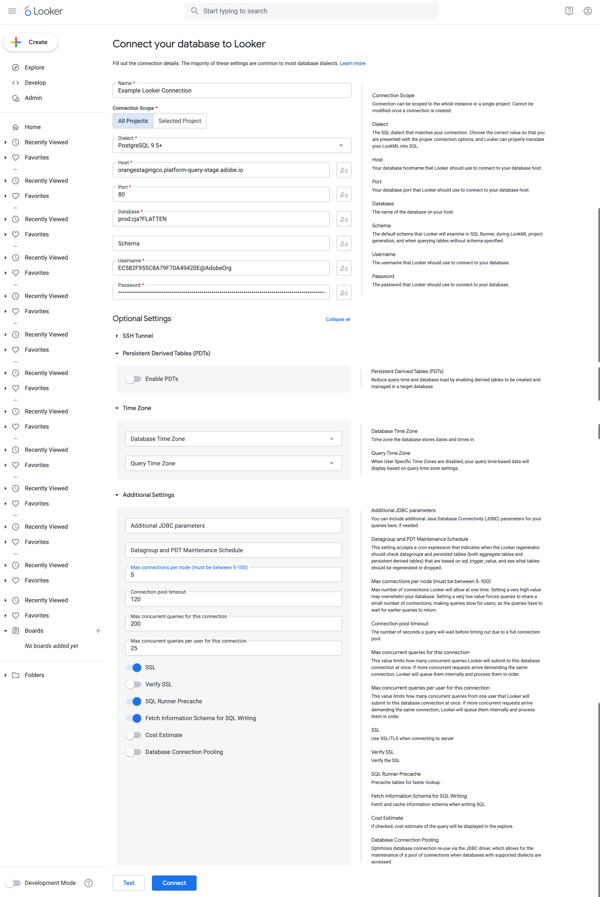
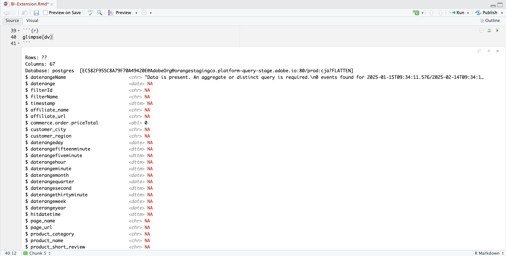

# 接続と検証


このユースケースでは、BI ツールからCustomer Journey Analyticsへの接続を設定し、使用可能なデータビューを一覧表示して、使用するデータビューを選択します。

+++ Customer Journey Analytics

手順は、次のオブジェクトを持つ環境の例を参照します。

* データビュー：**[!UICONTROL C&amp;C - データビュー]** 🅐。
* ディメンション：**[!UICONTROL 製品名]** 🅑および&#x200B;**[!UICONTROL 製品カテゴリ]** 🅒。
* 指標：**[!UICONTROL 購入収益]** 🅓および&#x200B;**[!UICONTROL 購入]** 🅔。
* フィルター：**[!UICONTROL 釣り製品]** 🅕。


ユースケースを実行する場合は、これらのサンプルオブジェクトを特定の環境に適したオブジェクトに置き換えます。

+++

+++ BI ツール

>[!BEGINTABS]

>[!TAB Power BI デスクトップ ]

1. Experience Platform Query Service UIから必要な資格情報とパラメーターにアクセスします。

   1. Experience Platform サンドボックスに移動します。
   1. 左側のパネルから「 **[!UICONTROL クエリ]**」を選択します。
   1. **[!UICONTROL クエリ]** インターフェイスで「**[!UICONTROL 資格情報]**」タブを選択します。
   1. 「**[!UICONTROL データベース]**」ドロップダウンメニューから「`prod:cja`」を選択します。

      

1. Power BI Desktopを起動します。
   1. メインインターフェイスから、**[!UICONTROL 他のソースからデータを取得]**&#x200B;を選択します。
   1. **[!UICONTROL データを取得]** ダイアログで、次の操作を行います。
      
      1. **[!UICONTROL PostgreSQL データベース]**&#x200B;を検索して選択します。
      1. **[!UICONTROL Connect]**&#x200B;を選択します。
   1. **[!UICONTROL PostgreSQL データベース]** ダイアログで、次の操作を行います。
      
      1. を使用して、**[!UICONTROL Host]**&#x200B;および&#x200B;**[!UICONTROL Port]**&#x200B;の値をExperience Platform **[!UICONTROL Query]** **[!UICONTROL 期限切れ資格情報]** パネルからコピーして貼り付けます。このパネルは、**[!UICONTROL Server]**&#x200B;の値として`:`で区切られています。 例：`examplecompany.platform-query.adobe.io:80`。
      1. を使用して、Experience Platform **[!UICONTROL Query]** **[!UICONTROL 期限切れの資格情報]** パネルから&#x200B;**[!UICONTROL Database]**&#x200B;値をコピーして貼り付けます。 貼り付ける値に`?FLATTEN`を追加します。 例：`prod:cja?FLATTEN`。
      1. **[!UICONTROL DirectQuery]**&#x200B;を&#x200B;**[!UICONTROL データ接続モード]**&#x200B;として選択します。
      1. **[!UICONTROL OK]**&#x200B;を選択します。
   1. **[!UICONTROL PostgreSQL データベース]** - **[!UICONTROL データベース]** ダイアログで、次の操作を行います。
      
      1. を使用して、**[!UICONTROL ユーザー名]**&#x200B;および&#x200B;**[!UICONTROL パスワード]** フィールドのExperience Platform **[!UICONTROL クエリ]** **[!UICONTROL 期限切れ資格情報]** パネルから&#x200B;**[!UICONTROL ユーザー名]**&#x200B;および&#x200B;**[!UICONTROL パスワード]**&#x200B;の値をコピーします。 有効期限のない資格情報[を使用している場合は、有効期限のない資格情報のパスワードを使用します。](https://experienceleague.adobe.com/ja/docs/experience-platform/query/ui/credentials?lang=en#use-credential-to-connect)
      1. **[!UICONTROL これらの設定を]**&#x200B;に適用するレベルを選択するドロップダウンメニューが、前に定義した&#x200B;**[!UICONTROL サーバー]**&#x200B;に設定されていることを確認します。
      1. **[!UICONTROL Connect]**&#x200B;を選択します。
   1. **[!UICONTROL ナビゲーター]** ダイアログで、データビューが取得されます。この取得には時間がかかる場合があります。取得すると、Power BI デスクトップに次が表示されます。
      
      1. 左側のパネルのリストから&#x200B;**[!UICONTROL public.cc_data_view]**&#x200B;を選択します。
      1. 選択肢は次の2つです。
         1. 「**[!UICONTROL 読み込み]**」を選択して続行し、設定を完了します。
         1. 「**[!UICONTROL データを変換]**」を選択します。オプションで設定の一部として変換を適用できるダイアログが表示されます。
            
            * **[!UICONTROL 閉じて適用]**&#x200B;を選択します。
   1. しばらくすると、**[!UICONTROL public.cc_data_view]**&#x200B;が&#x200B;**[!UICONTROL Data]** ペインに表示されます。を選択して、ディメンションと指標を表示します。
      


## 平らにするか否か

Power BI Desktopは、`FLATTEN` パラメーターに対して次のシナリオをサポートしています。 詳しくは、[&#x200B; ネストされたデータの統合](https://experienceleague.adobe.com/ja/docs/experience-platform/query/key-concepts/flatten-nested-data)を参照してください。

| FLATTEN パラメーター | 例 | サポート | 備考 |
|---|---|:---:|---|
| なし | `prod:cja` |  | |
| `?FLATTEN` | `prod:cja?FLATTEN` |  | **使用する推奨オプション！** |
| `%3FFLATTEN` | `prod:cja%3FFLATTEN` |  | Power BI デスクトップにエラーが表示されます：**[!UICONTROL 指定された資格情報で認証できませんでした。 もう一度やり直してください。]** |

### 詳細情報

* [前提条件](/help/data-views/bi-extension.md#prerequisites)
* [資格情報ガイド](https://experienceleague.adobe.com/ja/docs/experience-platform/query/ui/credentials)
* [Power BIをQuery Serviceに接続](https://experienceleague.adobe.com/ja/docs/experience-platform/query/clients/power-bi)。


>[!TAB Tableau Desktop]

1. Experience Platform Query Service UIから必要な資格情報とパラメーターにアクセスします。

   1. Experience Platform サンドボックスに移動します。
   1. 左側のパネルから「 **[!UICONTROL クエリ]**」を選択します。
   1. **[!UICONTROL クエリ]** インターフェイスで「**[!UICONTROL 資格情報]**」タブを選択します。
   1. 「**[!UICONTROL データベース]**」ドロップダウンメニューから「`prod:cja`」を選択します。

      

1. Tableauを起動します。
   1. **[!UICONTROL の下の左側のパネルから**&#x200B;[!UICONTROL &#x200B; PostgreSQL &#x200B;]&#x200B;**を選択して、サーバー]**&#x200B;に移動します。利用できない場合は、**[!UICONTROL その他…]**&#x200B;を選択し、**[!UICONTROL インストール済みコネクタ]**&#x200B;から&#x200B;**[!UICONTROL PostgreSQL]**&#x200B;を選択します。
      
   1. **[!UICONTROL PostgreSQL]** ダイアログの「**[!UICONTROL 一般]**」タブ：
      
      1. を使用して、**[!UICONTROL ホスト]**&#x200B;をExperience Platform **[!UICONTROL クエリ]** **[!UICONTROL 期限切れ資格情報]** パネルから&#x200B;**[!UICONTROL サーバー]**&#x200B;にコピーして貼り付けます。
      1. を使用して、**[!UICONTROL ポート]**&#x200B;をExperience Platform **[!UICONTROL クエリ]** **[!UICONTROL 期限切れ資格情報]** パネルから&#x200B;**[!UICONTROL ポート]**&#x200B;にコピーして貼り付けます。
      1. を使用して、**[!UICONTROL データベース]**&#x200B;をExperience Platform **[!UICONTROL クエリ]** **[!UICONTROL 期限切れ資格情報]** パネルから&#x200B;**[!UICONTROL データベース]**&#x200B;にコピーして貼り付けます。 貼り付ける値に`%3FFLATTEN`を追加します。 例：`prod:cja%3FFLATTEN`。
      1. 「**[!UICONTROL 認証]**」ドロップダウンメニューから「**[!UICONTROL ユーザー名とパスワード]**」を選択します。
      1. を使用して、**[!UICONTROL ユーザー名]**&#x200B;をExperience Platform **[!UICONTROL クエリ]** **[!UICONTROL 期限切れ資格情報]** パネルから&#x200B;**[!UICONTROL ユーザー名]**&#x200B;にコピーして貼り付けます。
      1. を使用して、**[!UICONTROL パスワード]**&#x200B;をExperience Platform **[!UICONTROL クエリ]** **[!UICONTROL 期限切れ資格情報]** パネルから&#x200B;**[!UICONTROL パスワード]**&#x200B;にコピーして貼り付けます。 有効期限のない資格情報[を使用している場合は、有効期限のない資格情報のパスワードを使用します。](https://experienceleague.adobe.com/ja/docs/experience-platform/query/ui/credentials?lang=en#use-credential-to-connect)
      1. 「**[!UICONTROL SSLを必要とする]**」がオンになっていることを確認します。
      1. 「**[!UICONTROL ログイン]**」を選択します。

      Tableau Desktopが接続を検証する間、**[!UICONTROL 進行状況リクエスト]** ダイアログが表示されます。
   1. メインウィンドウの左側のペインに&#x200B;**[!UICONTROL Data Source]** ページが表示されます。
      * **[!UICONTROL Connections]**&#x200B;の下にある接続の名前。
      * データベース名（**[!UICONTROL Database]**&#x200B;の下）。
      * **[!UICONTROL Table]**&#x200B;の下にあるテーブルのリスト。
        
      1. **[!UICONTROL cc_data_view]** エントリをドラッグし、**[!UICONTROL テーブルをドラッグ]**&#x200B;と読み取れるメインビューにエントリをここにドロップします。
   1. メインウィンドウには、**[!UICONTROL cc_data_view]** データビューの詳細が表示されます。
      

## 平らにするか否か

Tableau Desktopは、`FLATTEN` パラメーターに対して次のシナリオをサポートしています。 詳しくは、[&#x200B; ネストされたデータの統合](https://experienceleague.adobe.com/ja/docs/experience-platform/query/key-concepts/flatten-nested-data)を参照してください。

| FLATTEN パラメーター | 例 | サポート | 備考 |
|---|---|:---:|---|
| なし | `prod:cja` |  | |
| `?FLATTEN` | `prod:cja?FLATTEN` |  | |
| `%3FFLATTEN` | `prod:cja%3FFLATTEN` |  | **使用するオプションをお勧めします**。 注意：`%3FFLATTEN`は`?FLATTEN`のURL エンコード版です。 |

## 詳細情報

* [前提条件](/help/data-views/bi-extension.md#prerequisites)
* [資格情報ガイド](https://experienceleague.adobe.com/ja/docs/experience-platform/query/ui/credentials)
* [Tableau Desktopをクエリ サービスに接続](https://experienceleague.adobe.com/ja/docs/experience-platform/query/clients/tableau)。


>[!TAB Looker]

1. Experience Platform Query Service UIから必要な資格情報とパラメーターにアクセスします。

   1. Experience Platform サンドボックスに移動します。
   1. 左側のパネルから「 **[!UICONTROL クエリ]**」を選択します。
   1. **[!UICONTROL クエリ]** インターフェイスで「**[!UICONTROL 資格情報]**」タブを選択します。
   1. 「**[!UICONTROL データベース]**」ドロップダウンメニューから「`prod:cja`」を選択します。

      

1. Lookerにログイン

   1. 左側のパネルから「**[!UICONTROL 管理]**」を選択します。
   1. 「**[!UICONTROL 接続]**」を選択します。
   1. 「**[!UICONTROL 接続を追加]**」を選択します。
   1. **[!UICONTROL Looker画面にデータベースを接続]**&#x200B;します。

      

      1. 接続の&#x200B;**[!UICONTROL 名前]**&#x200B;を入力します（例：`Example Looker Connection`）。
      1. **[!UICONTROL すべてのプロジェクト]**&#x200B;が&#x200B;**[!UICONTROL 接続スコープ]**&#x200B;として選択されていることを確認します。
      1. ダイアレクトとして&#x200B;**[!UICONTROL PostgreSQL 9.5+]**&#x200B;を選択します。
      1. を使用して、Experience Platform **[!UICONTROL Query]** **[!UICONTROL 資格情報の有効期限]** パネルから&#x200B;**[!UICONTROL Host]**&#x200B;値を&#x200B;**[!UICONTROL Host]**&#x200B;の値としてコピーして貼り付けます。 例：`examplecompany.platform-query.adobe.io`。
      1. を使用して、Experience Platform **[!UICONTROL Query]** **[!UICONTROL 資格情報の有効期限]** パネルから&#x200B;**[!UICONTROL Port]**&#x200B;値を&#x200B;**[!UICONTROL Port]**&#x200B;の値としてコピーして貼り付けます。 例：`80`。
      1. を使用して、Experience Platform **[!UICONTROL Query]** **[!UICONTROL 期限切れ資格情報]** パネルから&#x200B;**[!UICONTROL Database]**&#x200B;値を&#x200B;**[!UICONTROL Database]**&#x200B;の値としてコピーして貼り付けます。 貼り付ける値に`%3FFLATTEN`を追加します。 例：`prod:cja%3FFLATTEN`。
      1. を使用して、Experience Platform **[!UICONTROL Query]** **[!UICONTROL 期限切れ資格情報]** パネルから&#x200B;**[!UICONTROL Username]**&#x200B;値を&#x200B;**[!UICONTROL Username]**&#x200B;の値としてコピーして貼り付けます。
      1. を使用して、Experience Platform **[!UICONTROL Query]** **[!UICONTROL 期限切れ資格情報]** パネルの&#x200B;**[!UICONTROL Password]**&#x200B;値を&#x200B;**[!UICONTROL Password]**&#x200B;の値としてコピーして貼り付けます。
      1. **[!UICONTROL すべて展開]**&#x200B;を&#x200B;**[!UICONTROL オプション設定]**&#x200B;で選択します。
      1. ノードごとの&#x200B;**[!UICONTROL 最大接続]**&#x200B;を`5`に設定します。
      1. **[!UICONTROL SSL]**&#x200B;が有効になっていることを確認します。
      1. 接続をテストするには、**[!UICONTROL テスト]**&#x200B;を選択します。 「**[!UICONTROL 成功、JDBCを接続できます]**」などのメッセージが表示されたバナーが画面の上部に表示さ…ます。
      1. 接続を確立して保存するには、**[!UICONTROL 接続]**&#x200B;を選択します。
   1. 新しい接続が&#x200B;**[!UICONTROL Connections]** インターフェイスに表示されます。
   1. **[!UICONTROL 管理者]**&#x200B;から&#x200B;**←**&#x200B;を選択して、左側のパネルのメインナビゲーションに移動します。
   1. **[!UICONTROL 現像]**&#x200B;を選択します。
   1. **[!UICONTROL プロジェクト]**&#x200B;を選択します。
   1. LookML プロジェクトで「**[!UICONTROL 新しいモデル]**」を選択します。
   1. ほかのユーザーに影響を与えないようにすることができます。 プロンプトが表示されたら、「開発モードに入る」を選択します。
   1. **[!UICONTROL Create Model]** エクスペリエンス：
      1. **[!UICONTROL ➊で「データベース接続]**」を選択します。
         1. **[!UICONTROL データベース接続を選択]**&#x200B;します。 例：**[!UICONTROL example_looker_connection]**。
         1. **[!UICONTROL でプロジェクトに名前を付けます。このモデル用に新しいLookML プロジェクトを作成します]**。 `example: example_looker_project`の場合。
         1. 「**[!UICONTROL 次へ]**」を選択します。
      1. **[!UICONTROL ➋でテーブルを選択]**:
         1. **[!UICONTROL public]**&#x200B;を選択し、Customer Journey Analytics データビューが選択されていることを確認します。 例： **[!UICONTROL cc_data_view]**。
         1. 「**[!UICONTROL 次へ]**」を選択します。
      1. **[!UICONTROL ➌でプライマリキーを選択]**:
         1. 「**[!UICONTROL 次へ]**」を選択します。
      1. **[!UICONTROL ➍で「作成するエクスプローラー」を選択]**:
         1. ビューを選択します。 例：**[!UICONTROL cc_data_view.view]**。
         1. 「**[!UICONTROL 次へ]**」を選択します。
      1. **[!UICONTROL ➎にモデル名]**&#x200B;と入力します。
         1. モデルに名前を付けます。 例：`example_looker_model`。
      1. 「**[!UICONTROL 完了してデータを探索]**」を選択します。

   Lookerの&#x200B;**[!UICONTROL Explore]** インターフェイスにリダイレクトされ、データを探索する準備が整います。


## 平らにするか否か

Lookerは、`FLATTEN` パラメーターに対して次のシナリオをサポートしています。 詳しくは、[&#x200B; ネストされたデータの統合](https://experienceleague.adobe.com/ja/docs/experience-platform/query/key-concepts/flatten-nested-data)を参照してください。

| FLATTEN パラメーター | 例 | サポート | 備考 |
|---|---|:---:|---|
| なし | `prod:cja` |  | |
| `?FLATTEN` | `prod:cja?FLATTEN` |  | |
| `%3FFLATTEN` | `prod:cja%3FFLATTEN` |  | **使用するオプションをお勧めします**。 注意：`%3FFLATTEN`は`?FLATTEN`のURL エンコード版です。 |

## 詳細情報

* [前提条件](/help/data-views/bi-extension.md#prerequisites)
* [資格情報ガイド](https://experienceleague.adobe.com/ja/docs/experience-platform/query/ui/credentials)


>[!TAB Jupyter Notebook]

1. Experience Platform Query Service UIから必要な資格情報とパラメーターにアクセスします。

   1. Experience Platform サンドボックスに移動します。
   1. 左側のパネルから「 **[!UICONTROL クエリ]**」を選択します。
   1. **[!UICONTROL クエリ]** インターフェイスで「**[!UICONTROL 資格情報]**」タブを選択します。
   1. 「**[!UICONTROL データベース]**」ドロップダウンメニューから「`prod:cja`」を選択します。

      

1. Jupyter Notebook環境を実行するための専用のPython仮想環境を設定していることを確認します。
1. 必要なライブラリが仮想環境にインストールされていることを確認します。
   * ipython-sql: `pip install ipython-sql`。
   * psycopg2-binary: `pip install psycopg-binary`。
   * sqlalchemy: pip `install sqlalchemy`。

1. 仮想環境からJupyter Notebookを開始：`jupyter notebook`。
1. 新しいノートブックを作成するか、[このサンプル ノートブック &#x200B;](../assets/BI-Extension.ipynb.zip)をダウンロードします。
1. 最初のセルに、次のように入力して実行します。

   ```
   %config SqlMagic.style = '_DEPRECATED_DEFAULT'
   ```

1. 新しいセルに、接続の設定パラメーターを入力します。 を使用して、Experience Platform **[!UICONTROL クエリ]** **[!UICONTROL 期限切れ資格情報]** パネルから設定パラメーターに必要な値をコピーして貼り付けます。 次に例を示します。

   ```
   import ipywidgets as widgets
   from IPython.display import display
   
   config_host = widgets.Text(description='Host:', value='example.platform-query-stage.adobe.io',
                           layout=widgets.Layout(width="600px"))
   display(config_host)
   config_port = widgets.IntText(description='Port:', value=80,
                              layout=widgets.Layout(width="200px"))
   display(config_port)
   config_db = widgets.Text(description='Database:', value='prod:cja',
                         layout=widgets.Layout(width="300px"))
   display(config_db)
   config_username = widgets.Text(description='Username:', value='EC582F955C8A79F70A49420E@AdobeOrg',
                               layout=widgets.Layout(width="600px"))
   display(config_username)
   config_password = widgets.Password(description='Password:', value='***',
                                   layout=widgets.Layout(width="600px"))
   display(config_password)
   ```

1. セルを実行します。
1. を使用して、Experience Platform **[!UICONTROL クエリ]** **[!UICONTROL 期限切れ資格情報]** パネルからJupyter Notebookの&#x200B;**[!UICONTROL Password]** フィールドにパスワードをコピーして貼り付けます。

   

1. 新しいセルにステートメントを入力して、SQL拡張機能、必要なライブラリを読み込み、Customer Journey Analyticsに接続します。

   ```python
   %load_ext sql
   from sqlalchemy import create_engine
   %sql postgresql://{config_username.value}:{config_password.value}@{config_host.value}:{config_port.value}/{config_db.value}?sslmode=require
   ```

   シェルを実行します。 出力は表示されませんが、セルは警告なしで実行されます。

   

1. 新しい呼び出しで、ステートメントを入力して、接続に基づいて使用可能なデータビューのリストを取得します。

   ```python
   %%sql
   SELECT n.nspname as "Schema",
      c.relname as "Name",
      CASE c.relkind WHEN 'r' THEN 'table' WHEN 'v' THEN 'view' WHEN 'm' THEN 'materialized view' WHEN 'i' THEN 'index' WHEN 'S' THEN 'sequence' WHEN 's' THEN 'special' WHEN 't' THEN 'TOAST table' WHEN 'f' THEN 'foreign table' WHEN 'p' THEN 'partitioned table' WHEN 'I' THEN 'partitioned index' END as "Type",
      pg_catalog.pg_get_userbyid(c.relowner) as "Owner"
   FROM pg_catalog.pg_class c
   LEFT JOIN pg_catalog.pg_namespace n ON n.oid = c.relnamespace
   WHERE c.relkind IN ('v','')
      AND n.nspname <> 'pg_catalog'
      AND n.nspname !~ '^pg_toast'
      AND n.nspname <> 'information_schema'
      AND pg_catalog.pg_table_is_visible(c.oid)
      AND c.relname NOT LIKE '%test%'
      AND c.relname NOT LIKE '%ajo%'
   ORDER BY 1,2;
   ```

   シェルを実行します。 以下のスクリーンショットに似た出力が表示されるはずです。

   

   データビューのリストに&#x200B;**[!UICONTROL cc_data_view]**&#x200B;が表示されます。

## 平らにするか否か

Jupyter Notebookは、`FLATTEN` パラメーターに対して次のシナリオをサポートしています。 詳しくは、[&#x200B; ネストされたデータの統合](https://experienceleague.adobe.com/ja/docs/experience-platform/query/key-concepts/flatten-nested-data)を参照してください。

| FLATTEN パラメーター | 例 | サポート | 備考 |
|---|---|:---:|---|
| なし | `prod:cja` |  | |
| `?FLATTEN` | `prod:cja?FLATTEN` |  | |
| `%3FFLATTEN` | `prod:cja%3FFLATTEN` |  | **使用するオプションをお勧めします**。 注意：`%3FFLATTEN`は`?FLATTEN`のURL エンコード版です。 |

## 詳細情報

* [前提条件](/help/data-views/bi-extension.md#prerequisites)
* [資格情報ガイド](https://experienceleague.adobe.com/ja/docs/experience-platform/query/ui/credentials)

>[!TAB RStudio]

1. Experience Platform Query Service UIから必要な資格情報とパラメーターにアクセスします。

   1. Experience Platform サンドボックスに移動します。
   1. 左側のパネルから「 **[!UICONTROL クエリ]**」を選択します。
   1. **[!UICONTROL クエリ]** インターフェイスで「**[!UICONTROL 資格情報]**」タブを選択します。
   1. 「**[!UICONTROL データベース]**」ドロップダウンメニューから「`prod:cja`」を選択します。

      

1. RStudioを起動します。
1. 新しいR Markdown ファイルを作成するか、[このR Markdown ファイルの例](../assets/BI-Extension.Rmd.zip)をダウンロードします。
1. 最初のチャンクに、次のステートメントを入力します。 を使用して、Experience Platform **[!UICONTROL クエリ]** **[!UICONTROL 期限切れ資格情報]** パネルから値をコピーして、`host`、`dbname`、`user`など、様々なパラメーターに必要な値に貼り付けます。 次に例を示します。

   ```R
   library(rstudioapi)
   library(DBI)
   library(dplyr)
   library(tidyr)
   library(RPostgres)
   library(ggplot2)
   
   host <- rstudioapi::showPrompt(title = "Host", message = "Host", default = "orangestagingco.platform-query-stage.adobe.io")
   dbname <- rstudioapi::showPrompt(title = "Database", message = "Database", default = "prod:cja?FLATTEN")
   user <- rstudioapi::showPrompt(title = "Username", message = "Username", default = "EC582F955C8A79F70A49420E@AdobeOrg")
   password <- rstudioapi::askForPassword(prompt = "Password")
   ```

1. チャンクを実行します。 **[!UICONTROL ホスト]**、**[!UICONTROL データベース]**、**[!UICONTROL ユーザー]**&#x200B;の入力を求められます。 前の手順で指定した値を受け入れるだけです。
1. を使用して、Experience Platform **[!UICONTROL クエリ]** **[!UICONTROL 期限切れ資格情報]** パネルからRStudioの&#x200B;**[!UICONTROL パスワード]** ダイアログプロンプトにパスワードをコピーして貼り付けます。

   

1. 新しいチャンクを作成し、次のステートメントを入力します。

   ```R
   con <- dbConnect(
      RPostgres::Postgres(),
      host = host,
      port = 80,
      dbname = dbname,
      user = user,
      password = password,
      sslmode = 'require'
   )
   ```

1. チャンクを実行します。 接続が成功した場合は、出力が表示されません。


1. 新しいチャンクを作成し、次のステートメントを入力します。

   ```R
   views <- dbListTables(con)
   print(views)
   ```

1. チャンクを実行します。 `character(0)`が唯一の出力として表示されます。


1. 新しいチャンクを作成し、次のステートメントを入力します。

   ```R
   glimpse(dv)
   ```

1. チャンクを実行します。 以下のスクリーンショットに似た出力が表示されるはずです。

   

## 平らにするか否か

RStudioは、`FLATTEN` パラメーターに対して次のシナリオをサポートしています。 詳しくは、[&#x200B; ネストされたデータの統合](https://experienceleague.adobe.com/ja/docs/experience-platform/query/key-concepts/flatten-nested-data)を参照してください。

| FLATTEN パラメーター | 例 | サポート | 備考 |
|---|---|:---:|---|
| なし | `prod:cja` |  | |
| `?FLATTEN` | `prod:cja?FLATTEN` |  | **使用するオプションをお勧めします**。 |
| `%3FFLATTEN` | `prod:cja%3FFLATTEN` |  | |

## 詳細情報

* [前提条件](/help/data-views/bi-extension.md#prerequisites)
* [資格情報ガイド](https://experienceleague.adobe.com/ja/docs/experience-platform/query/ui/credentials)

>[!ENDTABS]

+++
