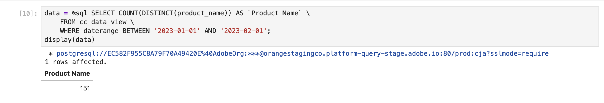

# 個別の値のディメンションのカウント


このユースケースでは、2023 年 1 月中にレポートされた製品名のユニーク数を取得します。

+++ Customer Journey Analytics

商品名の個別カウントについてレポートするには、Customer Journey Analyticsで、**[!UICONTROL タイトル]**`Product Name (Count Distinct)` と **[!UICONTROL 外部 ID]**`product_name_count_distinct` を使用する計算指標を設定します。


次に、その指標をユースケースの例の **[!UICONTROL 個別のDimension値をカウント]** パネルで使用できます。


+++

+++ BI ツール

>[!PREREQUISITES]
>
>このユースケースを試す BI ツールについて、[ 接続に成功し、データビューをリストし、データビューを使用できる ](connect-and-validate.md) ことを検証したことを確認します。
>

>[!BEGINTABS]

>[!TAB Power BI デスクトップ ]

1. 日付範囲をすべてのビジュアライゼーションに確実に適用するには、**[!UICONTROL データ]** パネルからこのページの **[!UICONTROL フィルター]** に **[!UICONTROL daterangeday]** をドラッグ&amp;ドロップします。
   1. **[!UICONTROL このページのフィルター]** から **[!UICONTROL daterangeday is （すべて）]** を選択します。
   1. **[!UICONTROL フィルタータイプ]** として「**[!UICONTROL 詳細フィルタリング]**」を選択します。
   1. **[!UICONTROL 値が次の値の場合に項目を表示]****[!UICONTROL が次の値以上の場合に項目を表示]**`1/1/2023`**[!UICONTROL および]****[!UICONTROL が次の値の前]**`2/1/2023` のフィルターを定義してください。
   1. 「**[!UICONTROL フィルターを適用]**」を選択します。

1. **[!UICONTROL データ]** ペインで、次の操作を行います。
   1. **[!UICONTROL datarangeday]** を選択します。
   1. Customer Journey Analyticsで定義された計算指標である **[!UICONTROL sum cm_product_name_count_distinct]** を選択します。

1. 縦棒グラフをテーブルに変更するには、グラフが選択されていることを確認し、**[!UICONTROL ビジュアライゼーション]** ペインから **[!UICONTROL テーブル]** を選択します。

   Power BI デスクトップは次のようになります。

   

1. テーブルビジュアライゼーションを選択します。 コンテキストメニューから **[!UICONTROL コピー]**/**[!UICONTROL ビジュアルをコピー]** を選択します。
1. **[!UICONTROL ctrl+v]** を使用してビジュアライゼーションを貼り付けます。 ビジュアライゼーションの正確なコピーが元のコピーと重なります。 レポート領域で右に移動します。
1. コピーしたビジュアライゼーションをテーブルからカードに変更するには、**[!UICONTROL ビジュアライゼーション]** から **[!UICONTROL カード]** を選択します。

   Power BI デスクトップは次のようになります。

   

または、Power BIの個別カウント機能を使用できます。

1. **[!UICONTROL product_name]** ディメンションを選択します。
1. **[!UICONTROL Count （Distinct）]** 関数を **[!UICONTROL Columns]** の **[!UICONTROL product_name]** ディメンションに適用します。

   


>[!TAB Tableau Desktop]

1. 下部にある「**[!UICONTROL シート 1]**」タブを選択して、「**[!UICONTROL データソース]**」から切り替えます。 **[!UICONTROL シート 1]** ビューで、次の操作を行います。
   1. **[!UICONTROL データ]** ペインの **[!UICONTROL テーブル]** リストから **[!UICONTROL Daterange]** エントリをドラッグし、**[!UICONTROL フィルター]** シェルフにドロップします。
   1. **[!UICONTROL フィルターフィールド \[Daterange\]]** ダイアログで **[!UICONTROL 日付範囲]** を選択して **[!UICONTROL 次へ >]** を選択します。
   1. **[!UICONTROL フィルター\[Daterange\]]** ダイアログで **[!UICONTROL 日付範囲]** を選択し、`01/01/2023` - `31/1/2023` を選択します。 **[!UICONTROL 適用]** および **[!UICONTROL OK]** を選択します。
   1. **[!UICONTROL Cm 製品名の個別カウント]** を **[!UICONTROL 行]** にドラッグします。 値が「**[!UICONTROL SUM （Cm Product Name Count Distinct）]**」に変わります。 このフィールドは、Customer Journey Analyticsで定義した計算指標です。
   1. **[!UICONTROL Daterangeday]** をドラッグして、「**[!UICONTROL 列]** の横にドロップします。 **[!UICONTROL Daterangeday]** を選択し、ドロップダウンメニューから **[!UICONTROL Day]** を選択します。
   1. 折れ線グラフのビジュアライゼーションをテーブルに変更するには、「**[!UICONTROL 表示]**」から「**[!UICONTROL テキストテーブル]**」を選択します。
   1. ツールバーの **[!UICONTROL 行と列を入れ替える]** を選択します。
   1. **[!UICONTROL フィット]** ドロップダウンメニューから **[!UICONTROL フィット幅]** を選択します。

      Tableau Desktop は次のようになります。

      

1. [**[!UICONTROL シート 1]**] タブの右クリック メニューから **[!UICONTROL 複製]** を選択し、2 番目のシートを作成します。
1. [**[!UICONTROL シート 1]**] タブの右クリック メニューから **[!UICONTROL 名前変更]** を選択して、シートの名前を `Data` に変更します。
1. **[!UICONTROL シート 1 （2）]** タブの右クリック メニューから **[!UICONTROL 名前変更]** を選択して、シートの名前を `Card` に変更します。

1. **[!UICONTROL カード]** ビューが選択されていることを確認します。
1. 「**[!UICONTROL DAY （Daterangeday）]**」を選択し、ドロップダウンメニューから「**[!UICONTROL 月]**」を選択します。 値が「**[!UICONTROL MONTH （Daterangeday）]**」に変わります。
1. **[!UICONTROL マーク]** で **[!UICONTROL SUM （Cm Product Name Count Distinct）]** を選択し、ドロップダウンメニューから **[!UICONTROL 形式]** を選択します。
1. フォントサイズを変更するには、**[!UICONTROL Format SUM （CM Product Name Count Distinct）]** ペインで、「**[!UICONTROL デフォルト]**」内の「**[!UICONTROL フォント]**」を選択し、フォントサイズとして「**[!UICONTROL 72]**」を選択します。
1. 数値を整列するには、「**[!UICONTROL 整列]**」の横にある「**[!UICONTROL 自動]** を選択し、「**[!UICONTROL 水平]** を中央揃えに設定します。
1. 整数を使用するには、「**[!UICONTROL 数値]**」の横の「**[!UICONTROL 123.456]**」を選択し、「**[!UICONTROL 数値（カスタム）]**」を選択します。 **[!UICONTROL 小数点以下の桁数]** を `0` に設定します。

   Tableau Desktop は次のようになります。

   

1. **[!UICONTROL 新規ダッシュボード]**」タブボタン（下部）を選択して、新しい **[!UICONTROL ダッシュボード 1]** ビューを作成します。 **[!UICONTROL ダッシュボード 1]** ビューで、次の操作を行います。
   1. **[!UICONTROL Sheets]** シェルフから **[!UICONTROL Card]** シートを **[!UICONTROL ここにシートをドロップ]** と表示される *Dashboard 1* ビューにドラッグ&amp;ドロップします。
   1. **[!UICONTROL データ]** シートを、**[!UICONTROL カード]** シートの下にある **[!UICONTROL シート]** シェルフから **[!UICONTROL ダッシュボード 1]** ビューにドラッグ&amp;ドロップします。

   **[!UICONTROL ダッシュボード 1]** ビューは次のようになります。

   


または、Tableau Desktop の個別カウント機能を使用することもできます。

1. **[!UICONTROL Cm の製品名の個別カウント]** ではなく **[!UICONTROL 製品名]** を使用します。
1. **[!UICONTROL Marks]** の **[!UICONTROL 製品名]** に **[!UICONTROL Measure]** > **[!UICONTROL Count （Distinct）]** を適用します。

   


>[!TAB Looker]

1. Looker の **[!UICONTROL 探索]** インターフェイスで、クリーンな設定ができていることを確認します。 そうでない場合は、「**[!UICONTROL フィールドとフィルターを削除]**」を選択します。
1. **[!UICONTROL フィルター]** の下の「**[!UICONTROL + フィルター]** を選択します。
1. **[!UICONTROL フィルターを追加]** ダイアログで、次の手順を実行します。
   1. 「**[!UICONTROL ‣ Cc データビュー」を選択します]**
   1. フィールドのリストから、「**[!UICONTROL ‣Daterange Date」を選択し]** 「**[!UICONTROL Daterange Date]**」を選択します。
      
1. **[!UICONTROL CC データビュー日付範囲]** フィルターを **[!UICONTROL 範囲内]** **[!UICONTROL 2023/01/01]****[!UICONTROL 前）まで]** **[!UICONTROL 2023/02/01]** として指定します。
1. 左側のパネルの「**[!UICONTROL ‣ Cc データビュー]**」セクションから、
   1. **[!UICONTROL Daterange Date]** を選択してから、**[!UICONTROL Date]** を選択します。
   1. **[!UICONTROL 製品名]** の「**⋮詳細**」コンテキストメニューから「**[!UICONTROL 個別‣カウントを集計]**」を選択します。
      
1. 「**[!UICONTROL 実行]**」を選択します。
1. 「**[!UICONTROL ‣ ビジュアライゼーション]**」を選択し、ツールバーの「6︎⃣」を選択して 1 つの値のビジュアライゼーションを表示します。

以下に示すようなビジュアライゼーションとテーブルが表示されます。


>[!TAB Jupyter Notebook]

1. 新しいセルに次のステートメントを入力します。

   ```
   data = %sql SELECT COUNT(DISTINCT(product_name)) AS `Product Name` \
      FROM cc_data_view \
      WHERE daterange BETWEEN '2023-01-01' AND '2023-02-01';
   display(data)
   ```

1. セルを実行します。 以下のスクリーンショットのような出力が表示されます。

   


>[!TAB RStudio]

1. 新しいチャンクで、` ```{r} ` と ` ``` ` の間に次のステートメントを入力します。

   ```R
   ## Count Distinct
   df <- dv %>%
      filter(daterange >= "2023-01-01" & daterange < "2023-02-01") %>%
      summarise(product_name_count_distinct = n_distinct(product_name))
   print(df)
   ```

1. チャンクを実行します。 以下のスクリーンショットのような出力が表示されます。

   


>[!ENDTABS]

+++

